이 글을 보시기전에 [앞 글](https://www.mimul.com/blog/about-neural-network/)을 보지 않았던 분들은 데이터 준비, 문제 유형, 전처리, 방법 선택: 모델 정의까지 설명한 것을 먼저 보시몀 좋을 거 같습니다. 그리고 여기에서는 학습 방법 설계: 모델 생성, 학습: 트레이닝, 평가, 테스트에 대해 설명할 예정입니다.

여기에서 사용된 python 코드는 [Github](https://github.com/mimul/playground/blob/main/examples/tf2_keras_neuralnetwork.ipynb)에 공유되어 있습니다.

### 학습 방법 설계: 모델 생성

여기에서는 손실함수, 최적화, 학습률에 대해 다룰 것이다.

**1. 손실함수**

[Playground](https://mimul.github.io/playground/#activation=tanh&activspacer=false&loss=mse&batchSize=1&batchFull=false&dataset=gauss&regDataset=reg-plane&learningRate=0.03&regularizationRate=0&noise=0&networkShape=3,3&seed=0.50144&showTrainData=true&showValidationData=false&showTestData=true&discretize=false&percTrainData=50&x=true&y=true&xTimesY=false&xSquared=false&ySquared=false&sinX=false&sinY=false&problem=classification&initOrigin=false&hideText=true&xSquared_hide=true&ySquared_hide=true&xTimesY_hide=true&sinX_hide=true&sinY_hide=true)에서 Mean Squared Error(평균 제곱 오차)를 선택한다. 평균 제곱 오차가 가장 대표적인 손실 함수이다. 분류 문제인지 회귀 문제인지에 따라 자주 사용되는 손실 함수에 차이가 있다. 선택지에서 주로 회귀, 2 클래스 분류, 다클래스 분류라고 하는 설명이 괄호안에 쓰여 있지만, 이는 차이를 나타낸 것이다. 

- 평균 제곱 오차(MSE, Mean Squared Error) : 회귀 문제에서 자주 사용하는 손실 함수
- 교차 엔트로피 오차(Cross Entropy Error) : 분류 문제에서 자주 사용하는 손실 함수

오차란? 어떠한 손실 함수도, 오차를 확인하기 위한 함수(입력을 받아 어떠한 계산을 하고 출력하는 것)라고 이해하면 된다. 오차(오류, error)는 말 그대로의 계산에서 얻은 값과 정답의 값에 사이의 어긋남을 의미한다. 기계 학습의 경우, 신경망의 모델에 입력한 값이 포워드 프로파게이션(순전파)에 의해 처리되어 출력된다. 그 출력 결과의 값과 정답을 나타내는 교사 라벨의 값이 얼마나 어긋나 있는지(오차)를 조사하는 것이다.

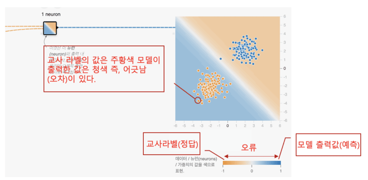

이후 모든 데이터에 대해 오차를 조사해 나가고 그것을 평균하면 모델의 평균적인 오차를 산출할 수 있다고 생각될 것이다. 그러나 실제는 그 계산 방법으로는 잘되지 않는다. 그리고 제곱을 하는 이유는 예를 들면 3개의 데이터가 있는데 각각의 오차가 +1.2, -1.0, -0.2였다고 하자. 평균적으로 정답으로부터 얼마나 엇갈리고 있는가를 보고 싶은 경우에 이것들을 단순하게 전부 합계해 데이터수의 3 으로 나누어 버리면 ```+1.2 - 1.0 - 0.2 = 0.0```이 되어 버린다. 즉 어긋남이 전혀 없게 되어 버린다. 이것은 다르다. 편차를 측정하기 위해서는 거리가 중요하기 때문에 마이너스는 플러스로서 계산, 즉 절대치화하여 계산할 필요가 있다. 이 작업을 수행하는 것이 평균 절대 오차(MAE, Mean Absolute Error)이다.

그러나 수학이나 통계학의 세계에서는 실은 절대치는 다루기 어렵다. 마이너스를 플러스로 하는 계산 방법으로서는 절대치 외에도 제곱 계산이 있다(예로 -2의 제곱은 +4가 된다). 그리고 제곱 계산에서는 특히 미분 계산이 하기 쉬워져 편리하다는 이점도 있다. 그 때문에 수학이나 통계학에서는 마이너스를 플러스로 하는 계산에는 제곱이 자주 이용되는 것이다. 오차를 제곱하고 나서 평균을 취하는 계산인 평균 제곱 오차는, 이러한 이유로 뉴럴 네트워크에서 대표적인 손실 함수가 되고 있다. 평균 제곱 오차와 같은 계산 결과의 수치를 손실(loss)이라고 한다. 이 손실을 구하기 위한 함수이기 때문에 손실 함수(Loss Function)라고 불리는 것이다.

평균 제곱 오차의 평균이란, 오차의 제곱합을 그 데이터수 로 나눈다는 것을 의미한다. 그러나 서적 등의 설명에 따라서는 2로 나누는, 이른바 1/2 제곱 합 오차(SSE, Sum of Squared Error)가 사용되고 있다. 이것은, 제곱한 변수를 미분했을 때에 계수로서 2가 나오므로 거기에 1/2을 곱하면 1이 되어 계산이 편해지는, 말하자면 매직 넘버인 것이다. 예를 들어 신경망의 학습을 풀 스크래치로 만들어 보는 경우, 이 1/2제곱합 오차를 사용하면 실제로 편하다. 덧붙여서, Playground의 손실 함수도 실은 평균 제곱 오차가 아니라 1/2제곱 합 오차를 이용하고 있다. 하지만, 여기에서는 코드 설명과의 일관성을 위해, 표기는 평균 제곱 오차로 한다.

그럼, 손실 함수로서 평균 제곱 오차(Mean Squared Error)를 코드로 구현해 보자. Keras에는 대표적인 손실 함수가 미리 준비되어 있어 문자열로 지정하면 된다.

```
LOSS = 'mean_squared_error'  # 손실 함수: 평균 제곱 오차
```

Playground에서 선택에 꼽고 있는 손실 함수는 Keras에서도 대응하고 있다. 

- mean_squared_error(평균 제곱 오차)
- mean_absolute_error(평균 절대 오차)
- binary_crossentropy(교차 엔트로피 오차: 2 클래스 분류)
- categorical_crossentropy(교차 엔트로피 오차: 다클래스 분류)

**2. 최적화**

Playground에서의 최적화 필드에서는 SGD를 선택한다. SGD 이외는 Playground에 구현되지 않아서 선택할 수 없다. 최적화(Optimization)는 말 그대로 가장 적합한 상태로 바꾸는 것이다. 그렇다면 신경망에서 가장 적합한 상태란 무엇인가?라고 하면 이전의 손실(loss)을 극한까지 최소화할 수 있는 것을 가리킨다. 즉, 이전의 손실 함수(평균 제곱 오차)의 결과의 수치를 가능한 한 0에 가깝게 하면 된다. 그 최적화 방법으로서, 다양한 방법(최적화 알고리즘)이 언급되고 있다. 그 기본이 경사법인 것이다.

그라디언트(경사, 기울기) 방법(Gradient Method)은 그라디언트(gradient) 즉, 언덕길을 내려가는(descent) 방식으로 계산하여 최적화를 수행하는 기술이다. 방금 선택한 SGD는 이 기울기 방법의 일종으로 확률적 경사 하강 방법(SGD, Stochastic Gradient Descent)을 의미한다. SGD는 최적화의 계산을 확률론을 이용해(stochastic) 실행하는 것으로 전부 일괄(배치)의 훈련 데이터가 아니고, 1개, 혹은 복수 세트(미니 배치)의 훈련 데이터로 학습해 그 단위마다 가중치나 바이어스를 갱신해 가는 방법이다(앞의 배치 사이즈에서 1을 선택한 이유는 이것이다). 

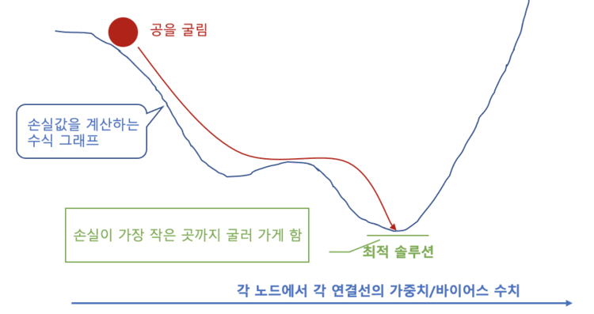

위 그림에서 청색 곡선은 기울기이다. 그 기울기의 선 위를 주황색의 공이 아래로 진행되도록 던졌다고 생각했을 때 던진(학습한) 횟수만큼 공은 진행되어 최종적으로 제일 낮은 위치(손실이 제일 작은 장소, 최적해)까지 굴러간다. 다만, 여기 환경은 무중력이며 중력에 의해 자동적으로 제일 낮은 위치로 굴러가는 것은 아니고 1회의 학습에 의해서 조금씩 위치를 바꾸어 간다고 이해하면 된다. 공을 던질 때에는 청색 곡선 위에 있는 현재 위치에서 보고 언덕길의 왼쪽이 내려갈 것인가 아니면 오른쪽이 내려갈 것인가를 판단, 수학적으로 말하면 기울기를 판단해, 좌우 어느쪽으로 볼을 움직일 것인가를 결정한다. 수학에서 곡선의 한 지점(공이 있는 위치)의 기울기는 미분으로 계산할 수 있다. 또한, 파라미터가 복수인 곡선의 기울기는 편미분에 의해 계산할 수 있다.

참고로 딥러닝의 학습에 있어서 편미분이 필수가 되는 것은 최적화의 계산을 위한 것이다. 또한, 선형 대수도 필수로 되는 것은 대량의 데이터를 정리하여 계산할 때 선형 대수의 행렬 연산이 필요하기 때문이다. 편미분이나 선형 대수의 계산은 TensorFlow/Keras와 같은 라이브러리가 내부에서 처리해 주기 때문에 단순히 구현 방법만 알면 된다. 그러나 이론적 측면을 고려하거나 최적화 알고리즘의 차이를 엄격하게 이해하고 싶다면 이러한 수식의 이해가 필요하다.

최적화로서 SGD(확률적 경사 하강법)를 코드로 구현해 보자. 이것도, Keras에는 대표적인 최적화 알고리즘(Optimizer:옵티마이저)이 미리 준비되어 있어, tf.keras.optimizers 모듈 계층(네임스페이스)의 클래스를 사용하는 것만이므로 간단하다.

```
import tensorflow as tf

# 상수(학습 방법 설계시에 필요한 것)
OPTIMIZER = tf.keras.optimizers.SGD  # 최적화: 확률적 경사 하강법
```

Playground에서 선택지에 등록되어 있는 최적화 알고리즘(옵티마이저)은 Keras에서도 대응하고 있다. 구체적으로는 아래 나열된 것들 중애 하나를 사용할 수 있다.

- SGD (확률적 경사 하강법)
- Adagrad
- RMSprop
- Adadelta
- Adam
- Adamax
- Nadam

알고리즘의 설명은 간단하지 않아서 나중에 블로그 포스트 한꼭지 담아서 설명할 예정이니, 여기에서는 생략한다.

**3. 학습률**

[Playground](https://mimul.github.io/playground/#activation=tanh&activspacer=false&loss=mse&batchSize=1&batchFull=false&dataset=gauss&regDataset=reg-plane&learningRate=0.03&regularizationRate=0&noise=0&networkShape=3,3&seed=0.67928&showTrainData=true&showValidationData=false&showTestData=true&discretize=false&percTrainData=50&x=true&y=true&xTimesY=false&xSquared=false&ySquared=false&sinX=false&sinY=false&problem=classification&initOrigin=false&hideText=true&xSquared_hide=true&ySquared_hide=true&xTimesY_hide=true&sinX_hide=true&sinY_hide=true)에서 학습률 필드에서 0.03을 선택한다. 학습률은 최적해와 관련된 설정 사항이며, 한번의 학습으로 신경망내의 가중치와 바이어스를 갱신하는 양의 조정값을 나타낸다(하이퍼 파라미터 중 하나). 좀 더 이해를 돕기위해 공을 구르는 예로 설명을 한다. 

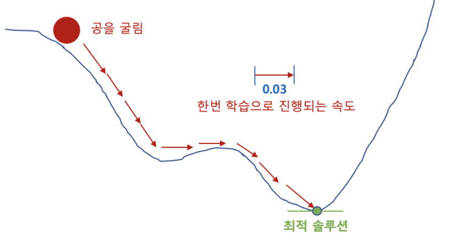

공을 한번 던지면 그 때마다 최적해를 향해 조금씩 굴러간다. 공의 속도가 빠르면 많이 구르고, 느리면 조금밖에 구르지 않는다. 그 공을 던지는 속도에 해당하는 수치가 학습률(learning rate)인 것이다. 학습률에는 0.1 ~ 0.001 등 임의의 수치를 지정할 수 있다. 큰 학습률을 설정하는 것이 더 빨리 학습할 수 있다. 따라서 큰 값이 좋다고 생각할지도 모르지만, 그것은 그렇게 좀처럼 학습이 수렴되지 않는 문제가 발생하기 때문에, 일반적으로 말할 수 없다. 예를 들어, 위의 그림은 학습률에 0.03을 지정한 경우고, 아래 그림은 0.3을 지정한 경우이다.

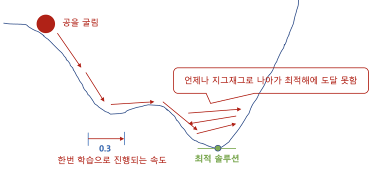

화살표가 너무 길기 때문에 최적해를 지나치게 가버려 좀처럼 최적해에 도착하지 않는다. 그 결과, 최적해의 근처를 언제까지나 지그재그와 왔다갔다해 버린다. 즉, 학습이 최적해에 깨끗하게 수렴되지 않는 문제가 일어나고 있는 것이다. 그렇다면 작은 값이 좋다고 생각할지도 모르지만, 그렇다면 좀처럼 학습이 끝나지 않는 문제가 발생하기 때문에 이것도 일반적으로 말할 수 없다. 뿐만 아니라 전역 최적해(global optimal solution)가 아니라 국부 최적해(local optimal solution)에 수렴되어 그 골짜기에서 빠져나갈 수 없는 경우가 있다

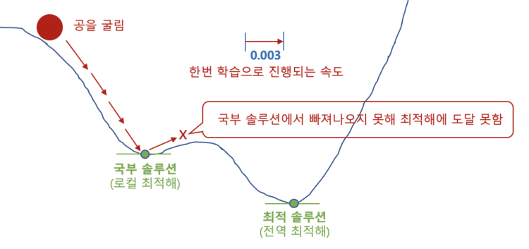

모든 케이스 일률적으로 적용되는 수치가 있는 것은 아니기 때문에 케이스 바이 케이스에서 적절한 학습률을 시행 착오하면서 찾을 필요가 있다. 대체로 0.1 전후부터 수치를 작게해 가는 방향으로 찾아야 한다. 가능한 한 고속으로 처리할 수 있고 게다가 정밀도가 적당히 좋은 학습률이, 일반적으로는 더 나은 학습률이라고 말할 수 있을 것이다. 참고로, 0.003/0.03/0.3/3을 지정한 경우의 학습 결과의 차이를 아래 그림에 정리를 하였다.

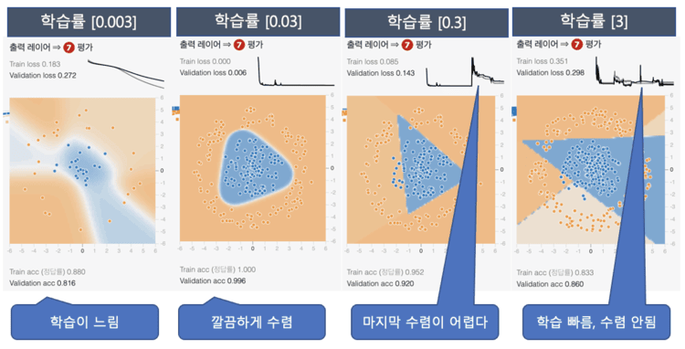

각 결과의 상단에있는 Train loss는 훈련 데이터의 손실이고, Validation loss는 정확도 검증 데이터의 손실이다. 또한, 하부에 표시되어 있는 Train acc(acc=accuracy)라고 하는 것은 훈련 데이터에 있어서의 정답률이고, Validation acc는 정밀도 검증 데이터에 있어서의 정답률이다. 정답률(정밀도)이란 말대로 모델의 출력 결과가 얼마나 정답을 내는가의 수치이다. 우선, 좌측의 0.003에서는 학습이 늦고, 100회 학습한 것만으로는 Train loss가 0.183으로 0.0에 가까워져 있지 않다. 이것은 아직도 학습 중이란 걸 의미한다. 다음의 0.03은 잘 학습하고 있다. 그 다음 0.3은, Train loss의 그래프의 우단이 들쭉날쭉하고 손실이 커지거나 작아지거나 흔들리고 있다. 이것은 수렴되지 않음에 대응하는 현상이다. 오른쪽 끝의 3은 Train loss의 그래프가 격렬하게 지그재그가 되어 있어 학습이 잘 진행되지 않은 것을 나타내고 있다.

그럼 학습률로서 0.03을 코드로 구현해 보자.

```
LEARNING_RATE = 0.03     # 학습률 : 0.03
```

이상으로 손실 함수, 최적화, 학습률의 설명이 끝났다. 이제부터는 이것들을 사용해 모델을 생성하면 된다.

```
mport tensorflow as tf

# 상수(모델 정의 시 필요한 숫자)
INPUT_FEATURES = 2      # 입력(특징) 수 ： 2
LAYER1_NEURONS = 3      # 뉴런 수 ： 3
LAYER2_NEURONS = 3      # 뉴런 수 ： 3
OUTPUT_RESULTS = 1      # 출력 결과 수 ： 1
ACTIVATION = 'tanh'     # 활성화 함수： tanh 함수

# 적층형 모델 정의
model = tf.keras.models.Sequential([

  # 숨겨진 레이어: 첫 번째 레이어
  tf.keras.layers.Dense(
    input_shape=(INPUT_FEATURES,),       # 입력 레이어
    units=LAYER1_NEURONS,                # 유닛 수
    activation=ACTIVATION),              # 활성화 함수

  # 숨겨진 레이어: 두 번째 레이어
  tf.keras.layers.Dense(
    units=LAYER2_NEURONS,                # 유닛 수
    activation=ACTIVATION),              # 활성화 함수

  # 출력 레이어
  tf.keras.layers.Dense(
    units=OUTPUT_RESULTS,                # 유닛 수
    activation='tanh'),                  # 활성화 함수
])
```
Keras에서는 학습 결과를 평가하기 위한 지표를, 모델 생성시에 지정해 둘 필요가 있다. 회귀 문제에서는 손실을 보면 좋겠지만, 분류 문제에서는 정답률은 몇%인가를 나타내는 정밀도(accuracy : 정답률, 정확도 )도 보고 싶을 것이다. Keras에서는 아래와 같은 평가 지표가 평가 함수(Evaluation Function)로서 준비되어 있다.

- accuracy(정답률)
- binary_accuracy(2 클래스 분류의 정답률)
- categorical_accuracy(다클래스 분류의 정답률)

그러나 이번에는 모델의 출력값이 활성화 함수의 tanh 함수에 의해 -1.0 ~ 1.0으로 출력하게 되어 있다는 점에 주의해 주었으면 한다. 보통은 0.0 ~ 1.0이기 때문에, 기존의 binary_accuracy에서는 정상적으로 정답률을 취득할 수 없다. 그래서 이번에는 독자적인 평가 함수를 작성했다. 

```
import tensorflow.keras.backend as K

def tanh_accuracy(y_true, y_pred):           # y_true는 정답, y_pred은 예측(출력)
  threshold = K.cast(0.0, y_pred.dtype)      # -1 또는 1을 구분하는 임계값을 작성
  y_pred = K.cast(y_pred >= threshold, y_pred.dtype) # 임계값 미만에서 0, 이상에서 1로 변환
  # 2배로 -1.0함으로써 0/1을 -1.0/1.0으로 스케일 변환하여 정답률을 계산
  return K.mean(K.equal(y_true, y_pred * 2 - 1.0), axis=-1)
```

이제 모델을 생성합니다.

```
LOSS = 'mean_squared_error'          # 손실 함수: 평균 제곱 오차
OPTIMIZER = tf.keras.optimizers.SGD  # 최적화: 확률적 경사 하강법
LEARNING_RATE = 0.03                 # 학습률 ： 0.03

# 모델 생성
model.compile(optimizer=OPTIMIZER(learning_rate=LEARNING_RATE),
              loss=LOSS,
              metrics=[tanh_accuracy])  # 정밀도(정답률)
```

첫번째 인수의 optimizer(최적화 알고리즘)을 지정한다. 이번에는 방금 정수 OPTIMIZER를 지정해야 한다. OPTIMIZER 정수의 내용인 SGD 클래스는 생성자를 호출해 인스턴스화할 필요가 있다. 그 생성자의 인수에는 learning_rate 라는 키워드로 학습률을 지정할 수 있다. 이번에는 방금 전 정수 LEARNING_RATE를 지정하면 된다. 지정하지 않으면 기본값 0.01이 사용된다. 두 번째 인수 loss(손실 함수)를 지정한다, 제3 인수의 metrics(평가 함수)를 지정할 수 있다. 분류 문제에서는 일반적으로 accuracy와 문자열로 평가 함수를 지정하면 된다. 다만 이번에는 자작의 tanh_accuracy 함수를 지정하고 있다. 또한, 평가 함수는 복수 지정할 수 있으므로, 리스트 값으로 하여 지정할 필요가 있다

### 학습: 트레이닝

[Playground](https://mimul.github.io/playground/#activation=tanh&activspacer=false&loss=mse&batchSize=1&batchFull=false&dataset=gauss&regDataset=reg-plane&learningRate=0.03&regularizationRate=0&noise=0&networkShape=3,3&seed=0.04060&showTrainData=true&showValidationData=false&showTestData=true&discretize=false&percTrainData=50&x=true&y=true&xTimesY=false&xSquared=false&ySquared=false&sinX=false&sinY=false&problem=classification&initOrigin=false&hideText=true&xSquared_hide=true&ySquared_hide=true&xTimesY_hide=true&sinX_hide=true&sinY_hide=true)를 열고 상단에 있는 실행/정지 버튼을 클릭하면 학습이 시작된다. 

학습(최적화)은 출력층으로부터 숨겨진 레이어로, 뉴럴 네트워크의 각 층을 역순으로 진행하면서, 서서히 각 뉴런에 있어서의 각 접속선의 가중치나 바이어스를 갱신해 간다. 이전에 설명한 순방향 전파와는 반대의 흐름이다. 반대로 전파해 나가는 것으로부터, 백프로파게이션(Back-propagation : Backprop, Backward propagation, 역전파 , 오차 역전파법)이라고 불린다.

백 프로파게이션은 뉴럴 네트워크의 핵이 되는 기능이므로, 본래라면, 수식을 이해해, 실제로 풀 스크래치로 코드를 써 경험해 보는 것이 제일이다. 그러나 이것은 위에서 언급한 편미분과 선형 대수에 대한 이해가 필수적이다. 신경망에서의 학습단위를 에포크라고 한다. 1 에포크에서 모든 훈련 데이터를 1회 학습한 것이다.

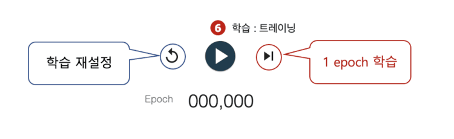

Playground에서 실행하면 영원히 학습해 버리기 때문에, 에포크의 미터가 계속 돌게 된다. 그러나, 1 에포크의 학습마다 어떠한 변화가 있는지를 보고 싶을 때도 있을 것이다. 이 때, 학습을 정지시킨 후 실행/정지 버튼의 우측에 있는 스텝 버튼을 클릭하면 된다. 그럼 학습을 코드로 구현해 보자. 그 코드를 작성하기 전에, 데이터를 취득하고, 훈련용/정밀도 검증용으로 데이터 분할하는 코드를 보자.

```
import plygdata as pg

# 문제 유형에서 분류를 선택하고,
# 데이터 유형으로 2개의 가우시안 데이터(TwoGaussData)를 선택하는 경우,
# 설정값을 상수로 정의
PROBLEM_DATA_TYPE = pg.DatasetType.ClassifyTwoGaussData

# 다양한 설정을 상수로 정의
TRAINING_DATA_RATIO = 0.5  # 데이터의 몇 %를 훈련용으로? (남은 정밀도 검증용) ： 50%
DATA_NOISE = 0.0           # 노이즈 : 0％

# 미리 정의된 상수를 인수로 지정하여 데이터 생성
data_list = pg.generate_data(PROBLEM_DATA_TYPE, DATA_NOISE)

# 데이터를 훈련용과 정밀도 검증용을 지정 비율로 나누고, 각각을 데이터(X)와 교사 라벨(y)로 나눈다.
```

학습을 수행하는 코드는 아래와 같다.

```
BATCH_SIZE = 1   # 배치 사이즈: 1(선택사항은 1 ~ 30)
EPOCHS = 100     # 에포크 수 ： 100

# 학습(다음의 리스트 6-3 미니 배치 학습으로 실행하기 때문에, 여기에서는 아직 실행하지 않음)
hist = model.fit(x=X_train,                          # 교육용 데이터
                 y=y_train,                          # 훈련용 라벨
                 validation_data=(X_valid, y_valid), # 정밀도 검증용
                 batch_size=BATCH_SIZE,              # 배치 크기
                 epochs=EPOCHS,                      # 에포크 수
                 verbose=1)                          # 실행 상태 표시
```

model.fit의 함수 인자를 보면 아래와 같다.

- 첫번째 인수 x : 훈련 데이터를 지정한다. X_train(훈련 데이터의 좌표 점)을 지정
- 두번째 인수 y : 훈련 라벨을 지정한다. y_train(훈련 데이터의 교사 라벨)을 지정
- 세번째 인수 validation_data : 정밀도 검증 데이터와 그 라벨을 튜플로 지정한다. X_valid와 y_valid를 튜플로 지정
- 네번째 인수 batch_size : 배치 크기를 지정한다. 상수로 정의한 BATCH_SIZE를 지정
- 다섯 번째 인수 epochs : 에포크 수를 지정합니다. 이번에는 상수로 정의 된 EPOCHS 를 지정
- 여섯번째 인수 verbose : 진행 상황이나 결과의 로그를 표준 출력한다. 1을 지정하면 진행률 표시줄로 표시되고 2를 지정하면 에포크별로 자세히 표시된다. 0을 지정하면 출력되지 않는다.

또한 fit 메소드는 History 객체를 반환값으로 반환한다. History 오브젝트의 history 속성에는, 트레이닝(학습)시의 각 에포크에서의 손실값이나 평가 함수치가 기록되어 있고, 또한 위와 같이 정밀도 검증 데이터도 지정되었을 경우는 그 손실치나 평가 함수치도 기록되어 있다.

**배치 사이즈**

배치 크기는 아래 그림롸 같이 설정할 수 있다.

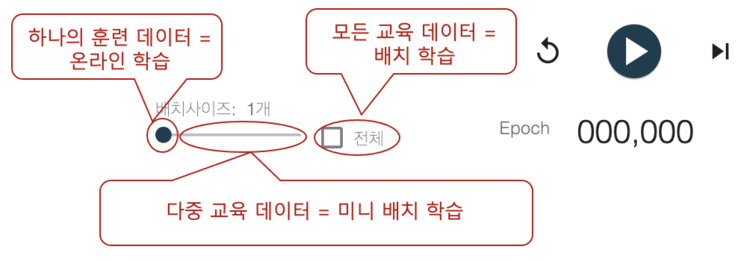

배치 사이즈(Batch size)란, 얼마나의 수량(사이즈)의 훈련 데이터를 정리해 학습할까를 나타내는 수치로, 하나의 훈련 데이터 : 온라인 학습(Online training), 복수의 훈련 데이터 : 미니 배치 학습(Mini-batch training), 모든 훈련 데이터 : 배치 학습(Batch training)이라는 3가지 패턴으로 크게 나눌 수 있다. 온라인이란 말 그대로 연속적으로 연결된 데이터를 하나씩 처리하여 가중치와 바이어스를 갱신해 나가는 것을 의미한다. 배치란, 전체 데이터를 정리해 처리하는데 단번에 가중치와 바이어스를 갱신해 가는 것이다. 그리고 미니 배치란 그 중간에서 어느 정도의 작은 정리 마다 처리해 그 단위로 가중치와 바이어스를 갱신해 나가는 것을 의미한다.

각각의 대표적인 경사(기울기)법에도 다음과 같은 차이가 있다.

- a. 온라인 학습 = 확률적 경사 하강법(SGD : Stochastic Gradient Descent)
- b. 미니 배치 학습 = 미니 배치 경사 하강법(Mini-batch Gradient Descent, 상기와 같이 SGD 라고도 함)
- c. 배치 학습 = 급하강법(Steepest Descent, 배치 경사 하강법 : Batch Gradient)

기울기 방법의 이름을 보면 a와 b는 SGD(Stochastic Gradient Descent)에서 같은 것으로 볼 수 있다. 한편, c는 그라디언트 하강법(GD : Gradient Descent)이라고도 불리지만 Stochastic(확률적)이 붙어 있지 않다. 확률적이란 데이터를 랜덤 샘플링(랜덤하게 추출)하고 그라디언트를 계산하여 가중치와 바이어스를 업데이트하는 것을 말한다. 본래라면, 모든 데이터를 사용해 엄밀하게 학습하고 나서 가중치와 바이어스를 갱신하는 것이 타당하다고 생각될 것이다. 그러나, 확률론에 근거하면 그러한 부분적인 데이터를 사용해도 가중치와 바이어스를 갱신해 갈 수 있다는 것이다. 참고로, 배치 사이즈에 1개/15개/30개/전부(250개)를 지정했을 경우의 학습 결과의 차이(모두 100 에포크, 학습한 결과의 비교)를 아레 그림에 정리했다.

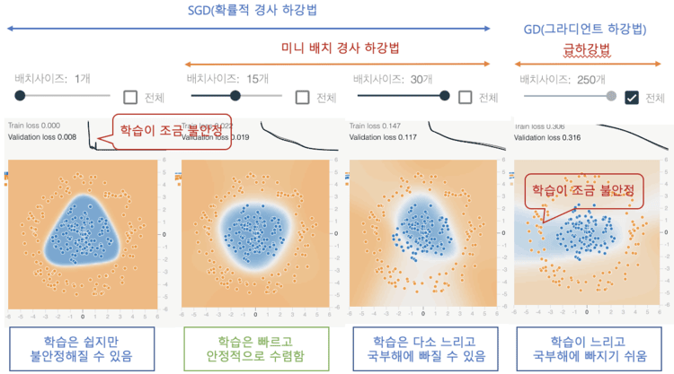

학습률에 따라 최적의 배치 사이즈도 달라지기 때문에 일괄적으로는 말할 수 없지만, 학습률 0.03이라는 조건하에 각 배치 사이즈에 의한 영향/효과를 아래에 정리하였으니 배치 사이즈를 결정하는데 참고하면 좋을 듯 하다.

맨 왼쪽 배치 사이즈 1개는 모두 개별적으로(이 예에서는 데이터 1개 × 250 이테레이션) 학습해 가므로, 1 에포크가 완료하는 스피드는 약간 느리지만 학습은 진행되기 쉽다. 손실의 하강선을 그리고 있는 그래프를 보면 일부가 지그재그와 떨고 있어 하나의 데이터에 학습이 흔들리고 불안정해지기 쉬운 단점도 있다.

다음의 배치 사이즈 15개는, 1 에포크(이 예에서는 데이터 15개 × 16 이테레이션)의 학습 스피드가 빠르고, 게다가 일직선으로 안정적으로 학습할 수 있다. 이 중 최선이다.

오른쪽 끝(마지막)의 전체(250개)는 전 데이터를 사용하므로 이번에는 계산량이 많아져 1 에포크(이 예에서는 데이터 250개× 1 이테레이션)를 완료하는데 스피드는 늦어지고 게다가 학습도 좀처럼 진행되지 않는다. 배치 학습(급하강법)은 국부해에 빠지기 쉽다는 단점도 있으므로 많은 경우에 SGD가 바람직하다. 그리고 주황색의 둥근점의 배경색은 청색(부정해)인 채로 되어 손실이 감소하지 않게 되었다. 이것은 국부해에 빠져 있는 상태이다.

이것을 근거로 오른쪽에서 두번째 30개를 보면 국부해를 어떻게든 피할 수 있어 이대로 학습을 계속하면 손실은 0에 접근한다. 여러번 실행을 시도하면 국부해에 빠지기도 했으므로 배치 사이즈가 너무 큰 경우에는 국부해에 대한 주의가 필요하다. 1 에포크(이 예에서는 데이터 30개 × 8 이테레이션)가 완료되는 스피드는 데이터가 분할로 계산량이 줄어들기 때문에 배치 학습보다 빠르지만 배치 크기 15개보다는 계산량이 비교적 많기 때문에 다소 느리다.

```
BATCH_SIZE = 15  # 배치 사이즈: 15(선택사항은 1 ~ 30)
EPOCHS = 100     # 에포크 수： 100

# 학습
hist = model.fit(x=X_train,                          # 교육용 데이터
                 y=y_train,                          # 훈련용 라벨
                 validation_data=(X_valid, y_valid), # 정밀도 검증용
                 batch_size=BATCH_SIZE,              # 배치 크기
                 epochs=EPOCHS,                      # 에포크 수
                 verbose=1)                          # 실행 상태 표시
```
배치 크기를 설정하는 방법은 위의 코드를 보면 된다. 이 코드는 15이다. 만약 모든 데이터(급하강법)를 사용하고 싶은 경우는 None을 지정하면 된다.

### 평가

이제 학습한 결과에 대한 평가를 할 차례다. 학습을 수행했을 때 얼마나 학습되었는지, 모델의 성능은 어떻게 변화하고 있는지 등을 평가해 정확성이 떨어지면 재학습(데이터를 개선하던가, 모델 구조를 개선하던가, 학습 설정을 개선하는 등)을 수행할 수 있어야 한다.

**1. 손실 그래프**

[Playground](https://mimul.github.io/playground/#activation=tanh&activspacer=false&loss=mse&batchSize=15&batchFull=false&dataset=gauss&regDataset=reg-plane&learningRate=0.03&regularizationRate=0&noise=0&networkShape=3,3&seed=0.70664&showTrainData=true&showValidationData=false&showTestData=true&discretize=false&percTrainData=50&x=true&y=true&xTimesY=false&xSquared=false&ySquared=false&sinX=false&sinY=false&problem=classification&initOrigin=false&hideText=true&xSquared_hide=true&ySquared_hide=true&xTimesY_hide=true&sinX_hide=true&sinY_hide=true)를 열고 오른쪽에 있는 (7)평가의 Train loss(훈련 데이터에서의 손실)/Validation loss(정밀도 검증 데이터에서의 손실)와 그 오른쪽에 있는 그래프를 참조해 주었으면 한다. 그래프 아래에는 최종 정밀도(정답률: acc=accuracy)도 표시되어 있다.

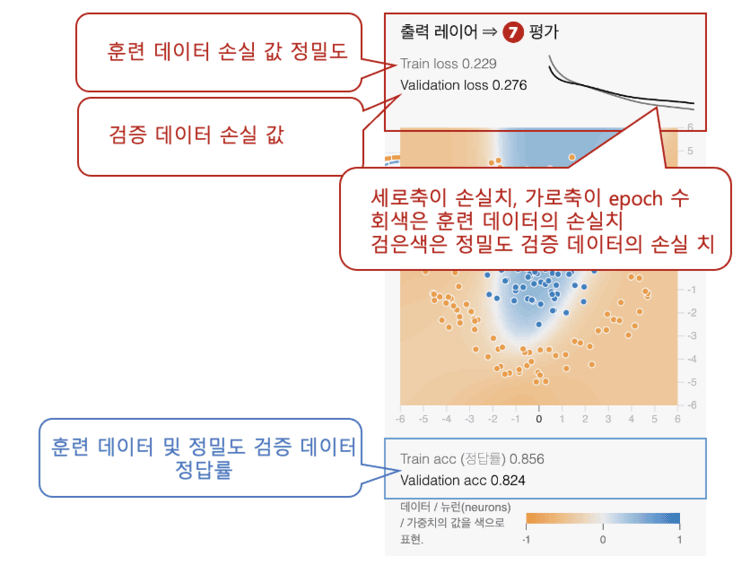

훈련 데이터에 의해 학습을 실시한 결과의 손실값이 회색의 문자로(이 예에서는 0.229) 표시되고, 그 오른쪽에 회색의 선이 그래프로 표현되어 있다. 에포크 수가 증가함에 따라 손실 값이 낮아지고 0을 향해 수렴해 가는 것을 알 수 있다. 한편, 정밀도 검증 데이터를 학습 끝난 모델에 입력해 측정한(※ 학습은 하지 않고 정밀도 검증용의 측정만) 손실치가 검은색의 문자로(이 예에서는 0.276) 표시되고 그 오른쪽에 검은색의 선이 그래프로 표현되어 있다. 이쪽도 훈련 데이터만큼은 아니지만 0을 향해 수렴해 가고 있는 것을 알 수 있다.

둘 다 0.001등으로 손실이 가능한 한 작아질 때까지 학습을 계속하는 것이 좋지만, 도중에 손실치의 그래프가 가로가 되어 그 이상 손실치가 줄어들지 않게 된다. 이렇게 되면 학습을 마칠 수 있다.

Playground에서는 육안으로 그래프를 확인해 멈추지만 코드의 경우는 지정한 에포크수까지 학습이 계속되어 버린다. 손실치가 거의 변하지 않는 상태가 되면 빨리 학습을 중단하고 싶다라는 요구는 있을 것이다. 이러한 요구에 부응하는 조기 종료(Early Stopping, 조기 정지)라는 기능이 Keras에는 탑재되어 있다. 조기 종료는 Playground에는 구현되어 있지 않기 때문에 Playground에서는 사용할 수 없다. 따라서, 아래 코드를 통해 조기 종료의 사용법을 설명한다.

손실의 값에 대해서는 실은 방금 전의 코드를 실행하면 fit 메소드의 6번째 인수에 verbose=1을 지정하면 자동적으로 표시된다. 도 7-2는 그 표시 예이다.

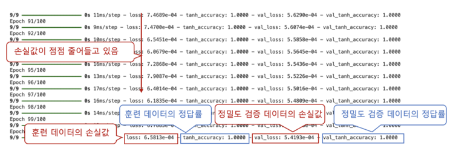

에포크가 1회 완료할 때마다 1행씩 로그가 표준 출력된다. 에포크수 100의 마지막인 100번째의 행을 보면 loss는 0.00065813(6.5813e-04, e-04는 지수 표기로 1/10의 4승을 의미한다)이 되고 있어 훈련 데이터에 있어서의 손실치는 상당히 작다. 정답률도 보면 tanh_accuracy라고 하는 정밀도(정답률)를 측정하는 평가 지표를 지정했으므로 tanh_accuracy에는 정답률이 표시되어 있다. 이 예에서는 1.0000과 100% 정답률이다. 이 예에서 훈련 데이터의 학습은 성공적이다. 다음 정밀도 검증 데이터의 손실과 정답률을 살펴보겠다. val_loss는 정밀도 검증 데이터의 손실값이고 val_tanh_accuracy는 정답률이다. 이쪽도 문제 없는 값이 되어 있는 것을 확인할 수 있다.

숫자가 아닌 그래프에서 시각적으로 학습 결과를 파악하고 싶은 경우는 fit 메소드의 반환값으로 반환된 History 객체의 로그 데이터를 사용하여 그래프 그리기 라이브러리 Matplotlib로 그래프를 그리는 것이 좋다. 

```
import matplotlib.pyplot as plt

# 학습 결과(손실) 그래프를 그리기
train_loss = hist.history['loss']
valid_loss = hist.history['val_loss']
epochs = len(train_loss)
plt.plot(range(epochs), train_loss, marker='.', label='loss (Training data)')
plt.plot(range(epochs), valid_loss, marker='.', label='loss (Validation data)')
plt.legend(loc='best')
plt.grid()
plt.xlabel('epoch')
plt.ylabel('loss')
plt.show()
```

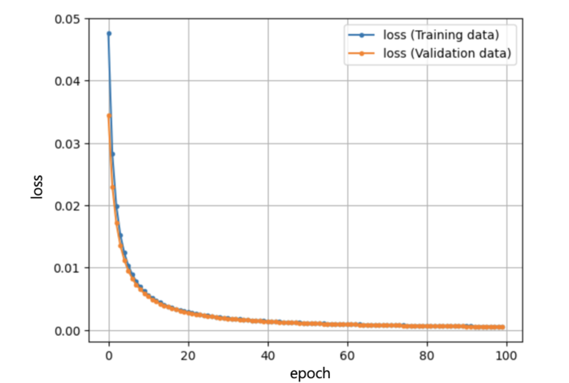

**2. 조기 종료 및 CSV 로그 출력**

위의 그래프는 끝까지 손실 감소가 계속되기 때문에 필요하지 않지만 손실 감소가 정체되면 더 이상 학습 할 필요가 없다. 이러한 낭비적인 학습을 생략하기 위해 조기 종료 기능을 활용할 수 있다. Keras에서는 조기 종료는 콜백이라고 하는 기능으로 실현할 수 있다. 콜백(Callback)은 학습 중(훈련 중) 모델 내부에서 어떤 기능을 호출하는 메커니즘이다. 조기 종료의 경우는(tf.keras.callbacks 모듈 계층의) EarlyStopping 클래스의 인스턴스를 fit 메소드의 인수 callbacks에 리스트치로서 지정하면 된다.

또한 콜백에는 다른 기능이 있으며 예를 들어 실행 로그를 CSV 파일로 저장할 수 있다. CSV 로거는 CSVLogger 클래스의 인스턴스(tf.keras.callbacks 모듈 계층 구조)를 인수 callbacks으로 지정할 수 있다. 이 두 콜백을 지정하여 학습하는 코드는 아래와 같다.

```
# 조기 종료
es = tf.keras.callbacks.EarlyStopping(monitor='val_loss', patience=2)

# CSV 로거
csv_logger = tf.keras.callbacks.CSVLogger('training.log')

# 학습
hist = model.fit(x=X_train,                          # 교육용 데이터
                 y=y_train,                          # 훈련용 라벨
                 validation_data=(X_valid, y_valid), # 정밀도 검증용
                 batch_size=BATCH_SIZE,              # 배치 크기
                 epochs=EPOCHS,                      # 에포크 수
                 verbose=1,                          # 실행 상태 표시
                 callbacks=[es, csv_logger])         # 콜백
```

EarlyStopping 클래스의 생성자에서는 인수 monitor에 감시 대상의 손실(이 예에서는 val_loss = 정밀도 검증 데이터의 손실)을 지정해, 인수 patience에 에포크 연속으로 수치에 감소가 보이지 않으면 학습을 중단할지의 수치(이 예에서는 2회)를 지정한다. 덧붙여서, 이번 샘플에서 실행해 보았지만 학습은 조기 정지하지 않았다.

CSVLogger 클래스의 생성자에서는 파일명(training.log)을 인수로 지정한다. 실행후 생성된 파일(csv) 내용을 다운로드하는 코드는 아래와 같다.

```
# CSV 로그 출력 파일 다운로드
from google.colab import files
files.download('training.log')
```

### 테스트

지금까지는 무난하게 모델을 학습할 수 있어 상당히 작은 손실치로 분류의 경우는 충분한 정답률을 낼 수 있게 되었다. 그러면 실운용에서는 어떨까? 학습시에 사용한 훈련 데이터나 정밀도 검증에 사용한 정밀도 검증 데이터에는 어떠한 바이어스가 걸려 있는지 알 수 없기 때문에 한번 더 테스트하는 것이 좋다.

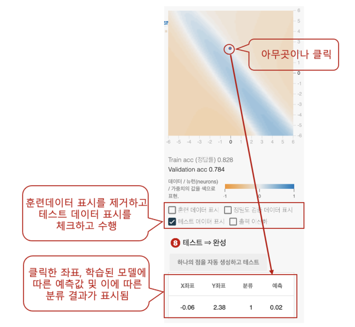

이 예에서는 좌표(-0.06, 2.38)를 클릭하고 있다. 배경색이 하얀 곳을 클릭했기 때문에 예측치도 0.02로 0.0에 가까운 수치가 되고 있다. 분류 문제에서는 0.0미만이 주황색(-1)으로 0.0이상이 청색(1)에 강하게 나누는(이산화 : discretize함) 특성이므로 분류는 1(청색)이 되고 있다. Playground에는 출력의 이산화라는 체크 박스가 있지만 여기에 체크를 하면 강제로 -1 또는 1로 나뉘어지기 때문에 배경 표현부분에서 백색의 부분은 없어진다.  

테스트 데이터를 새롭게 생성해 입력으로서 사용해 학습이 끝난 모델에 결과 출력(예측, predict) 시키거나, 테스트 데이터에서의 정밀도(알반화 성능, Generalization performance)에 문제가 없는지 평가(evaluate)를 해보자. 이래 코드는 알 수 없는 데이터로 테스트(추론 및 평가)를 해본다.

```
import plygdata as pg
import numpy as np

# 알 수 없는 테스트 데이터 생성
PROBLEM_DATA_TYPE = pg.DatasetType.ClassifyTwoGaussData
TEST_DATA_RATIO = 1.0  # 데이터의 몇 %를 훈련용으로? (남은 정밀도 검증용) ： 100%
DATA_NOISE = 0.0       # 노이즈： 0％
data_list = pg.generate_data(PROBLEM_DATA_TYPE, DATA_NOISE)
X_test, y_test, _, _ = pg.split_data(data_list, training_size=TEST_DATA_RATIO)

# 학습된 모델을 이용한 추론
result_proba = model.predict(X_test)
result_class = np.frompyfunc(lambda x: 1 if x >= 0.0 else -1, 1, 1)(result_proba) # 이산화
# 각각 5건씩 출력
print('proba:'); print(result_proba[:5])  # 예측
print('class:'); print(result_class[:5])  # 분류

# 알 수 없는 테스트 데이터로 학습된 모델의 일반화 성능 평가
score = model.evaluate(X_test, y_test)
print('test loss:', score[0])  # 손실
print('test acc:', score[1])   # 정답률
```

학습된 모델에 의한 추론/예측은 model 오브젝트의 predict 메소드로 실시할 수 있다. 이 메소드의 인수에는 다차원 배열치의 테스트 데이터를 건네주면 된다. 반환 값으로서 출력 결과(예측값)가 다차원 배열값으로 반환된다. 또한 최종 손실은 model객체의 evaluate 메소드로 얻을 수 있다. 이 메소드의 인수에는 다차원 배열의 테스트 데이터와 교사 라벨을 건네주면 된다. 반환 값으로서 손실값이 반환된다. 평가 지표를 지정한 경우는 그 평가(정답률)도 맞추어 리스트 값으로 돌려준다. 실제 실행한 결과는 아래와 같다.

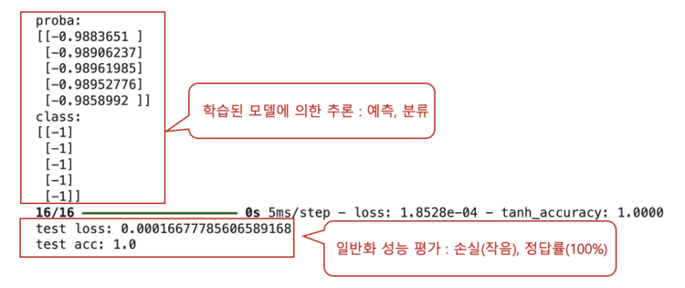