## 들어가며

[앞 글(Part 1)](https://www.mimul.com/blog/about-neural-network/)에서는 데이터 준비, 전처리, 뉴런 구조, 신경망 모델 정의까지 다뤘습니다. 이 글(Part 2)에서는 정의한 모델을 실제로 **학습시키고 평가하는 과정**을 구현합니다.

**이 글에서 다루는 내용:**

```
손실 함수 설정 → 최적화(SGD) → 학습률 · 배치 사이즈 → 모델 컴파일
→ 학습(Backpropagation) → 손실 그래프 평가 → 테스트(예측 · 일반화 성능)
```

**사전 지식**: [Part 1](https://www.mimul.com/blog/about-neural-network/)의 모델 정의 코드를 이해한 상태에서 읽으시면 좋습니다.

| 도구 | 역할 |
|------|------|
| [Google Colaboratory(Colab)](https://colab.research.google.com/) | 개발/실행 환경 |
| [Playground](https://mimul.github.io/playground) | 학습 동작 시각화 |
| [playground-data](https://pypi.org/project/playground-data/) | 학습 데이터 생성 |

이 글에서 사용한 Python 코드는 [GitHub](https://github.com/mimul/playground/blob/main/examples/tf2_keras_neuralnetwork.ipynb)에 공유되어 있습니다.

---

## 학습 설정

모델을 학습시키기 전에 손실 함수, 최적화 알고리즘, 학습률, 배치 사이즈를 설정합니다.

### 1. 손실 함수

손실 함수(Loss Function)는 모델 출력과 정답의 차이(오차)를 수치로 나타내는 함수입니다. 이 값을 최소화하는 것이 학습의 목표입니다.

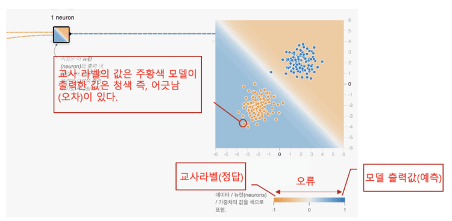

오차를 단순 합산하면 양수와 음수가 상쇄되어 0이 될 수 있습니다. 예를 들어 오차가 +1.2, -1.0, -0.2이면 합계는 0이 됩니다. 이를 방지하기 위해 제곱을 사용합니다. 제곱은 음수를 양수로 만들고, 미분 계산이 쉬워지는 장점도 있습니다. 이렇게 오차를 제곱해 평균을 낸 것이 **평균 제곱 오차(MSE, Mean Squared Error)** 입니다.

문제 유형별 주요 손실 함수:

| 함수 | 용도 |
|------|------|
| `mean_squared_error` | 회귀 문제 |
| `binary_crossentropy` | 이진 분류 (2클래스) |
| `categorical_crossentropy` | 다중 분류 |

> 이진 분류에는 일반적으로 `binary_crossentropy`가 표준이지만, 이 글에서는 [Playground](https://mimul.github.io/playground)와의 호환을 위해 MSE를 사용합니다. 실무 분류 문제에서는 Cross-Entropy를 권장합니다.

참고로, Playground의 손실 함수는 엄밀히는 평균 제곱 오차가 아닌 1/2 제곱 합 오차(SSE)를 사용합니다. 미분 시 계수 2가 1/2과 곱해져 소거되어 계산이 편리하기 때문입니다. 코드 설명과의 일관성을 위해 여기서는 MSE로 표기합니다.

```python
LOSS = 'mean_squared_error'  # 손실 함수: 평균 제곱 오차
```

---

### 2. 최적화

최적화(Optimization)는 손실 값을 최소화하는 방향으로 가중치와 바이어스를 갱신하는 과정입니다.

기본 방법은 **경사 하강법(Gradient Descent)** 입니다. 손실 곡선에서 현재 위치의 기울기(gradient)를 구하고, 기울기가 낮아지는 방향으로 파라미터를 이동합니다.

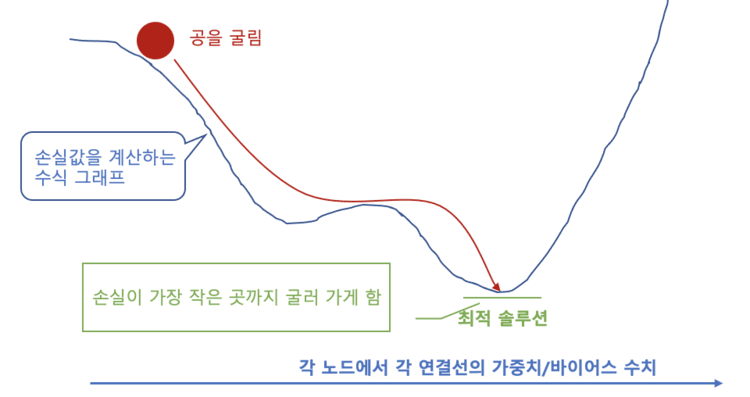

공이 경사면을 굴러 내려가듯 학습이 진행됩니다. 공이 굴러가는 방향은 편미분으로 계산하며, 이 계산을 TensorFlow가 내부적으로 처리합니다.

이 글에서는 **SGD(확률적 경사 하강법, Stochastic Gradient Descent)** 를 사용합니다. SGD는 전체 데이터가 아닌 일부(미니 배치) 데이터를 샘플링해 gradient를 계산하고 파라미터를 갱신합니다.

Keras에서 사용 가능한 주요 최적화 알고리즘:

| 알고리즘 | 특징 |
|----------|------|
| SGD | 기본 경사 하강법, 단순하고 안정적 |
| Adam | 학습률 자동 조정, 실무에서 가장 많이 사용 |
| RMSprop | RNN 계열에 적합 |
| Adagrad | 희소 데이터에 강함 |

> 알고리즘별 상세 비교는 별도 글에서 다룰 예정입니다.

```python
import tensorflow as tf

OPTIMIZER = tf.keras.optimizers.SGD  # 최적화: 확률적 경사 하강법
```

---

### 3. 학습률

학습률(Learning Rate)은 한 번의 학습에서 파라미터를 얼마나 크게 이동할지를 결정하는 하이퍼파라미터입니다.

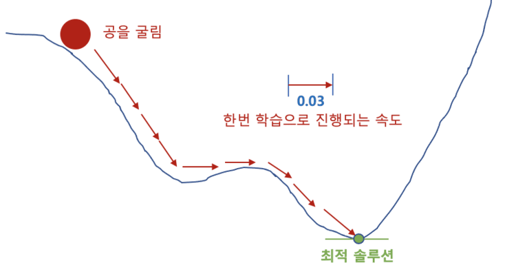

**너무 크면**: 최적해를 지나쳐 발산하거나 수렴하지 못합니다.

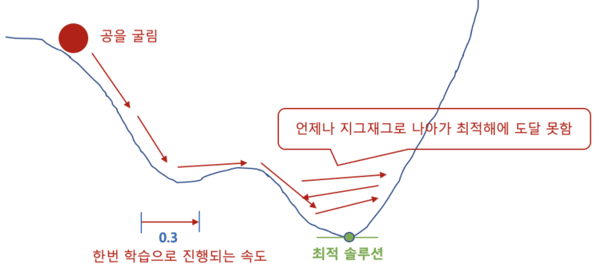

**너무 작으면**: 학습이 매우 느리고, 전역 최적해가 아닌 국부 최적해(local optimum)에 갇힐 수 있습니다.

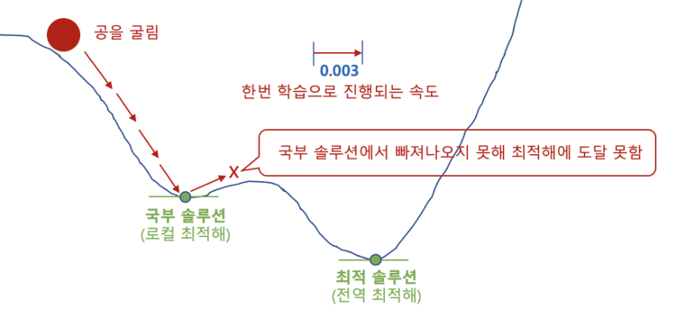

아래는 학습률 0.003 / 0.03 / 0.3 / 3을 비교한 결과입니다.

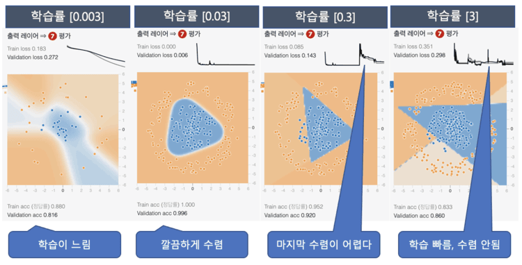

0.03이 이 조건에서 가장 안정적으로 수렴합니다. 일반적으로 SGD는 0.01~0.1, Adam은 0.001을 시작점으로 조정합니다.

```python
LEARNING_RATE = 0.03  # 학습률: 0.03
```

---

### 4. 배치 사이즈

배치 사이즈(Batch Size)는 한 번에 학습할 훈련 데이터의 수입니다.

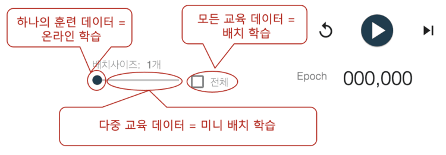

| 방식 | 배치 사이즈 | 경사 하강법 | 특징 |
|------|-------------|-------------|------|
| 온라인 학습 | 1개 | SGD | 빠르게 학습, 불안정 |
| 미니 배치 학습 | n개 | Mini-batch GD | 속도와 안정성 균형 (권장) |
| 배치 학습 | 전체 | Batch GD | 안정적이나 국부해 위험 |

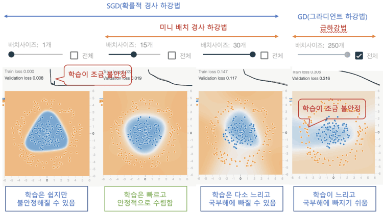

이 조건(학습률 0.03, 100 에포크)에서는 배치 사이즈 15가 속도와 안정성 면에서 가장 균형이 좋습니다. 일반적으로는 32~128 사이를 탐색하는 것이 통용됩니다. 배치 사이즈가 전체 데이터(`None` 지정)인 경우에는 국부해에 빠지기 쉬우므로 주의가 필요합니다.

```python
BATCH_SIZE = 15  # 배치 사이즈: 15
```

---

### 5. 모델 컴파일

위 설정을 모델에 등록합니다. Keras의 기본 `binary_accuracy`는 출력 범위 0.0 ~ 1.0을 전제하지만, 이 모델은 tanh 함수로 -1.0 ~ 1.0을 출력합니다. 따라서 커스텀 평가 함수가 필요합니다.

```python
import tensorflow.keras.backend as K

def tanh_accuracy(y_true, y_pred):
    # tanh 출력(-1.0 ~ 1.0)에서 0.0 기준으로 분류
    # y_pred >= 0.0이면 1, 아니면 0으로 변환 후 x2-1.0으로 -1.0/1.0 복원
    threshold = K.cast(0.0, y_pred.dtype)
    y_pred = K.cast(y_pred >= threshold, y_pred.dtype)
    return K.mean(K.equal(y_true, y_pred * 2 - 1.0), axis=-1)
```

Part 1에서 정의한 모델 구조에 컴파일을 적용합니다.

```python
import tensorflow as tf

INPUT_FEATURES = 2
LAYER1_NEURONS = 3
LAYER2_NEURONS = 3
OUTPUT_RESULTS = 1
ACTIVATION = 'tanh'

model = tf.keras.models.Sequential([
    tf.keras.layers.Dense(
        input_shape=(INPUT_FEATURES,),
        units=LAYER1_NEURONS,
        activation=ACTIVATION
    ),
    tf.keras.layers.Dense(units=LAYER2_NEURONS, activation=ACTIVATION),
    tf.keras.layers.Dense(units=OUTPUT_RESULTS, activation='tanh'),
])

LOSS = 'mean_squared_error'
OPTIMIZER = tf.keras.optimizers.SGD
LEARNING_RATE = 0.03

model.compile(
    optimizer=OPTIMIZER(learning_rate=LEARNING_RATE),  # 최적화 알고리즘
    loss=LOSS,                                          # 손실 함수
    metrics=[tanh_accuracy]                             # 평가 지표
)
```

---

## 학습

### 역방향 전파(Backpropagation)

학습은 다음 두 단계가 반복됩니다:

1. **순방향 전파(Forward Propagation)**: 입력 → 모델 → 출력 계산
2. **역방향 전파(Backpropagation)**: 출력과 정답의 오차를 출력층에서 입력층 방향으로 역전파하며 가중치와 바이어스를 갱신

가중치 갱신 원리:

```
새 가중치 = 기존 가중치 - (학습률 × 손실에 대한 가중치의 편미분)
```

편미분(gradient)은 체인 룰(Chain Rule)을 이용해 레이어를 역순으로 전파하며 계산됩니다. TensorFlow가 이 과정을 자동으로 처리하므로 구현 측면에서는 `model.fit()`을 호출하는 것으로 충분합니다.

**에포크(Epoch)**: 전체 훈련 데이터를 한 번 학습하는 단위입니다. 배치 사이즈가 15이고 데이터가 250개라면 1 에포크 = 250 ÷ 15 ≈ 17회 가중치 갱신입니다.

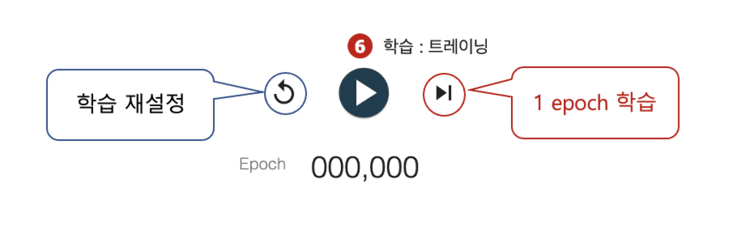

### 학습 실행

```python
import plygdata as pg

PROBLEM_DATA_TYPE = pg.DatasetType.ClassifyTwoGaussData
TRAINING_DATA_RATIO = 0.5
DATA_NOISE = 0.0

data_list = pg.generate_data(PROBLEM_DATA_TYPE, DATA_NOISE)
X_train, y_train, X_valid, y_valid = pg.split_data(
    data_list, training_size=TRAINING_DATA_RATIO
)
```

```python
EPOCHS = 100

hist = model.fit(
    x=X_train,                           # 훈련 데이터
    y=y_train,                           # 훈련 레이블
    validation_data=(X_valid, y_valid),  # 검증 데이터
    batch_size=BATCH_SIZE,               # 배치 사이즈
    epochs=EPOCHS,                       # 에포크 수
    verbose=1                            # 진행 상황 출력
)
```

`model.fit()`은 `History` 객체를 반환합니다. `history` 속성에 에포크별 손실값과 정확도가 기록됩니다.

---

## 평가

### 1. 손실 그래프

```python
import matplotlib.pyplot as plt

train_loss = hist.history['loss']
valid_loss = hist.history['val_loss']
epochs = len(train_loss)

plt.plot(range(epochs), train_loss, marker='.', label='loss (Training)')
plt.plot(range(epochs), valid_loss, marker='.', label='loss (Validation)')
plt.legend(loc='best')
plt.grid()
plt.xlabel('epoch')
plt.ylabel('loss')
plt.show()
```

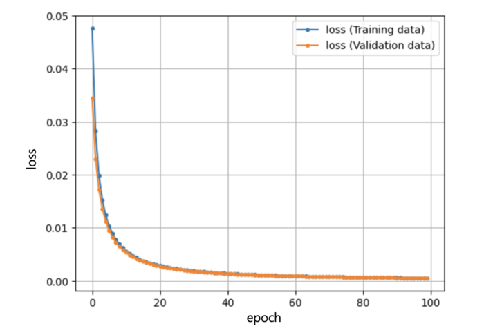

**그래프 해석 기준:**

| 상태 | Train loss | Validation loss | 판단 |
|------|------------|-----------------|------|
| 정상 학습 | 감소 | 함께 감소 | 계속 학습 |
| 과학습(Overfitting) | 감소 | 증가 또는 정체 | 학습 중단, 정규화 추가 |
| 학습 부족 | 높음 | 높음 | 에포크 수 증가 또는 모델 개선 |

`verbose=1` 설정 시 에포크마다 손실값이 자동 출력됩니다.

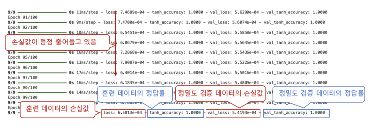

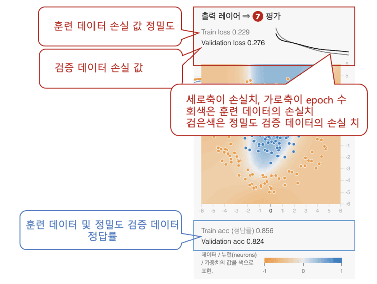

### 2. 조기 종료 및 CSV 로그

손실이 더 이상 감소하지 않을 때 학습을 자동 중단하려면 **조기 종료(Early Stopping)** 를 사용합니다.

`patience`는 몇 에포크 연속으로 손실 개선이 없을 때 중단할지를 지정합니다. 너무 작으면 조기에 중단되고, 너무 크면 낭비가 생깁니다. 일반적으로 5~10이 권장됩니다.

```python
# 조기 종료: 검증 손실이 2 에포크 연속 개선되지 않으면 중단
es = tf.keras.callbacks.EarlyStopping(monitor='val_loss', patience=2)

# CSV 로거: 에포크별 학습 이력 저장
csv_logger = tf.keras.callbacks.CSVLogger('training.log')

hist = model.fit(
    x=X_train,
    y=y_train,
    validation_data=(X_valid, y_valid),
    batch_size=BATCH_SIZE,
    epochs=EPOCHS,
    verbose=1,
    callbacks=[es, csv_logger]
)
```

CSV 로그 파일 다운로드:

```python
from google.colab import files
files.download('training.log')
```

---

## 테스트

학습과 평가에 사용한 데이터와 독립적인 **테스트 데이터**로 모델의 일반화 성능(Generalization Performance)을 검증합니다.

- `model.predict()`: 새로운 데이터에 대한 예측값 출력
- `model.evaluate()`: 손실값과 정확도 반환

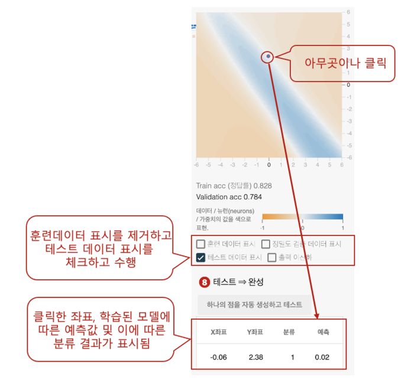

```python
import plygdata as pg
import numpy as np

# 독립적인 테스트 데이터 생성
PROBLEM_DATA_TYPE = pg.DatasetType.ClassifyTwoGaussData
TEST_DATA_RATIO = 1.0
DATA_NOISE = 0.0
data_list = pg.generate_data(PROBLEM_DATA_TYPE, DATA_NOISE)
X_test, y_test, _, _ = pg.split_data(data_list, training_size=TEST_DATA_RATIO)

# 예측 (predict)
result_proba = model.predict(X_test)
result_class = np.frompyfunc(lambda x: 1 if x >= 0.0 else -1, 1, 1)(result_proba)
print('proba:'); print(result_proba[:5])
print('class:'); print(result_class[:5])

# 일반화 성능 평가 (evaluate)
score = model.evaluate(X_test, y_test)
print('test loss:', score[0])
print('test acc:', score[1])
```

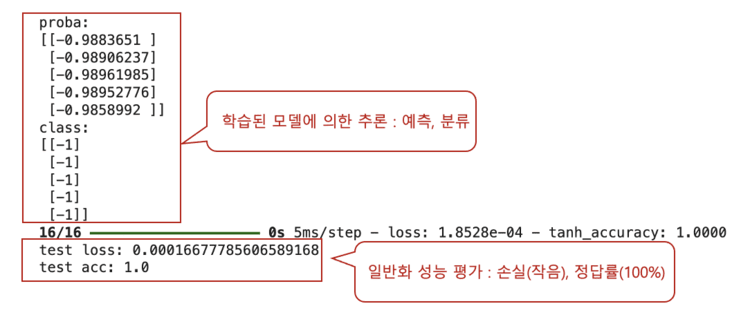

---

## 마치며

이 글(Part 2)에서는 모델 학습의 전체 사이클을 구현했습니다:

- **학습 설정**: 손실 함수(MSE), 최적화(SGD), 학습률, 배치 사이즈
- **학습 실행**: Backpropagation으로 가중치 갱신, `model.fit()`
- **평가**: 손실 그래프로 과학습 여부 판단, 조기 종료
- **테스트**: 미지의 데이터로 일반화 성능 검증

[Part 1(모델 정의)](https://www.mimul.com/blog/about-neural-network/)과 [Part 2(학습·평가)](https://www.mimul.com/blog/about-neural-network-2/)를 합치면 기본적인 뉴럴 네트워크 구현 사이클이 완성됩니다. 다음 단계로는 더 복잡한 데이터에 CNN이나 RNN을 적용하거나, 실전 데이터셋으로 직접 실험해보길 권장합니다.
