딥러닝의 기반 기술인 뉴럴 네트워크에 대해 요소 기술, 이론을 설명하고, 간단한 신경망을 구현하면서 패턴도 설명하고, 신경망이 어떻게 작동하는지를 이해하는 것을 목표로 한다. 신경망의 구현은 보다 심플한 코드로 하기 위해 Python(버전 3.6)과 딥러닝의 라이브러리 TensorFlow의 최신판 2.0을 이용한다. TensorFlow에는 고수준 API Keras(이하 tf.keras)를 사용한다. 개발 환경에 [Google Colaboratory(이하 Colab)](https://colab.research.google.com/)를 사용하고 신경망의 시각화에 구글에서 만든 [Playground](https://mimul.github.io/playground)를 이용한다.

그리고 여기에서 사용된 python 코드는 [Github](https://github.com/mimul/playground/blob/main/examples/tf2_keras_neuralnetwork.ipynb)에 공유되어 있다.

### 사전 준비 

이 단계는 [Playground](https://mimul.github.io/playground/#activation=tanh&activspacer=false&loss=mse&batchSize=10&batchFull=false&dataset=gauss&regDataset=reg-plane&learningRate=0.03&regularizationRate=0&noise=0&networkShape=&seed=0.58573&showTrainData=true&showValidationData=false&showTestData=true&discretize=false&percTrainData=50&x=true&y=true&xTimesY=false&xSquared=false&ySquared=false&sinX=false&sinY=false&problem=classification&initOrigin=false&hideText=true&xSquared_hide=true&ySquared_hide=true&xTimesY_hide=true&sinX_hide=true&sinY_hide=true)의 1, 2, 3 단계에 해당된다.

**1. 데이터 준비**

보통 딥러닝 기능(예를 들어 사람이나 고양이, 개를 식별하는)이 필요하면 먼저 해당하는 사람이나 고양이, 개가 들어가 있는 대량의 이미지를 수집해야 한다. 그럼 데이터 세트는 어떻게 수집하는가? 공개적으로 제공되는 데이터가 아니면 자신이 직접 대량의 데이터를 수집해야 한다. 공개된 데이터세트는 [캐글(Kaggle)](https://www.kaggle.com/datasets), [구글(Google) 데이터셋](https://datasetsearch.research.google.com/), [ImageNet](https://image-net.org/), [MNIST Dataset](https://www.kaggle.com/datasets/hojjatk/mnist-dataset) 등이 있다.

[Playground](https://mimul.github.io/playground/#activation=tanh&activspacer=false&loss=mse&batchSize=10&batchFull=false&dataset=gauss&regDataset=reg-plane&learningRate=0.03&regularizationRate=0&noise=0&networkShape=&seed=0.50683&showTrainData=true&showValidationData=false&showTestData=true&discretize=false&percTrainData=50&x=true&y=true&xTimesY=false&xSquared=false&ySquared=false&sinX=false&sinY=false&problem=classification&initOrigin=false&hideText=true&xSquared_hide=true&ySquared_hide=true&xTimesY_hide=true&sinX_hide=true&sinY_hide=true)상에서 실행하기 위해서 데이터 준비에서 좌표점을 선택하면 된다. 좌표점은, 옆의 X축이 -6.0 ~ 6.0, 세로의 Y축도 -6.0 ~ 6.0의 수치를 취하는 2차원의 좌표계에 많이 플롯한 모든 점을 말한다. 이번에는 이러한 점들 데이터를 사용한다. 파이썬 코드는 아래와 같다. 점들의 생성 처리는 뉴럴 네트워크와는 관계가 없기 때문에 [playground-data](https://pypi.org/project/playground-data/)를 사용하기로 한다. 이 라이브러리를 설치하려면 Colab에서 새 노트북을 만들고 하나의 셀에 다음을 입력하여 실행해 주면 된다.

```
! pip install playground-data
```

**2. 문제 유형**

문제 유형도 채택해야 한다. CNN? RNN? 적절한 기계 학습의 방법이나, 학습 방법, 알고리즘을 선택하거나, 적절한 것이 없으면 독자적으로 설계하거나 한다. 그리고 딥러닝보다 다른 기계 학습 수법이 정밀도가 좋거나 효율적으로 작성할 수 있는 경우가 있어 실제로 현장에서는 딥러닝 이외를 선택하는 경우도 많이 있다는 점도 알아두었으면 좋겠다.


여기에선 Playground상에서 실행하려면 분류(Classify)를 선택한다. 분류라고 하는 것은 사진이 개인지, 고양이인지를 판정하는 기계 학습 모델을 상상하면 알기 쉬울 것이다. 이번에는 개인지, 고양이인지 아니라, 청색(1.0)인가, 주황색(-1.0)인가를 판정한다. 2차원 좌표계에서는 청색 점군이 오른쪽 위쪽, 주황색 점군이 왼쪽 아래쪽에 편향되어 존재했다. 따라서 점군과 점군 사이에 선을 그리면 선의 오른쪽 상단에 있는 점은 청색, 선의 왼쪽 하단에있는 점은 주황색이라고 예측/추론 할 수 있다. 실제로 이것을 실현하는 것이 트레이닝(학습) 후의 기계 학습 모델(통칭=AI)인 것이다.

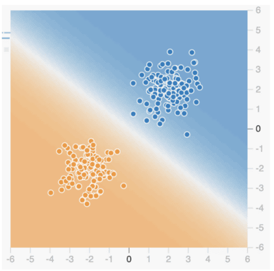

배경색은 Playground에서 트레이닝 후의 기계 학습 모델의 예측 결과를 시각화한 것이다(※ 플롯되어 있는 각 점은 오른쪽 상단의 청색 배경과 왼쪽 하단의 주황색 배경 사이에 흰색선이 만들어진 것을 알 수 있다. 이것이 위의 선에 해당하는 것으로 결정 경계(Decision boundary)라고 한다. 여기까지 신경망에서 작성한 기계 학습 모델로 분류 문제를 푸는게 어떤 것인지를 알 수 있었다.

그 다음 어떤 데이트 세트를 사용할 것인가는 가우시안(Gaussian, 정규 분포의 산 형상과 같이 특정 기준점에 집중하여 분포하는 데이터)을 선택하면 된다. 분류 문제와 데이터 종류를 설정하기 위한 코드를 Python으로 기술해 보자.

```
import plygdata as pg

PROBLEM_DATA_TYPE = pg.DatasetType.ClassifyTwoGaussData
```

plygdata를 pg라고 하는 별명으로 임포트해 그 중에서 정의되고 있는 DatasetType 클래스의 ClassifyTwoGaussData 클래스 변수의 값(분류, 2개의 가우시안 데이터)을 정수 PROBLEM_DATA_TYPE에 대입하는 것으로 작성한다.

**3. 전처리**

수집된 데이터에서 필요한 데이터를 선택하는 작업이 필요하다. 선별한 데이터가 그대로의 형태로 곧바로 사용할 수 있다는 것은 연습용 데이터도 아닌 한 일반적인 실용 데이터로는 별로 없다. 예를 들어 데이터의 일부가 결손하고 있으면 거기에는 랜덤값을 넣거나, 수치의 포맷이나 텍스트 항목이 데이터 입력자에 의해 흩어져 통일되어 있지 않으면 명칭 처리를 하거나, 그대로는 기계 학습에서 사용할 수 없는 데이터를 어떻게든 사용 가능한 형태로 정돈할 필요가 있다(데이터 클렌징 : Data cleansing). 데이터를 원하는 형태나 포멧으로 변환하는 과정인 데이터 랭글링(Data wrangling)도 필요하기도 하다.

이제는 실제 데이터를 생성하는 단계이다. 보통 기계 학습에서는 수집해 둔 데이터로부터 사용하는 데이터를 선별해 한층 더 기계 학습 모델의 입력 데이터로서 사용할 수 있도록 결손치를 메우거나 등으로 정돈하는 작업을 한다. 그래서 학습용 데이터(트레이닝 데이터), 평가용 데이터(정밀도 검증 데이터)로 나눈다. 

Playground에서 훈련용 50%를 지정하고 노이즈는 0%를 지정한다. 훈련용을 80%로 지정하면 나머지 20%가 정밀도 검증용이 된다. 당연히 훈련 데이터가 많을수록 정확도가 높아진다. 아래 그림에서처럼 훈련 데이터를 최대의 90%로 한 경우(왼쪽)와 최소의 10%로 한 경우(오른쪽)를 비교한 것이다.

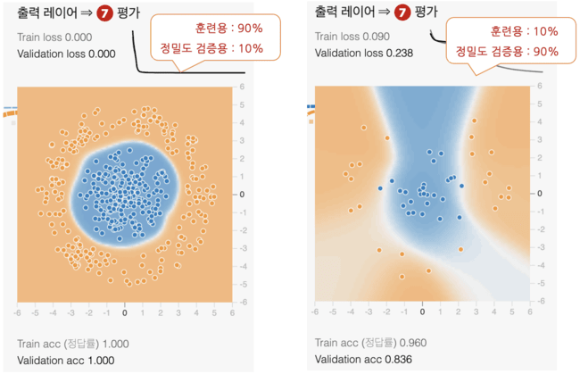

왼쪽의 90%의 배경이 짙고 깨끗한 원으로 되어 있어, 높은 정밀도의 모델을 생성할 수 있었음을 알 수 있다.

노이즈(noise)란 이상치 등의 불필요한 데이터를 말하며, 이번의 좌표점 데이터 세트에서는 노이즈의 수치를 크게 하면 점군의 흩어짐이 넓어진다. 당연히 노이즈가 적을수록 정확도가 높아진다. 노이즈나 이상치는 제거하는 것이 학습의 수렴이 빠르고 모델의 일반화 성능(임의의 테스트 데이터에 대한 학습이 끝난 모델의 퍼포먼스)도 높아진다. 한편, 화상 인식에서는 화상에 일부러 노이즈를 태워 보다 많이 학습하는 것으로 보다 안정된 학습 모델로 완성한다고 하는 테크닉도 있다. 요점은 노이즈도 케이스 바이 케이스로 생각하면서 처리할 필요가 있다는 것이다. 이번에는 노이즈를 0%로 지정한다.

훈련용/정밀도 검증용으로의 데이터 분할과 노이즈를 지정해 데이터 생성하기 위한 코드를 Python으로 기술해 보자. 

```
# 각종 설정을 상수로 정의
TRAINING_DATA_RATIO = 0.5  # 데이터의 몇 %를 훈련용, 나머지는 정밀도 검증용 ： 50％
DATA_NOISE = 0.0           # 노이즈： 0％

# 이미 정의된 상수를 인수로 지정하여 데이터를 생성한다
data_list = pg.generate_data(PROBLEM_DATA_TYPE, DATA_NOISE)

# 데이터를 훈련용과 정밀도 검증용을 지정 비율로 분할하고, 각각 데이터(X)와 교사 라벨(y)로 나눈다
X_train, y_train, X_valid, y_valid = pg.split_data(data_list, training_size=TRAINING_DATA_RATIO)
```

먼저 데이터 분할의 비율을 지정하는 TRAINING_DATA_RATIO와 노이즈를 지정하는 DATA_NOISE라는 두 개의 상수를 정의한다. 그런 다음 pg.generate_data() 함수를 호출하여 데이터를 생성하고 변수 data_list에 할당한다. 함수의 인수에는 앞에서 정의한 상수 PROBLEM_DATA_TYPE에서 문제 유형(분류) ＋ 데이터 종류(2개의 가우시안 데이터)와 상수 DATA_NOISE로 노이즈(0%)를 지정하고 있다.

생성된 data_list(다차원 목록 값)와 상수 TRAINING_DATA_RATIO에서 노이즈(훈련용 50%)를 인수로 지정하고, pg.split_data 함수를 호출해 데이터를 분할하고 있다(덧붙여서, 이 split_data 함수는 데이터 분할에서 자주 사용되는 라이브러리 scikit-learn의 train_test_split 함수를 모방해 만든 것이다). 분할 후의 데이터는 이하의 변수에 대입된다.

- X_train : 훈련 데이터의 좌표점(X). N행 2열 데이터
- y_train : 훈련 데이터의 교사 레이블(y). N행 1열 데이터
- X_valid : 정밀도 검증 데이터의 좌표점(X). N행 2열 데이터
- y_valid : 정밀도 검증 데이터의 교사 레이블(y). N행 1열 데이터

어느 변수도 라이브러리 NumPy의 다차원 배열치가 되고 있다(※ 딥러닝의 라이브러리는 기본적으로 NumPy에 대응하고 있으므로 그대로 사용할 수 있다). 

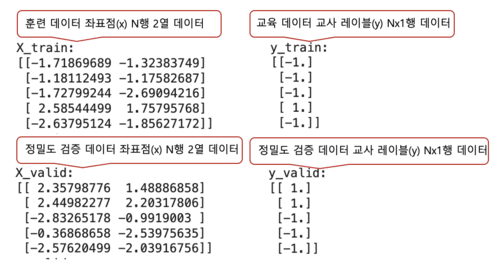

좌표점(X)에 있는 2열의 수치의 의미는 좌표(옆의 X축상의 값, 세로의 Y축상의 값)의 점이며, 모두 기본적으로 -6.0 ~ 6.0의 수치를 취한다. 교사 라벨(y)에 있는 1열의 수치의 의미는 1.0은 청색, -1.0은 주황색이다. 이상으로 데이터의 생성(통상은 데이터의 취득 ~ 전처리)은 완료되었다.

### 방법의 선택과 모델 정의: Neuron

Neural Networks(신경 네트워크)란 그 이름에서 처럼 뇌의 신경 네트워크 구조를 모방한 기계 학습의 한 방법이다. 그 신경망을 이해하기 위해, 그 기본 단위인 뉴런(neuron : 신경세포)을 먼저 이야기해야 한다. 또한 뉴런은 세포체 또는 단위를 의미하는 단위(unit)나 네트워크 구조에 있어서의 1개의 결절점을 의미하는 노드(node) 등의 명칭으로도 불린다. 뉴런의 기본 기능은 함수와 마찬가지로 복수의 입력을 받고, 이것을 사용해 어떠한 계산을 처리하고, 그 결과를 하나의 출력으로서 생성하는 것이다. 뉴런의 구조는 아래 그림을 통해 설명하겠다.

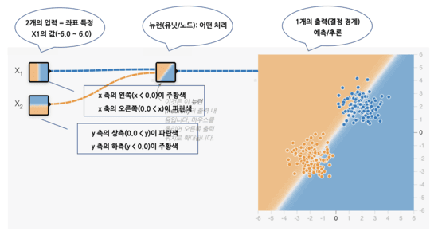

좌표가 (x, y)가 아닌 (Χ1, Χ2)로 표시된다. 또한 Χ1/Χ2와 같은 개별 입력 값과 개별 노드가 표현하는 것을 특징(feature) 또는 특징량이라고 한다. 0.0은 흰색, 즉 결정 경계의 선이 중앙에 똑바로 세로로 그려져 있는 특성을 가지고 있다. 위 그림과 같은 그림을 작성하려면 [Playground](https://mimul.github.io/playground/#activation=tanh&activspacer=false&loss=mse&batchSize=10&batchFull=false&dataset=gauss&regDataset=reg-plane&learningRate=0.03&regularizationRate=0&noise=0&networkShape=1&seed=0.10212&showTrainData=true&showValidationData=false&showTestData=true&discretize=false&percTrainData=50&x=true&y=true&xTimesY=false&xSquared=false&ySquared=false&sinX=false&sinY=false&problem=classification&initOrigin=false&hideText=false)를 열고 그 중앙 3개의 선 위를 각각 클릭하고, 그것에 의해 표시되는 팝업상에서 가중치에 1.0을 입력한다. 

**1. 입력**

앞서 가중치라고 나왔지만, 가중치(weight)란 입력을 증폭이나 감쇠시키기 위한 것이다. 앞서는 좌표(Χ1 , Χ2) 변수 각각에 대해 1.0과 고정값을 지정했기 때문에 아무것도 증감하지 않게 되지만, 본래는 이 가중치가 학습에 의해 자동적으로 계산되어 정해지는 것이다. 가중치는 각각 w1 , w2 라는 파라미터로 둔다고 하자. 따라서 뉴런에 대한 입력은 다음 공식으로 표현할 수 있다.

```
뉴런의 입력(미완성) = (w1 × Χ1)＋(w2 × Χ2)
```

사실 이것으로 끝이 아니다. 중학교에서 1차 함수를 배웠을 때 절편이라는 개념이 있었던 것을 기억할까? 예를 들어 y = ax + b 라는 1차 함수에서 a는 기울어지고 b는 절편이다. b의 값을 0, 1, 2 … 즉 절편이 있으면 함수의 위치를 어긋나게 되는 것이다. 만약 1차 함수에 절편이 없으면, 항상 그래프의 원점(0, 0)을 통과할 뿐이어서 유연하게 적용할 수 없다.

이것과 동일한 것이 위의 뉴런의 공식이라고도 할 수 있다. 뉴런에서 절편에 해당하는 것이 바이어스(bias)이다. 바이어스의 수치를 증감시켰을 때의 이미지를 아래 그림에 나타낸다. 배경이 어긋나는 모습을 볼 수 있을 것이다.

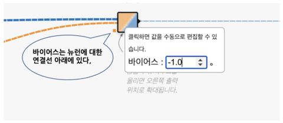

덧붙여서, Playground에서 바이어스를 편집하려면, 뉴런의 접속선 아래에 있는 작은 사각형을 클릭하면 표시되는 팝업창에서 [바이어스]의 수치를 입력하면 된다. 수치가 바뀔 때마다 오른쪽의 큰 그래프가 어긋나는 것을 체험할 수 있다.

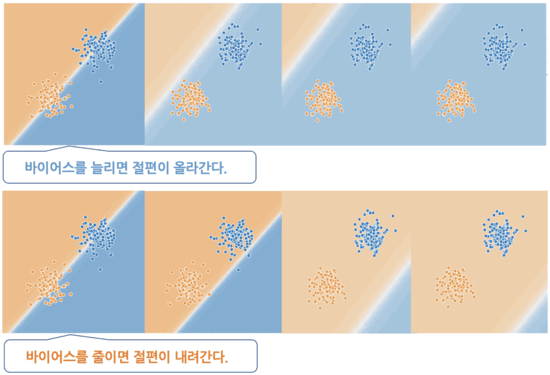

바이어스를 b라는 파라미터로 표현해 더하면, 뉴런의 입력식은 다음과 같이 된다.

```
뉴런의 입력(완성) = (w1 × Χ1 )＋(w2 × Χ2 )＋b
```

**2. 어떤 계산 처리 결과의 출력**

앞에 기술한 바와 같이 복수의 입력을 수신한 뉴런은 이들 입력을 사용하여 일부 계산을 수행하고 그 결과를 하나의 출력으로 생성한다. 이 어떤 계산을 활성화 함수(Activation function)라고 한다. 활성화 함수는 무제한 입력을 예측 가능한 범위로 변환하기 위한 것이다.

일반적인 활성화 함수 중 하나는 Sigmoid 함수(Sigmoid function)이다. 이 함수는 어떤 입력도, 즉 -∞ ~ +∞ 의 수치를, 0.0 ~ 1.0의 범위의 수치로 변환한다. 그래프의 시각은 x축이 입력하는 수치이며 y축이 변환 후에 출력되는 수치이다. 이를 보면 너무 큰 음수는 0으로 수렴하고 너무 큰 양수는 1로 수렴한다는 것을 알 수 있다. 그리고 Playground에서의 최종 출력은 -1.0(주황색) ~ 1.0(청색)이다. 즉, 신경망의 마지막 끝에 있는 활성화 함수로 -1.0 ~ 1.0 범위의 수치로 변환하고 있는 것이다. 이 범위로 변환하기에 좋은 활성화 함수는 tanh 함수(Hyperbolic tangent function )이다. 아래 그림은 Sigmoid 함수와 Hyperbolic tangent 힘수를 나타낸다.

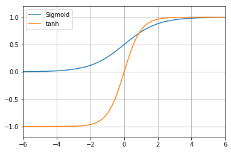

수치의 범위가 최종적인 출력의 범위와 일치하고 있는 것이 뉴런의 움직임을 파악하기 쉽다고 생각하기 때문에 여기에서는 시그모이드 함수는 아니고 tanh 함수를 사용하기로 한다. 이제 뉴런의 출력식을 내보내 보자. 활성화 함수를 a()로 놓으면 다음과 같이 된다.

```
뉴런의 출력 = a ((w1 × Χ1 ) + (w2 × Χ2 ) + b)
```

뉴런으로부터의 출력=활성화 함수(뉴런의 입력)라고 하는 식으로 되어 있는 것을 알아차리면 어렵지 않을 것이다. w1 = 0.6 , w2 = -0.2 , b = 0.8 이라고 가정하고 좌표(1.0 , 2.0)를 뉴런에 입력하면

```
뉴런의 출력 = a((0.6 × 1.0) + (-0.2 × 2.0) + 0.8)
　　　　   = a(1.0) = 0.761594 ...
```

라고 계산되어 출력값은 약 0.76이 된다(※ 활성화 함수 자체의 계산 방법은 이제 알았으니 위 게시 그래프에 있어서의 tanh 함수의 곡선을 보고, 가로축 1에 대응하는 세로축의 값을 육안 확인해 주었으면 한다). 

그럼 뉴런의 입력과 출력을 실시하는 코드를 Python으로 기술해 보자. TensorFlow안에 정의되어 있는 tf.keras 패키지를 사용하여 모델([Model 클래스](https://www.tensorflow.org/versions/r2.0/api_docs/python/tf/keras/Model)의 객체)을 작성한다. Keras에서 모델 작성 방법은 

- Sequential(적층형) 모델 : 컴팩트하고 간단한 모델의 설계에 유리
- Functional(함수형) API : 복잡한 모델도 정의할 수 있는 유연한 방법
- Subclassing(서브클래스형) 모델 : 난이도는 조금 오르지만, 풀 커스터마이즈가 가능

3종류가 있다. Functional API나 Subclassing 모델(Subclassing API)를 주로 사용하지만 여기에서는 기본인 Sequential 모델(Sequential API)을 사용해 본다. Sequential 모델에서도 쓰는 방법은

- Sequential 클래스의 생성자 사용 : 가장 기본적이고 간단한 설계
- Sequential 객체의 add 메서드로 추가 : 간단하지만 더 유연한 설계가 가능

2종류가 있다. 여기에서는 2개의 입력을 받아들여 그것을 사용한 계산 결과를 1개의 출력으로서 생성하는 뉴런을 모델화(모델 설계)한다.

```
import tensorflow as tf
import numpy as np

# 상수(모델 정의 시에 필요한 것)
INPUT_FEATURES = 2  # 입력(특징) 수： 2
LAYER1_NEURONS = 1  # 뉴런 수： 1

# 매개변수(뉴런에 대한 입력에 필요한 것)
weight_array = np.array([[ 0.6 ],
                         [-0.2 ]])       # 가중치
bias_array   = np.array([  0.8 ])        # 바이어스

# 적층형 모델 정의
model = tf.keras.models.Sequential([
  tf.keras.layers.Dense(
    input_shape=(INPUT_FEATURES,),       # 입력 특징
    units=LAYER1_NEURONS,                # 유닛 수
    weights=[weight_array, bias_array],  # 가중치와 바이어스의 초기값
    activation='tanh')                   # 활성화 함수
])

# 이 모델에 데이터를 입력하여 출력을 얻는다(예측: predict)
X_data = np.array([[1.0, 2.0]])          # 입력할 좌표 데이터(1.0, 2.0）
print(model.predict(X_data))             # 출력 얻기
# [[0.7615942]] ……
```
이제 뉴런의 모델 정의는 완료되었다. ```tf.keras.models.Sequential```부분에서 적층형 모델 정의하고 그 다음 모델에 입력한다. 그리고 좌표(1.0, 2.0) 중 하나만 데이터로 사용한다. 1행 2열(행이 데이터의 수, 열이 입력의 수)의 2차원 배열을 만들어, X_data라고 하는 변수에 대입하고 있다. 그 X_data를 인수로 지정해 model 객체의 predict() 메소드를 호출하고 있다. predict() 메소드는 위에서 행한 뉴런으로부터의 출력의 계산을 자동적으로 실행해 반환값으로서 모델로부터의 출력을 돌려준다. 반환값은 print() 메소드로 출력하고 있다. 위의 코드 예제와 같이 모델에 데이터를 입력하고 내부적으로 어떤 변환을 한 다음 새로운 출력 값을 얻는 흐름(프로세스)을 순방향 전파(Forward Propagation)라고 한다.

### 방법의 선택과 모델 정의: NN(Neural Network)

신경망의 기본형은 입력 레이어/숨겨진 레이어/출력 레이어(Input layer/Hidden layer/Output layer)이라는 3층 구조를 형성하는 것이다(※ 숨겨진 레이어는 중간층 : Intermediate layer 라고도 불린다). [Playground](https://mimul.github.io/playground/#activation=tanh&activspacer=false&loss=mse&batchSize=10&batchFull=false&dataset=gauss&regDataset=reg-plane&learningRate=0.03&regularizationRate=0&noise=0&networkShape=1&seed=0.61539&showTrainData=true&showValidationData=false&showTestData=true&discretize=false&percTrainData=50&x=true&y=true&xTimesY=false&xSquared=false&ySquared=false&sinX=false&sinY=false&problem=classification&initOrigin=false&hideText=true&xSquared_hide=true&ySquared_hide=true&xTimesY_hide=true&sinX_hide=true&sinY_hide=true)에 들어가보면 아래 그림을 볼 수 있다.

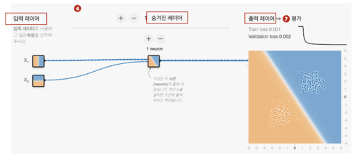

위 그림은 입력 레이어(Χ1과 Χ2라는 특징이 있음), 숨겨진 레이어(1개의 뉴런이 있음, 두개의 입력/하나의 출력), 출력 레이어(1개의 뉴런이 있음, 하나의 입력/하나의 출력)의 뉴런으로 구성되어 있다. 신경망의 경우 입력 계층의 특징은 데이터의 입력 위치이며 엄격하게는 뉴런이 아니다. 즉, 입력 레이어의 Χ1이나 Χ2는 다음의 숨겨진 레이어에 있는 각 뉴런의 입력으로서 그대로 사용되는 것 뿐이다(활성 함수에 의한 변환은 입력층에서는 행해지지 않는다). 따라서, 앞서 3층 구조라고 썼지만, 네트워크의 외형은 3층이라도 실질적으로는 2층 구조이다. 이와 같이 층을 세는 방법은 견해나 사고방식에 따라 바뀌어 버리므로 주의해야 한다.

앞에선 숨겨진 레이어도 출력 레이어도 1개의 뉴런밖에 없었다. 신경망에서는 각각 뉴런의 수를 원하는 만큼 늘릴 수 있다. Playground에서 제공 기능에는 출력 레이어는 1개의 뉴런 고정이지만, 숨겨진 레이어에서는 8개까지 뉴런을 늘릴 수 있다. 덧붙여서 Playground상에서 실제로 늘려 보는 경우는 [이쪽](https://mimul.github.io/playground/#activation=tanh&activspacer=false&loss=mse&batchSize=10&batchFull=false&dataset=gauss&regDataset=reg-plane&learningRate=0.03&regularizationRate=0&noise=0&networkShape=1&seed=0.61539&showTrainData=true&showValidationData=false&showTestData=true&discretize=false&percTrainData=50&x=true&y=true&xTimesY=false&xSquared=false&ySquared=false&sinX=false&sinY=false&problem=classification&initOrigin=false&hideText=true&xSquared_hide=true&ySquared_hide=true&xTimesY_hide=true&sinX_hide=true&sinY_hide=true)을 열고 "수치 neurons"라고 하는 표기 위에 있는 [+]/[-]버튼을 클릭하면 된다.

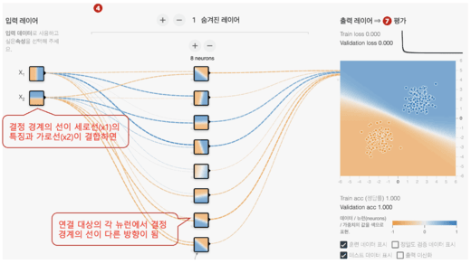

위 그림을 보면 입력층의 Χ1에는 세로선이, Χ2에는 가로선이 그려져 있다. 이어지는 숨겨진 레이어의 각 뉴런에는 다양한 방향의 선이 그려져 있다. 이것은 세로선과 가로선을 각각 가중치(w1이나 w2)를 곱해 더하면((w1 × Χ1 )+(w2 × Χ2)), 경사 등의 다양한 방향의 선이 생긴다는 것이다. 이렇게하면 단일 뉴런보다 약간 복잡한 문제를 해결할 수 있다. 앞서 언급했듯이 숨겨진 레이어가 하나의 뉴런만으로도 대각선이 생성될 수 있음을 확인할 수 있었다. 따라서 이전에 선택한 데이터 세트 Gaussian의 분류 문제를 해결할 수 있다.

그렇다면 더 복잡한 데이터 세트 원(Circle)의 경우는 어떨까? 숨겨진 레이어에 있는 8개의 뉴런의 앞에 있는 것은 출력 레이어에 있는 1개의 뉴런이다. 이 출력층의 뉴런은 또한 숨겨진 레이어에 있는 8개의 뉴런이 가지는 다양한 방향의 선을 입력으로 하고, 각각에 가중치를 곱한 다음에 더한 후의 결과가 출력 레이어에 그리게 된다. 방향선이 많을수록 다양한 도형을 그릴 수 있다. 예를 들어 숨겨진 레이어의 뉴런이 1개 라면 선이 되고 2개 라면 모서리가 있는 영역이 되고 3개 라면 삼각형이 되고 4개 라면 사각이 되고 5~7개면 오각이 되고 8개면 원에 가깝게 된다.

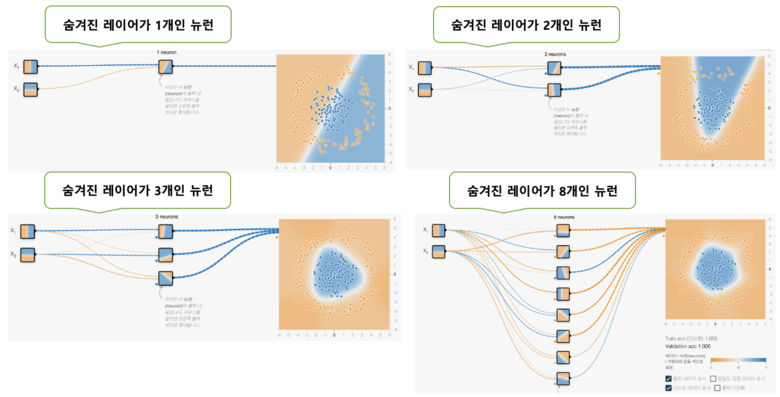

숨은 레이어의 뉴런수가 1개(선)나 2개(모서리가 있는 영역)에서는 문제를 해결할 수 없다. 8개(원에 가까운 영역)이면 해결할 수 있지만, 이것은 계산 처리에 시간이 걸린다. 3개(삼각형)면 문제도 거의 해결할 수 있고 계산 처리도 비교적 빠르다. 따라서, 이 문제의 예에서는 숨겨진 레이어에 뉴런을 3개 준비하면 가장 효율이 좋을 것이라는 예측이 가능하다. 이러한 방식으로 뉴런의 수를 결정할 수 있다. 다만 현실적으로는 이 예와 같이 숨겨진 레이어의 각 뉴런의 특징을 미리 이미지할 수 있는 단순한 문제 케이스는 적기 때문에 뉴런의 수를 늘리거나 줄이는 시행착오를 겪는게 필요하다. 이것이 신경망의 기본 형태이다.

그런데, 신경망의 기본형은 3층이었지만, 숨겨진 레이어는 1층, 2층, 3층 으로 원하는 만큼 늘릴 수 있다. Playground의 제공 기능에서는 숨겨진 레이어의 레이어는 6개까지 늘릴 수 있다. 덧붙여서 Playground상에서 실제로 늘려 보는 경우는 [이쪽](https://mimul.github.io/playground/#activation=tanh&activspacer=false&loss=mse&batchSize=10&batchFull=false&dataset=gauss&regDataset=reg-plane&learningRate=0.03&regularizationRate=0&noise=0&networkShape=1&seed=0.55381&showTrainData=true&showValidationData=false&showTestData=true&discretize=false&percTrainData=50&x=true&y=true&xTimesY=false&xSquared=false&ySquared=false&sinX=false&sinY=false&problem=classification&initOrigin=false&hideText=true&xSquared_hide=true&ySquared_hide=true&xTimesY_hide=true&sinX_hide=true&sinY_hide=true)을 열고 "수치 숨겨진 레이어"이라고 하는 표기의 왼쪽에 있는 [+]/[-]버튼을 클릭해 주면 된다. 또한 뉴런의 수는 방금전과 마찬가지로 각 레이어에서 8개까지 늘릴 수 있다.

숨겨진 레이어를 2층 이상으로 늘린 신경망은 기본형과 차별화하여 딥 신경망(DNN : Deep Neural Network, 혹은 심층 신경망)이라고 불린다. 그렇다면 숨겨진 레이어의 레이어수를 늘리면 어떤 효과가 있을까? 이것도 앞서 설명한 뉴런 수를 늘리는 경우와 거의 같다. 예를 들면 삼각과 삼각을 조합하면 매우 복잡한 도형을 표현할 수 있게 될 것이다. 요컨대, 레이어의 수를 늘리면 늘릴수록 고도로 복잡한 문제를 해결할 수 있게 되는 것이다. 그것이 바로 DNN이나 딥러닝의 진가인 것이다.

단, 뉴런 수를 늘릴 때와 같은 문제를 안고 있고 레이어 수를 늘리면 늘릴수록 계산에 시간이 걸리게 되어 처리 속도가 느려진다. 따라서 레이어 수도 가능한 한 적게해서 문제 해결할 수 있을수록 좋은 방법이 된다. Playground에서 준비하고 있는 분류 문제의 데이터 세트 중에서 가장 복잡한 것은 나선(Spiral)이지만, 이 문제를 해결하려면 숨겨진 레이어의 수가 3개 이상이 되면 보다 해결하기 쉬워진다. 아래 그림처럼 숨겨진 레이어의 레이어 수가 1개/2개/3개/6개인 경우 나선형 분류 문제가 어떻게 해결되는지를 보여준다. 아래 그림은 1000회(1000 에포크) 학습한 결과(배경)의 비교이다.

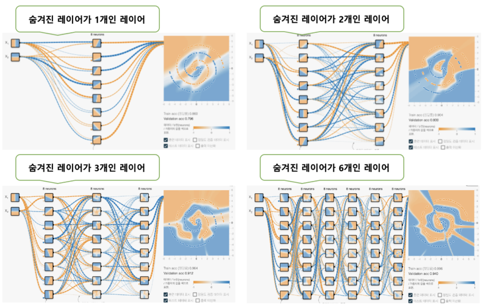

각 출력의 배경색에 주목하면 왼쪽 상단의 1개, 오른쪽 상단의 2개, 좌측 하단의 3개, 오른쪽 하단의 6개 순으로 보다 정확하게 문제 해결할 수 있게 되어 있음을 알 수 있다. 첫번째 각 레이어의 뉴런은 결정 경계선이 다양한 직선이었는데, 두번째 레이어의 각 뉴런은 결정 경계선이 보다 복잡한 곡선이 되었다. 레이어의 수를 늘리면 늘어날수록 보다 복잡한 곡선이나 도형을 표현할 수 있게 되어 고도의 문제를 풀 수 있다고 이미 말했지만, 이것이 그 증거이다. 이상이 딥 신경망의 기본이다.

모델만을 정의하고, 가중치나 바이어스의 초기치는 지정하지 않는다(통상은 명시적으로 개별의 값을 지정하지 않는다.). 또, 방금전은 데이터를 입력해 포워드 프로퍼게이션을 체험했지만, 이번에는 실시하지 않는 것으로 한다. 여기에서는 숨겨진 레이어의 레이어를 2개 준비해 각 레이어의 뉴런의 수는 3개씩으로 해 보자. 이것은 다음과 같은 코드가 된다.

```
import tensorflow as tf
import numpy as np

# 상수(모델 정의 시 필요한 숫자)
INPUT_FEATURES = 2  # 입력(특징) 수 ： 2
LAYER1_NEURONS = 3  # 뉴런 수 : 3
LAYER2_NEURONS = 3  # 뉴런 수 ： 3
OUTPUT_RESULTS = 1  # 출력 결과 수 ： 1

# 가중치와 바이어스 매개변수를 지정하지 않음(일반적으로 지정하지 않음)

# 적층형 모델 정의
model = tf.keras.models.Sequential([
  # 숨겨진 레이어: 첫 번째 레이어
  tf.keras.layers.Dense(
    input_shape=(INPUT_FEATURES,),       # 입력(입력 레이어)
    units=LAYER1_NEURONS,                # 유닛 수
    activation='tanh'),                  # 활성화 함수
  # 숨겨진 레이어: 두 번째 레이어
  tf.keras.layers.Dense(
    units=LAYER2_NEURONS,                # 유닛 수
    activation='tanh'),                  # 활성화 함수
  # 출력 레이어
  tf.keras.layers.Dense(
    units=OUTPUT_RESULTS,                 # 유닛 수
    activation='tanh'),                  # 활성화 함수
])
```

숨겨진 레이어의 첫번째 레이어에는 입력 레이어의 데이터 입력 부분을 의미하는 키워드 input_shape가 지정되어 있지만 그 이후의 레이어에서는 이전 레이어에서 데이터가 흐르기 때문에 이 키워드 지정이 불필요하게 되어 있는 것에 주의하면 된다. 이 코드 예는 4계층으로 구성된 딥 신경망아다. 3층의 뉴럴 네트워크의 기본형으로 하려면 숨겨진 레이어: 2번째 레이어 부분을 잘라야 하며, 반대로 5층 이상 으로 하려면 숨겨진 레이어: 2번째 레이어 부분을 3번째, 4번째로 늘려가면 된다. 덧붙여서 Keras에서는 확인용으로 모델의 개요를 출력할 수도 있다. 여기에는 model.summary()라는 코드를 실행하기만 하면 된다.

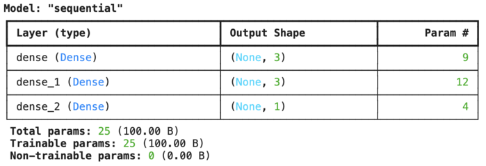

Keras내에서는 'sequential'이라는 이름의 모델이 생성되어 있어 dense_1이라는 이름의 레이어(숨겨진 레이어: 첫번째 레이어) 외에 dense_2(숨겨진 레이어: 두번째 레이어), dense_3(출력 레이어)의 총 3개의 레이어가 있음을 알 수 있다. 출력 형상(Output Shape)은 순서대로 3개, 3개, 1개가 된다. 입력층에서 2번째 레이어로의 접속선(가중치)의 수는 2×3= 6개로, 바이어스의 수는 3개가 되기 때문에 합계 9개가 dense_1의 파라미터수(Param #: Parameter number)가 된다. 마찬가지로 계산하면 dense_2의 파라미터는 합계 12개, dense_3의 파라미터는 합계 4개이다. 파라미터 수를 정리하면, 9+12+4= 25개가 파라미터의 총수(Total params)가 되어, 학습/훈련 가능한 파라미터수도 25개이다(※ 훈련 불가능은 0개. 통상은 훈련 가능하지만, 필요가 있을 때는 훈련 불가능하게 해 파라미터값을 프리즈하는 기능이 Keras에는 있다).

Playground의 상단에 있는 (4) 방법의 선택: 모델의 정의를 보면 활성화 함수와 정규화를 지정할 수 있다. 그 옆에 있는 (5) 학습 방법의 설계: 모델의 생성에는 학습율이나 손실 함수, 최적화, 배치 사이즈등이 있다. 이것들은 학습 방법을 커스터마이즈/조정하기 위한 것으로 하이퍼 파라미터라고 한다. 또한, 지금까지 설명해 온 뉴런이나 레이어의 수도 하이퍼 파라미터의 일종이다. 마지막으로 활성화 함수와 정규화에 대해 간단히 소개하고 끝낸다.

### 방법의 선택과 모델의 정의 : 활성화 함수

활성화 함수에 대해서는 이미 시그모이드 함수와 tanh 함수를 소개했다. 이들 이외에도 연구에 의해 더 좋은 것이 계속해서 고안되고 있다. 여기서는 대표적인 것으로서 시그모이드 함수와 tanh 함수 외에 선형 함수와 ReLU 함수도 다루어 비교해 보자.

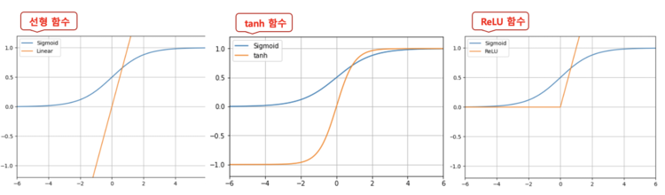

차이를 알기 쉽게 시그모이드 함수를 비교 대상으로 하여 선형 함수/tanh 함수/ReLU 함수의 3개를 표시하였다. 활성화 함수는 내용의 수식보다 그 수식이 어떤 형태의 선을 그리는지를 의식하는 것이 중요하다.

- 시그모이드 함수는 -∞ ~ +∞ 의 수치를 0.0 ~ 1.0 의 범위의 수치로 변환한다.
- 한편, 선형 함수는 값을 변환하지 않고 그대로 출력한다.
- tanh 함수도 설명이 끝나고, -1.0 ~ 1.0 의 범위의 수치로 변환한다.
- ReLU 함수는 0.0 ~ +∞ 범위의 수치로 변환한다.

어떤 선형 함수를 사용하는지는 실제로 사용해보고 시행착오를 할 수밖에 없지만, 기본적으로

```
선형 함수 < 시그모이드 함수 < tanh 함수 < ReLU 함수
```

의 순서로 효율적으로 학습할 가능성이 높다. 덧붙여서 예를 들면 ReLU 함수와 같이 최소치가 0.0이 되는 경우는 중간의 숨겨진 레이어의 각 뉴런은 -1.0 등의 마이너스치를 출력할 수 없기 때문에, 주황색(-1.0)을 표현할 수 없고, 백색(0.0) ~ 청색(1.0이상)으로 표현되게 되기 때문에 주의해야 한다.

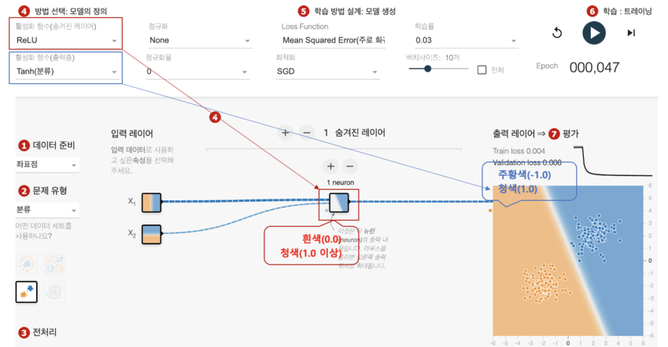

Playground에서 선택할 수 있는 활성화 함수는 linear(선형), sigmoid(시그모이드), tanh(Tanh), softsign(소프트 사인), softplus(소프트 플러스), relu(ReLU), elu(eLU), selu(SeLU) 등이 있다.

```
import tensorflow as tf
import numpy as np

# 상수(모델 정의 시 필요한 숫자)
INPUT_FEATURES = 2      # 입력(특징) 수 ： 2
LAYER1_NEURONS = 3      # 뉴런 수 ： 3
LAYER2_NEURONS = 3      # 뉴런 수 ： 3
OUTPUT_RESULTS = 1      # 출력 결과 수： 1
ACTIVATION = 'sigmoid'  # 활성화 함수 : sigmoid 함수

# 적층형 모델 정의
model = tf.keras.models.Sequential([
  # 숨겨진 레이어: 첫 번째 레이어
  tf.keras.layers.Dense(
    input_shape=(INPUT_FEATURES,),       # 입력(입력 레이어)
    units=LAYER1_NEURONS,                # 유닛 수
    activation=ACTIVATION),              # 활성화 함수
  # 숨겨진 레이어: 두 번째 레이어
  tf.keras.layers.Dense(
    units=LAYER2_NEURONS,                # 유닛 수
    activation=ACTIVATION),              # 활성화 함수
  # 출력 레이어
  tf.keras.layers.Dense(
    units=OUTPUT_RESULTS,                # 유닛 수
    activation='tanh'),                  # 활성화 함수
])
```

### 방법의 선택과 모델의 정의 : 정규화

정규화(Regularization, Regularizer)는 주로 과학습을 방지하기 위한 테크닉의 하나이다. 과학습을 막는 테크닉으로서 그 밖에는 드롭아웃(Dropout)이 유명하지만, Playground에는 드롭아웃 기능이 없기 때문에 이번에는 설명을 제외한다. 원래 과학습(overfitting, 과잉적합)이란, 훈련 데이터에 특화되어 너무 과학습을 하면 그것이 오히려 임의의 데이터(테스트 데이터 등)에는 적합하지 않게 되는 것이다. 정규화에는 주로 다음의 2종류가 있다.

- L1 : 불필요한 뉴런을 억제/제거하여 모델의 내용을 심플(희소)하게 한다
- L2 : 가중치에 페널티를 추가하여 과도한 학습을 방지한다.

특히 L2에 의한 가중치의 정규화는 신경망에서는 가중 감쇠(Weight Decay)라고 불리며, 자주 이용된다. 어느 쪽을 사용하는지는 케이스 바이 케이스이지만, 기본적으로는 L2를 사용하는 것이 많을 것이다. 과학습이 발생하기 쉬운 것은 데이터에 노이즈가 많고( 이상치 등의) 훈련 데이터 수가 적은 경우이다. 이 상황을 만들려면 Playground를 열고 이전에 설명한 (3)전처리 부분에서

- 데이터 분할: 훈련용 10%
- 소음: 50%

등으로 설정하면 된다. 

아래 그림은 정규화를 없음, L1, L2를 선택한 결과이다. 정규화율은 모두 0.03을 지정했고 에포크는 1000회 실시했다.

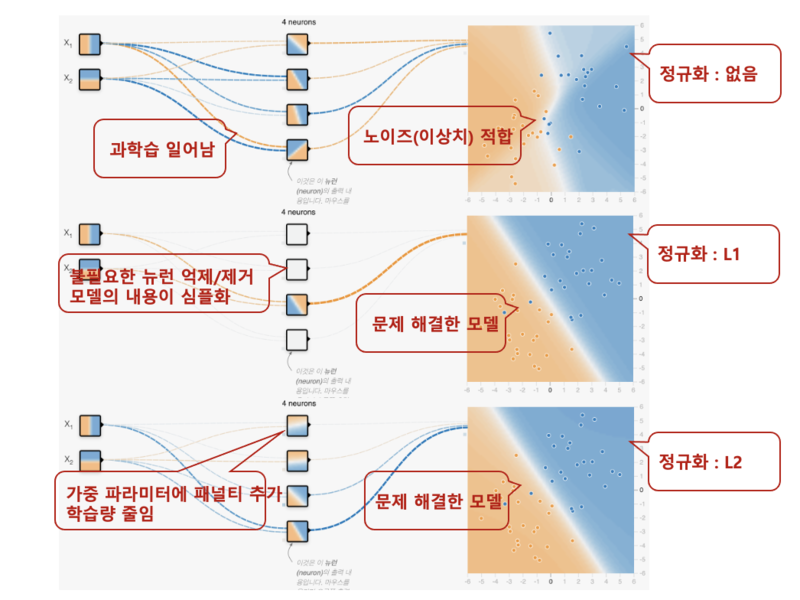

정규화 없음은 과학습을 일으키고 있어 임의의 데이터를 넣으면 부정해를 많이 낼 가능성이 있는 모델이 되어 버리고 있다. L1 정규화를 실시하면 숨겨진 레이어의 뉴런이 백색으로 되어 있는 것이 있어 뉴런이 억제/제거되고 있는 것을 알 수 있다. 그 결과 모델이 단순해지고 적절하게 문제를 해결할 수 있게 되었다. L2 정규화를 실시하면 없음에 비해 접속선(가중치)이 가늘고 얇아져 있어 너무 학습하지 못하게 된 것을 알 수 있다. 그 결과 제대로 문제를 해결할 수 있게 된다. 이상이 정규화의 효과를 보여줬다.

그 다음은 정규화율인데 Playgroud를 통해 설정을 변경해서 테스트 해 볼 수 있는데, 0.003에서는, L1도 L2도 수치가 지나치게 작아, 거의 학습 결과에 영향을 주지 않는 것을 알 수 있었고, 다음 0.03은 L1도 L2에서도 잘 학습되어 있는 것 같았다. 0.3 은 L1은 배경이 흰색으로되어 전혀 학습할 수 없게 되어 버리고 있다. L2는 적당히 학습되고 있지만, 이전의 0.03보다 색이 얇아져 버렸다. 그리고 3은 L1도 L2도 수치가 너무 커서 전혀 학습할 수 없다. 이와 같이 정규화율도 적당한 수치를 시행착오로 모색할 필요가 있어 보인다. 대체로는 0.01부근에서 중심으로 찾으면 좋다.