## 들어가며

딥러닝의 기반 기술인 뉴럴 네트워크(Neural Network)가 어떻게 동작하는지를 코드와 시각화로 단계별로 이해하는 것을 목표로 합니다.

**사전 지식**: Python 기초 문법과 기본적인 수학(함수, 좌표계) 수준이면 충분합니다. 딥러닝 경험은 없어도 됩니다.

구현에는 **Python 3.6** 과 **TensorFlow 2.0(tf.keras)** 을 사용합니다. TensorFlow 2.0은 1.x 대비 Eager Execution이 기본 활성화되어 코드가 직관적이고, Keras가 공식 고수준 API로 통합되어 모델 정의가 간결합니다.

| 도구 | 역할 |
|------|------|
| [Google Colaboratory(Colab)](https://colab.research.google.com/) | 개발/실행 환경 (GPU 무료 제공) |
| [Playground](https://mimul.github.io/playground) | 신경망 동작 시각화 |
| [playground-data](https://pypi.org/project/playground-data/) | 학습 데이터 생성 라이브러리 |

이 글에서 사용한 Python 코드는 [GitHub](https://github.com/mimul/playground/blob/main/examples/tf2_keras_neuralnetwork.ipynb)에 공유되어 있습니다.

 ---

## 1단계: 데이터 준비

딥러닝 모델을 만들려면 먼저 학습에 사용할 데이터가 필요합니다. 실제 프로젝트에서는 [Kaggle](https://www.kaggle.com/datasets), [Google 데이터셋](https://datasetsearch.research.google.com/), [ImageNet](https://image-net.org/) 등 공개 데이터를 활용하거나 직접 수집합니다.

이 글에서는 2차원 좌표계(X축 -6.0 ~ 6.0, Y축 -6.0 ~ 6.0)의 점 데이터를 사용합니다. [Playground](https://mimul.github.io/playground)의 좌측 패널 DATA 항목에서 데이터 종류를 선택하는 단계에 해당합니다.

데이터 생성에는 `playground-data` 라이브러리를 사용합니다. Colab에서 다음을 실행해 설치합니다:

```bash
!pip install playground-data
```

---

## 2단계: 문제 유형 선택

수집한 데이터로 어떤 문제를 풀 것인지 결정합니다. CNN(이미지), RNN(시계열) 등 다양한 방법이 있으며, 딥러닝보다 다른 기계 학습 기법이 더 효율적인 경우도 많습니다.

이 글에서는 **분류(Classification)** 를 선택합니다. 좌표계에서 청색 점(1.0)과 주황색 점(-1.0)을 구분하는 문제입니다.


학습 후 모델은 아래와 같이 결정 경계(Decision Boundary)를 형성하여 새로운 좌표가 어느 색에 속하는지 예측합니다.

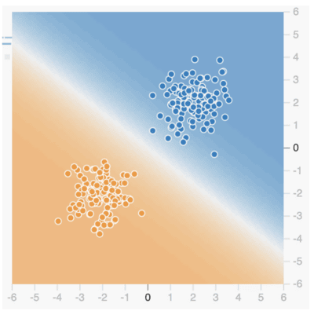

데이터 종류는 **가우시안(Gaussian)** 을 선택합니다. 특정 기준점에 집중하여 정규 분포로 퍼져 있는 데이터입니다.

```python
import plygdata as pg

PROBLEM_DATA_TYPE = pg.DatasetType.ClassifyTwoGaussData
```

---

## 3단계: 전처리

수집한 원시 데이터는 그대로 사용하기 어렵습니다. 결손값 처리, 형식 통일, 이상치 제거 등의 데이터 클렌징(Data Cleansing)과 데이터 랭글링(Data Wrangling)이 필요합니다.

전처리의 핵심은 데이터를 **훈련용(Training)** 과 **검증용(Validation)** 으로 분할하는 것입니다. 훈련 데이터가 많을수록 모델 정확도가 높아집니다.

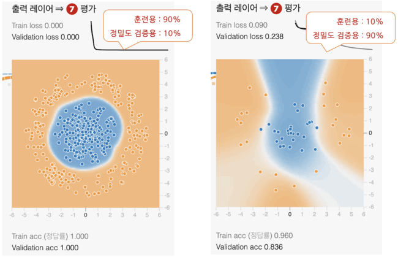

노이즈(이상치 등 불필요한 데이터)는 적을수록 정확도가 높아지지만, 이미지 인식처럼 의도적으로 노이즈를 추가해 모델을 강건하게 만드는 경우도 있습니다. 이 글에서는 훈련 데이터 50%, 노이즈 0%로 설정합니다.

```python
import plygdata as pg

PROBLEM_DATA_TYPE = pg.DatasetType.ClassifyTwoGaussData
TRAINING_DATA_RATIO = 0.5  # 훈련 데이터 비율: 50%
DATA_NOISE = 0.0           # 노이즈: 0%

data_list = pg.generate_data(PROBLEM_DATA_TYPE, DATA_NOISE)
X_train, y_train, X_valid, y_valid = pg.split_data(
    data_list, training_size=TRAINING_DATA_RATIO
)
```

> 참고: `split_data`는 scikit-learn의 `train_test_split`을 모방한 함수입니다.

분할된 변수의 의미:

| 변수 | 내용 |
|------|------|
| `X_train` | 훈련 데이터 좌표점. N행 2열 NumPy 배열 |
| `y_train` | 훈련 데이터 레이블. N행 1열 (1.0=청색, -1.0=주황색) |
| `X_valid` | 검증 데이터 좌표점. N행 2열 NumPy 배열 |
| `y_valid` | 검증 데이터 레이블. N행 1열 |

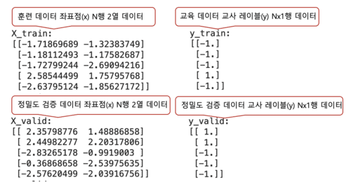

---

## 모델 설계

데이터가 준비되었으면 신경망 모델을 설계합니다.

### 뉴런(Neuron)

Neural Network는 뇌의 신경 네트워크 구조를 모방한 기계 학습 방법입니다. 그 기본 단위인 **뉴런(Neuron)** 은 복수의 입력을 받아 계산 후 하나의 출력을 생성합니다.

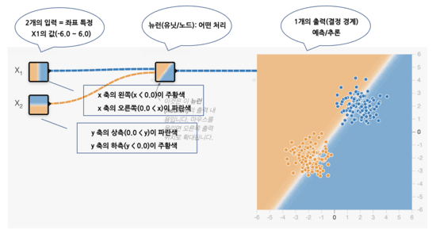

**1. 입력과 가중치**

각 입력(Χ1, Χ2)에는 **가중치(Weight, w1, w2)** 가 곱해집니다. 가중치는 학습을 통해 자동으로 결정됩니다.

```
뉴런의 입력(미완성) = (w1 × Χ1) + (w2 × Χ2)
```

여기에 **바이어스(Bias, b)** 를 더합니다. 바이어스는 1차 함수의 절편과 같은 역할로, 결정 경계의 위치를 이동시킵니다.

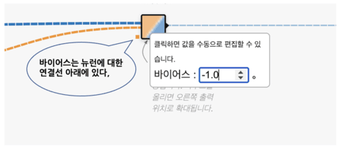

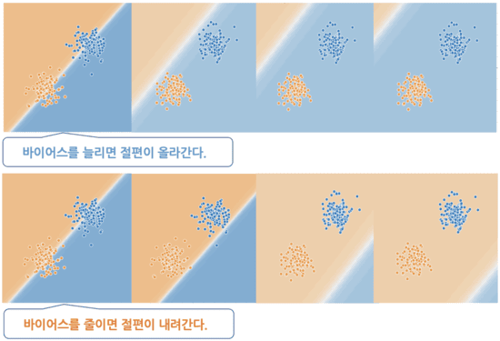

```
뉴런의 입력(완성) = (w1 × Χ1) + (w2 × Χ2) + b
```

**2. 활성화 함수와 출력**

뉴런은 입력값을 **활성화 함수(Activation Function)** 를 통해 변환한 후 출력합니다. 활성화 함수는 무제한 범위의 입력을 예측 가능한 범위로 변환합니다.

Playground의 최종 출력 범위가 -1.0 ~ 1.0이므로, 동일한 범위로 변환하는 **tanh 함수**를 사용합니다.

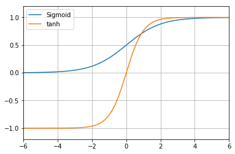

```
뉴런의 출력 = tanh((w1 × Χ1) + (w2 × Χ2) + b)
```

예시: w1 = 0.6, w2 = -0.2, b = 0.8, 입력 (1.0, 2.0)이면

```
뉴런의 출력 = tanh((0.6 × 1.0) + (-0.2 × 2.0) + 0.8) = tanh(1.0) ≈ 0.762
```

이처럼 데이터를 입력받아 내부 변환 후 출력값을 얻는 흐름을 **순방향 전파(Forward Propagation)** 라고 합니다. 실제 학습은 출력과 정답의 차이(손실)를 역방향으로 전파하며 가중치를 갱신하는 **역방향 전파(Backpropagation)** 로 이루어집니다. 이 학습 과정은 Part 2에서 자세히 다룹니다.

TensorFlow(Keras)로 뉴런을 모델화하면 다음과 같습니다:

```python
import tensorflow as tf
import numpy as np

INPUT_FEATURES = 2  # 입력(특징) 수
LAYER1_NEURONS = 1  # 뉴런 수

weight_array = np.array([[ 0.6], [-0.2]])  # 가중치
bias_array   = np.array([  0.8])           # 바이어스

model = tf.keras.models.Sequential([
    tf.keras.layers.Dense(
        input_shape=(INPUT_FEATURES,),
        units=LAYER1_NEURONS,
        weights=[weight_array, bias_array],
        activation='tanh'
    )
])

X_data = np.array([[1.0, 2.0]])
print(model.predict(X_data))  # [[0.7615942]]
```

---

### 신경망(Neural Network) 구조

신경망의 기본 구조는 **입력 레이어 → 숨겨진 레이어(Hidden Layer) → 출력 레이어** 의 3층입니다. 단, 입력 레이어는 활성화 함수를 거치지 않으므로 실질적으로는 2층 구조입니다.

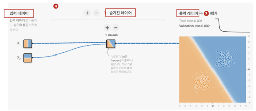

**뉴런 수를 늘리면?**

숨겨진 레이어의 뉴런 수를 늘릴수록 더 복잡한 결정 경계를 표현할 수 있습니다.

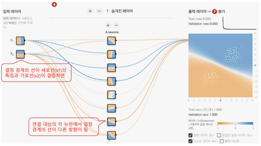

원(Circle) 분류 문제를 예로 들면, 뉴런이 1개면 직선, 2개면 꺾인 영역, 3개면 삼각형, 8개면 원에 가까운 경계를 그립니다.

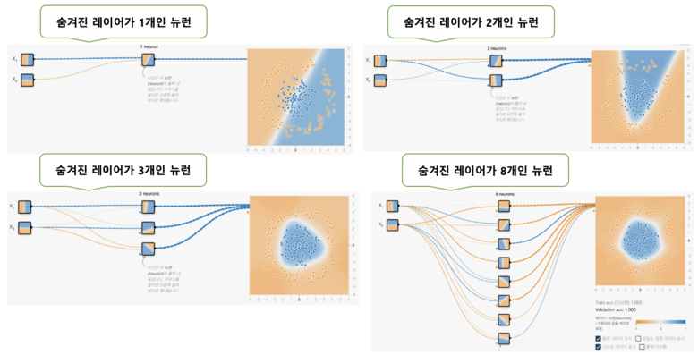

이 예에서는 뉴런 3개가 정확도와 계산 효율 면에서 가장 균형이 좋습니다. 현실에서는 뉴런 수를 늘리거나 줄이는 시행착오가 필요합니다.

**레이어 수를 늘리면?**

숨겨진 레이어를 2층 이상으로 늘린 신경망을 **딥 신경망(DNN: Deep Neural Network)** 이라고 합니다. 레이어가 많을수록 더 복잡한 문제를 해결할 수 있지만, 계산 시간도 늘어납니다.

**에포크(Epoch)**: 전체 훈련 데이터를 한 번 모두 학습하는 단위입니다. 아래 그림은 1,000 에포크 학습 후 나선(Spiral) 분류 문제를 레이어 수별로 비교한 결과입니다.

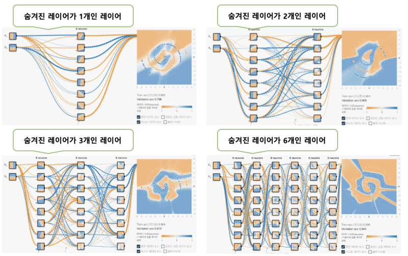

레이어가 많을수록 더 복잡한 나선 경계를 정확히 표현합니다.

Keras로 숨겨진 레이어 2개(뉴런 3개씩)를 가진 신경망을 정의하면:

```python
import tensorflow as tf

INPUT_FEATURES = 2
LAYER1_NEURONS = 3
LAYER2_NEURONS = 3
OUTPUT_RESULTS = 1

model = tf.keras.models.Sequential([
    # 숨겨진 레이어 1
    tf.keras.layers.Dense(
        input_shape=(INPUT_FEATURES,),
        units=LAYER1_NEURONS,
        activation='tanh'
    ),
    # 숨겨진 레이어 2
    tf.keras.layers.Dense(
        units=LAYER2_NEURONS,
        activation='tanh'
    ),
    # 출력 레이어
    tf.keras.layers.Dense(
        units=OUTPUT_RESULTS,
        activation='tanh'
    ),
])
```

`model.summary()`로 모델 구조를 확인할 수 있습니다.

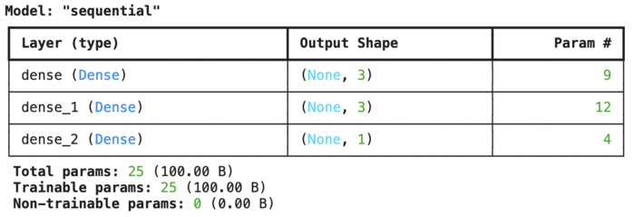

총 파라미터 수: (2×3+3) + (3×3+3) + (3×1+1) = 9 + 12 + 4 = **25개**

---

### 활성화 함수

대표적인 활성화 함수 4가지를 비교합니다.

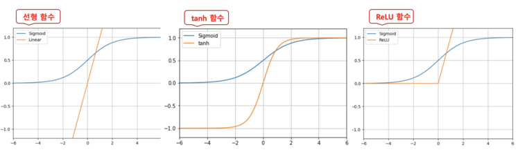

| 함수 | 출력 범위 | 특징 |
|------|-----------|------|
| 선형(Linear) | -∞ ~ +∞ | 변환 없이 그대로 출력 |
| Sigmoid | 0.0 ~ 1.0 | S자 곡선 |
| tanh | -1.0 ~ 1.0 | Sigmoid를 -1~1 범위로 확장 |
| ReLU | 0.0 ~ +∞ | 양수는 그대로, 음수는 0 |

일반적으로 학습 효율은 `선형 < Sigmoid < tanh < ReLU` 순으로 높아집니다. ReLU가 효율적인 이유는 양수 구간에서 기울기가 항상 1로 유지되어, 레이어가 깊어질수록 기울기가 소실되는 **기울기 소실(Vanishing Gradient) 문제** 를 완화하기 때문입니다.

단, ReLU는 최솟값이 0.0이므로 중간 레이어의 뉴런이 음수를 출력할 수 없습니다. Playground처럼 출력 범위가 -1.0 ~ 1.0인 경우 출력 레이어에는 tanh를 사용합니다.

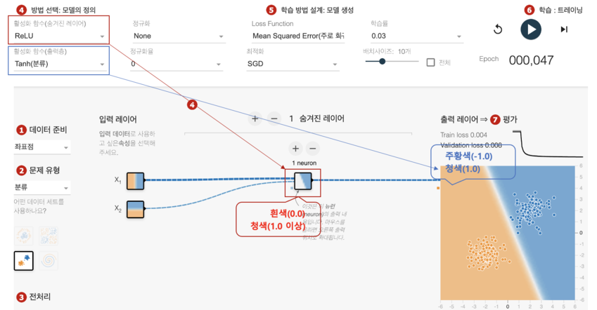

```python
import tensorflow as tf

INPUT_FEATURES = 2
LAYER1_NEURONS = 3
LAYER2_NEURONS = 3
OUTPUT_RESULTS = 1
ACTIVATION = 'sigmoid'  # 중간 레이어 활성화 함수

model = tf.keras.models.Sequential([
    tf.keras.layers.Dense(
        input_shape=(INPUT_FEATURES,),
        units=LAYER1_NEURONS,
        activation=ACTIVATION
    ),
    tf.keras.layers.Dense(units=LAYER2_NEURONS, activation=ACTIVATION),
    tf.keras.layers.Dense(units=OUTPUT_RESULTS, activation='tanh'),
])
```

---

### 정규화

정규화(Regularization)는 **과학습(Overfitting)** 을 방지하는 기법입니다. 과학습이란 훈련 데이터에 지나치게 특화되어 새로운 데이터에는 제대로 예측하지 못하는 현상입니다. 훈련 데이터가 적거나 노이즈가 많을 때 발생하기 쉽습니다.

주요 정규화 방법 2가지:

| 방법 | 동작 | 사용 시점 |
|------|------|-----------|
| **L1** | 불필요한 뉴런 억제/제거 → 모델 희소화 | 불필요한 특징을 제거하고 싶을 때 |
| **L2** | 가중치에 페널티 추가 → 과도한 학습 방지 | 일반적인 과학습 방지 (기본 권장) |

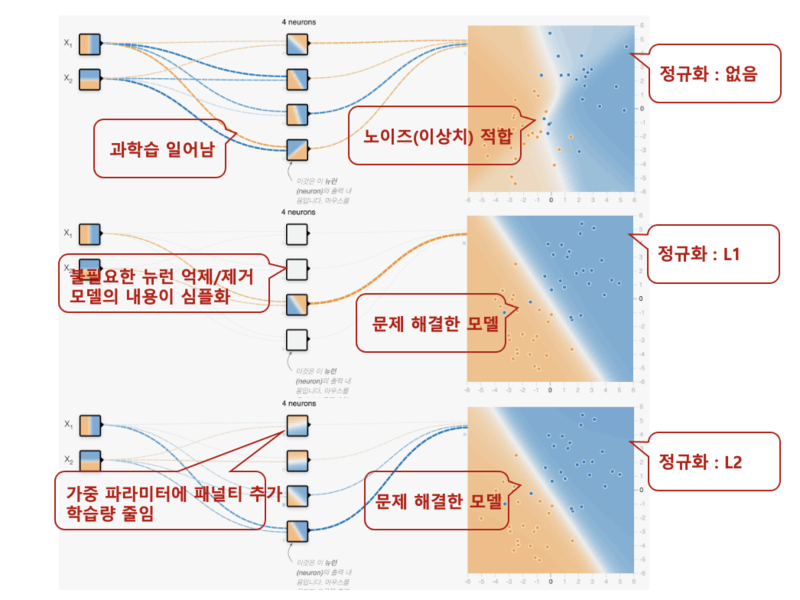

- **정규화 없음**: 과학습 발생, 임의의 데이터에 오답 가능성이 높습니다
- **L1**: 일부 뉴런이 억제(흰색)되어 모델이 단순해집니다
- **L2**: 가중치가 작아져 적절한 학습이 유지됩니다

정규화율(Regularization Rate)은 너무 작으면 효과가 없고, 너무 크면 학습이 전혀 이루어지지 않습니다. 일반적으로 0.01 ~ 0.03 부근에서 시작해 조정합니다.

---

## 마치며

이 글(Part 1)에서는 뉴럴 네트워크의 기본 구성 요소를 살펴봤습니다:

- **데이터 준비 → 전처리 → 분류 문제 정의**
- **뉴런의 구조**: 입력, 가중치, 바이어스, 활성화 함수
- **신경망 구조**: 레이어 수·뉴런 수와 문제 복잡도의 관계
- **활성화 함수**: 선형, Sigmoid, tanh, ReLU 비교
- **정규화**: L1/L2로 과학습 방지

**[다음 글(Part 2)](https://www.mimul.com/blog/about-neural-network-2/)** 에서는 모델을 실제로 학습시키는 `compile`(손실 함수, 최적화), `fit`(학습 실행), `evaluate`(정확도 평가)를 다룹니다.
