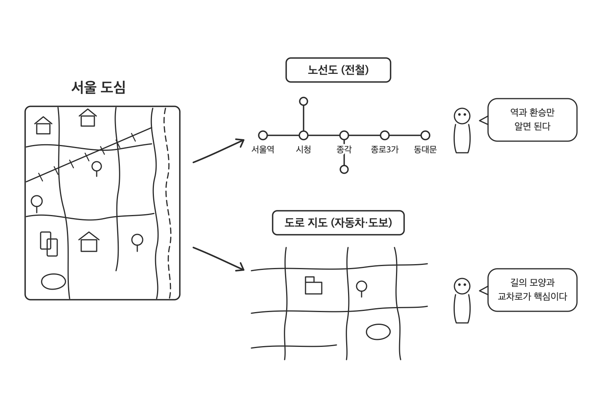
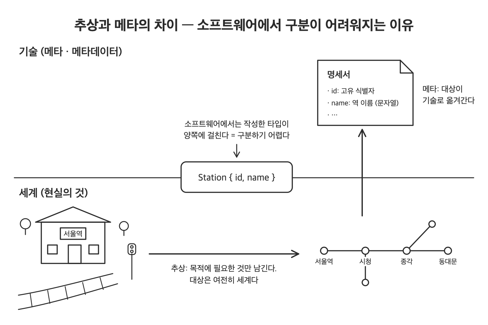
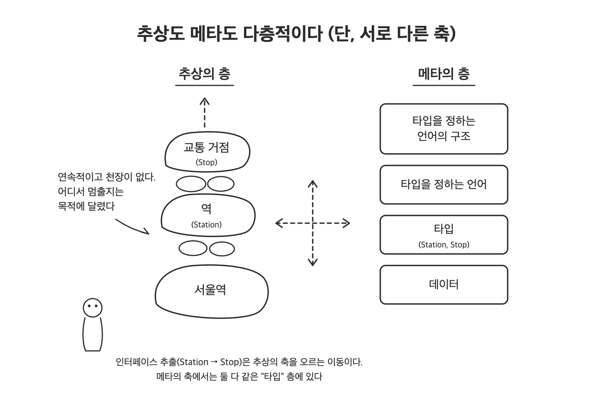

소프트웨어 설계에서 내리는 결정의 상당수는 "무엇을 남기고 무엇을 버릴 것인가"다. 어떤 필드를 타입에 남길지, 인터페이스를 뽑아낼지, 구조를 코드로 고정할지 설정으로 뺄지가 모두 그렇다. 이 선택이 감으로 내려지면 목적에 맞지 않는 구조와 형식뿐인 인터페이스가 코드에 쌓여 간다. 이 선택을 다루는 개념이 추상화이고, 추상화를 정확히 쓰려면 자주 뒤섞이는 또 하나의 개념인 메타와 구분해야 한다. 설계 논의에서 흔히 쓰는 "한 단계 위로 올리자"는 말이 실은 서로 다른 두 방향을 가리키기 때문이다.

이 글은 두 움직임이 어떻게 다른지, 소프트웨어에서는 왜 구분하기 어려워지는지를 노선도 예시를 중심으로 설명하고, 인터페이스가 두 축의 어디에서 일하는 도구인지 확인한다. 이 구분에서 진짜 추상과 겉모습뿐인 추상을 가려내는 기준이 나오고, 구조를 타입으로 굳힐지 데이터로 열어 둘지 판단하는 관점이 생긴다.

먼저 추상화가 무엇인지부터 보자. 소프트웨어는 현실 세계를 그대로 다룰 수 없다. 예를 들어 서울 도심의 지도를 그린다고 하자. 같은 지역이라도 목적이 다르면 그리는 방식은 완전히 달라진다.



노선도는 역과 환승만 알면 충분하다. 그래서 실제 선로의 곡선이나 역 사이 거리의 편차는 버리고, 등간격으로 늘어선 역과 직선만 남긴다. 도로 지도는 그 반대다. 길의 형태와 교차로가 핵심이 되고, 전철 노선은 필요 없다. 둘 다 목적에 필요한 것만 취하고 나머지는 버린다. 이것이 **추상화** 다. 추상화란 어려운 말로 바꾸는 것이 아니라, 현실의 대상을 목적에 맞게 다루기 쉬운 형태로 잘라내는 것이다.

## 추상화는 갑자기 타입이 되지 않는다

노선도를 소프트웨어로 만든다고 하자. 처음에 써야 할 것은 Station이라는 타입이 아니다. 먼저 생각해야 할 것은, 경로 안내라는 관점에서 철도에 대해 무엇이 필요한가이다.

```text
경로 안내 관점에서의 철도
- 어떤 역이 있는가
- 어떤 역과 어떤 역이 연결되어 있는가
- 연결 하나를 지나는 데 시간이 얼마나 걸리는가
```

거리나 선로의 형태는 여기에 나오지 않는다. 노선도가 그것들을 버린 것과 같다. 여기까지가 추상화다. 머릿속에서든 종이 위에서든 이것으로 충분하다. 어떤 역이 있고, 어떻게 연결되며, 얼마나 걸리는가. 필요한 것만 파악하면 그 이상의 세밀한 형태는 필요 없다.

## 소프트웨어에서는 구조를 써내야 한다

하지만 이것을 소프트웨어로 만들려면 이야기가 달라진다. 선택한 것을 구조로 써내야 한다. 어떤 항목이 있고, 각각 어떤 타입인지 명시해야 한다.

```java
record Station(StationId id, String name) {}
record Connection(StationId from, StationId to, Duration time) {}
```

머릿속에서는 "어떤 역이 있고 어떻게 연결되는가"로 충분했던 것이, 여기서는 id, name, time 같은 명확한 형태가 된다. 이렇게 구조를 적어 내는 일은 추상화 자체에는 필요 없다. 소프트웨어로 만들기 때문에 필요해진 것이다.

나아가 모호함도 남길 수 없다. 사람끼리의 대화라면 "환승해서 가면 된다"로 통하지만, 프로그램은 그렇지 않다. 환승역은 하나의 역으로 표현할 것인가, 노선마다 별도의 노드로 나눌 것인가. 환승에 걸리는 시간은 어디에 둘 것인가. 운행이 중지된 구간은 연결되지 않은 것으로 볼 것인가, 표시만 붙일 것인가. 이런 것들을 결정하지 않으면 경로 탐색은 동작하지 않는다.

여기서 관점을 바꿔보자. 지금까지 생각해 온 대상은 역이었다. 그러나 코드를 쓴 순간, 우리가 다루고 있는 것은 역 그 자체가 아니라 "역을 어떻게 표현할까"라는 구조가 되었다.

## 메타란 무엇인가

여기까지 역 데이터의 구조를 만들어 왔다. 어떤 항목이 있고, 어떤 타입이며, 무엇을 허용하는가. 추상화로 필요한 것을 선택하고, 코드로 그것을 모호함 없이 써낸 것이다.

그러나 써낸 이 구조는 역 그 자체가 아니다. 역의 데이터가 어떤 구조인지 적어 놓은 기술이다. 데이터에 대한 데이터, 즉 **메타데이터** 다. 구조를 쓴 시점에서 다루는 대상은 더 이상 역이 아니라, 역 데이터에 대한 기술로 바뀐다. 이것이 메타다.



추상화와는 방향이 다르다. 추상화는 아무리 단순하게 만들어도 다루는 대상은 여전히 현실의 철도다. 노선도가 그리는 것도 현실의 철도다. 반면 메타에서는 다루는 대상 자체가 현실의 철도에서 그것을 써낸 구조로 이동한다. 흔히 "하나 위로 올라간다"고 표현하기 때문에 추상의 층을 올라가는 것, 즉 더 추상적으로 되는 것과 혼동되지만, 이 둘은 별개의 움직임이다.

## 추상의 층과 메타의 층

앞 절에서 추상화와 메타는 방향이 다른 움직임이라고 했다. 게다가 둘 다 하나의 층으로 끝나지 않고 각각 층을 쌓아 올린다.

추상화의 층은 서울역을 "역"으로 묶고, 역을 다시 "교통 거점"으로 묶는 식으로 겹쳐진다. 위층일수록 대략적이다. 같은 것이 아래층에서 보면 추상이고, 위층에서 보면 구체가 된다. 추상화의 층은 경계가 느슨해서 사이에 얼마든지 중간층을 만들 수 있다. 어디까지 세밀하게 할지, 어디서 멈출지는 목적이 결정한다.

메타의 층은 다르게 쌓인다. 역의 데이터가 있고, 그 구조를 기술한 타입이 있고, 더 나아가 "타입이란 무엇인가"를 정하는 언어가 있다. 기술에 대한 기술을 거듭 쌓아 올라가는 것이다. 메타의 층은 추상처럼 연속적으로 변하지 않고, 다루는 대상 자체가 바뀌는 이산적인 층으로 나타난다. 데이터와 타입, 타입을 정하는 언어는 질적으로 서로 다른 별개의 것이기 때문이다. 추상화처럼 목적에 따라 중간층을 자유롭게 끼워 넣을 수는 없다.



중요한 것은 이 두 층이 별도의 축으로 쌓인다는 점이다. 타입을 "역"에서 "거점"으로 일반화해도 그것은 여전히 데이터를 기술한 것이고, 메타의 층은 움직이지 않는다. 반대로 타입을 고정한 채 "타입이란 무엇인가"로 화제를 옮기면, 추상도는 그대로 둔 채 메타의 층만 올라간다. 한쪽을 움직여도 다른 쪽은 움직이지 않는다. "하나 위"라는 말이 계속 혼란스러웠던 것은 이 두 가지 "위"를 섞어 썼기 때문이다.

두 층은 성질도 다르다. 추상의 층에는 천장이 없어서 위로는 얼마든지 대략적으로, 아래로는 얼마든지 세밀하게 내려갈 수 있다. 메타의 층은 겹쳐 쌓아도 실용적인 의미가 희미해지는 경우가 많다. "타입이란 무엇인가"를 정하는 언어는 그 언어 자신도 같은 방식으로 기술할 수 있어서, 그 위에 또 층을 쌓을 필요가 없기 때문이다.

이 메타의 층 구분은 실무에서 "누가 언제 구조를 결정하는가"라는 문제로 나타난다. 역의 구조를 타입으로 고정할 것인가, 실행 중에 읽고 쓸 수 있는 데이터로 가질 것인가. 이것은 그 기술을 메타의 어느 층에 둘 것인가 하는 선택이며, 이 선택이 결정하는 사람과 결정되는 시점을 나눈다. 타입으로 고정하면 결정하는 사람은 개발자이고, 결정되는 시점은 코드를 쓸 때다. 데이터로 가지면 결정하는 사람은 이용자이고, 결정되는 시점은 프로그램이 돌아가는 중이다. 후자가 더 자유로워 보이지만, 그만큼 타입이 보장해 주던 약속은 희박해진다.

## 코드 안의 추상과 메타

지도로 구분한 두 축은 일상적으로 다루는 코드 안에도 그대로 있다. 먼저 추상의 축이다.

```java
ArrayList<Station> stations1 = new ArrayList<>(); // 배열 기반 구현까지 드러낸다
List<Station> stations2 = stations1;              // "순서 있는 모음"만 남긴다
Collection<Station> stations3 = stations2;        // "모음"이라는 성질만 남긴다
```

ArrayList를 List로, 다시 Collection으로 받는 것은 추상의 층을 오르는 일이다. 배열 기반이라는 구현 세부가 버려지고, 목적에 필요한 성질만 남는다. 하지만 어느 층에서도 이 코드가 다루는 대상은 역 데이터 그대로다. 노선도를 아무리 단순화해도 그리는 것이 현실의 철도인 것과 같다.

메타의 축은 방향이 다르다. 앞 절에서 말한 "타입을 고정한 채 화제를 타입 자체로 옮기는" 움직임을 코드로 쓰면 리플렉션이 된다.

```java
// 역을 다룬다
String name = station.name();

// Station이라는 타입 자체를 다룬다
RecordComponent[] parts = Station.class.getRecordComponents();
```

두 번째 줄은 첫 번째 줄을 더 추상화한 것이 아니다. 다루는 대상이 역에서 Station이라는 타입으로 바뀌었다. station.name()은 서울역이라는 현실의 대상에 대해 말하지만, getRecordComponents()는 "Station에는 어떤 필드가 있는가"라는 기술에 대해 말한다.

리플렉션이 특수한 기법으로 느껴진다면, 매일 쓰는 도구 상당수가 이 층에서 일한다는 사실을 떠올리면 된다. JSON 직렬화 라이브러리는 개발자가 정의한 도메인 타입을 하나도 모른 채 어떤 객체든 JSON으로 바꾼다. 역이든 주문이든 회원이든 상관없다. 이 라이브러리가 다루는 대상이 도메인 데이터가 아니라 타입과 필드라는 기술 자체이기 때문이다. ORM이 엔티티 클래스에서 테이블 스키마를 만들어 내는 것도, 컴파일러가 소스 코드를 데이터로 읽는 것도 같은 층의 일이다. 도메인을 모르는 코드가 모든 도메인에 통용되는 이유는 그 코드가 메타의 층에서 일하기 때문이다.

데이터베이스에도 같은 구분이 있다. SELECT name FROM station은 역 데이터를 다루고, information_schema.columns를 조회하면 station 테이블의 구조 자체를 다룬다. 같은 SQL을 쓰지만 대상이 속한 층이 다르다.

이 구분이 서면 "한 단계 추상화하자"와 "메타로 풀자"가 전혀 다른 제안이라는 것도 보인다. 전자는 List를 Collection으로 바꾸듯 남길 성질을 다시 고르는 일이고, 후자는 리플렉션이나 설정 기반 구조처럼 다루는 대상을 기술로 옮기는 일이다. 앞 절에서 본 대로, 후자는 구조의 결정을 실행 시점으로 미루는 선택과 이어진다.

## 구조를 쓰는 것은 선택하는 것이다

데이터를 다루는 소프트웨어를 만든다면, 그 데이터의 구조를 써내는 일은 피할 수 없다. 그리고 타입을 쓰는 순간, 원하든 원하지 않든 무언가를 선택하고 무언가를 버리게 된다. 역에 id와 name만 두는 구조로 정한 시점에서, 역장이나 플랫폼 수 같은 정보는 버려졌다. 선택은 의식하지 않아도 반드시 일어난다.

문제는 그 선택이 목적에 맞는가이다. 목적을 생각하지 않고 화면의 항목을 그대로 옮겨 적어도 구조는 완성되고 소프트웨어는 동작한다. 회원 가입 화면의 입력란을 위에서부터 순서대로 User 타입의 필드로 만드는 식이다. 하지만 그것이 목적에 맞는 형태라고는 할 수 없다. 추상화란 이 피할 수 없는 선택을 목적에 맞게 의도적으로 행하는 것이다. "추상화가 부족하다"는 말은 선택이 없다는 뜻이 아니다. 선택이 목적이 아니라 구현이나 화면의 사정에 따라 결정되어 있다는 뜻이다.

반대로 선택이 목적을 따라가면 어떤 모습이 되는가. 지도에서는 노선도와 도로 지도가 처음부터 다른 그림으로 보였지만, 업무 시스템에서는 "주문"이라는 하나의 이름이 목적이 다른 구조들을 가리고 있어 선택이 일어나는지조차 알아차리기 어렵다. 같은 주문이라도 배송 관점은 어디로 무엇을 보내는지가 핵심이라 주소와 물품의 부피를 남기고, 정산 관점은 돈의 흐름이 핵심이라 금액과 수수료를 남기며, 재고 관점은 무엇이 몇 개 나갔는지만 있으면 된다.

```java
record Delivery(OrderId id, Address to, ParcelSize size) {}  // 배송 관점
record Settlement(OrderId id, Money amount, Money fee) {}    // 정산 관점
record StockOut(OrderId id, Sku sku, int quantity) {}        // 재고 관점
```

세 구조는 같은 주문에서 나왔지만 공유하는 것은 주문 번호뿐이고, 남긴 필드는 겹치지 않는다. 어느 하나가 정답인 것이 아니라 각각이 자기 목적에 맞는 추상이다. 반대로 세 관점의 필드를 전부 몰아넣은 하나의 Order 타입은 모든 것을 담고 있지만 어느 목적에도 꼭 맞지 않는다. 배송 코드에 수수료 필드가 따라다니고, 정산 코드에 부피 필드가 따라다닌다. 노선도에 도로의 곡선까지 그려 넣은 지도와 같다. 도메인 주도 설계가 컨텍스트마다 모델을 따로 두라고 권하는 이유가 여기에 있다.

## 인터페이스는 두 축의 어디에 있는가

소프트웨어에서 추상을 표현하는 대표 도구는 인터페이스다. 그렇다면 인터페이스를 만들 때 두 축 위에서는 무슨 일이 일어나는가. 경로 안내 예제로 확인해 보자. 지하철만 다루던 경로 안내를 버스까지 아우르도록 넓힌다고 하자. 경로 탐색에 필요한 것은 갈아탈 수 있는 지점과 갈아타는 데 걸리는 시간이지, 그 지점이 지하철역인지 버스 정류장인지가 아니다 (요점만 남기기 위해 id 같은 필드는 생략한다).

```java
interface Stop {
    String name();
    Duration transferTime(); // 갈아타는 데 걸리는 시간
}

record Station(String name, Duration platformWalk) implements Stop {
    public Duration transferTime() { return platformWalk; } // 승강장 이동
}

record BusStop(String name, Duration roadCrossing) implements Stop {
    public Duration transferTime() { return roadCrossing; } // 횡단보도 건너기
}
```

추상의 축에서 보면 Stop은 지하철역과 버스 정류장의 위층이다. "갈아탈 수 있는 지점"이라는 실재하는 공통점을, 지하철과 버스를 아우르는 경로 탐색이라는 목적에 따라 선택했다. 환승이 승강장 이동인지 횡단보도 건너기인지 하는 세부는 위층에서 버려진다. 추상의 층 그림에서 서울역을 "역"으로, 역을 "교통 거점"으로 묶어 올라갔는데, Stop은 바로 그 위층을 코드로 쓴 것이다. ArrayList를 List로 받는 것과 같은 방향의 이동이다.

메타의 축에서 보면 사정이 다르다. Station도 Stop도 똑같이 타입, 즉 데이터에 대한 기술이다. 추상의 축에서는 아래층과 위층으로 나뉘지만, 메타의 축에서는 둘 다 같은 타입 층에 나란히 있다. 앞에서 타입을 "역"에서 "거점"으로 일반화해도 메타의 층은 움직이지 않는다고 했는데, 그것을 코드로 쓰면 바로 이 모습이다. 인터페이스 추출은 추상의 축을 오르는 이동이지, 메타의 축을 오르는 이동이 아니다. 그리고 인터페이스가 "현실의 역 그 자체가 아니라 그에 대한 기술"이라는 위화감이 든다면, 그것은 인터페이스가 비어 있어서가 아니라 타입인 이상 반드시 메타이기 때문이다. Stop은 진짜 추상화이면서 동시에 기술이다.

다만 인터페이스로 하는 일 중에는 어느 축의 이동도 아닌 것이 있다. 구현을 교체하기 위해 두는 인터페이스다. UserRepository를 RDB에서 다른 저장소로 바꿀 수 있게 하는 경우가 그렇다. 이것은 추상화(공통점의 선택)가 아니라, 구현을 명세에서 분리하는 별개의 작업을 인터페이스라는 같은 도구로 하고 있을 뿐이다. "추상이 아니다"라고 하면 충분하다. 비어 있다고 단정하면 정당한 것까지 잘못 보게 된다.

## 형식뿐인 추상화

이처럼 인터페이스라는 같은 도구로 진짜 추상도, 명세와 구현의 분리도 쓸 수 있다. 문제는 같은 도구로 아무것도 아닌 것도 쓸 수 있다는 점이다. 도구의 겉모습만으로는 판단할 수 없다.

Stop은 현실의 역과 정류장을 묶었지만, 추상의 대상이 물리적인 사물이어야 하는 것은 아니다. "순서를 매길 수 있다"는 행동의 공통점을 골라냈다면 그것도 훌륭한 추상화다. 진짜 추상을 가르는 질문은 "물리적인 것인가"가 아니라 "실재하는 공통점을 목적을 가지고 선택했는가"이다. 그리고 그 목적은 인터페이스를 제공하는 쪽이 아니라 사용하는 쪽에 있다. Stop에서 환승 시간을 남긴 것도 역 클래스의 사정이 아니라 경로 탐색 코드의 필요였다.

형식뿐인 추상은 인터페이스라는 겉모습만 있고, 선택할 대상의 폭도 목적도 없다. 구체 클래스의 멤버를 그대로 옮겨 적은 인터페이스를 만든다. 공통 코드를 모아 둔 추상 클래스에 그럴듯한 이름을 붙인다. 형태는 갖추었지만 내용이 비어 있다.

이 중 구체 클래스의 멤버를 그대로 옮겨 적는 방식에는 이미 이름이 붙어 있다. 마틴 파울러는 이것을 **헤더 인터페이스** 라 부르고, 협력하는 코드가 실제로 사용하는 것만 골라 정의한 인터페이스를 **롤 인터페이스** 라 불러 구분한다. 파울러가 든 일정 계산 예에서 작업 클래스는 일정 관련 메서드를 네 개 갖지만, 후속 작업 역할로 쓰일 때와 선행 작업 역할로 쓰일 때 실제로 불리는 메서드는 각각 하나뿐이다. 그래서 네 멤버를 그대로 옮긴 인터페이스 하나가 아니라 역할마다 메서드 하나짜리 인터페이스 둘을 만든다. 같은 주문이 배송·정산·재고의 세 구조로 나뉜 것과 같은 일이 인터페이스 차원에서 일어난 것이다.

그렇다면 왜 소프트웨어에서는 빈 추상이 쌓이는가. 현실 세계에서 추상화를 하려면 먼저 목적을 정하고, 무엇을 남기고 무엇을 버릴지 생각해야 한다. 추상은 그 의사결정의 결과로 생겨난다. 한편 소프트웨어에서는 그 의사결정을 거치지 않아도 추상의 그릇만은 쉽게 만들 수 있다. IDE에서는 버튼 하나로 인터페이스를 추출할 수 있다. 추상화라는 사고를 거치지 않고도, 추상화된 듯한 형태만 저비용으로 만들 수 있는 것이다. 그래서 빈 추상은 소프트웨어에 쌓이기 쉽다. 그리고 쌓인 빈 추상은 무해하지 않다. 켄트 벡은 인터페이스의 층 하나하나가 배우고, 이해하고, 문서화하고, 디버깅하고, 이름 짓는 비용을 늘리므로, 인터페이스가 주는 유연성이 필요한 곳에서만 그 비용을 치르라고 말한다. 만드는 비용은 버튼 하나로 줄었지만 유지하는 비용은 그대로다. 빈 추상이 문제인 것은 아무 일도 하지 않아서가 아니라, 아무 일도 하지 않으면서 이 비용을 계속 청구하기 때문이다.

## 요약

추상화란 현실의 대상에서 목적에 필요한 것만 골라내는 것이다. 메타화란 그 결과를 데이터에 대한 기술로 써내는 것이다. 원래 이 둘은 별개의 작업이다. 하지만 소프트웨어에서는 추상화한 결과를 타입이나 스키마로 써내는 순간, 그것이 데이터에 대한 기술이 된다. 추상화라는 설계 판단과 메타화라는 기술 작업이 거의 동시에 일어나는 것이다. 소프트웨어에서 추상화와 메타화를 구분하기 어려운 이유가 여기에 있다. 다만 구분이 어려워도 두 움직임은 각각 층을 이루며 서로 다른 축으로 쌓인다. 인터페이스 추출은 추상의 축을 오르고, 리플렉션이나 설정 기반 구조는 메타의 축을 오른다. 이 두 축을 구분하는 눈이 "한 단계 추상화하자"와 "메타로 풀자"를 서로 다른 제안으로 읽게 해 준다.

## 참조 사이트

- [Boost your communication skills with the "ladder of abstraction"](https://bigthink.com/the-learning-curve/ladder-of-abstraction/)
- [Meta-Object Facility](https://en.wikipedia.org/wiki/Meta-Object_Facility)
- [Model-Driven Development: A Metamodeling Foundation](https://dl.acm.org/doi/10.1109/MS.2003.1231149)
- [Data Abstraction and Hierarchy](https://www.cs.tufts.edu/~nr/cs257/archive/barbara-liskov/data-abstraction-and-hierarchy.pdf)
- [Interfaces are not abstractions](https://blog.ploeh.dk/2010/12/02/Interfacesarenotabstractions/)
- [Role Interface](https://martinfowler.com/bliki/RoleInterface.html)
- [Required Interface](https://martinfowler.com/bliki/RequiredInterface.html)
