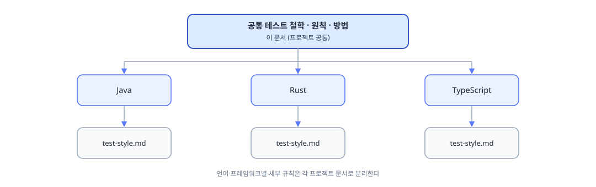

AI 코딩 도구가 일상이 된 지금, 테스트 코드도 AI가 생성하는 경우가 많아졌다. 문제는 AI가 작성한 테스트가 겉으로는 그럴듯해 보이지만, 구현 세부사항에 강하게 결합되거나 상호작용 검증에만 집중하는 패턴이 반복된다는 점이다. 리팩토링 한 번에 테스트 수십 개가 한꺼번에 깨지는 경험은 그 결과다.

이 글은 특정 언어나 프레임워크의 API 사용법이 아닌, TDD 관점에서 언어를 가로질러 적용 가능한 테스트 철학, 전략, 원칙들을 다룬다. 맨 처음에 이 원칙들을 떠받치는 여섯 가지 철학을 기술하고, 1번부터 16번까지는 테스트를 어떻게 잘 짜는가를 다루고, 17번부터 20번까지는 AI 에이전트가 만든 테스트가 실제로 무엇을 보장하는가를 다룬다. 그리고 이 테스트 철학, 전략, 원칙들은 사용자 레벨(모든 프로젝트 공통)에서 정의하고 이를 기반으로 프로젝트별로 언어나 환경 등의 디테일을 더해주면 AI마다 일관된 테스트 코드가 나온다. 그 기준을 정리하기 위해 이 글을 쓴다.

대상 독자는 TDD 기초는 알고 있지만 실제 코드베이스에 적용할 때 흔들리는 개발자, 또는 AI 도구를 사용하면서 테스트 품질이 낮아졌다고 느끼는 팀이다.

## 테스트 철학

**구현이 아닌 동작을 테스트한다. 순수 리팩토링은 테스트를 깨뜨려서는 안 된다.**

리팩토링이 외부 동작을 바꾸지 않았다면 테스트도 깨지지 않아야 한다. 이 기준이 나머지 열아홉 원칙 전체의 출발점이다. 1번 원칙에서 이어진다.

**특별한 사유가 없다면 Classicist(Chicago, 결과 상태를 검증하는 학파) TDD를 기본으로 선택한다. Mockist(London, 협력 객체 간 상호작용을 검증하는 학파) 방식은 AI 기반 코드베이스에서 신뢰도가 빠르게 낮아진다.**

Mockist는 협력 객체 간 상호작용을 검증하기 때문에 구현에 결합되고, AI가 코드를 재생성할 때마다 그 구현을 따라 깨진다. 왜 그런지는 1번 원칙에서 다룬다.

**테스트는 빠르고(Fast), 격리되어 있으며(Isolated), 결정적(Deterministic)이어야 한다.**

셋 중 하나라도 무너지면 테스트 스위트 전체에 대한 신뢰가 흔들린다. 4번 원칙에서 이어진다.

**시스템 경계에서만 모킹한다. 경계 안쪽은 전부 실제다.**

내가 소유하고 제어할 수 있는 코드는 실제 구현을 쓰고, 결제 API나 시스템 시계처럼 제어할 수 없는 경계 밖만 대체한다. 8번 원칙(Test Boundary)에서 구체적인 판단 기준으로 이어진다.

**통합 테스트의 검증력을 단위 테스트만큼 중시한다.**

단위 테스트는 빠르지만 실제 시스템과 멀어질수록 검증력이 떨어진다. 레벨을 위험에 따라 선택하는 구체적인 기준은 11번 원칙에서 다룬다.

**의미 있는 소수의 테스트가 신뢰도 낮은 다수의 테스트보다 가치 있다.**

커버리지 숫자를 채우는 테스트가 아니라 실제 버그를 잡는 테스트가 가치 있다. 15번 원칙에서 다룬다.

## 1. 테스트는 구현이 아니라 행동을 보호한다

> 구현이 아닌 동작을 테스트한다. 순수 리팩토링은 테스트를 깨뜨려서는 안 된다.

테스트의 역할은 코드가 어떻게 동작하는지가 아니라 무엇을 하는지를 보장하는 데 있다. 메서드 이름을 바꾸고, 반복문을 재귀로 교체하고, 중간 변수를 제거하는 리팩토링은 외부 동작을 바꾸지 않는다. 이런 변경에 테스트가 깨진다면, 그 테스트는 동작이 아닌 구현을 잠갔다. 리팩토링 후 테스트를 고치느라 시간을 쓰는 패턴이 반복된다면, 테스트가 방어망이 아닌 짐이 됐다는 신호다.

다만 모든 테스트가 리팩토링에 영향을 받지 않아야 한다는 뜻은 아니다. 외부 계약이나 중요한 상호작용 자체가 바뀌었다면 테스트가 깨지는 것이 정상이다. 예를 들어 API 응답 필드 이름이 바뀌거나, 결제 완료 후 발행하던 이벤트를 더 이상 발행하지 않기로 했다면 테스트는 그 변경을 붙잡아야 한다. 그래서 테스트가 실패했을 때 가장 먼저 던져야 할 질문은 "이 실패가 구현 변경 때문인가, 계약 변경 때문인가"이다. 전자라면 테스트가 잘못 짜인 것이고, 후자라면 테스트가 제 역할을 한 것이다.

Mockist(London School)는 협력 객체와의 상호작용 자체를 검증하므로, 호출 순서나 인자 목록까지 과하게 못 박는 순간(over-specification) 구현이 조금만 바뀌어도 테스트가 깨진다. Classicist는 최종 상태와 반환값만 검증하므로 내부 구현이 바뀌어도 사양만 만족하면 통과한다. 리팩토링에 깨지지 않는 정도가 이 원칙의 기준이므로, Classicist를 기본값으로 선택한다. 두 학파의 차이 자체가 이 글의 핵심 논점은 아니며, Mockist도 외부 시스템과의 상호작용만 신중히 골라 검증하면 안정적일 수 있다.

## 2. Test Oracle을 먼저 정의한다

Test Oracle(테스트 판정 기준)은 특정 입력에 대해 무엇이 옳은 결과인지 판정하는 근거다. 테스트 코드를 작성하는 능력과 Test Oracle을 설계하는 능력은 서로 다른 능력이다. 전자는 "이 함수를 어떻게 호출하고 무엇을 assert할까"를 정하는 일이고, 후자는 "이 상황에서 무엇이 정답인가"를 정하는 일이다.

Oracle이 약하면 테스트는 실행되지만 아무것도 증명하지 못한다.

```text
result != null
```

이런 Assertion(테스트가 기대값과 실제값을 비교해 성공·실패를 판정하는 코드)은 실행은 되지만 Oracle이 약하다. "null만 아니면 통과"라는 조건은 도메인의 요구사항과 무관하기 때문이다. 반면 다음은 도메인의 요구사항을 직접 표현한다.

```text
VIP 회원의 할인율은 20%이다.
이미 만료된 비밀번호로 로그인하면 인증에 실패한다.
```

테스트의 품질은 Assertion의 개수보다 정답을 얼마나 정확하게 정의하고 있는가에 더 크게 좌우된다. 그래서 테스트를 실제로 작성하는 순서도 정해져 있다. 사양(Requirement)을 확인하고, 그중 무엇이 외부에서 관찰 가능한지(Observable Behavior, 3번 원칙) 먼저 좁힌 뒤, 그 관찰 대상에서 무엇이 정답인지(Test Oracle)를 정하고, 그다음에야 테스트 케이스와 Assertion을 쓴다. Oracle이 불분명한 상태에서 테스트 코드부터 작성하지 않는다.

AI 에이전트는 테스트 케이스를 쓰는 일에는 강하지만 Oracle을 설계하는 일에는 약하다. 12번 원칙에서 다룰 것처럼 AI 도구는 구체적인 예시 테스트는 잘 만들지만 불변 조건을 스스로 정의하는 데는 취약한데, Test Oracle 설계도 같은 문제를 안고 있다. 에이전트에게 "이 코드가 정확하다는 것을 증명하는 테스트를 작성하라"고 지시하면, 에이전트는 자신이 방금 작성한 구현이 통과하는 테스트를 만든다. 구현과 테스트가 같은 가정을 공유하므로, 그 가정이 틀렸다면 테스트는 아무것도 걸러내지 못한다.

이 문제를 완화하는 실질적인 방법은 지시 방향을 뒤집는 데 있다. "정확성을 증명하라" 대신 "이 코드가 틀렸다는 것을 입증하는 테스트를 작성하라"고 요청한다. Falsification(반증) 기반 접근이다. 반증을 시도하도록 지시받은 에이전트는 경계값, 예외 경로, 동시성 문제, 잘못된 입력처럼 구현을 깨뜨릴 수 있는 지점을 적극적으로 찾는다. 정확함을 증명하라는 지시는 구현을 옹호하는 테스트로 이어지기 쉽지만, 틀림을 입증하라는 지시는 구현을 공격하는 테스트로 이어진다. 이 반증을 실제 테스트 케이스로 좁혀나가는 구체적인 방법은 6번 원칙에서 다룬다.

Coverage 수치도 Test Oracle 문제를 대신 풀어주지 않는다. 라인 커버리지 90%는 코드가 실행됐다는 사실만 보장하며, 실행 결과가 옳은지 검증했다는 사실은 보장하지 않는다. Assertion이 없거나 의미 없는 Assertion으로 채워진 테스트(19번 원칙 참고)는 커버리지 수치를 높이면서도 Test Oracle은 텅 빈 채로 남긴다. Coverage 자체를 어떻게 해석해야 하는지는 15번 원칙에서 별도로 다룬다.

## 3. Observable Behavior를 검증한다

Observable Behavior(외부에서 관찰 가능한 동작)는 시스템 내부가 아니라 바깥에서 확인할 수 있는 결과를 말한다. 테스트에서 가장 중요한 것은 무엇을 검증하느냐이다. 이 원칙의 본질은 명확하다. 구현 세부사항이 아닌 이 Observable Behavior를 검증하라는 데 있다.

### 좋은 Assertion의 유일한 기준, 관찰 가능성

검증할 수 있는 것은 오직 외부에서 관찰 가능한 결과뿐이다.

- 함수의 반환값
- DB에 저장된 실제 상태
- API 응답
- 이벤트 발생 여부

반대로, 내부 메서드 호출 순서나 협력 객체에 전달된 인자 같은 것은 외부에서 관찰할 수 없는 구현 세부사항이므로 검증 대상이 되어서는 안 된다.

### 절대 하면 안 되는 패턴

- 내부 메서드 호출 여부를 검증하는 것
- repository.save()가 호출되었는지 확인하는 것 → 대신 실제 DB에서 데이터를 조회해 저장 여부를 검증해야 한다.
- "이 함수가 불렸는가" 중심으로 작성된 테스트 → 이는 구현 세부사항을 잠그는 행위다.

반환값과 관찰 가능한 상태를 먼저 검증하고, 부작용(DB 쓰기, 이벤트 발행 등)은 반드시 명시적으로 검증한다. 상호작용 검증을 언제 예외적으로 허용하는지는 9번 원칙에서 다룬다. 이렇게 정한 관찰 대상을 실제 테스트 구조와 이름으로 어떻게 드러내는지는 5번 원칙에서 이어진다.

## 4. 테스트는 빠르고 격리되고 결정적이어야 한다

느린 테스트는 실행을 기피하게 만들고, 격리되지 않은 테스트는 실행 순서에 따라 결과가 달라지며, 비결정적 테스트는 CI를 무작위로 깨뜨린다. 셋 중 하나라도 무너지면 테스트 스위트 전체에 대한 신뢰가 흔들린다. 세 조건을 모두 갖춰야 테스트가 실질적인 안전망이 된다.

세 조건은 한 테스트에서 동시에 무너지는 경우가 많다. 결제 유스케이스 테스트가 실제 외부 결제 API를 그대로 호출한다고 하면, 응답을 기다리느라 몇 초씩 걸리고(Fast 위반), 그날 그 API가 반환하는 수수료율이나 잔여 한도에 따라 결과가 달라지고(Deterministic 위반), 앞서 실행된 테스트가 같은 계정의 잔액을 이미 소진해 뒀다면 실행 순서에 따라 통과 여부가 바뀐다(Isolated 위반). 외부 API를 HTTP 레벨 Fake로 대체하는 순간(8번 원칙) 세 가지 위반이 한 번에 사라진다.

이 세 조건은 이 글의 다른 원칙들과 각각 맞닿아 있다.

- 빠름(Fast): 11번 원칙(테스트 레벨)에서 다루는 레이어별 성능 기준과 직결된다. 통합 테스트 하나가 수 초씩 걸리면 개발자는 테스트를 실행 자체를 미루게 된다.
- 격리(Isolated): 13번 원칙(Flaky Test)에서 다루는 공유 전역 상태, 실행 순서 의존 문제가 바로 이 조건을 깨뜨리는 원인이다.
- 결정성(Deterministic): 이를 실제로 지키는 구체적인 기법은 7번 원칙에서 다룬다.

세 조건을 별도의 목표로 각각 쫓기보다, 테스트를 작성할 때마다 "이 테스트는 몇 밀리초 안에 끝나는가", "다른 테스트와 순서를 바꿔 실행해도 결과가 같은가", "열 번 반복 실행해도 항상 같은 결과가 나오는가"를 스스로 묻는 습관이 셋을 동시에 지키는 가장 실용적인 방법이다.

## 5. 테스트 구조와 이름으로 의도를 드러낸다

좋은 구조와 좋은 이름은 테스트를 처음 읽는 사람이 무엇을 검증하는지 곧바로 알게 해준다. Arrange/Act/Assert로 흐름을 나누고, Fixture(테스트에 필요한 데이터와 상태를 미리 준비해두는 코드)로 의도를 드러내고, 이름으로 행동을 서술하는 세 가지는 모두 3번 원칙에서 정한 관찰 대상을 코드 위에 명확히 새기는 작업이다.

### 테스트 구조는 AAA 패턴을 철저히 지켜라

모든 테스트는 다음 세 단계를 명확하게 구분해야 한다.

- Arrange: 테스트에 필요한 상태와 의존성을 준비한다.
- Act: 검증 대상 동작을 정확히 한 번만 실행한다.
- Assert: 관찰 가능한 결과를 검증한다.

이 세 단계가 모호하거나 뒤섞여 있다면, 그 테스트는 한 번에 여러 가지를 검증하려 하거나 구조가 잘못됐다. 좋은 테스트는 구조부터 명확해야 한다.

### Fixture는 의도를 드러내야 한다

Arrange 단계가 길어지는 가장 흔한 원인은 Fixture를 매번 처음부터 인라인으로 작성하는 데 있다. 테스트마다 필드 열 개짜리 객체를 새로 채우면, 그 테스트가 실제로 검증하려는 필드가 무엇인지 파악하기 어려워진다.

```typescript
// ❌ 나쁜 예 - 검증과 무관한 필드까지 전부 드러남
const user = {
  id: 'u1', name: '김철수', email: 'kim@test.com',
  age: 30, address: '서울시', phone: '010-0000-0000',
  createdAt: new Date(), status: 'ACTIVE', role: 'USER'
}

// ✅ 좋은 예 - 검증에 필요한 필드만 드러나는 Builder
const user = aUser().withStatus('ACTIVE').build()
```

Builder(필드를 단계적으로 채워 객체를 완성하는 헬퍼 함수)나 Factory 함수로 Fixture를 만들면, 각 테스트는 자신이 실제로 다루는 필드만 오버라이드하고 나머지는 합리적인 기본값에 맡긴다. 테스트를 읽을 때 "이 테스트는 status에 대한 것이구나"를 한눈에 알 수 있다.

Fixture 생성을 에이전트에게 위임할 때는 도메인마다 Builder를 하나로 통일해 재사용하도록 지시해야 한다. 그렇지 않으면 에이전트는 테스트 파일마다 비슷하지만 조금씩 다른 인라인 객체를 반복해서 만들고, 도메인 모델이 필드를 하나 추가할 때마다 그 필드를 몰랐던 테스트 파일 수십 개가 한꺼번에 깨진다. 19번 원칙의 검토 기준에서 다룰 것처럼, 설정(setup) 코드가 Assertion보다 훨씬 많다면 Fixture를 Builder로 추출해야 한다는 신호다.

### 행동을 이름에 담는다, 테스트 네이밍

테스트 이름도 관찰 가능한 결과를 드러내는 수단이다. 구현 방식이 아닌 관찰 가능한 동작을 설명해야 하고, 좋은 테스트 이름은 테스트가 실패했을 때 무엇이 깨졌는지 바로 파악할 수 있게 해준다.

나쁜 이름(구현 중심):

```
test_findUnique_called_once()
test_calls_upsert_then_emits_event()
should_work()
```

좋은 이름(행동 중심):

```
returns_cached_result_when_fetched_within_ttl()
rejects_login_when_password_is_expired()
charges_full_price_for_non_vip_users()
```

권장 템플릿:

```
<action>_<expected_behavior>_when_<condition>
```

예시:
- `create_todo_succeeds_when_input_is_valid`
- `create_todo_fails_when_title_is_empty`
- `login_rejects_when_password_is_incorrect`
- `get_user_returns_none_when_not_found`

동사는 일관되게 사용한다(`create`, `get`, `update`, `delete`, `returns`, `fails`, `rejects`). `works`, `handles`, `processes` 같은 모호한 표현은 피한다. 이 템플릿의 또 다른 장점은, 테스트 이름을 먼저 쓰면 무엇을 테스트할지 명확해진다는 점이다. "어떤 조건에서 어떤 행동이 어떤 결과를 낳는가"를 한 문장으로 표현하지 못한다면, 테스트 대상 자체가 불분명하다.

## 6. 비교 전략과 경계값으로 정답을 좁힌다

관찰 대상을 정했다고 곧바로 좋은 Assertion이 나오지는 않는다. 어떤 값을 어떻게 비교할지, 어떤 입력에서 검증할지를 좁히는 두 가지 실전 기법이 있다. 둘 다 2번 원칙에서 다룬 "무엇이 정답인가"라는 질문을 구체적인 테스트 케이스로 옮기는 작업이다.

### 객체 비교 전략, 전체 비교 vs 부분 비교

전체 비교(toEqual)는 안정적이고 결정적인 DTO(계층 간에 데이터를 옮기기 위한 단순 객체)나 결과 객체에서 강력 추천된다. 간결하며 필드 누락 위험을 줄여준다.

```typescript
expect(result).toEqual(expected);   // 안정적인 DTO에서 유효
```

부분 비교(toMatchObject)는 타임스탬프, 자동 생성 ID 등 비결정적 필드가 포함된 경우 사용한다. 핵심 비즈니스 필드에만 집중한다.

```typescript
expect(result).toMatchObject({
  name: "kim",
  status: "ACTIVE"
});   // 비결정적 필드(id, createdAt)는 무시
```

전체 비교를 사용할 때는 "이 필드가 정말 검증에 필요한가?"를 항상 고민해야 한다. 불필요한 필드까지 검증하면 테스트 유지보수 비용이 크게 증가한다.

### 경계값을 명시적으로 나열하게 한다

Test Oracle을 설계할 때 가장 실용적인 출발점은 Boundary Value 분석(경계값 분석)이다. 입력 범위의 최솟값, 최솟값-1, 최댓값, 최댓값+1, 그리고 빈 문자열이나 null처럼 정상 범위의 경계에 걸친 값을 먼저 나열하고, 각 값에 대해 무엇이 옳은 결과인지를 표로 정리한다.

에이전트에게 "테스트를 작성하라"고만 지시하면 중간값 한두 개로 예시를 채우는 경우가 많다. 반면 "이 입력의 경계값을 모두 나열하고, 각각의 기대 결과를 표로 정리한 뒤 테스트를 작성하라"고 지시하면, 경계 근처에서 자주 발생하는 off-by-one 오류(경계값을 하나 어긋나게 처리하는 실수)나 널 처리 누락, 범위 밖 입력 같은 결함이 구현 전에 드러난다. 12번 원칙에서 다룰 속성 기반 테스트가 입력 전체를 무작위로 훑는다면, 경계값 분석은 그중에서도 결함이 몰리는 지점을 사람이 먼저 좁혀주는 작업이다.

예외 처리 경로가 특히 취약하다. try/catch로 감싼 코드는 정상 경로보다 테스트가 따라붙는 비율이 낮다. 에이전트가 정상 경로를 먼저 완성하고 예외 상황은 형식적으로만 처리한 뒤, 테스트도 정상 경로에만 집중하는 패턴이 반복되기 때문이다. 리뷰 시 예외 처리 블록마다 대응하는 테스트가 있는지를 별도 체크리스트 항목으로 두면 이 사각지대를 줄일 수 있다.

## 7. 비결정성은 코드에서 제거한다

타임스탬프, 순서가 보장되지 않는 집합, LLM 응답처럼 실행할 때마다 값이 달라지는 요소는 테스트를 불안정하게 만든다. 4번 원칙에서 다룬 결정성 조건을 실제로 지키는 방법이 이것이다.

타임스탬프, LLM 응답, 순서가 보장되지 않는 집합 등은 스냅샷 테스트로도 다루지 말아야 한다. 진짜 좋은 방법은 테스트에서 비결정성을 회피하는 것이 아니라, 소스 코드 자체에서 비결정성을 제거하는 데 있다.

- 시스템 시계 → 주입 가능한 Clock 인터페이스로 교체
- UUID 생성기 → 테스트에서 제어할 수 있도록 주입 구조로 변경

비결정성을 제거하는 지점은 대부분 8번 원칙(Test Boundary)에서 다루는 시간/환경 경계와 겹친다. 경계를 명확히 나누는 습관이 결정성 확보의 절반을 미리 해결해 준다.

## 8. Test Boundary를 결정한다

> 시스템 경계에서만 모킹한다. 경계 안쪽은 전부 실제다.

테스트 전략 중에서 가장 오랜 논쟁거리이자, 실무에서 가장 많이 잘못 쓰이는 부분이 바로 모킹(mocking)이다. 특히 AI 코딩 도구가 테스트를 대량으로 생성하는 요즘, "Mock을 남발한 테스트"가 넘쳐나면서 오히려 테스트 신뢰도가 떨어지는 역설적인 상황이 벌어지고 있다.

이 원칙의 핵심 메시지는 다음과 같다.

> "Mock은 내가 소유하지 않은 경계(External Boundary)에만 사용하고, 내가 소유한 코드는 가능한 실제 구현을 사용한다."

기준을 단순히 "내부냐 외부냐"로 나누는 것이 아니라, 통제 가능성과 결정성이라는 더 정밀한 잣대로 판단해야 한다. 이는 Classicist TDD(상태 기반 테스트)의 핵심 철학을 관통한다. 대체 후보는 신뢰도가 높은 순서로 Real(실제 구현체), Fake(실제로 동작하는 간단한 구현체), Stub(고정된 응답만 반환하는 대역), Mock(호출 여부와 인자까지 검증하는 대역) 네 가지로 나뉜다. 무엇을 대체할지 매번 감으로 판단하기보다, 다음 세 가지 질문을 순서대로 적용하면 대부분의 경우 명확한 답이 나온다.

1. 이 협력자의 실제 동작 자체가 이번 테스트에서 검증되어야 하는가? → 그렇다면 Real(Classicist)을 사용한다.
2. 아니라면, 실제 협력자를 쓸 때 테스트가 느려지거나 불안정해지는가? → 아니라면 Real을 그대로 쓰고, 그렇다면 Test Double(Real을 대신하는 대역을 통칭하는 말)로 대체를 고려한다.
3. 대체가 필요하다면, 외부 상호작용 자체가 시스템의 계약(Contract)인가? → 그렇다면 Mock으로 그 상호작용을 검증한다. 외부 서비스와 주고받는 요청/응답 스키마 자체를 고정하고 싶다면 11번 원칙의 Contract 테스트를 함께 고려한다. 계약이 아니라 값만 흘려보내는 관계라면 Stub이나 Fake로 충분하다.

세 질문 중 어느 것도 대체를 요구하지 않는다면 기본값은 Real이다. AI가 코드를 재생성하는 환경에서는 협력자를 Mock으로 미리 고정할수록 리팩토링 내성이 떨어지므로, 특별한 사유가 없는 한 Real(Classicist)을 기본으로 선택한다. 이 판단 순서를 짧은 체인으로 정리하면 다음과 같다.

```text
Real → Fake → Stub → Mock
```

이 세 질문으로 잡히지 않는 예외가 하나 더 있다. 실제 인프라에서는 재현하기 어려운 실패(네트워크 타임아웃, 특정 에러 응답 등)를 의도적으로 주입해야 할 때다. 검증 대상이 협력자의 실제 동작이 아니라 우리 코드의 실패 처리 로직이므로, 이때는 Test Double로 그 실패를 흉내 낸다. 시스템 시계도 흔한 예외다. 1번 질문에는 걸리지 않지만 2번 질문에서 곧바로 걸린다. Real을 그대로 쓰면 테스트가 비결정적이 되므로, 처음부터 주입 가능한 Clock으로 대체하는 쪽이 낫다.

### 실무에서 모킹 경계는 세 층으로 나뉜다

1. 프로세스 경계(네트워크, 외부 시스템) → 반드시 대체해야 한다. 외부 결제사, OAuth 제공자, 서드파티 알림 서비스 등이 여기에 속한다.
2. 시간/환경 경계(시스템 시계, 파일 시스템, 난수 생성기 등) → 제어 불가능하므로 대체한다. `LocalDateTime.now()`, `Random`, 파일 I/O 등이 대표적이다. 그대로 두면 테스트가 flaky(불안정)해진다.
3. 논리적 경계(레이어, 모듈, 같은 코드베이스 내 협력 객체) → 테스트가 검증하려는 의도와 범위에 따라 결정하며, 기계적으로 Mock을 붙이지 않는다.

### Real, Fake, Stub, Mock은 어떻게 다른가

- **Real**: 실제 구현체를 그대로 사용한다. 내가 소유하고 제어할 수 있는 코드, 순수 함수, Value Object(값 자체로 동일성을 판단하는 불변 객체)라면 기본값은 항상 Real이다.
- **Mock**: 상호작용 검증(Interaction Verification)에 특화한다. "이 메서드가 정확히 이 인자로 몇 번 호출되었는가?"를 확인한다. 과도하게 사용하면 over-specification이 발생해 리팩토링 내성을 떨어뜨린다.
- **Stub**: 단순히 고정된 응답을 반환한다. 호출 여부는 검증하지 않는다.
- **Fake**: 실제로 동작하는 간단한 구현체(예: in-memory Repository)다. 호출 횟수를 검증하지 않고, 실행 후 결과 상태를 확인하는 방식으로 테스트한다. 상태 기반 검증(State-based verification)과 가장 잘 어울린다.

권장 방향은 Mock을 최대한 줄이고, Real과 Fake를 늘리는 것이다. Mock은 테스트를 깨지기 쉽게 만들고, Fake는 테스트를 더 현실적이고 신뢰할 수 있게 만든다.

### Mock으로 대체해야 할 대상 vs 피해야 할 대상

실제 구현체(Real Implementation)를 Test Double(Mock, Stub, Fake 등)로 교체해야 하는지를 판단하는 기준을 말한다.

반드시 대체해야 하는 것
- 서드파티 HTTP API(결제, OAuth, 외부 알림) → HTTP 레벨 Fake 서버(WireMock, MSW, Nock 등) 추천
- 파일 시스템, 시스템 시계, 난수 생성기 → 주입 가능한 인터페이스로 교체
- 메시지 큐, 외부 네트워크 소켓 등 프로세스 경계 전부

피해야 할 대체(특히 조심)
- DB/ORM(객체와 관계형 DB 테이블을 매핑해주는 라이브러리)을 Mock으로 대체하는 것. 인덱스, 외래키, 트랜잭션 격리 수준 등을 Mock으로는 제대로 재현할 수 없다.
  - 단위 테스트(순수 로직): in-memory Fake Repository 사용
  - 통합 테스트: 실제 DB(Testcontainers 등) 사용
- 순수 함수, 유틸리티 클래스 → 대체할 이유 없음
- 내가 직접 소유한 Value Object, DTO, 도메인 엔티티 → 실제 객체 직접 생성하여 사용

> 중요: "DB를 Mock하지 말라"는 것이지, "항상 실제 DB를 붙여야 한다"는 뜻이 아니다. Mock은 흉내만 내지만, Fake는 실제 동작하므로 상태 기반 검증이 가능하다.

### 같은 코드베이스 내 의존성도 기계적으로 결정하지 말라

앞서 본 1번 질문("이 협력자의 실제 동작 자체가 검증되어야 하는가?")은 외부 경계뿐 아니라 같은 코드베이스 내부 의존성에도 그대로 적용된다. 기준은 "이 코드가 내 코드인가?"가 아니라, "이번 테스트가 검증하려는 동작 범위에 이 의존성이 포함되는가?"이다.

- 안정적이고 핵심적인 도메인 로직 → 검증 범위에 포함되므로 실제 구현(Real) 사용
- 무겁거나 자주 변하는 의존성 → 검증 범위 밖이라면 Fake나 Stub으로 대체 가능

많은 팀이 Mock Repository 테스트는 모두 통과했는데, 프로덕션에서는 트랜잭션 오류로 장애를 겪는다. 테스트가 통과했다는 것과 시스템이 실제로 올바르게 동작한다는 것은 다른 이야기다.

### HTTP 경계에서는 더 현실적으로

인터페이스 수준 Mock 대신 HTTP 레벨 Fake 서버를 사용하는 것을 권장한다. 이렇게 해야 직렬화/역직렬화, HTTP 헤더 처리, 상태 코드 분기 로직까지 자연스럽게 검증 범위에 포함된다.

## 9. 상태 검증을 기본으로 하고 Interaction은 필요한 곳에서만 검증한다

두 학파의 핵심 차이는 검증 대상이다. Mockist는 "올바른 메시지가 전달됐는가(상호작용)"를 보고, Classicist는 "올바른 결과가 나왔는가(상태)"를 본다. 내부 비즈니스 로직에서는 상태 검증이 대부분 더 적합하지만, 상호작용 검증이 본질적으로 맞는 영역이 있다. 외부 결제 API 호출, 메시지 큐 발행, 이메일 발송 같은 side-effect가 그렇다. 이런 경우는 결과 상태로 검증하기 어렵고, "이 메시지가 실제로 전달됐는가"가 곧 테스트의 핵심이다. 이 영역에서는 상호작용 검증이 더 본질적이다. 결국 선택 기준은 학파가 아니라 검증하려는 동작의 성격이다. 내부 로직은 상태로, 외부 side-effect는 상호작용으로 검증하는 것이 원칙에 부합한다.

### 상호작용 검증의 올바른 위치

이 원칙의 핵심 문장은 다음과 같다.

> "상호작용 검증을 기본 수단으로 삼지 않는다. 다만 완전히 배제하는 것도 아니다."

`toHaveBeenCalledWith`(Jest), `verify`(Mockito), `mockall::expect`(Rust) 같은 함수들은 모두 Mock 전용 상호작용 검증 도구다. 이들은 "이 함수가 특정 인자로 호출되었는가"만 확인할 뿐, 실제 결과 상태는 검증하지 않는다. 때문에 내부 구현을 조금만 리팩토링해도(예: DB 조회 횟수 변경, 메서드 호출 순서 변경) 동작은 동일한데 테스트가 깨지는 취약한 상황이 발생한다.

```javascript
// 나쁜 예 - 구현에 강하게 결합됨
expect(userRepo.save).toHaveBeenCalledWith(user);

// 좋은 예 - 결과 상태에 집중
const saved = await db.users.findByEmail(user.email);
expect(saved).not.toBeNull();
```

### 상호작용 검증이 허용되는 예외적인 경우

상호작용 검증은 다음 세 가지 경우에만 정당하게 사용할 수 있다.

- Side-effect 자체가 비즈니스 요구사항인 경우(이메일 발송, 메시지 큐 발행, 외부 API 호출 등)
- 외부 시스템과의 호출 계약을 검증해야 하는 경우
- rate limit, retry, idempotency key(같은 요청을 여러 번 보내도 한 번만 처리되게 막는 식별자) 전달 등 호출 정책 자체가 중요한 계약인 경우

### 부작용 검증 전략

부작용을 검증할 때는 두 가지 방법을 구분해서 사용한다.

- 상태 검증(기본 추천): DB를 직접 조회하여 변경이 제대로 반영되었는지 확인
- 상호작용 검증: 이벤트 버스나 Fake를 통해 이벤트가 발행되었는지 확인(이벤트는 DB처럼 조회할 수 없으므로 상호작용 검증이 불가피)

최종 판단 기준은 명확하다. "지금 검증하려는 것이 도메인 요구사항인가, 아니면 단순한 구현 세부사항인가?" 예를 들어 사용자 생성 기능에서 userRepository.save() 호출 여부를 검증하는 것은 구현 세부사항이다. 올바른 접근은 실제 DB에서 레코드가 저장되었는지 확인하고, 가입 완료 이벤트가 제대로 발행되었는지 함께 검증하는 데 있다.

상태 검증을 기본으로 삼겠다고 마음먹어도, 서비스 레이어에 로직이 쌓여 있으면 검증 자체가 무겁고 느려진다. 그 구조적 문제를 해결하는 방법은 10번 원칙에서 다룬다.

## 10. 도메인 엔티티를 추출해 상태 검증을 쉽게 만든다

서비스 레이어에 비즈니스 로직이 점점 쌓이다 보면 상태 검증 자체가 급격히 복잡해지는 신호가 나타난다. 순수한 계산 로직 하나를 검증하기 위해 DB를 통째로 띄워야 하고, DB 없이는 로직을 실행조차 할 수 없게 된다. 이런 상황이 보이면 도메인 엔티티를 추출해야 할 시점이다. 9번 원칙에서 다룬 상태 검증 원칙을 실제 코드 구조로 실현하는 방법이 이것이다.

### 추출 기준

- 같은 데이터를 대상으로 하는 비즈니스 로직이 2개 이상의 서비스에 흩어져 있을 때
- 서비스가 ORM의 행(row)에 직접 산술 연산이나 상태 전환을 수행하고 있을 때
- 실제로는 순수 로직인데 테스트를 위해 매번 DB를 띄워야 할 때
- 중요한 불변식(Invariant)이 여러 서비스에 중복해서 체크되고 있을 때(예: "할인액은 최대 한도를 초과할 수 없다", "CONFIRMED 상태의 주문은 PENDING으로 되돌릴 수 없다")

같은 규칙이 세 군데 이상에 흩어져 있으면, 그 규칙을 지키는 테스트도 세 군데에 흩어진다. 엔티티로 끌어올려 한 곳에서 검증하면 규칙과 그 규칙을 지키는 테스트가 함께 한 곳으로 모인다.

### Before → After, 서비스에서 엔티티로

Before(서비스에 로직이 뒤섞인 상태):

```typescript
// OrderService
const discountAmount = Math.min(order.totalPrice * discount.rate, MAX_DISCOUNT)
order.discountAmount = discountAmount
order.finalPrice = order.totalPrice - discountAmount
order.status = 'CONFIRMED'
await db.order.update(order)
```

After(엔티티에 로직을 이전한 상태):

```typescript
// OrderService
order.applyDiscount(discount)
order.confirm()
await orderRepo.save(order)
```

엔티티 메서드(applyDiscount(), confirm() 등)는 자신의 상태와 불변식에만 책임을 가진다. 외부 정책, 다른 엔티티와의 협력, 시간/환경 의존성은 엔티티 내부에 두지 않는다. 이런 것들까지 엔티티 안에 넣으면 다시 DB나 외부 시스템 없이는 테스트할 수 없는 상태로 되돌아간다.

엔티티 추출의 효과는 명확하다. Order.applyDiscount() 같은 메서드는 이제 순수 메모리 기반 단위 테스트가 가능해진다. DB나 Mock 없이 밀리초 단위로 빠르게 실행된다. 호출 여부가 아닌 결과 상태를 검증하는 상태 기반 테스트가 자연스럽게 작성된다. 도메인 로직의 중복을 제거하고, 테스트 속도와 신뢰도를 동시에 높인다. 엔티티 추출의 가장 큰 가치는 단위 테스트를 가능하게 만드는 구조 자체를 확보한다는 점이다.

### 이 구조가 필요 없는 경우도 있다

이 원칙은 DDD(Domain-Driven Design, 도메인 모델을 코드의 중심에 두는 설계 접근)의 Rich Domain Model 개념과 맞닿아 있지만, 여기서 다루는 것은 도메인 모델링 자체가 아니라 그 구조가 테스트에 미치는 영향이다. 로직이 서비스에만 있고 엔티티는 데이터만 들고 있는 구조(Anemic Domain Model)에서는, 엔티티를 아무리 순수 객체로 만들어도 정작 검증해야 할 로직은 여전히 서비스와 DB 의존성에 묶여 있다. 로직과 상태를 함께 캡슐화해야 앞서 본 순수 메모리 기반 단위 테스트가 가능해진다. 다만 모든 코드에 이 구조가 필요한 것은 아니다.

- CRUD(Create·Read·Update·Delete) 중심의 단순 시스템은 지켜야 할 불변식이 거의 없어, 로직이 서비스에 남아 있어도 테스트 부담이 크지 않다.
- 불변식과 상태 전환이 늘어날수록, 그 로직을 엔티티 안에 모아야 순수 단위 테스트로 보호할 수 있다.

### 과도한 엔티티화를 경계하라

엔티티 추출을 하다 보면 단순한 setter까지 메서드로 만들거나, 의미 없는 래핑을 추가하는 경우가 생긴다. 엔티티는 단순 데이터 보관용이 아니라, 의미 있는 규칙과 상태 전환을 캡슐화할 때만 도입해야 한다. 추출 기준에 해당하지 않는 단순 필드 변경은 엔티티 메서드로 만들지 않는 것이 좋다.

### 서비스 레이어 테스트는 통합 테스트로 남는다

엔티티를 도입한다고 해서 서비스 레이어가 사라지지는 않는다. 서비스는 여러 엔티티를 연결하고 외부 시스템과 통합하는 유스케이스 조율(orchestration) 역할을 계속 담당하며, 이 조율 자체는 여전히 통합 테스트로 검증해야 한다(11번 원칙). 엔티티 추출의 목표는 서비스를 없애는 것이 아니라, 순수하게 도메인 규칙만 검증하면 되는 테스트와 여러 컴포넌트의 협력을 확인해야 하는 테스트를 구조적으로 분리하는 데 있다.

## 11. 테스트 레벨은 위험에 따라 선택한다

> 통합 테스트의 검증력을 단위 테스트만큼 중시한다.

테스트 레벨을 고정된 비율표부터 외워서 적용하지 않는다. 8번 원칙에서 결정한 Test Boundary를 그대로 따라가면, 무엇을 검증하느냐에 따라 레벨은 자연스럽게 갈린다.

단위 테스트는 빠르지만 실제 시스템과 멀어질수록 검증력이 떨어진다. 유스케이스 하나를 실제 DB와 함께 통합 테스트로 검증하면, 그 경로 위의 단위 테스트 여러 개를 대체한다. 단위 테스트는 통합 테스트로 커버하기 어려운 복잡한 도메인 로직이나 엣지 케이스에만 집중한다. 즉, 시스템 경계와 유스케이스는 실제 통합 테스트로 검증하고, 순수한 복잡한 로직은 빠른 단위 테스트로 검증한다. 중요한 것은 테스트 개수의 비율이 아니라, 위험을 가장 효율적으로 발견할 수 있는 지점에 검증을 배치하는 것이다.

그렇다고 구체적인 벤치마크가 무의미한 것은 아니다. 결함 수정 비용이 단계마다 얼마나 벌어지는지, 업계에서 어떤 비율을 참고치로 쓰는지는 계획을 세울 때 여전히 유용한 출발점이다. [IBM Systems Sciences Institute의 연구](https://stevemcconnell.com/articles/an-ounce-of-prevention/)에 따르면, 결함을 코딩 단계에서 발견할 때 수정 비용을 1로 본다면, 통합 테스트 단계에서는 약 15배, 프로덕션 배포 후에는 최대 100배까지 증가한다. 따라서 피라미드 하단(단위 테스트)에 더 많은 비중을 두는 것은 빠른 피드백뿐만 아니라, 경제적 관점에서도 합리적인 선택이다. 다만 이 수치는 프로젝트마다 다르게 나타나는 참고 벤치마크이지, 모든 팀에 똑같이 적용해야 할 상한선이 아니다.

### 테스트 피라미드 권장 구조

| 레이어 | 적합한 검증 대상 | 권장 비율 |
|---|---|---|
| **Unit** | 순수 계산, 도메인 규칙, 경계 조건, 상태 머신, 복잡한 분기 | 많음(복잡한 로직에 집중) |
| **Integration** | 유스케이스, DB/캐시/큐 연동, 트랜잭션, 여러 컴포넌트의 협력 | 유스케이스당 1~3개 |
| **Contract** | 외부 서비스와 주고받는 요청/응답 스키마 | 외부 연동 지점당 1개 |
| **E2E** | 핵심 사용자 경로, 시스템 전체의 중요한 계약(주로 API 수준) | 경로당 1개 |

[Google은 단위 : 통합 : E2E 비율을 70 : 20 : 10으로 권장한다](https://testing.googleblog.com/2015/04/just-say-no-to-more-end-to-end-tests.html). 하지만 Justin Searls가 지적했듯이, "비율 논쟁 자체가 산만하다"는 의견도 중요하다. 진짜 중요한 것은 정확한 숫자가 아니라, 하단으로 갈수록 테스트가 많고 빠르며, 상단으로 갈수록 적고 느리다는 방향성이다.

피라미드가 유일한 형태는 아니다. Kent C. Dodds가 제안한 Testing Trophy는 단위 테스트보다 통합 테스트에 더 큰 비중을 두고, 맨 아래에 정적 분석을 깔아 놓는 형태다. AI가 작성한 코드에서는 이 형태가 특히 설득력이 있다. 에이전트가 스스로 작성한 단위 테스트는 자신이 만든 구현의 가정을 그대로 반영하는 경우가 많아서, 구현이 틀렸다면 테스트도 같은 방향으로 틀리기 쉽다. 반면 통합 테스트는 여러 컴포넌트가 실제로 맞물려 동작한 결과를 보므로, 개별 컴포넌트 내부의 잘못된 가정이 서로를 가려주지 못하고 드러날 확률이 높다. 피라미드든 트로피든 형태 자체보다, AI가 스스로 검증하기 쉬운 지점에 테스트를 몰아주지 않는다는 방향이 핵심이다.

> 중요한 점: 표에 적힌 숫자는 기본값이자 최솟값이지 상한선이 아니다. 유스케이스의 복잡도나 비즈니스 리스크가 높다면 더 많은 테스트를 작성해야 한다. "개수를 채우는 것"이 목적이 아니라, 리스크에 따라 최소한에서 시작해 적절히 확장하는 것이 올바른 접근이다.

### Contract 테스트, 외부 서비스 경계를 고정한다

Unit과 Integration이 내 시스템 안쪽을 검증하고 E2E가 사용자 경로 전체를 검증한다면, Contract 테스트는 그 사이에서 "내 서비스와 외부 서비스가 주고받는 요청/응답의 형태가 서로의 기대와 일치하는가"만 좁게 검증한다. 소비자(consumer)가 기대하는 요청/응답 스키마를 계약(contract)으로 고정해두고, 제공자(provider)가 그 계약을 실제로 만족하는지 별도로 검증하는 방식(Consumer-Driven Contract)이 대표적이다. Pact, WireMock 같은 도구가 이 역할을 한다.

E2E 테스트로도 같은 문제를 잡을 수는 있지만, E2E는 두 서비스를 모두 띄워야 하므로 느리고 환경 구성 비용이 크다. Contract 테스트는 상대 서비스를 실제로 띄우지 않고도 "이 필드가 사라지면 소비자 쪽 파싱이 깨진다"는 사실을 몇 초 안에 알려준다. 마이크로서비스처럼 여러 팀이 독립적으로 배포하는 환경에서 특히 값어치가 크다. 한 팀의 API 변경이 다른 팀의 서비스를 조용히 깨뜨리는 사고를, 배포 전 CI 단계에서 걸러낼 수 있기 때문이다.

### 언제 테스트를 생략할 수 있는가

- 권한 검증, 필터링, 복잡한 조건 분기가 없는 순수 CRUD는 별도의 단위 테스트 없이 통합 테스트 하나로 충분하다. 다만 CRUD라고 해도 최소 1개의 통합 테스트는 반드시 유지해야 한다.
- 프레임워크 자체 기능(DI(Dependency Injection, 의존성 주입), 라우팅, 모듈 등록 등)은 프레임워크가 이미 테스트하고 있으므로 생략 가능하다. 다만 우리 코드가 프레임워크와 올바르게 연결되었는지는 얇게 검증해야 한다.
- 정적 설정값이나 상수는 타입 시스템이나 스키마 검증기가 대신 검증할 수 있다.
- 삭제 예정 코드는 원칙적으로 테스트를 추가하지 않는다. 다만 실제로 변경이 발생한다면 최소한의 보호 테스트는 추가하는 것이 안전하다. "곧 삭제한다"는 말이 실제로는 오래 유지되는 경우가 많기 때문이다.

### 반드시 테스트해야 하는 것

- 인증, 결제, 권한 체크 등 비즈니스 핵심 로직
- 복잡한 분기 로직이나 상태 전환 로직
- 과거에 버그가 발생했던 경로(회귀 테스트). 작성 순서는 14번 원칙에서 다룬다.

### 실무에서 중요한 실행 원칙, 성능

통합 테스트의 성능은 개발자 피드백 루프에 직접적인 영향을 준다. 트랜잭션 롤백과 테스트 컨테이너 재사용을 적극 써서, 통합 테스트 하나당 100~300ms 수준을 목표로 해야 한다.

- 전체 DB 초기화보다는 트랜잭션 롤백을 우선 사용
- 병렬 실행 시 트랜잭션 격리가 제대로 동작하는지 확인하여 테스트 간 상태 공유 문제를 방지
- 비용이 큰 외부 시스템 연동 테스트는 환경 변수(`LIVE_TEST=true`)로 분리하여 일반 CI에서는 실행하지 않도록 격리

이 원칙을 잘 지키면 AI가 생성하는 수많은 테스트 속에서도, 진짜 중요한 부분에 집중하면서도 비용 효율적인 테스트 전략을 유지할 수 있다.

## 12. Property-Based Testing으로 예시의 한계를 보완한다

일반적인 예시 기반(Example-based) 테스트는 개발자가 직접 생각해낸 몇 가지 케이스만 검증한다. 그렇기 때문에 경계값, 예외적인 조합, 다양한 엣지 케이스를 놓치기 매우 쉽다. Property-Based Testing은 이러한 한계를 보완한다. "특정 입력"이 아니라, "모든 가능한 입력에 대해 항상 성립해야 하는 규칙(속성, Property)"을 검증한다.

### 예시 기반 vs 속성 기반 테스트 비교

```typescript
// example-based — 개발자가 떠올린 케이스 하나만 검증
test('sort works', () => {
  expect(sort([3, 1, 2])).toEqual([1, 2, 3])
})

// property-based — 모든 입력에 대해 규칙(불변 조건)을 검증 (fast-check)
fc.assert(
  fc.property(fc.array(fc.integer()), arr => {
    // 멱등성: 두 번 정렬해도 결과는 동일하다
    expect(sort(sort(arr))).toEqual(sort(arr))
  })
)
```

### 속성 기반 테스트가 특히 적합한 영역

속성 기반 테스트는 명확한 불변 조건(invariant)이 존재하는 순수 로직에 가장 효과적이다.

검증기(Validator), 도메인 규칙, 파서(Parser)와 매퍼(Mapper), 상태 머신(State Machine), 복잡한 계산 로직, 정렬·검색·변환 함수 등(idempotent(멱등성), commutative(순서를 바꿔도 결과가 같음), associative(묶는 순서를 바꿔도 결과가 같음) 같은 대수적 성질이 있는 경우)이 대표적이다.

대표 라이브러리: `fast-check`(TypeScript), `hypothesis`(Python), `proptest`(Rust)

### 언제 전환을 고려해야 하는가

여러 입력에 대해 동일한 규칙을 반복해서 검증하고 있다면 속성 기반 테스트로 전환을 진지하게 검토해야 한다. "네 번째 예시 테스트를 작성하려는 순간"은 전환을 고려할 수 있는 좋은 휴리스틱이다. 다만 함수에 따라 예시 2개로 충분할 수도 있고, 예시 10개여도 속성이 불분명할 수도 있다.

### 적합하지 않은 경우

- 네트워크 호출, 외부 API 연동(속도와 결정성 문제)
- 부작용(Side-effect)이 주요 목적인 유스케이스

단, 조건부로 결합할 수 있는 영역도 있다. 예: "insert 후 반드시 조회가 가능해야 한다", "동일한 요청을 두 번 보내도 결과가 동일하다(idempotent)" 같은 속성을 가진 통합 테스트에서는 속성 기반 접근을 유용하게 쓸 수 있다.

### Shrinking, Property-Based Testing의 진짜 강점

속성 기반 테스트가 실패했을 때, 단순히 "실패한 입력"을 보여주는 것이 아니라, 최소 재현 케이스(Minimal Reproducible Example)를 자동으로 찾아준다. 수천 개의 무작위 입력 중 하나가 실패하더라도, 도구가 그 입력을 최대한 단순화시켜 실패 원인을 빠르게 파악할 수 있게 해준다. 입력을 자동으로 줄여나가는 이 과정을 Shrinking(축소)이라 부르며, fast-check, hypothesis, proptest 모두 기본적으로 이 기능을 제공한다.

### Generator 품질이 테스트 품질을 결정한다

Generator(속성 기반 테스트에 입력값을 무작위로 만들어주는 함수)가 있다고 해서 좋은 테스트가 저절로 되지는 않는다. 좋은 Generator는 단순 무작위가 아니라, 도메인 제약 조건을 반영하고 엣지 케이스(0, 최대값, 빈 문자열, 음수 등)를 의도적으로 포함해야 한다.

### 핵심 원칙

- 각 속성은 한 문장으로 명확하게 표현할 수 있는 불변 조건이어야 한다.
- "어떤 입력을 넣어도 이 속성이 성립한다"고 말할 수 없으면 테스트 방향이 잘못됐다.
- 반복 실행되므로 실행 속도와 반복 횟수를 적절히 조절해야 한다.
- AI 도구는 구체적인 예시 테스트는 잘 만들지만, invariant(불변 조건)를 스스로 정의하는 데는 취약하다. 이 부분은 인간 개발자가 도메인을 깊이 이해하고 채워넣어야 하는 영역이다.

## 13. Flaky Test는 테스트 문제가 아니라 설계 신호일 수 있다

불안정한(Flaky) 테스트는 팀의 테스트 신뢰도를 가장 빠르게 갉아먹는다. CI가 무작위로 실패하면 개발자들은 점점 CI 결과를 무시하게 되고, 결국 자동화된 회귀 테스트 스위트 전체가 무용지물이 된다.

Martin Fowler는 이를 이렇게 표현했다.

> "Non-deterministic tests can completely destroy the value of an automated regression suite."

### 핵심 원칙

불안정한 테스트는 절대 커밋하지 않는다. 이미 코드베이스에 들어왔다면 최대한 빠르게 격리해야 한다. 실무에서는 24시간을 넘기지 않는 것을 원칙으로 한다.

격리(Quarantine) 기준

- 단순히 `skip`이나 `ignore` 처리하는 것이 아니라, 이슈 링크 + 담당자 지정 + 기한 설정 + 원인 가설 기록을 반드시 포함해야 한다.
- 담당자와 가설이 없는 격리는 의미가 없으며, 그런 테스트는 과감히 삭제한다.
- 동일 테스트가 반복 실패할 경우(실무 기준 2회 이상) CI에서 자동으로 머지를 차단하는 규칙을 두는 것이 좋다.

임시방편은 장기적으로 금지

재시도(retry) 루프, `sleep()` 삽입, 타임아웃 증가 등은 증상 완화일 뿐이다. 근본 원인을 해결하지 않은 채로 장기적으로 유지해서는 안 된다. 인프라 노이즈나 외부 의존성 때문에 불가피한 경우라도 별도 이슈로 등록하고, 정해진 기한 안에 제거해야 한다.

### 흔한 Flaky 테스트의 근본 원인

- 공유 전역 상태(테스트 간 격리가 제대로 안 됨)
- 실제 시스템 시계(`new Date()`, `LocalDateTime.now()` 등) 의존
- 테스트 실행 순서에 의존하는 코드
- 시드 없는 난수 생성
- 네트워크나 외부 서비스 직접 의존
- 비동기 처리 미완료로 인한 Race Condition(실행 순서에 따라 결과가 달라지는 경쟁 상태)
- 병렬 실행 시 자원 충돌(포트, 파일, DB row 공유)
- 리소스 누수(DB 연결, 파일 핸들, 소켓 등 정리하지 않음)

### 감지와 방치 방지 전략

Flaky 테스트를 수동으로 발견하는 것에만 의존하면 대응이 늦어진다. CI에서 각 테스트의 과거 실패율을 추적하고, 일정 기준을 초과하면 자동으로 flaky 플래그를 부여하거나 이슈를 생성하는 시스템을 갖추는 것이 효과적이다. 격리된 테스트는 방치되기 매우 쉽다. 따라서 주 1회 격리된 테스트를 재활성화하여 시도하고, 통과하면 정상 복귀, 실패하면 원인을 재분석하는 규칙을 운영하는 것이 좋다.

### 중요한 인사이트

많은 flaky 테스트의 진짜 원인은 테스트 코드 자체가 아니라 소프트웨어 설계 문제에 있다. 시간 의존성, 전역 상태 공유, 외부 서비스 직접 의존 등이 대표적이다. 따라서 flaky 테스트는 단순한 테스트 문제가 아니라, 아키텍처 개선의 신호로 읽어야 한다. 시계 주입, 순수 함수 분리, 외부 의존성의 명확한 경계화 등의 구조 개선 작업이 뒤따라야 한다.

AI 도구가 생성한 코드에서는 특히 비동기 흐름과 숨겨진 상태 의존성이 많아 flaky 테스트가 자주 발생한다. AI 코드베이스에서 flaky가 늘어난다면, 이는 "생성된 코드가 외부 상태에 암묵적으로 의존하고 있다"는 중요한 경고 신호로 받아들여야 한다.

## 14. Regression Test는 실패에서 시작한다

Regression 테스트는 별도의 레이어가 아니라, 과거에 발생했던 버그를 재현하기 위해 Unit 또는 Integration 레벨에서 작성하는 테스트다. 작성 순서는 정해져 있다. 실제 버그로 확인되면 그 실패를 재현하는 테스트부터 먼저 작성해 실패를 확인한 뒤, 구현을 고쳐 통과시킨다. 이 순서를 뒤집어 구현을 먼저 고치고 테스트를 나중에 붙이면, 그 테스트가 실제로 원래 버그를 재현하는지 확인할 방법이 없다.

회귀 테스트는 실패 로그에 찍힌 정확한 입력값과 조건을 그대로 사용해야 한다. 일반화한 예시로 바꾸면 같은 결함이 다른 입력으로 재발했을 때 잡아내지 못한다. 예를 들어 "음수 할인율에서 예외가 발생했다"는 버그를 "할인율이 잘못됐을 때 예외가 발생한다"로 뭉뚱그려 테스트하면, 실제로 문제였던 -0.1 같은 구체적인 값은 테스트에서 사라진다.

회귀 테스트의 목적은 테스트 개수를 늘리는 데 있지 않다. 한 번 발견된 결함이 같은 형태로 다시 돌아오지 않도록, 그 결함을 시스템의 기억으로 남겨두는 데 있다.

## 15. Test Coverage는 빈틈을 찾는 도구이지 품질 점수가 아니다

의미 있는 소수의 테스트가 신뢰도 낮은 다수의 테스트보다 가치 있다. 테스트 커버리지 숫자를 높이려고 단순 getter, 프레임워크가 자동으로 처리하는 초기화 코드, 설정 상수까지 테스트하는 경우가 많다. 이런 테스트는 실행 비용만 높이고, 실제 버그를 잡지 못한다. 테스트 한 줄을 추가하기 전에 "이 테스트가 없으면 실제 버그가 통과할 수 있는가"를 먼저 묻는다. 그 답이 "아니오"라면 테스트를 추가하지 않는 것이 낫다.

2번 원칙에서 다룬 것처럼, Coverage 수치는 Test Oracle 문제를 대신 풀어주지 않는다. Assertion이 없거나 의미 없는 Assertion(`expect(result).toBeDefined()` 등, 19번 원칙 참고)으로 채워진 테스트는 커버리지 수치를 높이면서도 실제로는 아무것도 검증하지 않는다.

### Coverage의 부족한 점을 능동적으로 찾는다

Coverage 수치가 부족한 지표라고 해서 Coverage 도구를 버릴 이유는 없다. 문제는 라인 커버리지 총합만 보는 데 있다. 실질적으로 빈틈을 찾는 방법은 세 가지다.

- 브랜치/조건 커버리지를 라인 커버리지와 함께 본다. if문의 두 분기 중 한쪽만 실행됐다면 라인 커버리지는 채워지지만 조건 커버리지는 빠진다.
- Mutation Testing(변이 테스트)으로 검증한다. 코드에 의도적으로 결함(mutant)을 주입한 뒤, 기존 테스트가 그 결함을 잡아내는지 확인한다. Coverage가 "이 코드가 실행됐는가?"를 묻는다면, Mutation Testing은 "코드가 잘못됐을 때 테스트가 그것을 알아채는가?"를 묻는다. 예를 들어 `if (age >= 18)`을 도구가 `if (age > 18)`로 바꿔 심었는데도 테스트가 여전히 통과한다면, 경계값 18에 대한 테스트가 없다는 뜻이다. 통과시키는 mutant가 남아있다면, 그 지점의 Assertion은 실질적으로 아무것도 검증하지 않는다.
- Diff Coverage로 이번 변경 분만 본다. 전체 커버리지가 이미 높은 코드베이스에서는 새로 추가된 코드가 기존 테스트에 우연히 걸리는 경우가 있다. PR 단위로 diff에 해당하는 라인만 커버리지를 측정하면, 이번 변경이 실제로 검증됐는지가 드러난다.

세 가지 모두 무엇을 놓쳤는지 알려줄 뿐, 놓친 부분이 왜 중요한지는 사람이 판단해야 한다. Coverage 도구는 빈틈의 위치를 좁혀주는 레이더이지, 우선순위를 정해주는 도구는 아니다.

## 16. Test Failure를 분류하고 수정한다

테스트가 실패했을 때 무엇을 할지 결정하는 단계가 에이전트 루프에서 가장 위험한 지점이다. 이 단계에서 에이전트는 실패 로그를 보고 원인을 판단한 뒤, 구현을 고칠지 테스트를 고칠지를 스스로 정한다. 판단이 틀리면 구현의 결함이 테스트 쪽 완화로 덮인다.

### 실패를 네 가지로 분류한다

로그 하나를 보고 바로 수정에 들어가지 않는다. 먼저 실패의 성격을 분류한다.

- 실제 버그: 구현이 사양과 다르게 동작한다. 구현을 고쳐야 한다.
- 잘못된 테스트: 사양은 맞게 구현됐는데 Assertion이나 기대값이 틀렸다. 테스트를 고쳐야 한다.
- 환경/Flaky: 시간, 순서, 외부 자원처럼 13번 원칙에서 다룬 비결정적 요인 때문에 실패했다. 격리 절차로 넘긴다.
- 사양이 모호한 경우: 무엇이 옳은 결과인지 코드나 문서만으로 판단할 수 없다. 사람에게 질문한다.

네 분류 중 가장 자주 생략되는 것이 사양 모호다. 에이전트는 애매한 상황에서 질문을 던지는 대신 통과하는 쪽으로 판단을 내리는 경향이 있다. 이 경향이 17번 원칙에서 다루는 Reward Hacking이 실패 분석 단계에서 나타나는 구체적인 형태다.

### 분류에 따라 대응이 갈린다

실제 버그로 확인되면 구현을 고치고, 그 실패를 재현하는 Regression Test를 남긴다(14번 원칙 참고). 잘못된 테스트로 확인되면 테스트를 고치되, 왜 기존 Assertion이 틀렸는지 근거를 커밋 메시지나 PR 설명에 남긴다. 근거 없이 Assertion 값만 조용히 바꾸는 것은 테스트 조건을 완화해 통과시키는 것과 겉보기에 구별되지 않는다. 이 구별은 리뷰어가 할 수 있어야 한다.

### 절대 하면 안 되는 대응

실패 원인을 특정하지 않은 채로 테스트 쪽을 손대는 것이 가장 위험한 패턴이다.

- 실패하는 Assertion을 완화한다(`toBe`를 `toBeGreaterThan`으로, 정확한 값 비교를 범위 비교로)
- 실패하는 테스트에 `skip`이나 `retry`를 붙여 우회한다
- 타임아웃이나 허용 오차를 근거 없이 늘려서 통과시킨다

이런 대응은 로그상으로는 테스트 통과로 보이지만, 실제로는 검증 범위를 좁혀 구현의 결함을 가린 것이다. 19번 원칙의 PR Red Flags에 이 패턴을 반드시 포함해야 하는 이유가 여기에 있다.

### 실패 로그에 무엇을 남길 것인가

실패 로그는 다음 단계, 수정이든 Independent Verification이든에서 재사용할 수 있어야 한다. 최소한 다음 세 가지는 로그에 남아야 한다.

- 실패를 재현하는 정확한 입력값과 실행 커맨드
- 기대값과 실제값의 차이
- 위 네 가지 분류 중 어디에 해당한다고 판단했는지, 그 판단 근거

이 기록이 없으면 18번 원칙에서 다룰 Independent Verification 단계에서 검증자가 같은 실패를 처음부터 다시 진단해야 한다.

## 17. AI가 만든 테스트를 그대로 신뢰하지 않는다

여기서부터는 국지적 규칙이 아니라 구조적 장치를 다룬다. 1번부터 16번까지가 에이전트가 좋은 테스트를 작성하도록 유도하는 규칙이었다면, 지금부터 네 원칙은 그렇게 작성된 테스트가 실제로 사양을 대표하는지를 루프 바깥에서 확인하는 장치다.

테스트 스위트가 전부 통과했다는 사실(Green) 자체가 무엇을 보장하는가. 답은 생각보다 좁다. Green은 지금 존재하는 테스트 대비 결과가 기대값과 일치한다는 사실만 보장한다. 그 테스트가 사양을 제대로 대표하는지, 놓친 경로는 없는지는 별도로 확인해야 하는 문제로 남는다. 사람이 코드를 짤 때도 이 간극은 늘 있었지만, 코드 리뷰와 정적 분석, CI, QA라는 여러 단계를 거치면서 구현자와 검증자가 자연스럽게 분리됐다. 구현자가 놓친 지점을 다음 단계의 다른 사람이 다른 관점으로 다시 본다.

AI 코딩 에이전트는 이 거리를 좁힌다. 에이전트는 구현, 테스트 작성, 테스트 실행, 실패 원인 분석, 코드 수정을 하나의 루프 안에서 반복한다. 루프를 도는 주체가 하나뿐이므로 구현자와 검증자가 사실상 같은 컨텍스트와 같은 평가 기준을 공유한다.


이 구조에서 에이전트는 테스트를 통과시킨다는 목표를 향해 최적화한다. 문제는 테스트를 통과시키는 경로가 사양을 올바르게 구현하는 것 하나만 있지는 않다는 데 있다. 극단적인 예로 알려진 입력값에 대해서만 정답을 반환하는 코드도 테스트를 통과한다. 이렇게 피드백 신호(테스트 통과 여부)를 사양과 다른 방향으로 최적화하는 현상을 Reward Hacking(보상 해킹)이라 부른다. 실무에서는 이렇게 노골적인 형태보다, 에이전트가 실패한 테스트를 보고 구현을 고치는 대신 테스트 조건 쪽을 완화하는 형태로 더 흔히 나타난다.

[2026년에 진행된 한 대규모 조사](https://arxiv.org/abs/2607.18057)는 AI 코딩 에이전트가 작성한 PR 4,882개를 분석했다. 테스트 코드 변경을 포함한 PR은 절반 정도에 그쳤고, 그마저도 예외 처리 경로(try/catch)에 대한 테스트는 유독 적었다. 정상 경로는 에이전트도 사람도 먼저 눈에 띄지만, 예외 경로는 "일단 동작한다"는 확인만으로 넘어가기 쉽다.

### 왜 AI 코드베이스에서 over-specification이 더 자주 발생하는가

AI 도구는 기능을 빠르게 생성하지만, 내부 구현의 형태를 자주 바꾼다. 변수명을 정리하고, 메서드를 합치거나 분리하고, 호출 순서를 재배치한다. 더 큰 문제는 AI가 Mockist 스타일의 테스트를 생성할 때다. AI는 메서드 호출 패턴에서 테스트를 역으로 추론하기 때문에, 생성된 테스트가 구현과 1:1로 결합되는 경향이 있다. 즉 AI 환경에서는 over-specified Mockist 테스트가 기본값이 되기 쉽고, 이것이 "구현을 바꿀 때마다 테스트를 다시 짜야 하는" 패턴을 만든다. 이 반복이 누적되면 팀은 테스트를 신뢰하지 않게 되고, "AI가 코드를 짜고 테스트는 형식적으로 맞춰준다"는 패턴이 고착되기 쉽다.

## 18. Independent Verification, 자기 선언을 신뢰하지 않는 구조

구현 에이전트가 "테스트를 모두 통과했다"고 보고하는 것과, 그 보고를 신뢰할 수 있다는 것은 다른 문제다. 앞서 다룬 것처럼 구현자와 검증자가 같은 루프, 같은 컨텍스트를 공유하면 같은 사각지대를 공유한다. 이 사각지대를 줄이는 방법은 검증을 루프 바깥, 다른 컨텍스트로 꺼내는 데 있다. 이를 Independent Verification(독립 검증)이라 부른다.

### 검증 컨텍스트를 분리한다

구현에 사용한 에이전트와 검증에 사용하는 에이전트(또는 사람)를 다르게 둔다. 같은 프롬프트, 같은 대화 맥락을 공유하는 에이전트 두 개를 나란히 붙여도 검증 효과는 크지 않다. 구현 세션에서 만들어진 가정("이 필드는 항상 존재한다", "이 순서로만 호출된다")이 검증 세션에도 그대로 넘어가기 쉽기 때문이다. 요구사항 문서와 diff만 보고 새 세션에서 시작하는 검증이 사각지대를 더 많이 드러낸다.

### Risk 기반 Quality Gate를 정의한다

Quality Gate(병합을 허용할지 판단하는 검증 기준)를 모든 변경에 동일한 강도로 적용할 필요는 없다. 인증, 결제, 권한처럼 실패했을 때 파급 범위가 큰 영역은 Independent Verification과 통합 테스트를 필수로 강제하고, 내부 도구나 실험적 기능처럼 파급 범위가 작은 영역은 자동화된 CI 통과만으로 병합을 허용한다. Risk Level에 따라 게이트를 나눌 때 정해야 할 것은 최소 세 가지다.

- 에이전트가 스스로 병합까지 진행할 수 있는 변경 범위
- Risk Level별로 반드시 통과해야 하는 테스트 레이어(단위, 통합, E2E)
- CI를 차단할 조건(신규 코드 커버리지 하한, Independent Verification 승인 여부 등)

이 기준을 팀 문서로 명시해 두지 않으면, 에이전트가 통과했다고 보고했으니 병합한다는 관행이 조용히 기본값이 된다.

### 병합 조건에서 자기 선언을 제외한다

가장 실무적인 규칙은 단순하다. 구현 에이전트 자신의 성공 선언을 Quality Gate의 근거로 삼지 않는다. Quality Gate는 별도 컨텍스트의 검증 통과, 정량 지표(커버리지, 정적 분석 결과), 사람의 최종 승인 중 최소 하나 이상을 반드시 포함해야 한다.

## 19. AI Test Review Red Flags

코드 리뷰에서 테스트 코드를 제대로 검토하는 팀은 생각보다 많지 않다. 그러나 테스트 품질은 전체 코드 품질과 직결되므로, 다음 Red Flags 중 하나라도 발견되면 반드시 재작업을 요청해야 한다.

### 반려(Reject) 기준, 즉시 수정 요청해야 할 신호

- 상호작용 검증(`toHaveBeenCalledWith`, `verify` 등)만 있고, 반환값이나 관찰 가능한 상태(DB 상태, API 응답 등)를 검증하지 않는 테스트 → 단, 이메일 발송이나 이벤트 발행처럼 부작용 자체가 비즈니스 요구사항인 경우는 예외
- 통합 테스트나 유스케이스 테스트에서 실제 DB 대신 Mock DB/Repository를 사용하는 경우 → in-memory Fake Repository는 허용하지만, interaction 중심의 Mock은 제한해야 함
- 비공개(private) 메서드나 내부 모듈의 private API에 직접 접근하는 테스트
- 타임스탬프, LLM 응답, 네트워크 결과 등 비결정적 출력을 스냅샷으로 저장한 테스트
- 이슈, 담당자, 기한 없이 단순히 `skip` 또는 `ignore` 처리된 테스트
- 테스트 이름이 함수명이나 구현 구조를 그대로 반영하는 경우 → 이는 동작이 아닌 구현을 잠그는 위험 신호
- 기존 도구로 충분히 해결 가능한데 새 모킹 프레임워크를 추가하는 경우
- Assertion이 없는 테스트 → CI는 통과하지만 실제로 아무것도 검증하지 않는 테스트
- 의미 없는 Assertion(`expect(result).toBeDefined()`, `expect(result).not.toBeNull()` 등) → 테스트는 존재하지만 실제 버그를 잡아내지 못하는 허울뿐인 테스트
- 구현 에이전트의 성공 선언만으로 병합되고, 별도 컨텍스트의 검증이나 사람의 승인이 전혀 없는 경우 → Independent Verification 없이 병합된 변경은 되돌아가 별도로 검증해야 한다.
- 예외 처리(try/catch) 경로를 추가하면서 그 경로를 검증하는 테스트가 없는 경우
- 실패하던 Assertion을 원인 분석 근거 없이 완화하거나, retry/timeout 조정만으로 실패를 통과시킨 경우 → 16번 원칙 참고. 실패 원인 분류 없이 조용히 조건을 바꾼 커밋은 그 자체로 반려 사유다.

### 검토(Review) 기준, 주의 깊게 살펴봐야 할 신호

- 상태 검증보다 상호작용 검증이 압도적으로 많은 경우
- 실제 검증 코드(assertion)에 비해 설정(setup)과 모킹 코드가 훨씬 많은 경우 → Fixture나 Builder 패턴 도입이 필요하다는 강한 신호

이 Red Flags들은 테스트가 구현 세부사항에 과도하게 결합되어 있음을 나타낸다.

> 테스트 파일이 크다는 것 자체는 문제가 아니다. 복잡한 도메인 규칙이나 Property-Based Testing은 본래 길어질 수밖에 없다. 중요한 것은 크기가 아니라 구성의 질이다.

### AI 시대에서의 의미

AI 도구는 위 목록에 나오는 나쁜 패턴을 매우 자주 생성한다.

- 과도한 Mock 사용
- 구현 구조를 그대로 따르는 테스트 이름
- 의미 없는 Assertion
- 비결정적 스냅샷 남발
- 예외 처리 경로처럼 눈에 덜 띄는 부분의 테스트 누락
- 자기 선언만으로 병합 가능하다고 판단하는 습관
- 실패 원인을 분류하지 않고 Assertion이나 타임아웃부터 조정하는 습관

이 Red Flags 기준을 AI가 생성한 테스트 코드에 엄격하게 적용하면, 가치 없는 테스트를 효과적으로 걸러내는 필터가 된다.

## 20. 기존 Mockist 테스트를 점진적으로 마이그레이션한다

이미 Mockist 스타일로 수백, 수천 개의 테스트가 쌓인 코드베이스를 한 번에 바꾸는 것은 현실적으로 거의 불가능하다. 따라서 점진적 마이그레이션만이 유일하고 실용적인 전략이다.

### 마이그레이션 순서

1. 새 테스트부터 Classicist 스타일로 작성한다

새로운 테스트는 상태 기반 검증(State-based Verification)을 기본으로 한다. 다만 레이어를 명확히 구분해야 한다.

- 도메인 로직, 순수 계산 로직 → in-memory 기반 단위 테스트
- 유스케이스 → 실제 DB를 사용하는 통합 테스트

"모든 새 테스트에 실제 DB를 붙인다"는 극단적 접근은 피드백 루프를 오히려 느리게 만들 수 있다.

2. 수정하는 파일부터 함께 개선한다

기존 테스트를 수정할 때, 해당 테스트의 내부 모킹(`toHaveBeenCalledWith` 등)을 함께 제거한다. 외부 시스템(HTTP, 결제 등) 경계 모킹은 유지하되, 내부 모킹은 최대한 줄인다. 동작 변경과 테스트 리팩토링은 별도 커밋으로 분리하여 리뷰 부담을 줄이는 것이 좋다.

3. 최악의 파일부터 공격한다

우선순위 기준:

- `toHaveBeenCalledWith` 호출이 가장 많은 파일
- 변경 빈도가 높고 버그가 자주 발생하는 파일
- flaky 테스트가 자주 나타나는 파일
- 핵심 비즈니스 로직이 집중된 파일

위 조건에 해당하는 파일 3~5개를 먼저 선정해, 도메인 단위로 재작성한다.

4. 실제 DB를 점진적으로 도입한다

- 마이그레이션 시작 전에 baseline을 반드시 측정한다.(현재 테스트 실행 시간, flaky 비율, CI 소요 시간)
- 스키마가 가장 단순하거나, 버그 발생률이 높은 도메인 하나부터 시작한다.
- 실무 기준으로 통합 테스트 하나당 100~300ms 수준을 목표로 하며, 속도·결정성·CI 안정성이 개선되는 것을 확인한 후에만 다음 도메인으로 확대한다.

5. 스냅샷 정리

비결정적 출력이거나 의미를 파악하기 어려운 대형 스냅샷은 구조적 검증이나 불변 조건 검증으로 대체한다. 반대로 안정된 UI 구조나 고정된 직렬화 포맷에 대한 스냅샷은 그대로 유지해도 좋다.

### 운영 원칙

- 전환 기간 동안 혼합된 스타일이 공존하는 것은 자연스럽고 허용된다.
- 새 테스트가 안정화될 때까지 기존 테스트는 유지한다.
- PR은 한 도메인 단위로 작게 쪼개서 제출한다.
- 혼합 상태의 이유와 전환 방향은 팀 문서에 명확히 기록해 두어야 리뷰 충돌을 최소화할 수 있다.

성능 경계선

테스트 실행 시간이 기존 대비 2배 이상 증가하거나, 전체 테스트 스위트가 5분, PR 단위 테스트가 1분을 초과하면 즉시 진행을 멈추고 최적화 작업(트랜잭션 롤백, 컨테이너 재사용 등)을 우선 수행해야 한다. 성능 저하를 방치하면 팀 전체가 테스트 실행을 기피하게 된다.

### 마이그레이션 성공 지표

- flaky 테스트 비율 감소
- 테스트 실패 시 실제 버그 재현률 증가
- CI 안정성 향상
- 외부 API 변경 시 11번 원칙에서 다룬 Contract 테스트(WireMock 등)를 통해 조기 탐지

이 지표들을 정기적으로 측정하지 않으면 "느낌상 좋아졌다"는 주관적 판단에 의존하게 되어 방향 수정이 늦어진다.

### AI 시대에서의 현실적 전략

AI 도구가 기존 코드를 재생성하거나 리팩토링할 때 Mockist 테스트는 매우 자주 깨진다. "수정할 때마다 같이 고친다"는 원칙이 AI가 많은 코드베이스에서 가장 현실적이고 효과적인 전환 전략이다. 한 번에 대규모 마이그레이션을 시도하면 AI가 다시 Mockist 패턴을 생성하면서 노력의 상당 부분이 상쇄될 위험이 크다.

## 프로젝트별 Test Style로 연결하기

이 문서는 모든 프로젝트의 공통 규칙이다. 실제 프로젝트에서는 이 원칙 위에 언어와 환경에 맞는 상세 규칙을 추가한다.



위 그림처럼 실제로 팀에 적용할 때는 이 글의 철학/원칙/방법들을 Test Style에 그대로 붙여넣기보다, 언어와 프레임워크마다 달라지는 세부 규칙(어떤 Framework, Assertion API를 쓰는지, Fixture는 어디에 두는지, Mock/Fake 라이브러리는 무엇인지, Test 네이밍이나 위치, 데이터베이스 설정 정보, 테스트 커맨드, CI에서 어떻게 실행하는지 등)은 프로젝트별 문서로 따로 정의해서 활용한다. 이 글이 다루는 것은 왜 이렇게 검증해야 하는가라는 공통 철학이고, 그 철학을 각 언어의 관용적인 방식으로 구현하는 방법은 프로젝트마다 다르기 때문이다.
