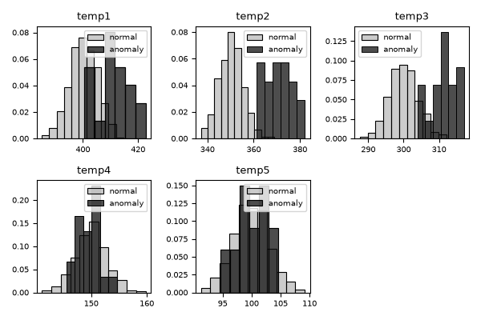
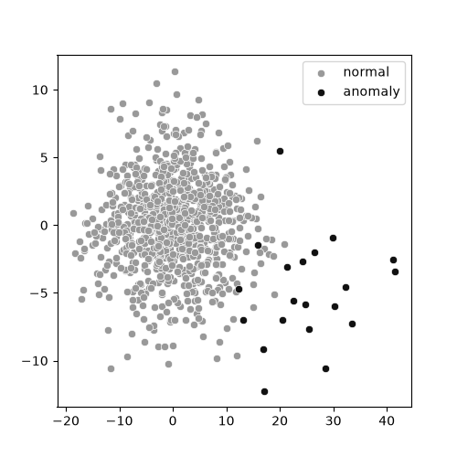
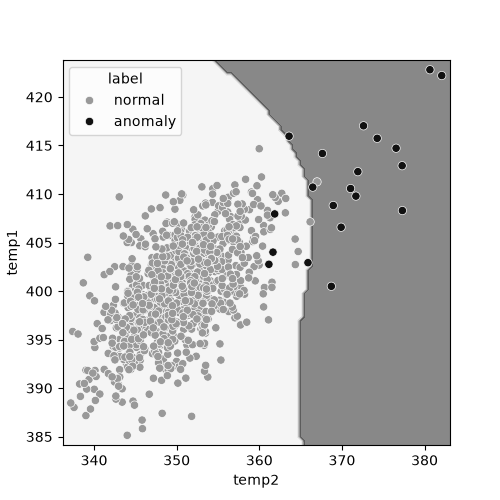
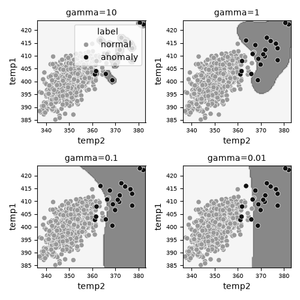
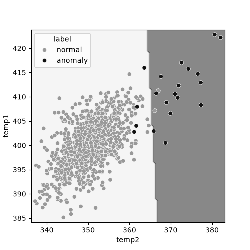
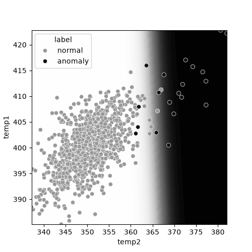
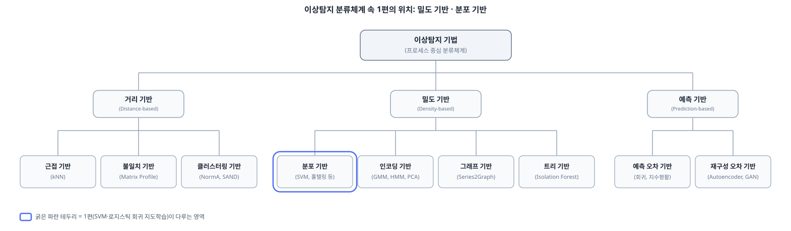

이상탐지는 정상적인 패턴에서 벗어난 데이터를 찾아내는 작업이다. 제조 공정의 불량품 검출, 금융 거래의 사기 탐지, 서버 지표의 장애 예측처럼 현업에서 마주치는 문제 상당수가 이상탐지 문제로 환원된다. 이 글은 통계 기법부터 시계열 탐지까지 단계적으로 정리하는 이상탐지 시리즈의 첫 번째 편이다. 이상탐지 문제를 정의하고, 실제 수행 흐름과 수법 선택 기준을 세운 뒤, 탐색적 데이터 분석을 거쳐 SVM과 로지스틱 회귀로 지도학습 기반 이상탐지를 구현한다. 대상 독자는 이상탐지를 처음 접하는 개발자와 데이터 엔지니어이며, 이 글을 읽고 나면 이상탐지 문제를 어떻게 정의하고 어떤 접근으로 풀어야 할지 판단하는 기준을 세울 수 있다.

## 이상탐지란 무엇인가

정상 상태와 이상 상태를 구분하는 기준은 데이터의 확률분포다. 어떤 관측값이 정상 데이터가 따르는 분포에서 나올 가능성이 낮을수록 그 값은 이상에 가깝다. 이 정의는 단순해 보이지만, 실무에서 이상탐지를 어렵게 만드는 원인이기도 하다. 정상 상태의 분포조차 미리 알 수 없는 경우가 많고, 이상 상태는 본질적으로 드물게 일어나므로 데이터로 관찰하기 어렵기 때문이다.

이런 제약은 이상탐지를 일반적인 이진분류 문제와 다르게 만든다. 일반적인 분류 문제는 두 클래스의 데이터를 고르게 모아 학습할 수 있다고 가정하지만, 이상탐지에서는 정상 데이터가 압도적으로 많고 이상 데이터는 극히 적은 클래스 불균형이 기본값이다. 게다가 실제로 마주칠 이상이 학습 데이터에 담긴 이상과 같은 종류라는 보장도 없다. 제조 라인에서 새로운 고장 유형이 생기거나 금융 거래에서 이전에 없던 사기 수법이 등장하면, 학습 데이터에는 없던 패턴의 이상이 발생한다.

그래서 이상탐지는 두 갈래로 접근한다. 하나는 정상과 이상 라벨이 모두 있다고 가정하고 분류 모델을 학습하는 지도학습이고, 다른 하나는 정상 데이터의 분포만 학습해서 그 분포에서 벗어나는 정도로 이상을 판정하는 비지도학습이다. 이 글에서는 먼저 지도학습으로 이상탐지의 감각을 잡고, 다음 편부터 [비지도학습](https://www.mimul.com/blog/anomaly-detection-unsupervised/)으로 넘어간다.

## 이상탐지를 실제로 수행하는 흐름

이상탐지 프로젝트는 대개 비슷한 절차를 따른다. 먼저 어떤 관측 단위(공정의 센서값, 거래 한 건, 서버의 지표 하나)를 이상탐지의 대상으로 삼을지 정의하고, 그 대상에서 어떤 변수를 측정할지 정한다. 다음으로 수집한 데이터를 탐색적으로 분석해 변수들의 분포와 관계를 파악하고, 이 파악을 바탕으로 정상 상태를 모델링할 방법(지도학습 분류기, 확률분포 기반 통계 모델, 회귀 모델 등)을 고른다. 모델을 학습한 뒤에는 정상과 이상을 가르는 임계값을 정하고, 실제 운영 데이터에 적용해 성능을 평가한다. 운영에 들어간 뒤에도 데이터의 분포가 시간에 따라 바뀔 수 있으므로 주기적으로 모델을 재검토해야 한다.

이 흐름에서 실제로 가장 많은 시간이 드는 단계는 데이터를 탐색하고 정상 상태를 정의하는 앞부분이다. 모델 자체는 상대적으로 짧은 코드로 구현할 수 있지만, 어떤 변수가 이상을 잘 설명하는지, 정상 데이터에 결측치나 이상치가 섞여 있지는 않은지 확인하는 작업은 데이터셋마다 달라진다. 이 글의 뒷부분에서 다루는 탐색적 데이터 분석은 이 단계를 위한 도구다.

## 어떤 수법을 고를 것인가

이상탐지 수법을 고르는 첫 번째 기준은 라벨의 유무다. 정상과 이상 데이터에 모두 라벨이 붙어 있고 그 수가 충분하다면 지도학습으로 분류 모델을 학습할 수 있다. 반대로 라벨이 없거나 이상 데이터의 수가 통계적으로 의미 있는 학습을 하기에 너무 적다면, 정상 데이터의 분포만으로 이상을 판정하는 비지도학습으로 접근해야 한다.

두 번째 기준은 변수의 개수와 관계다. 변수가 하나뿐이라면 그 변수의 확률분포를 직접 추정해서 이상을 판정할 수 있지만, 변수가 여럿이고 서로 상관관계를 가진다면 여러 변수의 관계를 함께 고려하는 다변량(多變量) 기법이 필요하다. 세 번째 기준은 데이터에 입력과 출력의 관계가 있는지다. 입력값에 따라 출력값이 달라지는 구조라면, 출력 하나만으로 이상을 판정하기보다 입력에 대한 출력의 예측 오차로 이상을 정의하는 회귀 기반 접근이 더 정확하다.

이 세가지 기준은 이 시리즈의 뒤 편에서 다룰 내용과도 맞물린다. 라벨 없는 단일 변수와 다변량 데이터는 [2편](https://www.mimul.com/blog/anomaly-detection-unsupervised/)에서, 입출력 관계가 있는 데이터는 [3편](https://www.mimul.com/blog/anomaly-detection-bayesian-regression/)에서 다룬다.

## 실 시스템에서 흔히 빠지는 함정

이상탐지를 실제 시스템에 붙일 때 반복되는 실수가 몇 가지 있다. 가장 흔한 것은 학습 데이터에 담긴 이상 사례만으로 모델의 성능을 낙관하는 태도다. 이상 데이터의 수가 워낙 적다 보니 학습에 쓰지 않은 소수의 이상 사례로 평가해도 지표상으로는 높은 성능이 나오기 쉽다. 신용카드 사기 탐지에 널리 쓰이는 유럽 카드사 거래 데이터셋만 봐도 28만 건이 넘는 거래 중 사기 거래는 492건(0.17%)에 그쳐, 평가에 쓸 수 있는 이상 사례 자체가 극히 적다. 하지만 실제 운영에서는 학습 데이터에 없던 새로운 유형의 이상이 나타나므로, 이렇게 적은 사례로 얻은 지표가 그대로 유지된다는 보장은 없다.

또 다른 함정은 정상 데이터의 분포가 시간에 따라 바뀐다는 사실을 놓치는 데 있다. 계절에 따라 생산 조건이 바뀌거나 서비스 이용 패턴이 달라지면, 예전에는 이상으로 판정되던 값이 지금은 정상일 수 있다. 트위터가 2015년에 자체 이상탐지 알고리즘을 공개하며 밝힌 배경도 이와 같다. 서비스 트래픽이 요일과 주 단위로 뚜렷한 계절성을 띠다 보니, 이 계절성을 반영하지 않은 통계 모델은 평상시의 주기적 변동을 이상으로 오판하곤 했다. 이런 변화를 반영하지 않으면 오탐(false positive)이 늘어나 운영자가 알림을 무시하게 되고, 결국 진짜 이상을 놓치는 결과로 이어진다. 마지막으로 이상탐지 모델의 출력을 임계값 하나로 정상과 이상을 가르는 이분법으로만 쓰는 경우가 많은데, 실제로는 이상 점수(anomaly score) 자체를 운영자에게 보여주고 우선순위를 매기는 방식이 알림 피로를 줄이는 데 더 효과적이다. 구글이 SRE(Site Reliability Engineering) 운영 원칙에서 단순 임계값 대신 오류 예산 소진 속도를 기준으로 알림을 설계하라고 권하는 이유도 같은 맥락이다.

## 데이터를 먼저 들여다보기, 탐색적 데이터 분석과 시각화

모델을 고르기 전에 데이터부터 살펴봐야 한다. 이 절에서는 5개 공정으로 이뤄진 가상의 생산 라인을 예로 든다. 각 공정에는 온도 센서가 하나씩 있고, 정상 상태에서는 목표 온도를 중심으로 정규분포를 따라 온도가 흩어진다고 가정한다. 공정 1~3은 물리적으로 가까워 온도가 서로 영향을 주고받으므로 상관관계가 생기고, 이상 상태는 온도 조절 기능 고장으로 평균 온도가 일정량 어긋나는 것으로 정의한다. 이 가정으로 정상 데이터 1500건과 이상 데이터 30건(약 2%)을 생성한다. (예제: [`series01/common.py`](https://github.com/mimul/anomaly_detection/blob/main/series01/common.py))

데이터를 살펴볼 때 가장 먼저 확인할 것은 요약 통계량과 결측치다. 평균, 표준편차, 사분위수 같은 요약 통계량은 각 변수가 어떤 범위에서 움직이는지 알려주고, 결측치 비율은 이후 모델을 고를 때 결측 데이터를 다룰 수 있는 모델인지 아닌지를 가르는 기준이 된다. 변수 간 상관계수도 함께 확인해두면 좋다. 상관이 큰 변수들은 서로 중복된 정보를 담고 있을 가능성이 높고, 이 정보는 뒤에서 다룰 SVM처럼 거리 기반 알고리즘을 쓸 때 변수를 어떻게 조합할지 판단하는 데 도움이 된다.

숫자로 된 요약만으로는 데이터의 분포 형태나 정상·이상 데이터의 분리 정도를 파악하기 어렵다. 히스토그램으로 변수별 분포를 그려보면 두 그룹이 얼마나 겹치는지 눈으로 확인할 수 있다.



다섯 변수 중 temp2의 분포가 정상과 이상 데이터 사이에서 가장 뚜렷하게 갈라지고, temp1과 temp3이 그 뒤를 잇는다. 반면 temp4와 temp5는 두 그룹의 분포가 거의 겹친다. 이 차이는 애초에 이상 데이터를 생성할 때 temp1부터 temp3까지의 평균만 어긋나도록 정의했기 때문에 나타난 결과이지만, 실제 데이터에서도 히스토그램만으로 어떤 변수가 이상 판별에 유용한지 가늠할 수 있다.

변수가 다섯 개를 넘어가면 하나씩 그려보는 것만으로는 전체 구조를 파악하기 어렵다. 이럴 때는 주성분분석(PCA)으로 차원을 2개로 줄여 산점도를 그려보면 다변량 데이터의 전체적인 분리 정도를 한눈에 볼 수 있다.



다섯 개 변수를 두 개의 주성분으로 압축한 뒤에도 정상과 이상 데이터가 어느 정도 갈라져 있음을 확인할 수 있다. 이 결과는 이어서 다룰 SVM과 로지스틱 회귀 같은 지도학습 모델이 이 데이터에서 합리적인 성능을 낼 수 있으리라는 근거가 된다. (예제: [`series01/eda.py`](https://github.com/mimul/anomaly_detection/blob/main/series01/eda.py))

이렇게 PCA로 다변량 데이터를 요약해 이상을 미리 감지하는 접근은 실제 설비 진단에도 쓰인다. Intel은 Seeq와 함께 PCA 기반 다변량 이상탐지기를 회전 설비 모니터링에 도입해, 실제 고장이 나기 3일 이상 전에 이상 징후를 잡아내 계획된 유지보수로 전환했다.

## SVM으로 이상을 탐지하기

정상과 이상 라벨이 모두 있는 데이터라면, 두 클래스를 가르는 결정 경계를 학습하는 분류 모델을 바로 적용할 수 있다. SVM(서포트 벡터 머신)은 두 클래스 사이의 마진을 최대화하는 경계를 찾는 알고리즘으로, 커널 트릭을 쓰면 선형으로 분리되지 않는 데이터도 비선형 경계로 분류할 수 있다. SVM은 이상탐지 초기 연구에서 특히 많이 쓰인 기법이다. NASA는 여러 시스템에 흩어져 있는 비행 센서 데이터에서 이상을 잡아내기 위해 1-class SVM 기반 분산 이상탐지 기법을 연구했고, 반도체 제조 현장에서도 실제 파운드리에서 수집한 웨이퍼 맵 데이터로 결함 패턴을 SVM으로 분류하는 연구가 이뤄졌다. 화학공정에서는 Eastman Chemical의 실제 공정을 본뜬 Tennessee Eastman Process 벤치마크로 SVM 기반 고장 진단 연구가 광범위하게 이뤄졌다.

다음 코드는 temp1과 temp2 두 변수만으로 SVM을 학습하고 결정 경계를 그린다. SVM은 특징 공간에서의 거리(유클리드 거리)에 기반한 알고리즘이므로, 변수의 스케일이 다르면 스케일이 큰 변수가 거리 계산을 지배해버린다. 그래서 학습 전에 표준화를 거쳐야 하고, 표준화와 SVM을 하나의 파이프라인으로 묶어 학습과 추론에서 같은 변환이 일관되게 적용되도록 한다.

```python
from sklearn.svm import SVC
from sklearn.pipeline import Pipeline
from sklearn.preprocessing import StandardScaler

svm = SVC(C=10, gamma=0.1)
clf = Pipeline([("scaler", StandardScaler()), ("svm", svm)])
clf.fit(X, y)
```



결정 경계가 곡선으로 그려진 것은 커널 트릭 덕분이다. 또한 일부 데이터가 경계를 넘어가도 이를 허용하는 소프트 마진 덕분에, 데이터에 섞인 노이즈에 결정 경계가 지나치게 휘둘리지 않는다.

SVM에는 감마(gamma)와 C라는 두 하이퍼파라미터가 있고, 이 값을 어떻게 정하느냐에 따라 결정 경계의 모양이 크게 달라진다. 감마는 가우스 커널의 폭을 조절하는데, 값이 커질수록 각 데이터 포인트에 더 좁고 뾰족하게 반응하는 경계가 그려진다.



감마가 클수록 학습 데이터 하나하나에 맞춰 구불구불한 경계가 만들어진다. 이렇게 학습 데이터에 지나치게 맞춰진 모델은 학습 데이터에 대한 성능은 높아 보이지만, 학습에 쓰지 않은 새로운 데이터에 대한 예측 성능(일반화 성능)은 오히려 떨어진다. 이 현상을 과적합(overfitting)이라 부르고, 운영 중인 시스템에서 실제로 마주칠 미지의 이상 패턴에 대응해야 하는 이상탐지에서는 특히 주의해야 할 문제다. C는 소프트 마진의 마진 위반에 대한 페널티 강도(정칙화)를 조절하는 파라미터다. C가 클수록 정칙화 효과가 작아져 과적합 쪽으로, C가 작을수록 결정 경계가 완만해지는 쪽으로 움직인다. 실무에서는 교차검증으로 이 두 값을 함께 탐색해 미지 데이터에 대한 성능을 최대화하는 조합을 찾는다. (예제: [`series01/supervised.py`](https://github.com/mimul/anomaly_detection/blob/main/series01/supervised.py))

## 로지스틱 회귀로 이상을 탐지하기

로지스틱 회귀도 정상과 이상 라벨을 목적 변수로 삼아 학습하는 지도학습 분류 모델이다. SVM과 다른 점은 결정 경계를 직접 최적화하는 대신, 각 클래스에 속할 확률을 로지스틱 함수로 모델링하고 이 확률의 최우추정으로 파라미터를 구한다는 데 있다.

```python
from sklearn.linear_model import LogisticRegression

clf = LogisticRegression(penalty=None)
clf.fit(X, y)
```



같은 데이터에 SVM을 적용했을 때와 비교하면 차이가 뚜렷하다. 로지스틱 회귀의 결정 경계는 직선이다. 커널 트릭 없이 변수의 선형 결합만으로 확률을 모델링하기 때문에, 데이터가 선형으로 잘 나뉘지 않는 경우에는 SVM보다 표현력이 떨어진다. 대신 계산이 가볍고 각 변수가 결과에 얼마나 기여하는지 계수로 직접 해석할 수 있다는 장점이 있다. 이 해석 가능성 때문에 로지스틱 회귀는 규제 산업에서 특히 선호된다. 미국에서는 신용 거부 시 어떤 요인이 결정에 가장 크게 작용했는지 신청자에게 통지해야 한다는 규제(Equal Credit Opportunity Act의 Regulation B) 때문에, FICO를 비롯한 신용평가사들은 오랫동안 로지스틱 회귀 기반 스코어카드를 신용평가의 표준 모델로 써왔다. 결제 서비스 기업 Stripe도 초기 사기 탐지 시스템(Radar)을 로지스틱 회귀로 시작한 뒤, 이후 XGBoost와 심층신경망을 결합한 모델로 발전시켰다.

로지스틱 회귀는 학습 과정에서 이미 각 클래스에 속할 확률을 계산하므로, `predict_proba` 메서드로 이 확률을 바로 꺼내 쓸 수 있다.



결정 경계 부근에서 확률이 급격하게 바뀌는 것을 확인할 수 있다. 이 확률값은 정상과 이상을 이분법으로 가르는 대신, 이상 점수로 활용해 알림의 우선순위를 매기는 데 쓸 수 있다. SVM도 Platt Scaling이라는 방법으로 결정 함수 값에 로지스틱 함수를 사후적으로 맞춰 클래스 확률을 구할 수 있지만, 이 경우 확률 분포가 SVM의 곡선형 결정 경계를 따라 로지스틱 회귀보다 더 구불구불한 형태를 띤다. (예제: 앞서 SVM에서 본 것과 같은 파일인 [`series01/supervised.py`](https://github.com/mimul/anomaly_detection/blob/main/series01/supervised.py))

## 지도학습 기반 이상탐지가 갖는 한계

SVM과 로지스틱 회귀는 정상과 이상 라벨이 모두 충분할 때 잘 동작한다. 하지만 이 조건 자체가 실무에서는 자주 무너진다. 이상 데이터는 정의상 드물게 일어나므로, 통계적으로 안정된 학습이 가능할 만큼 이상 사례를 모으는 데 오랜 시간이 걸리거나 애초에 불가능한 경우가 많다. 이 글의 예제에서도 생성한 정상 데이터 1500건에 이상 데이터는 30건(약 2%)뿐이었다. 이런 극단적인 클래스 불균형에서는 모델이 이상 클래스의 경계를 제대로 학습하지 못하고, 다수 클래스인 정상 쪽으로 치우친 예측을 내놓기 쉽다.

더 근본적인 문제는 지도학습이 학습 데이터에 있던 이상의 종류만 인식할 수 있다는 점이다. 지도학습 분류기는 학습한 이상 패턴과 비슷한 새로운 사례는 잘 잡아내지만, 앞서 말한 것처럼 학습 데이터에 없던 완전히 새로운 유형의 이상에는 무력하다. 실무에서 이상탐지가 요구되는 상황 자체가 대개 이렇게 미지의 이상까지 잡아내야 하는 경우다.

이 한계 때문에 실무 이상탐지에서는 정상 데이터의 분포만으로 이상을 판정하는 비지도학습이 더 널리 쓰인다. 라벨이 있는 이상 사례에 의존하지 않고 정상 데이터가 형성하는 분포에서 얼마나 벗어났는지로 이상을 정의하기 때문에, 학습 데이터에 없던 이상에도 대응할 수 있다. [다음 편](https://www.mimul.com/blog/anomaly-detection-unsupervised/)부터는 이 비지도학습 접근을 확률분포와 최우추정이라는 도구로 구현하는 방법을 다룬다.

## 1편에서 다룬 기법이 분류체계에서 차지하는 위치

이 시리즈는 시계열 이상탐지를 다루는 4편에서 논문 ["Dive into Time-Series Anomaly Detection: A Decade Review"](https://arxiv.org/pdf/2412.20512)의 프로세스 중심 분류체계를 소개하고, 그 위에 1~3편에서 다룬 기법을 다시 위치시킨다. 이 글에서 지도학습으로 다룬 SVM과 로지스틱 회귀는 정상과 이상 데이터가 형성하는 경계를 라벨로부터 직접 학습한다는 점에서, 이 분류체계의 밀도 기반(density-based) 중에서도 분포 기반(distribution-based)에 해당한다.



## 요약

이상탐지는 정상 데이터의 분포에서 벗어난 정도로 이상을 정의하는 문제이며, 클래스 불균형과 미지의 이상이라는 두 제약 때문에 일반적인 분류 문제와 다르게 접근해야 한다. 라벨이 충분하다면 SVM이나 로지스틱 회귀 같은 지도학습 분류기로 바로 접근할 수 있지만, 학습 데이터에 없던 이상까지 잡아내야 하는 실무 조건에서는 한계가 뚜렷하다. [다음 편](https://www.mimul.com/blog/anomaly-detection-unsupervised/)에서는 이 한계를 넘어서기 위해 정상 데이터의 확률분포만으로 이상을 판정하는 비지도학습 접근을, 1변량 데이터에서 시작해 다변량 데이터까지 단계적으로 다룬다.

## 참조 사이트

- [Anomaly detection: A survey](https://dl.acm.org/doi/10.1145/1541880.1541882)
- [Accelerating Semiconductor Manufacturing Efficiency with Advanced Analytics (Intel + Seeq)](https://www.seeq.com/resources/blog/intel-seeq-ai-cut-downtime-in-semiconductor-manufacturing/)
- [Credit Card Fraud Detection](https://www.kaggle.com/datasets/mlg-ulb/creditcardfraud)
- [Introducing practical and robust anomaly detection in a time series](https://blog.x.com/engineering/en_us/a/2015/introducing-practical-and-robust-anomaly-detection-in-a-time-series)
- [Monitoring Distributed Systems - Google SRE Book](https://sre.google/sre-book/monitoring-distributed-systems/)
- [DASHlink - Distributed Anomaly Detection using 1-class SVM for Vertically Partitioned Data](https://c3.ndc.nasa.gov/dashlink/resources/367/)
- [WM-811K wafer map dataset](https://www.kaggle.com/datasets/qingyi/wm811k-wafer-map)
- [Study on Support Vector Machine-Based Fault Detection in Tennessee Eastman Process](https://onlinelibrary.wiley.com/doi/10.1155/2014/836895)
- [What Are Credit Score Reason Codes?](https://www.myfico.com/credit-education/blog/reason-codes)
- [How we built it: Stripe Radar](https://stripe.dev/blog/how-we-built-it-stripe-radar)
