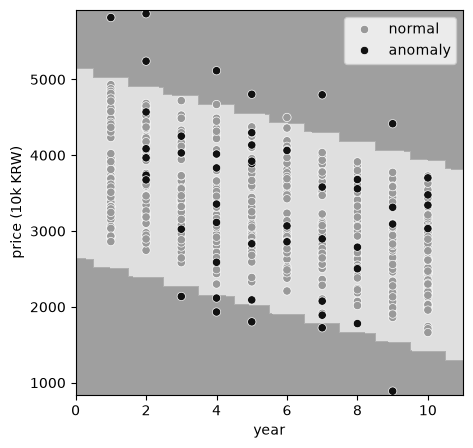
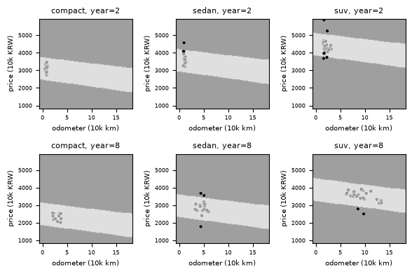
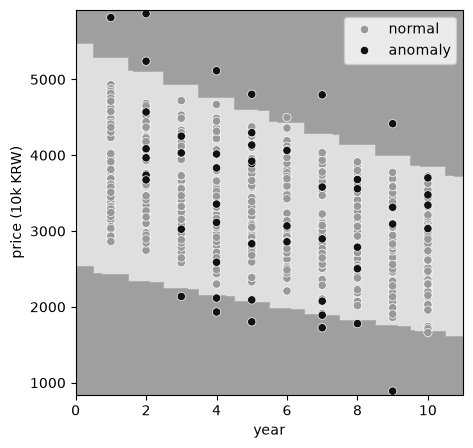
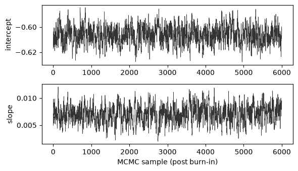
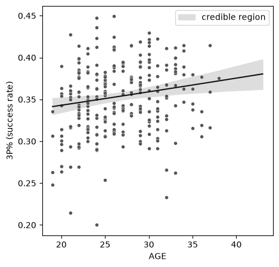
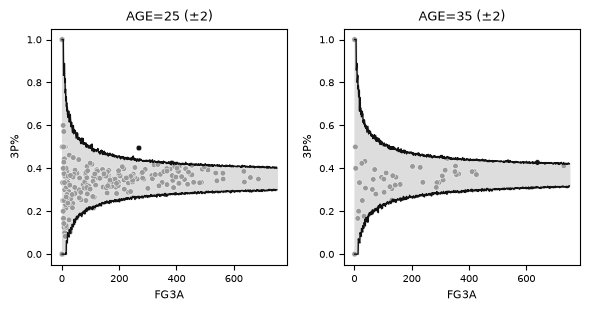
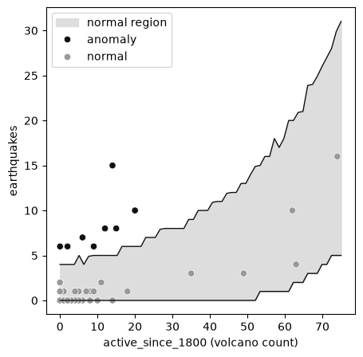
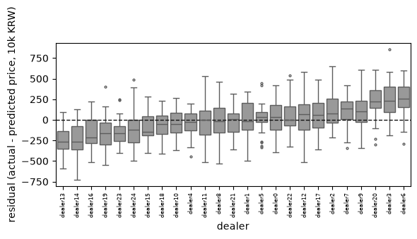

[2편](/blog/anomaly-detection-unsupervised/)에서 다룬 홀텔링 이론이나 GMM은 정상 데이터가 형성하는 확률분포 하나를 통째로 학습했다. 관측값이 그 분포에서 나올 법한지만 보고 이상 여부를 판정하는 접근이다. 하지만 이 접근은 관측값의 정상 범위 자체가 다른 변수에 따라 달라지는 상황에서는 힘을 잃는다. 이 글은 입력에 대한 출력의 편차로 이상을 정의하는 회귀 기반 접근과, 파라미터의 불확실성까지 반영하는 베이지안 모델링을 다룬다.

회귀 기반 이상탐지를 다루려는 개발자와 데이터 엔지니어를 대상으로 하며, 이 글을 읽고 나면 입력과 출력이 있는 데이터에서 왜 회귀가 필요한지, 최우추정과 베이지안 추정이 무엇이 다른지, MCMC가 언제 필요한지 판단할 수 있다. 예제 코드는 [github.com/mimul/anomaly_detection](https://github.com/mimul/anomaly_detection)의 `series03/`에 있다.

## 입력과 출력이 있는 데이터에서 이상을 정의하기

중고차 매물의 가격이 이상한지 판단하는 문제를 생각해보자. 가격 하나만 놓고 정규분포를 적합해 홀텔링 이론을 적용하면, 연식이 오래되고 주행거리가 긴 차는 가격이 낮다는 이유만으로 무더기로 이상 판정을 받는다. 실제로는 낮은 가격이 그 차의 연식과 주행거리를 감안하면 지극히 정상일 수 있다. 이런 데이터에서는 관측값 자체의 확률이 아니라, 입력(연식, 주행거리, 차종)에 대해 출력(가격)이 예측값에서 얼마나 벗어났는지로 이상을 정의해야 한다. 이때 입력을 설명변수, 출력을 응답변수라 부른다.

이 글에서는 연식·주행거리·차종·판매자로 가격이 정해지는 중고차 데이터셋을 사용한다. 학습 데이터 1100건 중 1000건이 정상 매물이고 100건은 의도적으로 만든 이상 매물이다(학습에는 정상 매물만 사용한다). 추론 데이터는 500건의 정상 매물과 50건의 이상 매물로 구성된 550건이다. 차종은 세단(sedan), 소형차(compact), SUV 세 종류다. 이런 입출력 구조를 가장 단순하게 모델링하는 방법이 선형회귀다.

## 선형회귀로 조건부 정상 범위 구하기

설명변수 하나로 응답변수를 예측하는 선형회귀부터 시작한다. 연식(`year`)만으로 가격(`price`)을 예측하는 모델을 최소제곱법(OLS)으로 학습하면, 잔차가 정규분포 $N(0, \sigma^2)$를 따른다고 가정할 수 있다. 이 가정 위에서 이상 점수는 예측값과 실제값의 차이를 잔차 분산으로 정규화한 값이다.

$$a(x, y) = \frac{(y - w_1 x - w_0)^2}{\sigma^2}$$

```python
import statsmodels.api as sm

X_train_intercept = sm.add_constant(x_train)
res = sm.OLS(y_train, X_train_intercept).fit()
slope, intercept = res.params[1], res.params[0]
residual_var = res.scale * res.df_resid / len(y_train)

train_score = (y_train - slope * x_train - intercept) ** 2 / residual_var
anomaly_threshold = np.quantile(train_score, 1 - TARGET_FP_RATE)
```

학습 결과 `slope=-121.400`, `intercept=3890.521`, `residual_var=323433.58`가 나오고, 목표 오탐률 0.27%(정규분포 3시그마에 해당)를 기준으로 한 임계값은 `4.9166`이다.



정상 범위(회색 띠)가 연식에 따라 기울어져 있어, 오래된 차일수록 낮은 가격도 정상으로 받아들인다. 관측값 하나만 보고 판정했다면 불가능했을 결과다. 다만 이 모델은 추론 데이터 550건 중 15건만 이상으로 판정한다. 실제 이상 매물은 50건이므로 35건을 놓치는 셈이다. 원인은 명확하다. 가격에 영향을 주는 변수가 연식 하나만은 아니기 때문이다.

## 설명변수를 늘려 다변량 선형회귀로 확장하기

주행거리(`odometer`)와 차종(`model_name`)을 함께 넣으면 가격을 더 정확하게 예측할 수 있다. 차종은 범주형 변수이므로 원-핫 인코딩으로 수치화한다.

```python
from sklearn.preprocessing import OneHotEncoder

encoder = OneHotEncoder(drop="first")
onehot_array = encoder.fit_transform(df_normal[["model_name"]].to_numpy()).toarray()
```

나머지 학습 절차는 1변수 선형회귀와 같다. 다만 계수 `w`가 벡터가 되어, 이상 점수는 1변수일 때의 식을 그대로 다변량으로 확장한 형태를 갖는다.

$$a(\mathbf{x}, y) = \frac{(y - \mathbf{w}^\top\mathbf{x} - w_0)^2}{\sigma^2}$$

학습 결과는 다음과 같다.

```
coef = [-101.350, -36.108, 461.549, 1382.990]  # year, odometer, compact, suv (sedan 대비)
intercept = 3311.344
residual_var = 54771.62
anomaly_threshold = 7.6331
```

가장 눈에 띄는 변화는 잔차 분산이다. 연식만 썼을 때 323433.58이었던 `residual_var`가 54771.62로 6분의 1 가까이 줄었다. 그만큼 주행거리와 차종이 가격 변동의 상당 부분을 설명한다는 뜻이다. 정상 범위도 훨씬 좁아져, 추론 데이터에서 이상으로 판정되는 건수가 15건에서 46건으로 늘어난다.


차종과 연식 조합마다 정상 범위의 위치와 기울기가 다르게 그려진다. 같은 주행거리라도 세단보다 SUV의 정상 가격대가 높고, 연식이 늘어날수록 정상 범위 자체가 아래로 이동한다. 설명변수 하나를 추가할 때마다 이렇게 정상 범위가 더 정교해진다.

## 다중공선성에 대비하는 리지회귀

설명변수가 늘어날수록 문제가 되는 것이 다중공선성(multicollinearity)이다. 설명변수 사이에 강한 상관관계가 있으면 최소제곱법의 계수 추정이 불안정해진다. 대표적인 해결책이 정규화이고, 선형회귀에는 L2 정규화를 적용한 리지회귀(ridge regression)가 흔히 쓰인다. 리지회귀는 최소제곱법의 잔차제곱합에 계수 크기에 대한 페널티를 더해, 그 합을 최소화하는 계수를 구한다.

$$\hat{\mathbf{w}} = \arg\min_{\mathbf{w},\,w_0} \left\{\sum_{i=1}^{N}\left(y_i - \mathbf{w}^\top\mathbf{x}_i - w_0\right)^2 + \lambda\lVert\mathbf{w}\rVert_2^2\right\}$$

정규화 강도 $\lambda$가 클수록 계수가 0 쪽으로 더 강하게 수축된다.

```python
LAMBDA = 2.0
alpha = LAMBDA / 2 / len(y_train)
res = mod.fit_regularized(alpha=alpha, L1_wt=0)
```

리지회귀는 계수를 0 쪽으로 수축시키는 대신, 예측 분산이 개별 데이터 지점의 레버리지(leverage)에 따라 달라진다. 레버리지는 그 지점이 설명변수 공간에서 학습 데이터의 중심으로부터 얼마나 떨어져 있는지를 나타내는 값이다.

$$h(\mathbf{x}) = 1 + \mathbf{x}^\top(\mathbf{X}^\top\mathbf{X} + \lambda I)^{-1}\mathbf{x}$$

이 레버리지로 예측분산 $\hat\sigma^2 h(\mathbf{x})$를 부풀린 정규분포의 음의 로그가능도를 이상 점수로 쓴다.

$$a(\mathbf{x}, y) = \frac{1}{2}\log\left(2\pi\hat\sigma^2 h(\mathbf{x})\right) + \frac{(y-\hat y)^2}{2\hat\sigma^2 h(\mathbf{x})}$$

예측값에서 크게 벗어날수록 이상 점수가 커진다.



이 데이터셋에서는 리지회귀의 결과가 다변량 선형회귀와 거의 같다(이상 판정 46건으로 동일). 계수(`ridge_coef`)도 `[-99.277, -35.939, 464.260, 1382.011]`로 다변량 선형회귀의 `[-101.350, -36.108, 461.549, 1382.990]`와 큰 차이가 없다. 이 데이터셋의 설명변수(연식, 주행거리, 차종) 사이에 심한 다중공선성이 없기 때문이다. 리지회귀의 효과는 판정 결과의 차이보다는 계수 추정의 안정성에 있다. 설명변수 사이의 상관관계가 강한 데이터일수록 두 방법의 차이가 벌어진다.

## 정규분포를 벗어난 응답변수를 감마회귀로 다루기

지금까지는 잔차가 정규분포를 따른다고 가정했다. 하지만 가격처럼 항상 양수이고 오른쪽 꼬리가 긴 데이터는 정규분포보다 감마분포로 모델링하는 편이 더 알맞다. 이렇게 확률분포와 연결함수를 정규분포와 항등함수 이외의 조합으로 바꾼 회귀모형을 일반화선형모형(generalized linear model, GLM)이라 부른다. 여기서는 확률분포에 감마분포, 연결함수에 로그함수를 쓴다. 로그함수는 예측 평균 $\mu_i$가 항상 양수가 되도록 보장한다.

$$\log \mu_i = \mathbf{w}^\top\mathbf{x}_i + w_0$$

2편에서 감마분포를 형상 $k$, 척도 $\theta$로 정의했는데(평균 $=k\theta$), GLM에서는 평균 $\mu$와 분산이 $\phi\mu^2$가 되도록 하는 분산 파라미터 $\phi$로 다시 표현한다($k=1/\phi$, $\theta=\mu\phi$).

$$p(y; \mu, \phi) = \frac{1}{\Gamma(1/\phi)\,(\mu\phi)^{1/\phi}}\, y^{1/\phi - 1} e^{-y/(\mu\phi)}$$

이상 점수는 이 밀도함수에 관측값을 대입한 값의 음의 로그, 즉 음의 로그가능도다.

$$a(\mathbf{x}_i, y_i) = -\log p(y_i; \mu_i, \phi)$$

```python
family = sm.families.Gamma(sm.families.links.Log())
res = sm.GLM(y_train, X_train_intercept, family=family).fit()

train_score = -np.log(res.get_distribution(exog=X_train_intercept).pdf(y_train))
```

연식 하나만 설명변수로 쓴 감마회귀의 임계값은 `9.7033`이고, 추론 데이터 중 17건이 이상으로 판정된다. 같은 1변수 조건에서 정규분포를 가정한 선형회귀는 15건을 판정했으니, 감마회귀가 조금 더 많이 잡아낸다.



정상 범위의 폭이 위아래로 비대칭이다. 정규분포를 가정했다면 평균을 중심으로 대칭인 범위가 나왔겠지만, 감마분포는 오른쪽으로 치우친 분포이므로 정상 범위도 그 형태를 따라간다. 실제 가격 데이터가 오른쪽 꼬리가 긴 형태라면, 이 비대칭성이 대칭 가정보다 더 정확한 이상 판정으로 이어진다.

## 베이지안 추정으로 파라미터의 불확실성을 반영하기

지금까지 쓴 최우추정은 파라미터의 값 하나(점추정)만을 구한다. 반면 베이지안 추정은 파라미터에 대한 사전 지식(사전분포)과 관측 데이터(우도)를 결합해, 파라미터가 가질 수 있는 값의 분포(사후분포) 전체를 구한다. 데이터가 적을 때는 이 사후분포의 폭이 넓어 불확실성이 크다는 사실이 드러나고, 데이터가 쌓일수록 사후분포가 좁아지며 최우추정 결과에 가까워진다.

선형회귀처럼 우도와 사전분포가 켤레(conjugate) 관계인 모델은 사후분포를 적분 없이 닫힌 형태의 수식으로 구할 수 있다. scikit-learn의 `BayesianRidge`는 노이즈 정밀도 $\alpha$, 계수 사전분포의 정밀도 $\lambda$를 가정한다.

$$y \mid \mathbf{X}, \mathbf{w}, \alpha \sim \mathcal{N}(\mathbf{X}\mathbf{w}, \alpha^{-1}I), \qquad \mathbf{w} \mid \lambda \sim \mathcal{N}(\mathbf{0}, \lambda^{-1}I)$$

두 분포 모두 정규분포이므로(켤레 관계), 계수의 사후분포도 다음과 같이 닫힌 형태의 정규분포로 구해진다.

$$\Sigma_w = (\lambda I + \alpha \mathbf{X}^\top\mathbf{X})^{-1}, \qquad \boldsymbol{\mu}_w = \alpha\, \Sigma_w \mathbf{X}^\top \mathbf{y}$$

이 계산을 그대로 구현한 것이 `BayesianRidge`다.

```python
from sklearn.linear_model import BayesianRidge

model = BayesianRidge(compute_score=True)
model.fit(X_train, y_train)
mean, std = model.predict(X_inference, return_std=True)
score = ((y_inference - mean) / std) ** 2
```

`predict`가 예측값의 평균뿐 아니라 표준편차(`std`)까지 돌려준다는 점이 최우추정과 다르다. 새 입력 $\mathbf{x}_*$에 대한 예측분포의 평균과 분산은 다음과 같다.

$$\mathbb{E}[y_*] = \mathbf{x}_*^\top \boldsymbol{\mu}_w, \qquad \mathrm{Var}[y_*] = \frac{1}{\alpha} + \mathbf{x}_*^\top \Sigma_w \mathbf{x}_*$$

분산의 첫째 항($1/\alpha$)은 잔차 자체의 흩어짐이고, 둘째 항($\mathbf{x}_*^\top \Sigma_w \mathbf{x}_*$)은 계수 $\mathbf{w}$를 확신하지 못하는 정도에서 오는 불확실성이다. 이 두 불확실성을 모두 반영한 표준편차가 `std`이고, 이상 점수 계산에 그대로 들어간다.

```
coef = [-101.624, -35.698, 460.295, 1380.456]
intercept = 3312.570
anomaly_threshold = 7.5547
```

계수와 판정 결과(46/550)가 다변량 선형회귀와 거의 같다. 학습 데이터가 1000건으로 충분히 많고, 사전분포도 특정 값을 강하게 가정하지 않는(무정보에 가까운) 분포를 썼기 때문이다. 데이터가 많고 사전분포가 약할수록 베이지안 추정의 점추정은 최우추정에 수렴한다.


## 사후분포를 표본으로 근사하는 MCMC

선형회귀는 켤레사전분포 덕에 사후분포를 수식으로 구했지만, 이항 로지스틱 회귀나 포아송 회귀처럼 연결함수가 비선형인 일반화선형모형은 우도와 사전분포가 켤레 관계가 아니어서 사후분포를 닫힌 형태로 구할 수 없다. 이럴 때 사후분포에서 표본을 뽑아 근사하는 기법이 MCMC(Markov chain Monte Carlo)다. 베이즈 정리에 따르면 사후분포는 우도와 사전분포의 곱에 비례한다.

$$p(\theta \mid D) \propto p(D \mid \theta)\,p(\theta)$$

우변은 정규화 상수 없이도 계산할 수 있으므로, MCMC는 이 비정규화된 값만으로 사후분포에서 표본을 뽑는다. MCMC 중 가장 기본적인 알고리즘이 Metropolis-Hastings다. 현재 파라미터 값 근처에서 새 후보를 대칭인 분포(여기서는 정규분포)로 무작위 제안하면, 채택 확률은 사후확률의 비율만으로 정해진다.

$$P(\text{accept}) = \min\left(1, \frac{p(\theta' \mid D)}{p(\theta \mid D)}\right)$$

후보의 사후확률이 현재 값보다 높으면 그대로 받아들이고, 낮으면 그 비율만큼의 확률로만 받아들인다는 뜻이다. 이 과정을 반복하면 받아들여진 표본들의 분포가 실제 사후분포에 점점 가까워진다.

```python
def metropolis_hastings(log_posterior, init, step, n_iter=8000, burn=2000, seed=42):
    rng = np.random.default_rng(seed)
    current = np.array(init, dtype=float)
    current_lp = log_posterior(*current)
    samples = np.zeros((n_iter, len(init)))
    for i in range(n_iter):
        proposal = current + rng.normal(0, step, size=len(init))
        proposal_lp = log_posterior(*proposal)
        if np.log(rng.uniform()) < proposal_lp - current_lp:
            current, current_lp = proposal, proposal_lp
        samples[i] = current
    return samples[burn:]
```

이항 로지스틱 회귀 모델에 이 샘플러를 적용하면 채택률(제안이 받아들여지는 비율) 62.9%로 8000번 반복하고, 초반 번인(burn-in) 2000개를 제외한 6000개를 사후표본으로 얻는다. 채택률이 너무 낮으면 제안 폭이 너무 넓어 대부분 기각되고, 너무 높으면 제안 폭이 좁아 표본이 좁은 영역에서만 맴돈다. 대략 20~60% 사이가 적절하다고 알려져 있다.



두 파라미터 모두 특정 구간 안에서 위아래로 고르게 흔들리며, 표본을 뽑을수록 특정 방향으로 쏠리는 추세가 보이지 않는다. 이런 안정된 궤적은 표본이 사후분포에 수렴했다는 신호다. 반대로 궤적이 한 방향으로 계속 표류하거나 특정 구간에 오래 머문다면, 아직 초기값의 영향이 남아 있거나 제안 폭을 다시 조정해야 한다는 뜻이다.

## 이항 로지스틱 회귀와 포아송 회귀의 베이지안 버전

MCMC로 얻은 사후분포 표본은 두 가지 계수 데이터 모델에 그대로 적용된다. 시도 수 $n$ 중 성공 수 $y$를 다루는 이항 로지스틱 회귀는 연결함수로 로짓함수를, 관측 구간 $t$당 발생 수를 다루는 포아송 회귀는 연결함수로 로그함수를 쓴다.

이항 로지스틱 회귀는 2편에서 쓴 NBA 선수의 3점슛 데이터를 재사용한다. 다만 2편의 이항분포 모델은 발생 확률을 상수 하나로 고정했던 반면, 여기서는 발생 확률이 선수 나이(`AGE`)에 따라 달라지는 함수로 모델링한다. 로짓 연결함수로 성공 확률을 $(0,1)$ 사이로 제한하고, 계수에는 평균 0, 표준편차 100인 넓은 정규분포를 사전분포로 둔다.

$$\mu_i = \frac{1}{1+e^{-(w_0 + w_1 x_i)}}, \qquad y_i \sim \text{Binomial}(n_i, \mu_i)$$

$$\log p(w_0, w_1 \mid D) \;\propto\; \sum_i \log \text{Binom}(y_i; n_i, \mu_i) + \log\mathcal{N}(w_0; 0, 100^2) + \log\mathcal{N}(w_1; 0, 100^2)$$

```python
def log_posterior(intercept, slope):
    linear_pred = intercept + slope * x_train_centered
    success_prob = 1 / (1 + np.exp(-linear_pred))
    log_likelihood = np.sum(stats.binom.logpmf(y_train, n_train, success_prob))
    log_prior = stats.norm.logpdf(intercept, 0, 100) + stats.norm.logpdf(slope, 0, 100)
    return log_likelihood + log_prior
```

사후평균은 `intercept=-0.6063`, `slope=0.0070`(오차는 사후표준편차)이다. 기울기가 양수이므로 나이가 많을수록 3점슛 성공률의 평균이 소폭 높아진다는 뜻이다.



2023시즌 추론 데이터 523명 중 7명이 이상으로 판정된다. 27세 Luke Kennard는 269회 시도에 133개를 성공시켜 성공률 49.4%로 나이 대비 지나치게 높고, 25세 Dennis Smith Jr.는 111회 시도에 24개만 성공시켜 성공률 21.6%로 지나치게 낮다.



같은 시도 수라도 나이대에 따라 정상 범위의 폭이 달라진다. 시도 수가 적을수록 정상 범위가 넓어지는 것은 2편의 이항분포 모델과 같은 원리다. 시도 횟수가 적으면 우연히 몇 개를 더 넣거나 놓쳐도 성공률이 크게 흔들리기 때문이다.

포아송 회귀는 지진 발생 수를 화산 활동으로 예측한다. 미국 지질조사국(USGS)의 지진 관측 데이터와 스미스소니언 박물관의 화산 데이터를 국가 단위로 결합한 데이터로, 설명변수는 1800년 이후 활동 이력이 있는 화산 수(`active_since_1800`)다. 로그 연결함수로 모델링하는 만큼, `log_posterior` 함수의 우도 부분만 `stats.binom.logpmf`에서 `stats.poisson.logpmf`로 바뀌고 나머지 구조는 로지스틱 회귀와 같다.

$$\lambda_i = e^{w_0 + w_1 x_i}, \qquad y_i \sim \text{Poisson}(\lambda_i)$$

```
intercept = -0.2708 (오차 0.0553)
slope = 0.0441 (오차 0.0014)
```



2023년 데이터 81개국 중 8개국이 이상으로 판정된다. 아프가니스탄(화산 0개, 지진 6건), 필리핀(화산 14개, 지진 15건), 파푸아뉴기니(화산 20개, 지진 10건), 뉴질랜드·아르헨티나·통가·튀르키예·바누아투가 여기에 포함된다. 이 국가들은 모두 환태평양 조산대나 히말라야-알프스 조산대처럼 지각판 경계에 가까운 지역이다. 화산 수만으로는 설명되지 않는 지진 활동이 있다는 뜻이며, 이는 화산 수 이외에도 지각판 경계와의 거리 같은 변수를 추가하면 더 정교한 모델을 만들 수 있다는 신호이기도 하다.

## 개체와 그룹의 차이를 반영하는 랜덤효과

지금까지 쓴 모든 회귀모형은 설명변수로 응답변수의 평균을 예측했다. 하지만 설명변수를 아무리 늘려도 다 설명되지 않는 차이가 남는 경우가 있다. 개별 데이터마다 있는 개체차, 또는 데이터가 속한 그룹마다 있는 그룹차다. 이런 차이를 정규분포를 따르는 무작위 항으로 모델에 추가하는 방법을 랜덤효과(random effect)라 부르고, 이렇게 랜덤효과를 포함한 일반화선형모형을 일반화선형혼합모형(GLMM)이라 부른다. 판매자 $j$가 속한 매물 $i$의 가격을 예로 들면, 다변량 선형회귀의 절편 $w_0$에 판매자별 무작위 항 $u_j$가 더해진다.

$$y_{ij} = \mathbf{w}^\top\mathbf{x}_{ij} + w_0 + u_j + \epsilon_{ij}, \qquad u_j \sim \mathcal{N}(0, \tau^2), \quad \epsilon_{ij} \sim \mathcal{N}(0, \sigma^2)$$

$u_j$는 판매자마다 고정된 값이 아니라 분산 $\tau^2$인 정규분포에서 뽑힌 것으로 취급되며, 이 $\tau^2$ 자체도 데이터로부터 함께 추정된다.

중고차 데이터셋의 판매자(`dealer`)가 그룹차의 예다. 다변량 선형회귀는 연식·주행거리·차종만으로 가격을 예측했고 판매자는 설명변수에 넣지 않았다. 이 모델의 잔차(실제 가격에서 예측 가격을 뺀 값)를 판매자별로 나눠보면 다음과 같다.



25개 판매자의 잔차 평균이 판매자마다 뚜렷하게 다르다. dealer13은 평균 -255.6으로 예측가보다 낮게 파는 경향이, dealer6은 평균 +256.4로 예측가보다 높게 파는 경향이 있다. 연식·주행거리·차종이 같아도 어느 판매자에게서 사는지에 따라 가격이 500 넘게 차이 날 수 있다는 뜻이다. GLMM은 이 판매자별 차이를 절편에 더해지는 랜덤효과 항으로 명시적으로 모델링해, 판매자 정보까지 반영한 더 좁고 정확한 정상 범위를 구한다.

## 3편에서 다룬 기법들이 논문의 분류체계에서 차지하는 위치

이 글에서 다룬 기법은 모두 입력에서 출력을 예측하고, 그 예측과 실제값의 차이(예측 오차)를 이상 점수로 쓴다는 공통점을 가진다. 논문 "Dive into Time-Series Anomaly Detection: A Decade Review"의 분류체계에서는 이런 접근을 예측 기반(prediction-based), 그중에서도 예측 오차 기반(prediction error-based) 방법으로 분류한다.

| 이 글의 기법 | 논문의 분류체계에서의 위치 |
|---|---|
| 선형회귀, 다변량 선형회귀, 리지회귀, 감마회귀 | 예측 기반, 예측 오차 기반 |
| 베이지안 선형회귀, 베이지안 로지스틱 회귀, 베이지안 포아송 회귀 | 예측 기반, 예측 오차 기반 |

흥미로운 지점은 2편에서 쓴 이항분포·포아송분포와의 비교다. 2편의 이항분포·포아송분포 모델은 발생 확률을 상수 하나로 고정했으므로 밀도 기반, 분포 기반으로 분류됐다. 이 글의 이항 로지스틱 회귀·포아송 회귀는 같은 확률분포를 쓰지만 발생 확률이 입력변수에 대한 함수로 예측되므로 예측 기반으로 분류가 바뀐다. 확률분포 자체가 아니라 그 확률분포의 파라미터를 입력에서 예측하느냐가 두 분류를 가르는 기준이다. GLMM의 랜덤효과는 이 예측 기반 모델 위에 얹는 확장 기법이라, 논문의 분류체계에서 별도의 항목을 차지하지는 않는다.

## 요약

입력과 출력이 있는 데이터에서는 관측값 자체가 아니라 예측값과의 편차로 이상을 정의해야 한다. 설명변수 하나로 시작하는 선형회귀는 설명변수를 늘린 다변량 선형회귀로, 다중공선성이 우려되면 리지회귀로, 응답변수가 정규분포를 벗어나면 감마회귀 같은 비정규 GLM으로 확장된다. 베이지안 추정은 이 회귀모형에 파라미터의 불확실성을 더한다. 선형회귀처럼 켤레사전분포가 있으면 닫힌 형태로, 로지스틱·포아송 회귀처럼 켤레 관계가 아니면 MCMC로 사후분포를 구한다. 설명변수로도 다 설명되지 않는 개체차나 그룹차가 남는다면 랜덤효과를 추가한 GLMM이 다음 단계다. 다음 편에서는 지금까지 다룬 기법들을 시계열 이상탐지의 프로세스 중심 분류체계 안에 다시 위치시키고, 아직 다루지 않은 시계열 특화 기법을 살펴본다.
