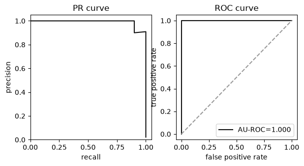
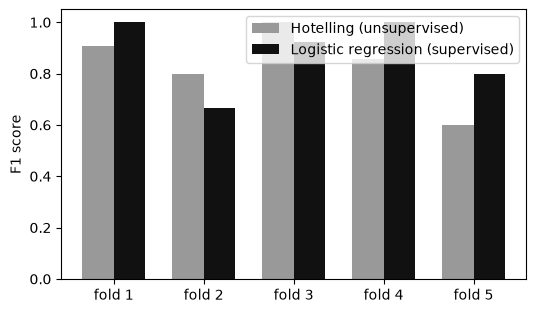

[4편](https://www.mimul.com/blog/anomaly-detection-time-series/)까지는 이상을 판정하는 모델 자체를 다뤘다. 어떤 확률분포를 가정할지, 어떤 거리를 잴지, 무엇을 예측할지가 편마다 바뀌었을 뿐, 모델을 어떻게 데이터에 앉히고 그 결과를 어떻게 믿을지는 다루지 않았다. 실무에서는 모델을 고르는 일 못지않게, 그 모델에 넣을 데이터를 정리하고 모델의 성능을 올바르게 재는 일이 중요하다. 잘못 정리된 데이터는 모델의 판단 근거 자체를 어긋나게 하고, 잘못 잰 성능은 실제로는 쓸모없는 모델을 실전에 올리는 결과로 이어진다. 이 글은 시리즈의 마지막 편으로, 전처리와 성능평가, 교차검증을 다루고, 논문이 정리한 시계열 이상탐지의 벤치마크와 평가지표로 시리즈를 마무리한다.

이상탐지 모델을 실제 시스템에 올리려는 개발자와 데이터 엔지니어를 대상으로 하며, 이 글을 읽고 나면 결측치와 다중공선성을 어떻게 정리할지, 성능을 라벨 예측 정확도와 통계모델 타당성 중 어느 기준으로 잴지, 교차검증에서 왜 계층화가 필요한지 판단할 수 있다. 예제 코드는 [github.com/mimul/anomaly_detection](https://github.com/mimul/anomaly_detection)의 `series05/`에 있고, 1편의 5센서 생산 라인 데이터셋을 그대로 재사용한다.

## 이상탐지 모델에 들어가기 전에 거치는 전처리

1편의 데이터셋은 온도 센서 5개(`temp1`~`temp5`)로 이뤄져 있고, `temp1`은 10%, `temp5`는 5% 확률로 결측이 발생하도록 만들어져 있다. 대부분의 이상탐지 알고리즘은 결측치가 섞인 채로는 학습도 추론도 할 수 없으므로, 결측치를 보완하거나 제외해야 한다. 이상탐지는 정상 데이터를 대량으로 확보할 수 있는 경우가 많다는 특성상, 보완보다는 제외 쪽이 안전한 선택이다. 가장 간단한 제외 방법이 리스트와이즈 삭제(listwise deletion)로, 변수 중 하나라도 결측이 있는 행을 통째로 지운다.

```python
df_dropna = df.dropna()
```

1편에서 만든 학습·추론 데이터를 합친 1530건에 리스트와이즈 삭제를 적용하면 1316건이 남는다. 214건, 전체의 14%가 사라졌다. 모델에 실제로 넣을 변수만 남기고 `dropna(subset=[...])`로 지정하면 불필요하게 지워지는 행을 줄일 수 있다.

결측치를 정리했다면 다음은 변수 선택이다. 변수를 늘릴수록 많은 정보를 활용할 수 있지만, 상관관계가 강한 변수를 그대로 두면 모델의 계수 추정이 불안정해지는 다중공선성(multicollinearity) 문제가 생긴다. 다중공선성을 진단하는 대표적인 지표가 VIF(variance inflation factor)로, 한 변수를 나머지 변수로 예측하는 회귀모델의 결정계수에서 유도한다. 변수 $j$를 나머지 변수들로 회귀했을 때의 결정계수를 $R_j^2$라 하면, VIF는 다음과 같이 정의된다.

$$\text{VIF}_j = \frac{1}{1-R_j^2}$$

값이 클수록 그 변수는 다른 변수로 잘 설명되며, 중복 정보가 많다.

```python
from statsmodels.stats.outliers_influence import variance_inflation_factor

vif = [variance_inflation_factor(X.to_numpy(), i) for i in range(X.shape[1])]
```

`temp1`(1.699), `temp2`(2.288), `temp3`(1.941)는 서로 상관관계를 갖도록 만든 변수라 VIF가 2 안팎으로 나오고, 독립적으로 만든 `temp4`(1.003)와 `temp5`(1.001)는 1에 가깝다. VIF가 10을 넘으면 다중공선성을 의심하는 것이 일반적인 기준인데, 이 데이터셋은 모두 그 아래이므로 변수 선택을 다중공선성 때문에 강제할 필요는 없다.

다중공선성이 없더라도 변수를 줄여야 할 이유는 남는다. 변수가 많을수록 학습에 필요한 샘플 수가 늘어나고(차원의 저주), 결측이 있는 변수를 포함할수록 리스트와이즈 삭제로 줄어드는 샘플 수도 커진다. 변수를 자동으로 골라주는 대표적인 방법이 스텝와이즈(stepwise) 법이고, 그중 빈 모델에서 시작해 성능이 가장 많이 오르는 변수를 하나씩 추가하는 방법이 Forward법이다.

Forward법을 적용하려면 "성능"을 무엇으로 잴지부터 정해야 한다. 여기서 이상탐지 특유의 갈림길이 나온다. 라벨(정상·이상)의 예측 정확도로 잴 수도 있고, 정상 데이터에 대한 통계모델의 적합도로 잴 수도 있다. 두 기준으로 각각 2개씩 변수를 골라보면 어떻게 갈리는지 드러난다.

```python
# F값(라벨 예측 정확도) 기준
f1_selected = forward(f1_for, larger_is_better=True)
# AIC(통계모델 선택의 타당성) 기준
aic_selected = forward(aic_for, larger_is_better=False)
```

F값 기준은 `temp2`, `temp1`을 고른다. 이 데이터셋에서 이상 데이터는 `temp1`~`temp3`의 평균이 어긋나도록 만들어져 있으므로, 정상과 이상을 실제로 구분하는 데 쓸모 있는 변수를 정확히 골라낸다. 반면 AIC 기준은 `temp4`, `temp5`를 고른다. `temp4`와 `temp5`는 서로 독립이라 2차원 정규분포가 아주 깔끔하게 들어맞고, AIC는 이 적합도만 볼 뿐 이상 데이터가 어디 있는지는 전혀 참고하지 않기 때문이다. 실제로 AIC가 고른 두 변수로는 이상을 하나도 잡아내지 못한다. F값이 정확히 0이 나온다. `temp4`, `temp5`는 애초에 이상 데이터를 만들 때 건드리지 않은 변수라, 통계적으로 아무리 잘 맞는 모델을 만들어도 이상과는 무관하기 때문이다.

이 결과가 보여주는 원칙은 명확하다. 통계모델의 적합도는 "정상 데이터를 얼마나 잘 설명하는가"를 재는 지표이지, "정상과 이상을 얼마나 잘 구분하는가"를 재는 지표가 아니다. 라벨이 있는 이상 데이터를 확보할 수 있다면, 변수 선택에는 라벨 기반 지표를 우선해야 한다.

## 이상탐지 모델의 성능을 어떻게 잴 것인가

앞서 나온 두 기준, 라벨의 예측 정확도와 통계모델 선택의 타당성은 변수 선택뿐 아니라 모델 전체의 성능평가에도 그대로 적용된다. 두 갈래는 성격이 다르다.

| | 라벨의 예측 정확도 | 통계모델 선택의 타당성 |
|---|---|---|
| 적용 가능한 모델 | 지도학습, 비지도학습(이상 데이터가 있는 경우) | 비지도학습·통계모델링 |
| 재는 대상 | 라벨의 예측 오차 | 모델이 데이터를 얼마나 잘 설명하는가 |
| 필요한 데이터 | 정상 데이터 + 이상 데이터 | 정상 데이터만 |
| 장점 | 이상과 정상을 구분하는 목적을 직접 평가 | 이상 데이터 없이 계산 가능 |
| 단점 | 이상 데이터가 없으면 계산 불가 | 실제 구분 성능과는 간접적 |
| 대표 지표 | 정확도, 적합률, 재현율, F값, AU-ROC | 로그가능도, AIC, BIC, WAIC |

`temp1`, `temp2` 두 변수로 다변량 홀텔링 모델을 학습해, 추론 데이터에서 두 갈래 지표를 함께 계산해보자. 혼동행렬의 진양성(TP)·위양성(FP)·진음성(TN)·위음성(FN)으로 라벨 기반 지표를 정의하면 다음과 같다.

$$\text{정확도} = \frac{TP+TN}{TP+TN+FP+FN}, \qquad \text{적합률} = \frac{TP}{TP+FP}, \qquad \text{재현율} = \frac{TP}{TP+FN}$$

$$F_1 = \frac{2 \cdot \text{적합률} \cdot \text{재현율}}{\text{적합률}+\text{재현율}}$$

```python
conf_matrix = confusion_matrix(y_true, y_pred, labels=["normal", "anomaly"])
accuracy = accuracy_score(y_true, y_pred)
precision = precision_score(y_true, y_pred, pos_label="anomaly")
recall = recall_score(y_true, y_pred, pos_label="anomaly")
f1 = f1_score(y_true, y_pred, pos_label="anomaly")
fpr, tpr, _ = roc_curve(y_true, score, pos_label="anomaly")
auroc = auc(fpr, tpr)
```

혼동행렬은 `[[449, 1], [1, 9]]`다. 정상 450건 중 449건을 정상으로, 이상 10건 중 9건을 이상으로 올바르게 판정했다. 오탐(FP)과 미탐(FN)이 각각 1건씩이다. 정확도는 0.996으로 매우 높지만, 이는 정상 데이터가 압도적으로 많은 불균형 데이터에서 흔히 나오는 착시이기도 하다. 적합률과 재현율은 각각 0.900, F값은 0.900, AU-ROC는 0.9998이다.



이런 라벨 기반 지표는 실제 프로덕션 시스템에서도 그대로 쓰인다. Netflix는 스트리밍 서비스 사기 탐지에 쓴 딥 오토인코더 모델의 성능을 정확도(약 96%), F값(약 94%)으로 보고했다. Uber는 다차원 시계열 이상탐지 시스템 uVitals에서 정밀도·재현율·F값을 지속적으로 모니터링해 모델을 평가하고, Amazon은 이미지 이상탐지 모델 PatchCore를 산업 결함 탐지 벤치마크(MVTec AD)에서 AUROC 최대 99.6%로 보고했다.

같은 모델의 학습 데이터에 통계모델 지표를 계산하면 로그가능도 -5352.28, AIC 10714.56, BIC 10738.64가 나온다. 로그가능도를 $\ell$, 추정한 파라미터 수를 $k$, 샘플 수를 $n$이라 하면 두 지표는 다음과 같이 정의된다.

$$\text{AIC} = 2k - 2\ell, \qquad \text{BIC} = k\log n - 2\ell$$

다변량 정규분포가 추정하는 파라미터는 평균벡터($M$개)와 대칭행렬인 분산공분산행렬($M(M+1)/2$개)이므로, 변수 개수가 $M$일 때 파라미터 수는 다음과 같다.

$$k = M + \frac{M(M+1)}{2}$$

```python
n_params = n_features + n_features * (n_features + 1) / 2
aic = 2 * n_params - 2 * log_likelihood
bic = np.log(n_samples) * n_params - 2 * log_likelihood
```

AIC와 BIC는 그 자체로는 의미가 없는 숫자다. 같은 데이터, 같은 응답변수에 대해 여러 모델을 견줄 때만 쓸모가 있다. 앞서 변수 선택에서 AIC 기준으로 고른 `temp4`, `temp5` 모델과 F값 기준으로 고른 `temp2`, `temp1` 모델의 AIC를 나란히 놓고 봐야 어느 모델이 정상 데이터에 더 잘 들어맞는지 비교할 수 있다. 라벨의 예측 정확도와 통계모델 선택의 타당성, 이 두 갈래 지표는 1~4편에서 다룬 어떤 모델(교사 없는 확률분포 모델이든, 회귀든, 베이지안 모델이든)에도 그대로 적용된다. 다만 지도학습 모델은 확률분포를 직접 가정하지 않으므로 로그가능도를 정의할 수 없고, 통계모델 선택의 타당성 지표는 계산할 수 없다.

## 교차검증으로 평가를 신뢰할 수 있게 만들기

앞의 성능평가는 학습 데이터와 추론 데이터를 한 번만 나눠 계산했다. 이 한 번의 분할이 우연히 쉬운(혹은 어려운) 데이터로 치우쳤다면, 성능평가 결과도 그만큼 왜곡된다. 데이터를 여러 번 다르게 나눠 학습과 평가를 반복하고 그 결과를 평균 내는 방법이 교차검증(cross-validation)이다. 데이터를 $K$개로 나눠 매번 다른 폴드를 테스트에 쓰는 K-fold가 기본형이다.

이상탐지 데이터에는 K-fold를 그대로 쓰면 곤란한 특성이 있다. 정상 데이터에 비해 이상 데이터가 극단적으로 적은 불균형 데이터라는 점이다. 1편 데이터셋의 정상·이상 데이터를 순서 그대로 5개 폴드로 나누면 어떻게 되는지 확인해보자.

```python
kf = KFold(n_splits=5, shuffle=False)
```

폴드별 이상 데이터 수는 `[0, 0, 0, 20, 10]`이다. 다섯 폴드 중 세 폴드에는 이상 데이터가 단 하나도 없다. 이런 폴드에서는 재현율이나 F값 자체를 정의할 수 없거나, 정의되더라도 그 폴드의 평가가 사실상 무의미해진다. 이 문제를 해결하는 방법이 Stratified K-fold다. 원본 데이터의 정상·이상 비율을 각 폴드 안에서도 그대로 유지하도록 분할한다.

```python
skf = StratifiedKFold(n_splits=5, shuffle=True, random_state=42)
```

같은 데이터에 Stratified K-fold를 적용하면 폴드별 이상 데이터 수가 `[6, 6, 6, 6, 6]`으로 고르게 나뉜다. 정상 데이터와 이상 데이터의 비율이 크게 다른 이상탐지 데이터에서는 Stratified K-fold가 사실상 기본 선택이 된다.

Stratified K-fold로 5겹 교차검증을 실행해, 비지도학습(홀텔링 이론)과 지도학습(로지스틱 회귀)의 성능을 비교해보자.

```python
model = LogisticRegression(penalty=None)
model.fit(X_train, y_train)
```

홀텔링 이론은 F값 0.8332(±0.1339), AU-ROC 0.9925(±0.0095)를, 로지스틱 회귀는 F값 0.8779(±0.1285), AU-ROC 0.9980(±0.0025)를 기록한다.



지도학습인 로지스틱 회귀가 평균적으로 조금 더 높은 분류 성능을 보인다. 이유는 명확하다. 로지스틱 회귀는 정상과 이상을 구분하는 경계 자체를 학습 목표로 삼는 반면, 홀텔링 이론은 목표 오탐률(0.27%)을 지키는 것을 목표로 정상 데이터의 분포만 학습하고 이상 데이터는 학습 과정에 전혀 관여하지 않는다. 판별 성능만 놓고 보면 지도학습이 유리할 수 있다는 뜻이지만, 이는 1편에서 이미 짚은 지도학습의 전제, 즉 라벨이 붙은 이상 데이터를 충분히 확보할 수 있어야 한다는 조건이 성립할 때의 이야기다. 이 목표 오탐률 자체도 1편부터 이 시리즈 전체에서 반복해서 써온 기준이다. 논문 10장에서도 임계값을 정하는 가장 단순한 방법으로 이상 점수의 평균에 표준편차의 3배를 더하는 3시그마 규칙을 언급하는데, 정규분포를 가정했을 때 이 규칙과 시리즈에서 써온 카이제곱 임계값은 같은 목표 오탐률에서 나온 같은 발상이다. $Z=(x-\hat\mu)/\hat\sigma$가 표준정규분포를 따르면 $Z^2$은 자유도 1인 카이제곱분포를 따르므로, 두 임계값은 사실상 같은 수를 가리킨다.

$$P(|Z|>3) \approx 0.0027, \qquad 3^2 = 9 \approx \chi^2_{1}(1-0.0027)$$

이 시리즈에서 목표 오탐률을 줄곧 0.0027로 잡아온 것도 이 3시그마 관행을 그대로 따른 결과다.

## 시계열 이상탐지는 무엇을 기준으로 벤치마크하는가

지금까지의 전처리, 성능평가, 교차검증은 정형 데이터에 국한되지 않는 일반적인 절차다. 반면 4편에서 다룬 시계열 이상탐지는 데이터 자체의 특성 때문에 벤치마크와 평가지표를 별도로 발전시켜왔다. 논문 10장은 시계열 이상탐지 전용 벤치마크를 발표 순서대로 정리한다.

| 벤치마크 | 특징 |
|---|---|
| NAB | 실제·인공 시계열 58개, 스트리밍 데이터의 실시간 탐지에 초점 |
| Yahoo | Yahoo 프로덕션 트래픽 기반 실제·합성 시계열 |
| Exathlon | Apache Spark 클러스터의 대규모 스트림 처리 작업 기록, 고차원 다변량, 설명가능성 중심 |
| KDD21(UCR Anomaly Archive) | 의료·스포츠·우주과학 등 다양한 도메인, 기존 벤치마크의 함정 보완 목적 |
| TODS | 점-전역, 패턴-맥락, 패턴-쉐이플릿, 패턴-계절성, 패턴-추세 5가지 이상 시나리오로 구성된 합성 데이터 |
| TimeEval | 실제·합성, 단변량·다변량, 점·시퀀스 이상 혼합, 정상 대비 이상 비율 0.1 이하로 필터링 |
| TSB-UAD | 단변량 전용, 11가지 변환으로 다양한 이상 유형을 모사한 합성 데이터 포함 |
| TSB-AD | 현재 가장 큰 벤치마크. 정제된 시계열 1000개, 이상탐지 기법 40개를 지속적으로 벤치마킹 |

벤치마크가 이렇게 여러 차례 새로 나온 이유는 앞선 벤치마크의 결함이 계속 드러났기 때문이다. 논문은 기존 벤치마크의 대표적인 결함으로 지나치게 쉬운 문제(triviality), 비현실적인 이상 밀도, 잘못된 정답 라벨, 그리고 설비가 고장 날 때까지 정상 상태만 관측하는 run-to-failure 편향 네 가지를 꼽는다. 한 벤치마크에서 잘 작동하는 모델이 다른 벤치마크에서도 잘 작동한다는 보장은 없으므로, 여러 도메인의 벤치마크에 걸쳐 성능을 확인하는 일이 중요하다.

## 시계열 이상탐지 전용 평가지표

벤치마크로 데이터를 갖췄다면, 그 위에서 모델을 어떻게 채점할지가 남는다. 논문은 평가지표를 임계값이 필요한 것과 필요 없는 것으로 나눈다.

임계값 기반(threshold-based) 평가는 이상 점수에 임계값을 정해 각 시점을 정상·이상으로 나눈 뒤, TP·FP·TN·FN을 세어 정확도, 적합률, 재현율, F값을 계산한다. 앞서 쓴 것과 같은 지표이지만, 시계열에서는 여기에 시간 순서라는 조건이 하나 더 붙는다. 이상 구간 안의 시점 하나만 맞혀도 그 구간 전체를 맞힌 것으로 쳐주는 point adjustment 관행이 널리 쓰이는데, 이 관행이 성능을 실제보다 부풀릴 수 있다는 비판이 있다. 무작위로 매긴 이상 점수조차 point adjustment를 적용하면 그럴듯한 성능으로 보일 수 있다. 이 비판에 대응해 이상 구간의 일정 비율(K%) 이상을 맞혀야 point adjustment를 적용하는 방법, 정답 구간이 시작된 뒤 일정 시점 안에 탐지해야 인정하는 delay-thresholded 방법 같은 보정이 나왔다. 부분열 자체를 단위로 채점하는 range-based F-score도 있다. 구간이 탐지되었는지, 구간 안 몇 개 시점이 탐지되었는지, 구간의 어느 위치가 탐지되었는지, 하나의 실제 이상이 몇 개 조각으로 쪼개져 탐지되었는지를 함께 반영한다.

임계값 독립(threshold-independent) 평가는 가능한 모든 임계값에서의 성능을 요약한다. 가장 널리 쓰이는 것이 ROC 곡선 아래 면적인 AU-ROC와, 정밀도-재현율 곡선 아래 면적인 AU-PR이다. 다만 이 둘은 점 하나하나를 독립된 표본으로 취급하도록 설계돼 있어, 부분열 단위로 나타나는 시계열의 이상에는 그대로 맞지 않는다. Range-AUC는 이상 구간의 경계에 완충 구간을 두어 라벨링의 오차 허용 범위를 반영하도록 ROC·PR 곡선을 확장한 지표이고, VUS(volume under the surface)는 이 완충 구간의 길이를 0부터 특정 값까지 바꿔가며 계산한 Range-AUC를 쌓아 3차원 곡면의 부피로 만든, 완충 구간 길이 설정에서도 자유로운 지표다. 논문은 여러 지표의 강건성과 변별력을 비교한 뒤, VUS-ROC를 가장 권장할 만한 지표로 꼽는다.

## 시리즈 전체 요약

| 편 | 핵심 내용 | 논문 분류체계에서의 위치 |
|---|---|---|
| [1편](https://www.mimul.com/blog/anomaly-detection-basic/) | 지도학습(SVM, 로지스틱 회귀) | 밀도 기반, 분포 기반(One-Class SVM 계열) |
| [2편](https://www.mimul.com/blog/anomaly-detection-unsupervised/) | 비지도학습(홀텔링 이론, 마할라노비스-다구치법, GMM, kNN) | 밀도 기반(분포·인코딩), 거리 기반(근접) |
| [3편](https://www.mimul.com/blog/anomaly-detection-bayesian-regression/) | 회귀, 베이지안 회귀 | 예측 기반, 예측 오차 기반 |
| [4편](https://www.mimul.com/blog/anomaly-detection-time-series/) | 시계열 특화 기법(불일치, 트리, 예측 오차 등) | 거리·밀도·예측 기반 전체 |
| 5편 | 전처리, 성능평가, 교차검증, 벤치마크 | (분류체계를 검증하고 배포하는 절차) |

1편에서는 라벨이 있다는 전제로 지도학습에서 출발했고, 그 전제가 현실에서 자주 무너진다는 한계를 확인하며 2편의 비지도학습으로 넘어갔다. 3편은 입력과 출력이 있는 데이터로 그 비지도학습을 확장했고, 베이지안 추정으로 파라미터의 불확실성까지 반영했다. 4편은 이렇게 쌓아온 기법들을 논문의 프로세스 중심 분류체계 위에 놓고, 시간 순서가 있는 시계열 데이터에만 있는 기법을 정리했다. 그리고 이 마지막 편에서는 어떤 모델을 선택하든 공통으로 거쳐야 하는 절차, 즉 데이터를 정리하고 성능을 재고 그 측정을 신뢰할 수 있게 만드는 방법을 다뤘다.

다섯 편에 걸쳐 반복된 질문은 하나였다. 무엇을 정상으로 볼 것이며, 그로부터의 이탈을 어떻게 측정할 것인가. 확률분포의 밀도로 답하든, 이웃까지의 거리로 답하든, 예측 오차로 답하든, 그 답을 데이터에 앉히고 성능을 올바르게 재는 절차는 다르지 않다. 이 시리즈가 그 질문에 답하는 방법들의 지도를 그리는 데 도움이 되었기를 바란다.

## 참조 사이트

- [Dive into Time-Series Anomaly Detection: A Decade Review](https://arxiv.org/pdf/2412.20512)
- [Machine Learning for Fraud Detection in Streaming Services (Netflix)](https://netflixtechblog.com/machine-learning-for-fraud-detection-in-streaming-services-b0b4ef3be3f6)
- [uVitals - An Anomaly Detection & Alerting System (Uber)](https://www.uber.com/blog/uvitals-an-anomaly-detection-alerting-system/)
- [Towards Total Recall in Industrial Anomaly Detection (PatchCore, Amazon Science)](https://www.amazon.science/code-and-datasets/towards-total-recall-in-industrial-anomaly-detection)
