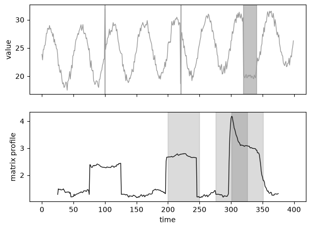
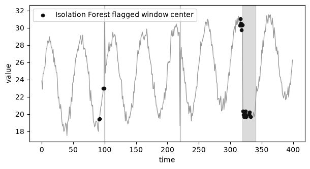
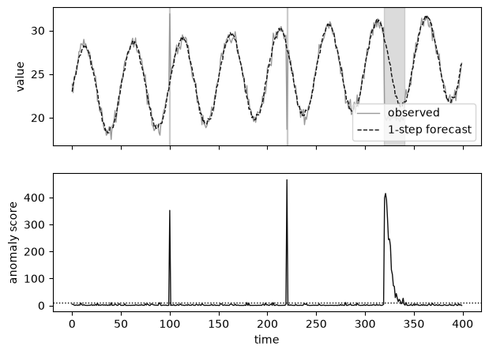

[3편](/blog/anomaly-detection-bayesian-regression/)까지는 정형 데이터, 즉 관측값 사이에 순서가 없는 데이터를 다뤘다. 홀텔링 이론이든 회귀 기반 모델이든, 한 행의 데이터를 다른 행과 독립인 표본으로 보고 그 표본이 정상 분포에서 나올 법한지를 물었다. 시계열 데이터는 다르다. 순서 자체가 정보이므로, 값 하나만 놓고 보면 정상 범위 안에 있어도 그 값이 나온 시점의 맥락과 어긋나면 이상일 수 있고, 값 하나하나는 멀쩡해도 그 값들이 만드는 패턴이 이전에 본 적 없는 모양이면 이상일 수 있다. 이 글은 시계열 이상탐지 방법론을 정리한 논문 "Dive into Time-Series Anomaly Detection: A Decade Review"가 제시하는 프로세스 중심 분류체계를 따라, 1~3편에서 다룬 통계 기법이 이 지도 위 어디에 있는지 다시 확인하고, 시계열에만 있는 기법을 정리한다.

시계열 데이터에 이상탐지를 적용하려는 개발자와 데이터 엔지니어를 대상으로 하며, 이 글을 읽고 나면 거리 기반·밀도 기반·예측 기반 세 갈래가 각각 어떤 메커니즘으로 이상을 판정하는지, 문제 상황에 따라 어떤 갈래를 먼저 시도할지 판단할 수 있다. 세 갈래를 대표하는 기법(불일치 기반 Matrix Profile, 트리 기반 Isolation Forest, 예측 오차 기반 지수평활)은 같은 데이터로 직접 비교한다. 예제 코드는 [github.com/mimul/anomaly_detection](https://github.com/mimul/anomaly_detection)의 `series04/`에 있다.

## 시계열 데이터에서 이상은 무엇을 뜻하는가, 점 이상과 맥락적 이상과 집단적 이상

논문은 시계열의 이상을 세 가지로 정의한다. 점 이상(point anomaly)은 데이터 포인트 하나가 나머지 데이터 대비 뚜렷하게 벗어난 경우로, 값 자체가 정상 범위 밖에 있다. 맥락적 이상(contextual anomaly)은 값 자체는 전역 분포의 정상 범위 안에 있지만, 특정 맥락(예: 시간대나 국소 구간)을 기준으로 보면 그 범위를 벗어난다. 집단적 이상(collective anomaly)은 개별 값은 모두 정상 범위 안에 있어도, 그 값들이 만드는 부분열이 이전에 관측된 적 없는 패턴을 그린다. 논문은 점 이상과 맥락적 이상을 값 하나 단위로 판정한다는 뜻에서 점 기반(point-based) 이상으로, 집단적 이상을 부분열 단위로 판정한다는 뜻에서 시퀀스 기반(sequence-based) 이상으로 묶는다.

세 유형을 한 데이터에서 눈으로 비교할 수 있도록, 계절성과 추세가 있는 합성 시계열을 만들었다. 정상 학습 구간 300개 시점과, 세 이상을 하나씩 심은 추론 구간 400개 시점으로 나눈다. 추론 구간의 상대 시점 100에는 순간적으로 값이 8만큼 튀는 점 이상을, 220에는 전역 범위 안에 있지만 마루여야 할 위상에 골 수준의 값을 끼워 넣은 맥락적 이상을, 320~340 구간에는 계절 패턴이 사라지고 평탄한 잡음으로 바뀌는 집단적 이상을 심었다.

## 프로세스 중심 분류체계, 거리 기반과 밀도 기반과 예측 기반

논문은 알고리즘을 다루는 데이터의 형태나 산출물이 아니라, 이상을 판정하는 처리 과정 자체로 분류한다. 이런 기준을 프로세스 중심(process-centric) 분류체계라 부르고, 크게 세 갈래로 나눈다.

거리 기반(distance-based)은 시계열 값을 가공하지 않고 그대로 쓴다. 두 부분열 사이의 거리(유클리드 거리, z-정규화 거리, DTW 등)를 정의하고, 그 거리가 큰 부분열을 이상으로 본다. 밀도 기반(density-based)은 시계열을 그래프, 트리, 히스토그램, 문법 규칙 같은 더 복잡한 구조로 표현한 다음, 그 구조 위에서 점이나 부분열의 밀도(또는 고립도)를 측정한다. 예측 기반(prediction-based)은 정상 데이터(또는 이상이 거의 없는 데이터)로 모델을 학습해 다음 값을 예측하거나 입력을 복원하고, 그 예측·복원과 실제값의 오차를 이상 점수로 쓴다.

## 1~3편에서 다룬 기법이 이 분류체계 어디에 속하는지

| 편 | 기법 | 분류체계에서의 위치 |
|---|---|---|
| 1편 | SVM(지도학습) | 밀도 기반, 분포 기반(One-Class SVM 계열) |
| 2편 | 홀텔링 이론, 마할라노비스-다구치법 | 밀도 기반, 분포 기반 |
| 2편 | 혼합정규분포모델(GMM) | 밀도 기반, 인코딩 기반 |
| 2편 | 비모수적 kNN | 거리 기반, 근접 기반 |
| 3편 | 선형회귀, 리지회귀, 감마회귀, 베이지안 회귀 | 예측 기반, 예측 오차 기반 |

1~3편에서 다룬 기법은 모두 정형 데이터, 즉 관측값 사이에 시간 순서가 없는 데이터를 대상으로 했다. 그런데 위 표에서 보듯 이 기법들이 쓰는 메커니즘(거리, 분포, 고립도, 예측 오차)은 시계열에도 그대로 적용된다. 다만 시계열은 순서가 있는 데이터이므로, 값 하나가 아니라 부분열을 단위로 거리를 재고 밀도를 추정하고 예측을 한다는 점이 다르다. 아래에서는 거리 기반과 밀도 기반 중 아직 다루지 않은 하위 갈래, 그리고 예측 기반 중 시계열에 특화된 모델을 순서대로 살펴본다.

## 거리 기반 중 시계열에만 있는 기법, 불일치 기반과 클러스터링 기반

2편의 kNN은 부분열이 아니라 관측값 하나하나를 이웃과 비교하는 근접 기반(proximity-based) 방법이었다. 시계열 이상탐지에는 근접 기반과 별도로, 부분열 단위로 이웃 거리를 재는 불일치 기반(discord-based)과, 부분열 공간을 몇 개의 군집으로 나눠 각 부분열이 그 군집에 얼마나 잘 들어맞는지 보는 클러스터링 기반(clustering-based)이 있다.

불일치(discord)는 형식적으로 정의된 개념이다. 길이 ℓ인 모든 부분열 중 자신의 최근접 이웃까지의 거리가 가장 큰 부분열을 discord라 부른다. 이 최근접 이웃 거리를 부분열 시작 위치마다 나열한 시계열이 Matrix Profile이고, discord는 Matrix Profile에서 값이 가장 큰 지점이다. STAMP, STOMP, SCRIMP 같은 알고리즘은 이 Matrix Profile을 빠르게 계산하는 방법을 다루는데, 실무 구현은 고속 푸리에 변환(FFT)을 이용한 MASS 알고리즘으로 부분열 하나당 $O(n \log n)$에 계산한다. 아래 예제는 이 가속 없이 슬라이딩 윈도우 사이의 z-정규화 거리를 직접 계산하는 $O(n^2)$ 구현이다.

```python
def matrix_profile(y, m):
    n_sub = len(y) - m + 1
    subs = np.array([y[i:i + m] for i in range(n_sub)])
    subs_norm = (subs - subs.mean(axis=1, keepdims=True)) / (subs.std(axis=1, keepdims=True) + 1e-8)

    profile = np.full(n_sub, np.inf)
    for i in range(n_sub):
        dists = np.sqrt(((subs_norm - subs_norm[i]) ** 2).sum(axis=1))
        dists[max(0, i - m // 2):min(n_sub, i + m // 2 + 1)] = np.inf  # 자기 자신 근방 제외
        profile[i] = dists.min()
    return profile
```

계절 주기와 같은 길이(창 크기 50)로 Matrix Profile을 계산하면, 값이 가장 큰 상위 3개 부분열은 인덱스 200, 276, 301에서 시작한다. 뒤의 두 개(276, 301)는 집단적 이상 구간(320~340)과 겹치고, 나머지 하나(200)는 맥락적 이상(220)과 겹친다.



반면 점 이상(100)은 상위 3개 안에 들지 않는다. 창 길이 50짜리 부분열 안에서 한 시점만 튀는 값은 z-정규화 이후에도 부분열 전체의 모양을 크게 바꾸지 않기 때문이다. 불일치 기반 방법은 부분열의 형태가 깨지는 변화, 즉 집단적 이상과 맥락적 이상을 잡는 데 강하고, 가장 단순한 형태의 점 이상은 오히려 놓치기 쉽다.

클러스터링 기반 방법(NormA, SAND 등)은 접근이 다르다. 부분열 전체를 몇 개의 대표 패턴(군집)으로 나눠두고, 새 부분열이 어느 군집에도 잘 속하지 않으면 이상으로 판정한다. 불일치 기반이 이웃 하나까지의 거리만 보는 것과 달리, 클러스터링 기반은 정상 패턴들의 전체적인 분포를 먼저 요약해둔다는 점에서 다음에 볼 밀도 기반 방법과 발상이 가깝다.

## 밀도 기반 중 시계열에만 있는 기법, 그래프 기반과 트리 기반

밀도 기반 안에서 2편까지 다룬 분포 기반(홀텔링 이론, 마할라노비스-다구치법)과 인코딩 기반의 일부(GMM)를 제외하면, 그래프 기반과 트리 기반, 그리고 인코딩 기반의 나머지가 남는다.

그래프 기반(graph-based) 방법은 시계열의 부분열을 그래프의 노드로, 부분열 사이의 전이를 에지로 표현한다. 비슷한 부분열을 하나의 노드로 묶고, 어떤 노드의 부분열 다음에 다른 노드의 부분열이 나타난 횟수를 에지 가중치로 쓰는 식이다. 그래프를 만들고 나면 노드의 차수나 에지 가중치처럼 그래프의 특성으로 이상을 판정한다. Series2Graph, DADS가 이 방식을 쓴다.

트리 기반(tree-based)의 대표 기법은 Isolation Forest다. 착안점은 간단하다. 데이터를 무작위로 골라 무작위 분할선으로 계속 이등분하다 보면, 이상치는 정상치보다 적은 횟수의 분할만으로 고립된다. 여러 개의 무작위 분할 트리를 만들고, 각 인스턴스가 트리 루트에서 고립되기까지 필요한 평균 경로 길이가 짧을수록 이상 점수가 높아진다.

Isolation Forest 자체는 시계열의 순서를 직접 다루지 않으므로, 시계열에 적용하려면 부분열을 특징 벡터로 바꾸는 전처리가 필요하다. 아래 예제는 길이 20짜리 슬라이딩 윈도우마다 평균, 표준편차, 범위, 기울기 네 가지 통계량을 뽑아 그 특징 공간에서 Isolation Forest를 학습한다.

```python
from sklearn.ensemble import IsolationForest

def extract_window_features(y, w):
    feats = []
    for i in range(len(y) - w + 1):
        seg = y[i:i + w]
        slope = np.polyfit(np.arange(w), seg, 1)[0]
        feats.append([seg.mean(), seg.std(), seg.max() - seg.min(), slope])
    return np.array(feats)

clf = IsolationForest(n_estimators=200, contamination=0.05, random_state=42)
pred = clf.fit_predict(feats)  # -1: 이상
```

전체 381개 윈도우 중 19개가 이상으로 판정된다.



점 이상(100)과 집단적 이상(320~340)은 잡아내지만, 맥락적 이상(220)은 놓친다. 윈도우 통계량(평균, 표준편차, 범위, 기울기)은 그 윈도우 안의 값 하나가 튀거나 윈도우 전체가 평탄해지는 변화에는 민감하지만, 값 하나가 정상 범위 안에서 위상만 어긋나는 변화에는 둔감하다. 맥락적 이상이 정확히 그런 경우다. 값 자체가 20개짜리 윈도우의 평균과 표준편차를 크게 흔들 만큼 극단적이지 않기 때문이다. 밀도 기반 방법이 시간 순서를 명시적으로 모델링하지 않는다는 특성이 여기서 드러난다.

## 밀도 기반 중 시계열에만 있는 기법, 인코딩 기반

인코딩 기반(encoding-based) 방법은 시계열을 원래 값 그대로 두지 않고 기호나 상태의 나열로 압축한다. 문법 기반(grammar-based) 방법은 시계열을 SAX 같은 방법으로 이산 기호열로 바꾼 뒤, 문법 규칙에 잘 들어맞지 않는 부분을 이상으로 본다(GrammarViz, Ensemble GI). HMM(은닉 마르코프 모델) 기반 방법은 시계열이 몇 개의 은닉 상태 사이를 오간다고 보고, 그 상태 전이 확률이 낮은 구간을 이상으로 판정한다. 베이지안 네트워크 기반 방법(LaserDBN, EDBN)은 변수 사이의 조건부 의존 관계를 그래프로 학습해 같은 방식으로 이상을 판정한다. PCA(주성분분석)도 이 갈래에 속한다. 시계열을 저차원 주성분 공간에 투영한 뒤 원래 공간으로 복원했을 때 오차가 큰 부분을 이상으로 본다. 다만 PCA는 논문의 분류체계에만 등장할 뿐, 이 시리즈가 참고하는 책이나 예제 저장소에는 다루지 않는다.

인코딩 기반이 그래프 기반이나 트리 기반과 겹칠 수 있다는 점도 논문이 밝히는 지점이다. HMM의 상태 전이는 그 자체로 그래프이고, 문법 규칙을 나무 구조로 표현하면 트리 기반과도 맞닿는다. 논문은 이런 중복을 인정하면서도, 기법을 소개할 때는 가장 두드러진 메커니즘 하나로 분류한다.

## 예측 기반의 시계열 특화 모델, 예측 오차 기반과 재구성 오차 기반

3편의 회귀·베이지안 회귀는 입력변수(연식, 주행거리 등)에서 응답변수(가격)를 예측했다. 시계열의 예측 기반 방법은 입력이 다르다. 설명변수 대신 과거 시점의 값들을 입력으로 써서 다음 시점의 값을 예측한다. 이렇게 예측 오차를 이상 점수로 쓰는 갈래가 예측 오차 기반(forecasting-based)이고, 지수평활·ARIMA 같은 고전적 시계열 모델과 LSTM, GRU, Echo State Network, HTM 같은 순환신경망 계열이 여기 속한다. 두 계열의 차이는 다음 값을 어떤 함수로 근사하느냐일 뿐, 과거 값으로 미래 값을 예측하고 그 오차를 본다는 메커니즘은 같다.

아래 예제는 Holt-Winters 지수평활을 정상 학습 구간(300개 시점)에 적합해 평활 계수를 얻은 뒤, 추론 구간(400개 시점)은 한 시점씩 상태를 갱신하며 한 스텝 앞 예측을 만든다. 이상 점수는 3편에서도 썼던 정규화 잔차 제곱이고, 임계값도 같은 목표 오탐률(0.27%)에서 나온 카이제곱 분포 값을 그대로 쓴다.

```python
fit = ExponentialSmoothing(
    train_y, trend="add", seasonal="add", seasonal_periods=m,
    initialization_method="estimated",
).fit()
alpha, beta, gamma = fit.params["smoothing_level"], fit.params["smoothing_trend"], fit.params["smoothing_seasonal"]
sigma = np.std(fit.resid)

level, trend, season = fit.level[-1], fit.trend[-1], list(fit.season[-m:])
for j in range(len(y)):
    k = j % m
    yhat[j] = level + trend + season[k]
    new_level = alpha * (y[j] - season[k]) + (1 - alpha) * (level + trend)
    trend = beta * (new_level - level) + (1 - beta) * trend
    level = new_level
    season[k] = gamma * (y[j] - level) + (1 - gamma) * season[k]

score = ((y - yhat) / sigma) ** 2
```

학습 데이터에 적합한 평활 계수는 alpha, beta, gamma 모두 0.000에 가깝다. 학습 구간이 추세와 계절성만으로 설명되는, 잡음이 적은 데이터이다 보니 지수평활이 매 시점 상태를 새로 갱신하기보다 추세와 계절 성분을 거의 고정한 채 예측하는 쪽을 더 나은 적합으로 판단한 결과다. 임계값은 9.000이고, 전체 400개 시점 중 27개가 이상으로 판정된다.



27건 중 21건이 세 이상 구간(점 이상 1건, 맥락적 이상 1건, 집단적 이상 19건) 안에 들어가고, 나머지 6건은 정상 구간에서 발생한 오탐이다. 세 이상 유형을 모두 잡아낸다는 점이 앞의 두 기법과 다르다. 예측이 그 시점의 추세와 계절 위상을 반영해 나오므로, 값 자체는 전역 범위 안에 있어도 그 시점에 기대되는 값과 다르면 큰 오차로 드러난다. 맥락적 이상을 특히 잘 잡아내는 이유다. 값 하나가 튀는 점 이상도 예측과의 차이가 그대로 드러나므로 잡힌다.

재구성 오차 기반(reconstruction-based)은 예측이 아니라 압축과 복원으로 접근한다. Autoencoder는 부분열을 원래 길이보다 작은 잠재 공간으로 압축했다가 다시 복원하도록 학습되고, 그 복원값과 원래 부분열의 차이(재구성 오차)를 이상 점수로 쓴다. GAN 기반 방법(MAD-GAN, USAD, TAnoGAN)은 정상 부분열만으로 생성자와 판별자를 학습해, 판별자 점수와 재구성 오차를 함께 이상 점수로 결합한다. 예측 오차 기반과 마찬가지로 학습 데이터에 이상이 거의 없다고 가정하므로, 이상이 소수 섞인 준지도 학습 환경에 가장 잘 맞는다.

## 같은 데이터에서 세 갈래 기법이 서로 다른 이상을 잡아내는 이유

| 기법(분류체계 위치) | 점 이상(100) | 맥락적 이상(220) | 집단적 이상(320~340) |
|---|---|---|---|
| Matrix Profile(거리 기반, 불일치 기반) | 놓침 | 잡음 | 잡음 |
| Isolation Forest(밀도 기반, 트리 기반) | 잡음 | 놓침 | 잡음 |
| 지수평활(예측 기반, 예측 오차 기반) | 잡음 | 잡음 | 잡음(19/21) |

세 기법 모두 집단적 이상은 잡아낸다. 20개 시점에 걸쳐 패턴 자체가 바뀌는 변화는 부분열 거리로도, 윈도우 통계량으로도, 예측 오차로도 뚜렷하게 드러날 만큼 크기 때문이다. 반면 점 이상과 맥락적 이상에서는 갈라진다. 불일치 기반은 부분열 단위로 판단하므로 부분열 하나 안의 값 하나가 튀는 정도로는 부분열의 모양이 크게 바뀌지 않아 점 이상을 놓치기 쉽고, 트리 기반은 시간 순서를 명시적으로 쓰지 않으므로 정상 범위 안에서 위상만 어긋나는 맥락적 이상을 놓치기 쉽다. 예측 기반은 그 시점에 기대되는 값을 직접 계산하기 때문에 두 경우 모두 잡아낸다. 다만 이 우위가 공짜는 아니다. 예측 기반은 정상 데이터로 모델을 먼저 학습해야 하고, 학습 데이터에 이상이 섞이면 예측 자체가 왜곡된다는 전제 조건이 붙는다.

## 시계열 이상탐지 연구는 10년간 어떻게 바뀌었는가

논문 9장은 지금까지 다룬 방법들을 발표 연도별로 모아 이 분야가 최근 10년간 어떻게 바뀌었는지 살핀다.

연도별로 발표된 기법 수는 1990년부터 2016년까지 거의 일정하다가 2016년 이후 뚜렷하게 늘어난다. 이 증가를 이끈 것은 대부분 예측 기반, 그중에서도 LSTM과 Autoencoder 기반 기법이다. 2020년부터 2023년 사이에 새로 발표된 기법의 거의 절반이 이 두 계열에 속한다. 컴퓨터 비전에서 딥러닝이 거둔 성과와 TensorFlow, PyTorch 같은 오픈소스 라이브러리 덕에 범용 딥러닝 모델을 시계열에 옮겨 적용하기 쉬워진 점이 원인으로 꼽힌다.

다변량과 단변량의 비중도 뒤집혔다. 1990년부터 2016년 사이에 발표된 기법 대부분은 다변량 시계열을 다뤘지만, 논문이 다루는 최근 3년 구간에서는 단변량을 다루는 기법이 더 많다. 2016년 이전 기법 대부분이 점 이상탐지처럼 다변량에서도 비교적 잘 정의되는 문제를 다뤘다면, 최근에는 다변량에서 정의하기 어려운 부분열(집단적) 이상탐지로 관심이 옮겨가면서 단변량 기법이 늘었다는 것이 논문의 해석이다.

지도 방식의 비중도 바뀌었다. 1980년부터 2000년 사이에 발표된 기법의 65%가 비지도 학습이었던 반면, 2012년부터 2018년 사이에는 그 비중이 50%로 줄었다. 지도 학습이나 준지도 학습을 쓰는 기법이 그만큼 늘었다는 뜻이다.

이 흐름 위에 1~3편에서 다룬 통계 기법을 놓아보면, 회귀와 베이지안 회귀는 예측 오차라는 같은 메커니즘을 딥러닝보다 앞서 통계적으로 정식화한 축에 해당한다. LSTM이나 Autoencoder 기반 기법은 이 메커니즘의 예측 함수 자리를 선형 함수나 지수평활 대신 신경망으로 바꾼 확장이지, 완전히 다른 발상은 아니다.

## 요약

시계열 이상탐지는 논문의 프로세스 중심 분류체계로 보면 거리 기반, 밀도 기반, 예측 기반 세 갈래로 나뉘고, 1~3편에서 다룬 홀텔링 이론·마할라노비스-다구치법·SVM은 밀도 기반의 분포 기반에, GMM은 밀도 기반의 인코딩 기반에, kNN은 거리 기반의 근접 기반에, 회귀와 베이지안 회귀는 예측 기반의 예측 오차 기반에 해당한다. 시계열에만 있는 갈래로는 부분열 단위로 이웃 거리를 재는 불일치 기반과 클러스터링 기반(거리 기반), 그래프·트리·문법·HMM·PCA로 부분열을 재구조화하는 갈래(밀도 기반), 지수평활부터 LSTM까지 아우르는 예측 오차 기반과 Autoencoder·GAN의 재구성 오차 기반(예측 기반)이 있다. 같은 합성 시계열에 Matrix Profile, Isolation Forest, 지수평활을 적용해보면 집단적 이상은 세 기법 모두 잡아내지만, 점 이상과 맥락적 이상에서는 기법마다 놓치는 지점이 갈린다. 예측 기반이 시간 맥락을 직접 계산에 반영하는 만큼 가장 폭넓게 잡아내지만, 정상 데이터로 먼저 학습해야 한다는 전제가 붙는다. 다음 편에서는 이렇게 학습한 모델의 성능을 어떻게 평가하고, 실제 시스템에 적용하기 전에 어떤 전처리를 거쳐야 하는지 정리한다.
