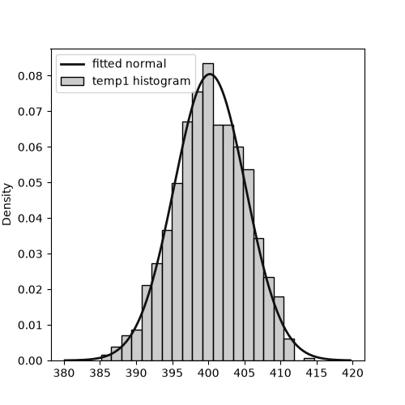
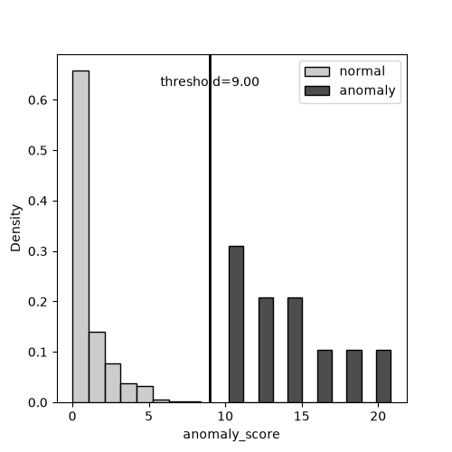
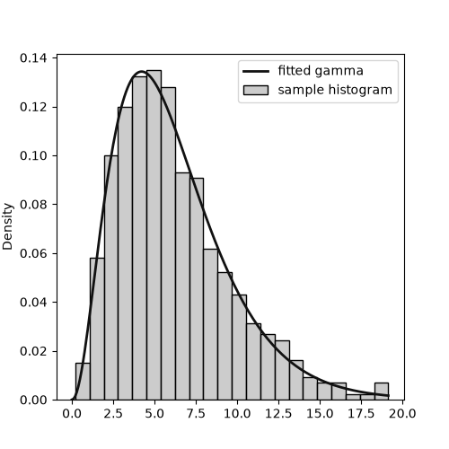
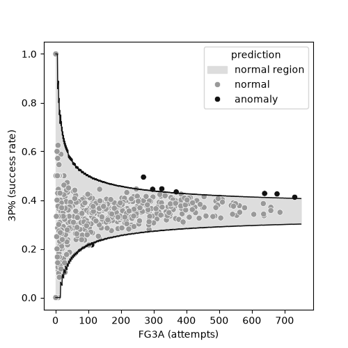
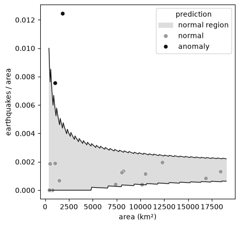
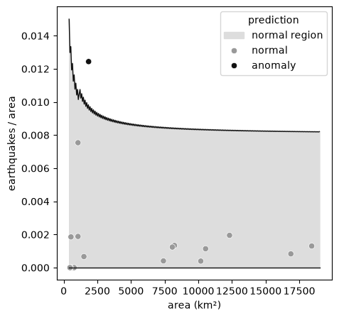
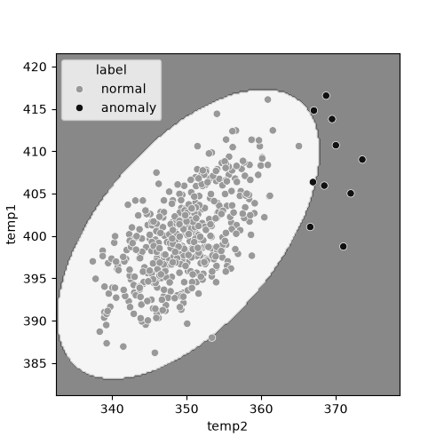
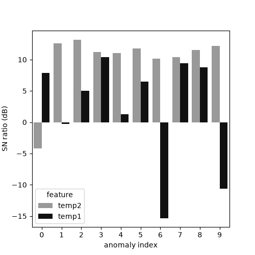
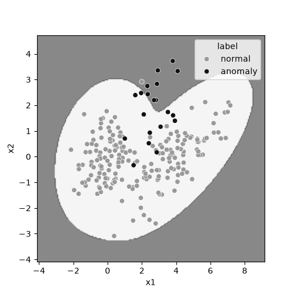
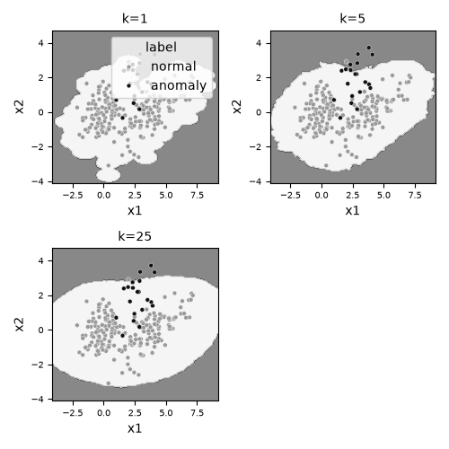

[1편](/blog/anomaly-detection-basic/)에서는 SVM과 로지스틱 회귀로 이상탐지에 접근했다. 두 모델 모두 정상과 이상 라벨이 충분할 때는 잘 동작했지만, 학습 데이터에 없던 새로운 유형의 이상에는 무력하다는 한계가 뚜렷했다. 이 글은 그 한계를 넘어서는 비지도학습 접근을 다룬다. 라벨이 있는 이상 사례에 기대지 않고, 정상 데이터가 형성하는 확률분포만으로 이상을 판정하는 방법이다.

비지도학습 이상탐지를 다루려는 개발자와 데이터 엔지니어를 대상으로 하며, 이 글을 읽고 나면 데이터가 1변량인지 다변량인지, 연속형인지 계수형인지, 정규분포를 따르는지에 따라 어떤 통계 기법을 골라야 하는지 판단할 수 있다. 예제 코드는 [github.com/mimul/anomaly_detection](https://github.com/mimul/anomaly_detection)의 `series02/`에 있다.

## 확률분포로 정상을 모델링하기

비지도학습 이상탐지의 기본 발상은 단순하다. 정상 데이터가 어떤 확률분포를 따른다고 가정하고, 그 분포에 새 관측값을 대입했을 때 나올 확률이 낮을수록 이상에 가깝다고 판정한다. 이 발상을 실행에 옮기려면 먼저 정상 데이터에 확률분포를 맞춰야 하는데, 이 작업을 최우추정(maximum likelihood estimation, MLE)이라 부른다. 최우추정은 주어진 데이터가 나올 가능성(우도)을 가장 크게 만드는 확률분포의 파라미터를 찾는 절차다. 데이터 $x_1, \ldots, x_N$과 확률밀도함수 $p(x;\theta)$가 있을 때, 최우추정은 다음 로그가능도를 최대화하는 파라미터 $\hat{\theta}$를 구하는 것으로 정의된다.

$$\hat{\theta} = \arg\max_{\theta} \sum_{n=1}^{N} \log p(x_n; \theta)$$

정규분포라면 이 최적화 문제가 닫힌 형태로 풀려, 최우추정은 표본평균과 표본분산을 구하는 것과 같아진다.

$$\hat{\mu} = \frac{1}{N}\sum_{n=1}^{N} x_n, \qquad \hat{\sigma}^2 = \frac{1}{N}\sum_{n=1}^{N}(x_n - \hat{\mu})^2$$

1편에서 쓴 생산 라인 데이터의 `temp1` 변수에 정규분포를 최우추정으로 적합하면 다음과 같다.

```python
from scipy import stats

mu, sigma = stats.norm.fit(x)  # mu=400.216, sigma=4.958
```



적합한 정규분포 곡선이 히스토그램의 형태를 잘 따라가는 것을 확인할 수 있다. 이렇게 확률분포 하나를 정상 데이터에 맞추고 나면, 그 분포를 근거로 이상 여부를 판정하는 구체적인 방법이 필요하다. 다음 절부터 이 판정 방법을 하나씩 살펴본다.

## 홀텔링 이론으로 1변량 데이터의 이상을 탐지하기

정상 데이터가 정규분포를 따른다고 가정할 때 가장 널리 쓰이는 판정 방법이 홀텔링 이론이다. 관측값 $x$와 정규분포의 평균 $\hat{\mu}$, 표준편차 $\hat{\sigma}$로 이상 점수를 다음과 같이 정의한다.

$$a(x) = \left(\frac{x - \hat{\mu}}{\hat{\sigma}}\right)^2$$

이 이상 점수가 어떤 분포를 따르는지는 샘플 크기 $N$에 따라 달라진다. $N$이 충분히 크면(대략 100 이상) 이상 점수는 자유도 1인 카이제곱분포에 근사하고, $N$이 작으면 최우추정 자체의 불확실성을 반영해 F분포를 따른다. 실무에서는 대개 샘플 크기가 충분히 크므로, 카이제곱분포 기준으로 임계값을 구하는 코드를 보자.

```python
TARGET_FP_RATE = 0.0027  # 정규분포 3시그마에 해당하는 목표 오탐률
a_th = stats.chi2.ppf(1 - TARGET_FP_RATE, df=1)
```

목표 오탐률(false positive rate)은 정상 데이터를 이상으로 잘못 판정할 확률의 상한이다. 이 값을 낮게 잡을수록 임계값이 높아져 오탐은 줄지만 실제 이상을 놓칠 위험은 늘어난다. `temp2` 변수에 이 방법을 적용하면 임계값은 9.00이 나오고, 추론 데이터 510건 중 10건이 이상으로 판정된다.



정상 데이터의 이상 점수는 0 근처에 몰려 있고, 이상 데이터의 이상 점수는 임계값 9.00을 넘는 쪽에 뚜렷하게 분리되어 있다. 1편의 EDA에서 `temp2`가 정상과 이상을 가장 잘 구분하는 변수였는데, 홀텔링 이론을 적용한 결과도 그 관찰과 일치한다.

## 정규분포를 벗어난 데이터 다루기

홀텔링 이론은 정상 데이터가 정규분포를 따른다는 전제 위에 서 있다. 하지만 실제 데이터는 좌우 비대칭이거나 꼬리가 두꺼운 경우가 많다. 이럴 때는 정규분포 대신 데이터의 형태에 맞는 다른 확률분포를 골라 최우추정을 적용한다. 분포를 고르는 기준은 크게 세 가지다. 봉우리가 몇 개인지, 좌우 대칭인지, 꼬리가 얼마나 두꺼운지다. 좌우 비대칭인 데이터라면 감마분포나 로그정규분포가 유력한 후보가 된다.

형상 파라미터 $k=3$, 척도 파라미터 $\theta=2$인 감마분포에서 뽑은 표본에 감마분포를 최우추정으로 적합해보면, 추정된 파라미터($k$=3.172, $\theta$=1.941)가 원래 값에 가깝게 복원된다. 감마분포의 확률밀도함수는 다음과 같다.

$$p(x; k, \theta) = \frac{1}{\Gamma(k)\,\theta^{k}} x^{k-1} e^{-x/\theta}, \qquad x > 0$$

정규분포와 달리 이 밀도함수의 로그가능도를 최대화하는 $k$, $\theta$는 닫힌 형태의 해가 없어 수치적으로 구해야 한다.

```python
params = stats.gamma.fit(x_train, floc=0)
k, theta = params[0], params[2]
```



정규분포를 가정했다면 좌우 비대칭인 이 데이터의 왼쪽 꼬리와 오른쪽 꼬리에 동일한 이상 점수를 부여했겠지만, 감마분포를 쓰면 실제 분포 형태에 맞는 이상 점수를 얻는다. 이후 임계값을 구하는 절차는 확률밀도의 음의 로그값(음의 로그가능도)을 이상 점수로 삼고, 그 분위점으로 임계값을 정하는 방식으로 홀텔링 이론과 크게 다르지 않다.

## 계수 데이터의 이상을 탐지하기

지금까지는 온도처럼 연속적으로 변하는 데이터를 다뤘다. 그런데 실무에는 셈으로 얻어지는 계수 데이터(count data)도 흔하다. 시도 횟수 중 성공 횟수, 단위 면적당 발생 건수 같은 데이터다. 계수 데이터에는 정규분포 대신 이항분포나 포아송분포를 적용한다.

이항분포는 전체 시도 수 $n$ 중 성공 수 $x$가 어떤 성공 확률 $\mu$를 따를 때 적합하다. 확률질량함수는 다음과 같다.

$$P(x; n, \mu) = \binom{n}{x}\mu^{x}(1-\mu)^{n-x}$$

이 확률질량함수의 로그가능도를 최대화하면, 성공 확률의 최우추정량은 전체 성공 수를 전체 시도 수로 나눈 값으로 닫힌 형태를 갖는다.

$$\hat{\mu} = \frac{\sum_i x_i}{\sum_i n_i}$$

NBA 선수의 시즌별 3점슛 데이터로 이 방법을 시험해본다. 2022시즌 전체 선수의 성공률로 발생률 파라미터를 추정하고, 이 파라미터로 2023시즌 선수들의 성공률이 정상 범위를 벗어나는지 판정한다.

```python
mu = np.sum(x_train) / np.sum(n_train)  # 발생률(성공 확률) 파라미터, 0.3536
th_lower = stats.binom.ppf(TARGET_FP_RATE / 2, n=n_inference, p=mu)
th_upper = stats.binom.ppf(1 - TARGET_FP_RATE / 2, n=n_inference, p=mu)
```



시도 수가 적을수록 정상 범위가 넓어지는 것을 볼 수 있다. 시도가 몇 번 안 되는 상태에서 우연히 성공률이 튀는 것과, 수백 번 시도하고도 성공률이 치우친 것은 통계적으로 다른 무게를 가지기 때문이다. 2023시즌 선수 중 8명이 이 기준으로 이상 판정을 받았다. (데이터 원출처: [NBA.com/stats](https://www.nba.com/stats/players/traditional))

포아송분포는 단위 구간(면적, 시간)당 발생 건수 $x$가 평균 발생률 $\mu$를 따를 때 적합하다. 노출량(면적×기간) $t$가 관측치마다 다르면 기대 발생 건수는 $\lambda = \mu t$가 되고, 확률질량함수는 다음과 같다.

$$P(x; \lambda) = \frac{\lambda^{x} e^{-\lambda}}{x!}$$

최우추정량은 이항분포와 마찬가지로 전체 발생 건수를 전체 노출량으로 나눈 값이다.

$$\hat{\mu} = \frac{\sum_i x_i}{\sum_i t_i}$$

기상청이 공개하는 국내 지진 관측 데이터로 시험해본다. 2020~2023년 데이터로 시도별 면적당 연평균 지진 발생률을 추정하고, 2024년 이후 데이터가 이 기준에서 벗어나는지 판정한다.

```python
mu = np.sum(x_train) / np.sum(t_train)  # 면적·연 단위당 평균 발생 수, 0.000543
th_lower = stats.poisson.ppf(TARGET_FP_RATE / 2, mu=mu * t_test)
th_upper = stats.poisson.ppf(1 - TARGET_FP_RATE / 2, mu=mu * t_test)
```



울산과 제주 두 지역이 이 기준을 벗어나 이상으로 판정됐다. 둘 다 면적이 좁은 지역이라, 절대 건수는 많지 않아도 면적당 밀도로 보면 전국 평균을 크게 웃돈다. (예제: [`series02/count_data.py`](https://github.com/mimul/anomaly_detection/blob/main/series02/count_data.py), 데이터: 기상청 지진 조회 서비스에서 내려받은 국내 지진 관측 자료)

## 분산이 예상보다 큰 계수 데이터 다루기, 과분산

포아송분포에는 평균과 분산이 같다는 전제가 숨어 있다. 그런데 실제 계수 데이터는 평균보다 분산이 훨씬 큰 경우가 잦다. 이를 과분산(overdispersion)이라 부른다. 과분산 상태에서 포아송분포를 그대로 쓰면 정상 범위를 실제보다 좁게 잡아, 정상 데이터를 이상으로 오판하는 경우가 늘어난다.

과분산 여부는 피어슨 카이제곱 통계량을 자유도로 나눈 과분산비로 점검한다. 관측값 $x_i$와 포아송 모델의 기대값 $t_i\hat{\mu}$의 차이를 표준화해 제곱합으로 모으면 피어슨 카이제곱 통계량이 되고, 이를 자유도 $N-1$로 나눈 값이 과분산비다.

$$\chi^2_{\text{Pearson}} = \sum_i \frac{(x_i - t_i\hat{\mu})^2}{t_i\hat{\mu}}, \qquad \text{과분산비} = \frac{\chi^2_{\text{Pearson}}}{N-1}$$

이 값이 1보다 훨씬 크면 과분산을 의심해야 한다.

```python
chi2 = np.sum((x_train - t_train * mu) ** 2 / (t_train * mu))
overdispersion_ratio = chi2 / (len(x_train) - 1)  # 7.76
```

지진 데이터의 과분산비는 7.76으로, 포아송분포의 전제를 크게 벗어난다. 지역마다 지진이 나는 이유(단층대 분포, 해역 인접 여부)가 다르므로, 하나의 평균 발생률로는 지역 간 편차를 다 담아내지 못하는 것이다. 이럴 때는 포아송분포 대신 음이항분포(negative binomial distribution)를 쓴다. 음이항분포는 발생률 자체가 감마분포를 따라 지역마다 다르다고 가정해서, 포아송분포보다 넓은 분산을 표현할 수 있다. 형상 파라미터 $k$와 산포 파라미터 $\theta$로 나타낸 확률질량함수는 다음과 같다.

$$P(x; k, \theta, t) = \binom{x+k-1}{x} p^{k}(1-p)^{x}, \qquad p = \frac{1}{1+\theta t}$$

음이항분포의 파라미터는 이 식에 닫힌 형태의 해가 없어, 다음처럼 음의 로그가능도를 수치 최적화로 최소화해 최우추정한다.

$$\hat{k}, \hat{\theta} = \arg\min_{k,\theta}\left(-\sum_i \log P(x_i; k, \theta, t_i)\right)$$

```python
from scipy.optimize import minimize
from scipy.stats import nbinom

def neg_log_likelihood(params, x, t):
    k, theta = params
    p = 1.0 / (1.0 + theta * t)
    return -nbinom.logpmf(x, n=k, p=p).sum()

result = minimize(neg_log_likelihood, x0=(1.0, mu), args=(x_train, t_train),
                   method="L-BFGS-B", bounds=[(1e-5, None), (1e-5, None)])
```

이 최적화는 초기값에 따라 다른 지역해로 수렴하기 쉬우므로, 실제 코드에서는 여러 초기값으로 시도한 뒤 가장 잘 맞는 결과를 채택한다.



포아송분포를 썼을 때는 울산과 제주 두 지역이 이상으로 판정됐지만, 음이항분포로 바꾸자 제주만 남았다. 울산은 면적이 좁아 포아송분포 기준으로는 이상처럼 보였지만, 지역 간 발생률 편차를 반영하자 정상 범위 안으로 들어왔다. 반면 제주는 과분산을 반영한 뒤에도 여전히 기준을 벗어났는데, 이는 최근 제주 해역의 지진 활동이 늘어난 경향이 통계적 잡음만으로 설명되지 않는다는 뜻이다. 이 결과는 계수 데이터를 다룰 때 분산이 평균과 같다는 전제를 그냥 받아들이지 말고, 먼저 과분산비로 점검해야 한다는 점을 보여준다. 과분산을 무시하면 울산처럼 정상 범위의 편차일 뿐인 지역까지 오탐으로 잡아낼 수 있다.

## 홀텔링 이론을 다변량으로 확장하기

지금까지 다룬 방법은 변수 하나만 봤다. 하지만 변수가 여럿이고 서로 상관관계를 가진다면, 변수를 하나씩 따로 보는 것만으로는 부족하다. 1편의 EDA에서 확인했듯 `temp1`, `temp2`, `temp3`는 서로 상관이 있었다. 홀텔링 이론은 다변량으로도 확장된다. 평균 벡터 $\hat{\boldsymbol{\mu}}$와 분산공분산행렬 $\hat{\Sigma}$로 이상 점수(마할라노비스 거리의 제곱)를 정의한다.

$$a(\mathbf{x}) = (\mathbf{x} - \hat{\boldsymbol{\mu}})^T \hat{\Sigma}^{-1} (\mathbf{x} - \hat{\boldsymbol{\mu}})$$

임계값은 변수 개수 $M$을 자유도로 하는 카이제곱분포에서 구한다.

```python
Sigma_inv = np.linalg.inv(Sigma)
X_dev = X - mu
anomaly_scores = np.sum((X_dev @ Sigma_inv) * X_dev, axis=1)
a_th = stats.chi2.ppf(1 - TARGET_FP_RATE, df=n_features)  # 11.829
```

`temp1`, `temp2` 두 변수로 이 방법을 적용하면 다음과 같은 타원형 결정 경계가 그려진다.



경계가 원이 아니라 타원인 이유는 두 변수의 분산이 다르고 서로 상관관계를 가지기 때문이다. 두 변수를 따로 1변량 홀텔링 이론으로 봤다면 각각 정상 범위 안에 있는 값이라도, 두 변수의 조합이 정상 데이터의 상관 구조에서 벗어난다면 다변량 홀텔링 이론은 이를 이상으로 잡아낸다.

## 다변량 데이터에 마할라노비스-다구치법 적용하기

다변량 홀텔링 이론은 데이터 전체가 이상인지 아닌지는 판정하지만, 어떤 변수가 그 이상에 기여했는지는 알려주지 않는다. 마할라노비스-다구치법(Mahalanobis-Taguchi method)은 이상으로 판정된 데이터에 대해 변수별로 SN비(signal-to-noise ratio)를 계산해 이 문제를 보완한다. MTS 원 논문의 SN비는 여러 이상 샘플에 대한 조화평균을 기반으로 정의되지만, 여기서는 그 발상을 단순화해 변수 $j$의 편차 제곱을 분산으로 나눈 값에 로그를 취해 데시벨 단위로 나타낸다.

$$\eta_j = 10 \log_{10}\frac{(x_j - \hat{\mu}_j)^2}{\hat{\sigma}_j^2}$$

```python
var = np.diag(Sigma)  # 각 변수의 분산
sn_ratio = 10 * np.log10((x_j - mu_j) ** 2 / var_j)
```

SN비가 클수록 그 변수가 정상 범위에서 크게 벗어났다는 뜻이다. 이상으로 판정된 10건에 대해 `temp1`, `temp2` 각각의 SN비를 그려보면 다음과 같다.



대부분의 이상 사례는 `temp2`의 SN비가 `temp1`보다 커서, `temp2`가 이상에 더 크게 기여했음을 보여준다. 이는 1편과 이 글의 홀텔링 1변량 절에서 `temp2`가 정상과 이상을 가장 잘 구분하는 변수였다는 관찰과도 이어진다. 실무에서는 이렇게 변수별 기여도를 분리해두면, 이상이 감지됐을 때 어느 센서나 지표를 먼저 살펴봐야 할지 우선순위를 정할 수 있다.

## 혼합정규분포모델(GMM)로 여러 정상 군집을 반영하기

지금까지 다룬 다변량 기법은 정상 데이터가 하나의 봉우리를 가진 분포를 따른다고 가정했다. 하지만 정상 상태가 여러 개의 군집으로 나뉘는 경우도 있다. 예를 들어 하나의 생산 라인이 두 가지 운전 모드로 번갈아 동작한다면, 정상 데이터는 두 개의 봉우리를 가진다. 혼합정규분포모델(Gaussian mixture model, GMM)은 여러 개의 정규분포를 가중합해 이런 다봉우리 분포를 표현한다. 성분이 $K$개인 GMM의 확률밀도함수는 다음과 같다.

$$p(\mathbf{x}) = \sum_{k=1}^{K} \pi_k \, \mathcal{N}(\mathbf{x}; \boldsymbol{\mu}_k, \Sigma_k), \qquad \sum_{k=1}^{K} \pi_k = 1$$

혼합 비율 $\pi_k$와 각 성분의 평균·분산공분산행렬은 EM 알고리즘으로 최우추정한다. scikit-learn의 `GaussianMixture`로 학습하고, `score_samples` 메서드가 반환하는 로그 확률밀도 $\log p(\mathbf{x})$의 음수를 이상 점수로 삼는다.

```python
from sklearn.mixture import GaussianMixture

gmm = GaussianMixture(n_components=2, random_state=42)
gmm.fit(X_train)
anomaly_scores = -gmm.score_samples(X_inference)
```

두 개의 정상 군집을 가진 합성 데이터에 GMM을 적용하면 다음과 같은 결정 경계가 나온다.



정상 영역이 두 군집을 감싸는 땅콩 모양으로 그려진다. 다변량 홀텔링 이론이었다면 타원 하나로만 정상 영역을 표현했을 텐데, 그 경우 두 군집 사이의 빈 공간까지 정상으로 오판했을 것이다. GMM은 이 빈 공간을 정상 영역에서 제외한다. (예제: [`series02/nonparametric.py`](https://github.com/mimul/anomaly_detection/blob/main/series02/nonparametric.py))

## 분포를 가정하지 않고 이상을 탐지하기, 비모수적 kNN

GMM도 정상 데이터가 정규분포들의 혼합이라는 형태를 가정한다. 이 가정마저 내려놓고 싶다면 비모수적(non-parametric) 방법을 쓴다. k-최근접 이웃(k-nearest neighbors, kNN)은 어떤 확률분포도 가정하지 않고, 각 데이터에서 k번째로 가까운 이웃까지의 거리를 이상 점수로 삼는다. 정상 데이터가 밀집한 영역에서는 이 거리가 짧고, 정상 데이터에서 먼 영역에서는 거리가 길어진다. 코드에서 쓴 민코프스키 거리는 $M$차원 벡터 $\mathbf{x}$, $\mathbf{x}'$ 사이의 거리를 다음과 같이 정의하며, $p=2$면 흔히 쓰는 유클리드 거리가 된다.

$$d(\mathbf{x}, \mathbf{x}') = \left(\sum_{i=1}^{M} |x_i - x_i'|^p\right)^{1/p}$$

```python
from sklearn.neighbors import NearestNeighbors

knn = NearestNeighbors(n_neighbors=k, metric="minkowski")
knn.fit(X_train_std)
distances, _ = knn.kneighbors(X_std)
anomaly_scores = distances[:, -1]  # k번째 이웃까지의 거리
```

k 값에 따라 결정 경계가 어떻게 달라지는지 비교해본다.



k=1일 때는 개별 데이터 하나하나에 민감하게 반응해 경계가 울퉁불퉁하고, k=25일 때는 여러 이웃의 평균적인 밀집도를 보기 때문에 경계가 매끄럽다. 이 양상은 1편에서 본 SVM의 감마 값에 따른 과적합 현상과 같은 원리다. 이웃 수가 적을수록 학습 데이터 하나하나에 맞춰 복잡한 경계가 그려지고, 이웃 수가 많을수록 데이터 전체의 경향을 반영한 완만한 경계가 그려진다. kNN 역시 이웃 수를 교차검증으로 정해야 한다.

## 2편에서 다룬 기법들이 논문의 분류체계에서 차지하는 위치

이 글에서 다룬 기법은 모두 정상 데이터의 확률분포나 밀집도를 직접 추정한다는 공통점을 가진다. 논문 "Dive into Time-Series Anomaly Detection: A Decade Review"의 분류체계에서는 이런 접근을 밀도 기반(density-based) 방법으로 묶는다.

| 이 글의 기법 | 논문의 분류체계에서의 위치 |
|---|---|
| 홀텔링 이론(1변량, 다변량), 마할라노비스-다구치법 | 밀도 기반, 분포 기반 |
| 혼합정규분포모델(GMM) | 밀도 기반, 인코딩 기반 |
| 비모수적 kNN | 거리 기반, 근접 기반 |

홀텔링 이론과 마할라노비스-다구치법은 정상 데이터가 특정 확률분포(정규분포)를 따른다고 명시적으로 가정하므로 분포 기반으로 분류된다. GMM도 확률분포를 가정하지만, 여러 분포의 혼합 비율까지 함께 추정한다는 점에서 데이터를 압축해서 표현하는 인코딩 기반에 가깝다. 반면 kNN은 확률분포를 전혀 가정하지 않고 데이터 사이의 거리만으로 이상을 판정하므로, 밀도 기반이 아니라 거리 기반, 그중에서도 개별 데이터 주변의 밀집도를 보는 근접 기반으로 분류된다. 이 대응 관계는 4편에서 시계열 데이터로 넘어갈 때 다시 짚는다.

## 요약

비지도학습 이상탐지는 정상 데이터에 확률분포나 밀집도 모델을 맞추고, 그 모델에서 벗어난 정도로 이상을 판정한다. 변수가 하나면 정규분포와 홀텔링 이론에서 시작해 데이터 형태에 맞는 다른 확률분포로, 계수 데이터라면 이항분포와 포아송분포로, 그리고 과분산이 있다면 음이항분포로 넘어간다. 변수가 여럿이고 서로 상관관계를 가진다면 다변량 홀텔링 이론과 마할라노비스-다구치법이 그 상관 구조까지 반영한다. 정상 상태가 여러 군집으로 나뉜다면 GMM이, 어떤 확률분포도 가정하고 싶지 않다면 kNN이 대안이 된다. 다음 편에서는 입력과 출력의 관계가 있는 데이터로 넘어가, 회귀와 베이지안 모델링으로 이상을 탐지하는 방법을 다룬다.
