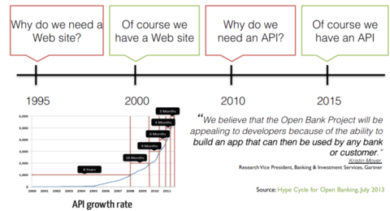
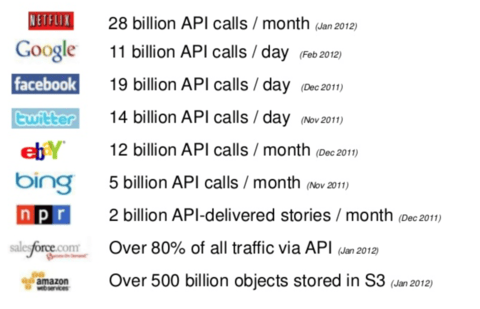
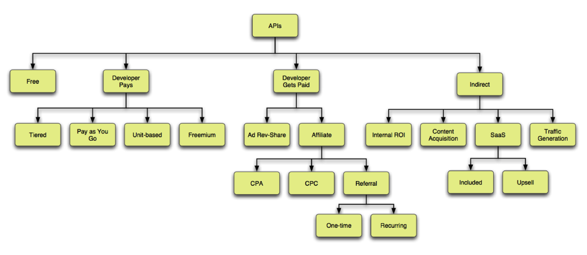

스타트업이 서비스를 만들 때 Twitter, Facebook, Google 등의 API를 이용하는 경우가 많다. 이들 회사는 API를 공개함으로써 거대한 에코시스템을 구축하고 자신의 플랫폼 가치를 높이고 있다.

자사 플랫폼의 가치를 높이면서 더욱 큰 영향력을 발휘하게 해 주는 API 비즈니스 모델을 살펴볼 필요가 있다. 주요 아이디어는 Iansiti(이안시티), Levien(리비안) 교수가 쓴 [The Keystone Advantage](https://www.amazon.com/Keystone-Advantage-Ecosystems-Innovation-Sustainability/dp/1591393078)와 [Programmable Web](https://www.programmableweb.com/news/api-business-models-then-and-now/2011/05/25) 아티클을 참조했다.

## API의 중요성

Programmable Web의 2012년 5월 기준 자료에 따르면, API 1,000개(8년) → API 2,000개(18개월) → API 3,000개(9개월) → API 4,000개(6개월) → API 5,000개(4개월) → API 6,000개(3개월)로, API를 제공하는 업체들이 기하급수적으로 늘고 있다. API는 비즈니스의 영속성을 구가하는 데 중요한 수단이 되었다.

현재 API Billionaires Club에 등록된 업체들을 살펴보면 아래와 같다.

많은 업체들이 여기에 포함되어 있고 앞으로 더 늘어날 것이다. "API=돈"이라는 공식도 자주 발표되고 있고, 전 세계 웹이나 모바일에서 이루어지는 비즈니스의 90%는 이 API를 통해 처리된다고 한다. API는 이제 웹보다 중요하고, 하나의 상품으로 취급되며, 플랫폼의 핵심 요소로 강조되고 있다.

## 에코시스템의 중요성

"에코시스템은 본래 생태계를 가리키는 용어지만, 동·식물의 먹이사슬과 물질 순환 같은 생물 군의 순환 체계라는 원래 뜻에서 전환되어 경제적인 의존 관계와 협력 관계, 또는 강자를 기준으로 한 새로운 성장 분야에서의 피라미드 산업 구조 등 새로운 산업 체계를 구성하는 분야에서 기업 간의 제휴 관계 전체를 가리켜 사용되는 경우가 많다."

최근에는 Twitter, Facebook, Foursquare, Google 등이 API라는 매개체를 통해 다양한 서비스들이 비즈니스 네트워크를 형성하고 있다. 분야도 위치 정보, 마케팅, 소셜 CRM, Rich Media, 검색, 콘텐츠 등 다양하다. 기존에는 오프라인 제휴 연결이 매개체였다면, 최근에는 API라는 매개체를 통해 공생하면서 살아가는 에코시스템을 만드는 형국이다.

기업에 있어서 에코시스템이 중요한 이유는 아래 두 가지로 요약된다.

**1. 비즈니스 환경의 변화**

인터넷의 발달과 소셜 미디어의 보급으로 인해 사람들의 관심은 급속하게 분할되고 시장은 글로벌(하이퍼 로컬 포함) 지향이 되었다. 스마트 디바이스의 진화에 따라 소비자 라이프 스타일이 급변하고 있어, 전통적인 시장조사, 타기팅, 계획, 개발이라는 사이클로는 실시간으로 변화하는 산업 구조를 따라가지 못하고 있다. 이런 불확실성이 높은 환경에서 자체만의 수익을 창출하는 비즈니스 모델로는 한계가 많다는 지적이 제기되고 있다. 대신 자사 중심이 아닌 비즈니스 환경과 공생적인 기업 환경 안에서 에코시스템이 중요하게 부각되고 있다. 이제 경쟁 환경은 서로 연결된 에코시스템 파이 간의 경쟁으로 변화해 가고 있다.

에코시스템을 형성하고 그 가치를 높이는 데 있어 [The Keystone Advantage](https://www.amazon.com/Keystone-Advantage-Ecosystems-Innovation-Sustainability/dp/1591393078)는 키스톤 전략의 중요성을 강조한다.

키스톤 전략은 디지털 생태계 내에서 가치를 창출하고, 창출된 가치를 자사가 속한 사업 영역의 기업들과 공유하여 상생적 협력관계(성장과 번영)를 구축하는 전략이다. Google, Amazon, Microsoft, Apple 등이 이 같은 전략을 통해 성공한 대표적 사례로 꼽힌다.

기업 생태계 멤버 기업들은 이러한 솔루션을 공유할 수 있으므로 꽃을 찾아드는 꿀벌과 같이 수많은 플레이어들이 모여들며 이를 가치 창출의 출발점으로 삼을 수 있다. 동시에 자신들은 허브 기능을 수행하는 중심자 기업(Keystone)으로서 플랫폼 리더십을 바탕으로 건강한 기업 생태계를 설계하고 관리함으로써 고부가가치를 창출한다.

**2. 기술의 변화**

모든 기술(API 등)은 개방화되고 표준화되고 있다. 한 기업의 독점적 기술 시대가 가고 공유 API를 매개로 한 BaaS(Backend as a Service) 시대가 도래했다. SDK(API를 감싸서 컴포넌트화한 것)라는 개발 도구와 프레임워크가 충실해지면서 개발 생산성과 용이성이 현격히 향상되고 있다.

개발자가 아닌 일반 사용자도 쉽게 앱이나 웹을 개발할 수 있는 시대가 오고 있다. 기술(개발과 인프라)에 대한 초기 투자 비용이 낮아지면서 독자 기술로 경쟁 우위를 만드는 것이 어려워졌고, 쉽게 대체 서비스의 위협에 노출되기도 한다. 이러한 위협으로부터 자신의 비즈니스를 보호하기 위해 각각의 서비스가 공생하며 서로의 가치를 높이고 전체 에코시스템으로서 우위를 구축하는 것이 중요해졌다.

과거에 일방향이었던 콘텐츠 제공자 중심의 비즈니스 관행을 깨고 에코시스템을 통해 서로 공생 관계에 있는 틈새(3rd Party) 비즈니스들도 함께 살아가는 환경이 가능해졌다.

## API가 에코시스템에서 하는 역할

[The Keystone Advantage](https://www.amazon.com/Keystone-Advantage-Ecosystems-Innovation-Sustainability/dp/1591393078)에서는 에코시스템의 가치를 높이기 위한 효율적인 Keystone 전략을 두 가지로 요약한다.

**첫째, 디지털 생태계 내에 새로운 가치를 창출하는 일이다.**

Keystone 기업이 가치를 효율적으로 창출하지 못한다면 시스템상의 기업들을 유인하거나 유지할 수 없다. Keystone 기업이 생태계를 위해 가치를 창출할 수 있는 다양한 방법으로 생태계 구성원들에게 서비스(유통), 툴, 새로운 솔루션을 제공할 수 있는 자산인 플랫폼을 구축해야 한다. 여기에 적합한 도구가 바로 API이다.

**둘째, 창출된 가치를 시스템상의 모든 기업들과 공유하는 것이다.**

Keystone 기업은 창출한 가치의 일정 부분을 점유하면서도 생태계에 존재하는 수많은 플랫폼 사용 기업들과 공유하는 것이 필요하다. API를 통해 가치 있는 콘텐츠를 흐르게 해 서로 상생할 수 있는 기회가 된다.

이러한 기업의 에코시스템을 만드는 데 중요한 역할을 하는 것이 API다. 서비스 개발자에게 제공되는 "물건"은 제공자 콘텐츠(= 데이터)이며, 콘텐츠를 꺼내거나 등록하기 위한 창구가 API이다. 과거에는 자사에 국한된 API와 환경 제약이 많았으나, 현재는 OAuth라는 권한 관리 표준 기반에서 안전하게 REST API 방식으로 제공되어 다양한 플랫폼에서 접근 가능한 호환성을 유지하고 있다.

## API 비즈니스 모델 유형

API는 자사가 가진 콘텐츠를 재가공·재사용할 목적으로 서비스 개발자나 3rd Party에게 콘텐츠를 제공함으로써 자사의 서비스 가치를 높이는 사업 모델로서 충분한 가치가 있다. 광고, 라이선스 판매, 제휴, 레버뉴 셰어 등 다양한 Monetization이 가능하다.

Programmable Web에서 발표된 API 비즈니스 모델 유형은 아래와 같다.

**1) Free형**

- Facebook과 같이 무료로 제공해 콘텐츠를 퍼블리싱함으로써 자체 콘텐츠를 강화하거나 트래픽을 유도하는 형태의 모델이다.
- 플랫폼 영향력 확보를 위한 무료 API를 제공하는 서비스들이 해당된다.

**2) Developer Pays형**

- Tiered(단계별): VerticalResponse
- Pay as You Go(종량제): Amazon Web Services
- Unit-based(단위별): Google AdWords
- Freemium(부분 유료): Compete
- Transaction Fee(트랜잭션 과금): PayPal

**3) Developer Gets Paid형**

- AD Rev-Share(광고 수익 배분): Google AdWords
- Affiliate(제휴 - CPA, CPC, Sign-up Referral - One-time, Recurring)
  * CPA: Amazon / CPC: Shopping.com an Ebay Company
  * One-time: JigSaw / Recurring: rdio

**4) Indirect형**

- Content Acquisition(콘텐츠 확보): Ebay
- SaaS(Included, Upsell)
  * Included: freshBooks / Upsell: Salesforce.com
- Content Syndication(콘텐츠 신디케이션): The New York Times
- Internal Use(Consumer facing - Public Web, Mobile/Devices / Internal facing - SOA+, Web/Mobile)
  * Public Web: Twitter / Mobile/Devices: Netflix
  * SOA+: Amazon / Web/Mobile: npr

## 새로운 API 비즈니스 모델 사례

자체 콘텐츠를 가진 서비스에서 파생되는 API가 아닌, API 인프라와 생태계를 관리(계획, 배포, 런칭 등)해 주거나 데이터·콘텐츠·서비스를 보유한 기업이 API를 통해 사업을 영위할 수 있도록 지원하는 API Management형 서비스들이 속속 등장하고 있다. 이 API Management형 서비스는 주로 API보다 비즈니스 역량에 집중할 수 있게 해주고, 서비스와 콘텐츠의 브랜드 인지도를 높이며, 콘텐츠 유통을 활성화한다는 점을 내세워 틈새 시장에 자리를 잡고 있다.

주요 서비스로는 Apigee, Mashery, 3scale, Infochimps, Mashape, Apiary.io, Socrata, Layer 7 Technologies, Atmosphere(SOA) 등이 있다.

아래는 API Management 플랫폼의 필수 구성 요소이니 API 플랫폼을 개발하는 개발자들은 참고하기 바란다.

- API Provisioning
- Metrics and Billing
- Security and Control
- Reporting and Analytics
- Developer Registration and Accounts
- Developer Support

API 플랫폼을 운용하면서 발생할 수 있는 주요 과제로는, 개발자 풀이 충분하지 않다는 점, 개발자들이 API를 활용한 서비스 개발에 의욕적이지 않다는 점 등을 들 수 있다. 이를 극복하려면 먼저 매력적인 콘텐츠를 만들고 개발자들이 쉽게 접근할 수 있는 환경을 갖춰야 한다. API를 제공하고 활용하는 문화가 활성화될수록 더 풍부한 비즈니스로 진화할 수 있다.

## 참고

- [API Business Models: Then and Now](https://www.programmableweb.com/news/api-business-models-then-and-now/2011/05/25)
- [Open APIs What's HOT What's NOT](https://www.slideshare.net/jmusser/j-musser-apishotnotgluecon2012)
- [API Management](https://en.wikipedia.org/wiki/API_management)
- [New API Management Platform Players](http://apievangelist.com/2011/06/17/new-api-management-platform-players/)
- [11 API Management Services](https://www.programmableweb.com/news/11-api-management-services/2011/10/19)
