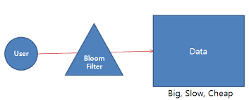
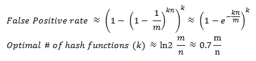
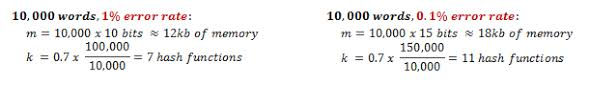

데이터베이스나 캐시 시스템에서 특정 키가 존재하는지 확인할 때, 매번 디스크 I/O를 발생시키는 대신 메모리에서 빠르게 판별할 수 있다면 성능이 크게 향상된다. Bloom Filter는 이 목적에 특화된 확률형 자료구조로, false positive를 일정 수준 허용하는 대신 극히 적은 메모리로 집합 멤버십을 검사한다. 이 글에서는 Bloom Filter의 작동 원리, 수학적 오류율 계산, Java 구현 예, 그리고 Cassandra·HBase 등 실제 시스템에서의 활용까지 다룬다.

#### 개요



블룸필터(Bloom filter)는 1970년도에 Burton H. Bloom이 고안한 것으로 공간 효율적인 probabilistic data structure이며 구성요소가 집합의 구성원인지 점검하는데 사용된다.
False positive들이 가능하며, false negative들은 불가능하다. 요소들은 집합에 추가될 수 있으나 제거는 되지 않는다.
그리고 블룸 필터는 메모리를 좀 더 사용함으로써 자주 호출되는 비싼 함수들의 성능을 크게 향상시키는 방법 중에 하나이다.

#### 구성 요소들과 작동 방식

**1. 구성 요소**

- 해시(hash) 함수 : 해시 알고리즘 구현체.
- Bloom Filter Key : 해시 알고리즘에 의해 반환된 KEY.
- Bloom Filter Index : Bloom Filter Key를 임의의 크기의 비트들의 블록으로 나눈 하나 하나.
- 블룸 필터는 두 가지를 제공 : 하나는 추가하는 add(), 하나는 존재하는지에 대한 isExist().
- false positive : 없는데 있다고 하는 것. false negative : 있는데 없다고 하는 것.

**2. 작동 방식**

예를 들어, m(bloom filter의 bit 사이즈) = 10, k(hashing functions의 수) = 2로하자. 2개의 해시 함수를 h1, h2 하고 Bloom Filter 배열은 아래와 같다.

```text
+-+-+-+-+-+-+-+-+-+-+
|0|0|0|0|0|0|0|0|0|0|
+-+-+-+-+-+-+-+-+-+-+
 0 1 2 3 4 5 6 7 8 9
```

데이터 A를 삽입한다고 가정하면, 데이터 A를 두 해시 함수 h1, h2를 거쳐 해시 값을 계산한다. 만일 3=h1(A), 7=h2(A) 였다고 하자. 이 해시 값 3, 7에 해당하는 곳에 1을 셋팅한다. 이제 배열은 아래와 같아진다.

```text
+-+-+-+-+-+-+-+-+-+-+
|0|0|0|1|0|0|0|1|0|0|
+-+-+-+-+-+-+-+-+-+-+
 0 1 2 3 4 5 6 7 8 9
```

그 다음 데이터 A를 검색한다면, 해시 함수를 거치면 3=h1(A), 7=h2(A)이다. 3, 7에 대응하는 배열을 보면 양쪽 모두 1로 되어 있어서 리턴은 true로 던져질 것이다.

```text
+-+-+-+-+-+-+-+-+-+-+
|0|0|1|1|0|0|0|1|0|0|
+-+-+-+-+-+-+-+-+-+-+
 0 1 2 3 4 5 6 7 8 9
       *       *
```

그 다음 데이터 C를 검사한다면, 해시 함수를 거치면 3=h1(C), 6=h2(C)이다. 그런데 3은 1이나 6이 0이므로 false가 리턴되어 없는 것으로 간주하게 된다.

```text
+-+-+-+-+-+-+-+-+-+-+
|0|0|1|1|0|0|0|1|0|0|
+-+-+-+-+-+-+-+-+-+-+
 0 1 2 3 4 5 6 7 8 9
       *     *
```

이런 형태로 동작하는 방식이다.

Bloom Filter는 기존 hash table의 key-value의 쌍으로 저장하지 않고 hash table상에 키가 존재하는지 안하는지 true, false 정보의 조각(Bit의 Set)이 저장된다고 보면 된다.
즉, 각 Value를 저장하는 대신에 Bloom Filter는 Key가 존재하는 지점(해시 함수에 의해)을 가르키는 Bits의 배열이라고 봐도 된다. 찾는 비트의 조합이 모두 1일 경우 제대로 찾을 확률이 높아진다는 것이다.
Space와 Time을 적절하게 배합하고 고른 분포도를 가지며 Collision을 대처한다면 좋은 이득을 얻을 수 있다.
많은 비트를 할당할수록 성능은 좋을 수 있으나 많은 메모리가 필요하고 해싱 함수를 늘리게 되면 연산이 많아지게 되어 성능은 느리나 메모리를 덜 차지하게 되는 trade-off 관계가 존재한다. Optimizing하는게 관건이다.

#### 수학적 이론

k는 해시 함수의 수, n은 집합에 삽입된 원소의 수, m은 비트 배열의 크기다. false positive 확률 p는 아래 공식으로 계산된다.



비트를 많이 쓸수록(m↑) p가 낮아지고, 원소가 늘어날수록(n↑) p가 높아진다. 해시 함수 수(k)를 최적값으로 설정하면 동일한 m·n에서 p를 최소화할 수 있다. 아래는 10,000단어 사전에서 1% error rate를 목표로 할 때 m = 10,000 × 10 = 100,000, n = 10,000으로 계산한 예다.



10,000단어의 사전에서 0.1%의 에러율을 희망할 경우 18KB의 메모리가 필요하다. 실용적인 수준이다.

#### 구현 예

다음은 Google Guava의 [BloomFilter](https://guava.dev/releases/snapshot-jre/api/docs/com/google/common/hash/BloomFilter.html) 클래스를 사용한 예이다. 소스는 [여기](https://github.com/mimul/algorithm/blob/master/java/src/main/java/com/mimul/bloomfilter/GuavaBloomFilterDemo.java)에 있다.

```java
public class GuavaBloomFilterDemo {  
   public static void main(String[] args) {  
      final int maxInt = 500;  
      final Funnel<Integer> funnel = (Integer x, PrimitiveSink into) -> into.putInt(x);  
      final BloomFilter<Integer> bloomFilter = BloomFilter.create(funnel, maxInt);  
  
      // 0에서 998까지의 짝수를 Bloom Filter 에 추가  
      for (int i = 0; i < maxInt * 2; i += 2) {  
         bloomFilter.put(i);  
      }  
  
      // 998까지 모든 짝수가 positive 임  
      for (int i = 0; i < maxInt * 2; i += 2) {  
         if (!bloomFilter.mightContain(i)) {  
            System.out.printf("%d should be contained.\n", i);  
         }  
      }  
  
      // 1에서 999까지의 홀수로 false positive가 되는 값 추출  
      final Set<Integer> falsePositives = new HashSet<>();  
      for (int i = 1; i < maxInt * 2; i += 2) {  
         if (bloomFilter.mightContain(i)) {  
            falsePositives.add(i);  
         }  
      }  
  
      System.out.printf("예상 false positive 확률: %f\n", bloomFilter.expectedFpp());  
      System.out.printf("실제 false positive 확률: %f\n", (double) falsePositives.size() / maxInt);  
      System.out.printf("false-positive 값: %s", falsePositives);  
   }  
}
```
실행 결과로부터 false negative는 발생하지 않고 2.2%의 확률로 false positive가 발생하고 있는 것을 알 수 있다.

```text
예상 false positive 확률: 0.026961
실제 false positive 확률: 0.022000
false-positive 값: [609, 131, 197, 405, 951, 41, 169, 649, 877, 175, 255]
```

####  활용되는 곳

- 스펠링체크, 사전, 웹 검색, IP Filtering, Router 등에 활용되고 Squid Web, Venti Storage System, SPIN model checker, Google Chrome Browser 등에도 활용되고 있다.
- Cassandra : SSTable 생성시(Index용으로 활용) - Read 성능 향상(Disk IO를 줄임).
  * [SMHasher & MurmurHash hash 함수 사용](https://github.com/aappleby/smhasher)
- HBase : HFile안에 로우와 컬럼이 존재하는 지 검사하기 위해 사용.
- Bigtable : 불필요한 디스크 접근을 피하기 위해.
- Oracle
  * Parallel Join시 Slave간의 communication 데이터량을 줄이기 위해.(10gR2)
  * Join-Filter Pruning 사용시.(11gR1)
  * Result Cache 지원 (11gR1).
- [Guava Bloom Filter](http://code.google.com/p/guava-libraries/issues/detail?id=12)
- pyreBloom = Python + Redis + Bloom Filter
- bloomfilter-rb = Ruby + Redis + Bloom Filter
서버에 설정이 없다면 클라이언트 모듈에 직접 구현해서 사용하는 경우도 많다. 그만큼 성능 이슈가 크기 때문이다.

#### Hash Functions

- [murmur](https://sites.google.com/site/murmurhash/)
- [fnv](http://isthe.com/chongo/tech/comp/fnv/)
- HashMix.
- [Jenkins hash function](http://en.wikipedia.org/wiki/Jenkins_hash_function)
- [MD5](http://en.wikipedia.org/wiki/MD5)
- [SHA1](http://en.wikipedia.org/wiki/SHA-1)

#### 참조 사이트

- [Bloom filter](http://en.wikipedia.org/wiki/Bloom_filter)
- [BloomFilters Paper](http://antognini.ch/papers/BloomFilters20080620.pdf)
- [Scalable Datasets: Bloom Filters in Ruby](http://www.igvita.com/2008/12/27/scalable-datasets-bloom-filters-in-ruby/)
- [Bloom Filters by Example](http://llimllib.github.com/bloomfilter-tutorial/)
