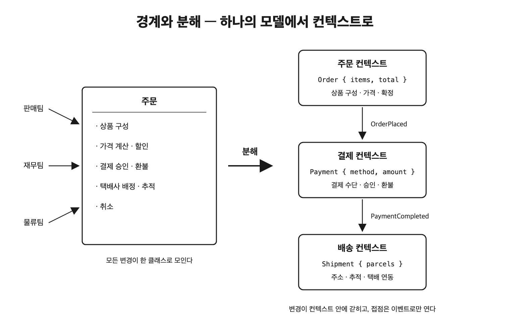
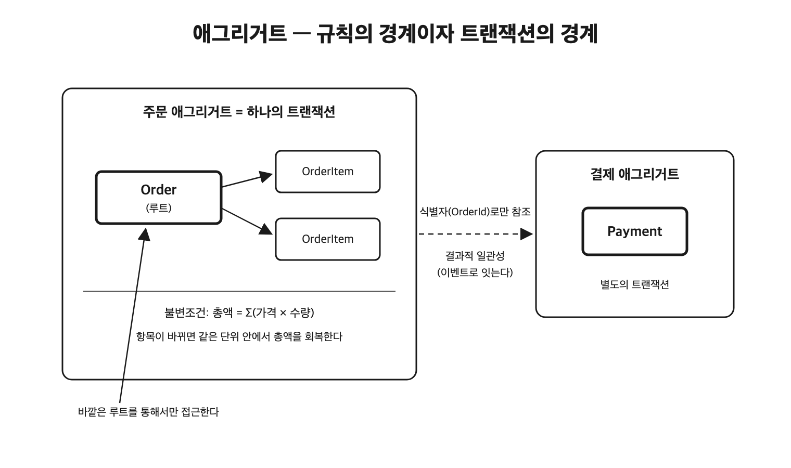

[전편](https://www.mimul.com/blog/model-representation/)에서 추상화로 골라낸 것을 업무의 언어로 정리한 결과물이 모델이고, 모델을 코드와 스키마로 옮겨 적는 일이 표현이라고 정리했다. 그런데 모델을 만들고 옮겨 적는 방법을 알아도 여전히 남는 질문이 있다. 어디까지를 하나의 모델로 볼 것인가. 주문을 클래스 하나로 만들 것인가, 관점마다 따로 둘 것인가. 주문과 결제를 한 트랜잭션으로 묶을 것인가, 떼어 놓을 것인가. 이 질문들은 모두 모델의 크기, 즉 경계를 어디에 그을 것인가라는 하나의 문제로 모인다. 그리고 이 선택의 값은 변경이 일어날 때 치러진다. 잘못 그은 경계는 작은 요구사항 하나가 시스템 곳곳을 건드리게 만들고, 잘 그은 경계는 변경을 한 자리에 가둔다.

이 글은 "현실에서 소프트웨어로 넘어가기 위해 알아야 하는 것들"의 세 번째 글이다. 전편들에서 계속 쓴 노선도에서 출발해, 하나의 모델이 모든 것을 떠안을 때 생기는 일, 경계를 이루는 두 층(언어의 경계인 바운디드 컨텍스트와 규칙의 경계인 애그리거트), 나뉜 경계를 다시 잇는 컨텍스트 맵, 어디에 선을 그을지 판단하는 기준, 그리고 잘못 그어진 경계가 보내는 신호를 살펴본다.

## 노선도는 왜 노선 단위로 그려지는가

[첫 번째 글](https://www.mimul.com/blog/abstraction-meta/)에서 노선도는 경로 안내라는 목적에 맞게 역과 연결만 남긴 추상이라고 했다. 이번에는 노선도가 무엇을 버렸는지가 아니라 무엇을 나눠 놓았는지를 보자. 서울의 전철망은 물리적으로는 선로와 역이 이어진 하나의 그물이지만, 노선도는 그것을 2호선, 신분당선, 경의중앙선 같은 노선 단위로 색을 나눠 그린다. 승객이 전체 망을 하나처럼 쓰는데도 그리는 단위는 노선이다.

왜 노선인가. 노선마다 변경의 이유와 규칙이 다르기 때문이다. 2호선의 배차 간격은 순환선의 수요에서 나오고, 신분당선의 별도 요금은 민자 노선이라는 사정에서 나온다. 운영 주체도 서울교통공사와 신분당선 주식회사로 다르다. 그래서 2호선이 연장되어도 신분당선의 운행 규칙은 바뀌지 않고, 신분당선이 요금을 조정해도 2호선 시간표는 그대로다. 노선이라는 단위는 한 노선의 사정이 다른 노선으로 번지지 않도록, 즉 변경이 그 안에 갇히도록 그어진 선이다.

그렇게 나눠 놓았는데도 전체가 함께 동작하는 이유는 접점이 정해져 있기 때문이다. 노선들은 환승역이라는 합의된 지점에서만 만난다. 환승역이라는 약속만 지켜지면 각 노선은 서로의 차량, 배차, 요금 같은 내부 사정을 몰라도 된다.

이렇게 큰 대상을 변경이 안에 갇히는 단위로 나누는 일이 **분해** 이고, 그 단위가 끝나는 지점, 즉 안과 밖이 갈리는 지점이 **경계** 다. 그리고 경계도 추상화처럼 목적을 따른다. 환승 안내가 목적이면 역이 단위가 되고, 증설과 운영이 목적이면 노선이 단위가 된다. 첫 번째 글에서 목적이 다르면 다른 지도가 나왔듯, 목적이 다르면 같은 대상에 다른 경계가 그어진다.

## 하나의 모델이 모든 것을 떠안으면

이제 업무 시스템으로 오자. 온라인 쇼핑몰의 주문을 생각한다. 주문은 상품으로 구성되고, 결제되고, 배송되고, 때로 취소된다. 이 전부가 주문에 대한 사실이므로, 전부를 하나의 클래스에 두는 설계가 자연스러워 보인다.

```java
class Order {
    OrderId id;
    CustomerId customerId;
    List<OrderItem> items;
    ShippingAddress address;
    PaymentInfo payment;
    TrackingInfo tracking;
    OrderStatus status;

    void addItem(ProductId productId, int quantity) {}   // 상품 구성
    Money calculateTotal() {}                             // 가격 계산
    void applyCoupon(CouponId couponId) {}                // 할인
    void confirmPayment(PaymentResult result) {}          // 결제
    void refund(RefundReason reason) {}                   // 환불
    void assignCourier(CourierId courierId) {}            // 택배사 배정
    void updateTracking(TrackingEvent event) {}           // 배송 추적
    void cancel(CancelReason reason) {}                   // 취소
}
```

이 코드는 동작한다. 문제는 변경이 시작될 때 드러난다. 결제 수단이 추가되어도, 택배사 연동이 바뀌어도, 할인 정책이 바뀌어도 수정할 파일은 이 클래스다. 서로의 업무를 모르는 담당자들이 같은 클래스를 고치므로 충돌과 회귀가 잦아진다. 저장과 잠금의 단위도 이 객체 전체라서, 배송 상태를 갱신하는 트랜잭션과 쿠폰을 적용하는 트랜잭션이 같은 행을 두고 경합한다. 취소 정책 하나를 테스트하려 해도 결제와 배송의 협력 객체까지 채워 넣어야 한다. 전편에서 하나의 타입을 고치게 되는 이유가 여러 개인 것을 모델을 다듬을 신호로 꼽았는데, 이 클래스는 그 신호로 가득하다.

코드보다 깊은 곳에는 언어의 문제가 있다. 마틴 파울러는 어느 전력 회사에서 계량기(meter)라는 한 단어가 전력망과 설치 지점의 연결, 전력망과 고객의 연결, 물리적인 계량기 장치라는 미묘하게 다른 세 의미로 쓰이는 것을 보았다고 전한다. 주문도 같은 다의어다. 판매 담당자에게 주문은 장바구니가 확정된 것이고, 재무 담당자에게는 청구와 정산의 단위이고, 물류 담당자에게는 집품하고 포장해 내보낼 작업 단위다. 하나의 Order 클래스는 이 서로 다른 세 의미를 한 타입에 눌러 담은 것이라서, 어느 담당자가 보아도 필드의 절반은 남의 관심사다. 첫 번째 글에서 배송·정산·재고 관점마다 주문의 타입을 따로 두었을 때 남긴 필드가 서로 겹치지 않았던 것은, 이 세 의미가 실제로 별개의 개념이기 때문이다.

## 바운디드 컨텍스트는 무엇의 경계인가

에릭 에반스는 도메인 주도 설계에서 이 문제에 방향을 뒤집는 답을 내놓았다. 업무 전체를 관통하는 하나의 통일된 모델을 만드는 일은 대규모 시스템에서는 실현 가능하지도 비용 효율적이지도 않으니, 통일을 포기하고 모델이 유효한 범위를 명시적으로 긋자는 것이다. 이 범위가 **바운디드 컨텍스트** 다. 전편에서 하나의 모델과 유비쿼터스 언어가 유효한 경계라고 한 줄로 정리해 두었던 어휘를 여기서 펼친다. 하나의 컨텍스트 안에서는 하나의 용어가 하나의 뜻만 갖고 하나의 모델이 일관되게 유지된다. 그 대신 컨텍스트가 다르면 같은 단어라도 다른 모델이 되는 것을 허용한다.

주문 도메인을 컨텍스트로 나누면 이런 모습이 된다. 주문 컨텍스트는 상품 구성과 가격 계산과 주문 확정을 맡고, 결제 컨텍스트는 결제 수단과 승인과 환불을, 배송 컨텍스트는 주소와 배송 상태 추적과 택배사 연동을, 고객 컨텍스트는 회원 정보와 포인트를 맡는다.



각 컨텍스트는 자신의 관심사만 남긴 자신의 모델을 갖는다.

```java
// 주문 컨텍스트: 무엇을 얼마에 샀는가
class Order {
    OrderId id;
    List<OrderItem> items;
    Money totalAmount;
    OrderStatus status;
}

// 결제 컨텍스트: 돈이 어떻게 움직였는가
class Payment {
    PaymentId id;
    OrderId orderId;
    PaymentMethod method;
    Money amount;
    PaymentStatus status;
}

// 배송 컨텍스트: 어디로 무엇을 보내는가
class Shipment {
    ShipmentId id;
    OrderId orderId;
    Address destination;
    List<Parcel> parcels;
    TrackingStatus status;
}
```

배송 컨텍스트에는 가격이 없고 결제 컨텍스트에는 주소가 없다. 첫 번째 글의 세 record와 같은 모습이지만, 이번에는 타입 세 개를 나눈 것이 아니라 모델과 언어와 코드의 소유권까지 나뉘는 경계라는 점이 다르다. 겹쳐 남은 주문 번호가 보여 주듯, 식별자는 컨텍스트를 가로질러 같은 대상을 가리키지만 모델은 컨텍스트를 가로지르지 않는다. 고객도 마찬가지여서, 고객 컨텍스트의 회원과 주문 컨텍스트의 구매자는 같은 사람의 식별자를 공유할 뿐 필드와 행동이 다른 별개의 모델이다. 컨텍스트가 서면 대화도 정리된다. "주문을 취소하면 어떻게 되나요"라는 질문에 "어느 컨텍스트의 취소인가요"라고 되물을 수 있게 된다. 주문 컨텍스트의 취소는 상품 구성을 무르는 일이고, 결제 컨텍스트의 취소는 승인을 취소하고 환불하는 일이며, 배송 컨텍스트의 취소는 집품을 중단하고 회수하는 일이다. 하나의 cancel 메서드 안에서 상태 분기로 뒤엉켜 있던 세 가지 일이 각자의 자리를 찾는다.

노선도와 포개어 보면 컨텍스트는 노선이다. 노선마다 운영 주체와 변경 이유가 달랐듯 컨텍스트마다 담당 조직과 변경 이유가 다르고, 노선 안에서 차량과 배차 규칙이 일관되듯 컨텍스트 안에서 모델과 언어가 일관된다.

## 컨텍스트 안의 경계는 무엇이 정하는가

컨텍스트로 나눈 뒤에도 질문은 끝나지 않는다. 주문 컨텍스트 안에는 여전히 주문, 주문 항목, 적용된 할인 같은 여러 객체가 있고, 이 중 무엇을 한 덩어리로 읽고 쓰고 잠글 것인지 정해야 한다. 이번 기준은 언어가 아니라 규칙이다. "주문 총액은 항목 가격에 수량을 곱해 합한 값과 같아야 한다"는 규칙은 주문과 주문 항목이 함께 움직여야 지켜진다. 항목이 추가되었는데 총액이 아직 갱신되지 않은 상태가 바깥에서 관측되면, 그 순간의 조회와 결제는 잘못된 금액 위에서 진행된다. 그래서 함께 지켜야 할 불변조건을 공유하는 객체들을 한 단위로 묶고 같은 트랜잭션으로 저장한다. 전편에서 **애그리거트** 라고 이름을 정리해 둔 단위이고, 규칙이 지켜지는 경계이자 트랜잭션의 경계다.

```java
public class Order {
    private final OrderId id;
    private final CustomerId customerId;   // 다른 애그리거트는 식별자로만 참조한다
    private final List<OrderItem> items;
    private Money totalAmount;
    private OrderStatus status;

    public static Order place(CustomerId customerId, List<OrderLine> lines) {
        // 생성 시점부터 불변조건을 만족시킨다 (Always-Valid)
    }

    public void addItem(ProductId productId, Money price, int quantity) {
        ensureModifiable();                // 확정 전에만 구성을 바꿀 수 있다
        items.add(new OrderItem(productId, price, quantity));
        totalAmount = calculateTotal();    // 불변조건을 같은 단위 안에서 회복한다
    }

    public List<OrderItem> items() {
        return List.copyOf(items);         // 내부를 바꿀 수 있는 참조를 내주지 않는다
    }
}
```

코드에서 경계는 두 방향으로 나타난다. 안쪽으로는 OrderItem이 루트인 Order를 거치지 않고는 바뀔 수 없다. 항목 리스트를 그대로 내주면 바깥 코드가 총액 갱신을 건너뛴 채 항목을 추가할 수 있으므로, 복사본만 내주고 변경은 루트의 행동으로만 받는다. 바깥쪽으로는 다른 애그리거트를 객체 참조가 아니라 식별자로 가리킨다. Customer 객체를 통째로 들고 있으면 주문을 읽을 때 고객까지 딸려 오고 주문을 저장할 때 고객의 잠금까지 번져서, 나눠 놓은 경계가 저장소 수준에서 도로 붙어 버린다.

그렇다면 결제는 왜 이 애그리거트에 들어오지 않는가. 주문 항목과 총액 사이에는 한순간도 어긋나면 안 되는 규칙이 있었지만, 주문 확정과 결제 승인 사이에는 그런 규칙이 없다. 주문이 확정되고 몇 초 뒤에 승인이 완료되는 것은 업무가 원래 허용하는 흐름이다. 오히려 결제는 외부 결제 대행사와의 통신을 포함하므로, 한 트랜잭션으로 묶으면 외부 응답을 기다리는 동안 주문 데이터가 잠긴 채로 남는다. 그래서 결제는 별도의 애그리거트가 되고, 두 애그리거트 사이는 결과적 일관성(잠시 어긋나는 것을 허용하되 결국 맞춰지는 일관성)으로 이어진다. 주문이 확정되었다는 사실이 먼저 확정되고, 결제의 결과는 그 사실을 따라와 반영된다.



애그리거트의 크기를 가르는 질문도 여기서 나온다. 두 데이터가 어긋난 상태가 한순간이라도 관측되면 업무가 잘못되는가. 그렇다면 같은 애그리거트다. 잠시 어긋나도 곧 따라잡으면 되는가. 그렇다면 다른 애그리거트로 두고 이벤트로 잇는다. 주의할 점은 이것이 기술 질문이 아니라 업무 질문이라는 것이다. "결제 완료와 포인트 적립 사이에 몇 초의 차이가 나도 되는가"에 답할 수 있는 사람은 개발자가 아니라 업무 담당자다.

이 질문을 어디에 던질지 찾는 방법도 트랜잭션에서 출발한다. 관련 있어 보이는 객체들을 골라 애그리거트라고 이름 붙이는 식은 통하지 않는다. 대신 그 도메인에서 가장 자주 일어나는 작업들을 나열하고, 각 작업이 어떤 객체들을 함께 바꾸는지 관찰한다. 항목 추가와 총액 갱신처럼 늘 함께 바뀌는 것들이 한 애그리거트의 후보가 되고, 함께 바뀌는 일이 없는 것들은 경계 밖에 남는다.

## 나눈 경계를 다시 잇는 방법

경계를 그었으면 넘는 방법을 정해야 한다. 주문이 확정되면 결제가 시작되어야 하고, 결제가 완료되면 배송이 준비되어야 한다. 연결이 필요하다는 사실은 분해의 실패가 아니라 전제다. 노선을 나눴기 때문에 환승역이 필요해진 것과 같다. 문제는 연결의 방식이다. 배송 컨텍스트가 주문 컨텍스트의 테이블을 직접 조회하는 순간 두 컨텍스트는 스키마 수준에서 결합해서, 주문 쪽이 컬럼 하나를 바꾸면 배송이 깨진다. 경계를 유지하려면 접점을 명시적으로 설계해야 하고, 컨텍스트들 사이의 접점과 관계를 그려 놓은 것을 **컨텍스트 맵** 이라 부른다. 관계에는 이름 붙은 패턴이 몇 가지 있다.

**Customer-Supplier**: 한 컨텍스트가 다른 컨텍스트가 제공하는 것에 의존하고, 공급자 쪽이 소비자 쪽의 요구를 계획에 반영해 주는 관계다. 주문 컨텍스트는 결제 컨텍스트가 승인 결과를 알려 줘야 다음으로 진행할 수 있으므로 결제의 고객이 된다. 이 관계가 명시되면 결제 팀이 인터페이스를 바꿀 때 주문 팀을 고려해야 한다는 것이 조직의 합의가 된다.

**Published Language**: 컨텍스트가 내부 모델을 그대로 노출하는 대신, 바깥에 공개할 전용 언어를 정해 두는 방식이다. "주문이 확정되었다(OrderPlaced)" 같은 도메인 이벤트에 주문 번호, 금액, 배송지처럼 바깥이 필요로 하는 정보만 담아 발행하면, 구독하는 컨텍스트들은 주문 컨텍스트의 내부 구조를 모른 채 각자의 일을 시작할 수 있다. 전편에서 경계 밖으로 공개된 표현은 영향 범위가 보이지 않아 바꾸기 어렵다고 했는데, 공개할 것을 이벤트로 좁혀 두면 바꾸기 어려운 면적 자체가 줄어든다.

**Anti-Corruption Layer**: 상대의 모델이 내 모델로 스며드는 것을 막는 번역 계층이다. 배송 컨텍스트가 외부 택배사 API와 연동한다고 하자. 택배사의 응답에는 그쪽 사정으로 정해진 상태 코드와 필드가 가득하다. 이것을 그대로 배송 모델에 저장하면 택배사의 모델이 우리 모델이 되어 버려서, 택배사를 바꾸는 일이 도메인을 고치는 일이 된다.

```java
// 배송 컨텍스트의 Anti-Corruption Layer: 택배사의 모델을 우리 모델로 번역한다
class CourierTrackingAdapter implements TrackingProvider {
    @Override
    public TrackingStatus fetch(TrackingNumber number) {
        CourierApiResponse response = courierClient.status(number.value());
        return translate(response.statusCode());  // "05" → TrackingStatus.OUT_FOR_DELIVERY
    }
}
```

번역을 이 어댑터 한 곳에 모아 두면 택배사 교체는 어댑터 교체로 끝난다. 전편에서 인코딩이 모델을 침식하는 예를 보았는데, Anti-Corruption Layer는 외부 시스템이라는 인코딩의 사정이 모델을 침식하지 못하게 두는 방벽이다.

마지막으로 짚을 것은 컨텍스트 경계가 배포 단위와 같지 않다는 점이다. 컨텍스트마다 별도의 서비스를 세우는 마이크로서비스는 여러 구현 중 하나일 뿐이다. 반대 방향도 일대일이 아니어서, 하나의 컨텍스트가 API 서버와 비동기 작업자처럼 여러 물리 서비스로 이루어지면서 하나의 도메인 모델을 공유하기도 한다. 하나의 애플리케이션 안에서 패키지로 나누고 접점을 인터페이스로 제한할 수도 있고, 컨텍스트를 빌드 모듈(Gradle 모듈) 단위로 두어 컴파일 의존성으로 경계를 강제할 수도 있다. 어느 형태든 지켜야 할 규율은 같다. 데이터 저장소를 컨텍스트끼리 공유하지 않고(최소한 스키마는 분리한다), 접점은 명시적인 인터페이스나 이벤트로만 연다. 경계는 논리적 규율이 먼저고, 물리적 분리는 그 규율을 강제하는 수단이다.

## 어디에 선을 그을 것인가

지금까지 경계의 두 층과 잇는 방법을 보았다. 남은 것은 실제로 선을 긋는 판단이다. 정답을 계산해 주는 공식은 없지만, 후보 경계를 평가하는 질문은 있다.

**변경의 이유**: 무엇이 함께 바뀌는가. 같은 이유로 함께 바뀌는 것은 한 단위에 두고, 다른 이유로 바뀌는 것은 나눈다(패키지 설계에서 공통 폐쇄 원칙이라 부르는 기준이다). 이것은 추측이 아니라 조사할 수 있다. 최근의 요구사항들이 각각 어떤 코드를 함께 고치게 했는지 변경 이력을 보면, 함께 움직이는 덩어리와 우연히 붙어 있는 덩어리가 구분된다.

**불변조건의 범위**: 무엇이 같은 순간에 참이어야 하는가. 불변조건이 걸치는 범위가 애그리거트의 크기를 정한다. 앞 절에서 본 대로 이것은 업무 담당자에게 물어야 할 질문이다.

**언어의 충돌**: 같은 말이 다른 뜻으로 쓰이는가. 언어 충돌은 컨텍스트 경계의 가장 믿을 만한 신호다. 회의에서 "그 주문은 그 주문이 아니고요"라는 말이 나온다면 그 자리에 경계 후보가 있다. 거꾸로 두 팀이 같은 용어를 같은 뜻으로 쓰고 있다면 그 사이에 경계를 세울 근거는 약해진다.

**팀의 경계**: 시스템 경계가 팀 경계와 맞는가. 멜빈 콘웨이는 시스템을 설계하는 조직이 조직의 커뮤니케이션 구조를 복제한 설계를 내놓는다고 관찰했다(콘웨이의 법칙). 매일 대화하는 동료의 코드와는 암묵적 가정까지 공유하며 촘촘히 결합하기 쉽고, 소통 비용이 높은 팀의 코드와는 자연히 느슨해지기 때문이다. 그래서 시스템 경계가 팀 경계와 어긋나면 시스템 쪽이 팀 쪽으로 끌려간다. 이 힘을 역이용해 원하는 시스템 경계에 맞춰 팀을 먼저 재편하는 접근을 역콘웨이 전략이라 부른다. 다만 조직도만 바꾼다고 이미 굳은 코드 구조가 따라 바뀌지는 않으므로, 팀 재편과 코드의 점진적 분리는 함께 진행해야 한다.

**부하(load)의 성격**: 시스템이 감당하는 요청의 종류와 몰리는 시기가 갈라지는가. 배송 조회는 고객이 하루에도 몇 번씩 여는 화면이라 읽기가 압도적으로 많지만, 데이터를 바꾸지 않으므로 캐시나 읽기 전용 복제본으로 값싸게 감당할 수 있다. 주문 확정은 요청 수는 그보다 훨씬 적어도 재고 차감과 총액 계산이 정확히 한 번씩 일어나야 하므로 쓰기의 정합이 생명이고, 캐시로 때울 수 없다. 부하가 몰리는 시기도 다르다. 배송 조회는 명절 배송 대란에 폭증하고, 주문 확정은 선착순 세일이 열리는 순간에 폭증한다. 이 둘이 한 배포 단위에 묶여 있으면 조회 트래픽에 대응하려고 주문 처리 로직까지 통째로 증설해야 하고, 조회 폭주가 같은 프로세스의 쓰기 성능을 끌어내리기도 한다. 그래서 부하의 종류와 몰리는 시기가 다른 부분은 따로 배포하고 따로 확장할 수 있게 나눌 후보가 된다. 조회 모델을 명령 모델에서 분리해 각각 따로 확장하는 CQRS가 이 신호에 대한 대표적인 응답이다.

여기에 더해 실무적인 기준이 하나 더 있다. 어떤 일이 그 도메인을 통해서만 일어날 수 있게 경계를 긋는 것이다. 대출 한도의 잔액 변경이 한도 도메인 바깥에서도 가능하다면 유효성 검증과 변경 이력 기록이 어딘가에서 누락될 수 있으므로, 잔액 변경이라는 능력 자체를 한도 도메인이 독점하게 경계를 긋는다. 경계를 책임의 독점으로 정의하는 이 관점은 정보 은닉의 출발점이기도 하다.

이 기준들이 항상 같은 답을 내지는 않는다. 언어로는 한 컨텍스트인데 부하 특성은 갈라지기도 하고, 팀 구조가 도메인 경계와 어긋나 있기도 하다. 기준이 충돌할 때 나는 언어와 불변조건을 먼저 따른다. 이 둘은 업무 자체에서 나오는 기준이라 잘 바뀌지 않는 반면, 팀 구성과 부하는 상황에서 나오는 기준이라 조직 개편이나 트래픽 변화로 달라지기 때문이다. 업무에서 나온 기준으로 경계의 후보를 긋고, 상황에서 나온 기준으로 그 후보를 조정하는 순서가 안전하다.

## 잘못 그은 경계가 보내는 신호

경계를 한 번에 맞출 수는 없으므로, 그어 놓은 경계가 잘못되었음을 알리는 신호를 알아 두는 쪽이 실용적이다. 신호는 두 방향에서 온다. 경계가 너무 크다는 신호는 앞에서 본 거대 Order 클래스의 증상들이다.

- 클래스의 public 메서드가 계속 늘고, 서로 다른 담당자의 요구가 한 클래스로 모인다.
- 하나의 유스케이스가 여러 애그리거트를 같은 트랜잭션에서 수정한다. 불변조건이 걸치지 않은 것들을 굳이 함께 잠그고 있다는 뜻이다.
- 같은 상태 필드에 대한 분기가 메서드마다 반복된다. 전편에서 본 대로 하나의 타입에 별개의 개념이 눌러 담겨 있다는 신호이고, 그 개념들이 각자 다른 컨텍스트의 관심사라면 타입 분리를 넘어 경계 분리의 신호다.
- 테스트를 만들 때 검증하려는 규칙과 무관한 협력 객체의 모의 객체가 줄줄이 필요하다.

반대로 경계가 너무 잘거나 잘못된 자리에 있다는 신호도 있다.

- 기능 하나를 추가하는데 여러 컨텍스트를 동시에 고치고 동시에 배포해야 한다. 독립 변경과 독립 배포라는 분리의 이득은 없이 경계를 넘는 호출과 배포 조율이라는 분리의 비용만 치르는 상태로, 분산 모놀리스라 불린다.
- 한 요청을 처리하는 동안 컨텍스트 사이를 여러 번 왕복한다. 대화가 수다스럽다는 것은 함께 있어야 할 것이 떨어져 있다는 뜻이다.
- 애그리거트 하나를 저장한 직후 같은 요청 안에서 다른 애그리거트를 갱신하며 둘의 정합을 코드로 맞추고 있다. 결과적 일관성을 허용하지 못하고 있다면 애초에 한 애그리거트였을 가능성이 높다.

잘못된 축의 분해도 있다. 컨트롤러 계층, 서비스 계층, 저장소 계층으로 팀과 패키지를 나누는 기술 축의 분해가 그 예다. 계층 분리 자체는 전편에서 본 대로 필요한 일이지만, 그것을 시스템의 최상위 경계로 삼으면 기능 하나를 추가할 때마다 변경이 모든 계층을 관통한다. 나누기는 했지만 변경이 어디에도 갇히지 않으므로, 이 글의 정의로는 분해일 뿐 경계가 아니다.

이 신호들이 알려 주는 대로 경계는 옮겨진다. 도메인 이해가 깊어져야 언어 충돌이 드러나고, 시스템이 자라야 어느 컨텍스트가 과성장했는지 보이기 때문에, 처음 그은 경계가 끝까지 유지되는 경우가 오히려 드물다. 그래서 나는 확신이 없는 경계일수록 컨텍스트는 크게 시작하되 애그리거트의 규율은 처음부터 지키는 쪽을 택한다. 한 애플리케이션 안에서 모듈을 쪼개는 일은 코드 이동으로 끝나지만, 잘못 나눈 서비스를 다시 합치는 일은 네트워크 호출과 중복 데이터와 배포 파이프라인을 되감는 일이라 비용이 비대칭적이기 때문이다. 모놀리스 안에서 경계의 규율을 지키며 검증하다가, 독립 배포나 독립 확장의 필요가 실제로 생긴 컨텍스트만 떼어 낸다.

## 요약

추상화가 목적에 맞게 골라내는 일이고 모델이 골라낸 것을 업무의 언어로 정리한 결과라면, 경계는 그 모델이 어디서 끝나는지 정하는 일이고 분해는 변경이 안에 갇히는 단위로 시스템을 나누는 일이다. 경계는 두 층으로 그어진다. 언어가 유효한 범위가 바운디드 컨텍스트가 되고, 불변조건이 같은 순간에 지켜져야 하는 범위가 애그리거트가 된다. 나뉜 컨텍스트는 저장소를 공유하지 않고, Customer-Supplier와 Published Language, Anti-Corruption Layer 같은 컨텍스트 맵의 관계로만 잇는다. 선을 긋는 판단에는 변경의 이유, 불변조건의 범위, 언어의 충돌, 팀의 경계, 부하(load)의 성격이라는 질문을 쓰되, 업무에서 나온 기준을 먼저 따르고 상황에서 나온 기준으로 조정한다. 그리고 처음 그은 경계는 한 클래스로 모이는 요구, 한 트랜잭션에 묶이는 애그리거트, 동시에 수정되는 컨텍스트 같은 신호를 따라 계속 옮겨진다. 경계 긋기는 설계 초기의 행사가 아니라, 모델 다듬기와 같은 비중으로 반복되는 작업이다.

## 참조 사이트

- [도메인 주도 설계](https://product.kyobobook.co.kr/detail/S000001514402)
- [BoundedContext](https://martinfowler.com/bliki/BoundedContext.html)
- [D D D_ Aggregate](https://martinfowler.com/bliki/DDD_Aggregate.html)
- [CQRS](https://martinfowler.com/bliki/CQRS.html)
- [ConwaysLaw](https://martinfowler.com/bliki/ConwaysLaw.html)
- [Refactoring Overgrown Bounded Contexts in Modular Monoliths](https://milanjovanovic.tech/blog/refactoring-overgrown-bounded-contexts-in-modular-monoliths)
- [Effective Aggregate Design](https://www.dddcommunity.org/library/vernon_2011/)
- [Design a microservice domain model](https://learn.microsoft.com/en-us/dotnet/architecture/microservices/microservice-ddd-cqrs-patterns/microservice-domain-model)
