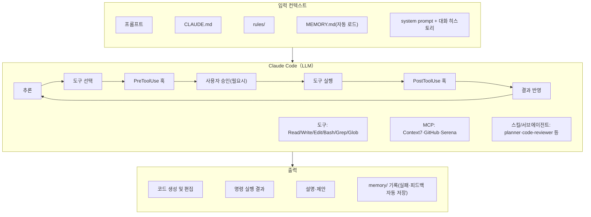

이 글은 Claude Code를 실무에 도입하면서 정리한 설정 방법과 코드 리뷰 자동화 경험을 담고 있다. Claude Code를 처음 설정하거나 AI 기반 코드 리뷰 자동화에 관심 있는 개발자를 대상으로 한다.

글의 구성은 설정 구조 파악 → 코드 리뷰 자동화 적용 → 실패 학습 루프 구현 순이다. 설정을 먼저 이해하면 코드 리뷰 프로세스 전체 흐름을 훨씬 빠르게 파악할 수 있어 그 순서로 설명한다.

예시에 사용된 프로젝트는 Rust 프로젝트다. 설정 부분에 Rust 코딩 가이드가 일부 포함되어 있으나, Rust를 몰라도 전체 흐름을 이해하는 데 문제없다.

## Claude 설정 파일

[Claude Code Docs](https://code.claude.com/docs/en/overview)의 내용을 스터디한 결과와 Claude와 내가 대화를 통해 정리한 내용, 실제 프로젝트에 운영한 경험을 녹여 기술했다.

### 전체 설정 파일

**1.  전체 계층 구조**

|기능|사용자 위치|프로젝트 위치|로컬 위치|
|---|---|---|---|
|**CLAUDE.md**|`~/.claude/CLAUDE.md`|`CLAUDE.md` 또는 `.claude/CLAUDE.md`|`CLAUDE.local.md`|
|**Settings**|`~/.claude/settings.json`|`.claude/settings.json`|`.claude/settings.local.json`|
|**Subagents**|`~/.claude/agents/`|`.claude/agents/`|—|
|**MCP servers**|`~/.claude.json`|`.mcp.json`|`.claude/settings.local.json`|
|**Plugins**|`~/.claude/settings.json`|`.claude/settings.json`|`.claude/settings.local.json`|


```
.claude/
├── settings.json        # 프로젝트 설정
├── settings.local.json  # 로컬 설정（.gitignore）
├── rules/               # 프로젝트 규칙
├── commands/            # 사용자 정의 명령
├── skills/              # 스킬
├── agents/              # 하위 에이전트
└── output-styles/       # 아웃풋 스타일
```

**2. Claude Code의 처리 흐름**

전체 프로세스를 알고 각 설정파일의 용도를 알면 이해하는데 도움을 받을 것 같아서 먼저 Claude의 처리 흐름을 도식화해본다.



위 그림에서 보듯이 `CLAUDE.md` 또는 rules/ 내용은 **매번 요청에 포함된다**. 즉, 설정이 많을수록 토큰을 소비한다.  사용중인 토큰은 `/context` 에서 확인 가능하다.

### CLAUDE.md

Claude Code가 프로젝트를 이해하고 규칙을 따르도록 하는 핵심 설정 파일이다. 짧으면 짧을수록 좋다. 바람직한 것은 50행 이하다. [Anthropic의 Claude Code Best Practices](https://code.claude.com/docs/en/best-practices)에서도 "CLAUDE.md가 너무 길면 Claude는 절반을 무시한다"고 지적되고 있으며 [HumanLayer 가이드](https://www.humanlayer.dev/blog/writing-a-good-claude-md)에서 "가능한 한 적은 지시로 해야한다"고 적혀 있다.

**1. 계층 구조**

| 배치 위치    | 경로                                                                                                | 용도                  |
| ----------- | ------------------------------------------------------------------------------------------------- | ------------------- |
| 엔터프라이즈   | `/Library/Application Support/ClaudeCode/CLAUDE.md`(macOS)<br />`/etc/claude-code/CLAUDE.md`(Linux) | 기업 코딩 표준, 보안 정책     |
| 사용자 레벨(모든 프로젝트 공통)  | `~/.claude/CLAUDE.md`                                                               | 개인 코드 스타일 설정        |
| 공유 프로젝트  | `./CLAUDE.md`, `./.claude/CLAUDE.md`                                                              | 프로젝트별 설정(git으로 공유)  |
| 로컬 개인 설정 | `./CLAUDE.local.md`                                                                               | 개인 설정(gitignore 권장) |

우선 순위는 **로컬 개인 > 공유 프로젝트 > 사용자 레벨 > 엔터프라이즈** 순이다.

**2. 써야 할 것과 쓰지 말아야 할 것**

|써야 할 것|써서는 안되는 것|
|---|---|
|코드에서 추측할 수 없는 프로젝트별 판단|코드 스타일 규칙(린터, 포멧터에게 맡기기)|
|비자명한 빌드/테스트 명령|디렉토리 구조 설명|
|중요한 gotcha와 footgun|범용 프로그래밍 조언|
|도메인별 용어|'Important Context'와 같은 캐치올(Catch-all) 섹션|
|리포지토리 작성(브랜치 명명 규칙, PR 관습 등)|자세한 API 문서(대신 링크 붙여넣기)|
|프로젝트별 아키텍처 결정|기술 스택 설명 (에이전트는 build.gradle, pom.xml, package.json, go.mod를 읽을 수 있음)|

**3. 사이즈**

[Anthropic의 공식 문서](https://code.claude.com/docs/en/memory)는 "200 줄 이하"를 명시하지만, 이것은 상한이며 목표가 아니다. 지시가 늘어날수록 준수율은 낮아진다.[IFScale](https://arxiv.org/abs/2507.11538)연구는 150-200 지시의 시점에서 primacy bias (선두 지시에 편향)가 현저하게 되고 성과가 떨어지기 시작하는 것을 보여주었다. "150까지 괜찮다"가 아니라 "150부터 깨지기 시작한다"고 읽어야 한다.

[Vercel](https://vercel.com/blog/agents-md-outperforms-skills-in-our-agent-evals)은 40KB를 8KB로 압축해도 100%의 패스율을 유지했다고 한다. 압축도 적극적으로 하면 좋다.

**4. 설정 파일이 아닌 살아있는 문서**

가장 간과되기 쉬운 포인트다. CLAUDE.md(AGENTS.md)는 `.gitignore` 같은 "한 번 쓰면 끝나는" 설정 파일이 아니라 프로젝트와 함께 계속 변화하는 살아있는 문서이다.

- 명령이 변경되면 즉시 업데이트.
- 아키텍처가 크게 바뀌면 모두 다시 쓴다.
- 에이전트가 코드에서 추측 할 수 있게 된 정보는 지운다.

이를 위해서 Anthropic에서 [CLAUDE.md를 개선하는 플러그인](https://github.com/anthropics/claude-plugins-official/tree/main/plugins/claude-md-management)을 만들었다. 주로 하는일은 아래와 같이 두가지다.
  
  - CLAUDE.md의 품질 감사  
	- 6개 항목(명령어 포괄성·아키텍처 명확성·간결성 등)으로 점수 매긴다. 
	- 실제 폴더 구성과 CLAUDE.md를 대조해서 현행화 필요할 경우 diff로 제안한다. 
  
- 세션 종료 시 학습 기록(/revise-claude-md)  
	- 그 세션에서 발견한 명령어·gotchas·패턴을 자동 추출해서 CLAUDE.md에 추가 제안을 한다.

### Settings

**1. 계층 구조**

프로젝트 설정은 `.claude/settings.json`, 전역 설정은 `~/.claude/settings.json`에 위치한다. 우선순위는 **로컬 > 프로젝트 > 전역** 순이다.

```
.claude/settings.json
```

**2. 보안 관련 설정**

샌드박스 활성화해 Claude Code가 실행하는 Bash 명령이 OS 수준에서 격리되어 파일 시스템 및 네트워크에 대한 액세스가 제한한다. 샌드박스는 기본적으로 "탈출구(escape hatch)"를 제공하며 특정 명령이 샌드박스 외부에서 실행될 수 있다. 이것도 막아야 한다.

```
{
  "sandbox": {
    "enabled": true,
    "allowUnsandboxedCommands": false,
    "filesystem": {
      "denyRead": ["~/.aws/credentials", "~/.ssh"]
    },
    "network": {
      "allowedDomains": [
        "github.com",
        "*.githubusercontent.com",
        "*.npmjs.org",
        "registry.yarnpkg.com",
        "pypi.org"
      ]
    }
  }
}
```

위험한 명령을 deny 규칙으로 차단한다. 규칙의 평가 순서는 **deny → ask → allow** 이다. 거부 규칙은 최우선으로 적용된다.

```
{
  "permissions": {
    "deny": [
      "Bash(rm -rf *)",
      "Bash(curl *)",
      "Bash(wget *)",
      "Bash(git push *)",
      "Bash(chmod 777 *)"
    ]
  }
}

```

기밀 파일에의 액세스를 거부한다.

```
{
  "permissions": {
    "deny": [
      "Read(./.env)",
      "Read(./.env.*)",
      "Read(./secrets/**)",
      "Read(./config/credentials.json)",
      "Read(**/*.pem)",
      "Read(**/*.key)"
    ]
  }
}
```

bypassPermissions 모드를 비활성화한다. `--dangerously-skip-permissions`플래그는 모든 권한 검사를 건너뛰는 모드이다. 팀 개발에서는 특히 이 플래그를 **완전히 사용 불가능하게** 해야 한다.

```
{
  "permissions": {
    "disableBypassPermissionsMode": "disable"
  }
}
```

**3.Hooks**

Hooks는 특정 도구 이벤트가 발생할 때 자동으로 실행되는 기능이다.

| 이벤트         | Matcher 대상                 |  용도 예                   |
| ------------ | --------------------------- | ------------------------- |
| PreToolUse   | 도구 이름(Bash, Edit, Write등) | 위험한 명령 블록, 쓰기 제한     |
| PostToolUse  | 도구 이름(Edit, Write등)       | 파일 편집 후 자동 포맷         |
| Notification | 알림 유형(빈 문자열로 전체 수신)     | 입력 대기 · 완료 시 데스크탑 알림 |
| SessionStart | 시작 방법(startup, compact등)  | 세션 시작시 컨텍스트 주입       |
| Stop         | (없음)                       | 작업 완료시의 후처리           |

### Agents

위임된 전문가의 역할을 하고, 특정 작업을 하도록 설계된 전문화된 하위 에이전트다.

**1. 계층구조**

`.claude/agents/`디렉토리에 Markdown 파일을 만든다.

**2. Subagents 구성 옵션**

| 옵션          | 설명                                              | 예                        |
| ----------- | ------------------------------------------------ | ------------------------ |
| name        | Subagent의 고유 이름                                | `code-reviewer`          |
| description | 역할 설명(Claude가 어떤 subagent를 사용할지 결정할 때 참조) | 코드 품질, 가독성 및 모범 사례 검토 |
| tools       | 사용을 허용하는 도구                                   | `Read, Grep, Glob, Bash` |
| model       | 사용할 모델                                          | `opus`,`sonnet`등        |

스킬에서도 서브에이전트를 `context: fork`를 호출하면 분리 컨텍스트에서 실행 가능하다. 병렬도 상한은 10이고 초과분은 큐에 기록된다.

```
---
name: Heavy Analysis
description: 대규모 분석을 격리 컨텍스트에서 실행
context: fork
agent: security-reviewer
---

# 분석 기술
이 기술은 포크된 독립 컨텍스트이며 지정된 서브에이전트(security-reviewer)에 의해 실행됩니다.
```

```context: fork``` 와 agent가 결합하면 특정 하위 에이전트가 격리 컨텍스트에서 작업을 실행하게 할 수 있다. 메인 컨텍스트를 압박하지 않고 전문 에이전트의 지식을 활용할 수 있다.

**3. 내장 에이전트**

| 에이전트 | 모델 | 용도 |
| --- | --- | --- |
| Bash | inherit | Bash 명령 실행 전문가. git 조작, 명령 실행 등의 터미널 태스크 |
| general-purpose | sonnet  | 범용 에이전트. 복잡한 질문 조사, 코드 검색, 다중 단계 작업 수행 |
| statusline-setup | sonnet | 사용자의 상태 라인 설정 구성 |
| Explore | haiku | 코드 베이스 탐색에 특화된 경량 에이전트. 컨텍스트 효율성을 최적화하면서 파일 검색 및 코드 검색 수행 |
| Plan  | inherit | 계획 생성에 특화. Plan 모드에서 작동하고 구현 전략 설계 |
| claude-code-guide | haiku | Claude Code의 기능에 대한 질문에 대한 공식 문서를 참조하여 답변 |

### Skills

코딩 표준, 백엔드 패턴 등 워크플로우와 도메인 지식을 정의한다. AI가 자동으로 실행해주는 커스텀 슬래시 명령이기도 하다. CLAUDE.md는 파일 사이즈가 크면 컨텍스트를 압박하지만, Skills는 필요한 상황에서 필요한 Skill을 로드하므로 컨텍스트를 압박하지 않는다. 그래도 `SKILL.md`는 500줄 이내로 하는 것이 좋다.

서브에이전트는 특정 작업을 처리하는 전문화된 AI 어시스턴트이고 **자신의 컨텍스트 창**에서 실행되며 주 대화 이력에 액세스하지 않는다. 완료 후 결과만 메인 대화에 반환된다.(참조 : [Sub-agents - Claude Code 공식 문서](https://code.claude.com/docs/ko/sub-agents))

**1.  계층 구조**

| 배치 위치  | 경로                                      | 적용 범위        |
| -------- | ---------------------------------------- | -------------- |
| 엔터프라이즈 | 관리 설정에서 지정                           | 조직의 모든 사용자  |
| 개인       | `~/.claude/skills/<skill-name>/SKILL.md` | 자신의 모든 프로젝트|
| 프로젝트    | `.claude/skills/<skill-name>/SKILL.md`   | 이 프로젝트만     |

같은 이름의 Skills가 여러 계층에 있는 경우 우선순위는 **프로젝트 > 개인 > 엔터프라이즈** 순서이다.

```
skill-name/
├── SKILL.md          # 필수. 지시 본체
├── scripts/          # 선택. 실행 가능한 코드
├── references/       # 선택. 보충 문서
└── assets/           # 선택. 템플릿
```

**2.Skills의 동작**

1. 우선 전체 스킬의`name` 과 `description`만을 확인(경량)
2. 관련이 있다고 판단한 스킬 `SKILL.md` 본문 로드
3. 필요에 따라 `references/` 등의 추가 파일을 로드

모든 스킬을 처음부터 읽는 것이 아니라 **필요할 때 필요한 것만** 읽는다. 컨텍스트 창을 압박하지 않는 것이 포인트이다.

슬래시 명령과의 관계는 `/review` 명령을 실행한다고 할 경우 `.claude/commands/review.md` 파일과 `.claude/skills/review/SKILL.md` 스킬은 모두 `/review`를 만들고 같은 방식으로 작동한다. 스킬은 추가 기능을 제공한다.

frontmatter에 `context: fork` 붙이면 스킬이 하위 에이전트로 격리 실행되고 Skills이 실행되지 않을 때는 `description` 을 검토해야 한다. Claude가 "언제 사용해야하는지"를 결정할 수 있는 정보가 없는 경우에 그럴 가능성이 있다. 수동 실행(`/fix-issue 123`) 방법도 있으니 참고하면 된다.

**3. 다른 메커니즘과의 구분**

- Skills vs CLAUDE.md

|구분|Skills|CLAUDE.md|
|---|---|---|
|역할|전문 작업의 **실행 방법** 을 기술한다.|**프로젝트 관련 정보** 를 Claude에 알린다.|
|범위|모든 프로젝트에서 사용할 수 있는 전문 지식|특정 리포지토리에 묶는다(기술 스택, 규약 등)|

- Skills vs MCP 서버

|구분|Skills|MCP 서버|
|---|---|---|
|역할|데이터를 **어떻게 처리해야 하는지** 기술한다.|외부 데이터 소스에 **연결** 을 제공한다.|
|예|쿼리 최적화 패턴을 가르치기|GitHub 및 DB에 액세스 가능|

- Skills vs Subagents

|구분|Skills|Subagents|
|---|---|---|
|성격| **휴대용 전문 지식** | 독자적인 컨텍스트를 가지는 **특화형 AI 어시스턴트**|
|특징| 모든 에이전트에서 사용 가능 | 고정 역할(FE 개발자, UI 검토자 등)|

- Skills vs Command

|구분|Skills|Command|
|---|---|---|
|호출 방식|Model 호출(/명령 도 가능)|User 호출(/명령)|
|저장 위치|.claude/skills/|.claude/commands/|
|주요 용도|특정 작업 전문성|자주 쓰는 프롬프트|
|도구 제한|allowed-tools|불가|
|공유 범위|개인/프로젝트|프로젝트|

### Commands

"/명령" 으로 명시적으로 호출하는 User-invoked 프롬프트 템플릿이다. 기존에는 command/명령.md 파일을 기반으로 CLAUDE.md + rules를 참고하여 실행한다. 

**1. 2계층 구성**

```
Command（명령）→ Claude가 실행
예: /code-review 85
     → commands/code-review.md 파일 + CLAUDE.md + rules 참조하면서 실행

```

**2. 3계층 구성**

```
Command（명령）→ Agent（실행자）→ Skills（기술 + 도메인 지식）
예: /code-review 85
     → agent-reviewer 에이전트 시작
        → 기술, 도메인지식, 언어별 체크리스트 스킬 프리로드
        → 리뷰어가 기술과 도메인 지식을 사용하여 리뷰 수행

```

**3. 추세**

최근에 [Claude 문서](https://code.claude.com/docs/en/skills)에 보면 커맨드가 스킬에 통합되었다. `.claude/commands/deploy.md` 파일과 `.claude/skills/deploy/SKILL.md` 스킬은 모두 /deploy 디렉토리를 생성하고 동일한 방식으로 작동한다. 사용자가 실행할지 Claude가 실행할지 제어하는 프런트매터, 그리고 필요할 때 Claude가 자동으로 로드할 수 있는 기능이 있어 SKills에 정의하는 것을 추천하는 편이다.

그리고 자동으로 처리할 경우 3계층 구성(Command→Agent→Skills)으로 하는 것도 늘어나는 추세이다.

### Rules

보안, 코딩 스타일 등 프로젝트에서 항상 준수해야할 지침을 기술한다. `CLAUDE.md`를 **여러 파일로 분할**하여 관리하는 메커니즘이다. 프로젝트가 커지면 `CLAUDE.md` 비대화되기 때문에 주제별로 파일을 나눌 수 있다. 

**1. 계층 구조**

```
.claude/rules/
├── coding-style.md      # 코딩 약관
├── testing.md           # 테스트 정책
├── api-design.md        # API 설계 규칙
└── security/            # 보안 규칙(하위 디렉토리도 가능)
    └── auth.md
```

.claude/rules/ 디렉터리에 있는 모든 마크다운 파일은 메인 CLAUDE.md 파일과 동일한 우선순위로 자동으로 로드된다. 별도의 import 작업이 필요 없으며, 파일을 해당 디렉터리에 넣기만 하면 바로 포함된다.

> **지원 버전**: Claude Code 2.0.64 이상(2025년 12월 10일 릴리스)에서 사용 가능


### MCP

외부 서비스와 연계하기 위한 구조로 MCP(Model Context Protocol)를 이용할 수 있다. 이를 통해 Claude Code가 로컬 환경의 범위를 벗어나 다양한 클라우드 서비스 및 사내 도구와 함께 작동하면서 코딩을 진행할 수 있다. Claude Code는 MCP가 지원하는 전송 메커니즘인 Stdio transport / HTTP with SSE transport를 모두 지원한다.

개인적으로 추천하는 MCP 서버는 [github-mcp-server](https://github.com/github/github-mcp-server)와 [Serena](https://github.com/oraios/serena)와 [Context7](https://github.com/upstash/context7) 이다.

**1. Context7**

- Context7은 API 키 없이도 사용할 수 있지만 rate limit에 걸릴 수 있어 [Context7 dashboard](https://context7.com/dashboard)에서 API KEY를 취득해서 사용하는걸 권고한다.
- 오래된 학습 데이터로 할루시네이션을 방지 할 수 있고, 최신 라이브러리 문서를 참조할 수 있다.

**2.Serena**

- LSP(Language Server Protocol)를 기반으로 하여 코드 베이스를 의미론적으로 분석하고 조작할 수 있게 해준다. 이는 단순한 텍스트 기반 처리가 아닌, 실제 코드의 구조와 의존성을 이해하여 더 정확하고 효율적인 코드 작업을 가능하게 한다.
- ```--enable-web-dashboard```를 false로 해서 Serena 사용할 때 Serena 대시보드가 열리는 것을 방지한다.
- Serena를 리팩토링에 활용했을 때 장점은 파일 전체를 읽지 않고 get_symbols_overview로 크레이트 구조를, find_symbol로 필요한 impl 블록만 선택적으로 읽었고, 5개 크레이트를 빠르게 병렬 탐색하면서 토큰을 절약할 수 있었다. 특히 대형 ITodoRepository impl(230줄)을 필요한 시점에만 조회한 점이 효율적이었다.

## 코드 리뷰 설정 예시

설정 구조를 파악했으니, 이를 실제 코드 리뷰 자동화에 어떻게 적용하는지 살펴본다. 아래 예시는 Skills와 Commands를 조합해 리뷰 → 대응 → 회신 전 과정을 Claude가 보조하도록 구성한 것이다. 먼저 코드 리뷰 프로세스 전체 흐름을 파악한 뒤 커맨드별 설정을 확인한다.

### 코드 리뷰 프로세스

```
┌──────────────┐
│   Developer  │
└──────┬───────┘
       │
       │ PR 생성
       ▼
┌──────────────┐
│   Reviewer   │
└──────┬───────┘
       │
       │ /code-review-feedback-rust
       │ (코드 수정 ❌, Before/After 코멘트를 Github에 남김)
       ▼
┌──────────────┐
│   Developer  │
└──────┬───────┘
       │
       │ /address-review-rust
       │ (지적 사항에 대한 코드 수정 + Github에 리뷰 반영)
       │
       │ /reply-review-rust
       │ (Github에 리뷰 코멘트 답변)
       ▼
┌──────────────┐
│   Reviewer   │
└──────┬───────┘
       │
       │ 재검토
       │
       ├───────────────┐
       │               │
       ▼               │
   [Aprove]            │
                       │
                  (추가 피드백)
                       │
                       ▼
                /code-review-feedback-rust
                       │
                       └─────── 반복
```

코드를 개발한 사람이 PR을 올리면, 리뷰어가 `/code-review-feedback-rust`를 실행해 코드를 직접 수정하지 않고 Before/After 기반의 코멘트를 남긴다. 이후 개발자가 `/address-review-rust`로 지적 사항을 검토하고 코드를 수정한 뒤, `/reply-review-rust`로 리뷰 코멘트에 회신하며 프로세스를 마무리한다.

### 커맨드별 설정 정보 요약

**1. /code-review-feedback-rust**

"/code-review-feedback-rust" 명령은 리뷰어의 역할이고 코드의 수정사항에 대해 Claude가 리뷰를 수행해 수정사항에 대해 Github에 before/after 코드 베이스별로 코멘트 의견을 남긴다. 아래는 "/code-review-feedback-rust"의 SKILL 내용을 간략 버전이다.

```
---
name: code-review-feedback-rust
description: >
  /code-review-feedback-rust 커맨드로 실행되는 Rust 코드 리뷰 피드백 스킬.
  /code-review-rust와 동일한 분석(10개 카테고리)을 수행하지만, 소스 코드를 직접 수정하지 않고 GitHub PR에 리뷰 코멘트를 게시한다.
  PR 모드에서는 gh api로 인라인 코멘트·리뷰 본문을 PR에 직접 등록하고, 비PR 모드에서는 현재 브랜치의 PR을 자동 감지하거나 Markdown 리포트를 출력한다.
  모든 파라미터는 /code-review-rust와 동일하게 지원한다.
---

## 스킬 개요

이 스킬은 **`/code-review-feedback-rust` 커맨드가 입력될 때 자동으로 실행**된다. `/code-review-rust`와 동일한 10개 카테고리 분석을 수행하되, **소스 코드를 절대 수정하지 않고** 분석 결과를 GitHub PR 리뷰 코멘트로 게시한다.

**`/code-review-rust`와의 차이점:**

| 항목 | /code-review-rust | /code-review-feedback-rust |
|------|-------------------|---------------------------|
| 목적 | 코드 분석 + 직접 수정 | 코드 분석 + PR 코멘트 게시 |
| 소스 수정 | Before/After 제시 후 적용 | **절대 수정하지 않음** |
| 결과물 | 수정된 코드 + 커밋 | GitHub PR 리뷰 코멘트 |
| 주 사용자 | 코드 작성자 | 리뷰어 역할을 하는 사람 |

리뷰의 핵심 불변 조건:
- **코드 무수정** — 어떤 상황에서도 소스 파일을 변경하지 않는다
- **변경분만 분석** — `git diff`로 실제 변경 파일만 정확히 추출
- **인라인 코멘트 우선** — 가능하면 해당 파일·행에 직접 인라인으로 게시
- **게시 전 확인** — 코멘트 초안을 먼저 보여주고 인간 승인 후에만 게시
- **dry-run 지원** — `--dry-run` 옵션으로 게시 없이 초안만 확인
```

더 자세한 내용은 [SKILL.md](https://github.com/mimul/axum-rusty/blob/main/.claude/skills/code-review-feedback-rust/SKILL.md)를 보기 바란다.  코드의 지적 사항이 생기면 아래와 같이 요약 내용을 보여주고 Github에 사용자 승인이 나면 코멘트로 올린다.

```
━━━━━━━━━━━━━━━━━━━━━━━━━━━━━━━━━━━━━━━━
📋  지적 목록 — 총 6건
━━━━━━━━━━━━━━━━━━━━━━━━━━━━━━━━━━━━━━━━
[A-RV-01] mimul | controller/tests/api_test.rs:13
  지적: unique_email() subsec_nanos 기반 — 병렬 테스트 시 충돌 가능, AtomicU64 권장

[A-RV-02] mimul | usecase/tests/user_usecase_integration_test.rs:23
  지적: unique_username() 동일 문제 — subsec_nanos → AtomicU64 권장

[A-RV-03] mimul | controller/tests/common/mod.rs:23
  지적: build_test_app() 매 호출마다 풀 생성+마이그레이션, OnceCell로 공유 권장

[A-RV-04] mimul | controller/tests/api_test.rs:34
  지적: create_user_and_login() create 응답 미검증 — 셋업 실패 시 원인 불명확

[A-RV-05] mimul | controller/tests/api_test.rs:18
  지적: body_json() unwrap에 설명 없어 실패 진단 어려움

[A-RV-06] mimul | controller/src/startup/mod.rs:37
  지적: build_router를 pub(crate)로 제한 가능
```

**2. /address-review-rust**

"/address-review-rust" 명령은 리뷰어가 코드에 대한 리뷰(지적 사항) 코멘트를 수집해서 지적 시항의 건별로 대응(코드 수정)하는 SKILL이다. 

```
---
name: address-review-rust
description: >
  /address-review-rust 커맨드로 실행되는 리뷰 대응 스킬. 코드 리뷰 결과를 받은 사람이 각 지적 사항의 타당성을 판단하고 수정을 수행하는 데 Claude가 보조하는 스킬이다. 두 가지 모드를 지원한다:
    대화 모드 — 인수 없이 실행 시 직전 대화의 리뷰 내용을 자동 추출하여 대응한다.
    PR 모드   — PR 번호 지정 시 gh api로 해당 PR의 리뷰·인라인 코멘트를 가져와 대응한다.
  각 지적의 기술적 타당성과 프로젝트 정책 적합성을 독자적으로 평가하고, 타당한 지적만 Before/After로 수정하며 최종 요약을 출력한다.

## 스킬 개요

이 스킬은 **`/address-review-rust` 커맨드가 입력될 때 자동으로 실행**된다.
코드 리뷰를 받은 당사자가 리뷰 지적 사항을 처리할 때 Claude가 다음을 수행한다:

1. 리뷰 코멘트 수집 (대화 이력 또는 PR API)
2. 각 지적의 타당성 독립 평가
3. 타당한 지적만 수정 적용 (Before/After 제시 → 인간 확인)
4. 대응하지 않은 지적에 대한 근거 명시
5. 최종 요약 출력

**핵심 원칙:**
- **독립 판단** — 리뷰어의 지적을 맹목적으로 따르지 않고 기술적 타당성을 독자적으로 평가한다
- **근거 명시** — 대응하지 않을 경우 리뷰어가 납득할 수 있는 이유를 반드시 기재한다
- **안전한 수정** — 수정으로 새로운 문제가 발생하지 않는지 cargo test + clippy로 확인한다
- **인간 확인** — 각 수정 전 Before/After를 제시하고 승인 후에만 적용한다

## 커맨드 문법

/address-review-rust 42           PR #42의 리뷰·인라인 코멘트를 대상으로 대응 ← 권장
/address-review-rust              직전 대화의 리뷰 내용을 대상으로 대응 (같은 세션 전용)
```

더 자세한 내용은 [SKILL.md](https://github.com/mimul/axum-rusty/blob/main/.claude/skills/address-review-rust/SKILL.md)를 보기 바란다. 리뷰에 대응하는 항목을 가지고 코드를 수정하고 아래처럼 대응 내용을 요약해 준다.

| 지적 | 판정 | 수정 내용 |
|------|------|-----------|
| A-RV-01 | ✅ | 타임스탬프(초) + AtomicU64 카운터 조합으로 DB 재실행 충돌 방지 |
| A-RV-02 | ✅ | 동일 패턴, usecase 테스트에 적용 |
| A-RV-03 | ⚠️ 부분 | OnceCell 구현 시도 → 병렬 테스트 커넥션 경합 발생 확인, 테스트별 독립 풀 유지 + 이유 주석 추가 |
| A-RV-04 | ✅ | create 응답 `assert_eq!(json["result"], true, "setup: ... {email}, got: {json}")` 추가 |
| A-RV-05 | ✅ | `unwrap()` → `expect("body collection should not fail")` 등으로 교체 |

그리고 대응하지 않은 지적 사항이 있다면 이유를 아래와 같이 도표 형식으로 출력해 준다.

| 지적 | 이유 |
|------|------|
| A-RV-06 `build_router` pub(crate) | `tests/*.rs` 통합 테스트는 별도 크레이트로 컴파일되어 `pub(crate)` 접근 불가 — 컴파일 에러 발생 확인. `pub`이 유일하게 올바른 가시성. |


**3. /reply-review-rust**

"/reply-review-rust" 명령은 리뷰어가 지적한 사항에 대응한 내역을 Github에 코멘트로 남기고 리뷰 프로세스를 마감한다. 간략한 SKILL 정보는 아래와 같다.

```
---
name: reply-review-rust
description: >
  /reply-review-rust 커맨드로 실행되는 PR 리뷰 답장 스킬.
  /address-review-rust 로 리뷰 대응을 완료한 후, 각 리뷰 코멘트에 대응한 취지(또는 대응 불필요로 판단한 이유)를 회신하는 스킬이다.
  인수 없이 실행하면 직전 대화의 리뷰 대응 요약을 자동 추출하여 사용한다. PR 번호 또는 GitHub URL을 지정하면 해당 PR 코멘트에 답장한다. 답장 게시 전 반드시 회신 목록을 사용자에게 제시하고 승인을 받는다.
---

## 스킬 개요

이 스킬은 **`/reply-review-rust` 커맨드가 입력될 때 자동으로 실행**된다.

`/address-review-rust`로 리뷰 대응을 완료한 후, 각 PR 리뷰 코멘트에
대응 결과를 회신하는 스킬이다.

**전제 조건:**
- `/address-review-rust` 실행이 완료되어 있을 것
- 직전 대화에 리뷰 대응 요약(대응한 지적 / 대응 불필요 지적)이 포함되어 있을 것

**핵심 불변 조건:**
- **게시 전 승인 필수** — 회신 목록을 사용자에게 제시하고 명시적 승인 후에만 게시
- **중복 답장 금지** — 이미 답장된 코멘트는 건너뜀
- **코드 무수정** — 소스 파일을 절대 변경하지 않음
---

## 커맨드 문법

/reply-review-rust              직전 대화의 대응 요약 + PR 정보 자동 사용
/reply-review-rust 42           PR #42의 코멘트에 답장
/reply-review-rust https://github.com/{owner}/{repo}/pull/42   URL로 지정

```

더 자세한 내용은 [SKILL.md](https://github.com/mimul/axum-rusty/blob/main/.claude/skills/reply-review-rust/SKILL.md)를 보기 바란다. 다음은 전체 리뷰의 지적사항별로 코멘트를 달아주고 난 후의 결과를 요약해 주는 정보이다.

| 지적 | 결과 |
|:---|:---|
| `unique_email()` subsec_nanos → AtomicU64 | timestamp + AtomicU64 카운터로 교체 |
| `unique_username()` 동일 문제 | 동일 패턴 적용 |
| `build_test_app()` 풀 공유 | OnceCell 시도했으나 병렬 테스트 불안정 → 현상 유지 + 주석 추가 |
| `create_user_and_login()` 응답 미검증 | `assert_eq` 검증 추가 |
| `body_json()` `unwrap` → `expect` | `expect` 메시지 추가 |
| `build_router` `pub` → `pub(crate)` | 통합 테스트는 별도 크레이트 → `pub(crate)` 시 컴파일 오류 |

### Claude Code가 동일한 리뷰 지적을 반복하지 않도록 하는 실패 학습 루프

Claude Code는 세션이 끝나면 기억을 재설정한다. 그래서 프롬프트를 아무리 정중하게 써도 새 세션에서는 마지막 학습이 사라지고 처음부터 다시 시작된다. 이것을 보완하고자 과거의 지적사항(실패)를 축적해 세션이 끝나도 읽어들이는 구조(실패 학습 루프)를 만들어 보았다.

**1. 실패 학습 루프 작동 방식**
```
~/.claude/
├── projects/<project-hash>/   
│   └── memory/                     # ① 프로젝트별 배움
│       │── MEMORY.md               # 메모리 인덱스
│       └── code-review-lessons.md  # 실패시(지적 사항들) 자동 기록
├── rules/                          # ② 범용 규칙(모든 프로젝트 공통)
│   └── failure-learning.md         # 반복되는 지적 사항을 자동 룰에 기록
└── CLAUDE.md                       # ③ 매번 로드되는 엔트리 포인트

```

리뷰에서 지적 받으면 memory/ 에 교훈으로 기록하고 같은 실패 패턴이 다른 프로젝트에서도 발생하면 rules/ 로 승격시켜 모든 세션에 적용하도록 했다.

**2. 기록하는 것들**

```~/.claude/rules/failure-learning.md```에 아래와 같이 썼다.

```
# 실패시 자동 기록

태스크가 실패·실수였던 경우 아래사항들을 자동으로 실행할 것:

1. 실패의 원인을 간략하게 분석
2. 적절한 장소에 기록하기:
- 프로젝트별 실패 : ~/.claude/projects/<project-hash>/memory/ 아래 기록(코드 리뷰는 code-review-lessons.md 등 목적에 맞는 파일명).
- 범용적인 실패 패턴 : ~/.claude/rules/ 아래에 규칙 추가
3. 동일한 실패가 메모리에 두 번 이상 기록된 경우 규칙으로 승격

# 즉시 기록 트리거

다음 상황이 발생하면 **그 즉시** 해당 대화 중에 memory/에 기록한다 (세션 종료를 기다리지 않음):

- 컴파일 오류를 잘못된 코드로 인해 2회 이상 반복
- API 호출(`gh`, `curl` 등)이 4xx/5xx 오류 → 내 가정이 틀렸을 때
- 외부 라이브러리 API를 잘못 이해해서 컴파일 오류 또는 런타임 오류 발생
- 동일한 수정을 3회 이상 반복 (루프 감지)
- 코드 리뷰에서 지적받은 패턴이 발생했을 때

# 주의사항

**1. 기록하는 것**

- 리뷰어에서 지적한 코딩 패턴
- 두 번 이상 발생한 동종 오류
- 프로젝트별 제약(인코딩, API 사양, 라이브러리 버전별 API 차이 등)
- Claude 자신의 작업 실패 (잘못된 API 가정, 잘못된 문법 등)

**2. 기록하지 않는 것**

- 네트워크 장애와 같은 일시적인 오류
- 일시적으로 발생하는 환경 별 문제
- CLAUDE.md에 이미 작성된 내용

# 기록 포멧

### [간결한 제목] (YYYY-MM-DD)
- **상황**: 무엇을 시도했는가
- **실패**: 무엇이 잘못되었는가
- **정답**: 올바른 접근법

각 기록에는 **Why:** (실패 원인)와 **How to apply:** (적용 기준) 라인을 추가한다.

# 승격 기준

- 동일 프로젝트에서 2회 이상 : memory/에 기록 (이미 있으면 갱신)
- **다른 프로젝트에서도 동일 패턴 발생 : rules/로 즉시 승격** (프로젝트 카운트 무관)
- rules/로 승격 시 memory/의 해당 항목에 "→ rules/XXX.md로 승격" 메모 추가

# 프로세스

리뷰에서 지적 받기 / 컴파일·API 오류 반복 발생
↓
즉시 memory/ 에 교훈으로 기록 (대화 중 그 즉시)
↓
같은 패턴이 다른 프로젝트에서도 발생 → rules/ 로 승격
↓
모든 세션에서 자동 적용

```

## 자주 쓰는 커맨드

- Shift + Tab을 누르면 auto-accept edits가 활성화하여 가능한 한 인간의 개입 포인트를 줄여 코딩 AI 에이전트의 자율성을 높인다.
- esc(1회)는 실행중인 작업을 중단할 수 있다.
- esc(2회 연속)은 이전 지침으로 돌아갈 수 있다.
- claude --continue 옵션 사용으로 이전 세션으로 돌아갈 수 있다. claude --resume을 사용하면 필요한 세션을 선택해서 들어갈 수 있다.
- @(파일 선택)은 @를 입력하면 현재 프로젝트의 파일 목록이 표시되고 참조할 파일을 선택할 수 있다.
- ```#``` (규칙 추가)는 Claude Code에 새로운 규칙(소위 메모리)을 추가 할 수 있다.
- !(Bash 명령 실행)는 Claude Code의 외부 도구 호출을 거치지 않고 직접 로컬에서 Bash 명령을 실행할 수 있다.
- PR 단축어는 GitHub Pull Request를 올리려면 커맨드를 치지 말고 PR 올려달라고 요청하면 처리해 준다.


## 참조 사이트

- [Best Practices for Claude Code](https://code.claude.com/docs/en/best-practices)
- [Claude Code Memory — Official Docs](https://code.claude.com/docs/en/memory)
- [Claude Code Skills — Official Docs](https://code.claude.com/docs/en/skills)
- [Sub-agents — Claude Code Official Docs](https://code.claude.com/docs/ko/sub-agents)
- [Writing a Good CLAUDE.md — HumanLayer](https://www.humanlayer.dev/blog/writing-a-good-claude-md)
- [agents.md Outperforms Skills — Vercel](https://vercel.com/blog/agents-md-outperforms-skills-in-our-agent-evals)
- [IFScale: Instruction Following at Scale (arXiv)](https://arxiv.org/abs/2507.11538)
- [CLAUDE.md Management Plugin — Anthropic](https://github.com/anthropics/claude-plugins-official/tree/main/plugins/claude-md-management)
- [Context7 Dashboard](https://context7.com/dashboard)
- [Serena MCP Server](https://github.com/oraios/serena)
