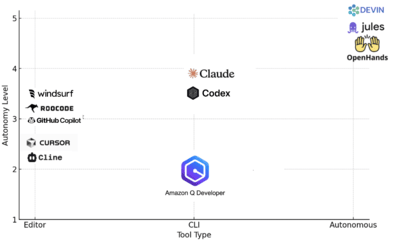
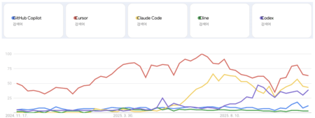

대형 언어 모델(LLM)의 발전이 가속되면서, 단순한 도구형 AI를 넘어 자율적으로 목표를 세우고 여러 단계를 실행해 나가는 "AI 에이전트" 개념이 더욱 더 발전하고 있다. 코딩 에이전트에서 주로 사용하는 기능은 채팅, 코드 생성, 코드 완성, 코드 검토, 리팩토링, 주석 생성, 자동 테스트 등이다.

#### AI 코딩 에이전트 비교

| 분류 기준         | 에디터형(GitHub Copilot, Cursor, Cline)         | CLI형(Claude Code, Codex CLI)         | 자율형(Devin, OpenHands)            |
| :-------------  | :------------------------------------------- | :------------------------------------ | :-------------------------------- |
| 자율성(autonomy)  | 일부 자동화(빌드, 배포)                           | 일부 자동화                              | 높은 자동화                          |
| 개발자 참여        | 모니터링과 언제든 개입 가능. 차이 확인, 승인, 수정      | 에이전트가 개발 담당. 중요한 판단시 확인을 요구  | 목표 설정 및 결과 확인 전용. 긴급시에만 개입 |
| 운영 환경         | 편집기                                         | 터미널, 파일 시스템                        | VM, 컨테이너(샌드박스)                 |
| 추구 가치         | 안전(모든 변경 사항을 제어 가능)                     | 효율성(에이전트 모듈화)                    | 생산성(완전 자동 실행)                  |

코딩 에이전트 타입별 자율성에 대한 분포를 매핑시키면 아래와 같다.

국내에서 어떤 툴이 유행하고 있는지는 아래의 구글 트렌드 그래프를 보면 Cursor > Claude Code > Codex > GitHub Copilot > Cline 순으로 사용되고 있는것 같다.

#### 에디터 타입

에디터 타입의 코딩 에이전트는 Cursor, GitHub Copilot, Cline, Roo Code, Windsurf로 대표되는 IDE 에디터에 통합된 코딩 에이전트이다. 개발자가 편집기의 채팅 패널에 요청사항을 입력하면 편집기가 AI 모델로 전송하게 되고 모델의 응답을 에이전트가 해석해, 파일 편집이나 커멘드를 실행, 개발자는 차이를 확인하면서 승인이나 수정을 한다.

에디터 타입은 유저의 소스 코드를 에이전트가 어떻게 인덱스화해 검색하는지가 중요한 전략이이다. 일반적으로 전체 작업 공간은 너무 커서 모든 것을 모델에 전달할 수 없기 때문에 인덱스 참조는 관련성이 높은 코드 조각을 추출해 효율성을 높인다. Cursor와 GitHub Copilot은 로컬과 원격으로 사용자의 소스 코드에서 생성된 인덱스를 유지한다. Windsurf는 개인용일 경우 로컬만으로 인덱스를 구축하고 [Teams 및 Enterprise 플랜](https://docs.windsurf.com/context-awareness/remote-indexing#remote-indexing)은 원격에서 관리하고 있다. Cline, Roo Code 등은 기본적으로 인덱싱을 지원하지 않는다. 런타임 시 온디맨드로 코드 조각을 수집하고 모델로 보내는 컨텍스트에 삽입하는 간단한 처리만 있다. 이 부분은 컨텍스트 윈도우 문제에 영향을 준다. 

컨텍스트 윈도우 문제란 대화를 거듭하는 동안 축적된 파일이나 실행 결과의 정보에 의해 코딩의 정밀도가 악화되는 잘 알려진 현상이다. 그래서 토큰의 수가 많을수록 모델이 더 많은 정보를 한 번에 처리할 수 있어 긴 컨텍스트를 이해하고 기억하는 데 도움이 된다. 하지만, 큰 컨텍스트 윈도우를 유지하려면 더 많은 계산 능력과 메모리가 필요로 한다. 이는 운영 비용을 증가시키고, 처리 속도가 느려지는 문제를 야기할 수 있어서 각 툴별로 컨텍스트 윈도우 문제는 아주 중요한 요소이다. 

|**제품명**|**개발사**|**출시 시기**|**모델명**|비용|**구현**|**인덱스**|**MCP**|
|---|---|---|---|---|---|---|---|
|[**Cursor**](https://www.cursor.com/)|Anysphere Inc.|[2024년 11월(Agent)](https://cursor.com/changelog/0-43-x)|선택 가능|[Hobby(무료, 제한적), Pro($20/월)](https://cursor.com/pricing)|VS Code 포크|원격/로컬|있음|
|[**Github Copilot**](https://github.com/features/copilot)|GitHub|2025년 2월(Agent)|OpenAI 계열/선택 가능|[Copilot Free(무료, 제한 있음), $10/월(Pro)](https://github.com/features/copilot#pricing)|VS Code 확장|원격/로컬|있음|
|[**Windsurf**](https://windsurf.com/)|Windsurf|[2024년 11월(Agent)](https://windsurf.com/blog/windsurf-launch)|SWE-1, 선택 가능|[Hobby(무료, 제한적), Pro($15/월)](https://windsurf.com/pricing)|VS Code 포크/VS Code 확장/Jetbrains 플러그인|원격(Team 이상)/로컬|있음|
|[**Cline**](https://cline.bot/)|Cline Inc.|2024년 7월|선택 가능|[Free(무료, 제한 있음), $20/월(TEAMS)](https://cline.bot/pricing)|VS Code 확장|없음|있음|
|[**Void**](https://voideditor.com/)|Andrew,Mathew(YC S24)|2024년 9월|선택 가능|종량제(API)|VS Code 포크|없음|없음|
|[**Kiro**](https://kiro.dev/)| AWS |2025년 7월|Claude 지원|[Free(무료, 제한 있음), $20/월(Pro)](https://kiro.dev/pricing/)|VS Code 포크|있음|있음|
|[**Antigravity**](https://antigravity.google/)|Google|2025년 11월|선택가능|[현재 무료](https://antigravity.google/pricing)|VS Code 포크|있음|있음|
|[**Roo Code**](https://roocode.com/)|Roo Code|2024년 12월|선택 가능|[Cloud Free(무료, 제한 있음), $20/월(Cloud Pro)](https://roocode.com/pricing)|VS Code 확장|없음 [로컬(실험적)](https://docs.roocode.com/features/experimental/codebase-indexing)|있음|
|[**Trae**](https://www.trae.ai/)|ByteDance|2025년 1월|Claude 계열/선택 가능|[Free(무료, 제한 있음), $10/월(Pro)](https://www.trae.ai/pricing)|VS Code 포크|미정|있음|
|[Firebender](https://firebender.com/)|Kevin, Aman(YC S24)|2025년 3월|선택 가능|[Hobby(무료, 제한적), Developer($30/월)](https://firebender.com/pricing)|Jetbrains 플러그인|없음|[있음](https://docs.firebender.com/context/mcp)|
|[**Junie**](https://www.jetbrains.com/ko-kr/ai-ides/)|JetBrains|2025년 4월|알 수 없음|[Free(무료, 제한적), Pro($10/월)](https://www.jetbrains.com/ko-kr/ai-ides/buy/?section=personal&billing=monthly)|Jetbrains 플러그인|알 수 없음|[없음](https://youtrack.jetbrains.com/issue/JUNIE-26/Support-MCP-for-Junie)|
|[**Zed**](https://zed.dev/)|Zed Industries|2025년 5월(Agent)|Claude 계열/선택 가능|[Personal(무료, 제한적), Pro($10/월)](https://zed.dev/pricing)|Rust 데스크톱|로컬|있음|

#### CLI 타입

CLI 타입의 코딩 에이전트는 Claude Code, Codex CLI, Amazon Q Developer CLI 와 같은 터미널(명령줄)에서 실행되는 코딩 에이전트이다. 개발자는 터미널의 쉘(UNIX shell, PowerShell)이나 명령에 대한 인수 입력으로 작동하여 코드 편집이나 명령 실행을 자동화한다. 파일의 검색, 갱신, 차이 비교를 해 그 내용을 터미널상에서 순차적으로 표시하고 개발자는 각 변경 사항을 확인하면서 승인하는 구조이다. 

에디터 타입과 달리 채팅과 차이 확인이 모두 터미널에서 완성된다. 에디터 타입은 현재 열려 있는 파일등 많으면 많은 컨텍스트를 가질 수 있지만, CLI 타입은 제약상 그것을 입력하지 않는 한 에이전트 측에서 판단하게 되므로, 초기 컨텍스트를 적은 상태에서부터 시작한다. 그리고 필요한 컨텍스트는 코딩 에이전트 자신이 반자율적으로 탐색한다. CLI 타입은 코드에 대한 이해도는 탐색 성능에 의해 평가된다. 그리고 CLI 타입에는 에디터 타입에서처럼 코드의 인덱싱을 갖춘 제품은 없어서 런타임에 파일 처리로 코드를 추출하여 전송하는 아키텍처를 취한다.

|**제품명**|**개발사**|출시 시기|**모델명**|비용|구현|GUI|**MCP**|
|---|---|---|---|---|---|---|---|
|**[Claude Code](https://claude.ai/)**|Anthropic|2025년 2월|Claude 계열|[종량제(API)/$100/월(Max 5x)](https://www.claude.com/pricing)|TypeScript [(Bun)](https://www.latent.space/p/claude-code)|[VS Code 확장/Jetbrains 플러그인](https://docs.anthropic.com/en/docs/claude-code/ide-integrations)|있음|
|**[Amazon Q Developer CLI](https://github.com/aws/amazon-q-developer-cli)**|AWS|2025년 3월|Claude 계열 (Bedrock 경유)|[제한적 무료/$19/월(Pro)](https://aws.amazon.com/ko/q/developer/pricing/)|Rust|[VS Code 확장, Jetbrains 플러그인](https://docs.aws.amazon.com/amazonq/latest/qdeveloper-ug/q-in-IDE.html)|있음|
|**[Codex CLI](https://developers.openai.com/codex)**|OpenAI|2025년 4월|codex-mini, o4-mini, 변경 가능|종량제(API)|TypeScript, Rust|없음|[개발 중](https://github.com/openai/codex/issues/5)|
|**[Aider](https://www.aider.ai)**|Paul Gauthier|2023년|선택 가능|[종량제(API)/$10/월](https://www.aider.ai/advisors-pricing)|Python|없음|[없음](https://github.com/Aider-AI/aider/issues/3314)|
|**[Goose](https://goose.ai/)**|block|2025년 1월|선택 가능|[종량제(API)](https://goose.ai/pricing)|Rust|[데스크톱 앱](https://block.github.io/goose/docs/getting-started/installation/)|있음|

#### 자율형 타입

자율형 에이전트에는 Devin, OpenHands, Jules가 있고 목표(goal)를 주면 프로젝트를 혼자 생성, 수정, 실행, 평가하는 에이전트이다. 자율형 타입의 코딩 에이전트는 더 적은 정보량에서 자동으로 컨텍스트를 탐색하고 작업을 계획하고 실행한다. 사용자와의 대화는 최소화되는 것을 목표로 한다. 이것은 소스 코드 변경을 중심으로 미세한 피드백 사이클을 반복하는 편집기 타입과 CLI 타입과는 대조적이다. 

자율형 코딩 에이전트도 코드 인덱싱 기능을 갖추고 있다. 일반적으로 GitHub 리포지토리를 연결하면 자동으로 코드 인덱싱 기능이 실행된다. Devin 같은 경우 Cognition AI에서 GitHub 리포지토리의 URL을 입력하는 것만으로 코드베이스를 AI가 자동으로 구문 분석하고 GitHub Wiki에서 호스팅되는 형식의 문서로 생성하는 [DeepWiki](https://deepwiki.org/)를 제공하고 있어서 코드 이해 성능이 올라갈 수 있다. 참고로 구글도 [Code Wiki](https://codewiki.google/)가 있는데 이것도 Devin의 DeepWiki와 비슷한 것 같다.

자율 코딩 에이전트는 사용자의 개입을 없애기 위해 독립적인 개발 환경에서 장시간 작업을 수행해야 한다. 따라서 관리되는 샌드박스 환경에서 실행되게 되는데 대부분은 개발자가 관리하는 Linux 기반 컨테이너와 MicroVM 샌드박스 환경에서 실현된다. 인스턴스 상태 관리를 위해 Devin, Cursor Background Agents는 상태 저장 작업을 수행할 수 있다. 설정된 상태의 스냅샷을 유지하고 시작 및 절전을 반복하여 작업을 특정 시점에서 재사용 할 수 있다. 반면, Jules, GitHub Actions 기반 Copilot Coding Agent, Claude Code GitHub Actions는 작업을 수행할 때마다 환경을 비저장 상태로 운영한다.

자율형 코딩 에이전트는 작업 성공률을 높이려면 적절한 지침과 컨텍스트 준비가 필요하므로 숨겨진 비용이 많다. 이러한 문서 정비는 팀의 자산이지만 속도 중심 프로젝트에서는 병목 현상이 될 수 있다. 개인적이로 이 영역은 아직 완성도가 높지 않고 발전하고 있는 영역으로 보인다.

|**제품명**|개발사|출시 시기|모델|비용|인터페이스|**실행 환경**|데모 영상|
|---|---|---|---|---|---|---|---|
|[Devin](https://devin.ai/)|Cognition AI|2024년 12월(GA)|비공개(Claude 외)|[$20/월(Core)](https://devin.ai/pricing)|Web, Slack, GitHub, VSCode for Web|미정(Ubuntu x86 Linux)|[Cognition Devin 2.0](https://cognition.ai/blog/devin-2)|
|[OpenHands Cloud](https://openhands.dev/)|All Hands AI|2025년 3월|OpenHands LM(Qwen 기반)|[제한적 무료/$500/month(Cloud)](https://openhands.dev/pricing) ※무료枠 있음|웹, GitHub|미정|[OpenHands: 오픈소스 인공지능 소프트웨어 개발 에이전트](https://www.youtube.com/watch?v=oB4JR98KRAA)|
|[Cursor Background Agents](https://docs.cursor.com/background-agent)|Anysphere|2025년 5월|선택 가능(o3 권장)|[$20/month(Pro)](https://cursor.com/pricing)|Desktop(Cursor), GitHub|[Ubuntu x86 Linux/AWS의 Kubernetes Pod?](https://blog.lai.so/cursor-background-agent/)|[Cursor on X](https://x.com/cursor_ai/status/1925323247253692744)|
|[Codex for ChatGPT](https://platform.openai.com/docs/codex)|OpenAI|2025년 5월|codex-1(o3 기반)|[$200/월(Pro)](https://chatgpt.com/ko-KR/pricing/)|ChatGPT(웹/데스크탑/모바일)|[알 수 없음(own cloud sandbox environment) 실행 시 인터넷에 접속할 수 없음](https://openai.com/index/introducing-codex/)|[Codex로 더 빠르게 구축](https://www.youtube.com/watch?v=wSAkqlzSZyw)|
|[코파일럿 코딩 에이전트](https://github.blog/changelog/2025-05-19-github-copilot-coding-agent-in-public-preview/)|GitHub|2025년 5월|[Claude Sonnet 4](https://resources.github.com/events/ghproductupdatewebinar2025may/)|[$39/월(Pro+)](https://github.com/features/copilot/plans?cft=copilot_li.features_copilot)|GitHub, VSCode for Web|[GitHub Actions](https://docs.github.com/en/copilot/customizing-copilot/customizing-the-development-environment-for-copilot-coding-agent)/Ubuntu x86 Linux|[GitHub Copilot 코딩 에이전트 소개](https://www.youtube.com/watch?v=EPyyyB23NUU)|
|[Jules](https://jules.google.com/)|Google|2025년 5월|Gemini 2.5 Pro|무료 기간|Web|[Google Cloud VM](https://blog.google/technology/google-labs/jules/)|[비동기 코딩 에이전트인 Jules로 빌드, 이제 공개 베타 버전이 출시되었습니다.](https://www.youtube.com/watch?v=cWvwpUw0vFA)|
|[Claude Code GitHub Actions](https://docs.anthropic.com/en/docs/claude-code/github-actions)|Anthropic|2025년 5월|Claude 계열|[종량제(API)](https://www.anthropic.com/api)|GitHub|GitHub Actions|[Claude Code + GitHub Actions](https://www.youtube.com/watch?v=L_WFEgry87M)|
|[Manus](https://manus.im/)|Monica|2025년 3월|비공개(Claude 외)|[$19/월(Basic)](https://manus.im/pricing) ※무료 기간 있음|Web|[E2B](https://e2b.dev/)|[마누스 소개: 일반 AI 에이전트](https://www.youtube.com/watch?v=K27diMbCsuw&t=92s)|

#### 개인적인 의견
Cognition AI가 Windsurf를 인수해서 다음 Devin도 Windsurf에 통합하려고 하고 AI 모델도 Kevin-32B를 만들었고 하여 관심히 많이 가는 회사다. 그리고 투자의 귀재 피터 틸도 투자를 한 회사고 창업자는 Scott Wu(CEO), Steven Hao(CTO), Walden Yan(CPO) 등으로 이들은 모두 IOI(국제정보올림피아드) 금메달리스트 출신이라는 특징이 있다. 

최근에 Google의 Antigravity를 출시하면서 여기도 AWS의 Kiro처럼 SDD(Spec-Driven Development)와 같은 개념이 들어가 있다. Antigravity는 소스 코드 편집기 + AI 기능이 아니라 에이전트가 소프트웨어 개발을하는 도구로 처음부터 디자인했다고 한다. 즉, SDD(Spec-Driven Development)적인 중간 생성물(설계 단편, Plan, 결정 로그)인 [아티팩트](https://antigravity.google/docs/artifacts)를 어떻게 다루는가라는 컨텍스트 엔지니어링의 사상을 전제로 만들어지고 있다. 앞으로의 코딩 툴은 이 방향으로 흘러갈 것 같다.

새롭게 나오는 툴이나 제품의 이름이나 입소문, 브랜드만 보지 말고 그 배경 과제나 기초 기술의 관점에 관심을 가져야 할 것 같다. 도구가 해결하려는 과제의 흐름을 파악하면 AI의 흐름도 파악이 가능하고 또 배운 도구 하나에 머무르지 않고 다양한 도구를 취사 선택할 수 있어 편협된 인식을 깨줄 수도 있다.

제가 시도해보고 싶은 시나리오가 있는데, 하나는 Kiro는 대화형으로 상세한 요건서·설계서를 만들 수 있지만, 구현 속도가 느린데 Claude Code는 빠른 개발이 가능하지만 정확한 지시를 내리기가 어렵다. 그래서 Kiro로 만든 사양서(requirements, design, tasks)를 Claude Code에 로드하면 Claude Code가 태스크를 이해도가 올라 출력물의 퀄리티가 올라갈것으로 보여 한번 시도해 보고 싶다.

두번째는 Codex의 퀄리티가 좋다고 하니 먼저 Claude에 첫번째로 맡긴 일의 결과물을 가지고 plan.md를 만들고 이것을 Codex에 리뷰시키면 Claude가 놓진 것들을 보완해서 만들어준다. 그래서 Codex에서 보완된 내용을 Claude에 전해서 plan.md를 수정시킨다. 그리고 난 다음에 Codex에 전해 다시 리뷰시키면 정말 좋은 퀄리티가 나올 것 같은 생각이 많이 든다. 또 그런 사례들도 보이고.

이제는 도구를 조합하는 사람이 더 좋은 코드를 만들 확률이 클 것 같다.

