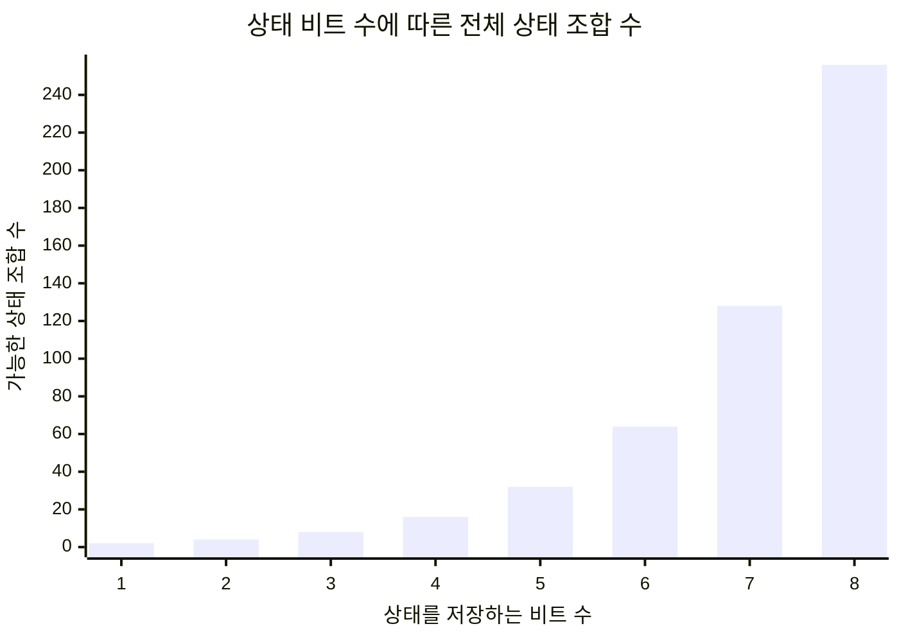
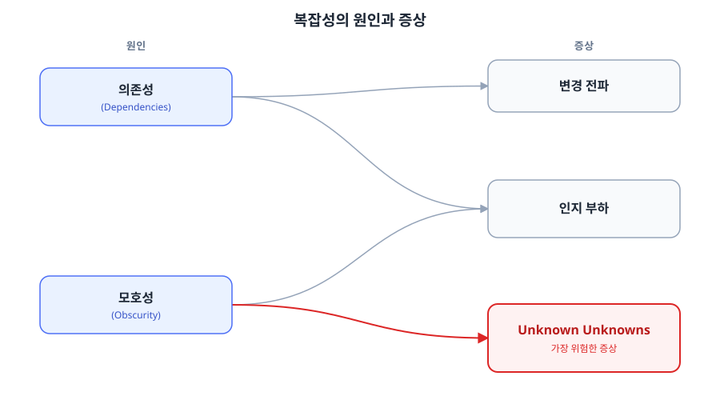
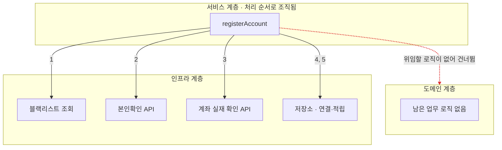
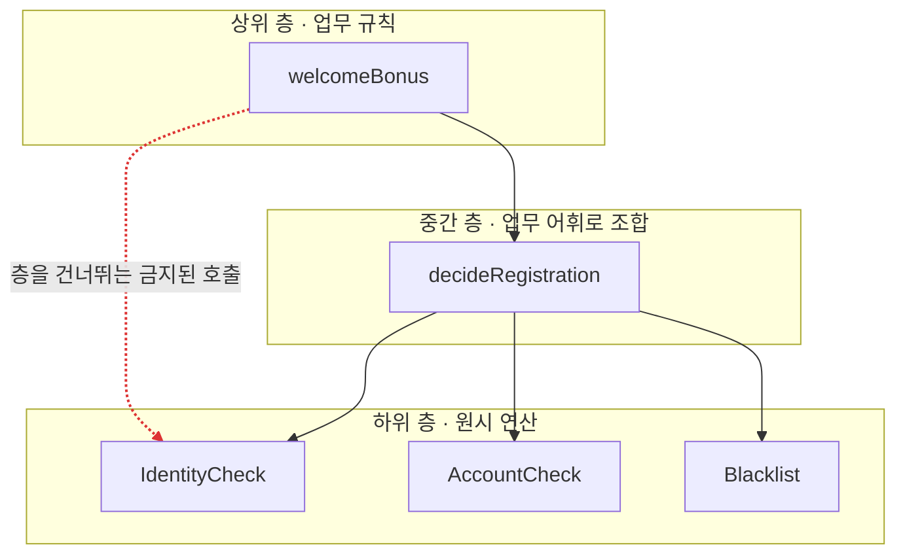

## 서론, 복잡성이 왜 문제인가

Fred Brooks는 1986년 "[No Silver Bullet](https://worrydream.com/refs/Brooks_1986_-_No_Silver_Bullet.pdf)"에서 소프트웨어를 어렵게 만드는 성질로 복잡성(Complexity), 순응성(Conformity), 변경 용이성(Changeability), 비가시성(Invisibility) 네 가지를 꼽았다. 그런데 2006년 벤 모즐리와 피터 마크스는 논문 "[Out of the Tar Pit](https://curtclifton.net/papers/MoseleyMarks06a.pdf)"에서 이 네 가지 중 진짜 근본 원인은 복잡성 하나뿐이라고 정리한다. 순응성은 기존 시스템의 복잡한 제약에 맞춰야 하는 문제이고, 비가시성은 복잡한 구조를 눈에 보이는 형태로 그려낼 수 없다는 문제이며, 변경 용이성이 어려운 이유도 결국 시스템이 복잡해서 어디를 건드려야 할지 알 수 없기 때문이다. 네 가지 성질은 서로 다른 이름을 달고 있지만 뿌리를 파보면 하나로 수렴한다.

이 결론에 무게가 실리는 이유는 복잡성이 소프트웨어의 신뢰성, 납기, 보안, 성능 문제 대부분의 공통 원인으로 지목되기 때문이다. 어떤 문제든 해결하려면 먼저 시스템을 이해해야 하는데, 그 이해를 가로막는 것이 다름 아닌 복잡성이다. Dijkstra는 "스스로 만든 복잡함에 짓눌리지 않으려면 명료하고 얽힘 없고 단순하게 유지해야 한다"고 했고, 1990년 튜링상 수상 연설에서 Corbató는 "야심 찬 시스템의 일반적인 문제는 복잡성"이라며 복잡성은 어려움을 곱절로 늘리는 방식으로 작동하기 때문에 단순함과 우아함의 가치를 강조해야 한다고 말했다.

Backus는 1977년 튜링상 연설에서 기존 언어들의 복잡함과 취약함을 지적하며 "프로그램을 사고하도록 돕는 강력한 방법론이 절실히 필요하다"고 했다. Hoare는 1980년 튜링상 연설에서 한발 더 나아간다. "돈으로 살 수 없는 단 하나의 품질이 있다면 신뢰성이다. 신뢰성의 대가는 철저한 단순함을 추구하는 것"이라고 하면서, 소프트웨어를 설계하는 방법은 두 가지뿐이라고 정리한다. 결함이 없는 게 뻔히 보일 만큼 단순하게 만들거나, 결함이 있는지조차 보이지 않을 만큼 복잡하게 만들거나. 그리고 첫 번째 방법이 훨씬 어렵다고 덧붙인다.

단순함이 어렵다는 이 결론은 "Out of the Tar Pit" 저자들도 그대로 받아들인다. "Simplicity is Hard"라는 논문의 소제목에서 알 수 있다. 다만 저자들은 복잡성이 어디서 생기는지 원인을 추적할 수 있다면 그중 상당수는 피할 수 있다고 이 논문에서 낙관한다. 

이 글은 그 추적 경로를 네 부로 나눠 따라간다. 1부는 복잡성이 실제로 어디서 생겨나는지, 그중 어디까지가 피할 수 없는 부분인지 이론으로 해부한다. 2부는 이 해부를 진단 질문으로 바꿔 지금 코드에 어떤 복잡성이 있는지 확인하는 도구로 만든다. 3부는 진단에서 걸리는 문제마다 구체적인 처방을 하나씩 놓고, 그 자리에서 곧바로 정기결제 지갑 서비스의 코드로 확인한다. 등록, 충전, 충전 수단, 상태 전이라는 네 기능이 이 순서를 따라 하나씩 늘어난다. 4부는 이 모든 처방이 손대지 못하는 영역, 즉 업무 자체에 내재한 복잡성 앞에서 무엇을 해야 하는지로 마무리한다. Stratified Design이라는 용어가 어디서 왔고 왜 같은 "층"이라는 말이 서로 다른 두 갈래를 가리키게 됐는지처럼 본문의 흐름을 끊는 계보 이야기는 부록으로 따로 뺐다.

## 제1부 복잡성의 해부

### 복잡성의 4가지 원인

"[Out of the Tar Pit](https://curtclifton.net/papers/MoseleyMarks06a.pdf)"은 대규모 시스템에 남아 있는 복잡성의 원인을 상태(State), 제어(Control), 코드량(Code Volume) 세 가지로 좁히고, 여기에 언어의 과도한 자유도라는 네 번째 요인을 덧붙인다.

#### 상태가 만드는 복잡성

고객센터에 전화를 걸었을 때 "다시 시도해보세요", "새로고침 해보세요", "프로그램을 재시작하세요", 심하면 "운영체제를 재설치하고 프로그램을 다시 까세요"라는 답을 들어본 적이 있다면, 상태(state)가 만드는 복잡성을 몸으로 겪었다. 이런 답변이 낯설지 않은 이유는 실제로 효과가 있기 때문이고, 효과가 있는 이유는 많은 시스템이 상태를 다루는 데서 오류를 내기 때문이며, 오류가 나는 이유는 상태가 존재하는 것만으로 프로그램이 이해하기 어려워지기 때문이다.

문제의 크기는 숫자로도 드러난다. 상태를 저장하는 비트 하나를 추가할 때마다 프로그램이 가질 수 있는 전체 상태의 수는 두 배로 늘어난다. 상태가 몇 개만 쌓여도 사람이 머릿속으로 시뮬레이션할 수 있는 범위를 순식간에 넘어선다. 더 나쁜 것은 오염(contamination)이다. 상태를 갖지 않는 함수라도 내부에서 상태를 가진 다른 함수를 호출하는 순간, 그 함수 역시 상태의 맥락 안에서만 이해할 수 있게 된다. 낙타의 코끝만 천막 안으로 들여놓으면 결국 몸통까지 따라 들어온다는 속담 그대로다. 테스트도 마찬가지로 취약해진다. 어떤 입력에 대한 테스트 결과는 다른 입력에 대해 아무것도 말해주지 않는다는 것이 테스트의 근본적 한계인데, 상태가 있으면 같은 입력이라도 시스템이 어떤 상태에 있었는지에 따라 결과가 달라진다. 입력의 조합만으로도 감당하기 벅찬데, 여기에 상태의 조합까지 곱해진다.


```mermaid
xychart-beta
    title "상태 비트 수에 따른 전체 상태 조합 수"
    x-axis "상태를 저장하는 비트 수" [1, 2, 3, 4, 5, 6, 7, 8]
    y-axis "가능한 상태 조합 수" 0 --> 256
    bar [2, 4, 8, 16, 32, 64, 128, 256]
```

비트 하나가 늘 때마다 막대는 배로 뛴다. 필드 몇 개만 더해도 사람이 머릿속으로 따라갈 수 있는 범위를 곧바로 벗어나는 이유가 이 그래프에 그대로 드러난다.

다음 코드는 정기결제 지갑의 충전 로직을 상태를 직접 변경하는 방식으로 짰다.

**Before**

```java
class Wallet {
    private long balance;
    private int retryCount;
    private boolean locked;

    void charge(long amount) {
        if (locked) {
            retryCount++;
            if (retryCount > 3) {
                throw new IllegalStateException("잠금 해제 필요");
            }
            return;
        }
        balance += amount;
        retryCount = 0;
    }
}
```

이 코드가 옳은지 확인하려면 `charge`를 한 번 호출한 결과만으로는 부족하다. 호출 시점에 `locked`가 어떤 값이었는지, `retryCount`가 몇이었는지에 따라 같은 `amount`를 넣어도 결과가 달라진다. `balance`, `retryCount`, `locked` 세 필드는 서로 다른 시점에 서로 다른 이유로 바뀌므로, 이 객체가 가질 수 있는 상태의 조합은 세 필드 각각의 가능한 값을 모두 곱한 만큼 존재한다. 필드 하나를 더 추가할 때마다 이 조합은 배로 불어난다.

#### 제어가 만드는 복잡성

제어(control)는 일이 벌어지는 순서에 관한 개념이다. 문제는 프로그래머가 순서에 관심이 없는 경우에도, 대부분의 명령형 언어가 순서를 명시하도록 강제한다는 데 있다.

```java
a = b + 3;
c = d + 2;
e = f * 4;
```

이 세 줄은 서로 값을 주고받지 않는다. 어떤 순서로 실행되든 결과는 같다. 그런데도 언어의 의미론상 이 코드는 위에서 아래로 순서대로 실행된다고 규정되어 있다. 이 코드를 읽는 사람은 실제로는 무의미한 이 순서를 일단 유효한 제약으로 가정하고 읽기 시작해서, 다시 살펴본 뒤에야 순서가 무관하다는 것을 확인해야 한다. 짧은 예제에서는 이 확인이 순식간에 끝나지만, 코드가 복잡해질수록 순서가 정말 무의미한지 판단하는 일 자체가 만만치 않은 작업이 된다. 판단을 잘못하면 발견하기 어려운 버그로 이어진다. 프로그래머가 요청하지도 않은 순서를 언어가 강제로 부여하고, 그 부여된 순서가 실제로는 무관하다는 것을 다시 확인하는 이중의 낭비가 발생한다.

동시성이 더해지면 문제는 한 단계 더 나빠진다. 상태가 있는 두 스레드가 뒤섞이면 똑같은 초기 상태와 똑같은 입력으로 테스트를 두 번 실행해도 같은 결과가 나온다는 보장이 사라진다. 입력이 같아도 상태에 따라 결과가 달라지는 문제에, 이번에는 실행 순서에 따라서도 결과가 달라지는 문제가 겹친다.

#### 코드량이 만드는 복잡성

코드량 자체는 부차적인 원인이다. 상태와 제어를 다루는 코드가 결국 코드량으로 쌓이기 때문에 따로 떼어 말할 필요가 없어 보이지만, 두 가지 이유로 독립적으로 짚을 가치가 있다. 측정하기 가장 쉬운 지표라는 점, 그리고 다른 원인들과 나쁜 방향으로 상호작용한다는 점이다. Brooks는 이 비선형 증가를 essential complexity의 증거로 들었지만, Dijkstra는 다른 의견을 냈다. 지적 노력이 프로그램 길이의 제곱에 비례해서 늘어난다는 법칙이 있다는 주장이 있지만 그 법칙이 증명된 적은 없으며, 추상화를 제대로 활용하면 이해에 드는 노력이 프로그램 길이에 비례하는 정도로 그칠 수 있다. 상태와 제어를 잘 관리한 시스템에서는 코드량이 늘어나도 복잡성이 비선형으로 폭증하지 않는다. 코드량의 비선형 증가는 코드 자체의 숙명이 아니라, 상태와 제어를 방치했을 때 나타나는 결과에 가깝다.

#### 언어의 자유도가 만드는 복잡성

네 번째 원인은 언어가 허용하는 자유도다. C의 자유로운 메모리 관리가 대표적이다.

```c
Wallet *w = malloc(sizeof(Wallet));
// ... 사용
free(w);   // 호출을 잊으면 누수, 두 번 호출하면 오류
```

해제 시점과 여부를 프로그래머가 직접 판단해야 하고, 판단을 틀려도 그 대가는 한참 뒤 프로그램이 실행되는 도중에야 드러난다. 언어가 강제하는 규칙 없이는 이런 실수와 오용이 반드시 일어난다. 가비지 컬렉션이 복잡성을 줄인 이유는 새로운 규칙을 추가해서가 아니라 수동 메모리 관리라는 자유도 자체를 없앴기 때문이다. 같은 원리가 상태에도 적용된다. 상태를 쓰지 말라고 아무리 권고해도 언어가 상태 자체를 허용하는 한 문제는 남는다.

네 가지 원인은 서로 독립적으로 작동하지 않는다. 상태와 제어가 결합하면 상태에 따라 분기하는 프로그램이라는, 둘을 따로 다룰 때보다 훨씬 이해하기 어려운 결과물이 나온다. 원인을 알아보기 어려울 정도로 시스템이 복잡해지면 이미 있는 기능인지 확인하는 일조차 버거워져서 같은 기능이 중복으로 만들어진다. 마감이 임박했다면 이 경향은 더 심해진다. 복잡성은 새로운 복잡성을 부르는 방향으로 저절로 굴러간다. 이 악순환을 끊으려면 의식적인 개입이 필요하고, 그 개입의 첫 단계는 어떤 복잡성을 없앨 수 있고 어떤 복잡성은 없앨 수 없는지 가르는 일이다.

### Essential Complexity와 Accidental Complexity

Brooks는 "No Silver Bullet"에서 소프트웨어의 어려움을 본질(essence)에서 오는 것과 우연(accident)에서 오는 것으로 나누고, 소프트웨어의 복잡성은 우연이 아니라 본질적인 속성이라고 결론 내렸다. 지금 남아 있는 복잡성 대부분은 피할 수 없다. "Out of the Tar Pit" 저자들은 이 결론에 동의하지 않는다. 복잡성 자체는 소프트웨어의 필연적 속성이 아니며 단순하면서도 여전히 소프트웨어인 프로그램을 얼마든지 만들 수 있고, 현재 시스템에 존재하는 복잡성의 상당 부분은 본질적이지 않다는 것이 저자들의 반박이다.

이 반박을 뒷받침하려면 본질과 우연을 가르는 기준이 있어야 한다. 저자들이 세운 기준은 이렇다. **Essential Complexity** 는 사용자가 보는 문제 자체에 내재한 복잡성이다. **Accidental Complexity** 는 그 나머지 전부다. 개발팀이 이상적인 세계에서는 다룰 필요가 없었을 복잡성, 이를테면 성능 문제나 언어와 인프라의 한계에서 오는 복잡성이 여기 속한다.

이 기준을 더 엄격하게 벼리면 이렇게 정리된다. 사용자가 무엇을 원하는지에 해당하는 요구사항, 즉 기능 요구사항(무엇을 할 수 있어야 하는가)과 비기능 요구사항(얼마나 빨라야 하는가, 얼마나 안정적이어야 하는가, 데이터가 얼마나 안전해야 하는가)은 그 자체로 사용자의 문제에 속하므로 essential이다. 반면 그 요구사항을 만족시키기 위해 개발팀이 고르는 기술적 메커니즘, 이를테면 어떤 자료구조를 쓸지, 노드끼리 어떤 프로토콜로 조율할지, 어떤 캐싱 전략을 쓸지는 accidental이다. 이 둘을 가르는 실용적인 시험은 대안의 존재 여부다. 같은 요구사항을 만족시키는 구현 방법이 하나가 아니라 여럿 있을 수 있다면, 그 구현 방법을 선택하면서 생기는 복잡성은 문제 자체가 아니라 풀이가 만든 것이므로 accidental이다.

이 정의에서 눈여겨볼 대목은 "essential"이라는 말을 일상어보다 훨씬 엄격하게 쓴다는 점이다. 어떤 구현체에 필수적이라거나 소프트웨어 일반에 필수적이라는 뜻이 아니라, 오로지 사용자의 문제에 필수적인지만 따진다. 이 기준으로 보면 비트, 바이트, 트랜지스터, 전기, 심지어 컴퓨터 자체도 essential이 아니다. 사용자의 문제와는 아무 관계가 없기 때문이다. 기준을 이렇게까지 엄격하게 잡은 이유는 판단 기준을 하나로 통일하기 위해서다. 사용자가 그 존재조차 모르는 것이라면 정의상 essential일 수 없다. 스레드풀이나 반복문의 카운터 변수를 사용자에게 물어보면 대부분 무슨 말인지도 모른다. 이런 것들은 정의상 accidental이다.

이 기준을 가상의 실험으로 확인해보자. 이상적인 세계에서는 성능을 걱정할 필요가 없고, 언어와 인프라가 필요한 모든 것을 지원한다고 하자. 이 세계에서 개발팀이 할 일은 사용자의 비공식 요구사항을 형식 요구사항으로 바꾸고, 그 형식 요구사항을 범용 인프라 위에서 그대로 실행하는 것뿐이다. 이 경로에 필요 없는 상태, 필요 없는 순서 제어가 있다면 그것은 정의상 accidental이다. 정기결제 지갑에서 사용자에게 지금까지 적립된 총 포인트를 보여주는 기능이 있다고 하자. 충전 내역을 순회해서 매번 합산하지 않고 별도의 `totalEarnedPoints` 필드에 저장해두고 충전할 때마다 갱신하는 방식을 택했다면, 이 필드는 파생 데이터를 상태로 만든 것이므로 accidental complexity에 해당한다. 충전 내역만 있으면 총 적립 포인트는 언제든 다시 계산할 수 있어서, 원칙적으로는 상태로 들고 있을 필요가 없기 때문이다.

이 구분이 실무에서 갖는 힘은 "복잡한 게 원래 그런 것"이라는 체념을 반박할 근거를 준다는 데 있다. 복잡성 전부가 문제 자체에서 나온 것이라면 손댈 방법이 없지만, 상당수가 도구와 구현 방식의 산물이라면 그 부분은 없앨 수 있는 대상이 된다. essential complexity에 대해서는 사용자와 함께 다루는 수밖에 없지만, accidental complexity는 개발팀의 선택으로 줄일 수 있는 영역이다.

이 글을 처음 쓴 2021년 이후 accidental complexity를 줄이는 도구도 늘었다. LLM 기반 코딩 도구는 라이브러리 마이그레이션이나 보일러플레이트 작성처럼 사용자의 문제와 무관한 반복 작업을 대신 처리하고, TLA+ 같은 정형 검증 도구는 상태 전이 규칙을 사람이 눈으로 좇는 대신 기계로 증명하게 한다. 다만 두 도구 모두 무엇이 essential인지는 판단해주지 않는다. 이 절에서 세운 기준은 도구가 바뀌어도 그대로 적용된다.

### 가장 위험한 복잡성, Unknown Unknowns

John Ousterhout는 "[A Philosophy of Software Design](https://www.amazon.com/dp/173210221X)"에서 복잡성을 시스템의 구조와 관련해 이해하거나 수정하기 어렵게 만드는 모든 것이라고 정의한다. 코드의 크기나 기능의 개수가 아니라 개발자가 겪는 어려움 자체로 복잡성을 규정한다. 그래서 좀처럼 손대지 않는 부분이 아무리 복잡해도 체감되는 복잡성에는 큰 영향을 주지 않고, 자주 건드리는 부분은 조금만 복잡해도 어려움이 크게 느껴진다.

Ousterhout는 이 어려움이 드러나는 방식을 변경 전파, 인지 부하, Unknown Unknowns 세 가지 증상으로 나누고, 이 증상을 낳는 원인을 의존성(dependencies)과 모호성(obscurity) 두 가지로 좁힌다. 의존성은 소프트웨어에서 완전히 없앨 수는 없지만 그 수를 줄이고 남은 것을 단순하게 만들 수는 있다. 모호성은 중요한 정보가 코드 어디에도 명시되지 않은 상태로, Ousterhout는 방대한 문서화가 필요하다는 사실 자체가 설계가 잘못됐다는 신호인 경우가 많다고 지적한다. 두 원인과 세 증상은 다음처럼 이어진다.



변경 전파는 작은 변경 하나가 여러 곳의 수정을 요구하는 문제이고, 인지 부하는 작업을 완료하는 데 알아야 할 것이 너무 많은 문제다. 이 두 증상은 코드 어디에서나 나타날 수 있다. 책임이 뒤섞인 클래스도 변경 전파를 일으키고, 관계가 얽힌 수많은 클래스도 인지 부하를 일으킨다. Unknown Unknowns는 사정이 다르다. 무엇을 해야 하는지, 제안한 해법이 실제로 동작할지조차 알 수 없는 상태를 가리키며, 원인과 결과가 사건이 벌어지기 전까지는 드러나지 않는다.

세 증상 중에서도 Unknown Unknowns가 가장 나쁘다. 이유는 단순하다. 변경 전파나 인지 부하는 코드를 들여다보면 관찰할 수 있는 문제지만, Unknown Unknowns는 사건이 실제로 터지기 전까지는 그 존재조차 알 방법이 없다. 두 원인 중에서는 모호성이 이 증상과 직접 맞닿아 있다. 정보가 숨어 있을수록 Unknown Unknowns는 늘어난다.

이 개념이 왜 실무에서 중요한지는 Phillip Armour가 2000년 논문 "The Five Orders of Ignorance"에서 제시한 무지(ignorance)의 다섯 단계를 보면 분명해진다. Armour는 소프트웨어를 완성된 제품이 아니라 지식을 쌓아가는 매체로 본다. 이 관점에서 무지는 다음처럼 층을 이룬다. 0단계는 알고 있고 그것을 동작하는 시스템으로 보여줄 수 있는 상태(답을 가진 상태)다. 1단계는 모르지만 무엇을 모르는지는 특정할 수 있는 상태(질문을 가진 상태)다. 2단계는 모른다는 사실 자체를 모르는 상태(질문조차 세우지 못하는 상태)다. 3단계는 2단계를 어떻게 찾아내야 하는지 그 방법조차 모르는 상태다. 4단계는 이 다섯 단계 모델 자체의 존재를 모르는 상태다.

Armour는 진짜 문제가 2단계와 3단계에 있다고 본다. 2단계는 견적이 크게 빗나가는 이유, 프로젝트가 "90% 완료"에서 멈춘 채 좀처럼 끝나지 않는 증상, Brooks가 말한 2차 시스템 효과를 설명한다. 정기결제 지갑을 예로 들면, 계좌 등록이 실패할 수 있는 경우의 수를 설계 시점에 다 헤아렸다고 믿었지만 운영에 들어간 뒤 은행 점검 시간, 한도 초과, 명의 불일치 같은 경우가 새로 튀어나오는 상황이 2단계 무지다. 설계 시점에는 그런 경우가 있는지조차 몰랐으므로 질문으로 세울 수도 없었다.

3단계에 대한 Armour의 통찰이 이 개념 전체에서 가장 힘이 센 대목이다. 설계 리뷰든 테스트 주도 개발이든, 4부에서 다룰 EventStorming이든, 소프트웨어 개발 방법론은 모두 3단계를 다루는 절차다. 그런데 이 절차가 하는 일은 답을 내놓는 것이 아니라 2단계에 머물러 있던 무지를 1단계의 질문으로 끌어올리는 것뿐이다. 방법론을 도입하면서 "이걸 따르면 놓치는 게 없어지나요"라고 묻는다면 그 자체가 오해다. 방법론이 실제로 돌려주는 것은 답이 아니라 질문이며, 그 질문에 답하는 일은 방법론이 아니라 여전히 사람의 몫으로 남는다.

이 통찰은 Ousterhout가 짚은 obscurity와 정확히 맞물린다. obscurity를 줄인다는 것은 결국 코드에 숨어 있던 2단계의 무지를 1단계의 질문으로 끌어올리는 작업이다. 3부에서 다룰 Deep Module과 정보 은닉이 이 obscurity를 줄이는 구체적인 기법이고, 층으로 격리하는 처방 역시 층 사이의 의존을 정리해 dependencies를 줄이는 접근이라는 점에서 이 절의 문제의식과 직접 이어진다. Ousterhout는 이 두 기법이 지향하는 목표를 명확한 시스템(obvious system)이라는 한마디로 정리한다. 깊이 생각하지 않고 낸 빠른 추측이 대체로 맞아떨어지는 시스템을 가리킨다.

## 제2부 복잡성 진단하기

### Simple 대 Easy, Rich Hickey의 통찰

Rich Hickey는 2011년 강연 "Simple Made Easy"에서 두 단어를 정확히 구분하는 데서 논의를 시작한다. Simple의 어원은 라틴어 "sim"(하나)과 "plex"(접힘, 꼬임)이 합쳐진 말로, 하나로 꼬여 있지 않은 상태를 가리킨다. 무언가가 얽혀 있는지 아닌지는 관찰할 수 있는 사실이므로 Simple은 객관적 속성이다. 반면 Easy의 어원은 "가까이 있다"는 뜻의 라틴어에서 왔다. 물리적으로 가까이 있어서 설치하자마자 쓸 수 있다는 뜻일 수도 있고, 이미 익숙한 것과 비슷하다는 뜻일 수도 있고, 자신의 실력 범위 안에 있다는 뜻일 수도 있다. 세 의미 모두 누구에게 가까운가에 좌우된다. 그래서 Easy는 상대적 속성이다. 나에게 쉬운 것이 다른 사람에게는 어려울 수 있다.

Hickey는 이 구분 위에 complect(뒤얽다)라는 개념을 세운다. 복잡성의 근원은 원래 분리되어야 할 것들을 뒤얽는 데 있다. 하나를 이해하려면 거기 얽혀 있는 모든 것을 함께 머릿속에 담아야 하므로, 이 부담은 조합론적으로 늘어난다. 상태(state)가 결코 단순할 수 없는 이유도 여기 있다. 상태는 값(value)과 시간(time)을 뒤얽는다. 같은 메서드를 같은 인자로 호출해도 호출 시점에 따라 결과가 달라진다면, 그 복잡성은 캡슐화의 경계를 뚫고 바깥으로 새어 나온다. 앞서 본 Wallet의 `charge`가 겪은 문제, 즉 같은 `amount`를 넣어도 호출 시점의 `retryCount`와 `locked` 값에 따라 결과가 달라지던 현상이 이 뒤얽힘의 구체적인 사례다.

Hickey는 이런 식으로 뒤얽히기 쉬운 선택들과, 그 대신 택할 수 있는 단순한 선택들을 짝지어 제시한다.

| 뒤얽히기 쉬운 선택 | 대안 |
|---|---|
| 객체(state, identity, value가 함께 묶임) | 값(value) |
| 메서드(함수와 상태가 결합) | 함수 |
| 상속(타입들을 뒤얽음) | 조합 가능한 다형성 |
| switch·패턴 매칭(여러 결정이 한 곳에 닫힘) | 조합 가능한 다형성 |
| 반복문(무엇을 할지와 어떻게 할지가 뒤얽힘) | 집합 연산 |
| ORM(데이터와 표현이 뒤얽힘) | 선언적 데이터 조작 |
| 조건문 분기(규칙이 코드 곳곳에 흩어짐) | 규칙의 명시적 분리 |

이 표에서 반복되는 원리는 하나다. 데이터는 있는 그대로 데이터로 남겨두라는 원칙이다. Hickey는 정보는 단순하며 정보로 할 수 있는 유일한 일은 그것을 망치는 것뿐이라고 말한다. 객체로 감싸는 순간 정보는 그 객체의 정체성과 상태에 뒤얽힌다.

여기서 짚어야 할 함정은 Easy를 Simple로 착각하는 일이다. 익숙한 도구, 손에 익은 프레임워크를 고르면 당장은 빠르게 시작할 수 있다. 문제는 그 속도가 오래가지 않는다는 데 있다. 초반에는 눈에 띄게 빠르지만, 얽혀 있던 것들이 서로 발목을 잡기 시작하면서 스프린트마다 생산성이 급격히 떨어진다. 반대로 Simple을 먼저 택하면 초반에는 사려 깊게 설계할 시간이 필요해서 느려 보이지만, 장기적으로는 속도가 꺾이지 않고 유지된다. Hickey는 이 선택을 프로그래머 개인의 취향이 아니라 책임의 문제로 본다. 단순함은 선택이며, 단순한 시스템을 갖지 못했다면 그것은 개발자의 잘못이라는 것이 그의 결론이다. 이 선택을 실행하려면 무엇을 뒤얽힌 채로 둘지 감지하는 안목이 필요하다. 이어서 이 안목을 진단 질문으로, 그다음 실제 처방으로 옮긴다.

### 복잡성을 진단하는 질문

지금까지 다룬 이론은 각자 다른 각도에서 같은 결론을 가리킨다. 상태와 제어를 뒤얽지 말 것, 사용자의 문제에 속하지 않는 것은 걷어낼 것, 정보를 숨기지 말고 의존을 정리할 것. 이 결론을 코드에 적용하기 전에 먼저 할 일이 있다. 지금 코드에 정말 복잡성이 있는지, 있다면 어떤 종류인지부터 진단해야 한다. 앞서 다룬 개념은 그대로 진단 질문으로 바꿀 수 있다.

| 질문 | 해당하는 복잡성 |
|---|---|
| 이 객체가 가질 수 있는 상태 조합이 몇 개인가? | State가 만드는 복잡성 |
| 이 실행 순서가 실제로 의미가 있는가, 언어가 강제한 우연의 순서인가? | Control이 만드는 복잡성 |
| 이 상태·필드·카운터를 사용자에게 물어보면 알아들을까? | Accidental Complexity |
| 이 모듈을 이해하는 데 방대한 문서가 필요한가? | Obscurity |
| 이 모듈을 다른 모듈 없이는 이해하거나 수정할 수 없는가? | Dependencies |
| 인터페이스가 구현보다 복잡한가? (Shallow Module: 감춘 것보다 알아야 할 것이 많은 모듈) | Shallow Module |
| 이 인터페이스를 한두 문장으로 설명할 수 있는가? | Shallow Module |
| 클래스를 쪼갠 이유가 서로 다른 지식을 감추기 위해서인가? (아니라면 Classitis: 쪼개기 자체가 목적이 된 상태) | Classitis |

정적 분석 도구가 흔히 재는 지표로 이 진단을 대신할 수는 없다. Cyclomatic Complexity(McCabe, 1976)는 함수 안의 분기 수를 센다. 이를 다듬은 Cognitive Complexity(Campbell, 2018)는 중첩 깊이에 가중치를 줘서 사람이 느끼는 부담에 더 가깝게 만들었다. 그런데 두 지표 모두 코드의 정적 구조, 즉 분기와 중첩만 잰다. 앞서 본 Wallet의 `retryCount`와 `locked`가 만드는 상태 조합은 분기문 개수와 무관하게 늘어난다. 필드 하나를 추가해도 `charge`의 분기 수는 그대로일 수 있지만 가능한 상태 조합은 배로 늘어난다. 이 지표들이 코드 리뷰에서 유용한 신호이긴 해도, 위 표의 첫 두 질문이 겨냥하는 문제는 잡아내지 못한다.

진단에서 걸리는 항목이 곧 3부에서 적용할 처방을 가리킨다.

## 제3부 복잡성 제거 실천법

이 진단에 각 이론이 내놓는 처방은 서로 다르다. State와 Control을 겨냥하는 처방이 있고, 모듈 설계를 겨냥하는 처방이 있고, 층과 아키텍처를 겨냥하는 처방이 있고, 분기를 겨냥하는 처방이 있다. 분산 시스템과 현장의 실무로 시야를 넓히면 처방은 하나 더 늘어난다. 각 처방은 이론만 늘어놓지 않고, 그 자리에서 곧바로 정기결제 지갑 서비스의 코드로 확인한다.

요구사항은 이렇다. 사용자는 지갑에 코인을 충전해서 쓰거나 송금할 수 있다. 은행 계좌를 등록해두면 거기서 지갑으로 충전할 수 있는데, 이는 필수가 아니다. 계좌를 등록하려면 외부 API로 본인확인을 거쳐야 하고, 계좌번호가 실재하는지도 외부 API로 확인해야 한다. 이메일이 블랙리스트에 있으면 등록할 수 없고, 이메일은 전체 사용자 사이에서 유일해야 한다. 처음 등록하는 사용자에게는 500코인을 지급한다. 이 요구사항은 처방을 하나씩 따라가며 등록, 충전, 충전 수단, 상태 전이로 기능이 넓어진다.

### 상태와 제어 제거하기

"Out of the Tar Pit" 저자들은 State가 복잡성의 근원이라는 진단에서 그치지 않고 구체적인 처방을 내놓는다. Immutable(불변), Declarative(선언형), Functional(함수형) 세 가지다. 세 처방은 서로 다른 각도에서 상태 하나를 겨냥한다. 바꾸는 대신 새로 만들고, 어떻게 바꿀지가 아니라 무엇을 원하는지만 적고, 부수효과 없는 함수로 로직을 짠다.

불변성이 겨냥하는 문제는 앞서 본 오염이다. Wallet의 `balance`, `retryCount`, `locked`는 `charge`를 호출할 때마다 제자리에서 바뀌었고, 그래서 이 객체를 이해하려면 호출 시점의 상태까지 함께 알아야 했다. 값을 바꾸는 대신 새 값을 만들어 돌려주면 이 문제는 사라진다.

**After**

```java
record Wallet(long balance, int retryCount, boolean locked) {
    Wallet charge(long amount) {
        if (locked) {
            int nextRetry = retryCount + 1;
            if (nextRetry > 3) {
                throw new IllegalStateException("잠금 해제 필요");
            }
            return new Wallet(balance, nextRetry, locked);
        }
        return new Wallet(balance + amount, 0, false);
    }
}
```

`charge`는 이제 `balance`를 바꾸지 않고 새 `Wallet`을 만들어 돌려준다. 호출 전의 인스턴스는 그대로 남아 있으므로, 어떤 코드가 이 인스턴스를 들고 있든 그 값은 절대 달라지지 않는다. 결과를 알려면 호출 시점의 인자만 알면 되고, 그전에 무슨 일이 있었는지는 알 필요가 없다. 테스트도 같은 이유로 단순해진다. 입력과 출력의 쌍만 확인하면 되고, 이전 테스트가 남긴 상태가 다음 테스트에 영향을 줄까 걱정할 필요가 없다.

선언형은 상태가 아니라 제어를 겨냥한다. 무엇을 원하는지만 적고 어떤 순서로 계산할지는 실행 엔진에 맡긴다. SQL의 SELECT 문이 그렇다. 어떤 인덱스를 타고 어떤 순서로 행을 훑을지는 옵티마이저가 정하고, 호출자는 원하는 결과 집합의 조건만 적는다. 앞서 본 반복문과 집합 연산의 대비가 정확히 이 처방이다. 반복문은 무엇을 할지와 어떻게 순회할지를 한 코드에 묶지만, 집합 연산은 순회 방식을 라이브러리 뒤로 감추고 조건만 남긴다.

함수형은 이 둘을 코드 조직 원리로 묶는다. 함수가 상태 없이 입력만으로 출력이 정해지면(순수 함수), 오염은 원천적으로 성립하지 않는다. 계산 로직은 순수 함수로 남기고 상태를 다루는 코드는 얇은 셸 하나로 좁히는 구조(Functional Core, Imperative Shell)가 이 세 처방을 코드에 옮긴 형태다. 충전할 때 적립되는 코인을 계산하는 로직으로 이 구조를 확인해보자. 적립액이 얼마인지 계산하는 규칙과 그 결과를 저장소에 반영하는 절차를 다른 함수로 나눈다.

```java
// Functional Core: 상태가 없고, 입력만으로 결과가 정해진다
long calculateEarnedPoints(long chargedAmount) {
    return chargedAmount / 100;               // 충전액 100원당 1코인
}

// Imperative Shell: 저장소를 읽고 쓰는 절차만 담당한다
void charge(UserId userId, long amount) {
    long earned = calculateEarnedPoints(amount);
    walletRepository.credit(userId, amount + earned);
}
```

`calculateEarnedPoints`는 같은 입력에 대해 언제 호출해도 같은 결과를 내놓는다. 앞서 본 `record Wallet`의 `charge`가 상태를 바꾸는 대신 새 값을 만들어 오염을 없앴듯, 이 함수도 아무것도 바꾸지 않고 값만 계산한다. 상태가 없으므로 테스트도 입력과 출력의 쌍만 확인하면 끝난다. 저장소에 반영하는 절차, 즉 실제로 상태를 바꾸는 지점은 `charge` 하나로 좁혀지고, 이 함수만 상태와 관련한 문제(오염, 조합 폭발)를 신경 쓰면 된다. 나머지 로직은 상태의 맥락에서 벗어난다. 최초 가입 보너스는 등록 시점에 이미 판정이 끝난 규칙이므로, `calculateEarnedPoints`에 같은 조건을 다시 넣지 않는다. 같은 규칙을 두 곳에서 각자 판정하면 그 둘이 어긋나는 순간 보너스가 이중으로 지급되거나 아예 지급되지 않는다. 규칙은 그것을 판정할 자격이 있는 층 한 곳에만 둔다.

이 처방을 적용할 때 던져야 할 질문이 하나 더 있다. essential과 accidental을 가르는 질문을 설계 결정마다 던지는 것이다. 이 상태를, 이 필드를, 이 카운터를 사용자에게 물어보면 무슨 말인지 알아들을까. 앞서 총 적립 포인트 필드의 예에서 봤듯, 사용자가 이해하지 못하는 상태는 정의상 accidental이다. 재시도 횟수, 캐시, 락 플래그처럼 시스템 내부 사정으로 생긴 상태는 최대한 도메인 로직 바깥, 즉 Imperative Shell 쪽으로 밀어낸다.

### 모듈을 깊게 만들기(Deep Module)

John Ousterhout는 "A Philosophy of Software Design"에서 좋은 설계란 곧 복잡성을 줄이는 설계라고 잘라 말한다. 그리고 복잡성을 다루는 방법은 두 가지뿐이라고 덧붙인다. 없애거나, 감추거나. 없앨 수 없는 복잡성이라면 남은 선택은 그 복잡성을 아는 사람의 수를 줄이는 것뿐이고, 이 선택을 코드 구조로 만든 것이 모듈이다.

Ousterhout는 모듈의 값어치를 인터페이스와 구현의 비율로 잰다. 인터페이스는 그 모듈을 쓰기 위해 알아야 하는 부분이고, 구현은 인터페이스 뒤에 감춰진 부분이다. 이 비율이 클수록, 즉 알아야 할 것은 적은데 감춰진 기능은 클수록 그 모듈은 깊다(deep module). Unix의 파일 I/O가 대표적이다. `open`, `read`, `write`, `close` 네 개의 호출만 알면 파일을 다룰 수 있지만, 그 뒤에는 디스크 블록 배치, 캐싱, 파일 시스템 저널링 같은 방대한 구현이 숨어 있다. 반대로 인터페이스가 구현만큼 복잡한 모듈은 얕다(shallow module). getter와 setter만 나열한 클래스가 전형적인 예다. 그 클래스를 쓰려면 안의 필드 구조를 사실상 다 알아야 하므로, 클래스로 감싼 값어치가 거의 없다.

| 구분 | 인터페이스 | 구현 | 예시 |
|---|---|---|---|
| Deep Module | 작다, 알아야 할 것이 적다 | 크다, 기능이 풍부하다 | Unix 파일 I/O (`open`, `read`, `write`, `close`) |
| Shallow Module | 크다, 구현만큼 알아야 한다 | 작다, 기능이 제한적이다 | getter·setter만 나열한 클래스 |

이 개념 자체는 새롭지 않다. David Parnas는 1972년 논문에서 모듈을 나누는 기준으로 처리 순서가 아니라 바뀔 가능성이 높은 설계 결정을 감추는가를 들었다. Larry Constantine과 Edward Yourdon은 1979년 구조적 설계에서 이를 결합도(coupling)와 응집도(cohesion)라는 척도로 정리했다. 모듈 사이의 결합은 낮게, 모듈 안의 응집은 높게 유지하라는 원칙이다. Ousterhout의 Deep Module은 이 40년 넘은 원칙을 인터페이스 대 구현의 비율이라는 하나의 잣대로 다시 정리한 것에 가깝다. 뒤에 나올 지갑 예제의 `IdentityCheck`, `AccountCheck`, `Blacklist`가 이 두 척도를 모두 만족하는 사례다. 서로 다른 지식을 감춰 결합은 낮고, 각자 하나의 책임만 맡아 응집은 높다.

이 잣대를 인터페이스 쪽에 놓는 선택에는 더 오래된 논쟁이 깔려 있다. Richard Gabriel은 1991년 에세이 "[The Rise of Worse is Better](https://www.dreamsongs.com/RiseOfWorseIsBetter.html)"에서 소프트웨어 설계를 바라보는 두 태도를 대비시킨다. MIT/Stanford 스타일(그가 the-right-thing이라 부르는 쪽)은 구현이 다소 복잡해지더라도 인터페이스는 단순하고 일관되게 지키는 쪽을 우선한다. 반대로 뉴저지 스타일은 구현의 단순함을 최우선에 두고, 그 대가로 인터페이스의 복잡함이나 일관성, 완전성마저 희생한다. Gabriel 자신은 Unix와 C가 이 뉴저지 스타일 덕분에 이식성이 좋았고 그래서 널리 퍼졌다고 인정하지만, 스탠포드에 몸담은 Ousterhout는 반대쪽을 택한다. 구현이 복잡해지는 비용을 치르더라도 호출자가 마주치는 인터페이스를 얕게 유지하는 쪽이 시스템 전체의 복잡성을 줄인다고 그는 본다. 앞서 본 Unix 파일 I/O 뒤에 숨은 디스크 블록 배치와 캐싱의 복잡함은 이 선택이 실제로 치른 대가다.

| 구분 | 최우선 가치 | 인터페이스 | 감수하는 대가 |
|---|---|---|---|
| MIT/Stanford (the-right-thing) | 인터페이스 단순성 | 단순하고 일관됨 | 구현이 복잡해짐 |
| New Jersey (worse-is-better) | 구현 단순성 | 다소 복잡해도 무방 | 일관성·완전성을 일부 포기 |

깊은 모듈을 만드는 구체적인 기준은 복잡성을 누가 떠안을지 판단하는 데 있다. Ousterhout는 이를 복잡성을 아래로 끌어내리기라 부른다. 어떤 값을 호출자에게 넘길지, 구현이 알아서 정하게 할지 선택해야 할 때마다 후자를 택하라는 원칙이다. 호출자가 결정할 이유가 없는 구현 세부(타임아웃 값, 재시도 횟수 같은)를 인자로 받게 만드는 순간 인터페이스는 얕아진다.

인터페이스가 얕아지는 경로는 하나 더 있다. 요구사항이 하나 들어올 때마다 그 요구사항 전용 메서드를 하나씩 추가하는 경우다. Ousterhout는 이렇게 만들어진 모듈을 special-purpose(특수 목적) 모듈이라 부르고, 그 대안으로 general-purpose(범용) 모듈을 제시한다. 지금 필요한 기능보다 살짝 더 넓게 설계해서 여러 특수한 요청을 적은 수의 일반적인 메서드 조합으로 처리하게 만드는 방식이다. 다만 이 확장은 메서드 수를 줄이는 방향으로만 이뤄져야 한다. 메서드 수를 줄이는 대가로 매개변수 수를 늘리는 방식은 허용되지 않는다. 매개변수가 늘면 호출자가 알아야 할 것이 늘어나므로 인터페이스는 그만큼 다시 얕아지기 때문이다. `IdentityCheck.verify(UserId id)`가 본인확인 제공사마다 다른 옵션 플래그를 인자로 받지 않는 이유도 같다. 제공사별 특수 처리는 구현 뒤로 감추고, 호출자에게는 어떤 제공사를 쓰든 동일한 메서드 하나만 보인다.

| 구분 | 메서드 수 | 매개변수 수 | Wallet 예제 |
|---|---|---|---|
| Special-purpose 모듈 | 요청이 늘수록 함께 늘어난다 | 낮게 유지 | 제공사마다 별도 메서드 |
| General-purpose 모듈 | 적게 유지 | 늘리지 않는다 | `IdentityCheck.verify(UserId id)` 하나로 모든 제공사 처리 |

여기서 흔히 저지르는 반대 방향의 실수가 classitis다. Ousterhout는 얕은 클래스를 잘게 쪼개기만 하는 습관을 이렇게 부르며 경계한다. 클래스 수를 늘린다고 저절로 깊어지지 않는다. 감추는 지식이 서로 다를 때만 쪼갤 값어치가 있다.

이 습관의 뿌리를 Ousterhout는 줄 수에서 찾는다. 메서드나 클래스가 길다는 이유만으로 쪼개라는 조언, 이를테면 Robert Martin이 "Clean Code"에서 제시한 기준을 그는 정면으로 반박한다. 쪼개는 기준이 길이라면 쪼갠 조각들은 원래 하나였던 지식을 나눠 가질 뿐 새로 감추는 지식이 없고, 그 결과 얕은 조각 여러 개만 남는다. Ousterhout는 반대 순서를 제안한다. 먼저 깊게 만들고, 그 깊은 모듈을 더 짧게 쪼갤 수 있는지는 그다음에 따로 판단한다. 이 순서를 따르면 private 메서드를 추출하는 흔한 리팩터링에도 조건이 붙는다. 추출한 조각과 남은 본체가 각자 다른 지식을 감춘 채 독립적으로 이해될 때만 추출할 값어치가 있고, 그렇지 않다면 긴 메서드 하나로 남겨두는 편이 낫다.

| 쪼개는 기준 | 결과 |
|---|---|
| 길이(줄 수) | 원래 하나였던 지식이 조각들로 흩어짐, 얕은 조각 여러 개만 남음 |
| 깊이(감추는 지식이 다른가) | 각 조각이 독립적으로 이해·호출 가능, 깊은 조각 유지 |

깊은 모듈을 지향하는 것과 classitis를 피하는 것은 같은 원칙의 양면이 아니라 서로 반대 방향으로 당기는 trade-off다. 지식을 감추겠다고 계속 쪼개다 보면 조각 하나하나의 인터페이스는 작아지지만, 원래 하나였던 일을 끝내려는 호출자는 그 작은 인터페이스 여러 개를 모두 배우고 순서에 맞게 엮어야 한다. 조각 각각은 깊어 보여도, 그 조각들을 조합해야 하는 호출자의 관점에서는 알아야 할 것의 총량이 줄지 않고 여러 클래스에 걸쳐 흩어질 뿐이다. 개별 모듈의 깊이와 그 모듈들을 엮어 쓰는 호출자가 겪는 깊이는 다른 질문이다. 그래서 쪼갤지 말지를 가르는 기준은 하나로 좁혀진다. 나누려는 두 부분이 서로 다른 지식을 감추면서도 각자 독립적으로 이해되고 호출될 수 있는가. 두 조각을 늘 같이 알아야만 하나의 일이 끝난다면, 그 분할은 감추기가 아니라 흩어놓기이므로 나누지 않는 편이 낫다. 뒤에 나올 지갑 예제에서 이 trade-off를 코드로 확인한다.

### 주석, 감춘 지식을 기록하는 설계 도구

Deep Module은 복잡성을 인터페이스 뒤로 감추라고 말하지만, 감춘 지식이 사라지지는 않는다. 그 지식을 알아야 하는 사람은 여전히 있고, 코드 자체가 그 지식을 드러내지 않는다면 주석이 그 자리를 메운다. Ousterhout는 좋은 코드에는 주석이 필요 없다는 통념(Clean Code가 즐겨 내세우는 주장)에 동의하지 않는다. 주석이 필요하다는 사실은 설계가 잘못됐다는 신호가 아니라, 코드만으로는 전달할 수 없는 정보(왜 이 순서로 처리하는지, 이 값의 범위가 왜 이렇게 정해졌는지, 이 예외를 무시해도 되는 이유)가 애초에 존재한다는 사실을 인정하는 태도에 가깝다. 앞서 obscurity를 다루며 짚었듯, 중요한 정보가 코드 어디에도 명시되지 않은 상태 자체가 Unknown Unknowns를 낳는 토양이었다. 주석은 이 토양을 줄이는 가장 직접적인 도구다.

다만 아무 주석이나 이 역할을 하지는 못한다.

| 주석의 추상 수준 | 담는 내용 | 가치 |
|---|---|---|
| 코드보다 낮음 | 왜 이렇게 구현했는지, 변수가 실제로 뜻하는 바 | 유효함 |
| 코드보다 높음 | 모듈이 무엇을 보장하는지, 어떻게 쓰면 되는지 | 유효함 |
| 코드와 동일 | 코드가 하는 일을 그대로 되풀이 | 정보량 0, 무가치 |

Ousterhout는 한발 더 나아가 주석을 구현이 끝난 뒤 덧붙이지 말고 설계 단계에서 먼저 쓰라고 권한다. 인터페이스를 한두 문장으로 설명할 수 없다면, 그 인터페이스가 아직 깊지 않다는 뜻이기 때문이다. 이 순서를 뒤집어 말하면, 주석을 먼저 쓰는 습관은 인터페이스 대 구현의 비율을 코드를 짜기 전에 미리 점검하는 절차가 된다.

이 습관은 인터페이스를 키우는 방식에도 규율을 지운다. 새 요구사항이 들어올 때마다 기존 인터페이스에 매개변수 하나, 분기 하나를 덧붙이면 그 인터페이스를 설명하는 주석은 점점 길어지고 점점 많은 예외를 나열하게 된다. 한 문장으로 설명되던 인터페이스가 여러 문단으로도 설명이 안 되는 지점에 이르면, 그것은 기능이 들어올 때마다 조금씩 늘려온 결과 인터페이스 자체가 얕아졌다는 신호다. Ousterhout는 개발의 증분이 기능이 아니라 추상이어야 한다고 잘라 말한다. 새 요구가 기존 인터페이스에 자연스럽게 들어맞지 않는다면, 그 요구를 담을 인터페이스를 처음부터 다시 설계하는 편이, 기존 인터페이스에 예외를 하나씩 얹어가는 편보다 결국 더 깊은 모듈을 남긴다.

| 증분의 단위 | 방식 | 결과 |
|---|---|---|
| 기능 단위 | 기존 인터페이스에 매개변수·분기를 추가 | 인터페이스가 점점 얕아짐 |
| 추상 단위 | 새 요구를 담을 인터페이스를 다시 설계 | 깊은 모듈이 유지됨 |

이 원칙을 지갑의 등록 로직에 적용하면 `IdentityCheck`, `AccountCheck`, `Blacklist`라는 세 인터페이스가 나온다. 각 인터페이스는 상위 코드가 그 뒤에 무엇이 있는지 몰라도 되게 만들어서, 상위 코드를 읽는 사람이 알아야 할 정보의 총량을 줄인다. `IdentityCheck.verify(UserId id)`가 재시도 횟수나 타임아웃 값을 인자로 받지 않는 것도 앞서 본 복잡성을 아래로 끌어내리기를 그대로 지킨 결과다. 이런 값은 호출자가 결정할 이유가 없는 구현 세부이므로 구현 쪽이 스스로 정한다. 이 셋을 하나로 합치지 않은 이유도 classitis의 경계와 같다. 셋으로 나눈 이유는 개수를 늘리기 위해서가 아니라 본인확인 제공사, 계좌 등록 기관, 블랙리스트 데이터 소스라는 서로 무관한 지식을 각각 감추기 때문이다. 도메인 주도 설계가 컨텍스트마다 모델을 따로 두라고 권하는 것도 같은 맥락이다. 하나의 거대한 모델에 모든 관심사를 욱여넣으면, 한 관심사를 이해하기 위해 다른 관심사의 세부까지 함께 알아야 하는 상황이 벌어진다. 이 세 인터페이스를 어떻게 배치하는지는 다음 절에서 코드로 확인한다.

### 층(Stratified Design)으로 격리하기

Stratified Design은 Hal Abelson과 Gerald Sussman이 1987년 MIT AI 메모에서 처음 제시한 개념이다. 원래는 Lisp을 예로 든 논문이었지만, Eric Normand는 저서 "Grokking Simplicity"에서 이 개념을 함수형 프로그래밍 전반에 맞게 다시 풀어썼다. 핵심 주장은 세 가지로 요약된다. 첫째, 각 층은 그 층에 특화된 언어다. 층마다 고유한 원시 개념과 조합 수단, 추상화 수단을 갖추고, 위층은 오로지 이 어휘만으로 구성되며 아래층의 구현 세부에는 손대지 않는다. 둘째, 폐쇄성(closure)이다. 부품을 조합한 결과는 다시 같은 층의 부품으로 취급할 수 있어서, 같은 층 안에서 조합을 얼마든지 반복할 수 있다. 셋째, 층별 교체 가능성이다. 아래층의 구현을 다른 것으로 바꿔도 위층은 영향을 받지 않는다. Stratified Design이 주는 변경 용이성은 바로 이 교체 가능성에서 나온다. 이 세 원칙을 바로 이어지는 지갑 예제로 확인한다.

이 요구사항을 서비스, 도메인, 인프라라는 흔한 책임 기반 계층으로 나눈다고 하자. 그런데 계좌 등록, 본인확인, 블랙리스트 조회, 계좌 실재 확인까지 거의 모든 로직이 외부 API 호출이나 데이터 조회에 의존한다. 그 결과 서비스 계층은 외부 I/O를 순서대로 호출하는 오케스트레이션으로 채워지고, 정작 도메인 계층에는 남는 로직이 거의 없다.

**Before**

```java
class WalletApplicationService {
    void registerAccount(UserId userId, BankAccount account, Email email) {
        if (blacklist.contains(email)) throw new RejectedException();     // 인프라 조회
        if (!identityApi.verify(userId)) throw new RejectedException();   // 외부 API
        if (!accountApi.exists(account)) throw new RejectedException();   // 외부 API
        userRepository.linkAccount(userId, account);                      // 저장소
        if (userRepository.isFirstRegistration(userId)) {
            walletRepository.credit(userId, 500);                         // 저장소
        }
    }
}
```


```mermaid
flowchart TD
    subgraph Service["서비스 계층 · 처리 순서로 조직됨"]
        Register["registerAccount"]
    end
    subgraph Domain["도메인 계층"]
        Empty["남은 업무 로직 없음"]
    end
    subgraph Infra["인프라 계층"]
        BL["블랙리스트 조회"]
        ID["본인확인 API"]
        AC["계좌 실재 확인 API"]
        Repo["저장소 · 연결·적립"]
    end
    Register -->|"1"| BL
    Register -->|"2"| ID
    Register -->|"3"| AC
    Register -->|"4, 5"| Repo
    Register -.->|"위임할 로직이 없어 건너뜀"| Domain
    linkStyle 4 stroke:#d33,stroke-width:2px
```

실선은 서비스 계층이 검증하고 저장하고 적립한다는 처리 순서대로 인프라의 개별 연산을 직접 호출하는 경로를 나타내고, 점선은 원래 도메인 계층으로 이어져야 했을 호출이 실제로는 비어 있음을 나타낸다. 하위 층의 구현을 감추는 경계 자체가 이 그림에는 없다.

이 코드에서 도메인 로직이라 부를 만한 부분은 사실상 없다. 블랙리스트 검사, 본인확인, 계좌 확인, 최초 가입 판단이 전부 외부 호출과 뒤섞여 있어서, 어디까지가 업무 규칙이고 어디부터가 기술적 절차인지 코드만 봐서는 구분할 수 없다.

이 실패는 우연이 아니다. 서비스, 도메인, 인프라라는 계층 이름은 검증하고 저장하고 적립한다는 처리 순서를 그대로 옮겨놓은 것에 가깝다. Ousterhout는 이런 구성을 시간적 분해(temporal decomposition)라고 부르고, 코드를 무엇을 아는가가 아니라 언제 일어나는가로 나누면 지식이 여러 모듈에 걸쳐 새어나간다고 지적한다. 계좌가 실재하는지 판단하는 지식과 이메일이 블랙리스트에 있는지 판단하는 지식은 서로 무관한데도, 둘 다 "먼저 검증한다"는 순서 하나로 묶여 같은 서비스 계층에 나란히 놓인다.

Stratified Design은 다른 기준으로 층을 나눈다. 책임의 종류가 아니라 추상도로 나눈다. 추상도가 낮은 층일수록 구현 기술에 가깝고 변화가 적으며, 추상도가 높은 층일수록 업무 요건에 가깝고 자주 바뀐다. 층을 건너뛰어 직접 호출하는 경로는 두지 않는다.

**After**

```java
// 하위 층: 외부 세계와 맞닿는 원시 연산 (구현에 가깝고, 자주 바뀌지 않는다)
interface IdentityCheck { boolean verify(UserId id); }
interface AccountCheck { boolean exists(BankAccount account); }
interface Blacklist { boolean contains(Email email); }

// 중간 층: 원시 연산을 업무 어휘로 조합한다 (등록 가능 여부 판정)
record RegistrationDecision(boolean allowed, String reason) {}

RegistrationDecision decideRegistration(
        UserId userId, BankAccount account, Email email,
        IdentityCheck identity, AccountCheck accountCheck, Blacklist blacklist) {
    if (blacklist.contains(email)) return new RegistrationDecision(false, "블랙리스트");
    if (!identity.verify(userId)) return new RegistrationDecision(false, "본인확인 실패");
    if (!accountCheck.exists(account)) return new RegistrationDecision(false, "계좌 미실재");
    return new RegistrationDecision(true, null);
}

// 상위 층: 업무 규칙만으로 구성된다 (최초 가입 보너스라는 정책)
long welcomeBonus(boolean isFirstRegistration) {
    return isFirstRegistration ? 500 : 0;
}
```


```mermaid
flowchart TD
    subgraph L3["상위 층 · 업무 규칙"]
        WelcomeBonus["welcomeBonus"]
    end
    subgraph L2["중간 층 · 업무 어휘로 조합"]
        Decide["decideRegistration"]
    end
    subgraph L1["하위 층 · 원시 연산"]
        Identity["IdentityCheck"]
        Account["AccountCheck"]
        Blacklist["Blacklist"]
    end
    WelcomeBonus --> Decide
    Decide --> Identity
    Decide --> Account
    Decide --> Blacklist
    WelcomeBonus -.->|층을 건너뛰는 금지된 호출| Identity
    linkStyle 4 stroke:#d33,stroke-width:2px
```

실선은 인접한 층끼리만 넘나드는 comfortable layers를, 점선은 `welcomeBonus`가 `IdentityCheck`를 건너뛰어 직접 부르는 금지된 경로를 나타낸다. 이 경로가 열리는 순간 `decideRegistration`이 감추고 있던 어휘와 교체 가능성이 동시에 깨진다. 앞서 본 책임 기반 그림과 나란히 놓으면 차이가 분명해진다. 그 그림에서는 서비스 계층 하나가 인프라의 개별 연산 네 가지를 처리 순서대로 직접 호출했지만, 이 그림에서 상위 층이 아는 것은 하위 층의 이름뿐이고 그 뒤의 구현은 전혀 모른다.

중간 층인 `decideRegistration`은 `IdentityCheck`, `AccountCheck`, `Blacklist`라는 하위 층의 어휘만으로 구성되어 있고, 그 구현이 외부 API인지 로컬 파일인지는 알지 못한다. 상위 층인 `welcomeBonus`는 한 걸음 더 나아가 불리언 값 하나만 받는다. 이 값이 저장소 조회로 나온 것인지 캐시로 나온 것인지조차 이 함수는 관심이 없다. 본인확인 API가 다른 제공사로 바뀌어도 `IdentityCheck` 구현체 하나만 갈아 끼우면 되고, `decideRegistration`과 `welcomeBonus`는 한 줄도 바뀌지 않는다. 앞서 책임 기반으로 나눈 코드에서는 API 제공사가 바뀌면 응용 서비스 코드 안의 호출 부분을 직접 찾아 고쳐야 했던 것과 대조적이다.

이 층 나누기가 서비스·도메인·인프라라는 익숙한 이름과 왜 다른 기준으로 갈리는지, 그리고 왜 같은 "층"이라는 말이 서로 다른 두 계보를 가리키게 됐는지는 부록 B에서 따로 다룬다.

추상도로 층을 나누는 발상은 Stratified Design에서 멈추지 않는다. Alistair Cockburn의 Hexagonal Architecture, Robert Martin의 Clean Architecture, Jeffrey Palermo의 Onion Architecture가 모두 같은 원칙, 즉 업무 규칙이 구현 기술의 존재조차 몰라야 한다는 원칙을 각자 다른 그림으로 표현한 결과다. `IdentityCheck` 인터페이스는 이 계보에서 보면 포트이고, 실제 본인확인 API를 호출하는 구현체는 어댑터다. 이 계보가 어디서 시작됐고 어떻게 갈라졌는지는 부록 A에서 다룬다.

추상도로 층을 나누면 상위 층은 하위 층의 구현을 몰라도 되는 경계, 즉 추상화 장벽(abstraction barrier)이 생긴다. 이 장벽은 인접한 층끼리만 넘나드는 규율(comfortable layers)로 지켜진다. 상위 층이 두 단계 아래 층을 건너뛰어 직접 호출하면, 그 사이 층이 제공하려던 어휘와 교체 가능성이 동시에 깨진다.

앞서 본 상태와 제어 제거하기, 모듈을 깊게 만들기, 그리고 이 절의 층으로 격리하기는 결국 하나의 규율로 수렴한다. 상태는 가장 바깥의 얇은 층으로 몰아넣고, 그 안쪽 층은 그 층에서 essential한 것만 다루며, 그보다 아래층의 accidental한 구현 세부는 인터페이스 뒤로 감춘다. 이 규율을 지키는 데는 자동으로 검증해주는 도구가 없다. 계층을 건너뛰어 편의상 하위 API를 직접 호출하고 싶은 유혹은 항상 있고, 그 유혹에 한 번씩 질 때마다 층은 조용히 무너진다.

Stratified Design이 복잡성과 맺는 관계는 두 갈래다. 하나는 앞서 1부에서 본 Ousterhout의 진단과 맞닿아 있다. 의존성과 모호성이라는 두 원인 중, 층을 인접한 것끼리만 호출하게 강제하는 규율은 의존성을 통제하고, 각 층이 하위 층의 구현을 감춘 특화된 언어로 작동하는 성질은 모호성을 줄인다. 다른 하나는 한계다. Stratified Design은 essential complexity 자체를 줄이지 못한다. 이미 발견된 복잡성을 코드 구조 안에 배치하는 인코딩 도구일 뿐이어서, 업무 규칙이 정말로 복잡하다면 그 복잡성은 상위 층 어딘가에 그대로 남는다. 층으로 감출 수 있는 것은 그 복잡성을 몰라도 되는 사람의 수이지 복잡성의 총량이 아니다. 이 한계는 4부에서 다시 짚는다.

### 분기를 다형성으로 바꾸기

앞서 본 Hickey의 표에서 switch·패턴 매칭은 조합 가능한 다형성으로 바꿀 수 있는 뒤얽힘으로 분류됐다. 회원 등급, 결제 수단, 배송 상태처럼 몇 가지 값 중 하나를 갖는 필드를 검사하는 조건문이 코드베이스 곳곳에 반복되면, 새 값 하나가 추가될 때마다 그 조건문을 전부 찾아 고쳐야 한다. 값을 검사하는 코드 대신 그 값 자체를 표현하는 객체를 만들고, 호출자는 그 객체를 통해서만 다루게 하면 이 반복이 사라진다.

정기결제 지갑이 계좌이체, 카드, 보유 포인트 세 가지 수단으로 충전할 수 있다고 하자. 수단마다 수수료율과 충전 한도가 다르다.

**Before**

```java
long calculateFee(ChargeMethod method, long amount) {
    if (method == ChargeMethod.CARD) {
        return (long) (amount * 0.025);
    } else if (method == ChargeMethod.BANK_TRANSFER) {
        return 500;
    } else {
        return 0;
    }
}
```

문제는 이 분기가 여기 하나로 끝나지 않는다는 데 있다. 충전 한도를 검사하는 메서드에도, 영수증 문구를 만드는 메서드에도 같은 세 갈래 분기가 따로 나타난다. 새로운 충전 수단이 하나 추가되면 이 분기들을 전부 찾아 고쳐야 하고, 하나라도 놓치면 그 수단만 조용히 잘못 동작한다. 앞서 본 변경 전파가 분류값이 만드는 형태로 나타난 사례다.

#### 분기의 본문을 메서드로 독립시킨다

가장 먼저 할 일은 각 분기 안의 로직을 이름 붙은 메서드로 뽑아내는 일이다.

```java
long calculateFee(ChargeMethod method, long amount) {
    if (method == ChargeMethod.CARD) {
        return calculateCardFee(amount);
    } else if (method == ChargeMethod.BANK_TRANSFER) {
        return calculateBankTransferFee(amount);
    } else {
        return calculatePointFee(amount);
    }
}
```

분기 자체는 그대로지만, 각 갈래가 무엇을 하는지 이름으로 드러나고 본문의 세부는 읽지 않아도 된다. 다음 단계들을 위한 준비 작업이다.

#### else를 없애면 분기가 단순해진다

else로 이어진 분기는 한 갈래를 읽으면서도 나머지 조건을 함께 의식해야 한다. 조기 반환으로 각 갈래를 독립시키면 그 부담이 사라진다.

```java
long calculateFee(ChargeMethod method, long amount) {
    if (method == ChargeMethod.CARD) {
        return calculateCardFee(amount);
    }
    if (method == ChargeMethod.BANK_TRANSFER) {
        return calculateBankTransferFee(amount);
    }
    return calculatePointFee(amount);
}
```

각 if문은 자신의 조건과 반환값만 신경 쓰면 되고, 앞의 조건이 거짓이었다는 사실을 기억할 필요가 없다.

#### 복문은 단문으로 나눈다

조건 하나에 여러 판단이 들어가면 그 자체가 작은 분기 폭발이 된다.

**Before**

```java
if (method == ChargeMethod.CARD && amount > 1_000_000 && !user.isVerified()) {
    throw new RejectedException();
}
```

이 한 줄에는 "카드 결제인가", "고액인가", "미인증 사용자인가" 세 가지 판단이 겹쳐 있다. 이름 붙은 변수로 쪼개면 각 판단이 무엇을 의미하는지 조건문 밖에서도 읽힌다.

**After**

```java
boolean isLargeCardCharge = method == ChargeMethod.CARD && amount > 1_000_000;
boolean isUnverifiedUser = !user.isVerified();
if (isLargeCardCharge && isUnverifiedUser) {
    throw new RejectedException();
}
```

#### 분류별 로직을 클래스로 나눈다

메서드 추출은 한 메서드 안의 분기를 정리했을 뿐, 수수료 계산과 한도 검사와 영수증 문구에 흩어진 분기는 그대로 남아 있다. 이 분기들을 한데 모으려면 갈래마다 클래스를 만든다.

```java
class CardCharge {
    long calculateFee(long amount) { return (long) (amount * 0.025); }
    long limit() { return 5_000_000; }
}

class BankTransferCharge {
    long calculateFee(long amount) { return 500; }
    long limit() { return 10_000_000; }
}

class PointCharge {
    long calculateFee(long amount) { return 0; }
    long limit() { return 1_000_000; }
}
```

수수료와 한도라는, 수단마다 따로 흩어져 있던 지식이 각 클래스 하나로 모인다.

#### 나뉜 클래스를 같은 형으로 다룬다

클래스는 나눴지만 호출하는 쪽에서 여전히 어느 클래스를 쓸지 분기해야 한다면 나눈 보람이 없다. 공통 인터페이스를 두면 이 분기가 사라진다.

**After**

```java
interface Charge {
    long calculateFee(long amount);
    long limit();
}

class CardCharge implements Charge { /* 위와 동일 */ }
class BankTransferCharge implements Charge { /* 위와 동일 */ }
class PointCharge implements Charge { /* 위와 동일 */ }
```

```java
long calculateFee(Charge charge, long amount) {
    return charge.calculateFee(amount);
}
```

세 갈래이던 분기가 한 줄의 위임으로 줄어든다. 조건 분기를 다형성으로 대체하는 리팩터링이다. Hickey가 짝지은 표에서 본 "switch·패턴 매칭 → 조합 가능한 다형성"이 코드 위에서 실제로 벌어지는 모습이 바로 이 코드다. 이 구조에 이름을 붙이면 GoF의 Strategy 패턴이다. 알고리즘 계열(여기서는 수수료 계산 방식)을 인터페이스 뒤로 캡슐화하고 런타임에 교체할 수 있게 만든다는 정의가 `Charge`와 그 구현체 그대로다. 패턴 이름 자체가 복잡성을 줄이지는 않지만, 동료에게 "여기 Strategy 패턴을 썼다"는 한마디로 이 구조 전체를 전달할 수 있다는 실용적 이점은 있다.

#### 분류별 인스턴스는 어디서 만드는가

인터페이스로 분기는 없앴지만 질문 하나가 남는다. `ChargeMethod.CARD`라는 값을 받아 `CardCharge` 인스턴스를 돌려주는 코드는 어딘가에 있어야 한다. 이 매핑을 호출하는 곳마다 새로 작성하면 분기가 자리만 옮겨 다시 흩어진다. 한 곳에 모아야 한다.

```java
class ChargeFactory {
    private static final Map<ChargeMethod, Charge> CHARGES = Map.of(
        ChargeMethod.CARD, new CardCharge(),
        ChargeMethod.BANK_TRANSFER, new BankTransferCharge(),
        ChargeMethod.POINT, new PointCharge()
    );

    Charge resolve(ChargeMethod method) {
        return CHARGES.get(method);
    }
}
```

`ChargeMethod`와 구현체 사이의 대응은 이 팩토리 하나만 알면 되고, 나머지 코드는 `Charge` 인터페이스만 상대한다.

#### enum에 행동을 직접 실어도 된다

수단마다 의존하는 외부 자원이 없다면, 인터페이스와 팩토리 없이 enum 상수에 행동을 바로 실을 수 있다.

```java
enum ChargeMethod {
    CARD {
        long calculateFee(long amount) { return (long) (amount * 0.025); }
    },
    BANK_TRANSFER {
        long calculateFee(long amount) { return 500; }
    },
    POINT {
        long calculateFee(long amount) { return 0; }
    };

    abstract long calculateFee(long amount);
}
```

`method.calculateFee(amount)` 한 줄로 끝나고, 인터페이스도 팩토리도 필요 없다. 다만 이 방식은 수단마다 카드 결제 대행사 클라이언트처럼 주입받아야 할 협력 객체가 있으면 쓰기 어렵다. enum 상수는 생성자 인자를 정적으로 고정할 수는 있어도, 요청마다 달라지는 의존성을 넘겨받는 구조에는 맞지 않는다. 그런 경우에는 앞의 인터페이스와 팩토리 조합으로 돌아간다.

#### 분류값이 아니라 분류 객체를 다룬다

지금까지의 변화를 한 문장으로 요약하면, `ChargeMethod`라는 원시 값을 여기저기서 검사하던 코드가 `Charge`라는 객체를 호출하는 코드로 바뀌었다. 이 차이가 중요하다. 원시 값을 검사하는 방식에서는 새 분기가 필요할 때마다 그 값을 아는 모든 곳을 찾아야 하지만, 객체를 호출하는 방식에서는 새 수단 하나(`Charge` 구현체 하나)를 추가하고 팩토리에 등록하는 것으로 끝난다. 분류값을 사용하는 코드가 아니라 분류 자체를 표현하는 객체를 만드는 것, 이것이 이 절 전체를 관통하는 원칙이다.

#### 상태 전이 규칙도 같은 문제를 겪는다

분류값이 종류가 아니라 시간에 따라 바뀌는 상태일 때도 같은 병이 난다. 어떤 상태에서 어떤 상태로 바뀔 수 있는지를 규칙으로 두지 않고 호출부마다 조건으로 확인하면, 그 규칙은 지키는 곳과 놓치는 곳으로 갈린다.

**Before**

```java
enum ChargeStatus { PENDING, APPROVED, FAILED, CANCELLED }

if (charge.status() == ChargeStatus.PENDING) {
    charge.setStatus(ChargeStatus.APPROVED);
}
```

규칙을 한곳에 모으면 호출부는 그 규칙을 알 필요가 없어진다.

**After**

```java
private static final Map<ChargeStatus, Set<ChargeStatus>> ALLOWED = Map.of(
    ChargeStatus.PENDING, Set.of(ChargeStatus.APPROVED, ChargeStatus.FAILED),
    ChargeStatus.APPROVED, Set.of(ChargeStatus.CANCELLED)
);

void transitionTo(ChargeStatus next) {
    if (!ALLOWED.getOrDefault(status, Set.of()).contains(next)) {
        throw new IllegalStateException(status + "에서 " + next + "로 전이할 수 없다");
    }
    status = next;
}
```

이 방식은 GoF의 State 패턴과 목적은 같지만 구현은 다르다. State 패턴은 상태마다 서브클래스를 만들어 전이 로직을 각 클래스에 나눠 넣지만, 여기서는 맵 하나로 전이 규칙을 모았다. 상태 종류가 몇 개뿐이고 상태별로 달라지는 행동이 전이 가능 여부 정도라면, 클래스를 늘리는 것보다 이 편이 더 얕고 간단하다. 상태마다 실행할 로직 자체가 크게 달라진다면 그때는 서브클래스로 나누는 State 패턴이 낫다.

이 전이 테이블이 지키는 자리는 [Immutable Data Model](https://www.mimul.com/blog/immutable-data-model/)에서 다룬 롱텀 이벤트의 현재상태 컬럼과 같다. 그 글은 데이터 모델 수준에서 상태 하나만 UPDATE로 남기고 나머지는 사실을 INSERT하는 방법을 다뤘는데, 여기서는 그 상태가 바뀔 수 있는 경로 자체를 코드 한 곳에 가두는 방법을 다뤘다. 지향점은 같다. 규칙이 흩어지지 않게 한곳에 모으는 데 있다. `CardCharge`, `BankTransferCharge`, `PointCharge`를 나눈 이유도 classitis 기준과 같다. 각각 다른 수수료 정책과 한도, 곧 서로 무관한 지식을 감추기 때문이지 클래스 수를 늘리기 위해서가 아니다.

### 아키텍처와 분산 시스템에서의 복잡성

지금까지 다룬 처방은 상태, 모듈, 층, 분기라는 코드 단위를 겨냥했다. 이제 시야를 아키텍처와 분산 시스템으로 넓힌다.

#### Evolutionary Architecture, 완성이 아니라 진화

Neal Ford, Rebecca Parsons, Pat Kua는 "[Building Evolutionary Architectures](https://nealford.com/books/buildingevolutionaryarchitectures.html)"에서 진화형 아키텍처를 여러 차원에 걸쳐 가이드된 점진적 변화를 첫 번째 원칙으로 지원하는 아키텍처라고 정의한다. 이 정의가 뒤집는 통념은 하나다. 아키텍처를 처음에 완벽하게 설계해서 고정하는 대상으로 보는 시각이다. 저자들은 대신 아키텍처가 요구사항의 변화, 트래픽의 변화, 조직의 변화에 맞춰 계속 바뀌는 것이 정상이라고 본다. 이 변화를 무계획하게 방치하지 않도록, 아키텍처가 지켜야 할 특성(성능, 보안, 확장성 등)마다 Fitness Function이라는 자동화된 검증을 걸어둔다. 코드가 바뀔 때마다 단위 테스트가 기능을 검증하듯, 아키텍처가 바뀔 때마다 Fitness Function이 그 특성이 여전히 지켜지는지 검증한다. 예를 들어 모듈 간 순환 의존성 개수를 CI에서 자동으로 측정해 임계값을 넘으면 빌드를 실패시키거나, API 응답시간이 목표치를 넘는지 배포 파이프라인에서 검사하는 것이 Fitness Function의 실제 형태다.

#### 유연성과 범용성은 다르다

이 접근이 실제로 지키려는 값은 유연성이다. 그런데 유연성은 말처럼 단순한 개념이 아니다. 유연성(flexibility)과 범용성(generality)을 구분해야 한다. 유연성은 기존 동작을 깨지 않고 합리적인 비용으로 변경을 흡수할 수 있는 정도이고, 범용성은 하나의 구현이 얼마나 넓은 입력과 맥락을 다룰 수 있는지를 가리킨다. 얼핏 같은 말처럼 들리지만 두 축은 독립적으로 움직인다.

예를 들어보자. ID 하나를 받아 본인확인 여부만 돌려주는 함수는 다룰 수 있는 입력이 좁다(범용성이 낮다). 그런데 본인확인 제공사를 다른 곳으로 바꿔도 이 함수의 시그니처와 호출자는 그대로다. 유연성은 높다. 반대로 이 함수를 임의의 파라미터 맵을 받도록 넓히면 범용성은 올라가지만, 호출자는 이제 이 제공사가 어떤 키를 요구하는지 알아야 한다. 제공사를 바꾸면 그 키 구조도 함께 바뀌므로 호출자 코드가 깨진다. 범용성을 높이려던 시도가 유연성을 깎아 먹었다. 앞서 본 지갑 예제의 `IdentityCheck` 인터페이스가 앞쪽, 좁지만 유연한 형태를 택한 경우다.

이 구분이 실무에서 중요한 이유는 Fowler가 Speculative Generality(예정된 범용성, 당장 쓰지 않는 확장 지점을 미리 만들어두는 습관)라 부르는 함정과 맞닿아 있기 때문이다. 언젠가 이런 게 필요할지도 모른다는 생각으로 훅과 확장 지점을 미리 만들어두는 습관은 겉보기에 유연해 보이지만, 넓힌 입력 범위에 대해 호출자에게 아무 약속도 해주지 못한다면 유연성이 아니라 다루기 힘든 범용성만 남는다. Evolutionary Architecture가 Fitness Function으로 지키려는 것이 바로 이 경계다. 아키텍처를 넓히는 매 순간마다 그 확장이 실제로 기존 호출자를 안전하게 유지하는지, 아니면 다루는 범위만 넓힌 것인지를 계속 측정해야 진화가 유연성으로 이어진다.

#### 분산 시스템에서 essential complexity는 어디까지인가

Laura Nolan은 "Essential Complexity in Systems Architecture" 발표에서 Brooks와 "Out of the Tar Pit"의 구분을 분산 시스템에 그대로 적용한다. Essential complexity는 문제 자체에 내재한 것이고 accidental complexity는 구현 세부에서 오는 것이라는 정의는 바뀌지 않는다. 다만 분산 시스템에서는 이 구분이 직관과 어긋나는 지점이 있다. 시스템을 여러 서버에 걸쳐 복제하고 조율하는 작업이 너무 당연하고 불가피하게 느껴져서, 마치 그 자체가 essential complexity인 것처럼 보인다.

Nolan이 든 Google Photon 사례를 보면 이 착시가 분명해진다. Photon이 풀어야 했던 업무 요구사항은 공유 식별자를 기준으로 두 개의 로그 스트림을 결합한다는 한 문장으로 요약된다. 그런데 이 결합을 검색 결과 규모로, 몇 분 안에, 데이터센터 하나가 통째로 죽어도 끊기지 않게 처리해야 한다는 조건이 붙자 dispatcher, EventStore, joiner, 그리고 강한 일관성을 보장하는 IdRegistry까지 갖춘 시스템이 필요해졌다. 이 구성 요소들은 광고주도 사용자도 존재조차 모른다. 앞서 세운 정의를 그대로 적용하면 이들은 사용자의 문제에 내재한 것이 아니므로 accidental complexity다.

여기서 헷갈리기 쉬운 지점을 짚어야 한다. 규모, 실시간성, 데이터센터 장애 내성 자체는 비즈니스가 실제로 요구하는 조건이므로 essential complexity에 속한다. 반면 그 조건을 만족시키기 위해 dispatcher와 joiner를 조합할지, 아니면 다른 구조를 쓸지는 구현자가 고르는 여러 대안 중 하나일 뿐이다. Nolan이 비교하는 Bigtable류의 command & control 방식(중앙 컨트롤러가 모든 노드의 작업을 조율하는 구조)과 Dynamo류의 peer-to-peer 방식(노드끼리 자율적으로 상태를 조율하는 구조)이 이 대안들이다. 전자는 중앙 컨트롤러가 상태를 조율해서 이해하기는 쉽지만 컨트롤러가 병목이 되고, 후자는 노드끼리 자율적으로 조율해서 확장에는 유리하지만 장애 진단이 어려워진다. 어느 쪽을 택하든 같은 essential 요구(규모, 실시간성, 내성)를 만족시키는 구현 방식의 선택이므로, 그 구현이 만드는 복잡성은 accidental complexity로 남는다.

그렇다면 분산 시스템 자체가 강제하는, 구현으로도 없앨 수 없는 essential complexity는 무엇인가. 네트워크는 지연되거나 끊기고, 메시지는 순서가 바뀌거나 중복으로 도착할 수 있다는 사실이다. 이 성질은 프로토콜을 아무리 정교하게 짜도 사라지지 않는다. 사용자가 여러 데이터센터에 걸쳐 서비스를 끊김 없이 쓰길 원하는 이상, 그 요구에서 네트워크 분단 가능성과 지연은 논리적으로 따라 나오기 때문이다. dispatcher나 joiner 같은 구성 요소는 이 분단과 지연을 견디기 위해 구현자가 고른 수단이지만, 분단과 지연이라는 조건 자체는 수단이 아니라 문제의 일부다.

이 구분을 정기결제 지갑 예제에 가정 하나만 얹어서 옮겨보면 더 선명해진다. 지갑 서비스가 여러 리전에 걸쳐 서비스되고, 충전과 잔액 조회가 초당 수만 건씩 발생한다고 하자. 이 시점에서 비즈니스가 실제로 요구하는 조건은 두 가지로 좁혀진다. 어느 리전에서 충전하든 그 내역이 유실되어서는 안 되고, 잔액 조회는 충전 직후에도 실시간에 가까운 값을 돌려줘야 한다. 이 두 요구(무유실, 실시간에 가까운 일관성)는 사용자의 문제에 직접 속하므로 essential complexity다. 이 요구를 만족시키는 방법은 하나가 아니다. 이벤트 소싱과 CQRS로 잔액을 비동기로 복제하며 빠르게 읽어내는 방법도 있고, 분산 트랜잭션으로 잔액을 직접 갱신하는 방법도 있다. 어느 쪽을 택하든 같은 essential 요구를 만족시키는 구현 방식의 선택이므로, 그 구현이 끌고 들어오는 이벤트 스토어나 복제 파이프라인 같은 복잡성은 accidental complexity로 남는다.

이 구분을 실무에 옮기면 방향은 하나다. 비즈니스가 요구하는 조건(essential complexity)과 그 조건을 만족시키는 구체적인 아키텍처(accidental complexity)를 분리하고, 후자가 도메인 로직으로 새어 들어가지 않도록 막는 데 있다. 앞서 본 Deep Module과 Stratified Design이 정확히 이 역할을 한다. 인프라의 복잡성은 인터페이스 뒤로, 층 아래로 감추고, 그 위에서 일하는 사람은 비즈니스가 실제로 요구하는 조건만 상대하게 만든다.

#### 의존성이 쌓아 올리는 우발적 복잡성

TechTarget의 "[How to prevent accidental complexity in software development](https://www.techtarget.com/searchsoftwarequality/tip/How-to-prevent-accidental-complexity-in-software-development)"은 이론이 아니라 현장에서 우발적 복잡성이 실제로 어디서 새어 들어오는지를 짚는다. 그중 의존성 관리가 특히 눈에 띈다. 하나의 라이브러리는 보통 여러 의존성을 갖고, 그 의존성들도 저마다 또 다른 의존성을 갖는다. 이 연쇄 구조 자체는 문제가 아니다. 문제는 업데이트를 미루는 습관이다. 업데이트를 몇 번 건너뛸 때마다 지금 쓰는 버전과 최신 버전 사이의 격차는 벌어지고, 그 격차가 벌어질수록 다음 업데이트에서 마주칠 호환성 문제도 커진다.

이렇게 쌓인 격차는 결국 작은 업데이트 여러 번이 아니라 한 번의 큰 마이그레이션으로 돌아온다. 그리고 이 마이그레이션은 정확히 우발적 복잡성의 정의에 들어맞는다. 사용자는 라이브러리가 몇 버전인지 관심이 없다. 그런데도 개발팀은 몇 주씩 이 작업에 매달리고, 그동안 실제 비즈니스 요구사항에 쓸 시간은 줄어든다. 정기결제 지갑에서 앞서 본 `IdentityCheck`, `AccountCheck` 구현체가 감싸는 본인확인·계좌 조회 API의 SDK도 같은 처지에 놓인다. 업데이트를 미룰수록 나중에 몰아서 갱신해야 할 몫이 쌓이는 것은, 업무 규칙을 담은 상위 층과는 무관하게 하위 층에서만 벌어지는 일이다.

TechTarget이 제안하는 처방은 간단하다. 업데이트를 미루지 않도록 정기적인 일정을 정해서 강제하고, 지원이 끊긴 구버전에는 머무르지 않는다. 업데이트를 전체 시스템에 한 번에 반영하는 대신 카나리 배포로 일부 트래픽에만 먼저 적용해서 위험을 줄이는 방법도 함께 제시한다. 격차가 작을 때 자주 갱신하는 편이, 격차가 쌓인 뒤 한 번에 갱신하는 것보다 감당해야 할 우발적 복잡성이 작다는 것이 이 처방의 핵심이다.

## 제4부 한계와 너머

### Essential Complexity에는 이 도구들이 닿지 않는다

지금까지 다룬 기법을 되짚어 보면 전부 하나의 대상을 겨냥한다. Deep Module도, classitis를 경계하는 것도, 복잡성을 아래로 끌어내리는 것도, 조건 분기를 다형성으로 대체하는 것도, Stratified Design의 층 구조도, 결국 코드를 어떻게 배치할 것인가에 관한 도구다. essential complexity는 배치를 아무리 잘 바꿔도 줄어들지 않는다. 코드 구조가 아니라 업무 자체에서 나오는 복잡성이기 때문이다.

Deep Module이 완전히 무력하지는 않다. essential complexity라도 인터페이스 뒤로 감추면 그것을 몰라도 되는 사람의 수는 줄어든다. 다만 그 복잡성을 정말 알아야 하는 사람, 이를테면 등록 가능 여부를 판정하는 규칙 자체를 정해야 하는 사람에게는 그대로 남는다. essential complexity는 감출 수는 있어도 없앨 수는 없다.

이 남는 부분에는 앞서 말한 "사용자와 함께 다루는 것" 말고는 통하는 방법이 없다. [다른 글](https://www.mimul.com/blog/model-representation/)에서 이 일에 이름을 붙인 적이 있다. 업무가 본래 지닌 복잡성을 어떻게 다룰지 생각하는 일이 **모델링**이고, 언어와 프레임워크가 강요하는 복잡성을 다루는 일이 **인코딩**이다. 이 글이 지금까지 다룬 기법은 전부 인코딩 쪽이었다.

모델링에는 코드 구조와는 다른 도구가 쓰인다. EventStorming은 업무 담당자와 개발자가 한자리에 모여 업무 사건을 시간순으로 나열하며 업무 전체의 흐름을 드러내고, Example Mapping은 규칙 하나를 놓고 그 규칙이 성립하는 예와 성립하지 않는 예를 모아 규칙의 정확한 경계를 캐낸다. 이렇게 모은 예는 그대로 실행 가능한 테스트가 될 수 있다. Gojko Adzic이 Specification by Example이라 부르는 방식이다. 셋 다 코드를 짜기 전에, 업무를 아는 사람에게서 복잡성을 발견하는 도구다. Wallet 예제로 보면 "블랙리스트에 오른 이메일은 왜 등록을 막는가", "본인확인 실패와 계좌 미실재를 같은 거부로 취급해도 되는가" 같은 질문에 답을 아는 사람은 코드가 아니라 업무 담당자다.

이 발견 과정에서 나온 말, 이를테면 "블랙리스트", "본인확인"은 업무 담당자가 쓰는 말 그대로 코드의 타입과 함수 이름이 되어야 한다. Eric Evans가 Ubiquitous Language(통용 언어)라 부르는 원칙이다. 앞서 본 `Blacklist`, `IdentityCheck`라는 이름은 업무 담당자의 말을 그대로 옮긴 것이지, 개발팀이 따로 지어낸 기술 용어가 아니다.

발견한 규칙을 어디까지 하나의 단위로 묶을지도 별도의 판단이 필요하다. 바운디드 컨텍스트는 하나의 모델과 언어가 유효한 경계이고, 애그리거트는 함께 지켜야 할 불변조건이 유효한 경계다. 이 경계를 잘못 그으면 essential complexity가 원래 크기보다 부풀려진 채로 코드에 들어온다. 이 판단 기준은 [경계와 분해](https://www.mimul.com/blog/boundary-decomposition/)에서 다뤘다.

정리하면 복잡성을 다루는 축은 둘이다. 이 글이 다룬 축은 이미 발견된 복잡성을 코드 구조 안에 배치하는 인코딩이고, 모델링이라는 축은 코드를 쓰기 전에 그 복잡성이 무엇인지부터 캐내는 일이다. 인코딩 없이 모델링만 잘하면 옳게 캐낸 규칙이 코드에서 다시 흩어지고, 모델링 없이 인코딩만 잘하면 잘못 캐낸 규칙을 깔끔하게 감춘 코드가 나온다. 둘 다 있어야 한다.

### 결론, 단순함은 어렵지만 감수할 가치가 있다

Hoare의 말대로 소프트웨어를 설계하는 쉬운 길은 결함이 안 보일 만큼 복잡하게 만드는 길이고, 어려운 길은 결함이 뻔히 보일 만큼 단순하게 만드는 길이다. 이 글에서 다룬 개념들은 그 어려운 길을 걷기 위한 지도에 가깝다. 상태와 제어라는 원인을 알면 어디를 먼저 손볼지 알 수 있고, Essential과 Accidental을 가르면 포기해야 할 복잡성과 없앨 수 있는 복잡성을 구분할 수 있다. Unknown Unknowns를 경계하면 obscurity와 dependencies를 줄이는 작업에 우선순위를 둘 수 있고, Simple Made Easy는 이 모든 판단의 기준을 뒤얽혀 있는가라는 질문 하나로 압축해준다. 이 판단을 진단 질문으로 바꿔 지금 코드에 어떤 복잡성이 있는지부터 확인하고, 그 진단을 실제 처방으로 옮기면 State를 걷어내는 Immutable과 Declarative, 모듈을 깊게 만드는 Deep Module, 완성이 아니라 진화를 전제하는 아키텍처가 나오고, 분산 시스템과 현장으로 시야를 넓히면 Essential Complexity의 경계를 다시 긋는 일과 의존성을 방치하지 않는 습관이 더해진다. Stratified Design은 이 모든 판단을 층이라는 구체적인 코드 구조로 옮기는 방법을 주고, 분류값을 다형성으로 바꾸는 작업은 그 층 안에서 반복되는 조건 분기를 마저 정리한다. 이 방법들이 최종적으로 겨냥하는 지점은 하나다. 깊이 생각하지 않고 낸 빠른 추측이 대체로 맞아떨어지는, 명확한 시스템(obvious system)이다.

"Out of the Tar Pit" 저자들은 논문의 목적이 낙관할 근거를 주는 데 있다고 밝혔다. 그 낙관의 근거는 복잡성 전부가 필연은 아니라는 사실에 있다. 지금 시스템이 복잡하게 느껴진다면, 그 복잡성 중 상당 부분은 사용자의 문제가 아니라 지금까지의 선택이 만든 결과다. 선택으로 생긴 것은 다른 선택으로 되돌릴 수 있다. 다만 그 되돌리는 작업은 한 번의 리팩터링으로 끝나지 않는다. 뒤얽힘을 알아채는 안목과 층을 지키는 규율은 계속 유지해야 하는 습관에 가깝다. 단순함은 어렵다. 그리고 그 어려움을 감수할 가치가 있다는 것이, 여기서 살펴본 모든 논의가 도달하는 결론이다.

## 부록

본문의 흐름을 끊지 않기 위해 미뤄둔 세 가지 심화 주제를 정리한다. 층으로 격리하기가 어디서 왔는지, "층"이라는 말이 왜 두 가지 다른 뜻으로 쓰이는지, 그리고 같은 원칙을 함수 하나 안에서 지키려는 흐름은 무엇인지다.

### 부록 A. Stratified Design의 기원과 계보

"Stratified Design"이라는 용어의 출처는 논문 "Lisp: A Language for Stratified Design"(Abelson & Sussman, MIT AI Memo AIM-986, 1987년 8월)이다. 이듬해 BYTE지 13권 2호(1988년 2월호)에 재수록되면서 더 널리 읽혔다. 분량은 10쪽 남짓으로 짧고, "Structure and Interpretation of Computer Programs"에서 다룬 그림 언어(picture language)와 수식 기호 미분기라는 두 예제로 논지를 편다.

층은 특화된 언어라는 첫 번째 주장을 저자들은 이렇게 썼다. "계층화된 설계의 각 층은 그 층에 맞는 다양한 프리미티브와 조합 수단을 갖춘 특화된 언어로 볼 수 있다." 상위 층이 하위 층의 어휘만으로 구성된다는 말은, 상위 층을 읽는 사람이 하위 층의 구현 방식을 배울 필요가 없다는 뜻이기도 하다. 층별 교체 가능성에 대해서는 "어느 층의 부품이든 바꿀 수 있다"는 한 문장으로 정리한다. 층을 나누는 이유가 코드를 보기 좋게 정돈하는 데 있지 않고, 어느 층이든 갈아 끼울 수 있는 상태를 만드는 데 있다는 것이 이 문장이 가리키는 지점이다.

Eric Normand는 이 1987년 원전을 함수형 프로그래밍에 맞게 다시 풀어 쓴 사람이다. 팟캐스트 "Lisp: A Language for Stratified Design"에서 원전의 내용을 직접 해설했고, 이 내용은 "Grokking Simplicity" 8장과 9장에 대응한다. 3부의 지갑 예제에 적용한 세 원칙은 Normand가 새로 만든 것이 아니라 이 원전을 그대로 옮긴 결과다. Abelson과 Sussman이 "Stratified Design"이라는 용어를 만들었을 뿐, 추상도로 층을 나누는 발상 자체는 그보다 앞선다.

| 연도 | 문헌 | 내용 |
|---|---|---|
| 1968 | Dijkstra, "The Structure of the 'THE'-Multiprogramming System" | 운영체제를 6개의 추상 층으로 나누고, 상위 층이 하위 층이 제공하는 추상만으로 구성되게 설계했다. 프로세서 할당, 세그먼트화된 메모리, 메시지, 입출력, 사용자 프로그램이라는 개념을 층마다 배정하고 하위 층의 구현 세부에는 의존하지 않게 했다. "각 층이 특화된 언어"라는 발상이 운영체제 영역에서 먼저 나타난 사례다. |
| 1972 | Parnas, "On the Criteria to Be Used in Decomposing Systems into Modules" | 모듈을 나누는 기준 자체는 3부 Deep Module 절에서 다뤘다. 다만 정작 Parnas 자신은 추상도로 층을 나누는 발상에는 회의적이었고, 이 유보는 1979년 논문에서 다른 그림으로 이어진다. |
| 1979 | Parnas, "Designing Software for Ease of Extension and Contraction" | 층 대신 uses 관계로 이루어진 방향성 비순환 그래프를 제시했다. A가 B를 uses한다는 관계는 A가 B를 씀으로써 구현이 단순해지고, B 없이 A를 포함하는 부분집합이 존재하지 않을 때만 성립한다. Stratified Design의 "하위 층만 호출한다"는 규율은 이 uses 관계를 함수 단위로 적용한 것에 가깝다. |
| 1996 | Buschmann 외, POSA Vol.1 Layers 패턴 | 나누는 기준을 명시적으로 규정하지는 않지만 OSI 참조 모델을 대표 사례로 들어, 추상도 계보 위에 서 있다. |

이 표에서 눈여겨볼 대목은 Parnas의 태도다. 정보 은닉이라는 원칙을 세운 당사자가 정작 추상도의 계층이라는 개념에는 동의하지 않았고, 1979년 논문에서는 층이라는 그림 대신 uses 관계라는 그래프로 대체했다. Stratified Design은 이 uses 관계를 함수 하나하나에 적용해서 다시 층의 형태로 되돌렸다.

3부에서 지갑 예제에 Hexagonal Architecture를 Stratified Design과 같은 계보로 묶어 소개했지만, 정확히 말하면 이 아키텍처는 층 구조 자체를 거부하는 데서 출발했다. [Alistair Cockburn은 인터뷰](https://jmgarridopaz.github.io/content/interviewalistair.html)에서 이 아키텍처를 고안한 동기를 이렇게 설명한다. "위나 아래, 좌나 우로 직사각형을 그리는 반사적인 습관을 끊고 싶었다." 중심의 육각형을 둘러싼 포트와 어댑터는 UI 쪽과 데이터베이스 쪽을 대칭으로 다루기 위한 장치이고, Cockburn은 "데이터베이스를 특별한 존재로 취급하는 습관을 없애고 싶었다"고도 말한다. 층으로 그리면 위쪽의 UI와 아래쪽의 DB가 자연히 비대칭으로 보이는데, 육각형은 이 비대칭을 지우려는 의도적 선택이다.

그런데도 Hexagonal Architecture를 설명하는 자료 대부분은 바깥에서 안쪽으로 향하는 층이라는 표현을 쓴다. 층이라는 이름이 고안자의 의도와 무관하게 독자적으로 퍼진 또 하나의 사례다. Clean Architecture와 Onion Architecture가 이를 동심원으로 시각화한 것도 같은 흐름 위에 있다. 원 안쪽일수록 추상도가 높다고 설명하지만, 실제 구현에서는 앞서 본 것처럼 책임 기반 분할로 흘러가기 쉽다.

### 부록 B. tier와 layer의 혼용사

3부의 지갑 예제에서 서비스, 도메인, 인프라라는 책임 기반 계층과 Stratified Design의 추상도 기반 계층이 같은 "층"이라는 말을 쓰면서도 다른 기준으로 나뉜다는 점을 확인했다. 이 혼선이 어디서 시작됐는지는 tier와 layer라는 두 단어의 역사를 따라가면 드러난다.

원래 tier는 물리적 배치를 가리키는 말이고 layer는 논리적 소프트웨어 구조를 가리키는 말이어서, 두 단어는 서로 다른 대상을 가리켰다. 1990년대 초 Open Environment Corporation의 John J. Donovan과 Wayne Eckerson 등이 프레젠테이션, 애플리케이션, 데이터라는 물리적 삼분할을 three-tier라는 이름으로 퍼뜨리면서 사정이 바뀌기 시작한 것으로 알려져 있다. UI는 브라우저, 업무 처리는 애플리케이션 서버, 데이터는 DB 서버라는 배치가 굳어지자, 같은 세 묶음을 논리적으로도 layer라 부르는 관행이 함께 퍼졌다. Sun의 J2EE나 Microsoft의 DNA 같은 제품 마케팅이 같은 도표의 설명에서 N-tier와 presentation/business/data layer라는 표현을 서로 바꿔 쓴 것도 이 혼용을 굳히는 데 한몫했다.

이 혼용을 결정적으로 굳힌 것은 Martin Fowler의 "Patterns of Enterprise Application Architecture"(PoEAA, 2002)다. 이 책은 presentation, domain, data source 세 층을 중심에 놓고 Buschmann의 Layers 패턴을 인용하면서도, layer를 책임으로 나눈 조직화 단위라는 뜻으로 썼다. Eric Evans의 "Domain-Driven Design"(2003)도 UI, Application, Domain, Infrastructure를 layer라 부르며 이 용법을 그대로 물려받았다. 실무에서 쓰는 레이어드 아키텍처는 추상도 층이라는 어휘를 3계층 클라이언트서버 모델을 거쳐 수입한 결과에 가깝다. 수입되는 과정에서 layer라는 단어만 남고, 추상도로 나눈다는 원래 의미는 옅어졌다.

tier와 layer를 구분하지 않아도 실제 문제가 드러나지 않았던 이유도 이 역사에 있다. 3계층 클라이언트서버가 주류이던 시절에는 물리적 배치와 논리적 책임이 거의 1대1로 대응했으므로(UI는 브라우저, 업무는 애플리케이션 서버, 데이터는 DB 서버) 두 단어를 섞어 써도 가리키는 대상은 같았다. 이 대응이 깨진 계기는 컨테이너화다. 물리적 배치가 논리적 책임에서 독립하면서, 그동안 가려져 있던 두 단어의 차이가 다시 드러났다.

이 역사를 알고 나면 Stratified Design과 레이어드 아키텍처를 대비하는 논의를 읽을 때 확인할 대목도 분명해진다. 그 논의에서 레이어드 아키텍처가 가리키는 것이 Dijkstra 계보의 추상도 층인지, PoEAA 계보의 책임 층인지에 따라 대비의 의미는 완전히 달라진다. 원래 다른 것이었던 두 개념이 같은 이름으로 불리고 있을 뿐이다.

### 부록 C. 함수 수준의 추상도 지키기

Stratified Design은 모듈이나 층이라는 큰 단위를 겨냥하지만, 같은 발상을 함수 하나 안에서 지키려는 흐름도 따로 있었다. 1987년 원전과는 무관하게 Smalltalk와 리팩터링 진영에서 나온 관행들이다. Kent Beck은 "Implementation Patterns"(2007)에서 Composed Method를 이렇게 정의한다. 메서드의 본문은 같은 추상 수준에 있는 다른 메서드의 호출만으로 구성해야 한다. 앞서 본 `registerAccount`로 확인해보자.

```java
// 추상 수준이 섞인 예: 로그 문자열 조립(저수준)과 등록 절차(고수준)가 한 메서드에 있다
void registerAccount(UserId userId, BankAccount account, Email email) {
    log.info("register attempt uid=" + userId.value() + " ts=" + Instant.now());
    RegistrationDecision decision = decideRegistration(userId, account, email, identity, accountCheck, blacklist);
    if (!decision.allowed()) throw new RejectedException(decision.reason());
    userRepository.linkAccount(userId, account);
}

// Stepdown Rule: 한 메서드 안에서는 같은 추상 수준의 호출만 이어진다
void registerAccount(UserId userId, BankAccount account, Email email) {
    RegistrationDecision decision = decideRegistration(userId, account, email, identity, accountCheck, blacklist);
    applyRegistration(decision, userId, account);
}
```

로그 문자열을 조립하는 저수준 코드가 `decideRegistration` 호출이라는 고수준 흐름과 나란히 있으면, 읽는 사람은 두 수준을 오가며 문맥을 전환해야 한다. `applyRegistration`으로 한 단계 아래 처리를 위임하면 `registerAccount` 본문은 다시 한 가지 추상 수준으로 정렬된다. Stratified Design을 함수 단위로 옮기면 이 정의와 정확히 겹친다. Joshua Kerievsky는 "Refactoring to Patterns"(2004)에서 긴 메서드를 의도가 드러나는 짧은 메서드들로 쪼개는 절차를 Compose Method라는 이름으로 체계화했고, Fowler의 Extract Function도 같은 방향의 리팩터링이다. Robert Martin은 "Clean Code"(2008)에서 이를 Stepdown Rule이라 부른다. "모든 함수 다음에는 한 단계 낮은 추상 수준의 함수가 이어지기를 원한다"는 문장으로 정리하면서, 하나의 함수 안에 여러 추상 수준을 섞지 말라는 규칙을 함께 제시한다. 이 규칙은 이후 Single Level of Abstraction Principle이라는 이름으로 더 널리 퍼졌다. [Principles Wiki](http://principles-wiki.net/principles:single_level_of_abstraction)는 이 이름의 출처를 "Clean Code"로 표기하면서도, 원리 자체는 그보다 먼저부터 있었을 가능성이 있다고 주석을 단다.

시대도 계보도 다른 이 관행들이 겨냥하는 지점은 하나로 모인다. 함수 하나 안에서 추상 수준을 섞지 않는 원칙이다. 3부의 지갑 예제에서 나눈 층이 모듈과 인터페이스 단위의 규율이었다면, Composed Method와 Stepdown Rule은 그 규율을 함수 본문 안까지 끌고 들어간 버전이다. 어느 이름으로 부르든 실천은 같다.

## 참조 사이트

- [No Silver Bullet](https://worrydream.com/refs/Brooks_1986_-_No_Silver_Bullet.pdf)
- [Simple Made Easy](https://github.com/matthiasn/talk-transcripts/blob/master/Hickey_Rich/SimpleMadeEasy.md)
- [Out of the Tar Pit](https://curtclifton.net/papers/MoseleyMarks06a.pdf)
- [A Philosophy of Software Design](https://www.amazon.com/dp/173210221X)
- [The Rise of Worse is Better](https://www.dreamsongs.com/RiseOfWorseIsBetter.html)
- [Lisp: A Language for Stratified Design](https://dspace.mit.edu/handle/1721.1/6064)
- [Building Evolutionary Architectures](https://nealford.com/books/buildingevolutionaryarchitectures.html)
- [Essential Complexity in Systems Architecture](https://www.infoq.com/presentations/complexity-distributed-behavior/)
- [Photon: Fault-tolerant and Scalable Joining of Continuous Data Streams](https://static.googleusercontent.com/media/research.google.com/en//pubs/archive/41529.pdf)
- [How to prevent accidental complexity in software development](https://www.techtarget.com/searchsoftwarequality/tip/How-to-prevent-accidental-complexity-in-software-development)
