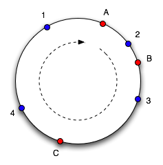
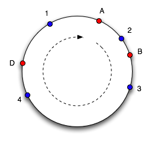
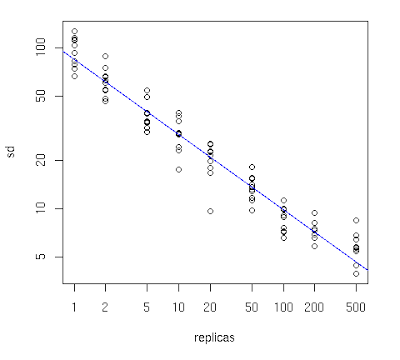

분산 시스템 기술 중 하나인 Consistent Hashing의 개념은 1997년에 MIT의 Karger가 웹 서버의 숫자가 수시로 변경되는 중에 분산 요청을 처리하기 위해 처음 고안했다고 하는데 그 내용을 살펴보고자 한다.

### 왜 필요한가?

N개의 캐시 시스템(노드)이 있다고 하고 이때 부하 분산에 사용하는 일반적인 방법은 Object o를 hash(o) mod n 번째 캐시 시스템에 저장하는 방식이다. 이런 방식은 캐시 시스템이 추가되거나 제거되기 전까지는 잘 운영된다.

그러나 캐시 시스템이 추가되거나 장애로 제거되었을 경우, n이 바뀌게 되면 모든 Object는 새로운 위치에 모두 재할당을 해야 하는데 그러기엔 부하 부담이 크다.
이때 Consistent Hashing 방법을 사용하게 되면 캐시 시스템이 추가되거나 작동이 중단되어도 모든 Object를 재할당하는 것이 아니라 추가되면 인접한 다른 캐시 시스템에서 적정한 양의 Object를 받게 되고 마찬가지로 제거된다면 남은 캐시 시스템들이 나누는 형태가 되어 일관되게 일부 Object에 대해서만 재할당을 수행하게 된다. 그러므로 기존에 저장된 대부분의 캐시를 사용할 수 있으며 시스템 변동이 히트율에 영향을 미치지 않게 된다.

기본 원리는 Consistent Hashing 알고리즘이 Object와 캐시 시스템 둘 다 동일한 Hash 함수를 사용해서 해싱하는 것이다. 캐시 시스템은 구간을 정하고 그 구간에는 많은 Object의 해시값을 가지고 있다. 캐시 시스템이 제거되면 인접한 구간의 캐시 시스템이 제거된 구간을 맡게 되고 다른 캐시 시스템은 영향을 받지 않는다.

Performance는 O(log n).

### 작동 방식은?

Hash 함수는 Object와 캐시 시스템이 일정 구간을 정하게 한다. Java 언어의 예를 보면 Object의 hashCode() 함수는 리턴을 int로 하고 리턴값 int의 구간은 -2^31에서 2^31-1을 가진다.
다음 그림은 네 개의 Object(1,2,3,4)와 3개의 캐시 시스템(A, B, C)가 링에 배치되어 있다.



위의 그림에서 1,4는 캐시 시스템 A에 들어가고 2는 B, 3은 C에 들어간다. 이때 C가 제거되었다고 가정하면 Object 3은 A에 들어간다. 기타 할당은 변하지 않는다. 다음 그림처럼 캐시 D가 추가되면, 3, 4는 D로 옮긴다. 그리고 1만 A에 남아있다.



이렇게 함으로써 각 캐시 시스템에 할당된 구간의 사이즈에 예외가 발생해도 잘 동작하게 된다. 한 가지 고민해야 할 점은 무작위로 분포되기 때문에 캐시 시스템 사이의 Object의 분포는 균일하지 않을 수 있다. 이를 위한 해결책으로 '가상 노드'를 사용하는 방법이 있다. 가상 노드는 캐시 시스템을 링 안에서 복제하는데, 이는 캐시 시스템 하나를 추가할 때마다 링에 여러 개 배치되게 되는 방식이다.

가상 노드의 효과는 다음 그래프와 같은데 10,000개의 Object를 10개의 캐시 시스템으로 시뮬레이션한 결과이다. X축은 캐시 시스템의 복제 수가 되고 Y축은 표준 편차이다.
복제 수가 작은 Object들의 분산도가 불균형한데 이는 캐시 시스템의 Object 수 평균의 표준 편차가 크기 때문이다. 이 실험에서 복제를 100이나 200으로 했을 경우 합리적인 균형을 실현할 수 있다고 한다. (표준 편차가 평균 5~10% 정도가 적당함)



시스템마다 다수의 Virtual Nodes(가상 노드)를 만들어서 로드밸런싱을 좋게 한 예는 [libketama](https://www.metabrew.com/article/libketama-consistent-hashing-algo-memcached-clients)이다.

### 구현 방법은?

Consistent Hashing 방법이 효력을 발휘하기 위해서는 해싱 함수가 잘 동작해야 하는데 Object의 hashCode로는 부족하고 MD5를 추천한다.
```java
public class ConsistentHash {

  private final HashFunction hashFunction;
  private final int numberOfReplicas;
  private final SortedMap circle =
    new TreeMap();

  public ConsistentHash(HashFunction hashFunction,
    int numberOfReplicas, Collection nodes) {

    this.hashFunction = hashFunction;
    this.numberOfReplicas = numberOfReplicas;

    for (T node : nodes) {
      add(node);
    }
  }

  public void add(T node) {
    for (int i = 0; i < numberOfReplicas; i++) {
      circle.put(hashFunction.hash(node.toString() + i),
        node);
    }
  }

  public void remove(T node) {
    for (int i = 0; i < numberOfReplicas; i++) {
      circle.remove(hashFunction.hash(node.toString() + i));
    }
  }

  public T get(Object key) {
    if (circle.isEmpty()) {
      return null;
    }
    int hash = hashFunction.hash(key);
    if (!circle.containsKey(hash)) {
      SortedMap tailMap =
        circle.tailMap(hash);
      hash = tailMap.isEmpty() ?
             circle.firstKey() : tailMap.firstKey();
    }
    return circle.get(hash);
  }

}
```

### 사용 사례는?

**1. NoSQL**

- [Amazon의 Dynamo](https://aws.amazon.com/ko/dynamodb/)
- [Memcached](http://memcached.org/)

**2. 오픈 소스**

- [Chord(분산 해시 테이블 구현)](https://github.com/sit/dht/wiki)
- [Last.fm's ketama](https://www.last.fm/user/RJ/journal/2007/04/10/rz_libketama_-_a_consistent_hashing_algo_for_memcache_clients)
- [java-memcached-client](https://github.com/dustin/java-memcached-client)
- [BitTorrent](https://en.wikipedia.org/wiki/BitTorrent)

Consistent Hashing은 노드가 빈번하게 추가·제거되는 분산 환경에서 재할당 비용을 최소화하면서 안정적인 부하 분산을 가능하게 한다. 가상 노드 기법과 결합하면 균일한 데이터 분포까지 확보할 수 있어, 대규모 캐시 클러스터나 분산 스토리지 설계에서 핵심 알고리즘으로 자리잡고 있다.
