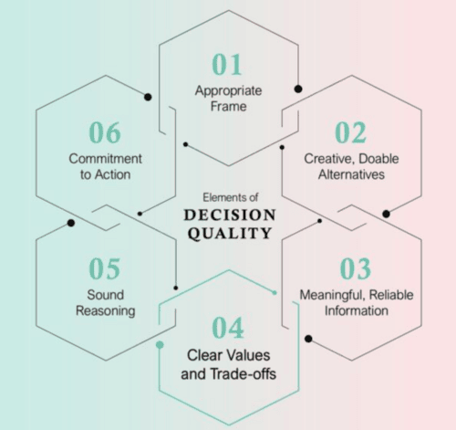

# Decision Quality 관점에서 바라본 소프트웨어 설계의 함정

생성형 AI와 Vibe Coding이 보편화되면서 소프트웨어 개발 방식은 빠르게 변하고 있다. 이제 코드를 작성하는 것 자체는 더 이상 어려운 일이 아니다. 프롬프트 몇 줄만으로 CRUD 화면, API, 데이터베이스 스키마, 테스트 코드까지 생성할 수 있다. 하지만 개발 속도가 빨라질수록 오히려 더 중요해지는 것이 있다. 바로 **설계 판단(Design Decision)** 이다. AI는 대안을 제시할 수 있고, 장단점을 설명할 수 있으며, 심지어 상당히 괜찮은 코드까지 생성한다. 그러나 지금 어떤 판단을 해야 하는지, 무엇을 우선해야 하는지, 어떤 위험을 감수해야 하는지는 결정하지 않는다.

실제로 AI 도입 이후 현장에서 관찰되는 많은 문제들은 새로운 문제가 아니다. 과거에도 존재했던 설계 실패 패턴들이 AI의 생산성과 결합하면서 훨씬 더 빠른 속도로 증폭되고 있을 뿐이다. 이 글에서는 Decision Quality(DQ)라는 의사결정 프레임워크를 기반으로 설계 실패 패턴을 체계적으로 정리해본다.

# 좋은 결과와 좋은 의사결정은 다르다

Decision Quality(DQ)는 [SDG](https://sdg.com/decision-quality/)에서 체계화한 의사결정의 품질을 다음 여섯 요소로 설명한다.

- Frame (무엇이 문제인가)
- Alternatives (어떤 선택지가 있는가)
- Information (정보는 충분한가)
- Values (무엇을 기준으로 평가하는가)
- Sound Reasoning (논리는 타당한가)
- Commitment to Action (실행 가능한가)

DQ의 가장 중요한 주장은 다음 한 문장으로 요약된다. **의사결정의 품질은 가장 약한 요소에 의해 결정된다.** 좋은 의사결정을 했더라도 결과가 나쁠 수 있다. 반대로 운 좋게 좋은 결과가 나왔다고 해서 좋은 의사결정을 한 것은 아니다. 설계 역시 마찬가지다. 많은 설계 실패는 사실 두 가지 문제로 귀결된다.

- 문제를 잘못 정의했다 (Frame 오류)
- 평가 기준을 잘못 잡았다 (Values 오류)

Values를 '평가축'으로 8개로 정리하고, Frame의 문제는 '지배축의 문제'로 파악한다. 나머지 4개 요소도 부차적으로 얽힌다. '성급한 결론'은 Information의 신뢰성 문제, '명목상 이름뿐인 완료'는 Commitment to Action의 누락, '바퀴의 재발명'과 '너무 이른 추상화'는 Alternatives의 빈곤, '임시방편의 영구화'나 '계층 침범 구현'은 Sound Reasoning의 논리 비약으로 읽을 수 있다. 가장 약한 요소가 전체의 품질을 결정한다는 DQ의 주장은 그대로 설계 판단에도 적용된다.

# 설계 판단의 8가지 평가축

설계를 평가할 때 사용하는 기준은 분야마다 이름이 다르다.

- [Decision Analysis](https://www.hup.harvard.edu/books/9780674931985)에서는 Criteria
- [ATAM](https://www.sei.cmu.edu/library/the-architecture-tradeoff-analysis-method/)에서는 Quality Attributes
- [ISO/IEC 25010](https://www.iso.org/standard/78176.html)에서는 Quality Characteristics

여기서는 이들을 통합하여 **평가축(Evaluation Axis)** 이라고 부르겠다. 설계 판단에 필요한 핵심 평가축은 다음 여덟 가지로 정리할 수 있다.

- **목적 적합성**: 현재 해결하려는 문제를 얼마나 잘 해결하는가.
- **제약 적합성**: 요구사항과 제약사항을 만족하는가.
- **실현 가능성**: 기술적으로 가능하고, 조직이 실제로 운영할 수 있는가.
- **품질 영향**: 유지보수성, 운영성, 확장성, 테스트 용이성 등에 미치는 영향이다.
- **시간 효과**: 단기적인 효과와 장기적인 효과를 함께 고려한다.
- **위험과 불확실성**: 예상 가능한 위험과 불확실성을 얼마나 통제할 수 있는가.
- **정합성**: 기존 아키텍처와 얼마나 일관되는가.
- **합의 가능성**: 팀과 조직이 실제로 받아들이고 실행할 수 있는가.

# 대부분의 실패는 지배축을 잘못 선택해서 발생한다

모든 평가축이 항상 동일하게 중요하지는 않다. 상황에 따라 가장 중요한 축이 존재한다. 이를 **지배축(Dominant Criterion)** 이라고 부른다. 예를 들어 장애 대응 상황이라면 **단기 시간 효과**가 지배축이 된다. 반대로 플랫폼 재설계라면 **장기 품질**, **유지보수성**, **확장성** 이 지배축이 된다.

문제는 대부분의 실패가 다음 구조를 가진다는 점이다.

> 실제 지배축 ≠ 선택한 지배축. 예를 들면,

- 장애 대응인데 이상적인 아키텍처를 고민한다.
- PoC인데 운영 품질을 요구한다.
- 보안 문제인데 UX만 고려한다.
- 장기 플랫폼인데 개발 속도만 본다.

이러한 지배축의 착오가 다양한 실패 패턴으로 나타난다. 그리고 여기에서 사용하는 용어를 다시 한번 요약해서 이해를 돕고자 한다.

- 평가축: 설계 판단에 사용하는 평가 기준(criteria).
- 지배축: 지금의 판단에서 가장 중시하는 평가축(Dominant Criterion).
- 2차 조건: 지배축만큼 중시하지 않지만, 채워야 할 수준을 결정해 두는 축. 예를 들어 지배축을 '시간 효과(단기)'로 해도 '제약 적합성'을 2차 조건으로 최저 수준은 확보한다는 형태로 사용할 수 있다. 또한, 실현가능성(기술)/실현가능성(조직)을 2차 조건으로 걸어서 리스크를 완화할 수도 있다.

# 설계 실패 패턴들

## 1. 바퀴의 재발명

이미 검증된 표준 해법이 있는데도 직접 구현하는 경우다. 대표적 사례는,

- 자체 인증 시스템을 만드는 것
- 자체 권한 시스템을 만드는 것
- 자체 스케줄러를 만드는 것
- 자체 에러 프로토콜을 만드는 것

Spring Security가 있는데 인증을 만들고, Quartz가 있는데 스케줄러를 만들고, HTTP 상태 코드가 있는데 자체 에러 체계를 만든다. 대개 "우리 서비스는 조금 특별하다"는 생각에서 시작된다. 그러나 대부분은 특별하지 않다. AI가 생성한 코드에서도 자주 나타나는 패턴이다. 코드는 동작하지만 프레임워크가 제공하는 정석적인 방법을 벗어나 있는 경우가 많다. 평가축의 편향으로는 목적 적합성은 과대평가하고 정합성, 실현 가능성(기술), 품질 영향(유지보수성)을 고려하지 않으면 일어나는 현상이다.

## 2. 닭 잡는데 소 잡는 칼 쓰기

과도하게 복잡한 기술을 선택하는 경우다. 예를 들어,

- 30명 규모 시스템에 마이크로서비스 도입하는 것
- 간단한 입력 검증(필수, 자리수, 정규식)이나 승인프로세스에 Drools 같은 룰 엔진을 도입하는 것
- 하루 500건 정도의 CSV 처리를 Kafka + Consumer Group으로 구성하는 것
- 월 1회 실행하는 보고서 생성 배치를 Spark 클러스터와 Kubernetes CronJob으로 운영하는 것

등이 있다. AI는 일반적으로 알려진 베스트 프랙티스를 맥락 없이 적용하는 경향이 있다. 그래서 실제 문제보다 훨씬 큰 해법을 제안하는 경우가 많다. 평가축의 편향으로는 목적 적합성은 과대평가하고, 실현 가능성(기술), 시간 효과(단기), 품질 영향(운용성-운영팀 역량), 합의 가능성 등을 고려하지 않으면 일어나는 현상이다.

## 3. 조직 수준을 무시한 설계

기술적으로는 맞지만 조직이 운영할 수 없는 경우다. 예를 들어,

- 24시간 온콜 체계가 없는 팀인데 멀티 리전 고가용성 아키텍처를 도입하는 것
- Kubernetes나 Kafka 운영 경험이 거의 없는 팀이 본격 도입하는 것
- DBA가 없는 팀에 복잡한 샤딩 + 멀티마스터 DB 구성을 처음부터 설계하는 것
- SRE 전담 인력이 없는 팀에 SLO, Error Budget, Chaos Engineering을 도입하는 것

그런데도 복잡한 분산 시스템을 도입한다. 기술적 가능성과 조직적 가능성은 다르다. 실무에서는 후자가 더 중요할 때도 많다. 평가축의 편향으로는 실현 가능성(기술)만 과대평가하고 조직의 실현 가능성, 품질영향(운용성-운영팀의 역량), 위험·불확실성을 고려하지 않으면 일어나는 현상이다.

## 4. 과도한 보수주의

반대로 조직 역량을 지나치게 낮게 평가하는 경우도 있다. 예를 들어,

- TypeScript 도입을 "타입 관리할 사람이 없다"며 거부하고 계속 JavaScript로 개발하는 것.
- 과거에 빌드 자동화가 실패한 경험이 있다고 해서 CI/CD를 포기하고 수동 빌드·배포를 유지하는 것
- 과거 Lambda/Stream API로 버그가 난 적이 있다고 해서, 모든 반복문을 확장 for문으로 강제하는 것.
- Optional 사용을 금지하고, null 체크를 호출하는 쪽에 모두 떠넘기는 것.

이유는 대부분 동일하다. **우리 조직은 그런 걸 못한다.** 문제는 이런 판단이 미래의 역량 성장 기회까지 제거한다는 점이다. 평가축의 편향으로는 조직의 실현 가능성을 낮게 보고, 위험과 불확실성을 통제할 수 없다고 생각하며 품질영향(확장성)은 안 좋고, 장기적인 시간 효과를 고려하지 않고 품질영향(유지보수성, 운영안정성)만 강조할 경우 일어나는 현상이다. 직원들이 역량을 키울 기회를 빼앗는다.

## 5. 임시방편의 영구화

긴급 대응은 필요하다. 문제는 임시 대응이 영구 구조가 되는 것이다. 예를 들어,

- 권한 처리를 프론트엔드에만 적용하고 백엔드에는 미루는 것
- 기존의 책임 분리를 무시하고 Controller에 비즈니스 로직 추가하는 것
- NullPointerException 피하기 위해 무분별한 null 체크 남발
- 실제 코드의 버그를 고치는 대신 테스트를 변경해서 통과시키는데에만 집중하는 것

단기 효과만 보고 장기 효과를 무시한 결과다. 평가축의 편향으로는 시간 효과(단기)만 과대평가하고 품질 영향, 시간 효과(장기)를 무시하면 일어나는 현상이다.

## 6. 성급한 결론

다음과 같은 착각이다.

- 가입 API를 호출했는데, 사용자가 생성, 환영메일 발송 등 처리가 완결되었는지 확인하지 않고 HTTP 200 반환을 성공으로 판단하는 것
- 테스트를 검증 가능한 범위(중요한 시나리오)를 고민하지 않고 단순 성공처리만 하는 테스트 케이스
- 배치에서 실제 처리건수 등을 확인하지 않고 정상 종료 로그만 보고 성공으로 판정하는 것

그러므로 성공했다. 하지만 실제 업무가 완료되었는지는 전혀 다른 문제다. AI 에이전트 역시 종료 코드와 성공을 동일하게 보는 경향이 있다. 평가축의 편향으로는 목적 적합성을 무시하고 위험과 불확실성을 고려하지 않으면 일어나는 현상이다.

## 7. 준비되지 않은 출발

요구사항이나 전략 없이 구현을 시작한다. 대표 사례는,

- 요구사항이 모호한 상태에서 화면, API, DB를 만들어 버리는 것
- 에러 발생 시 업무 처리가 정해지지 않았는데 예외 처리 코드를 먼저 작성하는 것.
- 권한 정책이 미정인데 UI에서만 숨기는 것.
- 데이터 이관 방침이 결정되기 전에 이관 스크립트를 먼저 작성하는 것.
- 성능 요구사항(건수, 응답시간)이 정해지지 않았는데 Redis 캐시를 처음부터 도입하는 것.

준비도 되지 않았는데 문제 해결을 한다. 동작하는 프로토타입이 문제 해결처럼 보이지만 실제로는 판단을 미룬 것뿐이다. 평가축의 편향으로는 목적 적합성과 제약 적합성, 품질 영향도 생각하지 않고 시간 효과(단기)만 보고 판단하면 일어나는 현상이다.

## 8. 너무 이른 추상화

변화가 관찰되지 않았는데 추상화를 도입한다. 예를 들어,

- 구현이 아직 하나밖에 없는데 Strategy 패턴을 도입하는 것.
- 검색 조건이 name과 status 두 개뿐인데 독자 DSL을 설계하는 것.
- 설정 항목이 거의 변하지 않을 것 같은데 미리 DB 기반 설정 관리 화면을 만드는 것.

대응하는 대표적인 원칙은 Rule of Three다. **같은 변화가 최소 세 번은 발생한 후 추상화하라.** 평가축의 편향으로는 품질 영향(변경 용이성)만 과대평가하고 목적 적합성이나 실현 가능성(기술), 시간 효과(단기)를 무시하면 일어나는 현상이다.

## 9. 제약조건의 후처리

업무 시스템에서는 기능보다 제약이 중요하다. 그런데 종종 제약을 무시한 채 개발을 시작한다.

- CRUD 기능을 먼저 만든 뒤, 나중에 권한 체크를 추가하는 것
- 데이터 갱신 기능을 만든 뒤에 감사 로그를 뒤늦게 추가하는 것
- 삭제 기능을 만든 후에 “이력 관리가 필요하다”는 요구를 받고 대응하는 것
- 동기 연동을 만든 후 재시도·멱등성(idempotency) 처리를 나중에 붙이는 것

결국 처음 설계가 뒤집힌다. 평가축의 편향으로는 제약 적합성, 위험·불확실성, 품질 영향 등을 고려하지 않으면 일어나는 현상이다.

## 10. 과거에 대한 과도한 배려

실제 사용자를 확인하지 않은 채 무한한 하위 호환성을 유지하려는 경우다. 대표 사례는,

- 기존 API를 깨뜨리지 않으려고 신규 API와 기존 API를 병렬로 계속 유지하는 것
- 오류 거부감 때문에 is_deleted, is_archived, is_suspended 같은 DB 칼럼이 계속 쌓이는 것
- 마이그레이션을 통해 기존 데이터를 변환하지 않고 구버전을 동시 지원하는 코드를 작성
- 상태 관리가 필요할 경우 열거형으로 변환하지 않고 기존 로직의 변경 거부감으로 새로운 값의 다른 필드를 계속 추가하는 것.

호환성은 중요하지만, 범위와 종료 시점이 없는 호환성은 기술 부채가 된다. 평가축의 편향으로는 제약 적합성만 과대평가하고 목적 적합성, 실현 가능성(기술), 품질영향(유지보수성), 시간 효과(단기)를 고려하지 않으면 일어나는 현상이다.

## 11. 명목상 이름뿐인 완료

완료 조건이 있지만 검증 가능한 형태가 아닌 경우다. 예를 들면,

- 구체적인 요구사항이 없이 "적절히 표시될 것"으로 표현하는 것
- 성능도 구체적 지표 정의 없이 "충분히 빠를 것"으로 표현하는 것
- UX 요구사항을 두리뭉실하게 "사용하기 편할 것"으로 정의하는 것
- 표시할 정보를 구체화하지 않고 "적절히 로그를 남길 것"으로 표현하는 것

이러한 표현은 완료 여부를 누구도 판단할 수 없다. AI가 "그럴듯한 수용 기준"을 매우 잘 만들어 내기 때문에, 문서가 존재한다는 사실만으로 요구사항이 명확하다고 착각하기 쉽다. 평가축의 편향으로는 합의 가능성, 목적 적합성, 품질 영향을 고려하지 않으면 일어나는 현상이다.

## 12. 계층 침범 구현

책임이 있어야 할 곳이 아닌 곳에 구현하는 경우다. 예를 들어,

- Controller에 도메인 규칙을 작성하는 것
- 백엔드의 도메인 권한 규칙 없이 화면 코드에서 권한을 판정하는 것
- SQL에 화면 표시 규칙 삽입하는 경우

AI는 "어디에 있어야 하는가"보다 "어디에 쓰면 동작하는가"를 우선하는 경향이 있다. 평가축의 편향으로는 정합성, 품질영향(유지보수성), 위험·불확실성을 고려하지 않으면 일어나는 현상이다.

## 13. 기존 관례를 무시한 올바른 말

일반적으로는 맞지만 현재 프로젝트에는 맞지 않는 경우다. 예를 들어,

- 기존 코드는 Checked Exception과 Business Exception을 구분하는데 신규 코드만 RuntimeException 사용하는 경우
- 기존 로깅 정책 무시하고 AI 코드만 전부 INFO 레벨로 하는 경우
- 기존 트랜잭션 정책 무시하고 서비스 계층에서만 트랜잭션을 열기로 했는데 Controller에 @Transactional 하는 경우
- 날짜 유틸리티 규약 무시하는 경우(테스트 가능성, 타임존 문제 등의 이슈가 생길 수 있음)
- JUnit4 프로젝트에 JUnit5 테스트 추가하는 경우

기술적으로는 옳더라도 조직 차원에서는 틀릴 수 있다. 또한 AI는 GitHub, StackOverflow, 공식 문서, 블로그 등을 통해 학습한다. 그래서 AI는 현재 프로젝트 규칙, 현재 조직 문화, 현재 코드 스타일을 잘 알지 못한다. 즉, 관례를 지정해야 한다. 평가축의 편향으로는 정합성, 목적 적합성, 실현 가능성(기술)을 고려하지 않으면 일어나는 현상이다.

## 14. 주변을 보지 않는 재구현

이미 존재하는 기능을 모르고 다시 구현한다. 대표 사례로,

- 날짜 유틸리티가 있지만 보지 않고 함수를 중복 생성하는 것
- 유효성 검사 규칙이 공통화 되어 있지만 동일 규칙을 로컬함수나 개별 컨트롤러에 중복 구현하는 것
- 권한 체크가 Decorator나 Interceptor에 구현되어 있으나 Controller에 개별적으로 구현하는 것
- 동일한 도메인 상수가 있지만 Constants.java 파일에 재정의하는 것

이 패턴은 Addy Osmani가 말한 Comprehension Debt의 전형적인 사례다. 평가축의 편향으로는 정합성, 품질영향(유지보수성), 합의 가능성 등을 고려하지 않아서 일어나는 현상이다. AI를 사용한다면 "신규 함수를 만들기 전에 기존 코드를 검색한다"는 규칙을 명시해 두면 중복 빈도를 낮출 수 있다.

## 15. 잡히지도 않은 미래를 위한 확장점

"너무 이른 추상화"와 비슷한 면이 있지만, "너무 이른 추상화"는 변화가 관찰되지 않은 상태에서 추상화이고, 여기에서는 미래의 연결고리가 없는 상황에서 미리 만들어 버리는 것이다. "언젠가 필요할 것 같다"는 이유로 확장 구조를 만드는 경우다. 예를 들어,

- 언젠가 DB가 여러 개 될지도 몰라서 멀티 데이터소스 환경을 구성하는 것
- 언젠가 SMS를 보낼지도 몰라서 SMS 발송 기능을 구현하는 것
- 언젠가 다국어 지원할지도 몰라서 다국어 버전을 구성하는 것
- 다른 PG사를 사용할 지 몰라서 결제 추상 클래스를 만드는 것

문제는 그 미래는 일정이 없고, 책임자도 없고, 비즈니스 가치도 명확하지 않다는 점이다. 미래는 계획이 아니라 가정일 뿐이다. 평가축의 편향으로는 시간 효과(장기)만 과대평가하고 시간 효과(단기), 실현 가능성(기술), 위험·불확실성은 고려하지 않아서 일어나는 현상이다.

# AI 시대에 설계가 더욱 중요해진 이유

흥미로운 사실은 이 모든 실패 패턴이 AI 이전에도 존재했다는 점이다. 새로운 문제는 아니다. 하지만 AI는 문제를 훨씬 빠르게 증폭시킨다.

AI는 빠르게 구현하고, 다양한 대안을 제시하며, 그럴듯한 코드를 만든다. 그러나 지금 내가 어떤 실패 패턴에 빠져 있는지는 알려주지 않는다. 결국 설계 판단은 여전히 인간의 책임이다. 특히 Vibe Coding 시대에는 과거처럼 선배의 코드를 읽으며 암묵지를 습득하기 어려워지고 있다. 따라서 앞으로 중요한 역량은 특정 기술을 아는 능력이 아니라, 지금의 지배축은 무엇인지, 어떤 평가축을 과대평가하고 있는지, 어떤 평가축을 무시하고 있는지, 지금 어떤 실패 패턴에 진입하고 있는지를 스스로 점검하는 능력이다. 좋은 설계란 정답을 맞히는 것이 아니다. 올바른 평가축 위에서 올바른 판단을 내리는 과정에 가깝다.

# 참조 사이트

- [Value-Focused Thinking](https://www.hup.harvard.edu/books/9780674931985)
- [SDG의 Decision Quality(DQ)](https://sdg.com/decision-quality/)
- [The Architecture Tradeoff Analysis Method](https://www.sei.cmu.edu/library/the-architecture-tradeoff-analysis-method/)
- [ISO/IEC 25010:2023](https://www.iso.org/standard/78176.html)
- [아키텍처 결정 문서화하기 (Documenting Architecture Decisions)](https://www.cognitect.com/blog/2011/11/15/documenting-architecture-decisions)
