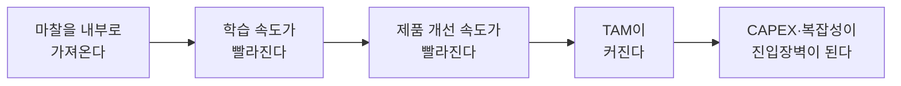

우수한 기술로 시작한 딥테크 스타트업 중 상당수가 Series A 언저리에서 멈춘다. 기술은 검증됐고 파일럿도 성공했는데, 다음 라운드로 넘어가는 매출 곡선이 나오지 않는다. 이 글은 그 정체가 기술의 문제가 아니라 판매 방식의 문제라는 관점에서 출발한다. 기술을 상품처럼 팔지 않고 시스템 전체를 소유하는 Full Stack 전략이 왜, 어떤 조건에서 이 정체를 뚫는 대안이 되는지, SpaceX와 Tesla부터 Anduril과 Earth AI까지 실제 사례를 통해 살펴본다. 딥테크 창업자와 이 영역에 투자하는 사람 모두에게 필요한 판단 기준을 다룬다.

시작하기 전에 짚어둘 것이 하나 있다. 벤처캐피탈의 역사를 거슬러 올라가면 원래 반도체와 컴퓨터 같은 하드웨어 기업이 중심이었다. 2000년대 중반 클라우드 컴퓨팅 이후에야 소프트웨어가 "기술"이라는 말을 독점하기 시작했다. "딥테크"라는 분류 자체가 이 소프트웨어 편향의 산물에 가깝다. 물리적 세계를 다루는 기술을 따로 떼어 놓고 리스크가 높다고 전제하는 순간, 그 기술이 시장에 닿는 방식에 대한 판단도 왜곡되기 쉽다. 이 글에서 "딥테크"라는 말을 그대로 쓰지만, 이 전제부터 의심하고 읽을 필요가 있다.

## 왜 딥테크 스타트업은 Series A에서 멈추는가

딥테크 스타트업의 초기 피치는 대개 기술 자체를 주인공으로 세운다. 배터리 밀도를 몇 퍼센트 높였는지, 모델의 정확도가 얼마나 개선됐는지, 특허가 몇 건인지가 슬라이드를 채운다. 문제는 이 기술이 인수 대상 기업의 눈에는 완제품이 아니라 톱니바퀴 하나로 보인다는 데 있다. 명함을 다섯 배 빠르게 스캔하는 AI가 아무리 정교해도, 그 기능은 영업 조직이 매일 쓰는 CRM 전체 워크플로 중 극히 일부에 지나지 않는다. 톱니바퀴 하나가 아무리 정밀해도 그것만으로 시계 전체를 교체할 이유가 되지는 않는다.

인컴번트(기존 업체)가 실제로 구매하는 것은 "좋은 기술"이 아니라 "전체 시스템"이다. 이 어긋남에서 다섯 가지 마찰이 생긴다.

| 마찰 유형 | 내용 | 구체적으로 드러나는 방식 |
|---|---|---|
| 통합 마찰 | 기존 워크플로에 맞추기 위한 조정과 커스터마이징이 계속 늘어남 | 파일럿마다 요구사항이 달라져 엔지니어링 리소스가 영업 지원에 소진됨 |
| 의사결정 마찰 | 구매를 결정하는 부서가 여럿으로 나뉨 | IT, 현업, 조달, 보안팀이 각각 다른 기준으로 승인을 미룸 |
| 운영 마찰 | 도입 후 교육과 유지보수, 감사 부담이 늘어남 | 신기술 하나 때문에 매뉴얼과 교육 과정을 새로 만들어야 함 |
| 조달 마찰 | 부분적 개선의 ROI로는 예산 항목을 만들기 어려움 | "5% 효율 개선"이 별도 예산 승인을 받을 만큼 크지 않다고 판단됨 |
| PoC-상용화 단절 | 품질, 공급, 안전, 규제 요건이 파일럿과 상용화 사이를 가로막음 | 파일럿에서는 문제없던 기술이 규제 인증 단계에서 다시 멈춤 |

이 다섯 가지 마찰은 우연이 아니라 구조적으로 반복된다. 스타트업의 런웨이는 보통 18~24개월이고, 다음 라운드를 준비하는 데 6개월 가까이 쓰인다. 실질적으로 성과를 증명할 수 있는 시간은 그보다 훨씬 짧다. 반면 기존 기업의 구매 사이클은 훨씬 길다. 자동차 제조사의 조달 사이클이 스타트업의 펀딩 주기보다 길어서, 기술력과 팀 모두 우수했던 머신러닝 소프트웨어 회사가 결국 자금이 바닥나 문을 닫은 사례가 실제로 있었다. 파일럿은 성사됐지만 상용 계약까지 이어지지 못하고 대기 상태에 머무르는 이런 상황을 업계에서는 "파일럿 연옥(Purgatory)"이라고 부른다. 이 대기 기간을 버티려고 정부 보조금이나 연구비에 의존하는 팀은 매출 곡선 대신 보조금 수주 실적을 진척으로 착각하는 함정에 빠지기 쉽다.

이 지점에서 "기술 진척"과 "사업 진척"이 서로 다른 지표라는 사실이 드러난다. 초기 투자자는 기술의 완성도를 보고 베팅하지만, Series A 이후 투자자는 매출과 스케일 가능성을 본다. 평가 기준이 질적으로 바뀌는 이 전환점에서 많은 팀이 준비되지 않은 채 기존 지표(특허 수, 벤치마크 점수)를 계속 들이민다. 결국 Series A 이후에는 기술력보다 사업 실행력이 평가받는다. 기술을 완성하는 능력과 그 기술을 시장에 관철시키는 능력은 다른 근육이고, 다섯 가지 마찰은 후자의 근육이 없을 때 스타트업을 갉아먹는다.

## 기술을 파는 회사와 시스템을 파는 회사

다섯 가지 마찰에 대한 하나의 답은 마찰이 생기는 접점 자체를 없애는 것이다. 기술을 기존 기업에 팔아 그들의 시스템에 끼워 넣는 대신, 스타트업이 그 시스템 전체를 직접 소유하는 전략을 Full Stack Startup이라 부른다. 2014년 이 개념을 처음 정리한 투자자 Chris Dixon은 "기존 업체와 경쟁자를 우회하는 완전한 엔드투엔드 제품이나 서비스"라고 정의했다. 이후 투자자 Ian Rountree는 이 접근을 물리적 세계를 다루는 하드웨어 기반 스타트업에 적용해 Full Stack Deep Tech라는 이름을 붙였다. 두 개념 모두 뿌리는 같다. 기술 하나를 부품으로 파는 대신, 그 기술을 축으로 삼아 산업 전체를 수직 통합(vertical integration)한다는 것이다.

이 선택이 유효한 이유는 세 가지로 나뉜다. 첫째, 기존 업체를 굳이 설득하지 않아도 된다. 소프트웨어를 경쟁 우위로 보지 않는 조직 문화 자체가 저항이 되는 경우가 많은데, Full Stack은 이 저항을 우회한다. 둘째, 최종 고객과 직접 관계를 맺으면서 경제적 이익을 더 많이 포착한다. 기술 라이선싱 모델의 근본적 약점은 기존업체가 기술의 우수성을 인정하면서도 협상력의 우위를 이용해 낮은 가격을 제시한다는 데 있다. 셋째, 여러 부품업체가 짜깁기한 제품과 달리 하나의 팀이 전 과정을 설계하면 사용자 경험이 일관된다. PC 부품을 조립한 컴퓨터와 애플 제품의 완성도 차이가 이 지점에서 갈린다.

기술을 부품으로 파는 회사에서 성과를 파는 회사로 넘어가는 과정은 하나의 축으로 정리할 수 있다.

로켓 엔진을 파는 회사와 위성 발사 서비스를 파는 회사는 같은 추진 기술을 갖고도 전혀 다른 사업이다. 앞 단계로 갈수록 기술이 가치의 대부분을 차지하지만 가격 결정권은 구매자에게 있고, 뒤 단계로 갈수록 가격 결정권은 판매자에게 넘어오지만 그만큼 운영 부담과 책임도 함께 넘어온다. Full Stack 전략은 이 축을 오른쪽으로 밀어붙이는 선택이다.

## 마찰을 내부로 가져오면 무엇이 달라지는가

Full Stack이 효과를 내는 경로는 하나의 인과관계 사슬로 설명할 수 있다.

기존 기업에 기술을 팔 때는 그 기술이 실제 운영에서 어떻게 쓰이고, 무엇 때문에 실패하는지에 대한 피드백이 여러 조직을 거쳐 희석된 채로 돌아온다. 반면 시스템 전체를 직접 운영하면 이 피드백이 곧바로 팀에 도달한다. 앞서 살펴본 다섯 가지 마찰(통합, 의사결정, 운영, 조달, PoC-상용화 단절)을 외부 협상의 대상이 아니라 내부에서 직접 풀어야 할 엔지니어링 문제로 바꾸는 것이다. 그 결과 시행착오 루프가 짧아지고, 스타트업의 경쟁력은 개발 속도가 아니라 이 학습 속도에서 나온다.

학습 속도가 빨라지면 제품 개선 속도도 함께 빨라지고, 이는 곧바로 시장 규모의 확장으로 이어진다. 로켓 엔진 판매 시장은 소수의 정부 기관과 방산 업체로 제한되지만, 위성 발사 서비스 시장은 통신, 지구관측, 국방까지 훨씬 넓은 수요를 포괄한다. SpaceX가 엔진 판매 대신 발사 서비스를 선택하면서 우주 산업 전체의 총유효시장(TAM)이 커진 것이 이 경로를 보여주는 사례다.

TAM이 커지는 동시에 역설적인 결과도 함께 따라온다. 시스템 전체를 소유하는 데 필요한 자본 지출(CAPEX)과 운영 복잡성이 후발 경쟁자에게는 그대로 진입장벽으로 작동한다. 이 장벽은 산업이 낡은 기술층에 의존하고 있을 때 특히 두드러진다. 스프레드시트로 재고를 관리하고 수기로 발주서를 처리하는 산업에서는 그 한 층만 자동화 소프트웨어로 바꿔서는 부가가치가 크지 않다. 여러 층이 서로 맞물려 있어서 시스템 전체를 다시 설계해야 비로소 가치가 드러나고, 그 재설계를 해낸 회사는 쉽게 따라잡히지 않는다.

## 왜 지금 Full Stack인가

Full Stack 전략이 논리적으로 옳다는 것과, 지금 이 시점에 실행 가능하다는 것은 다른 질문이다. 세 가지 변화가 겹치면서 지금이 실행 가능한 시점이 됐다.

첫째는 소프트웨어가 다룰 수 있는 영역 자체가 넓어졌다는 점이다. 스타트업의 무대는 소프트웨어 네이티브에서 AI 네이티브를 거쳐 이제 물리적 세계 네이티브로 옮겨가는 중이다. 결정론적 소프트웨어만으로는 제어할 수 없었던 공정, 즉 확률적 판단이 필요한 물류 최적화나 품질 검사 같은 영역까지 AI가 다루기 시작하면서, 소프트웨어로 하드웨어와 운영을 재구성할 수 있는 범위가 넓어졌다. 이런 근본적 전환에는 시차가 따른다. 증기기관이 전기로 대체될 때도 기술 자체의 전환보다 공장의 설계 사상이 바뀌는 데 훨씬 오랜 시간이 걸렸다. 지금의 AI 전환도 마찬가지로, 기술이 가능해진 시점과 그 기술을 중심으로 산업 전체가 재설계되는 시점 사이에는 간격이 있고 그 간격이 지금 열려 있다.

둘째는 자본 조달 환경의 변화다. 10년 전에는 초기 단계 스타트업이 대규모 자본을 조달하기 어려웠지만, 지금은 대형 라운드가 초기 단계에서도 가능해졌다. Full Stack이 요구하는 초기 CAPEX를 감당할 수 있는 자본 구조가 갖춰진 것이다.

셋째는 수요 구조 자체의 변화다. 탈탄소, 지정학적 긴장, 공급망 재편이 겹치면서 기존에 없던 수요가 새로 생겨나고 있다. 여기에 더해 교육, 의료, 식품, 운송, 금융서비스처럼 가격이 물가상승률을 앞질러 오른 산업들은 소프트웨어가 아직 손대지 못한 비용 구조를 그대로 안고 있다. 새로운 수요와 손대지 않은 비용 구조가 겹치는 지점에서, 만들어서 직접 공급하는 플레이어가 가치를 가장 많이 가져간다.

## American Dynamism이 Full Stack을 요구하는 이유

이 세 가지 변화가 가장 먼저 부딪히는 곳이 공급망, 제조, 국방, 우주, 에너지, 물류, 공공사업 같은 산업이다. 실리콘밸리 투자자들이 American Dynamism이라 부르는 이 영역에서 유독 Full Stack 기업이 많이 나오는 데는 네 가지 이유가 있다.

가치사슬이 길어서 한 지점만 개선해서는 전체 병목이 풀리지 않는다. 이해관계자가 많아서 부분적인 합의만으로는 결정이 나지 않는다. 제품이 아니라 운영 자체가 경쟁력의 원천이라서 기술을 팔아넘기는 순간 경쟁력도 함께 넘어간다. 그리고 기존 업체는 이미 굳어진 프로세스와 조직 구조 때문에 변화 속도가 느리다.

여기서 한 걸음 더 들어가면, 이 산업들이 애초에 왜 정체되어 있는지에 대한 근본적인 답이 나온다. 방위 산업이 1990년대 이후 소수의 대형 업체로 통합됐고, 고등교육 시장은 정부 인증을 받은 기관만 의미 있게 참여할 수 있는 구조로 굳어졌다. 이렇게 굳어진 대형 관료 조직은 내부 개혁만으로는 스스로를 바꾸지 못한다. 예산 구조, 인사 체계, 규제 대응 방식이 서로를 지탱하며 고착되어 있기 때문이다. 진보가 일어나는 경로는 기존 조직이 개혁하는 것이 아니라, 신규 진입자가 처음부터 새로운 제도와 프로세스를 세우는 것이다. Full Stack 전략은 이 경로를 택한 결과에 가깝다.

이렇게 자리 잡은 Full Stack 기업은 혼자 성장하는 데 그치지 않고 주변에 생태계를 만든다. SpaceX가 발사 비용을 낮추자 그 인프라를 딛고 다른 우주 스타트업들이 생겨난 것처럼, 1세대 Full Stack 기업이 기존 업체를 무너뜨리고 나면 그 자리를 메우는 2세대 스타트업들은 오히려 기존 업체에 기술을 판매하는 벤더 모델로 사업을 시작할 수 있게 된다. 여기에 더해 Tesla나 SpaceX 출신 인력이 산업의 세부 지식과 실리콘밸리식 조직 운영 방식을 함께 갖춘 채 다음 세대 창업자로 나서는 인재 배출 효과도 함께 따라온다.

## SpaceX부터 Earth AI까지, 여덟 기업의 선택

같은 기술을 갖고도 부품을 팔지 산업을 소유할지에 따라 회사의 궤적은 완전히 달라진다.

| 회사 | 기존 접근 | Full Stack 접근 | 핵심 경쟁력 |
|---|---|---|---|
| SpaceX | 엔진 판매 | 위성 발사 서비스 | 운영 |
| Tesla | 배터리 판매 | 완성차 제조·판매 | 제조 |
| Anduril | 방산 소프트웨어 공급 | 방산 시스템 직접 개발 | 통합 |
| Flexport | 물류 소프트웨어 공급 | 물류 운영 직접 수행 | 운영 |
| Zipline | 배송 드론 판매 | 배송 서비스 운영 | 서비스 |
| Solugen | 화학 기술 라이선싱 | 화학 제품 직접 생산 | 생산 |
| Hadrian | 제조 소프트웨어 공급 | 공장 직접 운영 | 제조 |
| Earth AI | 광물 탐사 소프트웨어 공급 | 채굴권 확보와 광물 개발 | 데이터와 운영 |

Earth AI의 전환 과정이 이 표의 논리를 가장 선명하게 보여준다. 위성 이미지와 AI로 광물 매장지를 찾아내는 소프트웨어를 광산 회사에 팔던 초기 모델에서, 직접 채굴권을 사들이고 지질학자를 고용해 광산을 운영하는 모델로 옮겨간 것이다. 소프트웨어 라이선스 수익 대신 땅속의 실제 광물을 소유하는 쪽을 택한 셈이고, 이는 협상력 없이 기술만 팔 때 가치의 대부분을 구매자에게 뺏기는 문제를 정면으로 피해가는 선택이다. 폐가스를 비트코인 채굴에 쓰다가 지금은 AI 데이터센터에 전력을 공급하는 사업으로 옮겨간 에너지 기업의 궤적도 비슷하다. 상품을 팔던 회사가 스스로 그 상품을 소비하는 서비스 운영자로 옮겨가는 흐름은 뒤에서 다룰 Outcome 전략과 정확히 같은 방향을 향한다.

## Full Stack 기업들에서 반복되는 다섯 가지 패턴

여덟 기업의 사례를 나란히 놓고 보면 다섯 가지 패턴이 반복된다.

| 패턴 | 설명 |
|---|---|
| 제품보다 운영이 중요하다 | 기술은 완성됐다고 끝나는 것이 아니라 매일 반복되는 운영 속에서 계속 개선되며, 이 운영 노하우 자체가 경쟁사가 베끼기 가장 어려운 자산이 된다 |
| 자본 집약적이다 | 부품 하나만 파는 경쟁사보다 훨씬 많은 자본이 필요하고, 이는 뒤에서 다룰 투자 유치의 난이도와 직결된다 |
| 멀티 프로덕트로 확장한다 | 고객 접점과 운영 인프라를 이미 갖춘 상태에서는 인접 제품을 추가하는 쪽이 완전히 새로운 사업을 시작하는 것보다 훨씬 수월하고, 이 확장이 커진 자본 수요를 정당화하는 근거가 되기도 한다 |
| N-of-1 기업이 된다 | 매머드를 복원하는 회사나 위성 사진으로 공룡 화석을 찾아내는 회사처럼 아예 새로운 카테고리를 만들어낸 회사는 비교할 경쟁사 자체가 없어, 그 분야의 유일한 구심점이 되는 것만으로 사업이 성립한다 |
| Enabler가 된다 | SpaceX가 발사 비용을 낮춰 다른 우주 기업들의 사업을 가능하게 만든 것처럼, Full Stack 기업은 성장하면서 자신도 모르게 산업 전체의 인프라 역할을 떠맡는다 |

## Full Stack이 맞는 사업과 맞지 않는 사업

다섯 가지 패턴이 있다고 해서 모든 딥테크 스타트업이 Full Stack을 택해야 하는 것은 아니다. 오히려 이 전략은 특정 조건에서만 유효하고, 조건을 벗어난 곳에 적용하면 불필요하게 자본만 태운다.

먼저 맞지 않는 경우부터 짚는다. 창약처럼 기술 자체만으로 큰 비즈니스가 성립하는 분야, 통합 마찰이 거의 없어 기술이 그대로 꽂히는 경우, 기술성숙도(TRL)가 극히 낮아 과학적 검증이 병목인 경우, 최종 제품에서 브랜드나 감성적 가치가 지배적인 경우는 Full Stack의 대상이 아니다.

| 부적합 조건 | 이유 |
|---|---|
| 기술 단독으로 큰 사업이 성립하는 경우 | 창약처럼 특허와 임상 데이터 자체가 가치의 대부분을 차지해 별도 시스템이 필요 없음 |
| 통합 마찰이 거의 없는 경우 | 기존 워크플로에 바로 꽂히는 기술이라면 시스템을 소유할 이유가 없음 |
| TRL이 극히 낮은 경우 | 과학적 검증 자체가 병목이라 시스템을 만들어도 검증 속도는 빨라지지 않음 |
| 브랜드·감성 가치가 지배적인 경우 | 최종 제품의 가치가 기술이 아니라 소비자의 정서적 선택에서 나옴 |

핵융합처럼 기술성숙도 자체가 병목인 영역에는 투자자들도 손을 대지 않는다고 공공연히 밝힌다. 아무리 시스템을 잘 설계해도 과학적 검증에 걸리는 시간을 앞당길 수는 없기 때문이다.

반대로 맞는 경우는 다음 조건을 만족할 때다.

| 적합 조건 | 이유 |
|---|---|
| 수요 위험이 낮은 코모디티 제품 | 에너지, 화학처럼 기능이 동일해 가격이 구매를 결정하므로 기술이 만드는 원가 우위가 그대로 판매로 이어짐 |
| 하드웨어·소프트웨어·운영이 강하게 결합된 경우 | 층 사이 결합이 강해 시스템 최적화와 학습곡선 자체가 경쟁력이 됨 |
| 실증이 어려운 사업 | 작게라도 풀스택으로 실증해 설득에 걸리는 시간을 줄인 뒤, 이후 밸류체인을 축소해 고이익 영역에 집중할 수 있음 |
| 멀티프로덕트로 확장 가능한 사업 | 고객 접점과 자본 규모가 이미 갖춰져 있어 제품 라인 확장이 쉬움 |
| 통합·규제 장벽이 높고 밸류체인이 파편화된 산업 | 건설, 교육, 화물운송, 반도체 제조, 공공사업처럼 기존 업체가 진입장벽 뒤에서 안주해온 산업 |

이 기준을 관통하는 원칙은 하나로 압축된다. 기술 리스크는 감수하되 시장 리스크는 최대한 낮춰야 한다는 것이다. 기술이 어려운 문제를 풀어냈을 때 사람들이 그 결과물을 사려 한다는 확신이 이미 있어야 하고, 그 확신이 없는 상태에서 풀스택까지 떠안으면 기술 리스크와 시장 리스크가 동시에 쌓여 감당하기 어려워진다.

## Full Stack Deep Tech를 실행하는 방법

조건이 맞다고 판단했다면, 다음은 실행의 문제다. 네 가지 원칙이 반복해서 등장한다.

| 실행 원칙 | 핵심 내용 | 대비되는 사례 |
|---|---|---|
| 높은 구상력 | 기술 로드맵뿐 아니라 제조, 공급, 규제, 가격 구조까지 시스템 전체를 미리 설계함 | 에디슨은 전구 하나가 아니라 발전과 송전, 구리 비용까지 통합해 설계했다 |
| 스테이지 게이트 | 1에서 10, 100, 1000으로 단계를 밟아 스케일업하며 각 단계에서 검증하고 다음으로 넘어감 | 한 항공 스타트업은 초기에 여러 기종을 동시에 추진하다 자원이 분산돼 좌초했고, 한 배터리 스타트업은 검증 없이 대규모 공장부터 지었다가 원가 문제로 휘청였다 |
| 속도와 품질의 분리 운영 | 빠른 반복이 필요한 조직과 납기·품질을 지켜야 하는 조직을 분리해 설계함 | SpaceX는 프로토타입을 빠르게 반복하며 실패를 통해 배우는 쪽을 택했고, 경쟁사 Blue Origin은 공학적 완벽성을 먼저 추구하다 시장 진입이 늦어졌다 |
| 자본과 인재 확보 | 지분 투자 외에 보조금, 부채, 프로젝트 파이낸싱, 사업회사 투자까지 다변화하고, 연구자부터 운영·규제 담당자까지 폭넓은 인재를 모음 | 풀스택은 더 많은 자본을 요구하는 만큼, 그 자본을 끌어올 수 있는 구심력을 가진 창업자가 필요함 |

이 네 원칙은 서로 독립적이지 않다. 구상력이 없으면 스테이지 게이트의 각 단계를 무엇을 기준으로 나눌지조차 정하기 어렵고, 속도와 품질을 분리하지 못하면 스테이지 게이트를 아무리 촘촘히 설계해도 조직이 병목에 걸린다. 그리고 이 모든 실행에는 결국 더 많은 자본과, 그 자본을 설득할 수 있는 창업자가 전제로 깔린다.

## Product에서 Outcome으로 넘어갈 때 생기는 일

Full Stack 전략의 끝에는 제품을 넘어 성과 자체를 파는 단계가 있다. 자율주행 기술을 완성차에 넣어 파는 회사와, 그 기술로 승차 서비스를 직접 운영하는 회사, 나아가 "목적지까지 안전하게 도착한다"는 결과를 계약으로 보장하는 회사는 같은 기술을 쓰면서도 완전히 다른 사업이다.

| 단계 | 파는 것 | 사례 |
|---|---|---|
| Product | 완제품 | 자율주행 소프트웨어를 탑재한 차량 판매 |
| Service | 운영까지 포함한 서비스 | 승차 서비스를 직접 운영하는 모델 |
| SLA | 계약으로 보장하는 서비스 수준 | 정해진 시간 안에 도착을 보장하는 배송 계약 |
| Outcome | 결과 자체 | 로봇을 서비스형으로 제공하며 가동률을 보장하는 모델 |

이 표의 아래로 갈수록 고객이 지불하는 가격에서 사업자가 가져가는 몫은 커지지만, 그만큼 사업자가 떠안는 운영 부담도 커진다. 성공보수를 받는 소송 대리가 좋은 반례다. 승소라는 결과 자체를 파는 순간 변호사 한 명이 동시에 맡을 수 있는 사건 수가 사업의 상한선이 되어, 소프트웨어처럼 한계비용 없이 확장되지 않는다. Outcome으로 갈수록 무조건 더 나은 사업이 되는 것이 아니라, 이익률과 확장성이 서로를 깎아 먹는 지점이 있다는 뜻이다. 그래서 이 단계 이동은 목표가 아니라 트레이드오프이고, 어디까지 이동할지는 운영 부담을 감당할 수 있는지에 달려 있다.

## 투자자는 왜 Full Stack에 끌리고 왜 주저하는가

이 전략을 판단하는 사람은 창업자만이 아니다. 투자자 입장에서 Full Stack Deep Tech는 매력과 리스크가 같은 크기로 따라오는 베팅이다.

| 매력 요인 | 내용 |
|---|---|
| 큰 TAM | 부품 시장이 아니라 산업 전체 시장을 겨냥함 |
| 큰 Exit | 시스템을 소유한 회사는 매각이나 상장에서 훨씬 큰 가치로 평가받음 |
| 높은 진입장벽 | 자본과 운영 복잡성이 후발 경쟁자를 막아줌 |
| 속도 | 마찰을 내부화한 만큼 의사결정과 개선이 빠름 |
| 학습 | 운영에서 나온 데이터가 곧바로 제품 개선으로 이어짐 |

| 리스크 요인 | 내용 |
|---|---|
| CAPEX | 초기 자본 요구가 커서 트랙션이 없는 상태에서도 큰 수표를 써야 함 |
| 긴 회수 기간 | 손익분기점까지 걸리는 시간이 길어 후속 펀딩 리스크가 커짐 |
| 운영 리스크 | 기술 리스크에 더해 공급망, 제조, 인력 관리라는 실행 리스크가 얹힘 |
| 규제 | 산업마다 다른 인증과 규제 절차가 진입 속도를 늦춤 |

기술을 대기업에 파는 모델, 순수 과학을 상용화하는 모델, 이미 포화된 시장에서 N번째 경쟁자로 뛰어드는 모델을 투자자들이 걸러내는 이유도 이 리스크 요인 표에서 나온다. 세 모델 모두 시장 리스크나 기관의 관성이라는, 스타트업이 자본으로도 통제할 수 없는 변수에 발목이 잡히기 때문이다. 이 판단 기준은 투자자에게만 유효한 것이 아니다. 창업자 스스로도 자신의 사업이 이 리스크 요인들에 얼마나 해당하는지 냉정하게 따져봐야, 얼마나 많은 자본과 얼마나 긴 인내가 필요한 싸움인지 미리 가늠할 수 있다.

## 기술이 아니라 시스템을 설계하는 일

Series A에서 멈추는 딥테크 스타트업 대부분은 기술이 부족해서가 아니라 그 기술을 기존업체의 시스템에 끼워 넣으려다 다섯 가지 마찰에 발목이 잡혀서 멈춘다. Full Stack 전략은 이 마찰과 협상하는 대신 마찰이 생기는 시스템 자체를 소유해버리는 선택이고, 그 대가로 더 많은 자본과 더 넓은 역량을 요구한다. 이 선택이 만드는 결과는 세 가지로 요약된다. 기술이 아니라 시스템을 만들고, 완제품이 아니라 성과를 만들고, 부품이 아니라 산업 자체를 재구성한다. 조건이 맞는 딥테크 스타트업에게 이것은 더 어려운 길이 아니라, Series A 너머로 성장하게 만드는 검증된 길이다.

## 참조 사이트

- [The VC case for 'full stack deeptech'](https://www.latitudemedia.com/news/catalyst-the-vc-case-for-full-stack-deeptech/)
- [Full-Stack Startups in American Dynamism](https://a16z.com/full-stack-startups-in-american-dynamism/)
- [The Full-Stack Startup](https://a16z.com/the-full-stack-startup/)
- [Don't call it "deep tech"](https://cantosventures.substack.com/p/dont-call-it-deep-tech-0e5aa0a1f1fe)
- [Full-Stack Deep Tech](https://felixneubeck.substack.com/p/full-stack-deep-tech)
- [The most overlooked path to commercialize AI is for companies to do it themselves](https://techcrunch.com/2019/04/15/the-most-overlooked-path-to-commercialize-ai-is-for-companies-to-do-it-themselves/)
