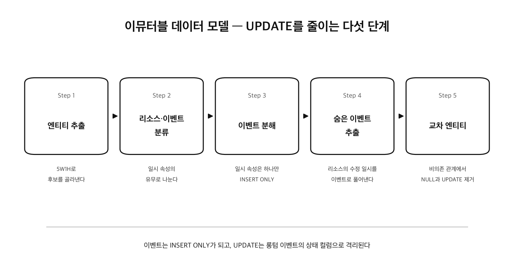

CRUD 중에서 시스템을 가장 복잡하게 만드는 것은 UPDATE다. INSERT는 새로운 사실을 추가하고 DELETE는 사실을 제거할 뿐이지만, UPDATE는 이미 있는 사실을 덮어쓴다. 덮어쓰기에는 반드시 규칙이 따라붙는다. 어떤 상태에서 어떤 상태로 바뀔 수 있는지, 어느 업무가 어느 컬럼을 갱신해도 되는지, 갱신 전의 값은 남겨야 하는지 같은 것들이다. 문제는 이 규칙들이 데이터 모델에는 드러나지 않고 개별 화면 설계서나 배치 설계서에 흩어져 기록된다는 점이다. 업무 자체에 복잡한 규칙이 있는 것은 어쩔 수 없더라도, 시스템과 설계가 그 위에 복잡성을 더 얹는 일은 피하고 싶다.

덮어쓰지 않고 변화를 기록하는 구조는 이미 일상에 있다. 통장이 그렇다. 입금과 출금은 한 줄씩 추가될 뿐 이미 적힌 줄은 고쳐지지 않고, 잘못 보낸 돈도 지난 줄을 고치는 대신 정정 거래를 한 줄 더 적어 바로잡으며, 현재 잔액은 쌓인 거래의 결과를 요약한 숫자일 뿐이다. **Immutable Data Model** 은 데이터 모델을 이 통장처럼 설계해서 UPDATE의 발생 자체를 설계 단계에서 줄이는 모델링 기법이다. 일어난 일은 새 행으로 추가하고(INSERT), 덮어쓰기가 필요한 자리는 잔액처럼 요약 값 한 곳으로 좁혀 격리한다.

이 기법은 다섯 단계의 절차로 구성되어 있어서, 절차를 따라가면 설계자 간 스킬 편차도 어느 정도 흡수할 수 있다. 이 글은 테이블 설계와 ER 다이어그램을 그리는 개발자를 대상으로, 엔티티 추출부터 교차 엔티티 도입까지 각 단계를 온라인 쇼핑몰 예제로 설명한다.



## Step 1. 5W1H로 엔티티를 추출한다

절차의 출발점은 요구사항 문서에서 엔티티 후보를 골라내는 일이다. 기준은 5W1H다.

| 구분 | 쇼핑몰에서의 엔티티 후보 예 |
|---|---|
| Who | 회원, 판매자, 상담원, 배송 기사 |
| What | 상품, 재고, 쿠폰, 리뷰 |
| When | 날짜, 월, 연도, 판촉 기간 |
| Where | 배송지, 창고, URL |
| Why | 주문, 반품, 결제, 환불 |
| How | 주문서, 청구서, 영수증 |

예를 들어 다음 요구사항 문서가 있다고 하자.

> 주문 담당자가 주문 리스트를 바탕으로 상품의 재고를 확인하고, 재고가 있으면 상품을 주문자가 주문 시 지정한 배송지 주소로 발송한다.

여기서 5W1H에 해당하는 단어에 밑줄을 긋는다. 주문 담당자와 주문자(Who), 상품과 재고(What), 배송지 주소(Where), 주문과 발송(Why)이 각각 엔티티와 그 속성의 후보가 된다.

### 구현 방식을 먼저 정하지 않는다

엔티티를 추출하는 단계에서 "이건 프로퍼티 파일로 하자", "이건 enum으로 충분하다"처럼 구현을 미리 정하고 엔티티에서 제외하는 경우가 있는데, 이는 조기 최적화다. 이 단계에서는 그 아이디어가 최적의 구현인지 알 수 없다.

더 큰 문제는 시스템 규모를 정확히 표현할 수 없게 된다는 점이다. 기능 규모 측정에 쓰이는 Function Point의 NESMA 개산법은 규모를 다음 식으로 추정한다.

```text
FP = 35 × ILF(시스템 내부에서 관리하는 엔티티 수) + 15 × EIF(시스템 외부에서 관리하는 엔티티 수)
```

엔티티 수가 시스템 규모에 비례한다는 뜻이다. 테이블로 구현하지 않을 것 같다는 이유로 엔티티에서 빼 버리면 시스템 규모가 실제보다 작게 잡히고, 그 위에서 세운 견적과 일정도 함께 어긋난다.

### 엔티티 이름 짓기

엔티티 이름은 짧으면서 의미를 정확히 담아야 한다. 클래스명이나 변수명과 같은 원칙이지만, 엔티티명은 이후 테이블명, 클래스명, API 이름까지 모든 명명에 영향을 주기 때문에 특히 중요하다. 우선 없어도 의미가 통하는 단어는 붙이지 않는다. "정보", "데이터", "처리", "마스터", "기록", "관리", "이력" 같은 단어가 대표적이다. "회원 정보"는 "회원"으로, "주문 데이터"는 "주문"으로 충분하다.

논리 설계는 한글명, 물리 설계는 영문명으로 나누고 영문 명명을 후공정으로 미루는 프로젝트도 있는데, 그럴 필요는 없다. 용어 사전을 만들어 한글명과 영문명을 세트로 정의하면서 동시에 명명하면 된다. 다만 이 방식에서는 영문명이 길어지기 쉬우므로 용어 사전에 영문 단축명도 함께 준비해 두는 것이 좋다. 단축명을 만들 때는 일률적으로 모음을 빼는 규칙(PRODUCT를 PRDCT로, CATEGORY를 CTGRY로)이 오래된 관행으로 자주 쓰이는데, 이 "일률적"이라는 것이 문제다. 발음할 수 없거나 서로 구별되지 않는 이름이 만들어지기 때문이다. 이런 이름은 운영 환경에서 긴급하게 SQL을 실행해야 할 때 발목을 잡는다. 단축명일수록 발음할 수 있는지, 다른 이름과 확실히 구별되는지를 우선하자.

### 엔티티에 대해 관계자와 합의할 세 가지

이름을 정했다면 그 엔티티가 무엇을 가리키는지 관계자 전원의 인식을 맞춘다. 확인할 것은 세 가지다.

- **단일성(Oneness)**: 무엇을 하나로 세는가
- **동일성(Sameness)**: 두 개가 같다고 판정하는 기준은 무엇인가
- **카테고리(Category)**: 어디까지가 이 엔티티에 들어가는가

쇼핑몰의 "상품" 엔티티라면 이런 질문이 된다. 색상과 사이즈가 다른 티셔츠는 하나의 상품인가, 색상·사이즈 조합마다 별개의 상품인가(단일성). 가격과 상품 설명을 아무리 고쳐도 같은 상품인가, 리뉴얼되면 다른 상품으로 취급하는가(동일성). 실물 배송 상품만 가리키는가, 디지털 콘텐츠와 상품권도 포함하는가(카테고리). 답은 조직과 업무에 따라 달라지며 절대적인 정답은 없다. 정답이 없기 때문에 초기에 합의해 두지 않으면, 관계자 각자가 서로 다른 상품을 상상한 채 설계가 진행된다.

## Step 2. 리소스와 이벤트로 분류한다

추출한 엔티티는 **리소스** 와 **이벤트** 로 나눈다. 기준은 명확해서, 일시 속성을 갖는지만 보면 된다.

| 엔티티 | 일시 속성 | 분류 |
|---|---|---|
| 주문 | 주문 일시 | 이벤트 (E) |
| 발송 | 발송 일시 | 이벤트 (E) |
| 회원 | 없음 | 리소스 (R) |
| 상품 | 없음 | 리소스 (R) |

엔티티명에 "~한다"를 붙여 보는 방법으로도 판별할 수 있다. "주문한다"는 자연스럽지만 "회원한다"는 성립하지 않는다. 즉 이벤트는 동사에서 나온 엔티티다. Step 1의 5W1H와도 대응해서, Who·What·When·Where에서 나온 엔티티는 리소스, Why·How에서 나온 엔티티는 이벤트가 된다. ER 다이어그램에는 엔티티명에 (R), (E)를 붙여 한눈에 구별되게 해 두면 이후 단계가 수월하다.

주의할 점은 여기서 말하는 일시 속성의 범위다. "청구 예정일"처럼 미래의 예정을 나타내는 속성이나 "유효 기간", "적용 시작일"처럼 데이터의 라이프사이클을 나타내는 속성은 해당하지 않는다. 이벤트 엔티티는 업무 활동의 기록이고, 여기서 말하는 일시 속성은 그 활동이 실제로 행해진 시점을 가리킨다.

### 마스터와 트랜잭션이라는 분류를 쓰지 않는 이유

엔티티 분류에는 전통적으로 마스터(잘 변하지 않는 것)와 트랜잭션(자주 변하는 것)이라는 구분이 쓰여 왔다. 하지만 이 구분은 판별 기준도 쓰임새도 모호해서, 사소한 논쟁으로 시간을 낭비하게 만들기 쉽다.

> "시스템에서 업데이트하지 않는 것을 마스터로 합니다."
>
> "이번에 추가된 마스터 관리 화면에서 업데이트되지 않나요?"
>
> "관리 화면은 관리자만 쓰니까 예외로 합니다."
>
> "네. 아, 그런데 상품 마스터는 입점 판매자 시스템에서 넘어와 매일 동기화되는데 이건 어느 쪽인가요?"

이 논쟁에서는 아무것도 결정되지 않는다. 대화 중에 쓰는 것까지 막을 이유는 없지만, 설계 문서와 코드에는 리소스와 이벤트라는 분류를 쓰는 편이 좋다. 일시 속성의 유무라는 기준은 이런 논쟁의 여지를 남기지 않는다.

## Step 3. 이벤트 엔티티는 일시 속성을 하나만 갖게 한다

분류가 끝나면 리소스와 이벤트 각각에 대해 설계 방식이 달라진다. 먼저 이벤트에서 할 일은 하나다. 이벤트 엔티티가 일시 속성을 단 하나만 갖도록 분해한다.

깊이 생각하지 않고 만든 이벤트 엔티티는 일시 속성을 여러 개 갖는 경우가 많다.

```text
[분해 전] 주문 (E)
  주문ID, 회원ID, 주문일시, 확인자ID, 주문확인일시, 송장번호, 발송일시, 취소사유, 취소일시

[분해 후]
  주문      (E): 주문ID, 회원ID, 주문일시
  주문 확인 (E): 주문ID, 확인자ID, 확인일시
  발송      (E): 주문ID, 송장번호, 발송일시
  취소      (E): 주문ID, 취소사유, 취소일시
```

분해 전 형태는 일시 속성의 수만큼 UPDATE가 발생한다는 뜻이다. 주문 시점에는 주문 일시 이후의 컬럼이 전부 NULL인 채로 INSERT되고, 확인·발송·취소 업무가 진행될 때마다 해당 컬럼이 UPDATE된다. 그러면 갱신 규칙이 따라붙는다. "주문 확인 시에는 확인자ID와 주문확인일시 외에는 갱신해서는 안 된다", "취소는 발송 전에만 가능하다" 같은 규칙들이다. 이 규칙은 엔티티에서 읽어낼 수 없고 화면 설계서와 배치 설계서에 흩어지며, 복잡성이 단숨에 늘어난다.

같은 업무(3번 주문의 주문 확인)를 SQL로 비교하면 차이가 분명해진다.

```sql
-- 분해 전: 기존 행을 덮어쓴다
UPDATE 주문
   SET 확인자ID = 17, 주문확인일시 = '2026-07-18 10:30'
 WHERE 주문ID = 3
   AND 취소일시 IS NULL;  -- 취소된 주문을 덮어쓰지 않도록 조건도 함께 관리해야 한다

-- 분해 후: 새로운 사실을 추가한다
INSERT INTO 주문확인 (주문ID, 확인자ID, 확인일시)
VALUES (3, 17, '2026-07-18 10:30');
```

분해 전 쪽은 WHERE 조건과 SET 대상 컬럼이 곧 갱신 규칙이고, 이 규칙은 주문을 갱신하는 화면과 배치마다 반복해서 지켜져야 한다. 분해 후 쪽은 각 엔티티에 해당 업무 시점에 INSERT가 한 번 일어날 뿐이라 덮어쓸 대상이 없고, 갱신 규칙이 생길 자리도 없다. 업무 활동이 엔티티로 명확하게 드러나고, 정규화의 원칙인 "One fact in one place"도 자연스럽게 실현된다.

### 시작과 끝이 있는 이벤트는 롱텀 이벤트로 감싼다

업무에서 인식하는 이벤트에는 시작과 끝이 있어 시점이 하나로 잡히지 않는 경우가 많다. 이때도 일시 속성 하나라는 원칙은 유지하되, 큰 이벤트가 지금 어떤 상태인지 보고 싶은 요구가 있으므로 이를 표현하는 엔티티를 하나 더 둔다. 이것이 **롱텀 이벤트** 패턴이다.

반품이 좋은 예다. 회원이 반품을 신청하고, 반송된 상품을 검수하고, 문제가 없으면 환불한다. 반품이라는 긴 이벤트 안에서 상세 이벤트가 차례로 일어난다.

```text
반품 (롱텀 이벤트): 반품ID, 현재상태          ← UPDATE는 여기에만 발생
  └ 반품 액티비티 (슈퍼타입): 반품ID, 일시
      ├ 반품 신청 (E): 주문ID, 반품 사유
      ├ 검수      (E): 검수자, 검수 결과
      └ 환불      (E): 환불 수단, 환불 금액
```

상세 이벤트는 공통으로 일시 속성을 가지므로 슈퍼타입인 반품 액티비티로 묶는다. 반품 하나가 진행되는 동안 각 테이블에 데이터가 어떻게 쌓이는지 따라가 보면 다음과 같다.

```text
7월 1일, 회원이 반품을 신청한다
  반품          ← INSERT (반품ID=9, 현재상태='신청')
  반품 액티비티 ← INSERT (반품ID=9, 7/1 10:00)
  반품 신청     ← INSERT (반품ID=9, 주문ID=3, 반품사유='사이즈 불일치')

7월 3일, 반송품을 검수한다
  반품          ← UPDATE (현재상태='검수')   ※ UPDATE는 이 한 곳뿐
  반품 액티비티 ← INSERT (반품ID=9, 7/3 14:00)
  검수          ← INSERT (반품ID=9, 검수자ID=17, 검수결과='정상')

7월 4일, 환불한다
  반품          ← UPDATE (현재상태='환불')
  반품 액티비티 ← INSERT (반품ID=9, 7/4 09:00)
  환불          ← INSERT (반품ID=9, 환불수단='카드', 환불금액=32,000)
```

업무가 진행될수록 행이 추가될 뿐이고, UPDATE가 발생하는 곳은 롱텀 이벤트인 반품의 상태 컬럼 하나로 격리된다. 상세 이벤트들은 일시 속성 하나짜리 INSERT ONLY 엔티티로 유지된다. 서론의 통장으로 치면 거래 내역은 늘어나기만 하고 현재 잔액이라는 요약 하나만 갱신되는 것과 같은 구조다.

반품은 한 시스템 안에서 진행되는 업무 절차지만, 상대의 응답을 기다려야 해서 결과를 곧바로 알 수 없는 상호작용에서도 같은 구조가 나온다. 시스템이 커져 원자적 트랜잭션의 범위가 주문, 재고 같은 엔티티 하나로 좁혀지면, 엔티티 사이의 합의는 한 번의 트랜잭션이 아니라 단계를 밟으며 불확실성을 줄여 가는 워크플로가 된다. 주문 시 재고를 예약하고, 결제가 완료되면 예약을 확정하고, 결제가 무산되면 예약을 취소하는 흐름에서 예약·확정·취소는 각각 일시 속성 하나짜리 이벤트로 기록되고, 예약이 지금 어떤 상태인지는 롱텀 이벤트가 담는다. 각 단계가 INSERT로만 기록되면 중복 처리 판별도 쉬워진다. 네트워크 재시도로 같은 요청이 두 번 도착해도, 해당 이벤트 레코드가 이미 있는지 확인하는 것으로 두 번째 요청을 무시할 수 있기 때문이다.

하나 덧붙이면, 리소스와 이벤트 중 업무에서 더 중요한 쪽은 이벤트다. 주문과 청구 같은 이벤트 엔티티에 돈을 버는 사업 활동 그 자체가 기록되기 때문이다. ER 다이어그램을 그릴 때도 이벤트 엔티티부터 추출해 도면의 중심에 놓고, 리소스를 그 주변에 배치하면 업무의 흐름이 도면에서 읽힌다.

## Step 4. 리소스에 숨은 이벤트를 찾아낸다

이번에는 리소스 차례다. 각 리소스 엔티티에 수정 일시를 두고 싶은지 검토해 본다. 두고 싶다는 생각이 들었다면, 그 리소스에 관련된 이벤트가 아직 추출되지 않았다는 신호다.

회원 엔티티에 수정 일시를 두고 싶다고 하자. 그렇다면 먼저 회원이 수정되는 경우를 나열해 본다.

- 회원이 직접 회원 정보 변경 페이지에서 수정한다
- 규약 위반 회원을 고객 센터 상담원이 강제 탈퇴시킨다
- "실수로 탈퇴했으니 되돌려 달라"는 문의를 받고 상담원이 탈퇴를 취소한다

이 세 가지는 각각 "회원 정보 변경", "강제 탈퇴", "탈퇴 취소"라는 이벤트 엔티티가 된다. 나열해 보면 각 이벤트에서 기록하고 싶은 속성이 서로 다르다는 것도 드러난다. 회원 정보 변경에는 변경 내용이, 강제 탈퇴에는 위반 사유와 담당자가, 탈퇴 취소에는 문의 경위가 붙는다. 물론 이벤트를 INSERT한 뒤에는 회원 리소스의 현재 값(바뀐 연락처, 탈퇴로 바뀐 회원 구분)을 갱신한다. 리소스의 현재 값 갱신 자체는 남지만, 무엇이 언제 왜 바뀌었는지는 이벤트가 담으므로 수정 일시 컬럼이 있을 자리는 없다. 이 추출을 생략하고 수정 일시 하나로 뭉뚱그리면 나중에 요구가 생길 때마다 컬럼을 덧붙이게 되고, 이벤트가 난잡하게 늘어나는 원인이 된다. 리소스에 수정 일시를 두고 싶은 충동은 숨은 이벤트의 존재를 알려 주는 리트머스 시험지다.

### 모든 테이블에 붙는 등록·수정 일시 컬럼

모든 엔티티에 일률적으로 등록 일시와 수정 일시를 붙이는 설계 규칙을 자주 본다. 이를 자동으로 채워 주는 프레임워크 기능까지 있다. 하지만 그 컬럼이 무엇을 위해 있는지 물어보면 "문제가 생겼을 때 추적하기 위해"라는 답이 돌아오는 경우가 많은데, 수정 일시와 수정자 ID로 알 수 있는 것은 마지막 한 세대의 갱신이 언제 있었는지뿐이다. 그 전에 무엇이 어떻게 바뀌었는지는 남지 않으므로 원인 규명에 도움이 되는 경우는 드물고, 복구는 아예 불가능하다. 정말 추적이 목적이라면 변경 이력을 별도 엔티티로 두고 변경 전 값을 보존하는 설계가 필요하다.

한편 이벤트 엔티티는 Step 3에 의해 일시 속성을 하나만 가지므로 같은 의미의 등록 일시를 또 붙일 이유가 없다. 결국 일률 부여된 등록·수정 일시는 리소스에도 이벤트에도 불필요하고, 그 규칙은 관성의 산물이었다는 결론이 된다. 프로젝트의 데이터 모델이 관성으로 설계되었는지는 어느 시스템에나 있는 행정구역 코드 테이블을 보면 알 수 있다. 행정구역 개편을 다루는 시스템이 아니라면 거기에 수정 일시 컬럼이 있을 이유가 없다.

### 업무상 취급이 달라지는 리소스는 구분과 서브타입으로

리소스 엔티티에는 구분이라는 성질이 있어, 형식은 롱텀 이벤트의 상태와 비슷해 보여도 구분에 따라 업무상 취급이 달라지는 경우가 있다. 예를 들어 탈퇴 회원의 데이터는 주문 실적 집계 때문에 남겨 둘 필요가 있지만, 개인정보 보호 관점에서 성명과 연락처는 지워야 한다고 하자. 이런 경우 회원에 "회원 구분" 속성을 두고, 구분마다 "활성 회원"과 "탈퇴 회원"을 서브타입 엔티티로 표현한다. 업무상 취급이 달라지는 것은 모두 이렇게 모델에 드러낸다. 모델에 표현되어 있지 않으면 개별 화면·배치 설계서를 읽어 풀어내야 하고, Step 1에서 말한 시스템 규모도 실제보다 작게 잡히기 때문이다.

이 슈퍼타입/서브타입을 테이블로 어떻게 구현할지는 세 가지 패턴이 있다. 회원의 공통 속성이 회원ID, 회원 구분, 등급이고, 활성 회원은 성명·연락처·적립금을, 탈퇴 회원은 개인정보 소거 여부와 보존 기한을 고유 속성으로 갖는다고 하자.

**싱글 테이블 상속**: 서브타입을 모두 하나의 테이블에 합치고, 구분 컬럼으로 행의 종류를 판별한다.

```text
회원: 회원ID, 회원구분, 등급, 성명, 연락처, 적립금, 소거여부, 보존기한
      → 탈퇴 회원 행에서는 성명·연락처·적립금이 NULL
```

테이블이 하나라서 구분을 가로지르는 검색(전체 회원 수 집계, 회원ID 단건 조회)이 단순하다. 대신 각 행에서 자기 구분과 무관한 컬럼은 전부 NULL이 되므로, 구분별 고유 속성이 많을수록 쓰이지 않는 컬럼이 늘어난다.

**구체 테이블 상속**: 슈퍼타입 테이블을 만들지 않고, 서브타입마다 공통 속성을 포함한 테이블을 만든다.

```text
활성 회원: 회원ID, 등급, 성명, 연락처, 적립금
탈퇴 회원: 회원ID, 등급, 소거여부, 보존기한
      → "회원" 테이블은 없다
```

각 테이블이 자기 구분에 필요한 컬럼만 가져 NULL이 생기지 않는다. 대신 전체 회원을 대상으로 하는 검색은 두 테이블을 UNION으로 합쳐야 한다.

**클래스 테이블 상속**: 슈퍼타입과 서브타입을 각각 테이블로 만들고, 같은 회원ID로 잇는다.

```text
회원:      회원ID, 회원구분, 등급
활성 회원: 회원ID, 성명, 연락처, 적립금
탈퇴 회원: 회원ID, 소거여부, 보존기한
      → 상세 속성이 필요하면 회원ID로 JOIN
```

구분을 가로지르는 검색은 회원 테이블만으로 끝나고 구분별 고유 속성도 분리되지만, 상세 속성까지 필요한 조회에는 JOIN이 든다. 어느 패턴을 고를지는 구분을 가로지르는 검색의 빈도와 구분별 속성 차이로 정한다.

| 패턴 | 적합한 조건 |
|---|---|
| 싱글 테이블 상속 | 대부분의 업무가 구분을 가로질러 검색하고, 구분별 속성 차이가 작다 |
| 구체 테이블 상속 | 가로지르는 검색이 거의 없고, 구분별 속성 차이가 크다 |
| 클래스 테이블 상속 | 가로지르는 검색이 어느 정도 있고, 구분별 속성 차이도 크다 |

### 리소스의 이력과 세대

리소스에 대한 변경은 이력의 성질을 갖는 경우가 많다. 이때 "이력 테이블을 하나 만들어 변경분을 다 넣는다"는 물리 설계 패턴으로 직행하면 나중에 문제가 된다. 과거에 행한 변경을 기록하는 것이라면 앞 절에서 한 대로 이벤트 엔티티로 설계하면 된다. 뭉뚱그려 변경 이력으로 만들지 말고, 거기에 어떤 업무가 있는지 추출하는 것이 먼저다.

까다로운 쪽은 미래의 변경이다. 상품 가격을 다음 달 1일부터 12,000원으로 올리기로 했다면, 이 값은 미리 등록해 두어야 하지만 아직 일어난 사실이 아니므로 이벤트로 기록할 대상이 아니다. 지금의 10,000원과 다음 달의 12,000원은 같은 상품이 시기에 따라 갖는 값의 판이고, 조회하는 시점에 따라 유효한 판이 달라진다. 이렇게 유효 기간을 갖는 리소스 값의 판을 **세대** 라고 한다. 이력이 과거에 일어난 변경의 기록이라면, 세대는 미래분까지 포함해 어느 시점에 어떤 값이 유효한지를 다루는 개념이다. 세대를 다루는 패턴은 네 가지가 있다.

- **적용 시작일·종료일 방식**: 각 세대에 적용 시작일과 종료일을 속성으로 갖게 하고 한 테이블에 쌓는다. 단순하지만 이 리소스를 다루는 모든 SQL에 시작일·종료일 BETWEEN 조건이 붙어 개발 부하가 매우 높아지므로 잘 채용하지 않는다.
- **싱글 세대 테이블**: 현재와 나머지 세대를 분리한다. 본 테이블은 현재 유효한 세대 하나만 갖고, 과거·미래 세대는 시작일·종료일을 가진 별도 테이블에 둔다. 일상 업무의 SQL은 본 테이블만 보면 되므로 BETWEEN 조건은 과거나 미래 세대를 다루는 일부 화면으로 한정된다. 대신 적용 시점이 올 때마다 본 테이블에 새 세대를 반영하는 작업이 필요하다.
- **유효 세대 뷰**: 싱글 세대 테이블의 반영 작업을 자동화한 형태다. 세대 전체를 원본 테이블에 두고, 현재 유효한 세대만 Materialized View 등으로 뽑아 애플리케이션에 제공한다. 최신 세대만 필요한 시스템에 알맞다.
- **세대·태그**: 과거와 미래 세대를 모두 같은 시스템에서 조회하고 다뤄야 한다면, 세대마다 버전을 붙이고 "현재 적용분"과 "다음 개정분" 같은 태그가 특정 버전을 가리키게 한다. Git의 커밋과 태그 관계와 같은 구조다.

### 삭제 플래그 대신 생각할 것

"삭제 플래그나 삭제 일시는 악이다"라는 설계 사상이 퍼진 것은 반가운 일이지만, 이것도 물리 설계 패턴에서 생각을 멈추면 안 된다. 삭제 플래그를 두고 싶어지는 것은 리소스 엔티티인데, 그렇다면 수정 일시 때와 마찬가지로 먼저 관련 이벤트(탈퇴, 판매 종료)를 추출한다. 게다가 지우고 싶은 리소스가 이벤트에서 참조되고 있어 물리적으로 지울 수 없는 경우도 많다. 탈퇴 회원의 주문과 환불 기록이 남아 있는 한 그 회원 레코드를 지울 수는 없다.

그럼에도 성명 같은 민감한 데이터는 지울 수 있도록 설계해 두어야 한다. 이벤트 추출과 민감 데이터 분리가 되어 있어야, 회원의 삭제란 곧 회원 구분을 탈퇴 회원으로 바꾸고 개인정보 속성을 소거하는 것이라는 논의가 가능해진다.

## Step 5. 비의존 관계는 교차 엔티티로 잇는다

마지막 단계는 리소스 간, 이벤트 간 리레이션십에 관한 것이다. 두 엔티티가 서로 없이도 존재할 수 있는 비의존 관계인데도 한쪽의 키를 다른 쪽에 외래 키로 넣으면 강한 의존이 생기고, 업무의 순서가 바뀔 때 "외래 키를 NULL로 등록해 두고 관계가 정해지면 UPDATE한다"는 사태를 낳는다.

카테고리와 상품이 전형적인 예다. 관계가 1대다라는 이유로 상품에 카테고리ID를 넣으면 표현할 수 없는 데이터가 생긴다. 등록 직후라 아직 분류되지 않은 상품, 기획전 페이지에만 노출되어 어느 카테고리에도 속하지 않는 상품이다. 그래서 카테고리ID를 nullable로 두고 분류 시점에 UPDATE하게 되거나, NULL을 허용하지 않는 제약 때문에 "미분류"라는 가짜 카테고리를 만들게 된다. 카디널리티(1대다, 다대다)에만 주목하지 말고 양쪽의 의존 관계를 보자. 카테고리는 상품이 없어도 존재하고 상품은 카테고리에 분류되지 않아도 존재한다. 이런 비의존 관계에는 사이에 **교차 엔티티** 를 둔다. 교차 엔티티는 양쪽의 식별자를 나란히 갖는 엔티티로, ER 다이어그램에서 두 엔티티를 잇는 선이 만나는 자리에 놓인다고 해서 이렇게 부른다. 다대다 관계를 풀 때 쓰는 매핑 테이블과 같은 모양이지만 쓰는 이유가 다르다. 외래 키 방식에서는 관계가 엔티티의 속성이라 값이 바뀌는 대상이 되는 반면, 교차 엔티티에서는 관계의 성립이 행 하나의 추가라는 사실이 되므로, 다대다가 아니어도 관계가 비의존이면 사용한다.

```text
[분해 전] 카테고리 (R) ──< 상품 (R): 카테고리ID(nullable)   ← 분류 시점에 UPDATE 발생

[분해 후] 카테고리 (R) ──< 상품 분류 >── 상품 (R)
```

실제 데이터로 보면 차이가 이렇다.

```text
[분해 전] 상품이 카테고리ID를 갖는 설계
  7/1 신상품 등록    상품: (101, '반팔 티셔츠', 카테고리ID=NULL)    ← 분류 전이라 NULL
  7/2 의류로 분류    상품: (101, '반팔 티셔츠', 카테고리ID='의류')  ← 상품을 UPDATE

[분해 후] 교차 엔티티 상품 분류를 두는 설계
  7/1 신상품 등록    상품:      (101, '반팔 티셔츠')                ← NULL이 될 컬럼이 없다
  7/2 의류로 분류    상품 분류: (카테고리='의류', 상품ID=101)       ← INSERT만
  7/5 세일에도 포함  상품 분류: (카테고리='세일', 상품ID=101)       ← 다대다로의 확장도 행 추가일 뿐
```

카테고리와 상품은 독립적으로 레코드를 만들 수 있고, 분류가 정해지면 상품 분류에 그 사실을 INSERT하기만 하면 된다.

이벤트 간에도 같은 문제가 있다. "여러 주문을 모아 한 번에 청구한다"를 구현할 때, 주문에서 본 청구가 다대1이라는 이유로 주문에 청구ID를 넣으면, 주문이 발생하는 시점에는 청구가 아직 존재하지 않으므로 NULL로 넣을 수밖에 없다. 시간이 거꾸로 흐르는 참조인 것이다. 이런 시계열이 역전된 리레이션십을 만들지 말고 사이에 교차 엔티티를 두면, 주문 시점과 청구 시점 각각의 업무가 INSERT만으로 끝난다.

```text
[분해 전] 주문 (E): 청구ID(nullable) >── 청구 (E)   ← 청구 확정 시 주문을 UPDATE

[분해 후] 주문 (E) ──< 청구 명세 >── 청구 (E)
```

데이터로 보면 시계열의 역전이 분명해진다.

```text
[분해 전] 주문이 청구ID를 갖는 설계
  7/10 주문 발생       주문: (3, 청구ID=NULL), (4, 청구ID=NULL), (5, 청구ID=NULL)
  7/31 월말 일괄 청구  청구: (77, 7/31) 생성 후, 주문 3건의 청구ID를 77로 UPDATE

[분해 후] 교차 엔티티 청구 명세를 두는 설계
  7/10 주문 발생       주문: (3), (4), (5)                    ← 청구를 몰라도 그 자체로 완결
  7/31 월말 일괄 청구  청구:      (77, 7/31)
                       청구 명세: (77, 3), (77, 4), (77, 5)   ← INSERT만
```

교차 엔티티는 확장 관점에서도 유리하다. 시스템이 커져 주문과 청구가 서로 다른 트랜잭션 경계(별도의 서비스나 샤드)에 놓이면 한쪽 트랜잭션에서 다른 쪽 레코드를 UPDATE하는 원자적 처리 자체가 보장되지 않는데, 관계의 성립을 교차 엔티티에 대한 INSERT라는 새로운 사실로 기록하는 설계는 처음부터 상대를 식별자로만 참조하므로 경계가 나뉘어도 그대로 통한다.

### 교차 엔티티와 이벤트는 겸하지 않는다

리소스 간 교차 엔티티는 이벤트처럼 보이는 경우가 있다. 상품 분류에 분류 일시를 붙이면 "분류 변경"이라는 이벤트로 간주할 수 있지 않느냐는 것이다. 분류한 행위를 기록하고 싶더라도 이벤트인 분류 변경은 교차 엔티티인 상품 분류와 별도로 두는 편이 좋다. 카테고리에 속한 상품 목록을 조회하는 것은 쇼핑몰에서 가장 빈번한 유스케이스인데, 그 관계가 분류 변경 이벤트로만 존재하면 조회할 때마다 이벤트를 시간순으로 뒤져 최신 상태를 재구성해야 하기 때문이다. 현재 상태는 상품 분류가 담고, 언제 누가 분류했는지는 분류 변경이 담는다.

## 정리

Immutable Data Model의 각 단계에서 스스로에게 던질 질문과 할 일을 정리하면 다음과 같다.

| 단계 | 판단 질문 | 할 일 |
|---|---|---|
| 1. 엔티티 추출 | 요구사항의 5W1H에 무엇이 있는가 | 후보를 뽑고 구현 판단은 미룬다. 단일성·동일성·카테고리를 합의한다 |
| 2. 리소스·이벤트 분류 | 활동이 행해진 일시 속성이 있는가 | 있으면 이벤트(E), 없으면 리소스(R)로 표기한다 |
| 3. 이벤트 분해 | 이벤트에 일시 속성이 두 개 이상인가 | 일시 하나당 엔티티 하나로 나눈다. 시작과 끝이 있으면 롱텀 이벤트로 감싼다 |
| 4. 숨은 이벤트 추출 | 리소스에 수정 일시를 두고 싶은가 | 수정이 일어나는 업무를 이벤트로 뽑는다. 취급 차이는 구분과 서브타입, 미래 변경은 세대로 다룬다 |
| 5. 교차 엔티티 | 외래 키를 NULL로 뒀다가 나중에 채우고 있는가 | 비의존 관계 사이에 교차 엔티티를 두어 관계 성립을 INSERT로 기록한다 |

이 절차를 끝까지 적용하면 UPDATE가 발생하는 곳은 롱텀 이벤트의 상태 컬럼과 리소스의 현재 값 정도로 좁혀지고, 남은 UPDATE는 어디서 왜 일어나는지 모델에서 읽을 수 있다. 내 경험상 데이터 모델을 둘러싼 논쟁의 대부분은 "이 컬럼은 언제 누가 갱신하는가"에서 시작되는데, 이 질문 자체가 거의 성립하지 않는 모델이야말로 유지보수하기 쉬운 모델이다.

## 참조 사이트

- [イミュータブルデータモデル](https://scrapbox.io/kawasima/%E3%82%A4%E3%83%9F%E3%83%A5%E3%83%BC%E3%82%BF%E3%83%96%E3%83%AB%E3%83%87%E3%83%BC%E3%82%BF%E3%83%A2%E3%83%87%E3%83%AB)
- [Immutability Changes Everything](https://queue.acm.org/detail.cfm?id=2884038)
- [Life Beyond Distributed Transactions](https://queue.acm.org/detail.cfm?id=3025012)
- [Event Sourcing](https://martinfowler.com/eaaDev/EventSourcing.html)
- [Temporal Patterns](https://martinfowler.com/eaaDev/timeNarrative.html)
- [Single Table Inheritance](https://martinfowler.com/eaaCatalog/singleTableInheritance.html)
