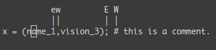
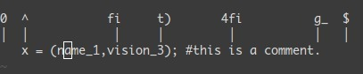
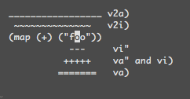
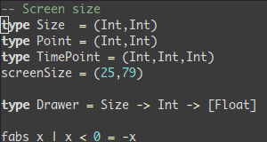
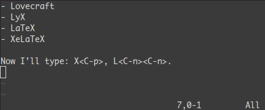
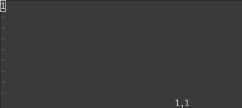
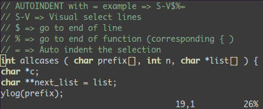
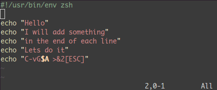
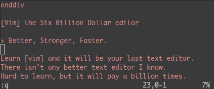

본 포스트는 [Learn Vim Progressively](http://yannesposito.com/Scratch/en/blog/Learn-Vim-Progressively/)라는 아티클을 번역한 것으로, Vim에 대해 모르는 분들이나 되새김질을 하고 싶은 분들에게 좋은 글이 될 것 같아 정리했다.


TL;DR: 여러분은 vim(인류 역사상 가장 널리 알려진 텍스트 에디터)을 가능한 한 빨리 습득하고 싶을 것이다. 여기에 그렇게 될 수 있는 방법을 소개한다. 살아남을 수 있는 최소한의 내용으로 학습을 시작하고, 그 뒤에 천천히 트릭을 추가한다.

Vim - 60억 달러 텍스트 에디터

> 더 좋고, 더 강하고, 그리고 더 빠른

vim을 배워라. 그러면 당신이 배우는 마지막 텍스트 에디터가 될 것이다. 내가 알고 있는 더 나은 텍스트 에디터는 없다. 배우기는 어렵지만, 사용하기에는 더없이 좋다.

Vim을 네 단계로 배우는 것을 제안한다:

- 생존하기.
- 편안함 느끼기.
- 더 좋고, 더 강하고, 그리고 더 빠름 느끼기.
- Vim의 막강한 힘 사용하기.

이 여정의 끝에서 당신은 Vim에 대해 슈퍼 스타가 될 것이다.

그러나 시작하기 전에 경고 하나 하겠다. Vim 학습은 처음에는 고통스러울 것이다. 시간이 걸리고 많은 악기를 연주하는 것 같을 것이다. 3일보다 더 적은 노력으로 다른 편집기보다 Vim을 더 효율적으로 사용할 수 있다는 기대는 하지 마라. 현실적으로 거의 2주는 걸릴 것이다.

## 첫 번째 레벨 - 생존하기

**1. Vim을 설치하고**

**2. Vim을 시작시키고**

**3. 아무것도 하지 마라! 그냥 읽어라.**

일반 편집기에서 키보드를 타이핑하는 것만으로도 무언가를 쓰고 화면에서 읽을 수 있다. 여기 Vim에서는 그렇지 않다. Vim은 기본적으로 Normal 모드다. Insert 모드로 가려면 `i` 글자를 타이핑하라.

약간 더 좋은 느낌을 가질 것이다. 이제 일반적인 에디터처럼 문자를 입력할 수 있다. Normal 모드로 되돌아가기 위해서는 ESC 키를 누르면 된다.

Insert 모드와 Normal 모드 사이의 전환법을 배웠다. 지금 Normal 모드에서 살아남기 위해 필요한 커맨드 목록은 아래와 같다:

- `i` → Insert 모드. ESC를 누르면 Normal 모드로 되돌아간다.
- `x` → 커서 위치의 문자를 지운다.
- `:wq` → 저장 후 종료(`:w` 저장, `:q` 종료).
- `dd` → 현재 행 삭제(그리고 복사된다).
- `p` → 붙여넣기.

추천:

- `hjkl` (특히 필수는 아니지만 강력 권장) → 기본적인 커서 이동(← ↓ ↑ →). 힌트: `j`는 아래쪽 화살표처럼 보인다.
- `:help <커맨드>` → `<커맨드>`에 관한 도움말을 표시한다. `<커맨드>` 없이 `:help`를 사용하면 일반적인 도움말을 볼 수 있다.

단지 5개의 커맨드다. 이것이 시작하기 위해 필요한 전부이다. 이 커맨드를 자연스럽게 사용할 수 있다면(하루 정도가 되겠지만) 레벨 2로 이동하면 된다.

하지만 우선 조금 더 Normal 모드에 대해 이야기하겠다. 일반 에디터에서는 복사를 하는 데 Ctrl 키(Ctrl-c)를 사용한다. 사실 Ctrl을 눌렀을 때 키의 의미가 바뀐다. Normal 모드로 Vim을 사용하면 에디터에서 Ctrl 키를 계속 누르고 편집하는 것과 같다.

표기에 대한 내용:

- Ctrl-λ 대신에 `<C-λ>`를 쓸 것이다.
- `:`로 시작하는 커맨드는 `<enter>`로 끝나야 한다. 예를 들어 `:q`라고 썼다면 `:q<enter>`를 나타낸다.

## 레벨 2 - 편안함 느끼기

생존하기 위해 필요한 커맨드를 알고 있다. 몇 가지 더 커맨드를 학습하자.

**2.1. Insert 모드의 다양성**

- `a` → 커서 뒤에 삽입
- `o` → 현재 행 다음에 새로운 행 삽입
- `O` → 현재 줄의 앞에 새로운 행 삽입
- `cw` → 커서 위치에서 단어의 끝까지 교체

**2.2. 기본적인 이동**

- `0` → 행의 시작 부분으로 이동
- `^` → 행의 공백이 아닌 첫 번째 문자로 이동
- `$` → 행의 끝으로 이동
- `g_` → 행의 공백이 아닌 끝 문자로 이동
- `/pattern` → pattern 검색

**2.3. 복사/붙여넣기**

- `P` → 커서 전에 붙여넣기. `p`는 커서 뒤에 붙여넣기.
- `yy` → 현재 행을 복사. `ddP`와 같다.

**2.4. 실행 취소/재실행**

- `u` → 실행 취소
- `<C-r>` → 재실행

**2.5. 로드/저장/종료/파일(버퍼) 변경**

- `:e <path/to/file>` → 파일 열기
- `:w` → 파일 저장
- `:saveas <path/to/file>` → `<path/to/file>`에 저장
- `:x`, `ZZ` 혹은 `:wq` → 저장 후 종료
- `:q!` → 저장하지 않고 종료. `:qa!`는 숨겨진 버퍼에 변경이 있어도 종료.
- `:bn` (관련 `:bp`) → 다음(관련 이전) 파일(버퍼)을 표시.

이 커맨드들을 모두 배우는 데 시간이 걸린다. 한번 익숙해지면 다른 편집기에서 할 수 있는 모든 것을 할 수 있을 것이다. 약간 어색함을 느낄 수 있으나, 다음 단계를 따라온다면 그 이유를 알 수 있을 것이다.

## 레벨 3 - 더 좋고, 더 강하고, 그리고 더 빠름 느끼기

여기까지 온 것을 축하한다. 이제 더 재미있는 것을 시작할 수 있다. 레벨 3에서는 이전 vi와 호환되는 커맨드에 대해 이야기할 것이다.

**3.1 더 좋은 점**

Vim이 사용자의 반복 동작에 어떻게 도움이 되는지 살펴보자:

- `.` → (도트)는 마지막 명령을 반복한다.
- `N<command>` → 커맨드를 N번 반복한다.

다음은 몇 가지 예다. 파일을 열고 타이핑해보자:

- `2dd` → 2행을 삭제한다.
- `3p` → 해당 텍스트를 3번 붙여넣기 한다.
- `100idesu [ESC]` → 100개의 "desu"가 쓰여진다.

```text
"desudesudesudesudesudesudesudesudesudesudesudesu
desudesudesudesudesudesudesudesudesudesudesudesudesu
desudesudesudesudesudesudesudesudesudesudesudesudesu
desudesudesudesudesudesudesudesudesudesudesudesudesu
desudesudesudesudesudesudesudesudesudesudesudesudesu
desudesudesudesudesudesudesudesudesudesudesudesudesu
desudesudesudesudesudesudesudesudesudesudesudesudesudesu
desudesudesudesudesudesudesudesudesu"
```

- `.` → 방금 전 마지막 명령 "desu" 100개 쓰기가 다시 실행된다.
- `3.` → 3개의 "desu"를 쓴다(300개가 아니다).

**3.2 더 강한 점**

Vim을 사용하여 효율적으로 이동하는 방법을 아는 것은 매우 중요하다. 이 섹션을 건너뛰지 마라.

- `NG` → N행으로 이동
- `gg` → 1G 바로 가기. 파일의 처음으로 이동.
- `G` → 마지막 행으로 이동
- 단어 이동:
  * `w` → 다음 단어의 시작 부분으로 이동
  * `e` → 낱말의 끝으로 이동
  * 기본적으로 단어는 문자와 밑줄로 구성된다. WORD는 공백 문자로 구분된 문자 그룹이라고 부르기로 하자. WORD로 간주하려면 대문자를 사용하자.
  * `W` → 다음 WORD의 시작 부분으로 이동
  * `E` → 해당 WORD의 끝으로 이동



매우 효율적인 이동 커맨드:

- `%` → `(`, `{`, `[`에 대응하는 곳으로 이동.
- `*` (관련: `#`) → 커서가 위치한 단어의 다음(관련: 이전) 발견 위치로 이동.

마지막 세 커맨드는 금이다.

**3.3 더 빠른 점**

vi에서의 이동의 중요성을 기억하라. 대부분의 커맨드는 다음과 같은 일반적인 형식으로 사용할 수 있다.

```text
<start position><command><end position>
```

예를 들어 `0y$`의 의미는 다음과 같다:

- `0` → 이 행의 시작 부분으로 이동
- `y` → 양크(yank)
- `$` → 이 행의 끝까지

`ye`같은 것도 할 수 있으며, 현재 위치에서 단어의 끝까지 양크한다. `y2/foo`는 두 번째 "foo"까지 양크한다.

`y`(양크)뿐만 아니라 `d`(삭제), `v`(비주얼 선택), `gU`(대문자), `gu`(소문자) 등도 같은 패턴으로 동작한다.

## 레벨 4 - Vim의 강력한 힘

앞서 언급한 커맨드를 Vim에서 사용하면 편안함을 느낄 것이다. 이제부터는 킬러 기능들이 소개된다. 이들 기능 중 일부가 내가 Vim을 사용하기 시작한 이유였다.

**4.1 현재 행의 이동: `0 ^ $ g_ f F t T , ;`**

- `0` → 행의 시작 부분(칼럼 0)으로 이동
- `^` → 행의 첫 글자로 이동
- `$` → 행의 마지막 칼럼으로 이동
- `g_` → 행의 마지막 문자로 이동
- `fa` → 행에서 다음 문자 `a`로 이동. `,`(관련 `;`)는 다음(관련: 이전) 발견된 지점으로 이동.
- `t,` → `,` 앞으로 이동.
- `3fa` → 행에서 3번째로 발견된 `a`를 찾음.
- `F`와 `T` → `f`와 `t`처럼 비슷하지만 반대 방향이다.



유용한 팁: `dt"` → `"`까지 모두 삭제.

**4.2 지역 선택: `<action>a<object>` 또는 `<action>i<object>`**

이 명령은 비주얼 모드에서 연산자 뒤에만 사용할 수 있다. 그러나 아주 강력하다. 주요 패턴은 다음과 같다:

```text
<action>a<object> and <action>i<object>
```

액션은 `d`(삭제), `y`(양크), `v`(비주얼 모드 선택) 등 다양하다. 객체는 `w`(단어), `W`(WORD), `s`(문장), `p`(단락)이 될 수 있고, `"`, `'`, `)`, `}`, `]` 같은 구분 문자도 될 수 있다.

커서가 `(map (+) ("foo"))`의 첫 번째 `o`에 있다고 가정한다:

- `vi"` → `foo`를 선택
- `va"` → `"foo"`를 선택
- `vi)` → `"foo"`를 선택
- `va)` → `("foo")`를 선택
- `v2i)` → `map (+) ("foo")`를 선택
- `v2a)` → `(map (+) ("foo"))`를 선택



**4.3 사각형 블록 선택: `<C-v>`**

사각형 블록은 코드의 여러 행을 주석 처리하는 데 매우 유용하다. 타이핑해보자: `0<C-v><C-d>I-- [ESC]`

- `^` → 행의 공백 없는 첫 번째 문자로 이동
- `<C-v>` → 블록 선택 시작
- `<C-d>` → 아래로 이동(`jjj`나 `%` 등도 가능)
- `I-- [ESC]` → 각 라인에 주석 처리를 위해 `--`를 쓴다.



Windows 환경에서는 클립보드가 비어 있지 않으면 `<C-v>` 대신 `<C-q>`를 사용할 수도 있다.

**4.4 보완: `<C-n>`과 `<C-p>`**

Insert 모드에서 단어의 시작 부분에 `<C-p>`를 입력해보자. 그러면 마법과 같은 일이...



**4.5 매크로: `qa`, `q`, `@a`, `@@`**

`qa`는 여러분의 액션을 `a` 레지스터에 기록한다. `@a`는 `a` 레지스터에 기록된 매크로를 마치 직접 입력한 것과 같이 재현한다. `@@`는 마지막으로 실행된 매크로를 재생하는 단축키다.

예 — 숫자 1만 포함된 한 행에서 아래의 것을 타이핑하자:

- `qaYp<C-a>q`:
  * `qa` 기록을 시작한다.
  * `Yp` 행을 복제한다.
  * `<C-a>` 숫자를 증가시킨다.
  * `q` 기록 중지한다.
- `@a` → 1 아래에 2를 쓴다.
- `@@` → 2 아래에 3을 쓴다.
- `100@@`는 103까지 일련 번호가 증가된 숫자 리스트를 생성한다.



**4.6 비주얼 선택: `v`, `V`, `<C-v>`**

`<C-v>`를 사용한 예를 보았다. `v`와 `V`도 마찬가지다. 선택 모드가 되면 다음 작업을 수행할 수 있다:

- `J` → 모든 행을 조인한다.
- `<` (관련 `>`) → 왼쪽으로(관련, 오른쪽으로) 들여쓰기.
- `=` → 자동 들여쓰기.



비주얼로 선택한 모든 행의 끝에 무언가를 추가하기:

- `<C-v>`
- 원하는 행으로 이동(`jjj` 혹은 `<C-d>` 및 `/pattern` 또는 `%` 등)
- `$` 끝으로 이동
- `A` 텍스트를 작성하고 ESC 누름.



**4.7 분할: `:split`과 `:vsplit`**

중요한 명령은 아래와 같으나 `:help split`으로 더 찾아보라.

- `:split` → 분할(`:vsplit`은 세로 분할) 창을 만듬.
- `<C-w><dir>` → `hjkl`이나 ← ↓ ↑ → 방향으로 분할 창 이동.
- `<C-w>_` (관련: `<C-w>|`) → 분할 크기를 확대(관련, 세로 분할 확대).
- `<C-w>+` (관련: `<C-w>-`) → 분할 크기를 증가(관련: 축소).



## 레벨 5 - 유용한 Tips

개인적 판단으로 유용하다고 생각하는 것들을 계속 추가할 것이다.

**5.1 r**

- `:r toms.log`로 파일의 내용을 읽고 현재 커서의 다음 행에 삽입한다. `:{line number}r toms.log`처럼 줄 번호를 앞에 입력하면 특정 행에 삽입할 수 있다.
- `:r !{cmd}` 명령의 출력도 삽입할 수 있다. `cmd`에는 `curl` 등도 가능하다.

**5.2 w**

표준 입력에서 코드를 받아 실행할 수 있는 인터프리터가 있으면 파일을 일일이 저장하지 않고도 코드를 실행할 수 있다.

- `:w !{cmd}`로 버퍼의 내용을 외부 명령의 표준 입력으로 전달한다. `:w !node`라면 JavaScript 코드를, `:w !bash`라면 쉘 스크립트를 실행할 수 있다.

## 결론

이것들이 내가 매일 사용하는 명령의 90%다. 하루에 한두 개 이상의 새로운 커맨드를 억지로 학습하지 않도록 권고한다. 2~3주 후에는 손이 vim의 파워를 느끼기 시작할 것이다.

Vim 학습은 단순한 암기보다 훈련이 더 중요하다. 운 좋게도 vim에는 훌륭한 문서가 포함되어 있다. 가장 기본적인 커맨드에 익숙해질 때까지 `vimtutor`를 실행하자. 또한 다음 페이지를 주의 깊게 읽기 바란다: `:help usr_02.txt`

폴더, 레지스터, 플러그인 등 아직 소개하지 않은 강력한 기능들이 많다. vim 학습은 피아노를 배우는 것처럼 오랜 시간이 걸리지만, 그만큼 손에 익었을 때의 생산성은 다른 어떤 에디터와도 비교하기 어렵다.
