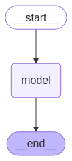
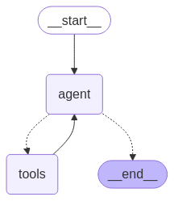

LangChain과 LangGraph를 이용하여 Deep Research와 같은 LLM 애플리케이션을 만드는 방법에 대한 세 번째 글로, 이 포스트에서는 다음 세 가지를 다룹니다. ① LangGraph의 구조와 LCEL과의 차이, ② 체크포인터를 이용한 멀티턴 대화 이력 유지, ③ Tool Calling 기반 웹 검색 AI 에이전트 구현. 이전 글을 읽지 않으신 분은 아래 링크를 순서대로 먼저 읽기를 권장합니다.

- [LangChain 기반 LLM 어플리케이션 개발 기초](https://www.mimul.com/blog/langchain-fundamental/)
- [LCEL(LangChain Expression Language) 기반 LLM 어플리케이션 개발 기초](https://www.mimul.com/blog/langchain-lcel/)

### LangGraph란?

LangGraph는 상태를 가진 순환 그래프를 구축하기 위한 라이브러리다. LangGraph를 도입함으로써, 지금까지 LCEL만으로는 구현이 어려웠던 상태 관리나 루프 처리를 포함한 고수준의 애플리케이션 개발이 가능해진다. LCEL로 구축된 Chain은 기본적으로 데이터가 한 방향으로 흐르는 파이프라인이었다.

- 처리 도중에 사용자로부터의 입력을 받고, 그 내용을 바탕으로 중간부터 처리를 재개한다
- 대화 이력과 상태를 메모리에 저장하고 그 상태에 따라 멀티턴의 동작을 제어한다
- LLM의 응답 내용이나 외부 도구의 실행 결과에 따라 다음에 수행되는 처리를 동적으로 변경한다
- 특정 조건을 충족할 때까지 정보 수집이나 추론 과정을 반복한다

LangGraph의 특징을 정리하면 다음과 같다.

| 특징            | 설명                                                                                                                           |
| :------------- | :---------------------------------------------------------------------------------------------------------------------------- |
| 상태 관리        | 그래프 전체에서 공유되는 상태를 정의하여 각 노드(처리 단계)가 해당 상태를 읽고 쓸 수 있음                                                          |
| 노드(Nodes)     | 그래프의 각 처리 단계를 나타냄                                                                                                       |
| 가장자리(Edges)  | 노드 간의 전이를 정의함(단순한 전이 뿐만 아니라 조건부 에지(Conditional Edges)를 정의하여 상태에 따라 다음 노드를 실행할지 분기 가능)                    |
| 사이클(Cycles)  | 조건부 가장자리(Edges)를 사용하면 그래프에 루프(사이클)를 만들 수 있음(이를 통해 에이전트가 반복적으로 생각하거나 도구를 사용하는 동작을 자연스럽게 표현할 수 있음)  |

LCEL이 데이터 처리의 흐름을 정의하는 데 능숙한 반면, LangGraph는 거기에 더해 처리의 제어와 상태를 관리하는 기능을 제공한다.

### 대화 이력을 유지하는 방법

LangGraph의 기본적인 사용법으로 상태 관리 기능을 이용하여 사용자와의 여러 번의 대화를 기억하고 문맥에 맞는 응답을 할 수 있는 챗봇을 구축한다.

**1. 체인 구축 (프롬프트, 모델)**

여기서 사용하는 코드는 [langgraph_conversation.ipynb](https://github.com/mimul/colab-ai/blob/main/langgraph_conversation.ipynb)의 2~3셀에 해당한다.

```python
import os

# 환경 변수와 패키지 준비
from google.colab import userdata
os.environ["GOOGLE_API_KEY"] = userdata.get("GOOGLE_API_KEY")

import operator
import uuid

from typing import TypedDict, Annotated

from langchain_google_genai import ChatGoogleGenerativeAI

from langchain_core.prompts import ChatPromptTemplate, MessagesPlaceholder
from langchain_core.messages import HumanMessage, SystemMessage, AnyMessage

from langgraph.checkpoint.memory import MemorySaver
from langgraph.graph import START, END, StateGraph

# gemini 모델 정의
model = ChatGoogleGenerativeAI(
    model="gemini-2.0-flash",
    temperature=0
)

# message 작성
message = [
    SystemMessage(content="당신은 한국어를 말하는 우수한 어시스턴트입니다. 회답에는 반드시 한국어로 대답해 주세요. 또 생각하는 과정도 출력해 주세요."),
    MessagesPlaceholder("messages"),
]

# message 프롬프트 작성
prompt = ChatPromptTemplate.from_messages(message)

# chain 정의
chain = prompt | model
```

이 셀에서는 LangGraph의 그래프 내에서 사용할 기본적인 LLM Chain을 준비하고 있다. `MessagesPlaceholder("messages")`는 LangChain의 프롬프트 템플릿 내에서 메시지 목록(대화 이력)을 동적으로 삽입하기 위한 플레이스홀더다. 나중에 정의할 LangGraph 상태(State)에 포함된 messages 키 값(HumanMessage나 AIMessage 리스트)이 실행 시에 이 위치에 삽입된다. 이렇게 함으로써 과거 대화 내역을 모두 SystemMessage 뒤에 추가된 상태에서 LLM을 실행할 수 있다.

**2. LangGraph에서 그래프 정의(대화 기록 유지)**

여기서 사용하는 코드는 [langgraph_conversation.ipynb](https://github.com/mimul/colab-ai/blob/main/langgraph_conversation.ipynb)의 4셀에 해당한다.

```python
class GraphState(TypedDict):
    messages: Annotated[list[AnyMessage], operator.add]

def create_langgraph(chain):

    def call_llm(state: GraphState):
        response = chain.invoke({"messages":state["messages"]})
        return {"messages": [response]}

    workflow = StateGraph(state_schema=GraphState)
    workflow.add_node("model", call_llm)

    workflow.add_edge(START, "model")
    workflow.add_edge("model", END)

    memory = MemorySaver()
    graph = workflow.compile(checkpointer=memory)
    return graph

graph = create_langgraph(chain)

from IPython.display import Image, display
display(Image(graph.get_graph().draw_mermaid_png()))
```

- `messages: Annotated[list[AnyMessage], operator.add]`에서 TypedDict를 사용하여 그래프 전체에서 관리하고자 하는 상태(State)의 구조를 정의한다. `list[AnyMessage]`는 messages 키에 HumanMessage나 AIMessage 등 임의의 메시지 객체 리스트가 저장되며 이것이 대화 이력의 실체가 된다. `Annotated[..., operator.add]`는 messages 키에 새로운 값(메시지 리스트)이 전달된 경우 기존 리스트에 그 값을 추가(add)한다는 의미다.
- `workflow = StateGraph(state_schema=GraphState)`는 정의한 GraphState를 스키마로 StateGraph 객체를 만든다.
- `workflow.add_node("model", call_llm)`에서 `add_node` 메소드는 그래프의 노드 역할을 정의한다. 노드는 상태 state가 전달되고 그 상태 안의 값을 참조하여 수행되는 처리를 기술한 함수이다. 여기서는 `call_llm` 함수를 model이라는 이름으로 그래프에 추가한다.

```python
workflow.add_edge(START, "model")
workflow.add_edge("model", END)
```

그래프의 처리 흐름을 정의한다. `add_edge` 메소드는 그래프의 노드와 노드 사이를 연결하는 edge의 역할을 정의한다. 여기서는 그래프가 시작(START)되면 model 노드를 실행하고 그것이 끝나면 그래프를 종료(END)하는 단순한 흐름이다.



```python
def call_llm(state: GraphState):
    response = chain.invoke({"messages":state["messages"]})
    return {"messages": [response]}
```

그래프의 노드(Node), 즉 처리의 스텝이 되는 함수이다. 파라미터로 현재 그래프 상태 state를 받아 chain이 출력하는 새 메시지가 state의 messages 목록 끝에 추가된다. 사용자의 입력과 LLM의 출력 결과가 상태(state)에 점점 추가되므로 `state["messages"]`에는 지금까지의 대화 이력이 모두 포함된다.

`memory = MemorySaver()`는 체크포인터(Checkpointer)를 생성한다. MemorySaver는 그래프의 상태를 인메모리(프로그램 실행 중의 메모리 상)에 보존하기 위한 가장 단순한 체크포인터다. 그 외에 데이터베이스 등에 상태를 영속화하는 체크포인터도 있다. 체크포인터는 대화의 중간 경과(상태)를 기록해 다음 호출 시에 복원하는 역할을 담당한다.

`graph = workflow.compile(checkpointer=memory)`에서 `.compile()` 메소드는 workflow에서 정의한 그래프 구조(노드와 에지)를 실행 가능한 형태로 컴파일한다. 이때 `checkpointer=memory`를 지정하면 그래프 실행 중에 상태(GraphState)가 변화할 때마다 최신 상태가 memory(MemorySaver 인스턴스)에 자동으로 저장되고, 동일한 대화(스레드)가 다시 호출될 때 복원된다. 이것이 대화 이력을 유지하는 구조의 핵심이다.

**3. 멀티턴 대화 실행**

여기서 사용하는 코드는 [langgraph_conversation.ipynb](https://github.com/mimul/colab-ai/blob/main/langgraph_conversation.ipynb)의 5셀에 해당한다.

```python
thread_id = uuid.uuid4()
while True:
    query = input("질문을 입력하세요: ")

    if query.lower() in ["exit", "quit"]:
        print("종료합니다.")
        break

    print("################# 질문 #################")
    print("질문:", query)

    input_query = [HumanMessage(
            [
                {
                    "type": "text",
                    "text": f"{query}"
                },
            ]
        )]

    response = graph.invoke({"messages": input_query}, config={"configurable": {"thread_id": thread_id}})

    print("################# 응답 #################")
    print("AI 응답", response["messages"][-1].content)
```

`graph.invoke({"messages": input_query}, config={"configurable": {"thread_id": thread_id}})`에서 주목할 점은 다음 두 가지다.

- 첫 번째 인수 `{"messages": input_query}`는 그래프에 대한 입력이다. `Annotated[..., operator.add]` 정의에 따라 이 input_query(새로운 HumanMessage)가 체크포인터에서 복원된 기존 messages 목록에 추가된다.
- `config={"configurable": {"thread_id": thread_id}}`에서 checkpointer를 지정한 경우 invoke 시에 config 파라미터를 통해 어떤 대화 스레드의 상태를 조작할지를 `thread_id`로 지정해야 한다. 동일한 `thread_id`로 invoke를 반복함으로써 대화 이력이 이어져 멀티턴 대화가 실현된다.

출력 결과(요약):

```
질문을 입력하세요: 나는 미물입니다.
################# 질문 #################
질문: 나는 미물입니다.
################# 응답 #################
AI 응답 알겠습니다. 당신이 자신을 "미물"이라고 표현하셨군요. ...

질문을 입력하세요: 나는 개발자인데, 개발자의 비전은 어떨까요?
################# 질문 #################
질문: 나는 개발자인데, 개발자의 비전은 어떨까요?
################# 응답 #################
AI 응답 개발자로서의 비전에 대해 질문 주셨군요. ...
```

동일 스레드에서 두 질문이 연속으로 응답을 반환하는 것을 보아 멀티턴 대화가 제대로 작동하고 있음을 알 수 있다.

LangGraph와 체크포인터를 이용한 방법은 과거의 `ConversationBufferMemory` 등을 사용하는 방법과 비교해, 그래프의 노드나 상태 정의에 대화 이력 관리 로직이 자연스럽게 포함되므로 보다 복잡한 에이전트를 구축할 때 상태 관리를 일원화하기 쉬운 이점이 있다. 조건 분기나 루프를 포함한 복잡한 그래프 구조도 구축할 수 있다.

### Tool Calling을 이용한 AI 에이전트 구현

LLM의 능력은 학습 데이터 기반이므로 최신 정보나 특정 지식, 계산이나 외부 서비스 조작은 단독으로 수행할 수 없다. 그러나 Tool Calling을 사용하면 LLM은 마치 사람이 도구를 쓰듯 외부 API와 함수를 필요에 따라 호출할 수 있다. LLM이 자율적으로 상황을 판단하고 툴을 선택/실행하여 태스크를 달성하려는 구조를 AI 에이전트라 부른다.

**1. Tool Calling이란?**

Tool Calling은 LLM이 사전 정의된 외부 함수와 API(도구)를 필요에 따라 자율적으로 호출할 수 있는 기능이다. LLM은 사용자의 지시와 대화 흐름을 이해하고 "어떤 도구를", "어떤 파라미터로" 호출할지를 판단하여 그 정보를 특정 형식으로 출력한다. 이 기능은 LLM 공급자와 컨텍스트에 따라 다양한 이름으로 불린다. OpenAI에서 시작된 Function Calling이란 이름도 있고, Anthropic(Claude) 등이 채용하고 있는 Tool Use도 있다. Tool Calling을 사용하면 LLM은 다음을 수행할 수 있다.

| 특징            | 설명                                                                             |
| :------------- | :------------------------------------------------------------------------------ |
| 최신 정보 접근    | Web 검색 툴을 사용해 실시간 정보를 취득할 수 있음                                          |
| 컴퓨팅 능력 확장   | 계산기 툴이나 코드 실행 툴을 사용해 복잡한 계산을 수행할 수 있음                               |
| 외부 서비스와 협력 | 캘린더 API를 조작해 일정을 등록하거나 데이터베이스 검색 툴에서 사내 정보를 검색할 수 있음              |
| 액션 실행        | 이메일 송신 툴이나 스마트 홈 제어 API를 호출할 수 있음                                      |

직접 함수로 구현해도 되고 LangChain에도 프리셋으로 쉽게 이용할 수 있는 Tool이 있다. 여기에서는 LangChain에서 쉽게 이용할 수 있는 웹 검색 툴을 이용한다.

LLM이 웹 검색을 수행하도록 하는 도구로 이번에는 [Tavily](https://tavily.com/)라는 검색 API 서비스를 이용한다. 사전에 Tavily 가입해 API 키를 얻는다. 무료 플랜에서도 월 1,000회까지 API 호출이 가능하다. Tavily에서 얻은 API 키를 `GOOGLE_API_KEY`와 마찬가지로 [Google Colaboratory](https://colab.research.google.com)의 비밀 기능을 사용하여 `TAVILY_API_KEY` 이름으로 등록한다.

여기에서는 LangGraph와 Tool Calling을 이용하여 사용자의 질문에 대해 웹 검색 툴(Tavily)로 정보를 수집하고 이를 바탕으로 답변하는 간단한 AI 에이전트(채팅봇)를 구축한다. 사용되는 코드는 [langgraph_tool_calling.ipynb](https://github.com/mimul/colab-ai/blob/main/langgraph_tool_calling.ipynb)이다.

**2. 모델 정의**

```python
import os
import time
import operator
import uuid

from typing import Annotated
from typing_extensions import TypedDict, Annotated
from pydantic import BaseModel, Field

from langchain_google_genai import ChatGoogleGenerativeAI

from langchain_core.messages import HumanMessage, AIMessage, SystemMessage, AnyMessage
from langchain_core.prompts import ChatPromptTemplate, MessagesPlaceholder
from langchain_tavily import TavilySearch, TavilyExtract

from langgraph.types import Command
from langgraph.prebuilt import ToolNode
from langgraph.graph import StateGraph, START, END
from langgraph.checkpoint.memory import MemorySaver

# 환경 변수와 패키지 준비
from google.colab import userdata
os.environ["GOOGLE_API_KEY"] = userdata.get("GOOGLE_API_KEY")
os.environ["TAVILY_API_KEY"] = userdata.get("TAVILY_API_KEY")

llm = ChatGoogleGenerativeAI(
    model="gemini-2.5-flash-preview-04-17",
    temperature=0,
    max_retries=0,
)

print(llm.invoke("너 이름이 뭐니?"))
```

모델별 RateLimit를 보려면 [여기](https://ai.google.dev/gemini-api/docs/rate-limits?hl=ko)에서 확인할 수 있다.

**3. Tool과 Chain 정의**

```python
tavily_search_tool = TavilySearch(
    max_results=10,
    topic="general",
)

tavily_extract_tool = TavilyExtract()

tools = [
    tavily_search_tool,
    tavily_extract_tool
]

system_prompt = """
당신은 한국어를 말하는 우수한 어시스턴트입니다. 회답에는 반드시 한국어로 대답해 주세요. 또 생각하는 과정도 출력해 주세요.
우리는 'tavily_search_tool'과 'tavily_extract_tool'이라는 두가지 툴을 가지고 있습니다.
tavily_search_tool은 구글 검색을 하고 상위 5개 URL과 개요를 가져오는 툴입니다. 어떤 웹사이트가 있는지를 알고자 할 경우에는 이곳을 이용합니다.
tavily_extract_tool은 URL을 지정하여 페이지의 내용을 추출하는 툴입니다. 특정 Web 사이트의 URL을 알고 있어 상세하게 내용을 추출하는 경우는 이쪽을 이용합니다.
적절하게 이용하여 사용자로부터 질문에 답변해 주세요.
"""

# message 작성
message = [
    SystemMessage(content=system_prompt),
    MessagesPlaceholder("messages"),
]

# message 프롬프트 정의
prompt = ChatPromptTemplate.from_messages(message)

# chain 정의
chain = prompt | llm.bind_tools(tools)
```

`TavilySearch`는 웹 검색을 수행하여 상위 10개의 URL과 개요를 얻는 도구이고, `TavilyExtract`는 URL을 지정하여 페이지의 내용을 추출하는 도구이다. `chain = prompt | llm.bind_tools(tools)`는 정의한 tools을 Chain에 등록한다.

chain을 실행하면 LLM은 프롬프트의 내용과 대화 이력을 바탕으로, 필요하면 tools 목록 내의 툴을 호출하기 위한 정보(어떤 툴을 어느 파라미터로 부를지)를 응답 메시지(AIMessage)의 `tool_calls` 속성에 포함시켜 반환한다. 도구 호출이 필요 없다고 판단할 경우에는 일반 텍스트 응답만 반환한다. 이 chain이 에이전트의 사고 부분을 담당한다.

**4. LangGraph에서 그래프 정의(Tool Calling Agent)**

```python
class GraphState(TypedDict):
    messages: Annotated[list[AnyMessage], operator.add]

def create_langgraph(tools):

    def should_continue(state: GraphState):
        messages = state["messages"]
        last_message = messages[-1]
        if last_message.tool_calls:
            return "tools"
        return END

    def call_llm(state: GraphState):
        response = chain.invoke({"messages":state["messages"]})
        return {"messages": [response]}

    tool_node = ToolNode(tools)

    workflow = StateGraph(GraphState)
    workflow.add_node("agent", call_llm)
    workflow.add_node("tools", tool_node)

    workflow.add_edge(START, "agent")
    workflow.add_conditional_edges("agent", should_continue, ["tools", END])
    workflow.add_edge("tools", "agent")

    memory = MemorySaver()
    graph = workflow.compile(checkpointer=memory)
    return graph

graph = create_langgraph(tools)

from IPython.display import Image, display
display(Image(graph.get_graph().draw_mermaid_png()))
```

그래프를 정의하고 실행 결과를 시각화하면 아래와 같다.



Tool Calling 에이전트의 동작 흐름을 정의하는 LangGraph 그래프를 구축한다.

- `should_continue` 함수는 에이전트의 의사 결정 열쇠이다. `last_message = state["messages"][-1]`에서 직전 메시지(call_llm 노드가 생성한 AIMessage)를 취득하고, `if last_message.tool_calls:`에서 해당 메시지에 tool_calls 속성이 존재하는지(LLM이 툴 호출을 요구했는지)를 체크하여 존재하면 "tools"를 반환한다.
- `tool_node = ToolNode(tools)`에서 ToolNode는 LangGraph에서 제공하는 내장 노드이다. 이 노드는 그래프 상태(state)에서 `tool_calls`를 가진 AIMessage를 받으면 해당 툴을 실제로 실행하고 그 결과를 ToolMessage 객체로 생성한다. 이 노드를 사용하려면 state에 messages 키가 반드시 있어야 하고, 가장 마지막 메시지가 `tool_calls` 속성을 가진 AIMessage여야 한다.
- `workflow.add_conditional_edges(...)`는 조건 분기 설정이다. "agent" 노드 실행 후 `should_continue` 함수를 호출하여 "tools"를 반환하면 "tools" 노드로, END를 반환하면 그래프가 종료된다.
- `workflow.add_edge("tools", "agent")`에서 tools 노드 실행 후에는 반드시 agent 노드가 호출된다. 이로써 tools 노드의 결과를 LLM이 다시 처리하여 추가 툴 호출이 필요한지 판단할 수 있다. 충분히 정보가 수집되었다고 판단되면 agent 노드에서 사용자의 질문에 답변하고 그래프 실행을 종료한다.

**5. 검색 기능이 있는 LLM 실행**

```python
thread_id = uuid.uuid4()
while True:
    query = input("질문을 입력해주세요: ")
    if query.lower() in ["exit", "quit"]:
        print("종료하겠습니다.")
        break

    input_query = [HumanMessage(
            [{"type": "text", "text": f"{query}"}]
        )]

    response = graph.invoke({"messages": input_query}, config={"configurable": {"thread_id": thread_id}})
    print("AI 응답", response["messages"][-1].content)
```

실행 결과(요약):

```
질문을 입력해주세요: 최신 동영상 생성 AI(오픈 모델) 중에 애니메이션풍의 동영상을 품질 높게 생성할 수 있는 모델을 조사해 주세요. 상용 이용이 가능한 라이선스로 좁혀 주세요.

AI 응답:
현재 시점에서 가장 주목할 만한 모델은 Mochi-1(Genmo AI 개발)입니다.

- 특징: 오픈 소스, 10B 파라미터, 30fps 부드러운 모션, 강력한 프롬프트 준수
- 라이선스: Apache 2.0 (상업적 이용 가능)
- 이용 방법: 텍스트 프롬프트 기반. 로컬 설치 또는 Genmo AI 플랫폼을 통해 접근 가능

참고로 Hunyuan Video(Tencent, 13B)도 고품질 오픈 소스 모델이나, 상업적 이용 라이선스가 명확히 확인되지 않습니다.
```

출력 결과를 보면 사용자의 질문에 맞춰 적절하게 웹 검색을 실시하고 그 결과를 출력하는 것을 알 수 있다. 보다 복잡한 조사 작업에서는 여러 번의 검색과 검색 결과에서 얻은 정보를 바탕으로 더 심층적인 검색이 필요할 수 있다.
