리소스를 물리적으로 지우지 않고 상태만 바꿔 삭제된 것처럼 다루는 논리 삭제는, 삭제 플래그나 삭제일시 컬럼 하나만 추가하면 끝나는 간단한 문제처럼 보인다. 하지만 서비스가 커질수록 이 선택은 곳곳에서 대가를 요구한다. 이 글은 논리 삭제 테이블을 설계해야 하는 백엔드 개발자를 대상으로, 논리 삭제가 실무에서 부딪히는 문제를 정리하고 이뮤터블 데이터 모델 관점에서 물리 삭제 없이 그 문제들을 풀어내는 설계 절차를 다룬다.

## 논리 삭제의 문제

실제로 부딪히는 문제는 일곱 가지로 정리된다. 각 항목마다 어떤 문제가 왜 생기는지를 짚고, 앞으로 이 글에서 계속 쓸 사용자·게시글 테이블(users: user_id·name·email·user_status, posts: post_id·user_id·created_at)로 실제 쿼리가 어떻게 꼬이는지 보인다.

### WHERE절 지옥

액티브 사용자만 걸러내려면 모든 쿼리에 `WHERE user_status != 'deleted'` 같은 조건을 달아야 한다. 사용자와 게시글을 조인해 목록을 뽑는 쿼리 하나에도 두 테이블 모두에 이 조건이 필요하고, 서브쿼리나 집계 쿼리로 넘어가면 조건을 붙일 자리가 그만큼 늘어난다. 조건 하나만 빠뜨려도 탈퇴한 사용자의 게시글이 화면에 그대로 노출되는데, 이 실수는 대체로 테스트에서는 걸리지 않고 운영 환경에서야 발견된다.

```sql
-- 게시글 목록에서 탈퇴한 사용자의 글을 걸러내려면
-- 두 테이블 모두에 조건을 달아야 한다
SELECT p.post_id, p.created_at, u.name
FROM posts p
JOIN users u ON p.user_id = u.user_id
WHERE u.user_status != 'deleted';
```

### 확인 비용의 누적

조건을 빠뜨리지 않으려면 개발자가 매번 「이 테이블은 논리 삭제를 쓰는가」를 확인해야 하고, 이 확인 비용은 팀 전체에 누적된다. 사용자 테이블에 논리 삭제가 적용되어 있다는 사실은 스키마만 봐서는 드러나지 않고, 문서나 주석으로 남겨 둬도 새로 합류한 개발자나 리뷰어가 놓치기 쉽다. 팀 규모가 커질수록, 시간이 지날수록 실수할 확률이 늘어나는 구조다.

```sql
-- user_status 컬럼의 존재를 모르고 짠 쿼리
-- 삭제된 사용자까지 그대로 조회된다
SELECT user_id, name, email
FROM users
WHERE user_id = 1234;
```

### 고유 제약의 붕괴

메일주소처럼 사용자마다 유일해야 하는 컬럼도 논리 삭제 앞에서 무너진다. 탈퇴한 사용자의 메일주소는 테이블 안에 그대로 남아 있으므로, 같은 메일주소로 다시 가입하려는 사용자는 UNIQUE 제약 위반에 걸린다. 액티브 사용자만 대상으로 하는 부분 인덱스를 걸거나 삭제 시점에 메일주소 뒤에 표식을 붙여 값 자체를 바꿔버리는 우회도 가능하지만, 어느 쪽을 택하든 왜 이런 우회가 필요한지를 나중에 코드를 읽는 사람에게 설명해야 하는 부담이 남는다.

```sql
-- 탈퇴한 사용자의 이메일이 남아 있어 재가입 시 충돌한다
INSERT INTO users (name, email, user_status)
VALUES ('김철수', 'chulsoo@example.com', 'active');
-- ERROR: duplicate key value violates unique constraint

-- 액티브 사용자만 대상으로 하는 부분 인덱스로 우회한다
CREATE UNIQUE INDEX idx_users_email_active
ON users (email)
WHERE user_status = 'active';
```

### 참조 무결성의 한계

게시글처럼 사용자를 참조하는 테이블과의 관계도 꼬인다. 게시글 테이블의 user_id 컬럼에 외래키 제약을 걸어 두면 참조 무결성은 지킬 수 있지만, 그 제약은 사용자 레코드가 물리적으로 존재하는지만 확인할 뿐 그 사용자가 액티브인지 삭제된 상태인지는 모른다. 삭제된 사용자를 가리키는 게시글을 화면에 어떻게 표시할지는 데이터베이스가 답을 주지 않으므로, 결국 애플리케이션 쪽에서 판단 로직을 따로 만들어야 한다.

```sql
-- FK 제약은 삭제 여부와 무관하게 통과한다
ALTER TABLE posts
ADD CONSTRAINT fk_posts_user
FOREIGN KEY (user_id) REFERENCES users (user_id);

-- 작성자가 삭제된 상태인지는 애플리케이션이 직접 판단해야 한다
SELECT p.post_id, p.created_at,
       CASE WHEN u.user_status = 'deleted'
            THEN '(탈퇴한 사용자)' ELSE u.name END AS author
FROM posts p
JOIN users u ON p.user_id = u.user_id;
```

### 캐스케이드 삭제와의 불화

캐스케이드 삭제와는 아예 궁합이 맞지 않는다. `ON DELETE CASCADE`는 부모 행이 물리적으로 DELETE될 때만 반응하는데, 논리 삭제는 user_status 컬럼을 UPDATE할 뿐이므로 이 트리거가 걸리지 않는다. 사용자를 삭제 처리해도 그 사용자가 쓴 게시글은 그대로 남아, 게시글은 있는데 작성자는 삭제된 상태라는 불일치가 생긴다. 이 불일치를 없애려면 사용자 삭제와 게시글 삭제를 애플리케이션 코드에서 나란히 처리하는 수밖에 없고, 관련 테이블이 늘어날수록 빠뜨리는 테이블도 늘어난다.

```sql
-- 사용자를 논리 삭제해도 CASCADE는 동작하지 않는다
UPDATE users SET user_status = 'deleted' WHERE user_id = 1234;

-- 게시글은 여전히 그대로 남아 있다
SELECT * FROM posts WHERE user_id = 1234;
-- 게시글까지 정리하려면 애플리케이션에서 별도 UPDATE가 필요하다
```

### 누적되는 삭제 레코드로 인한 성능 저하

삭제된 레코드는 지워지지 않고 쌓이기만 하므로 성능에도 영향을 준다. 서비스를 몇 년 운영하다 보면 사용자 테이블 전체 100만 건 중 실제 액티브 사용자는 10만 건이고 나머지 90만 건은 삭제된 레코드인 상황도 드물지 않다. 부분 인덱스로 액티브 사용자만 인덱싱해 어느 정도 완화할 수는 있지만, 이는 논리 삭제를 선택한 대가로 떠안는 추가 설계일 뿐 공짜로 따라오는 해결책은 아니다.

```sql
-- 전체 100만 건 중 액티브는 10만 건뿐이어도
-- 인덱스가 없으면 삭제된 90만 건까지 스캔 대상이 된다
CREATE INDEX idx_users_email_lookup
ON users (email)
WHERE user_status = 'active';

EXPLAIN SELECT * FROM users
WHERE email = 'chulsoo@example.com' AND user_status = 'active';
```

### 무거워지는 테스트

테스트도 무거워진다. 사용자와 게시글이 얽힌 쿼리를 검증하려면 액티브 사용자와 삭제된 사용자 두 경우를 모두 준비해서, 삭제된 사용자의 게시글이 결과에 섞이지 않는지 매번 확인해야 한다. 이 검증을 빠뜨리면 WHERE절 하나 빠뜨린 버그가 테스트를 통과한 채로 운영 환경까지 흘러간다.

```sql
-- 테스트 픽스처에 액티브·삭제 사용자를 모두 준비한다
INSERT INTO users (user_id, name, email, user_status)
VALUES (1, '김철수', 'chulsoo@example.com', 'active'),
       (2, '이영희', 'younghee@example.com', 'deleted');

INSERT INTO posts (post_id, user_id, created_at)
VALUES (10, 1, NOW()), (11, 2, NOW());

-- 삭제된 사용자(2)의 게시글(11)이 결과에 섞이지 않는지 검증한다
SELECT p.post_id FROM posts p
JOIN users u ON p.user_id = u.user_id
WHERE u.user_status = 'active';
-- 기대 결과: post_id = 10만 반환
```

이 일곱 가지 문제는 사실 한 군데에서 갈라져 나온다. 삭제라는 사건을 사용자라는 리소스의 속성 하나로 뭉뚱그려 표현했기 때문이다. 이 뭉뚱그림을 풀어내려면 리소스와 이벤트를 구별해서 모델링하는 [이뮤터블 데이터 모델](https://www.mimul.com/blog/immutable-data-model/)의 기본형부터 짚어야 한다. 지금부터 그 순서를 따라, 사용자 등의 리소스 엔티티를 물리 삭제 없이 논리 삭제로 설계하는 과정을 설명한다.

## 이뮤터블 데이터 모델 기반 논리 삭제 설계

이뮤터블 데이터 모델은 리소스와 이벤트를 구별해서 모델링한다. 사용자 등의 리소스에 논리 삭제를 적용할 때는 리소스 자체를 어떻게 다룰지, 삭제를 이벤트로 남길지, 서브타입을 어떤 방식으로 구현할지, 그리고 이벤트가 참조하는 리소스 상태를 어떻게 유지할지를 순서대로 검토한다.

### 리소스의 검토

먼저 사용자가 액티브 사용자와 삭제된 사용자로 취급이 다른지를 고려한다. 이 단계에서 물리 설계로 어떻게 할지를 생각하면 검토 포인트가 충분히 고려되지 않는 결과로 이어지므로 주의하자. 취급이 다르지 않은 경우를 생각해 보자.

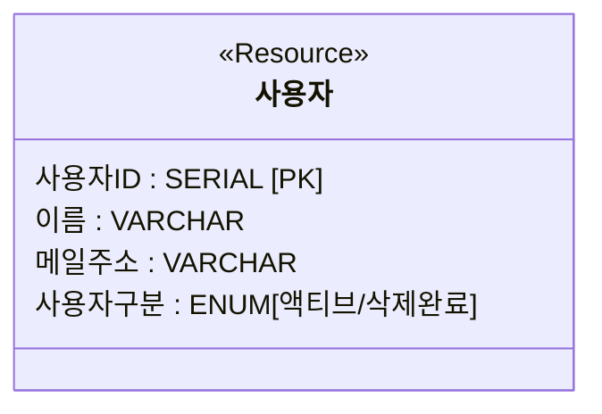

사용자구분이 액티브인지 삭제완료인지가 단순한 라벨에 불과하고, 행동도 속성도 아무것도 변하지 않는다면, 사용자의 속성으로 사용자구분을 가지면 된다. 이 패턴은 간과하기 쉽지만, 기존 Excel 업무를 그대로 Web화하는 시스템에서는 이것으로 충분한 경우도 있다. 다음으로 취급이 다른 경우인데, 그 차이가 알 수 있도록 서브타입으로 표현해 둔다.

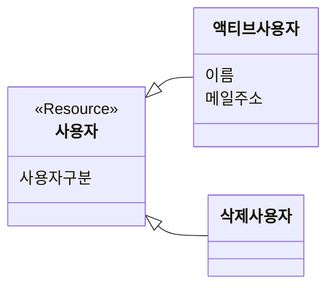

보통은 액티브 사용자만을 대상으로 하는 유스케이스가 많을 것이고, 삭제 사용자는 성명 등의 개인정보가 저장되어서는 안 된다는 식으로 속성에 차이가 있는 경우도 있다.

### 이벤트의 검토

삭제 타이밍에서 업무적인 기록을 남길 필요가 있는지를 고려한다.

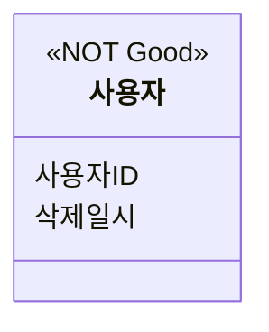

이 때문에 삭제일시를 리소스에 가지면 된다는 사고는 업무 이벤트의 누락으로 이어진다. 사용자의 삭제는 스스로 등록 말소하는 경우도 있고, 관리자가 강제탈퇴시키는 경우도 있을 수 있다. 관리자가 강제탈퇴시킨 경우에는 그 이유도 기록해 두어야 할 수 있다.
또한 "뭔가 지우는 게 무서워서" 혹은 "지운 후 클레임이 들어오면 되돌릴 수 있어야 한다" 같은 막연한 요구도 언어화해 모델로 만들어 둔다. "삭제 상태에서 버튼 한 번으로 원래대로 되돌리는 기능이 필요"와 같은 명확한 요구가 없는 한, 등록 말소 이벤트에 삭제 시점의 속성을 가지면 대체로 충분하다.

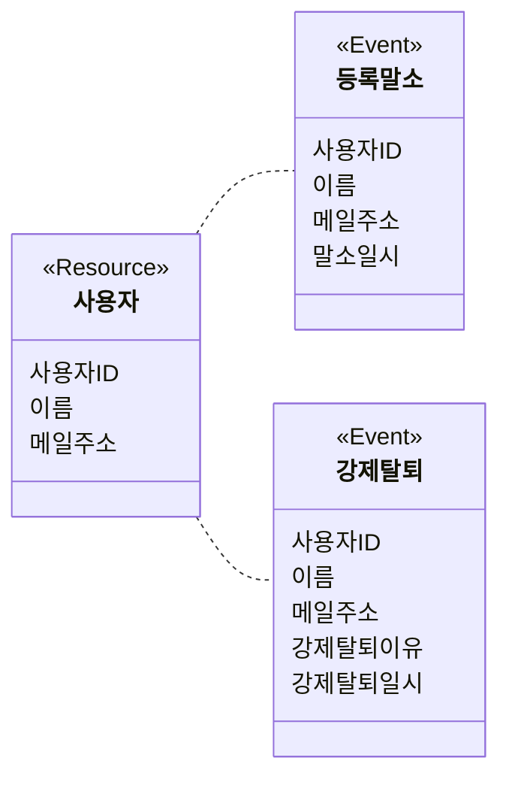

여기서 등록말소·강제탈퇴 이벤트가 이름·메일주소를 그대로 복사해 가지는 점과, 앞서 삭제 사용자 서브타입에 개인정보를 두지 않기로 한 결정이 모순처럼 보일 수 있다. 하지만 리소스는 항상 최신 상태만 표현하고 이벤트는 특정 시점에 일어난 사실을 그대로 보존하는 것이 이뮤터블 데이터 모델의 원칙이므로, 삭제 시점의 개인정보를 이벤트에 남기는 것과 삭제 사용자 리소스에서 개인정보를 제거하는 것은 서로 다른 레벨의 결정이다. 다만 개인정보 보호 규정상 삭제 이벤트에 남은 개인정보도 일정 기간 후 마스킹하거나 파기하는 별도 정책이 필요할 수 있다.

삭제 플래그인가 삭제일시인가라는 마커 논의도 결국 같은 문제로 귀결된다. 이뮤터블 데이터 모델 관점에서는 어느 쪽이든 삭제라는 사건을 리소스의 속성으로 욱여넣는 방식이라는 점에서 다르지 않으므로, 사용자 엔티티에는 두 마커 중 어느 것도 두지 않는다.

### 리소스 서브타입의 구현

다음은 서브타입의 구현 방법을 결정한다. 객체지향 모델에서는 상속으로 자연스럽게 표현되는 관계가, 관계형 테이블에는 대응하는 개념이 없다. 이런 개념 차이를 객체-관계 임피던스 불일치(object-relational impedance mismatch, 객체 모델과 관계형 모델이 서로 다른 방식으로 데이터를 표현해서 생기는 근본적인 간극)라 부르는데, 상속은 그 간극이 가장 뚜렷하게 드러나는 지점 중 하나다. 상속 구조를 가진 리소스를 테이블로 옮기려면 그 계층을 테이블 사이의 관계로 번역하는 규칙이 필요하고, 그 번역 방향은 계층 전체를 테이블 하나로 뭉치거나, 서브타입마다 독립된 테이블로 쪼개거나, 공통 속성과 고유 속성을 부모·자식 테이블로 나누는 세 갈래로 갈린다. 어느 방향을 택하든 정규화 수준, 조인 비용, NULL 컬럼, 참조 무결성 중 무엇을 얻고 무엇을 내줄지가 갈릴 뿐, 상속을 테이블로 옮기는 문제 자체는 피할 수 없다. 사용자·액티브사용자·삭제사용자 사이의 관계도 이 문제의 한 사례이므로, 리소스 엔티티를 테이블로 구현할 때는 아래 3가지가 구현 수단의 후보가 된다. 아래 방법은 [Martin Fowler의 Patterns of Enterprise Application Architecture(2002)에서 정의한 Single Table Inheritance, Class Table Inheritance, Concrete Table Inheritance 패턴](https://martinfowler.com/eaaCatalog/inheritanceMappers.html)의 글을 참고해서 아이디어를 얻었다.

- 싱글 테이블 상속
- 구체 테이블 상속
- 클래스 테이블 상속

#### 싱글 테이블 상속 (JPA `SINGLE_TABLE` 전략)

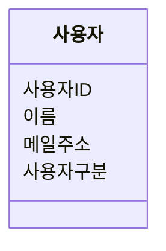

하나의 사용자 테이블로 정리하는 패턴이다.

**장점**

- 삭제 사용자도 포함하여 검색하는 경우, 하나의 테이블 스캔으로 충분하다.

**단점**

- 삭제 사용자가 늘어나면 SQL 성능에 악영향을 미칠 가능성이 높아진다.
- 사용자구분 != '삭제완료'를 WHERE절에 반드시 포함해야 한다.
- 메일주소처럼 "액티브 사용자 범위에서 유니크해야 한다"와 같은 제약이 있을 때, 삭제 레코드도 포함하므로 RDBMS의 UNIQUE 제약을 부여할 수 없다.

앞서 짚은 WHERE절 지옥, 고유 제약의 붕괴, 누적되는 삭제 레코드로 인한 성능 저하가 바로 이 패턴을 선택했을 때 나타나는 결과다. 자주 있는 삭제 플래그를 사용한 구현도 이 타입이다. 여기까지의 검토를 거쳐 장점/단점을 이해한 후에 삭제 플래그를 구현하는 것은 문제가 없지만, 이 형태만을 패턴으로 기억하는 것은 피해야 한다.

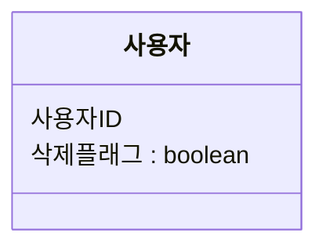

삭제 플래그를 포함한 싱글 테이블 상속 패턴에서의 구현은, 단점도 많고 쿼리 시에 부담이 생긴다. 사용자처럼 쿼리에서 빈번히 사용되는 테이블에서는 피하는 것이 좋다.

#### 구체 테이블 상속 (JPA `TABLE_PER_CLASS` 전략)

구체 테이블 상속은, 각각의 서브타입을 독립된 테이블로 구현하는 패턴이다.

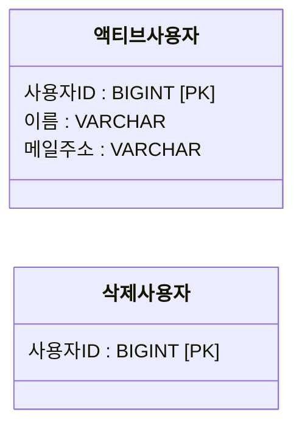

**장점**

- 삭제 사용자에 개인정보를 가지지 않게 하는 구현이 자연스럽게 된다.
- 삭제 사용자가 늘어도 액티브 사용자의 검색 성능에 영향을 주지 않는다.

**단점**

- 양쪽 사용자를 횡단적으로 검색하는 경우, UNION이 필요하다.

"삭제하면 다른 테이블로 이동시켜 아카이브하고, 원래 사용자 테이블에서 삭제한다"라는 접근은, 이 구체 테이블 상속의 일종이다. 구체 테이블 상속으로 구현하면, 하나의 이벤트로부터 여러 리소스 서브타입과의 관련이 만들어진다. 즉, 게시글 테이블의 사용자ID에 외래키 제약을 부여할 수 없다.

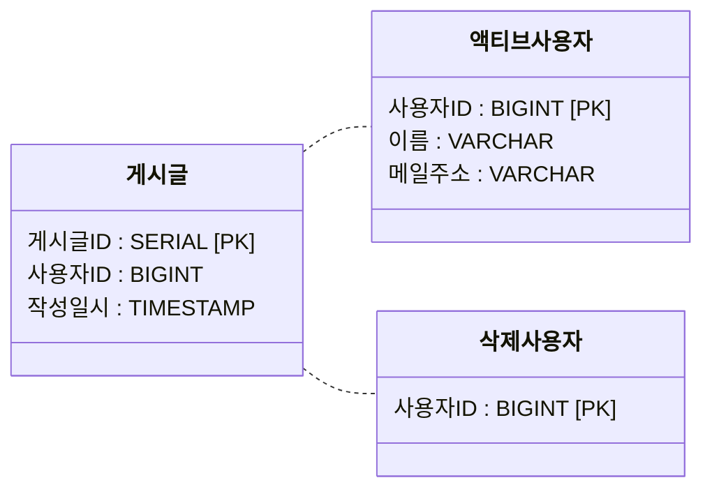

이것을 이유로 싱글 테이블 상속을 바로 선택하는 경우가 있지만, 그것은 단락적이다. 싱글 테이블 상속의 단점을 잘 검토하자. 이 정도 이유라면, 대체로 다음 클래스 테이블 상속으로 구현하는 것이 좋다. 애초에, 이벤트와 관련되는 리소스는 최신 상태이면 좋은지 검토해야 한다. 이것은 "이벤트와의 관련" 섹션에서 논의한다.

#### 클래스 테이블 상속 (JPA `JOINED` 전략)

클래스 테이블 상속은, 공통 부분을 부모 테이블에, 서브타입 고유의 부분을 자식 테이블로 분리하는 패턴이다.

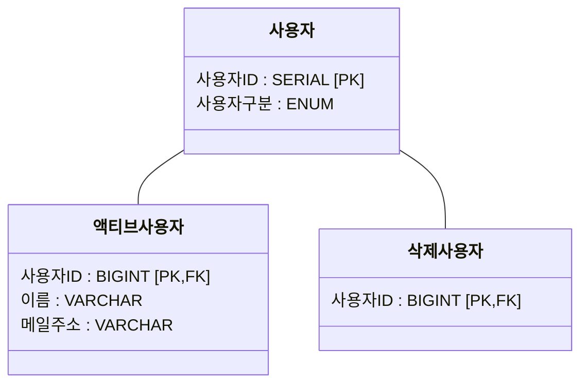

**장점**

- 횡단적인 검색이 비교적 쉽다(부모 테이블만 보면 된다).
- 장래에 새로운 서브타입을 추가하기 쉽다.

**단점**

- O/R 매퍼를 사용하고 있으면, 구현이 복잡해지는 경우가 있다.

### 이벤트와의 관련

"사용자ID가 예를 들어 게시글과 결합되어 있고, 게시글은 다른 회원들이 계속 열람하고 답글도 달려 있어 쉽게 삭제할 수 없으므로, 사용자 테이블에서 삭제할 수 없다"라는 문제도 있다. 게시글이 참조하는 사용자 정보가 항상 최신 상태여야 하는지부터 검토할 필요가 있다.

#### 항상 최신 리소스 상태를 참조하는 경우

게시글과 같은 콘텐츠 이벤트에서는 흔치 않지만, 이벤트가 참조하는 리소스가 최신 상태이면 좋은 업무도 있다. 가령 게시글에 표시할 작성자 닉네임이 회원의 이름 변경 이력과 상관없이 항상 최신 정보를 따라가는 경우, 단순히 게시글이 사용자ID를 가지면 된다.
싱글 테이블 상속의 경우:

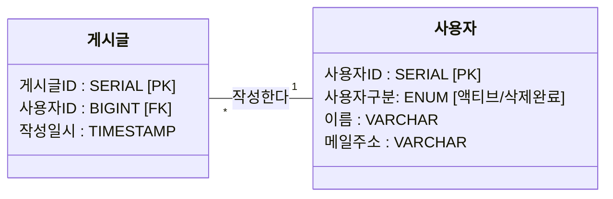

클래스 테이블 상속의 경우:

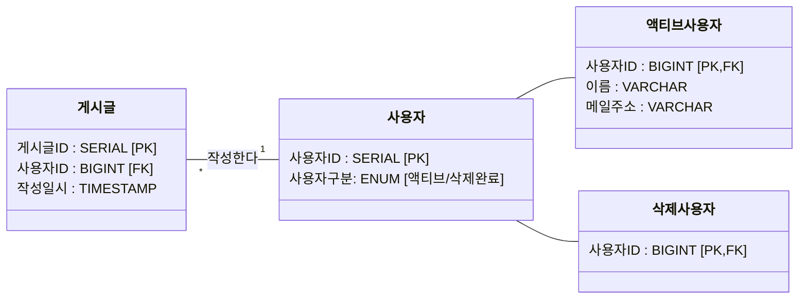

앞서 말한 대로, 구체 테이블 상속에서는 FK 제약을 제외할 필요가 있다. 그것도 허용할 수 없는 경우에는, 다음 섹션에서 말하는 세대 관리 방식을 사용하면 좋다. 다만 세대 관리로 옮기면 게시글은 더 이상 최신 상태를 자동으로 따라가지 않고 작성 시점의 세대에 고정된다. FK 제약을 반드시 지키면서도 최신 상태 추적을 포기할 수 없다면 클래스 테이블 상속을 유지하고, 최신 추적 요구 자체를 재검토할 수 있다면 세대 관리로 전환한다.

#### 이벤트 시점의 리소스 상태를 유지하는 경우

게시글 작성 시점의 사용자 정보를 그대로 참조할 수 있어야 하는 경우에는, 다음의 2가지의 대응이 생각된다. 예를 들어 익명 게시판인데 작성 후 닉네임을 바꿔도 예전 게시글에는 작성 당시의 닉네임이 그대로 남아 있어야 하는 요구가 여기에 해당한다.

1. 게시글 엔티티에 그 시점에서 사용자의 속성을 복사하여 갖게 한다.
2. 사용자 엔티티를 세대 관리

##### 스냅샷 방식

게시글 엔티티에 그 시점에서 사용자의 속성을 복사하여 갖게 한다.

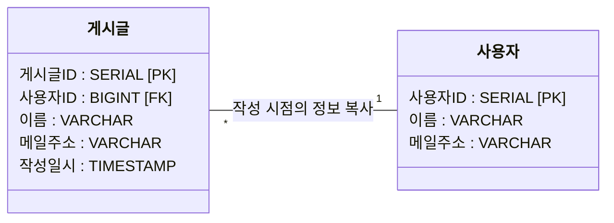

**장점**

- 작성 시점의 사용자 정보가 완전히 저장된다.
- 사용자가 삭제되어도 게시글 정보에 영향을 미치지 않는다.
- 구현이 간단하다.

**단점**

- 속성을 복사해서 가지고 있으므로, 한 명이 게시글을 여러 개 쓰는 경우 저장 용량을 압박한다.
- 이벤트 엔티티의 속성이 매우 많아진다.

##### 세대 관리 방식

세대 관리하는 경우는 다음과 같다.

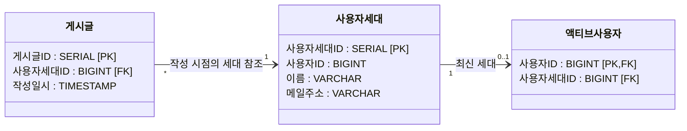

즉, 게시글과 같은 이벤트와 관련 붙는 것은 세대를 가진 테이블이며, 다른 유스케이스에서 사용자 정보를 참조하는 경우는 액티브사용자와 사용자세대를 JOIN하여 사용한다. 사용자ID로 사용자가 식별되는 쿼리는 액티브사용자가 사용자ID를 PK로 가지므로 인덱스 하나로 바로 해당 행을 찾아, 성능상의 단점도 특별히 생각할 필요가 없다.

**장점**

- 사용자 정보의 변경 내역을 완벽하게 추적할 수 있다.
- 게시글 작성 시점의 정확한 사용자 정보를 확인할 수 있다.
- 데이터 중복을 최소화한다.

**단점**

- 사용자 정보 변경 시 세대 관리 로직이 추가로 필요하다.

사용자를 횡단적으로 검색하는 경우에는, 사용자세대 테이블의 스캔이나 인덱스의 RANGE 스캔이 필요하게 되므로, 성능면에 주의해서 설계해야 한다. 액티브사용자 테이블에 이름이나 메일주소 속성을 중복해 갖게 하면, "사용자세대"는 이력의 의미를 띠게 된다. 그러나 이벤트 테이블과 리소스의 이력이 관련 붙는 것은 의미론적으로 이해하기 어려워지므로, 설계상은 어디까지나 세대라고 부르는 것을 추천한다. 이력이라는 이름은 지금은 유효하지 않은 과거 상태라는 함의를 갖는데, 액티브 사용자가 가리키는 최신 행도 같은 테이블의 한 행일 뿐이라 그 함의가 맞지 않다.

## 논리 삭제 설계를 위한 의사결정 흐름

지금까지 살펴본 검토 순서를 하나의 흐름으로 정리하면 다음과 같다.

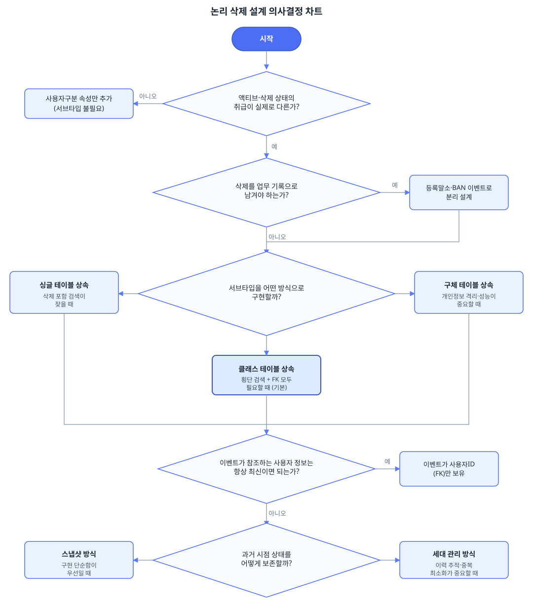

정리하면, 논리 삭제 설계는 한 번에 하나의 질문만 붙잡고 순서대로 풀어가는 문제다. 먼저 액티브 상태와 삭제 상태의 취급이 실제로 다른지부터 확인하고, 다르지 않다면 서브타입 없이 속성 하나로 끝난다. 다르다면 삭제라는 사건을 이벤트로 남길지 판단하고, 리소스에는 삭제일시 같은 이벤트성 속성을 두지 않는다. 서브타입은 싱글·구체·클래스 테이블 상속 중 하나로 구현하는데, 특별한 제약이 없다면 횡단 검색과 FK 제약을 모두 살릴 수 있는 클래스 테이블 상속이 기본값이 된다. 마지막으로 게시글 같은 이벤트가 참조하는 사용자 정보가 항상 최신이면 되는지, 아니면 이벤트 시점의 상태를 보존해야 하는지에 따라 단순 참조, 스냅샷, 세대 관리 중 하나를 고른다.

## 참조 사이트

- [Single Table Inheritance](https://martinfowler.com/eaaCatalog/singleTableInheritance.html)
- [Class Table Inheritance](https://martinfowler.com/eaaCatalog/classTableInheritance.html)
- [Concrete Table Inheritance](https://martinfowler.com/eaaCatalog/concreteTableInheritance.html)
