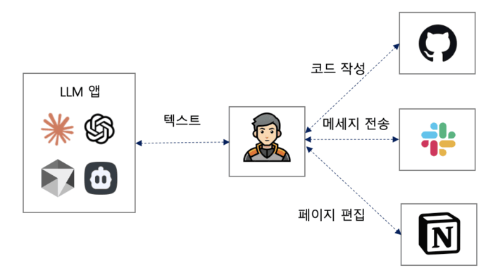
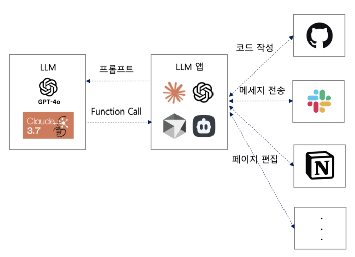
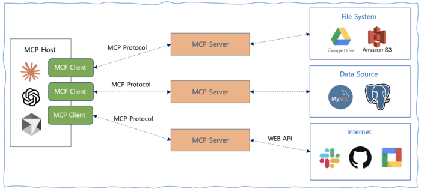

## 들어가며

Anthropic이 개발하고 OpenAI를 포함한 여러 AI 기반 회사들이 채택하면서, MCP는 AI 애플리케이션 연동의 표준으로 주목받고 있습니다. 이 글은 MCP를 처음 접하는 개발자와 AI 애플리케이션 연동에 관심 있는 분들을 대상으로 ["Specification - Model Context Protocol"](https://modelcontextprotocol.io/introduction)을 기반으로 내용을 정리했습니다. [MCP 2025-03-26](https://modelcontextprotocol.io/specification/2025-03-26) 스펙 기준입니다.

## MCP란 무엇인가

MCP는 Anthropic이 2024년 11월에 도입한 규격으로, AI 시스템이 각각 고립되는 문제를 해결하고 LLM이 실시간 컨텍스트를 안전하게 취득하며 외부 시스템과 쉽게 연동할 수 있도록 고안됐습니다.

MCP를 사용하지 않으면 AI가 데이터베이스, 웹 서비스, 로컬 파일에 접근하려 할 때마다 서로 다른 연결 방법을 일일이 만들어야 합니다. MCP를 활용하면 AI와 데이터/툴의 연결 방식을 표준화해 동일한 프로토콜로 다양한 데이터 소스 및 외부 서비스와 연동할 수 있습니다. LLM의 변화 과정을 살펴보면 MCP가 어떻게 탄생했는지 알 수 있습니다.

초기 LLM 앱은 텍스트만 응답할 수 있었고, 응답에 대해 무엇을 할지는 인간이 판단해야 했습니다.

_초기 LLM: 텍스트 응답만 가능, 행동 결정은 인간의 몫_

이 문제를 처음 해결한 것이 [OpenAI의 Function Calling](https://platform.openai.com/docs/guides/function-calling)입니다. Function Calling을 사용하면 LLM이 어떤 작업을 수행할지 결정하고, 지정된 JSON 응답을 통해 LLM 앱이 직접 작업을 수행할 수 있습니다.

_Function Calling: LLM이 직접 작업을 결정하고 구조화된 응답으로 실행_

그러나 LLM 앱이 많은 외부 서비스에 대해 일일이 연동을 구현하는 데는 한계가 있으며, 새로운 서비스가 나올 때마다 추가 대응이 필요합니다. 그래서 LLM 앱과 외부 서비스를 연계하기 위한 통일된 인터페이스인 MCP가 필요했습니다.

## 사용 프로토콜과 전송 방식

프로토콜은 JSON-RPC 2.0, Stateful connections 방식을 사용합니다. 전송(Transport) 방식은 stdio와 Streamable HTTP가 표준입니다.

> SSE(2024-11-05)는 구버전 스펙으로, 신규 구현에서는 Streamable HTTP 사용을 권장합니다.

| 애플리케이션      | SSE(2024‑11‑05) | stdio | Streamable HTTP |
| :--------------- | :-------------: | :---: | :-------------: |
| Roo Code         | O               | O     | X               |
| Cursor           | O               | O     | X               |
| Mastra           | O               | O     | X               |
| Claude Desktop   | X               | O     | X               |
| Cline            | X               | O     | X               |
| Windsurf         | O               | O     | X               |

## MCP 아키텍처

MCP는 호스트(Host), 클라이언트(Client), 서버(Server)의 세 가지 역할로 구성됩니다.

- **호스트(Host)**: 채팅봇이나 IDE 어시스턴트 등 LLM을 내장한 애플리케이션입니다. 데이터 검색 및 실행 처리를 직접 관리하는 대신 클라이언트에 위임합니다. 언제 외부 리소스를 조회할지, 도구를 실행할지, 구조화된 프롬프트를 사용할지 결정하고 클라이언트가 얻은 정보를 결합해 AI가 최적으로 활용할 수 있는 형태로 가공합니다.
- **클라이언트(Client)**: 호스트와 MCP 서버 사이에서 데이터 흐름과 도구 실행을 관리하는 중개자입니다. 하나의 클라이언트는 하나의 서버에 전용되며 `initialize`, `call_tool`, `read_resource` 등의 메서드를 사용해 JSON-RPC로 서버와 양방향 통신을 합니다. 서버로부터 로그 알림 등을 받으면 필요에 따라 호스트에 피드백을 보냅니다.
- **서버(Server)**: Tools(데이터베이스 질의, 메일 송신 등 액션을 LLM이 실행할 수 있게 하는 것), Resources(문서, 로그, API 응답 등 구조화된 정보를 제공해 모델이 응답 생성 시 참조할 수 있게 함), Prompts(미리 준비된 템플릿으로 대화 흐름을 안내)에 대한 액세스를 제공합니다. 예를 들어 로컬 파일 시스템 접근, 클라우드 실시간 금융 데이터 조회, 비즈니스 애플리케이션을 통한 워크플로우 자동화 등의 기능을 제공할 수 있습니다.

## MCP 기본 요소(Primitive)

**1. Client Primitive**

- **Roots**: 어떤 파일, 데이터베이스, 서비스에 MCP 서버가 액세스할 수 있는지 제한하고 관리합니다. 애플리케이션이 필요한 데이터 소스만 제공하고 LLM이 액세스할 수 있는 정보를 안전하게 관리할 수 있습니다.
- **Sampling**: 반복형 응답 생성을 가능하게 합니다. 한 번만 정적 응답을 생성하는 대신 MCP 클라이언트는 여러 번 생성하며 매번 추가 컨텍스트와 조건으로 응답을 정교하게 만들어 응답의 질, 유연성, 관련성이 향상됩니다.

**2. Server Primitive**

- **Tools**: LLM이 외부 기능을 수행하기 위한 메커니즘으로, 텍스트 처리를 넘어서는 액션을 가능하게 합니다. 단순히 데이터를 제공하는 Resources, 대화를 구조화하는 Prompts와 달리, Tools는 실시간 데이터 검색, 데이터베이스 업데이트, 계산 처리 등을 수행할 수 있습니다.
- **Resources**: 파일, 로그, API 응답과 같이 LLM이 응답을 생성할 때 참조할 수 있는 구조화된 데이터를 제공합니다. 외부 처리 없이 모델의 컨텍스트에 정보를 통합해 최신의 일관된 정보에 쉽게 액세스할 수 있습니다.
- **Prompts**: 외부 작업을 일으키지 않고 미리 결정된 템플릿으로 대화를 구조화합니다. '빈칸 채우기' 형태로 특정 작업의 일관성을 유지하는 프레임워크를 제공하며, 모델의 응답 방향을 외부 시스템 변경 없이 조정할 수 있습니다.

Client와 Server 기본 요소에 대한 LLM 앱별 지원 현황은 아래와 같습니다.

| LLM App        | Resources | Prompts | Tools | Sampling | Roots |
| :------------- | :-------: | :-----: | :---: | :------: | :---: |
| Roo Code       | O         | X       | O     | X        | X     |
| Cursor         | X         | X       | O     | X        | X     |
| Zed            | X         | O       | X     | X        | X     |
| Claude Desktop | O         | O       | O     | X        | X     |
| Cline          | O         | X       | O     | X        | X     |
| Windsurf       | X         | X       | O     | X        | X     |

## MCP 동작 순서

MCP는 개발자가 세부 사항을 신경 쓰지 않아도 되도록 추상화하고 있습니다. 개발자는 MCP 사양에 따라 서버를 구현(또는 기존 서버를 사용)하고 해당 클라이언트를 갖춘 AI 앱을 준비하기만 하면 됩니다. Anthropic은 개발을 단순화하기 위해 [Python](https://github.com/modelcontextprotocol/python-sdk), [TypeScript](https://github.com/modelcontextprotocol/typescript-sdk), [Java](https://github.com/modelcontextprotocol/java-sdk), [Kotlin](https://github.com/modelcontextprotocol/kotlin-sdk), [C#](https://github.com/modelcontextprotocol/csharp-sdk) 등 다국어 SDK를 제공합니다.

**1. Capability Discovery**

MCP 클라이언트가 먼저 서버에 "어떤 도구, 리소스, 프롬프트를 사용할 수 있는지"를 문의합니다. AI 모델(호스트 앱을 통해)은 서버가 제공할 수 있는 기능을 파악합니다.

**2. Augmented Prompting**

사용자의 질문과 주변 정보가 서버에서 얻은 툴과 리소스 설명과 함께 AI 모델로 전송됩니다. 예를 들어 "내일의 날씨는?" 이라는 질문이 있으면 "Weather API 도구"의 설명이 프롬프트에 포함됩니다.

**3. Tool/Resource Selection**

AI 모델은 질문과 이용 가능한 툴·리소스를 분석해 사용 여부를 판단합니다. 필요하다고 판단되면 MCP 사양에 따라 어떤 도구와 리소스를 사용할지 구조화된 형태로 반환합니다.

**4. Server Execution**

MCP 클라이언트가 모델 요청을 받아 MCP 서버의 해당 기능을 호출합니다(예: Weather API 실행). 서버가 실제로 외부 API 또는 데이터베이스를 호출하고 결과를 클라이언트에 반환합니다.

**5. Response Generation**

서버에서 얻은 결과가 클라이언트를 통해 AI 모델에 전달되고, 모델은 그 데이터를 응답에 포함합니다. 최종적으로 사용자에게 "내일의 날씨는 15도, 바람이 조금 부는 맑은 날씨입니다"와 같이 외부 정보를 활용한 응답이 반환됩니다.

## 설계 가이드

- **서버는 간단하게 유지합니다.** 큰 오케스트레이션은 호스트가 담당하고, 서버는 필요한 기능에만 특화해 구축합니다.
- **각 서버는 자신의 권한 내에서 완결됩니다.** 보안상 서버끼리는 직접 데이터를 공유하지 않으며, 전체 파악은 호스트에 맡깁니다.
- **점진적인 기능 추가를 합니다.** 핵심 기능은 최소한으로 유지하고, 확장 기능은 **Capability Negotiation** 으로 합의하면서 추가합니다. Capability Negotiation이란 클라이언트와 서버가 연결 초기에 지원 기능 목록을 교환하는 협상 메커니즘으로, 역호환성을 유지하면서 프로토콜을 성장시킬 수 있습니다.

## MCP 활용 사례

**1. 개발 환경에서의 활용(IDE 통합)**

- **코드 어시스턴트**: 파일 시스템, 버전 관리, 패키지 관리자, 문서 등과 연계하여 코드 완성과 제안 기능을 제공합니다.
- **디버그 어시스턴트**: 오류 로그 및 디버그 정보에 액세스하여 문제 해결을 지원합니다.
- **문서 생성**: 코드베이스를 분석하고 자동으로 문서를 생성합니다.

**2. 비즈니스 도구와의 협업**

- **데이터 분석 플랫폼**: 여러 데이터베이스와 시각화 도구를 연동하여 자연어로 데이터 분석 기능을 제공합니다.
- **프로젝트 관리 도구**: Slack, GitHub, Linear, Todoist 등과 연동하여 작업 관리, 진행 보고를 자동화합니다.

**3. 데이터 분석 및 검색 강화**

- **복합 데이터 분석**: 여러 데이터베이스와 분석 도구를 연동하여 포괄적인 분석을 제공합니다.
- **지식 기반 검색**: 사내 문서, 외부 소스 등을 횡단적으로 검색하여 정확한 정보를 제공합니다.
- **시맨틱 검색**: Qdrant 등의 벡터 검색 엔진과 연계하여 의미 기반의 고급 검색을 제공합니다.

## MCP 서버를 제공하는 기업

- [GitHub](https://github.com/github/github-mcp-server): Pull Request 관리, 이슈 관리, 리포지토리 관리, 검색 기능 제공.
- [Cloudflare](https://github.com/cloudflare/mcp-server-cloudflare): Workers, KV, R2 및 D1을 포함한 Cloudflare 서비스와의 통합.
- [Slack](https://github.com/modelcontextprotocol/servers/tree/main/src/slack): 채널 조회, 채널 사용자 조회, 메시지 발송, 메시지 응답 등 지원.
- [Shopify](https://github.com/Shopify/dev-mcp): 개발 문서, GraphQL 스키마 검색, 전문 프롬프트로 Shopify 관리 API에 대한 효과적인 GraphQL 작업 작성 지원.
- [Gitlab](https://github.com/modelcontextprotocol/servers/tree/main/src/gitlab): 이슈 관리, 리포지토리 관리, Merge Request 관리.
- [AWS S3](https://github.com/aws-samples/sample-mcp-server-s3): 버킷 리스트/버킷 내 오브젝트 조회, 오브젝트 내용 검색.
- [Google Drive](https://github.com/modelcontextprotocol/servers/tree/main/src/gdrive): 파일 목록 조회, 읽기 및 검색을 위한 Google Drive 통합.
- [Postgres](https://github.com/modelcontextprotocol/servers/tree/main/src/postgres): 데이터베이스 스키마 조회, 쿼리(readOnly) 실행.
- [Notion](https://github.com/makenotion/notion-mcp-server): 콘텐츠/코멘트/작업 공간/사용자 관리 기능 제공.
- [Obsidian](https://github.com/smithery-ai/mcp-obsidian): 노트/태그/디렉토리 관리, 검색 기능 제공.
- [Figma](https://github.com/GLips/Figma-Context-MCP): 정확한 디자인 정보(색상, 크기, 글꼴, 간격), 컴포넌트 데이터 추출, 디자인에서 코드로 변환, 디자인 토큰 일괄 취득 가능.
- [그 외 MCP Server 리스트](https://github.com/modelcontextprotocol/servers): Reference Servers(Anthropic이 구현), Third-Party Servers(Anthropic 외 구현), Community Servers(서비스와 무관한 사용자 제공) 구분으로 정리되어 있습니다.

## 마치며

MCP는 AI와 외부 세계를 연결하는 USB-C 같은 표준 인터페이스입니다. 핵심 포인트를 세 가지로 정리합니다.

1. **표준화의 힘**: MCP 이전에는 외부 서비스마다 별도의 연동 코드가 필요했습니다. MCP는 한 번의 구현으로 모든 MCP 호환 서비스와 연동할 수 있게 합니다.
2. **역할 분리**: Host(오케스트레이션)·Client(중개)·Server(기능 제공)의 명확한 역할 분리가 보안과 확장성을 동시에 잡습니다.
3. **Capability Negotiation**: 초기 협상으로 지원 기능을 교환하는 메커니즘이 역호환성을 유지하면서 프로토콜을 점진적으로 성장시킵니다.

## 참고 자료

- [Model Context Protocol (MCP)](https://modelcontextprotocol.io/introduction)
- [The Model Context Protocol (MCP): A guide for AI integration](https://wandb.ai/byyoung3/Generative-AI/reports/The-Model-Context-Protocol-MCP-A-Guide-for-AI-Integration--VmlldzoxMTgzNDgxOQ)
- [Everything Wrong with MCP](https://blog.sshh.io/p/everything-wrong-with-mcp)
