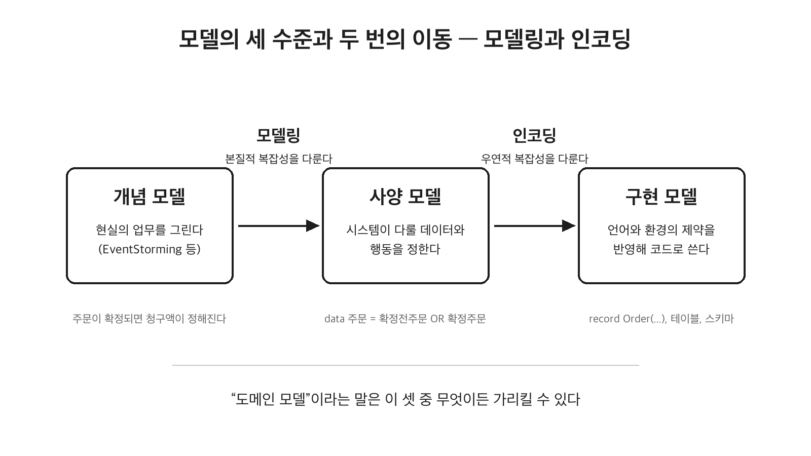

[전편](https://www.mimul.com/blog/abstraction-meta/)에서 추상화란 현실의 대상에서 목적에 필요한 것만 골라내는 일이고, 그 결과를 타입으로 써내는 순간 데이터에 대한 기술(메타)이 된다고 정리했다. 그런데 골라낸 것이 코드가 되기까지의 사이에는 생각보다 넓은 간격이 있다. 골라낸 것을 업무의 언어로 정리한 결과물이 **모델** 이고, 모델을 코드나 스키마 같은 구체적인 형식으로 옮겨 적는 일이 **표현** 이다. 이 글은 "현실에서 소프트웨어로 넘어가기 위해 알아야 하는 것들"의 두 번째 글이다. 추상과 메타를 다룬 첫 번째 글이 생각하는 방법에 대한 것이었다면, 이번에는 생각을 소프트웨어로 옮기는 방법을 다룬다. 모델이라는 말이 실제로는 세 가지 다른 것을 가리킨다는 데서 출발해, 모델을 발견하는 도구들, 모델이 코드가 될 때 무너지기 쉬운 지점과 그 처방, 도메인 모델을 이루는 어휘와 흔한 냄새들, 그리고 같은 모델을 옮겨 적는 표현의 선택지를 살펴본다.

## 모델이라는 말이 가리키는 세 가지

마틴 파울러는 데이터베이스 설계에서 논리 설계와 물리 설계를 구분하듯, 모델에도 목적이 다른 세 수준의 구분이 필요하다고 말한다. **개념 모델** 은 실세계에서 관심 있는 업무 상황을 기술한다. Domain Storytelling이나 Big Picture EventStorming처럼, 시스템이 다루든 말든 현재의 업무를 그려내는 활동이 여기에 해당한다. **사양 모델** 은 소프트웨어가 무엇을 해야 하고 어떤 정보를 유지해야 하는지를 정의한다. **구현 모델** 은 프로그래밍 언어와 실행 환경의 제약까지 반영해 소프트웨어가 실제로 어떻게 만들어지는지를 기술한다.



도메인 주도 설계는 이 셋을 의도적으로 하나의 연속체로 다뤘다. 업무 이해에서 코드까지 하나의 모델을 관통시키는 것이 목표였기 때문이다. 그 덕에 도메인 모델이라는 말은 널리 퍼졌지만, 그 말이 개념·사양·구현 중 무엇을 가리키는지는 모호해졌다. 실무에서 도메인 주도 설계가 구현 단계에 와서야 동원되는 경우도 많은데, 그러면 모델은 구현 언어의 제약을 강하게 받으면서 업무 이해와의 거리가 벌어진다.

수준을 구분하면 이 벌어짐이 눈에 보인다. 메일 발송 기능의 사양 모델을 데이터와 행동으로 써 보자.

```text
data 메일주소 = 미인증 메일주소 OR 인증된 메일주소
behavior 메일을 보낸다 = 인증된 메일주소 AND 본문 -> 발송 이벤트
```

구현 모델로 넘어가면 이것이 흔히 다음과 같은 형태가 된다.

```java
record EmailAddress(String value, boolean isActivated) {}
```

사양에는 없던 isActivated라는 플래그가 등장했다. 미인증과 인증이라는 별개의 개념이 필드 하나로 눌려 담기면서 생긴 산물이다. 반대 방향의 균열도 있다. 확정 전 주문과 확정된 주문, 발송된 주문은 사양 수준에서 가질 수 있는 값도 할 수 있는 일도 다른 별개의 개념이지만, 구현에서는 orderStatus 필드 하나를 품은 Order 클래스 하나로 합쳐지기 쉽다. 상태별 규칙은 코드 어딘가에 흩어져 구현될지 몰라도 모델 위에서는 보이지 않게 된다. 전편의 기준으로 말하면, 공통의 데이터와 행동을 목적을 가지고 골라낸 것이 아니므로 이것은 추상이 아니라 그냥 뭉쳐진 덩어리다.

## 모델을 어떻게 발견하는가

세 수준을 나눴으니, 각 수준을 채울 내용은 어디서 얻는지가 다음 질문이 된다. 모델은 책상에서 발명되는 것이 아니라 업무를 아는 사람들에게서 발견된다. 그 원형은 업무 담당자 인터뷰이고, 아래의 기법들은 인터뷰가 흐르기 쉬운 잡담이 되지 않도록 형식을 입힌 것이다.

개념 수준에서 쓰는 도구가 앞 절에서 이름만 스친 EventStorming과 Domain Storytelling이다. EventStorming은 업무 담당자와 개발자가 한자리에 모여 "주문이 확정되었다" 같은 업무 사건을 시간순으로 벽에 붙여 가며 업무 전체의 흐름을 드러낸다. Domain Storytelling은 담당자가 들려주는 구체적인 업무 사례를 "누가, 무엇을, 무엇으로 하는가"의 그림 언어로 기록한다. 두 도구 모두 산출물 못지않게 과정이 중요하다. 그리는 동안 참여자들이 같은 용어로 말하기 시작하므로, 다음 절에서 다룰 유비쿼터스 언어가 이 자리에서 만들어진다.

사양 수준으로 내려오면 규칙을 캐내는 도구가 필요하다. Example Mapping은 "주말 배송 불가" 같은 규칙 하나를 놓고 그 규칙이 성립하는 예와 성립하지 않는 예를 카드로 모은다. 예를 모으다 보면 "공휴일은 어떻게 되는가", "도서 지역도 주말로 치는가" 같은 질문이 나오면서 규칙의 정확한 경계가 드러나고, 이렇게 캐낸 규칙이 뒤에서 다룰 타입의 불변조건이 된다.

Event Modeling은 시스템의 동작을 시간축 위에 커맨드(하려는 일), 이벤트(일어난 사실), 뷰(보여줄 것)로 배열해 사양을 그린다. 상태 대신 사건을 중심에 두는 설계라서, 표현 절에서 다룰 이벤트 소싱과 자연스럽게 이어진다.

발견한 개념들에 책임을 나눠 주는 단계에는 CRC 카드라는 오래된 도구가 있다. 카드 한 장에 개념의 이름과 책임, 협력자를 적어 가며 "이 일은 누구의 책임인가"를 손으로 따져 본다. 엄밀히는 발견보다 배분의 도구이지만, 한 카드에 책임이 몰리는 것이 보이면 그것이 개념을 쪼갤 신호가 되므로 발견과 맞물려 돈다.

발견은 킥오프 워크숍 한 번으로 끝나는 행사가 아닌데, 그 이유는 글의 마지막 절에서 다룬다.

## 모델링과 인코딩이라는 두 작업

이 세 수준 사이의 이동에는 성격이 다른 두 작업이 있다. 업무가 본래 지닌 본질적 복잡성을 어떻게 다룰지 생각하는 일이 **모델링** 이고, 언어·프레임워크·저장소 같은 도구가 강요하는 우연적 복잡성을 어떻게 다룰지 생각하는 일이 **인코딩** 이다. 전편에서 추상화라는 설계 판단과 메타화라는 기술 작업이 소프트웨어에서는 거의 동시에 일어난다고 했는데, 모델링과 인코딩도 같은 이유로 뒤섞인다. 그래서 코드가 이상할 때 물어야 할 질문이 두 개로 갈라진다. 업무를 잘못 잘랐는가(모델링의 문제), 아니면 잘 자른 것을 도구의 사정에 맞추다 비틀었는가(인코딩의 문제). 앞의 isActivated 플래그는 인코딩이 모델을 침식한 예이고, 화면의 입력란을 그대로 타입으로 만든 구조는 모델링 자체가 없었던 예다.

인코딩의 침식은 필드 하나에서 끝나지 않는다. 많은 프로젝트에서 테이블이 먼저 만들어지고, 그 테이블을 그대로 본뜬 클래스가 생기고, 그 클래스를 복사한 DTO가 API가 되고, API가 화면이 된다. 이 연쇄가 완성되면 시스템의 모든 층이 저장을 위해 설계된 구조를 따라간다. 데이터베이스는 저장에 맞게 설계된 표현이지 업무 개념을 표현하려고 설계된 것이 아닌데도, 컬럼이 늘면 모델이 늘고 화면이 바뀌면 도메인이 바뀐다. 모델이 표현에 끌려다니는 것이다. 마틴 파울러가 프레젠테이션·도메인·데이터의 분리를 계층화의 기본으로 꼽는 근거가 여기에 있다. 하나의 도메인 로직 위에는 웹, 모바일, API처럼 여러 프레젠테이션이 얹힐 수 있으므로, 화면 하나의 사정이 모델에 스며들면 그 변경은 모델을 공유하는 나머지 표현 전부로 번진다.

한편 모델링이 잘못됐다는 신호는 코드에서 발견할 수 있다. 행동의 이름이 그 하나다. 좋은 행동의 이름은 하나의 책임을 표현한다. 청구서를 계산하고 갱신한다는 식으로 동사 두 개가 들어간 이름이 필요해졌다면, 그 행동에는 이미 두 개의 책임이 섞여 있을 가능성이 높다. 입력의 크기도 신호다. 고객 객체 전체를 받아 놓고 실제로는 이름 하나만 쓰는 행동은 필요한 것보다 큰 덩어리에 결합해 있다(이런 결합을 스탬프 결합이라 부른다). 행동이 정말 필요로 하는 입력만 받도록 서명을 좁히는 것은 구현 기교가 아니라, 그 행동이 업무에서 무엇에 의존하는지를 모델 수준에서 다시 묻는 일이다.

이름의 문제는 행동에 그치지 않는다. 회원, 사용자, 고객, 계정이 같은 개념인지 서로 다른 개념인지가 팀 안에서 정리되어 있지 않으면, 같은 코드를 두고도 사람마다 다른 현실을 떠올린다. 좋은 모델이 만들어지면 이 언어도 함께 정리된다. 도메인 주도 설계가 **유비쿼터스 언어** 라는 이름으로 업무 전문가와 개발자가 같은 용어를 쓰라고 요구하는 이유가 이것이다. 개념의 이름을 고르는 일은 네이밍 취향의 문제가 아니라, 팀이 같은 현실을 같은 방식으로 이해하고 있는지 확인하는 일이다.

## 코드가 된 모델이 앓는 두 가지 병

구현 모델에서 반복적으로 나타나는 병이 두 가지 있다. 첫 번째는 마틴 파울러가 이름 붙인 **도메인 모델 빈혈증** 으로, 도메인의 데이터를 본뜬 클래스를 만들면서 getter와 setter만 두는 상태를 가리킨다.

```java
class Task {
    Long id;
    TaskStatus status;
    LocalDate dueDate;
    int postponeCount;
    // 모든 필드의 getter와 setter
}
```

이 Task의 마감일을 어떻게 바꾸든, 상태를 어떻게 뒤집든 사용하는 쪽의 자유다. 하지만 업무에는 규칙이 있다. 연기는 세 번까지만 가능하고 연기할 때마다 마감일이 하루 늘어난다고 하자. 이 지식이 도메인 객체에 없으면 그것을 사용하는 모든 곳이 각자 규칙을 기억해야 한다. 그래서 흔한 처방은 행동을 객체 안으로 옮기는 것이다.

```java
class Task {
    static final int POSTPONE_MAX = 3;
    // 필드 생략

    void postpone() {
        if (postponeCount >= POSTPONE_MAX) {
            throw new IllegalStateException("최대 연기 횟수를 초과했다");
        }
        dueDate = dueDate.plusDays(1);
        postponeCount++;
    }

    void done() {
        status = TaskStatus.DONE;
    }
}
```

빈혈증 설명이 여기서 끝나는 경우가 많지만, 이 코드에는 아직 병이 남아 있다. 완료된 Task에도 postpone과 done을 부를 수 있다. 메서드 안에서 상태를 검사해 예외를 던지면 되지 않느냐고 생각하기 쉽지만, 문제의 뿌리는 검사의 누락이 아니라 가질 수 있는 값과 할 수 있는 일이 다른 두 개념(미완료 태스크와 완료 태스크)을 Task라는 하나의 타입으로 표현한 데 있다. 그래서 타입을 나눈다.

```java
sealed interface Task permits UndoneTask, DoneTask {}

record UndoneTask(TaskId id, LocalDate dueDate, int postponeCount) implements Task {
    static final int POSTPONE_MAX = 3;

    UndoneTask postpone() {
        if (postponeCount >= POSTPONE_MAX) {
            throw new IllegalStateException("최대 연기 횟수를 초과했다");
        }
        return new UndoneTask(id, dueDate.plusDays(1), postponeCount + 1);
    }

    DoneTask done() {
        return new DoneTask(id, LocalDate.now());
    }
}

record DoneTask(TaskId id, LocalDate doneDate) implements Task {}
```

완료된 태스크에는 postpone이라는 행동 자체가 존재하지 않으므로 사용하는 쪽이 실수할 여지가 컴파일 시점에 사라지고, 타입 자체가 업무 지식이 된다. 연기 횟수가 남은 태스크와 소진된 태스크를 다시 타입으로 나누는 데까지 밀어붙일 수도 있다. 덧붙이면 postpone과 done이 record의 메서드여야 하는 것도 아니다. 미완료 태스크를 받아 완료 태스크를 돌려주는 함수가 도메인 층 어딘가에 있으면 충분하고, 함수형 언어로 도메인을 모델링할 때는 실제로 그렇게 쓴다. 빈혈증 여부를 가르는 것은 메서드의 소유가 아니라 값과 행동이 다른 데이터를 다른 모델로 정의했는가이다.

두 번째 병은 생성 시점에 있다. 도메인 객체는 만들어지는 순간부터 올바른 상태여야 한다는 원칙을 **Always-Valid Domain Model** 이라 부른다. 마이너스 금액의 돈이 만들어질 수 있고 그것이 올바른지를 사용하는 쪽이 검사해야 한다면, 검사를 잊은 곳 하나가 시스템 전체에 잘못된 값을 흘려보낸다. 검증 메서드를 객체에 두는 것으로는 부족하다. 그것을 호출할 책임이 여전히 사용하는 쪽에 남기 때문이다. 생성자가 잘못된 값을 거부하게 만들면 책임의 방향이 뒤집힌다.

```java
record Money(BigDecimal amount) {
    Money {
        if (amount.signum() < 0) {
            throw new IllegalArgumentException("금액은 음수일 수 없다");
        }
    }
}
```

이 관점을 입력 경계까지 밀고 가면 "검증하지 말고 파싱하라"는 원칙이 된다. 외부에서 들어온 문자열을 검증 함수로 확인만 하고 문자열인 채로 흘려보내는 대신, 경계에서 도메인 타입으로 변환해 버리고 내부에서는 그 타입만 다루는 것이다. 검증은 통과 여부라는 정보를 그 자리에서 소비해 버리지만, 파싱은 그 정보를 타입에 실어 이후의 모든 코드에 전달한다. 메일 주소 예로 돌아가면, 미인증 메일주소와 인증된 메일주소를 별개의 타입으로 두고 발송 함수가 인증된 타입만 받게 하면, 미인증 주소로 발송하는 실수는 코드로 쓸 수조차 없게 된다.

두 병의 처방은 결국 같다. 업무 규칙을 사용하는 쪽의 주의력에 맡기지 말고 타입에 맡긴다. 잘못된 상태가 표현될 수 없게 타입을 설계할수록, 규칙 위반은 시스템 깊숙이 들어가기 전에, 이르면 컴파일 시점에 걸러진다.

## 도메인 모델의 구성 요소

구현 모델의 논의를 더 진행하기 전에, 도메인 주도 설계가 쓰는 기본 어휘를 정리해 두자. 일부는 새 개념이 아니라, Task와 Money처럼 앞의 예제에 이미 등장한 것에 이름을 붙이는 일이다.

- **엔티티**: 식별자로 추적되는 객체다. Task에 TaskId를 둔 것은 마감일이 연기되고 상태가 완료로 바뀌어도 같은 태스크임을 식별자가 보장하기 때문이다. 엔티티의 동일성은 속성이 아니라 식별자가 정하며, 주문이나 회원처럼 생명주기를 따라 상태가 변하는 개념이 엔티티가 된다.
- **[Value Object(값 객체)](https://www.mimul.com/blog/value-object/)**: 식별자가 없고 값으로만 비교되는 객체다. 앞의 Money가 그 예로, 금액이 같으면 같은 돈일 뿐 "어느 돈인가"를 물을 이유가 없다. 값 객체를 불변으로 설계하고 생성자가 잘못된 값을 거부하게 하면, Always-Valid를 지키는 최소 단위가 된다. 주소나 기간처럼 여러 속성이 모여 하나의 값을 이루는 개념도 값 객체로 묶는다.
- **애그리거트**: 함께 지켜야 할 불변조건을 공유하는 엔티티와 값 객체를 하나로 묶은 단위다. 주문과 주문 항목은 "주문의 합계는 항목 합계와 같아야 한다"는 규칙을 공유하므로 한 애그리거트가 되고, 바깥에서는 대표 객체(애그리거트 루트)를 통해서만 접근한다. 규칙이 지켜지는 경계이자 트랜잭션의 경계다.
- **도메인 서비스**: 어느 한 애그리거트의 책임으로 두기 어려운 업무 로직을 맡는 자리다. 여러 애그리거트에 걸친 조정이 대표적인 예로, 조정 과정에서 각 객체에 자기 몫의 일을 시키되 규칙 자체는 각 객체가 지키게 한다.
- **도메인 이벤트**: 도메인에서 일어난 사실을 알리는 불변 객체다. "주문이 확정되었다"처럼 과거 시제로 이름 짓고, 식별자와 발생 시각 같은 필수 정보만 담는다. 사실의 확정과 그에 따르는 부수효과를 분리하는 데 쓰인다.

여기까지가 모델 안쪽의 어휘라면, 모델이 미치는 범위를 정하는 어휘도 있다.

- **서브도메인**: 비즈니스 전체를 문제 영역 단위로 나눈 것이다. 온라인 커머스라면 주문, 배송, 회원, 정산이 각각 서브도메인이 된다. 무엇을 해결해야 하는가에 대한 분할이다.
- **바운디드 컨텍스트**: 하나의 모델과 유비쿼터스 언어가 유효한 경계다. 서브도메인이 문제 쪽의 분할이라면 바운디드 컨텍스트는 해결책 쪽의 경계로, 같은 상품이라도 주문 컨텍스트와 배송 컨텍스트에서는 다른 모델이 된다. 전편에서 배송·정산·재고 관점마다 주문의 타입을 따로 둔 것이 바로 컨텍스트마다 모델을 나눈 예다. 도메인 모델은 자신이 속한 컨텍스트 안에서만 유효하며, 이 경계를 무시하고 하나의 모델을 모든 곳에서 쓰려 할 때 모든 목적에 어중간한 거대 모델이 나온다.

애그리거트와 도메인 서비스, 도메인 이벤트가 왜 따로 필요한지는 다음 절에서 업무 규칙이 닫히는 단위를 따라가며 확인한다.

## 도메인 모델의 완전성과 순수성

앞에서 업무 규칙을 사용하는 쪽의 주의력이 아니라 타입에 맡기라고 했다. 그렇다면 업무 규칙을 전부 도메인 객체에 밀어 넣으면 되는가. 여기에는 두 가지 한계가 있다. 규칙이 닫히는 단위의 한계와, 도메인만으로는 판정할 수 없는 규칙의 한계다.

먼저 단위의 한계다. 음수 금지처럼 값 하나에 닫히는 규칙은 값 객체가 지키고, 주문 합계처럼 여러 객체에 걸치는 규칙은 애그리거트가 지킨다. 뒤집어 말하면 객체가 스스로 지킬 것은 자기 애그리거트에 닫히는 규칙까지다. 행동을 객체 안으로 옮기라는 앞 절의 처방을 무한정 밀어붙여 주문 객체가 상품의 재고를 줄이고 쿠폰을 사용 처리하는 데까지 나아가면, 자기 규칙을 지키는 객체가 아니라 남의 상태까지 주무르는 갓 객체가 된다. 애그리거트의 경계를 넘는 이런 조정이 바로 도메인 서비스의 몫이다.

다음은 판정의 한계다. 도메인 모델이 갖추면 좋은 성질로 **완전성** (업무 규칙이 도메인 객체 안에 닫혀 있다)과 **순수성** (도메인이 다른 레이어나 부수효과 있는 객체에 의존하지 않는다)이 있는데, 애플리케이션 성능까지 세 가지를 동시에 만족시킬 수 없는 규칙이 있다.

회원의 메일 주소 변경을 생각하자. "회사 도메인의 주소여야 한다"는 규칙은 회원과 회사 객체만으로 판정할 수 있으니 도메인 안에 닫힌다. 여기에 "다른 회원과 중복되면 안 된다"는 규칙이 추가되면 사정이 달라진다. 판정에 데이터베이스 조회가 필요하기 때문이다. 선택지는 세 가지다. 중복 검사를 애플리케이션 층에서 하면 업무 규칙 하나가 도메인 밖으로 새어 나가 완전성이 깨진다. 조회용 포트를 도메인 객체에 넘기면 규칙은 도메인에 모이지만 도메인이 인프라에 의존해 순수성이 깨진다. 전체 회원을 메모리에 올려 도메인 안에서 검사하면 완전성과 순수성은 지켜지지만 성능이 무너진다.

셋 다 가질 수 없으니 무엇을 버릴지 정해야 한다. 이 트레이드오프를 정리한 Vladimir Khorikov의 권고는 완전성보다 순수성을 지키라는 것이다. 복잡한 업무 규칙을 잡음 없이 모아 두려고 도메인 층을 만들었는데 거기에 인프라 접근 같은 다른 책무가 섞이면 층을 나눈 목적 자체가 무너진다는 이유다. 실무에서 쓸 수 있는 판별법도 여기서 나온다. 도메인 모델의 테스트가 모킹 없이 빠르게 도는가가 순수성을 재는 시험지다.

순수성을 지키면서 부수효과를 다루는 구체적인 기법도 있다. 메일 주소가 바뀌면 확인 메일을 보내야 한다고 하자. 도메인 객체가 발송 서비스를 직접 부르면 순수성이 깨진다. 대신 도메인 객체는 "메일 주소가 변경되었다"는 도메인 이벤트로 일어난 사실만 반환하고, 발송이라는 기술적 처리는 그 이벤트를 받은 핸들러가 맡는다. 규칙과 사실의 확정은 도메인에 남고 부수효과는 바깥으로 나가, 둘 다 제자리를 찾는다. 이름이 비슷하지만 뒤의 표현 절에 나오는 이벤트 소싱과는 다른 것이다. 도메인 이벤트는 사실을 통지하는 수단이고, 이벤트 소싱은 사실의 기록을 상태의 원본 저장소로 삼는 표현이다.

## 모델을 깨뜨리는 냄새들

지금까지 예제로 만난 병들에는 업계에서 통용되는 이름이 있다. 리팩토링 문헌이 코드 냄새(code smell)라 부르는 어휘로, 이름을 알아 두면 코드 리뷰에서 긴 설명 없이 문제를 가리킬 수 있다. 이 글에서 이미 논증한 것들을 이름과 함께 정리하면 이렇다.

| 냄새 | 이 글에서 본 모습 | 처방 |
|---|---|---|
| Data Class | getter와 setter만 있는 Task | 행동을 객체 안으로, 상태별 타입 분리 |
| Boolean Flag | 미인증과 인증을 눌러 담은 isActivated | 별개의 개념은 별개의 타입으로 |
| Status Enum Explosion | 모든 상태를 orderStatus 하나에 담은 Order | 불변조건이 다른 상태는 타입으로 분리 |
| God Aggregate | 재고와 쿠폰까지 주무르는 주문 객체 | 애그리거트 경계, 조정은 도메인 서비스로 |
| Database First Model | 테이블을 본뜬 클래스가 화면까지 지배 | 프레젠테이션·도메인·데이터 분리 |
| UI First Model | 화면 입력란을 그대로 옮긴 타입 | 목적에서 출발하는 모델링 |

여기에 아직 이름을 붙이지 않은 냄새가 셋 더 있다.

**Primitive Obsession(원시 타입 집착)**: 도메인 개념을 String이나 int 같은 원시 타입인 채로 시스템 전체에 흘려보내는 냄새다. 메일 주소가 String이면 아무 문자열이나 들어갈 수 있고, 금액이 BigDecimal이면 음수도 들어간다. "검증하지 말고 파싱하라"가 바로 이 냄새의 처방이었다. 경계에서 도메인 타입으로 바꾸고, 원시 타입이 도메인 안을 돌아다니지 않게 한다.

**Temporal Coupling(시간적 결합)**: 메서드를 특정 순서로 불러야만 올바르게 동작하는 냄새다. 검증을 먼저 호출한 뒤에야 저장을 호출할 수 있는 API가 그 예로, 순서라는 규칙이 타입이 아니라 호출하는 쪽의 기억에 있다. Always-Valid 논의에서 검증 메서드를 호출할 책임이 사용하는 쪽에 남는다고 한 문제가 바로 이것이고, 처방도 같다. 순서를 지켜야만 나올 수 있는 상태를 별개의 타입으로 만들어(미인증 메일주소를 검증해야만 인증된 메일주소를 얻듯이), 순서를 어긴 코드가 컴파일되지 않게 한다.

**Feature Envy(기능 욕심)**: 어떤 행동이 자기 객체의 데이터보다 남의 객체의 데이터를 더 자주 들여다보는 냄새다. 정산 코드가 주문 객체에서 금액, 수수료, 할인율을 하나하나 꺼내 계산하고 있다면, 그 계산은 데이터가 있는 쪽에 있어야 할 행동이다. 스탬프 결합이 필요보다 큰 입력의 냄새라면 기능 욕심은 잘못된 자리에 놓인 행동의 냄새이고, 행동을 데이터 곁으로 옮기라는 처방은 빈혈증의 처방과 같은 방향이다.

냄새라는 말이 시사하듯 이것들은 확정 판정이 아니라 신호다. 맡았다고 반드시 썩은 것은 아니지만, 열어서 확인해 볼 이유로는 충분하다.

## 같은 모델을 옮겨 적는 여러 표현

지금까지의 코드는 모두 클래스와 record, 즉 객체지향 언어의 어휘로 모델을 옮겨 적었다. 그러다 보면 클래스가 곧 모델이라고 여기기 쉽지만, 클래스는 모델을 표현하는 여러 방법 중 하나일 뿐이다. 같은 주문 모델이 테이블에서는 저장을 위한 행으로, API에서는 전달을 위한 JSON으로, 화면에서는 "주문 완료"라는 문구로 나타난다. 표현이 달라져도 유지되어야 하는 것은 모델의 의미다. 그리고 같은 사양 모델이라도 옮겨 적는 자리가 다르면 강제되는 성질이 달라지므로, 어디에 옮겨 적을지는 선택의 문제가 된다.

- **객체지향 표현**: 상태와 행동을 한 단위로 묶는다. 엔티티, 값 객체, 애그리거트 같은 패턴이 이 표현 위의 어휘이고, 불변조건은 생성자와 메서드가 지킨다. 앞에서 본 Task가 이 표현의 예다.
- **함수형 표현**: 상태를 불변 데이터로 두고 행동을 순수 함수로 표현한다. 상태 전이가 미완료 태스크를 받아 완료 태스크를 돌려주는 함수, 즉 타입에서 타입으로 가는 화살표가 된다. 상태별로 타입을 나누는 설계와 자연스럽게 맞물리며, Domain Modeling Made Functional이 이 표현의 교과서다.
- **관계형 표현**: 모델을 테이블과 외래 키, 정규화로 옮겨 적는다. 유일성 제약이나 참조 무결성처럼 집합 단위의 정합성을 데이터베이스가 강제해 준다는 것이 이 표현의 힘이다. 앞 절의 메일 주소 중복 규칙처럼 객체 하나에 닫히지 않는 규칙이 이 표현에서는 UNIQUE 제약 한 줄이 된다. ORM은 객체지향 표현과 관계형 표현 사이의 번역기이며, 두 표현이 강조하는 성질이 다르기 때문에 번역에는 늘 마찰이 따른다.
- **이벤트 소싱**: 현재 상태 대신 상태를 만들어 낸 사건들을 기록한다. 주문이 생성되었고, 결제되었고, 발송되었다는 이벤트의 나열이 원본이고 현재 상태는 이를 재생한 파생물이다. 무엇이 언제 일어났는지의 이력이 1급이 되므로, 감사 추적이나 시점 복원이 요구되는 도메인에서 힘을 발휘한다.
- **계약 우선 표현**: 시스템 경계에서 주고받는 것을 OpenAPI, gRPC, GraphQL 스키마로 먼저 확정한다. 모델의 어느 부분을 바깥에 약속하는지가 명시되고, 소비자 주도 계약처럼 사용하는 쪽의 요구로 경계를 정의하는 실천과 이어진다. 경계 밖으로 공개된 표현은 영향 범위가 보이지 않아 바꾸기 어려우므로, 안쪽의 표현보다 신중하게 골라야 한다.
- **DSL 표현**: 업무 규칙을 업무의 언어에 가까운 전용 표기로 적는다. 요금표나 승인 규칙처럼 규칙 자체가 자주 바뀌는 영역에서 규칙을 코드가 아닌 데이터로 두는 선택이며, 전편의 축으로 말하면 구조의 결정을 실행 시점으로 미루는 메타 방향의 이동이다. 그만큼 타입이 보장해 주던 약속은 옅어진다.

이렇게 늘어놓고 보면 표현의 선택이 취향의 문제가 아니라는 것이 드러난다. 각 표현은 모델의 서로 다른 성질을 코드가 강제하게 만든다. 불변조건은 객체지향과 함수형 표현이, 집합의 정합성은 관계형 표현이, 이력은 이벤트 소싱이 지켜 준다. 그 도메인에서 어겨지면 안 되는 성질이 무엇인지가 표현을 고르는 기준이 된다.

## 모델은 언제 완성되는가

지금까지 모델을 한 번 만들어 옮겨 적는 것처럼 서술했지만, 실제의 모델은 한 번에 완성되지 않는다. 도메인을 이해할수록 새로운 개념이 발견되고, 하나로 뭉쳐 있던 개념이 분리되고, 관계가 수정된다. 앞의 태스크 예에서 미완료와 완료를 나눈 것 같은 분리도 대개 처음부터 보이는 것이 아니라, 규칙이 하나둘 추가되면서 드러난다. 앞에서 발견의 도구들이 한 번의 행사로 끝나지 않는다고 한 이유가 이것이다. EventStorming의 벽과 Example Mapping의 카드는 프로젝트 초기의 산출물이 아니라, 이해가 바뀔 때마다 다시 꺼내는 도구다. 그래서 새로운 요구사항이 들어올 때마다 물어야 할 질문은 "어디에 코드를 추가할까"이기 전에 "기존 모델이 여전히 업무를 잘 설명하는가"다.

이 질문은 그대로 던지면 막연하므로, 지금까지 논증한 것들을 점검 질문으로 바꿔 두면 쓸모가 있다.

- 업무 담당자에게 통하지 않는 타입·행동의 이름이 있는가 (유비쿼터스 언어)
- 잘못된 상태를 코드로 쓸 수 있는가 (Always-Valid)
- 같은 업무 규칙이 사용하는 곳마다 반복 구현되어 있는가 (빈혈증)
- 하나의 타입을 고치게 되는 이유가 여러 개인가 (책임의 분리)
- 화면이나 테이블이 바뀔 때 도메인 타입이 따라 바뀌는가 (표현에 끌려다니는 모델)

하나라도 "그렇다"면 코드를 추가하기 전에 모델을 먼저 다듬을 자리다. 모델을 다듬는 일은 코드를 다듬는 리팩토링과 같은 비중으로 계속되어야 하는 작업이다.

## 요약

추상화가 목적에 맞게 골라내는 사고라면, 골라낸 것을 업무의 언어로 정리한 것이 모델이고 모델을 코드·스키마·이벤트로 옮겨 적는 것이 표현이다. 모델은 개념·사양·구현의 세 수준으로 나뉘며, 수준을 구분해야 업무의 본질적 복잡성을 다루는 모델링과 도구의 우연적 복잡성을 다루는 인코딩을 분리해 물을 수 있다. 코드가 된 모델이 앓는 두 병, 즉 빈혈증과 잘못된 상태의 생성에 대한 처방은 같다. 값과 행동이 다른 개념은 타입으로 나누고, 잘못된 상태는 만들어질 수 없게 한다. 이렇게 만든 타입들은 엔티티와 값 객체에서 애그리거트, 바운디드 컨텍스트로 이어지는 어휘 안에 자리를 갖는다. 다만 모든 규칙을 도메인에 넣을 수는 없으므로 완전성과 순수성 사이의 선택이 필요하고, 표현들 역시 각각 다른 성질을 강제하므로 그 도메인에서 어겨지면 안 되는 성질이 무엇인지가 표현 선택의 기준이 된다. 그리고 이 작업은 한 번으로 끝나지 않는다. 요구사항이 더해질 때마다 기존 모델이 여전히 업무를 잘 설명하는지 다시 묻는 반복이 모델을 살아 있게 한다.

## 참조 사이트

- [Modeling with a Sense of Purpose](https://martinfowler.com/ieeeSoftware/purpose.pdf)
- [EventStorming](https://www.eventstorming.com/)
- [Domain Storytelling](https://domainstorytelling.org/)
- [Example Mapping](https://cucumber.io/blog/bdd/example-mapping-introduction/)
- [Event Modeling](https://eventmodeling.org/)
- [A Laboratory For Teaching Object-Oriented Thinking (CRC Cards)](https://c2.com/doc/oopsla89/paper.html)
- [AnemicDomainModel](https://martinfowler.com/bliki/AnemicDomainModel.html)
- [CodeSmell](https://martinfowler.com/bliki/CodeSmell.html)
- [UbiquitousLanguage](https://martinfowler.com/bliki/UbiquitousLanguage.html)
- [PresentationDomainDataLayering](https://martinfowler.com/bliki/PresentationDomainDataLayering.html)
- [Always-valid domain model](https://enterprisecraftsmanship.com/posts/always-valid-domain-model/)
- [Domain model purity vs. domain model completeness](https://enterprisecraftsmanship.com/posts/domain-model-purity-completeness/)
- [Parse, don't validate](https://lexi-lambda.github.io/blog/2019/11/05/parse-don-t-validate/)
- [Domain Modeling Made Functional](https://pragprog.com/titles/swdddf/domain-modeling-made-functional/)
