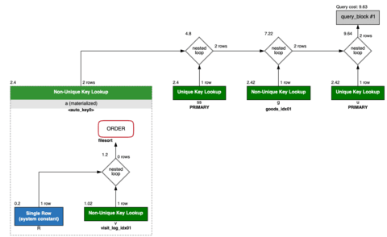
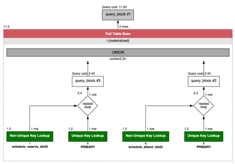

쿼리 성능 문제를 다루는 개발자라면 EXPLAIN은 가장 먼저 확인해야 할 도구다. SQL을 작성할 때 실행 계획을 함께 보면서 개선하는 습관을 들이면, 쿼리 조건 변경이 성능에 어떤 영향을 주는지 직접 확인할 수 있어 이해도가 깊어진다. 최상의 실행 계획이 아니더라도 데이터 양에 따라 현실적으로 문제가 되지 않는 접점을 찾는 것도 중요하다. 이 글에서는 자신이 만든 쿼리에 대한 최소한의 책임을 지기 위해 실행 계획을 읽는 법을 정리한다.

#### 실행 계획 정보

EXPLAIN을 실행하면 아래 필드로 구성된 테이블이 출력된다. 각 필드의 의미를 파악해두면 실행 계획 전체를 빠르게 읽을 수 있다.

| 항목           | 설명                                              |
| :------------ | :----------------------------------------------- |
| id            | 쿼리의 식별자로 쿼리의 각 부분이 어떤 순서로 실행되는지를 나타냄 |
| select_type   | 쿼리 유형(예: SIMPLE, PRIMARY, SUBQUERY 등) |
| table         | 액세스되는 테이블|
| partitions    | 쿼리가 액세스하는 파티션 |
| type          | JOIN 유형(예: ALL, index, range, ref 등) |
| possible_keys | 사용 가능한 인덱스 |
| key           | 실제로 사용된 인덱스 |
| key_len       | 사용된 인덱스의 길이 |
| ref           | 인덱스를 참조하는 컬럼이나 정수 |
| rows          | 로드되는 행의 수 |
| filtered      | 필터링 후 행의 백분율 |
| Extra         | 추가 정보 |

#### MySQL의 EXPLAIN 읽는 방법

MySQL의 EXPLAIN은 EXPLAIN의 출력은 테이블로 되어 있고 내부적으로는 트리로 표현되고 있어, VISUAL EXPLAIN 툴을 사용하지 않는 한 트리 형태로 이해할 필요가 있다. 그래야만, 각 테이블이 어떻게 액세스되는지 쉽게 이해할 수 있다.

id와 select_type은 EXPLAIN의 처음 두 필드이지만 이들은 하나의 세트로 생각하면 좋다.

select_type은 질의의 종류를 나타내며, 주제 트리의 구조에 그대로 반영된다. 쿼리의 종류는 JOIN, 서브 쿼리, UNION 및 이들의 조합으로, 이 필드의 내용도 그 조합으로부터 도출된 것이다.

JOIN의 경우 MySQL은 Nested Loop Join 밖에 없고 select_type은 SIMPLE이고 id는 동일하다. EXPLAIN의 출력 순서가 어떤 테이블에서 처리할 것인가에 대한 순서를 반영하고 있다. 

서브쿼리의 경우는 select_type에는 PRIMARY(외부쿼리), SUBQUERY(상관관계 없는 서브쿼리), DEPENDENT SUBQUERY(상관관계가 있는 서브쿼리), UNCACHEABLE SUBQUERY(실행할 때마다 결과가 변경 될 수있는 서브쿼리), DERIVED(FROM 절에서 사용되는 서브쿼리) 중에 하나가 표시된다.

DERIVED의 경우, 서브 쿼리 -> 외부 쿼리의 순서로 쿼리가 실행된다. 그렇지 않으면 외부 쿼리 -> 서브 쿼리 순서로 쿼리가 실행된다. 다만 SUBQUERY의 경우는 서브쿼리가 정말로 실행되는 것은 최초의 1회만으로, 그 이후에는 캐쉬된 실행 결과가 이용된다. DEPENDENT SUBQUERY 및 UNCACHEABLE SUBQUERY의 경우 서브 쿼리가 행 평가마다 실행된다.

```sql
explain
SELECT a.rownum, a.id, a.standard_date, a.company_id, a.user_id, a.sale_id, a.schedule_id, a.no, a.visit_date, g.name, ss.start_date, ss.end_date
FROM (
    SELECT v.id, v.standard_date, v.company_id, v.user_id, v.type, v.schedule_id, v.sale_id, v.no, v.visit_date, @rnum := @rnum + 1 AS rownum
    FROM   visit_log v, (SELECT @rnum := 0 ) AS R
    WHERE  v.standard_date = '20240509'
    AND    v.company_id = 12
    ORDER BY v.id
) a
LEFT OUTER JOIN sale ss ON a.sale_id = ss.id
LEFT OUTER JOIN goods g ON ss.goods_id = g.id
INNER JOIN user u ON a.user_id = u.id
WHERE a.company_id = 12

+----+-------------+------------+--------+--------------------------------+----------------+--------+------------+-----+----------------------+
|id  |select_type  |table       |type    |possible_keys                   |key             |key_len |ref         |rows |Extra                 |
+----+-------------+------------+--------+--------------------------------+----------------+--------+------------+-----+----------------------+
|1   |PRIMARY      |<derived2>  |ref     |<auto_key0>                     |<auto_key0>     |4       |const       |2    |                      |
|1   |PRIMARY      |ss          |eq_ref  |PRIMARY                         |PRIMARY         |4       |a.sale_id   |1    |                      |
|1   |PRIMARY      |g           |ref     |goods_idx01                     |goods_idx01     |4       |ss.goods_id |1    |                      |
|1   |PRIMARY      |u           |eq_ref  |PRIMARY                         |PRIMARY         |4       |a.user_id   |1    |Using index           |
|2   |DERIVED      |<derived3>  |system  |NULL                            |NULL            |NULL    |NULL        |1    |                      |
|2   |DERIVED      |v           |ref     |visit_log_idx01,visit_log_idx02 |visit_log_idx02 |28      |const,const |1    |Using index condition |
|3   |DERIVED      |NULL        |NULL    |NULL                            |NULL            |NULL    |NULL        |NULL |No tables used.       |
```

위 쿼리의 실행 계획을 읽어보면 R 테이블에 제일 먼저 패치되어 derived3 테이블이 되고 그 다음 v 테이블과 조인되고 그 결과가 derived2 테이블이 되고 ss, g, u 순으로 조인되어 결과가 출력된다. 아래 그림은 MySQL Workbench의 VISUAL EXPLAIN 기능을 활용한 결과이다.



UNION의 경우는 select_type에는 PRIMARY(UNION에서 처음 패치되는 테이블), UNION(2번째 이후에 패치되는 테이블), UNION RESULT(UNION 실행 결과), DEPENDENT UNION(DEPENDENT SUBQUERY가 UNION이 되어 있는 경우), UNCACHEABLE UNION(UNCACHEABLE SUBQUERY가 UNION인 경우) 중에 하나가 표현된다.

```sql
SELECT t.schedule_id, t.user_id, t.name, t.start_date, t.end_date
FROM (
  SELECT a.schedule_id, a.user_id, s.name, s.start_date, s.end_date
  FROM   schedule_attend a
  INNER JOIN schedule s ON a.schedule_id = s.id
  WHERE a.user_id = 168967 AND a.company_id = 410
  UNION
  SELECT r.schedule_id, r.user_id, s.name, s.start_date, s.end_date
  FROM   schedule_reserve r
  INNER JOIN schedule s ON r.schedule_id = s.id
  WHERE r.user_id = 168967 AND r.company_id = 410
) t

+----+-------------+-----------+--------+------------------------------------------------------------------+----------------------+---------+----------------+------+---------------+
|id  |select_type  |table      |type    |possible_keys                                                     |key                   |key_len  |ref             |rows  |Extra.         |
+----+-------------+-----------+--------+------------------------------------------------------------------+----------------------+---------+----------------+------+---------------+
|1   |PRIMARY      |<derived2> |ALL     |NULL                                                              |NULL                  |NULL     |NULL            |570   |NULL           |
|2   |DERIVED      |a          |ref     |schedule_attend_idx01,schedule_attend_idx02,schedule_attend_idx03 |schedule_attend_idx02 |8        |const,const     |282   |NULL           |
|2   |DERIVED      |s          |eq_ref  |PRIMARY                                                           |PRIMARY               |4        |a.schedule_id   |1     |NULL           |
|3   |UNION        |r          |ref     |schedule_reserve_idx01,schedule_reserve_idx02                     |schedule_reserve_idx02|8        |const,const     |288   |NULL           |
|3   |UNION        |s          |eq_ref  |PRIMARY                                                           |PRIMARY               |4        |r.schedule_id   |1     |NULL           |
|    |UNION RESULT |<union2,3> |ALL     |NULL                                                              |NULL                  |NULL     |NULL            |0     |Using temporary|

```

위 쿼리의 실행계획을 읽어보면 id 3의 r과 s 테이블이 조인한 결과와 a, s 테이블의 조인한 결과가 union2,3 테이블에 통합되고 그 결과가 derived2 테이블에 저장된다.



#### 주요 EXPLAIN 필드 설명

 **type**

테이블에 액세스하는 방법을 나타낸다. 치명적인 쿼리는 이 필드를 보면 한눈에 알 수 있어 가장 중요한 필드다. 성능은 `const > eq_ref > ref > ref_or_null > range > index > ALL` 순으로 좋다.

| 필드 값       | 설명                                                                                            |
| :---------- | :--------------------------------------------------------------------------------------------- |
| const       | PRIMARY KEY 또는 UNIQUE 인덱스 조회에 의한 액세스. 가장 빠름.                                          |
| eq_ref      | JOIN에서 PRIMARY KEY 또는 UNIQUE KEY가 이용될 때의 액세스 타입.                                       |
| ref         | UNIQUE가 아닌 인덱스를 사용해 등가 검색(WHERE key = value)을 했을 때 사용되는 액세스 타입. |
| ref_or_null | ref 접근 방법에 NULL 비교가 추가된 형태.                                                        |
| range       | 인덱스를 이용한 범위 검색.                                                                           |
| index       | 풀 인덱스 스캔. 전체 인덱스를 스캔해야 하므로 매우 느림.                                                 |
| ALL         | 풀 테이블 스캔. 인덱스가 전혀 이용되지 않음을 나타냄. 개선 필수.                                       |

`index`, `ALL` 이 나오면 반드시 인덱스 적용 여부를 검토해야 한다.

 **key_len**

선택된 키의 길이다. 인덱스 스캔은 키 길이가 짧을수록 빠르므로 인덱스를 붙이는 컬럼을 선택할 때 염두에 두어야 한다.

 **rows**

테이블로부터 패치되는 행수를 나타낸다. 이 필드는 테이블 전체의 행수나 인덱스의 분산 상태로부터 도출된 대략적인 결과여서, 실제로 패치되는 정확한 행수가 아니므로 주의가 필요하다. 단 하나 예외로는 DERIVED 테이블이다. DERIVED 테이블은 실제로 실행해 보지 않으면 행수의 추정을 할 수 없기 때문에, 옵티마이저는 EXPLAIN시에도 서브 쿼리를 실행한다. 따라서 DERIVED 테이블만은 항상 정확한 행수를 추정할 수 있는 것이다. 다만, DERIVED 테이블을 처리할 때는 서브쿼리가 최적화되어 있지 않은 경우는 EXPLAIN에도 시간이 걸려 버리기 때문에 주의가 필요하다.

또한 가져온 모든 행이 그대로 결과로 반환되는 것은 아니다. Using where가 Extra 필드에 표시되어 있는 경우 패치한 행에 대해서 WHERE구의 검색 조건이 더 적용되어 행의 세분화가 행해지므로 클라이언트에 돌려주어지는 결과 행은 적어질 가능성 있다. JOIN을 처리하는 경우 WHERE 절에 의해 행의 좁히기가 없으면 최종 결과 행수는 JOIN 하는 모든 테이블의 rows 필드의 곱으로 생각할 수 있다. 

 **Extra**

Extra 필드는 그 이름 그대로 추가 정보라는 의미지만, 옵티마이저가 쿼리를 실행하기 위해 어떤 전략을 선택했는지를 나타내는 필드이기에 매우 중요하다.

| 필드 값                                       | 설명                                                                                                                                                                          | 
| :------------------------------------------ | :--------------------------------------------------------------------------------------------------------------------------------------------------------------------------- |
| Using where                                 | WHERE 절에 검색 조건이 지정되어 있고, 인덱스만으로는 WHERE 절의 조건을 모두 적용 할 수 없는 경우에 표시.                                                                                           |
| Using index                                 | 쿼리가 인덱스만을 사용해 해결할 수 있는 경우.                                                                                                                                           |
| Using filesort                              | filesort(퀵 소트)로 정렬을 하고 있는 것을 나타냄.                                                                                                                                     |
| Using temporary                             | JOIN의 결과를 소트하거나, DISTINCT에 의한 중복의 배제 등, 쿼리의 실행에 임시 테이블이 필요함을 나타냄.                                                                                            |
| Using index for group-by                    | MIN/MAX가 GROUP BY구와 병용되고 있을 때, 쿼리가 인덱스만을 사용해 해결할 수 있는 것을 나타냄.                                                                                                  |
| Range checked for each record (index map: N)| JOIN에서 range 또는 index_merge가 이용되는 경우에 표시됨.                                                                                                                             |
| Not exists                                  | LEFT JOIN에서 왼쪽 테이블에서 가져온 행과 일치하는 행이 오른쪽 테이블에 없으면 오른쪽 테이블은 NULL이지만 오른쪽 테이블은 NOT NULL로 정의 된 필드 로 JOIN 되고 있는 경우에는 매치하지 않는 행을 찾아내면 좋다는 것을 나타냄 |

- Using where가 나올 경우 인덱스가 필요한지 고민해야하고, Using temporary가 나오면 데이터량이 많은 경우는 메모리를 소비하므로 주의가 필요하고 GROUP BY 또는 ORDER BY 등을 사용하면 표시될 수 있으며 ORDER BY의 경우는 해당 컬럼에 인덱스를 설정함으로써 개선할 수 있다. 
- Using filesort는 쿼리에 ORDER BY가 포함되는 경우 MySQL은 어느 정도의 크기까지는 모두 메모리내에서 퀵소트 처리한다. 어느 정도의 크기는 sort_buffer_size이며, 이것은 세션마다 변경 가능하다. 정렬에 필요한 메모리가 sort_buffer_size보다 커지면 임시 파일(임시 테이블이 아님)이 만들어지고 메모리와 파일을 함께 사용하여 빠른 정렬이 수행된다. 인덱스를 사용하지 않는 정렬의 처리가 발생하며 데이터량에 따라서는 CPU의 자원을 많이 소비하므로 주의가 필요하고 정렬의 원인이 되는 컬럼에 인덱스를 설정하는 것으로 개선할 수 있다. 그리고 Using temporary; Using filesort(먼저 JOIN하고 나서 정렬)보다 Using filesort(먼저 정렬한 후 JOIN이 실행)가 그래도 낫다.

#### 인덱스 설계 시 고려사항

EXPLAIN 결과를 바탕으로 인덱스를 추가하거나 수정할 때는 다음 사항을 함께 고려해야 한다.

- 카디널리티가 작은 컬럼은 조건과 일치하는 레코드 수가 많아 인덱스 효율이 떨어진다. 카디널리티가 높은 컬럼을 선택해야 한다.
- 복합 인덱스는 순서에 주의해야 한다. 첫 번째 컬럼은 조회 조건에서 대상 데이터 범위를 가장 많이 줄이는 컬럼이어야 한다.
- 불필요한 인덱스가 많으면 저장 용량이 증가하고 캐시 효율이 떨어지며 INSERT/UPDATE 성능도 저하된다. 필요한 경우에만 인덱스를 생성한다.

#### 요약

EXPLAIN 필드는 크게 세 그룹으로 나눠 읽으면 빠르게 파악할 수 있다.

- **id/select_type/table**: 어떤 테이블이 어떤 순서로 액세스되는지를 나타낸다. 쿼리 구조를 파악하는 필드다. 서브쿼리가 포함된 경우 EXPLAIN 출력 순서와 실제 액세스 순서가 다를 수 있으므로 주의해야 한다.
- **type/key/ref/rows**: 각 테이블에서 행이 어떻게 반입되는지를 나타낸다. 어떤 테이블 액세스가 성능 병목인지 이 필드에서 판단할 수 있다.
- **Extra**: 옵티마이저가 선택한 실행 전략을 나타낸다. `Using temporary`, `Using filesort` 등이 표시되면 쿼리 개선을 검토해야 한다.
