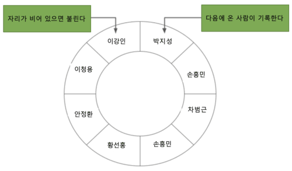

MQTT 기반 푸시 시스템을 만들면서 토픽별로 수신된 메시지를 해당 토픽을 구독한 클라이언트가 연결이 끊겼을 때 나중에 접속하면 재전송하기 위해 링 버퍼를 사용했습니다. 당시 성능 개선 경험이 인상적이어서, 그때 리서치한 내용을 포함해 링 버퍼에 대한 전반적인 내용을 정리해 봅니다.

### 링 버퍼란?

링 버퍼는 기능적으로는 FIFO(First In First Out) 큐의 일종입니다. 일반적인 큐는 데이터를 꺼낼 때마다 앞 공간이 비어 낭비되거나, 빈 공간을 채우기 위해 데이터를 앞으로 이동시키는 비용이 발생합니다. 링 버퍼는 이를 **고정 크기 배열과 두 개의 포인터(head/tail)** 로 해결합니다.

동작 원리는 다음과 같습니다.

- **write(tail) 포인터**: 새 데이터를 쓸 위치를 가리키며, 데이터를 추가할 때마다 전진합니다.
- **read(head) 포인터**: 다음에 읽을 데이터 위치를 가리키며, 데이터를 꺼낼 때마다 전진합니다.
- **wrap-around**: 포인터가 배열 끝에 도달하면 처음으로 돌아가 순환합니다. 버퍼가 가득 찬 상태에서 새 데이터가 들어오면 가장 오래된 데이터를 덮어씁니다.



위 그림처럼 배열이 원형으로 연결된 구조로 동작하여, 빈 공간을 계속 재사용할 수 있습니다.

### 링 버퍼 장점

- **High Performance**: enqueue와 dequeue의 시간복잡도가 O(1)입니다. 일반 동적 큐는 메모리 할당·해제 비용이 발생하지만, 링 버퍼는 미리 할당된 배열 내에서 포인터만 이동합니다.
- **Memory Efficiency**: 고정 크기 메모리를 미리 할당하므로 런타임 메모리 오버헤드가 없습니다. 예측 가능한 메모리 사용량이 필요한 임베디드·실시간 시스템에 적합합니다.

### 링 버퍼 사용 사례

- **실시간 데이터 수집 및 처리**: 최신 데이터를 중요시하는 센서 데이터 저장, 오디오/비디오 프레임 버퍼링으로 재생 끊김 방지에 사용됩니다.
- **네트워크 및 IPC(프로세스 간 통신)**: 송수신 속도가 다른 네트워크 데이터 관리, 서로 다른 프로세스나 스레드 간 메시지 큐로 사용됩니다.
- **임베디드 시스템**: 메모리 사용량이 제한된 환경에서 마이크로컨트롤러와 주변 장치 간 데이터를 버퍼링할 때 사용됩니다.
- **시스템 모니터링 및 성능 분석**: CPU 사용량이나 네트워크 트래픽 같은 성능 지표 기록, 디버깅 목적의 시스템 호출·실행 추적 저장에 사용됩니다.
- **작업 재실행 및 비동기 처리**: 실패한 작업을 재실행하거나 비동기 작업을 관리할 때 사용됩니다.
- **고처리량 로깅**: 파일 기록이나 네트워크 전송 전에 로그 메시지를 일시적으로 저장하는 로깅 시나리오에 사용됩니다.

### 링 버퍼 구현 예

구현 소스는 [GitHub](https://github.com/mimul/algorithm/blob/master/cpp/ring-buffer/ring_buffer.cpp)에서도 볼 수 있습니다. 핵심은 `enqueue`/`dequeue` 함수로, 생성자에서 배열(`buffer_`)을 미리 할당하고 `read_idx_`와 `write_idx_`가 배열 위를 순환하며 처리합니다.

```cpp
#include <atomic>
#include <chrono>
#include <cstddef>
#include <cstdint>
#include <iomanip>
#include <iostream>
#include <mutex>
#include <queue>
#include <thread>
#include <vector>

class RingBuffer {
public:
  explicit RingBuffer(size_t size) : buffer_(size) {}

  // Returns true on success. Fails if the buffer is full.
  bool enqueue(int item) {
    uint64_t write_idx = write_idx_.load(std::memory_order_relaxed);
    if (write_idx - cached_read_idx_ == buffer_.size()) {
      cached_read_idx_ = read_idx_.load(std::memory_order_acquire);
      if (write_idx - cached_read_idx_ == buffer_.size()) {
        return false;
      }
    }
    buffer_[write_idx & (buffer_.size() - 1)] = item;
    write_idx_.store(write_idx + 1, std::memory_order_release);
    return true;
  }

  // Returns true on success. Fails if the buffer is empty.
  bool dequeue(int *dest) {
    uint64_t read_idx = read_idx_.load(std::memory_order_relaxed);
    if (cached_write_idx_ == read_idx) {
      cached_write_idx_ = write_idx_.load(std::memory_order_acquire);
      if (cached_write_idx_ == read_idx) {
        return false;
      }
    }
    *dest = buffer_[read_idx & (buffer_.size() - 1)];
    read_idx_.store(read_idx + 1, std::memory_order_release);
    return true;
  }

private:
  std::vector<int> buffer_;
  alignas(64) std::atomic<uint64_t> read_idx_{0};
  alignas(64) uint64_t cached_read_idx_{0};
  alignas(64) std::atomic<uint64_t> write_idx_{0};
  alignas(64) uint64_t cached_write_idx_{0};
};

constexpr uint64_t bmtCount = 500000;

template <typename RingBufferType> double benchmark(RingBufferType &rb) {
  auto start = std::chrono::system_clock::now();
  std::thread workers[2] = {
      std::thread([&]() {
        for (uint64_t i = 0; i < bmtCount; ++i) {
          int count = 1000;
          while (0 < count) {
            if (rb.enqueue(count)) {
              count--;
            }
          }
        }
      }),
      std::thread([&]() {
        int result;
        for (uint64_t i = 0; i < bmtCount; ++i) {
          int count = 1000;
          while (0 < count) {
            if (rb.dequeue(&result)) {
              count--;
            }
          }
        }
      })};
  for (auto &w : workers) {
    w.join();
  }
  auto end = std::chrono::system_clock::now();
  double duration = std::chrono::duration_cast<std::chrono::nanoseconds>(end - start).count();
  const int count = bmtCount * (1000 + 1000);
  std::cerr << count << " ops in " << duration << " ns \t";
  return 1000000.0 * bmtCount * (1000 + 1000) / duration;
}

int main() {
  RingBuffer rb(2 * 1024 * 1024);
  std::cout << "RingBuffer: " << benchmark(rb) << " ops/ms\n";
};
```

구현에서 주목할 점은 두 가지입니다.

**Lock-free 설계**: `std::atomic`과 `memory_order`를 사용해 뮤텍스 없이 스레드 안전성을 확보합니다. `memory_order_relaxed`는 순서 보장 없이 원자적 읽기만 수행하고, `memory_order_acquire/release` 쌍으로 쓰기 완료 후 읽기를 보장합니다.

**False Sharing 방지**: `alignas(64)`로 각 변수를 캐시 라인(64바이트) 경계에 정렬합니다. `cached_read_idx_`와 `cached_write_idx_`는 각 스레드가 상대방의 atomic 변수를 매번 읽지 않도록 로컬 캐시 역할을 합니다. 이 최적화로 성능이 크게 향상됩니다.

이 소스를 실행하면 아래와 같이 1,095,400 ops/ms가 나옵니다.

```bash
> g++ -Wall -O3 -march=native -std=c++17 ring_buffer.cpp
> ./ring_buffer
RingBuffer: 1000000000 ops in 912,909,000 ns  1,095,400 ops/ms
```

### 링 버퍼를 구현한 오픈소스

- [LMAX Disruptor](https://github.com/LMAX-Exchange/disruptor): 고성능 메시징 프레임워크로, lock-free 링 버퍼를 활용해 스레드 간 데이터 교환을 매우 빠르게 처리합니다.
- [Redisson](https://redisson.pro/blog/redis-based-ring-buffer-for-java.html): Redis Java 클라이언트로, `RRingBuffer` 인터페이스를 통해 링 버퍼 데이터 구조를 지원합니다.
- [Apache Commons Collections](https://commons.apache.org/proper/commons-collections/javadocs/api-3.2.2/org/apache/commons/collections/buffer/CircularFifoBuffer.html): Java용 라이브러리로, `CircularFifoBuffer`라는 링 버퍼 구현체를 포함합니다.

### 마무리

링 버퍼는 고정 크기 메모리와 O(1) 연산이라는 단순한 특성 덕분에, 실시간 처리·네트워크·임베디드 등 다양한 고성능 시스템에서 핵심 자료구조로 활용됩니다. 특히 lock-free 구현과 False Sharing 방지를 결합하면 멀티스레드 환경에서도 높은 처리량을 달성할 수 있습니다. LMAX Disruptor처럼 검증된 오픈소스 구현체를 참고하면 실무 적용에도 도움이 됩니다.

### 참조 사이트

- [Circular buffer](https://en.wikipedia.org/wiki/Circular_buffer)
- [Optimizing a ring buffer for throughput](https://rigtorp.se/ringbuffer/)
