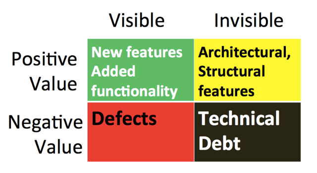
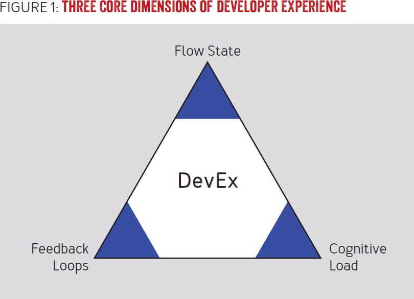
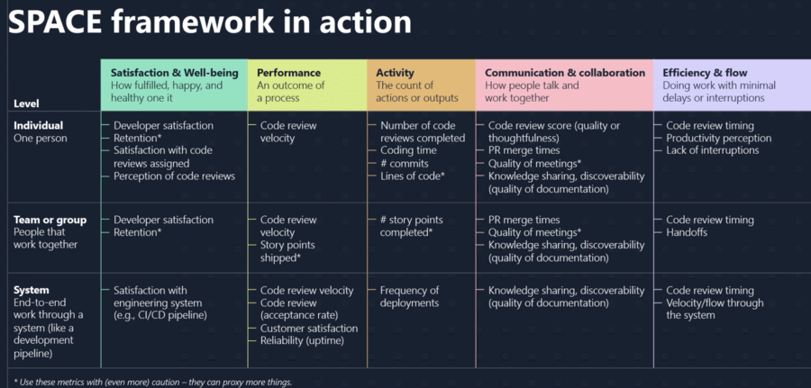
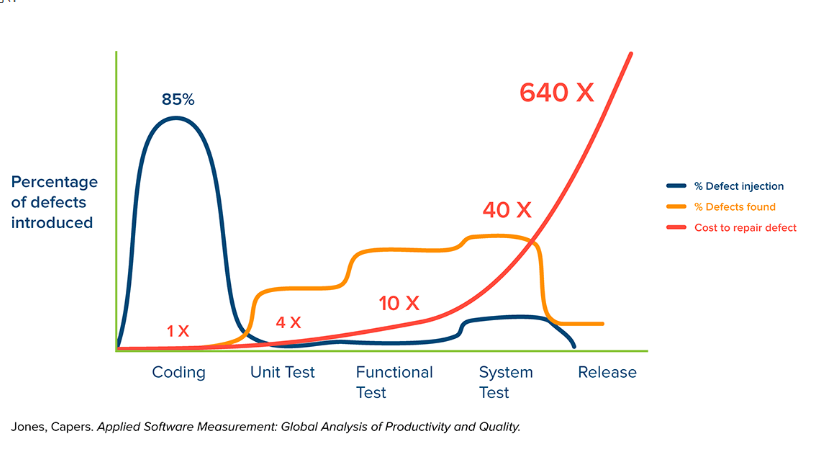

## 들어가며

스타트업에서는 비즈니스 우선순위에 밀려 개발 생산성에 대한 고민을 충분히 하기 어렵습니다. 하지만 코드 품질, 개발자 경험, 생산성이 무너지면 비즈니스 속도도 함께 무너집니다.

이 글은 스타트업의 개발 리드와 개발자를 대상으로, 비즈니스 지향점을 유지하면서도 개발 문화와 생산성을 어떻게 내재화할지를 다룹니다.

1. 사용하지 않는 기능의 낭비
2. 코드 품질과 비즈니스 영향
3. UX 못지않게 중요한 DX(개발자 경험)
4. 소프트웨어를 지속적으로 개선해야 하는 이유
5. 개발 생산성을 높이는 방법
6. 비즈니스 가치 지향 코딩

## 사용하지 않는 기능의 낭비

비즈니스 문제 의식에서 출발해 제품을 더 잘 만들고 시장 변화에 빠르게 대응하고 싶은 것은 당연합니다. 하지만 만든 기능이 실제로 얼마나 쓰이는지를 먼저 따져봐야 합니다.

2002년 XP 2002 Conference에서 Standish Group 회장 Jim Johnson의 기조 강연 ["ROI, It's Your Job"](https://www.mountaingoatsoftware.com/blog/are-64-of-features-really-rarely-or-never-used)에 따르면, 제품 기능의 **64%가 거의 사용되지 않습니다**.

[마이크로소프트 실험 논문](https://ai.stanford.edu/~ronnyk/ExPThinkWeek2009Public.pdf)에서도 테스트된 아이디어의 1/3만 성공했고, 넷플릭스는 아이디어의 90%가 실패, 아마존은 신규 기능 성공률이 50% 미만입니다.

이 수치가 시사하는 바는 명확합니다. **처음부터 크게 만들지 말고, 작게 만들어 빠르게 검증해야 합니다.** 스티브 맥코넬(Steve McConnell)은 릴리즈 후 수정 비용이 요구 단계 대비 10~100배 든다고 했습니다. 검증되지 않은 아이디어의 개발 규모를 처음부터 크게 잡는 것은 낭비입니다.

## 코드 품질과 비즈니스 영향

["Code Red: The Business Impact of Code Quality"](https://arxiv.org/abs/2203.04374) 연구에 따르면, 고품질 코드는 결함이 15배 적고, 개발 속도가 2배 빠르며, 문제 해결 시간이 더 예측 가능합니다.

[Stripe 보고서](https://d37ugbyn3rpeym.cloudfront.net/newsroom/the-developer-coefficient.pdf)에서는 개발자의 주당 평균 41.1시간 중 42%(17.3시간)가 낮은 코드 품질로 인한 비용으로 소비됩니다.

[기술 부채 추적 연구](https://www.sciencedirect.com/science/article/pii/S0167642318301035)에서도 기술 부채 관리에 전체 개발 시간의 25%가 소요되지만, 이를 체계적으로 추적하는 조직은 7.2%에 불과합니다.

코드 품질이 낮아지면 파생 문제들이 연쇄적으로 발생해 개발 생산성이 떨어지고, 비즈니스와 개발자 경험 모두를 악화시킵니다.

## UX보다 먼저 챙겨야 할 DX(개발자 경험)

개발 문화가 없거나 기술 부채가 많은 상황에서 바쁘게만 돌아간다면, 결국 개발자 이탈과 생산성 저하로 이어져 기업에 손실을 줍니다.

Philippe Kruchten이 제안한 4색 백로그 모델(["What Color is your Backlog?"](https://www.infoq.com/news/2010/05/what-color-backlog/))은 이를 잘 보여줍니다. 왼쪽의 Visible 영역은 행동(Behavior)을 바꾸는 UX 영역이고, 오른쪽의 Invisible 영역은 소프트웨어 구조와 기술 부채, 즉 DX 영역입니다.

Visible 영역은 고객 이탈에 직접적인 영향을 주어 즉시 대응하게 되지만, Invisible 영역은 방치하면 나중에 더 많은 노력이 필요한 **Failure Demand**가 발생합니다. 결국 새로운 가치를 만드는 **Value Demand** 시간을 빼앗겨 개발자 경험이 악화됩니다.

#### 1. 개발자 경험과 생산성(DevEx 관점)

개발자 경험의 과학적 연구 논문 [DevEx: What Actually Drives Productivity](https://queue.acm.org/detail.cfm?id=3595878)에서는 DevEx가 개발자 생산성에 영향을 미치는 요인을 3차원 프레임워크로 설명합니다.

_1) Feedback Loops(피드백 루프)_

빈번한 배포와 리드 타임 단축이 생산성 향상으로 이어집니다. 빠른 피드백 루프는 개발자가 방해 없이 작업을 진행하게 해줍니다. 개발 도구(빌드·테스트 시간 단축), 인계 프로세스(코드 리뷰·승인), 조직 구조(팀 간 상호작용 간소화) 등을 개선해야 합니다.

_2) Cognitive Load(인지 부하)_

부적절한 문서와 복잡한 시스템은 높은 인지 부하를 유발해 빠른 가치 제공을 방해합니다. 불필요한 장애물 제거, 이해하기 쉬운 시스템 구축, 컨텍스트 전환 최소화, 셀프 서비스 도구 제공이 도움됩니다.

_3) Flow State(플로우 상태)_

집중력과 활력을 가지고 완전히 몰두하는 상태입니다. 계획되지 않은 회의와 작업을 최소화하고, 개발자에게 자율성과 도전적인 업무를 제공하며 적극적인 팀 문화를 만드는 것이 중요합니다.

#### 2. 개발자 웰빙과 생산성(SPACE 관점)

[SPACE](https://queue.acm.org/detail.cfm?id=3454124)는 Lean·DevOps 저자 Nicole Forsgren이 고안한 프레임워크로, 개발 생산성을 개인 성능이 아닌 세 가지 수준(개인, 그룹, 시스템)으로 측정해야 한다는 관점입니다.

특정 개인의 성능이 높아도 팀 전체 관점에서 낮으면 의미가 없습니다. 코드 리뷰를 소홀히 하면서 개인 속도를 올리면 팀 전체의 시스템 개선이 어려워집니다. 개인의 웰빙도 생산성 지표 중 하나로, 개발자의 행복감이 생산성에 직접 영향을 줍니다.

## 소프트웨어를 지속적으로 개선해야 하는 이유

시장 변화에 수동적으로 대응하는 것만으로는 부족합니다. 기업이 변화를 예측하고 아이디어를 신속하게 사용자에게 필요한 업데이트로 전환해야 제품 가치를 높일 수 있습니다.

외부적으로는 고객에게 지속적으로 가치를 제공해 경쟁에서 살아남아야 하고, 내부적으로는 OS, 라이브러리, 프레임워크, 외부 API 등의 변화에 대응해야 합니다. 사용하지 않는 기능을 제거하는 노력도 코드 복잡도를 줄여주어 지속적으로 해야 합니다.

복잡성, 성능, 안정성, 고객 니즈, 비즈니스 변화에 균형 있게 대응하면서 지속적으로 가치를 제공하는 것이 핵심입니다.

## 개발 생산성을 높이는 방법

개발 생산성은 보통 처리량과 리드 타임으로 판단합니다. 처리량을 나타내는 업무량 지표를 먼저 살펴보면 다음과 같습니다.

- **SLoC(소스 코드 양)**: 산출물 측정에 많이 쓰이지만 후행 지표이며, 코드 품질·가독성·중복을 무시하면 생산성을 오히려 떨어뜨릴 수 있어 개발 생산성 지표로는 부적합합니다.
- **기능 포인트**: 1979년 IBM의 Allan J. Albrecht가 제안한 기법. 스토리 포인트로 대체할 수 있지만, 개발 생산성 지표로 단독 사용에는 한계가 있어 다른 지표와 혼합해야 합니다.
- **풀 리퀘스트 양**: 파편화 단점이 있지만, 코드 리뷰를 통해 조직 평균 기술 수준과 생산성을 높이고 릴리즈 시간 예측에 활용할 수 있습니다.
- **예상 부가가치 양**: 비즈니스 가치와 연계한 동료 평가 방식. [RICE 스코어링 모델](https://www.productplan.com/glossary/rice-scoring-model/)(Reach, Impact, Confidence, Effort)을 활용해 우선순위 결정에 사용할 수 있습니다.
- **매출 양**: B2B 프로젝트 단위에 적합하지만 후행 지표이고 B2C에서는 측정이 어렵습니다.

리드 타임은 의사 결정부터 실제 출시까지의 시간입니다. 스타트업은 의사결정 과정에도 개발 조직이 관여하는 경우가 많아 포함시키는 것이 좋습니다.

처리량과 리드 타임 빈도가 개발 생산성의 주요 지표이지만, 빈도를 질로 전환하는 고민도 필요합니다. 장애 없는 리드 타임, 제품 가치와 연계된 처리량을 함께 고려해야 합니다.

#### 1) 단위 테스트를 강화해 버그 발견율을 높인다

Capers Jones의 ["Applied Software Measurement"](https://www.amazon.com/Applied-Software-Measurement-Analysis-Productivity/dp/0071502440)에서 단계별 결함 발생 확률(파란색), 결함 발견 확률(노란색), 결함 처리 비용(빨간색)을 분석합니다. 결함 처리 비용이 가장 낮은 단계인 단위 테스트를 강화해 버그 발견율을 높이는 방향이 바람직합니다.

#### 2) 소스 공유, 의존 관계, 개발 도구 관리

["Why Google Stores Billions of Lines of Code in a Single Repository"](https://cacm.acm.org/magazines/2016/7/204032-why-google-stores-billions-of-lines-of-code-in-a-single-repository/fulltext) 논문에서는 개발자에게 가장 도움이 된 영역으로 가시성, 종속성 관리, 개발 도구를 꼽습니다.

- **가시성**: 코드 기반의 가시성을 높여 코드 재사용과 인지 부하 감소 효과를 얻을 수 있습니다.
- **의존 관계 관리**: 단일 버전 규칙(One-Version Rule)으로 라이브러리 충돌, 빌드 리드 타임 증가, 프로젝트 간 커뮤니케이션 비용을 절감합니다.
- **개발 도구**: 사용 가능한 개발 도구를 정리해두면 아키텍처 선택, 개발 환경 설정, 개발자 이동 시 학습 비용을 줄일 수 있습니다.

#### 3) 팀 역량 강화

팀 퍼포먼스가 기업 역량의 핵심입니다. 개인 역량을 위해 교육(세미나, 기술 공유)과 코드 리뷰·페어 프로그래밍 기회를 제공하고, 조직 역량을 위해 팀 간 협업·커뮤니케이션·리스크 분산을 관리하는 프로세스를 갖추는 것이 중요합니다.

코드 리뷰의 목표는 깨끗한 코드를 유지하는 것입니다. 참고할 만한 자료들입니다.

- [코드 리뷰 모범 사례(Best practices for pull requests)](https://docs.github.com/en/pull-requests/collaborating-with-pull-requests/getting-started/best-practices-for-pull-requests)
- [건강한 코드 리뷰(Code Health: Respectful Reviews == Useful Reviews)](https://testing.googleblog.com/2019/11/code-health-respectful-reviews-useful.html)
- [단위 테스트(Shift testing left with unit tests)](https://learn.microsoft.com/en-us/devops/develop/shift-left-make-testing-fast-reliable)
- [DevOps 역량](https://cloud.google.com/architecture/devops)
- [DORA Core Model](https://dora.dev/research/)

코드 리뷰는 커뮤니케이션입니다. 리뷰 전에 다음 항목을 확인하면 리뷰 비용을 줄일 수 있습니다.

- 팀 원칙·규칙 준수 여부
- 단위 테스트 작성 여부
- 정적 분석 수행
- LLM 분석 수행
- 배경 지식 정보([Work Item 링크](https://learn.microsoft.com/en-us/azure/devops/boards/work-items/about-work-items?view=azure-devops&tabs=agile-process))
- 우려사항과 타협점 제시

#### 4) 기술 부채를 지속적으로 해결하는 습관

스타트업에서 기술 부채는 속도를 위해 품질이 희생되면서 발생합니다. 대부분 Invisible 영역(아키텍처, 수작업 운영 등)에서 생겨 고객 피해가 없다는 이유로 개발 우선순위에서 밀려 쌓이게 됩니다.

기술 부채는 상환해야 할 부채와 그 영향을 파악하고, 해결 시간을 고려해 우선순위를 정해 진행합니다. 기존 개발 업무와 병행할 수도 있고, 영향도가 크면 선행 처리할 수도 있습니다.

- 반복 프로세스의 수작업(데이터 작업, 배포, 테스트 등)을 자동화하고 피드백을 받아 지속적으로 개선합니다. 컨텍스트 전환을 줄여 집중력과 학습 시간을 확보할 수 있습니다.
- 버그는 묵혀두지 않습니다. 그때그때 처리하지 않으면 나중에 원인 발견과 해결에 더 많은 시간이 걸립니다.
- 오버 엔지니어링을 피합니다. 필요 이상의 기술은 적용 시간이 더 걸리고 새로운 문제를 만듭니다. 비즈니스와 조직 수준에 맞는 기술을 선택하세요.
- 시스템 결합 관계와 변경 영향 범위를 문서화합니다. 버그 발생 빈도를 줄이고 리팩토링·최적화 시 영향 범위를 명확히 파악할 수 있으며 테스트 커버리지 향상에도 도움이 됩니다.

#### 5) 머리가 아닌 습관, 일머리

KentBeck은 말합니다.

> 나는 위대한 프로그래머가 아니라 위대한 습관을 착용한 프로그래머다.

일을 단순화하고 프로그램을 단순화하는 사고 습관이 생산성을 높입니다. 크게 생각하지 말고 작은 단위로 쪼개어 실행하고 디버깅하며 조금씩 이해하는 스텝을 반복하세요. 이런 습관이 쌓이면 무엇이든 이해가 빨라집니다.

#### 6) 질문 자체가 비용이다

질문은 동기식으로 이루어지기 때문에 상대방에게 컨텍스트 스위칭을 유발합니다. 학습을 통해 이해도를 높이는 노력이 필요합니다. 모르면 질문을 정확하게 할 수 없게 되어 커뮤니케이션 비용이 증가하고, 관련 문서가 없으면 커뮤니케이션이 필수가 됩니다.

또한 **Ask culture(묻는 문화) vs Guess culture(눈치 보는 문화)**의 충돌을 인식하고 관리하는 것도 중요합니다. 2007년 Metafilter 사용자 tangerine이 [공유한 개념](https://ask.metafilter.com/55153/Whats-the-middle-ground-between-FU-and-Welcome#830421)으로, 두 유형이 조직 내에 공존할 때 커뮤니케이션 충돌이 생길 수 있습니다. 양쪽 관점을 이해하는 것이 갈등 해결의 실마리가 됩니다.

충실한 학습과 문서화로 커뮤니케이션 비용을 구조적으로 줄여야 합니다.

#### 7) 컨텍스트 스위칭을 피하자

[마이크로소프트 리서치 연구('A Diary Study of Task Switching and Interruptions', 2004)](https://dl.acm.org/doi/10.1145/985692.985715)에 따르면, 중단된 작업을 재개하는 데 평균 25분 26초가 소요되고 집중력이 40% 감소합니다.

[American Psychological Association 기사](https://psycnet.apa.org/record/2001-07721-001)에서도 컨텍스트 스위칭으로 생산성이 최대 40%까지 낮아질 수 있다고 합니다.

컨텍스트 스위칭을 줄이는 것이 개발자 경험과 생산성 모두에 핵심적인 역할을 합니다.

## 비즈니스 가치 지향 코딩

개발자는 기업에서 자산이기도 하지만, 운영 관점에서는 비용으로 인식될 수 있습니다. 스타트업에서는 그 비용이 기업 존속의 문제가 될 수도 있습니다. 그래서 개발자가 비즈니스 가치를 높이는 방향으로 노력해야 합니다. 비즈니스는 막연한 "좋다"는 인식보다 구체적인 비전을 고객에게 제시할 때 선택됩니다.

- **매출·고객 증가 기능을 우선 개발합니다.** 신규 고객 유입, 기존 고객 업셀·크로스셀, 지속 이용 이유가 되는 기능에 집중해야 합니다.
- **운영 업무를 지속적으로 개선합니다.** 스타트업의 빠른 성장 뒤에는 잘 조직화된 운영 업무가 있습니다. 운영 업무를 통해 데이터를 보게 되고 장애 대응력이 쌓이며, 이 경험이 프로그래밍에 반영되면 최소한의 노력으로 안정적인 서비스를 유지할 수 있습니다.

  신규 기능 반영 시 안정화 기간을 최소화하려면 **데이터(DB, 로그) 기반 프로그래밍**이 효과적입니다. 관련 테이블 검증 쿼리와 에러 로그 필터를 미리 준비해두면, 예측하지 못한 사용자 케이스나 버그를 빠르게 캐치할 수 있습니다. 짧은 주기의 Iteration으로 빠른 안정화를 이룰 수 있습니다.

- **이탈률 저하를 위한 제품 기능을 개선합니다.** 고객 피드백을 제품에 반영하는 것이 중요합니다. 복잡한 기능을 단순화하고, 고객의 비즈니스 동선을 바꾸지 않는 선에서 부가가치를 제공하며, 기능 추가보다 불필요한 기능 제거가 더 중요할 수 있습니다.
- **서비스 품질을 개선합니다.** Dev는 개발 속도, Ops는 신뢰·안정성을 중시해 트레이드오프가 생깁니다. SLO를 절충해 운영하거나 Dev/Ops/Biz의 인센티브를 정렬하고 포지티브 루프를 설계하는 것이 필요합니다.
- **비용 적정화를 고민합니다.** 스타트업은 비용에 민감합니다. 동일 트래픽을 더 적은 서버로 처리할 수 있도록 서버, 언어, 클라우드 구성을 최적화하는 방안을 지속적으로 검토해야 합니다.

## 마치며

스타트업에서 개발자는 비즈니스의 가장 강력한 자산이 될 수 있지만, 코드 품질·개발 문화·기술 부채가 방치되면 속도가 무너지고 사람도 떠납니다. 핵심 메시지를 세 가지로 정리합니다.

1. **작게 만들고 빠르게 검증하세요.** 기능의 64%가 거의 쓰이지 않는다는 데이터를 잊지 마세요.
2. **코드 품질과 DX는 비즈니스 지표입니다.** 개발자 경험이 좋아야 생산성이 올라가고, 생산성이 올라야 비즈니스 가치가 커집니다.
3. **기술 부채는 지속적으로 상환하세요.** 쌓아두면 새로운 가치를 만들 시간이 사라집니다.
