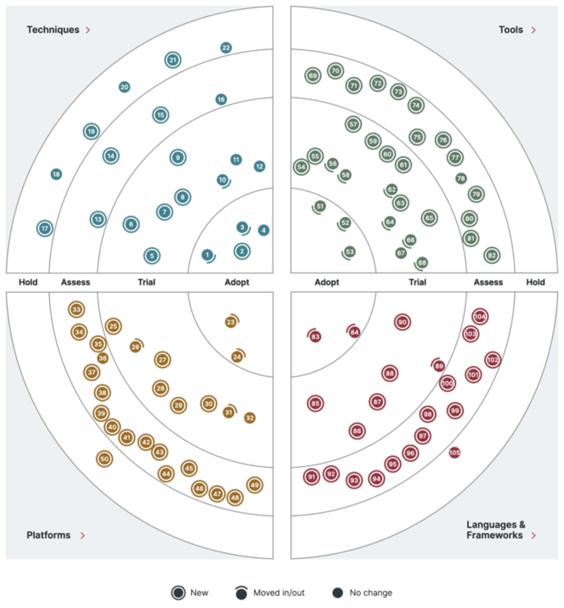

개인 사이드 프로젝트에서도, 기업의 서비스를 만들 때도 항상 고민을 하게 만드는 것이 적정 기술 선택입니다. 소프트웨어 엔지니어, 아키텍트, CTO라면 한 번쯤 "어떤 기술을 선택해야 하는가"라는 질문 앞에서 막막함을 느껴봤을 것입니다. 이 글에서는 기술 트렌드 파악과 적정 기술 선택에 도움이 되는 [Thoughtworks Technology Radar](https://www.thoughtworks.com/radar)를 소개하고, 기업에서 활용하는 방법과 자사 버전 Radar를 만드는 방법까지 정리합니다.

## 적정 기술 선택의 어려움

기술은 끊임없이 새로운 것이 나타나고, 없어지고, 발전합니다. 기업에서 이용하는 수많은 기술 영역(개발 기법, 프레임워크, 프로그래밍 언어, 툴과 라이브러리, 플랫폼) 각각에 대해 후보 리스트를 작성하고, 조직의 평가 기준에 근거해 선정하는 과정을 반복합니다. 현재 채택한 기술도 1~2년 후에는 재평가가 필요한 상황이 옵니다.

성숙한 조직을 가진 기업은 이 과정이 체계적이지만, 성숙한 조직 구조를 갖추지 못한 스타트업, 충분한 기술 투자가 어려운 중소기업, 수평적 의사결정이 어려운 대기업에서는 적합한 기술을 선정하는 일이 쉽지 않습니다.

평가 과정에는 여러 편향도 존재합니다. 기술의 평판, 지역적 특성, 벤더의 영업력, 인플루언서에 의한 편향이 있고, 객관적인 평가를 표방하는 외부 리서치 기관의 보고서도 스폰서 등에 의해 편향이 생길 수 있습니다. 평가 방법 자체의 노후화, 개개인의 선호도 편차까지 더해지면 실효성이 떨어지는 문제가 발생합니다.

그래서 신뢰할 수 있는 기술 선정 도구를 찾다가 [Martin Fowler](https://martinfowler.com/)가 속해 있는 Thoughtworks에서 만든 [Technology Radar](https://www.thoughtworks.com/radar)를 접하게 되었습니다.

## Thoughtworks Technology Radar란?

Technology Radar에서 사용하는 주요 용어는 다음과 같습니다. 각 기술 후보를 **Blip**, 카테고리를 **Quadrant**(4분면 영역), 평가 결과의 위치를 **Ring**이라고 부릅니다.

Technology Radar는 소프트웨어 개발 관련 최신 기술 트렌드를 카테고리와 성숙도 평가(Ring)로 시각화하여 반년마다(연 2회) 발표하는 보고서입니다. 전세계 프로젝트 현장 경험에 근거하여 향후 검토할 기술 요소들을 정리하고 있습니다. 이 보고서는 특정 업체의 제품을 홍보하지 않으며 수익 목적도 없습니다. Thoughtworks는 벤더의 게재 요청을 받아들이지 않고 독립적인 관점에서 기술을 선정합니다.

주요 대상 독자는 소프트웨어 엔지니어, 아키텍트, CTO 등 기술 리더입니다. 최신 기술을 이해하고 전략적으로 플랫폼과 툴을 선택하며 조직의 미래를 대비하기 위한 자료로 활용할 수 있습니다.

## Technology Radar의 선정 과정

Technology Radar는 Thoughtworks 사내 기술 권고 보드(TAB)라는 약 20명의 수석 기술자 그룹에 의해 만들어집니다. TAB은 Thoughtworks CTO인 Rachel Laycock의 자문 그룹으로, 국적과 전문 분야가 다양한 기술 리더로 구성되어 있습니다. Radar 작성을 위해 TAB은 연 2회 대면으로 모여(격주 온라인 회의도 병행), 전세계 Thoughtworker로부터 사전에 정리된 후보 기술(Blip)을 검토합니다. 후보 리스트는 각 프로젝트에서 발견하거나 사내 크라우드소싱(crowd-sourcing)으로 제안된 것 중 충분히 중요하다고 인정된 것들로 구성됩니다.

TAB의 작업은 크게 네 단계로 진행됩니다.

- **첫 번째, Blip 수집**: 참가자들이 기술 후보를 포스트잇에 적어 관련 Ring의 화이트보드에 붙이고, 진행자가 유사한 항목을 그룹화합니다. 초기에는 약 400개의 Blip이 모입니다.
- **두 번째, Radar 큐레이션**: 각 Blip 제안자가 내용을 설명하고 참가자들이 토론합니다. 찬반 투표를 거쳐 1차로 130~150개 수준으로 줄입니다.
- **세 번째, 추가 검토 및 압축**: Blip 수가 100개 내외로 좁혀질 때까지 한 번 더 검토 및 압축합니다.
- **네 번째, 해설문 작성 및 번역**: 최종 선정된 Blip에 담당자가 붙어 사내 리뷰를 거쳐 해설문을 작성하고, 다양한 언어로 번역하여 웹 및 PDF 형태로 공개합니다.

각 Blip 평가 결과는 다음 네 개의 Ring으로 분류됩니다.

| 용어 | 정의 | 설명 |
| :-------- | :------------------------------- | :------------------------------- |
| Adopt | 적극적으로 채용하고 싶은 기술 | 디폴트 옵션의 성숙도를 가진 기술 |
| Trial | 시험적으로 도입할 가치가 있는 기술 | 사용 가능하지만 아직 충분히 실증되지 않은 기술 |
| Assess | 채택 수준은 아니지만 주목할만한 기술 | 상세히 조사하고 실증이 필요한 기술 |
| Hold | 채용을 삼가야 할 기술 | 경험적으로 지양해야 할 기술 |

## 기업에서 활용하는 방법

- **기술 선정 판단 근거**: Adopt 링의 기술은 성숙도가 높고 유용성이 입증되었으므로 요건에 맞는다면 적극적으로 도입을 검토할 수 있습니다. 반면 Hold 링의 기술은 문제점이 지적되고 있으므로 이용 중이라면 대체를 검토하고, 신규 채택은 삼가는 것이 좋습니다.
- **로드맵 수립**: Trial과 Assess 링의 항목은 현재 성숙도는 높지 않지만 장래성이 있는 기술입니다. CTO나 아키텍트처럼 중장기 기술 선택을 담당하는 분이라면 Adopt와 함께 이 두 링의 동향도 함께 파악해두는 것이 중요합니다.
- **엔지니어 기술 육성 및 학습**: Radar에 게재되는 기술은 현재 주목받거나 실무에서 효과가 검증된 것들이므로, 자신이 습득해야 할 스킬의 힌트로 활용할 수 있습니다.

## 자사 버전 Technology Radar 만들기

Technology Radar의 개념은 외부에 공개되어 있으며, Thoughtworks는 직접 레이더를 만들 수 있는 도구를 제공합니다. 자사의 기술 스택과 후보 기술을 정리하여 Radar와 같은 사분면과 링에 매핑하면, 조직 관점에서의 Adopt 기술과 Hold 기술을 객관적으로 논의할 수 있습니다.

시작 방법은 두 가지입니다.

- **호스팅 서비스 사용**: [Build Your Own Radar 서비스](https://radar.thoughtworks.com/)를 이용하면 별도 설치 없이 바로 사용할 수 있습니다.
- **Docker 컨테이너 사용**: [Docker Hub에 게시된 컨테이너](https://hub.docker.com/r/wwwthoughtworks/build-your-own-radar)를 이용하면 사내 환경에 직접 배포할 수 있습니다.

여기서는 Build Your Own Radar 서비스로 진행합니다. 먼저 Technology Radar 데이터 파일을 만들고 공개 URL로 입력해야 합니다. 포맷은 Google Sheets, CSV, JSON 세 가지를 지원하며, Google Sheets 샘플로 [ThoughtWorks Technology Radar Vol. 32](https://docs.google.com/spreadsheets/d/1gwdxMG8mq6U_GZbHH4RKIv-aRoJXReCpwbFLWX7ENL4/edit?usp=sharing)를 참고할 수 있습니다.

마지막으로 "Build my radar" 버튼을 클릭하면 Technology Radar 시각화 리포트가 생성됩니다.

## 마치며

Technology Radar는 모든 조직에 완벽한 정답을 제시하는 도구가 아닙니다. 그러나 전세계 현장 경험을 바탕으로 독립적인 관점에서 기술을 평가한 결과물이라는 점에서, 기술 트렌드를 파악하고 조직의 기술 전략을 수립하는 데 유용한 출발점이 됩니다. 처음에는 외부 Radar를 참고하고, 점차 자사 버전 Radar를 구축해 나가는 것을 권장합니다.

## 참조

- [How to create your enterprise technology radar](https://www.thoughtworks.com/insights/blog/technology-strategy/how-to-create-your-enterprise-technology-radar) — 기업용 Technology Radar를 만드는 방법을 Thoughtworks가 직접 정리한 가이드
- [Inside the Technology Radar: A Thoughtworks documentary](https://www.youtube.com/watch?v=w_u8mQpTuhc) — TAB의 Radar 선정 과정을 담은 다큐멘터리 영상
