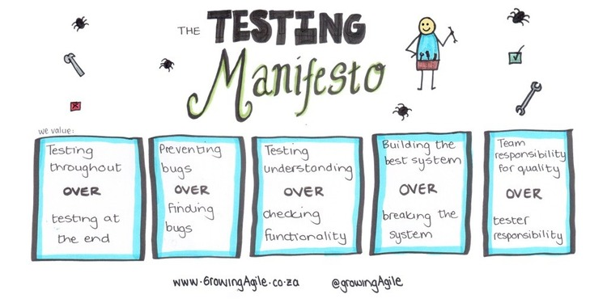

애자일 테스트는 이름에서 알 수 있듯이 애자일 소프트웨어 개발의 원칙을 따른다. 즉, 반복적이며 협업을 촉진하고, 개발을 비즈니스 요구와 정렬시키며, 단순성과 투명성을 지향한다. 이는 애자일 워크플로우 내에서 지속적인 피드백을 의미한다.

**1) 마지막에 테스트하는 것보다, 전 과정을 테스트하자.**

많은 팀이 스스로를 애자일이라고 부르지만 실제로는 미니 워터폴 방식처럼 움직인다. BA가 문서를 만들고, 테스터는 테스트 계획을 작성한다. 개발자가 기능을 구현하는 동안 테스터는 테스트 케이스를 작성한다. 테스트를 위해 빌드가 필요하면 스프린트 끝이나 중간까지 기다려야 한다. 테스트가 끝나면 모든 버그는 백로그로 들어간다. 스프린트가 반복될수록 새로운 기능과 버그가 계속 쌓인다.

버그를 빨리 발견할수록 프로젝트의 ROI는 더 높아진다. 따라서 개발 중에 바로 버그를 발견할 수 있도록 로컬 환경과 CI 파이프라인을 최적화하는 것이 중요하다. 테스터는 고객과 긴밀히 협력하여 요구사항을 명확히 하고, BA와 함께 엣지 케이스를 검토한다. 또한 개발자가 TDD를 적용할 수 있도록 예시를 제공한다.

**2) 버그를 찾는 것보다, 버그를 예방하자.**

이 원칙은 앞선 개념의 확장이다. 품질 활동을 가능한 한 초기에 시작하면 잠재적인 문제를 더 잘 파악할 수 있다. 많은 버그는 요구사항 단계에서 제거할 수 있다. 초기부터 QA가 참여하면 결함을 예방할 수 있고, 많은 시간을 절약할 수 있다.

또한 QA는 페어 테스트(pair testing)를 통해 버그를 예방할 수 있다. 이는 팀이 올바른 소프트웨어를 만들도록 돕는 좋은 방법이다.

**3) 기능 확인보다, 이해를 테스트하자.**

체크리스트를 채우기 위한 전통적인 테스트 방식은 빠른 개발 사이클과 맞지 않는다. 자동화 도구를 사용하면 기능 검증은 충분히 자동화할 수 있다. 따라서 QA의 역할은 요구사항을 정확히 이해하고 설계 단계에서 이를 반영하는 것으로 확장된다.

단순히 "잘 동작하는지" 확인하는 것이 아니라, "올바른 것을 만들고 있는지" 확인해야 한다. 테스터는 고객 요구를 깊이 이해하고, 필요한 만큼 반복적으로 검증하여 더 나은 테스트와 기능 구현을 가능하게 한다.

BDD는 기능의 궁극적인 이점을 설명함으로써 기능의 동작을 더 명확하게 하는 데 사용할 수 있다. 기능 자체는 가치를 창출하지 못하며, 기능이 제공하는 이점과 충족하는 요구 사항이 가치를 창출한다는 점을 기억해야 한다. 따라서 모든 것은 고객을 항상 염두에 두고 적절한 사용자 스토리 설명을 작성하는 것에서 시작된다.

명확한 사용자 스토리를 기반으로 테스트 시나리오를 정의할 수 있으며, Cucumber의 Given-When-Then 구조는 테스트 의도를 더 명확하게 표현한다.

에픽, 사용자 스토리, 테스트 케이스 모두 가볍지만 체계적인 리뷰 과정을 거칠 수 있으며, 팀 전체가 참여하여 의견을 공유할 수 있다.

명확하게 작성되고 리뷰된 사용자 스토리를 통해 고객 사용 시나리오를 검증하기 위한 명확한 테스트 케이스를 작성할 수 있다. 테스트 케이스는 팀에서 식별한 위험 요소를 고려하여 작성되며, 이러한 위험 요소는 구현 방식에 따라 달라질 수 있음을 인지하고 테스트를 실행한다.

**4) 시스템을 파괴하는 것보다, 최고의 시스템을 만들자.**

BDD와 Cucumber 기반 시나리오는 테스터, 개발자, 고객이 함께 올바른 시스템을 구축하도록 돕는다.

모든 이해관계자 간의 협업은 최고의 시스템을 만드는 데 필수적이다. 테스터는 테스트 실행뿐 아니라 다양한 피드백을 제공하며, 이 피드백은 모든 작업 항목에 적용될 수 있다.

**5) 테스터 책임보다, 팀 전체의 품질 책임이다.**

"품질 경찰" 역할은 팀이 품질을 내재화하는 개념을 받아들이지 못하게 하고, 프로그래머들이 테스터를 안전망으로 활용하게 만드는 결과를 초래한다. 팀은 효과적인 소통 수단이 아닌 버그 추적 시스템을 통해서만 소통하게 되고, 결국 팀워크는 형성되지 못한다.

물론 품질은 모두의 책임이다. 하지만 부서 간 장벽이 있는 방식으로 일하다 보면 이러한 책임이 더욱 분명해진다. "애자일 마스터하기 위한 프로젝트 관리자 가이드"의 저자 Charles G. Cobb는 "코드 품질을 보장하는 가장 좋은 방법은 개발팀이 자신이 개발하는 제품의 품질에 책임을 지도록 하는 것"이라고 말한다.

이는 직책과 관계없이 품질 보증 전문가처럼 생각해야 한다는 것을 의미한다.

이로 인해 TDD와 같은 방식이 더 널리 받아들여지게 된다.

애자일 개발은 속도를 요구하지만, 테스트 원칙은 큰 그림을 유지하면서 품질과 속도를 균형 있게 유지하도록 돕는 나침반 역할을 한다.
