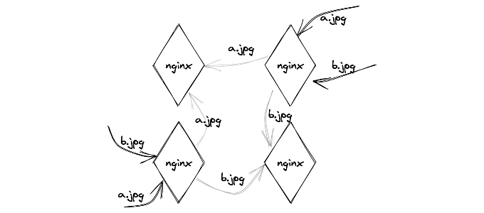
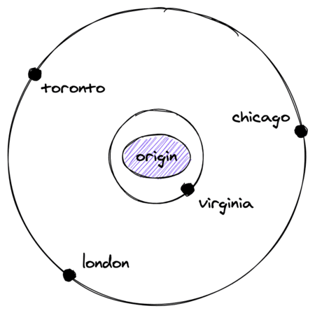
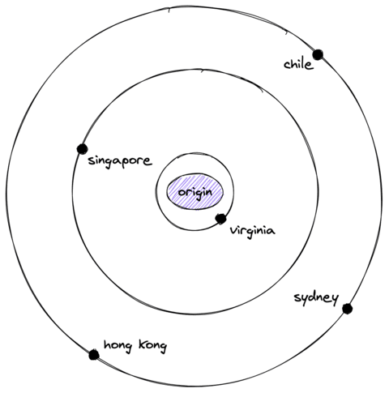

fly.io 블로그에 올라온 [The 5-hour CDN](https://fly.io/blog/the-5-hour-content-delivery-network/)을 번역·정리한 글입니다. CDN 도입이나 오픈소스로 직접 구현할 때 고민해야 할 설계 포인트가 잘 정리되어 있어 소개합니다.

CDN(Content Delivery Network)이라는 용어는 Google 같은 대기업이 수많은 하드웨어를 관리하며 초당 수백 기가비트의 데이터를 처리하는 이미지를 떠올리게 합니다. 하지만 CDN은 본질적으로 단순한 웹 애플리케이션입니다. 8년 전에 구입한 노트북으로도 커피숍에서 제대로 작동하는 CDN을 구축할 수 있습니다. 이 글에서는 5시간 안에 CDN을 개발할 때 고려해야 할 것들을 [NGINX 클러스터 예제](https://github.com/fly-apps/nginx-cluster)와 함께 설명합니다.

우선 CDN의 정확한 기능을 정의할 필요가 있습니다. CDN은 중앙 저장소(오리진, origin)에서 파일을 찾아 사용자와 가까운 위치에 복사본을 저장합니다. 초기 오리진은 CDN의 FTP 서버였지만, 현재는 웹 앱이 오리진이고 CDN은 프록시 서버 역할을 합니다. 즉, 우리가 구축하려는 CDN은 **분산 캐싱 프록시**입니다.

### 캐싱 프록시

HTTP 캐시 인프라는 [캐시 포이즈닝](https://portswigger.net/research/practical-web-cache-poisoning) 같은 보안 위협을 포함해 복잡하고 까다롭습니다. 처음부터 구현하기보다 검증된 도구를 활용하는 것이 현실적입니다.

주요 선택지는 세 가지입니다.

- **[Varnish](https://varnish-cache.org/)**: 스크립트 기능과 Edge Side Includes 지원, 활성화된 개발자 커뮤니티
- **[Apache Traffic Server](https://trafficserver.apache.org/)**: Netlify가 사용하는 검증된 솔루션
- **[NGINX](https://www.nginx.com/)**: Cloudflare가 사용하며, 이미 많은 팀에서 운영 중

어느 것을 선택해도 깊이 다루기는 쉽지 않습니다. 모두 시도해 보고 팀에 가장 익숙한 것을 고르는 편이 좋습니다.

구축할 CDN의 수준은 엔터프라이즈급은 아니지만, 충분히 쓸 만합니다. 호주 사용자를 시드니 서버로, 칠레 사용자를 산티아고 서버로 안내할 수 있다면 CDN이라 부를 수 있습니다.

### 트래픽 라우팅

사용자를 가장 가까운 서버로 라우팅하는 방법에는 크게 세 가지 옵션이 있습니다.

- **애니캐스트**: 라우팅 가능한 주소 블록을 확보하고 BGP4를 통해 여러 위치로 광고합니다. 인터넷이 라우팅을 자동으로 처리해 주는 장점이 있지만, 설정이 복잡하고 인터넷 상태에 의존합니다.
- **DNS 기반**: 클라이언트 IP의 지리적 위치를 기반으로 가장 가까운 서버 주소를 반환하는 DNS 서버를 운영합니다. 별도 인프라 없이 어디서나 도입할 수 있지만, 모바일·VPN 환경에서 위치 정확도가 낮아질 수 있습니다.
- **클라이언트 핑 방식**: 여러 서버에 핑을 보내 응답이 가장 빠른 서버를 선택합니다. 자체 클라이언트가 필요해 범용성은 낮습니다.

실제로는 (1)과 (2)를 조합하는 경우가 많습니다. DNS 로드 밸런싱은 구현이 간단하며, DNSimple 같은 서비스를 이용하면 규칙 정의만으로 도입할 수 있습니다. 애니캐스트는 난이도가 높지만, 제대로 구성하면 가장 안정적인 라우팅을 제공합니다.

NGINX를 각 도시에 배포하고 DNS 또는 애니캐스트로 트래픽을 라우팅하면 CDN의 90%가 완성됩니다. 나머지 10%를 달성하는 데는 상당한 시간이 걸립니다.

### 인터넷 장애 대응

심해 케이블은 선박에 의해 절단될 위험에 노출되어 있고, 육지에서도 굴착 공사로 인해 회선이 끊기는 일이 발생합니다. 서버 한 대를 한 곳에서만 운영할 때는 크게 신경 쓰이지 않지만, 전 세계에서 서버를 운영하면 장애 대응이 핵심 과제가 됩니다.

다행히 NGINX를 여러 도시에서 실행하면 즉시 높은 중복성을 확보할 수 있습니다. 한 서버가 다운되어도 나머지 서버가 대부분의 사용자에게 서비스를 계속 제공합니다.

구현 방법은 단순합니다. 헬스 체크를 설정해 NGINX 서버 다운을 감지하고, 이에 따라 DNS를 변경하거나 BGP 경로를 취소합니다. CDN 리전이 다운되면 완전히 차단되기 전에 통신 속도가 먼저 느려지므로, 헬스 체크에서 응답 시간도 함께 모니터링해야 합니다.

인터넷 장애는 서버 장애보다 발견하기 어렵습니다. 여러 위치에서 외부 헬스 체크를 수행해야 하기 때문입니다. [Datadog Synthetic Monitoring](https://www.datadoghq.com/product/synthetic-monitoring/)이나 [updown.io](https://updown.io/) 같은 서비스를 활용하면 여러 관점의 모니터링을 쉽게 구성할 수 있습니다. 필요한 정보는 cURL로 얻을 수 있는 정보와 크게 다르지 않습니다.

### 캐시 히트율 높이기

캐시 효율성의 지표를 **캐시 히트율**이라고 합니다. 캐시 히트율은 전체 요청 중 캐시에서 응답한 비율을 측정한 것입니다.

캐시 히트율 80%는 "요청의 80%는 캐시에서 제공하고, 나머지 20%만 오리진으로 전달한다"는 의미입니다. CDN을 구축할 때는 이 비율을 최대한 높이는 것이 목표입니다.

나이브한 NGINX 설정을 20개 리전에 그대로 배포하면 20대의 독립 서버가 생깁니다. 단순하지만 문제가 있습니다. 리전 간 캐시 공유가 없으므로 20대 모두 오리진에 직접 요청을 보내야 합니다. 캐시 히트율이 낮고 오리진 부하가 큽니다.

각 리전에 두 번째 서버를 추가하면 중복성은 높아지지만 오리진 요청 수가 두 배가 됩니다. 서버가 늘어날수록 캐시가 분산되어 히트율이 낮아지기 때문입니다.

이 문제를 해결하는 방법이 **캐시 샤딩**입니다. 콘텐츠를 분리해 각 서버가 특정 데이터 청크만 담당하고, 요청을 받은 서버는 해당 콘텐츠를 담당하는 서버로 요청을 전달합니다.

NGINX 내장 로드 밸런서는 해시 기반 로드 밸런싱을 지원합니다. URL을 해시해 동일한 URL은 항상 동일한 서버로 전달하므로, 서버 수가 늘어나도 캐시 히트율을 유지할 수 있습니다.

위 그림처럼 `a.jpg` 요청은 클러스터 내 모든 NGINX 인스턴스에서 항상 동일한 서버로 전달됩니다. `b.jpg`도 마찬가지입니다. 이 설정으로 각 서버는 로드 밸런서이자 캐시 샤드 역할을 동시에 수행합니다. 고급 기능이 필요하면 이 두 역할을 별도 레이어로 분리할 수도 있습니다.

### 계층적 프록시 구조

높은 캐시 히트율과 안정적인 인터넷 라우팅이라는 두 목표를 동시에 달성하려면, 제어할 수 없는 공용 인터넷 구간을 최소화하고 신뢰할 수 있는 네트워크를 통해 오리진에 요청을 보내야 합니다.

CDN은 일반적으로 고객의 오리진과 가까운 리전에 서버를 배치합니다. NGINX 예제를 버지니아에 배치하면 AWS의 가장 큰 리전(us-east-1) 근처에 서버를 확보하게 됩니다.

모든 오리진 요청을 버지니아 서버를 통해 보내면, 버지니아와 us-east-1 사이의 공용 인터넷 구간이 매우 짧아 안정적입니다. 이를 **Origin Shielding(오리진 보호)**이라고 합니다. 특정 리전을 통해 트래픽을 집중시키면 오리진으로 가는 IP 범위를 한정할 수 있어 L4 방화벽 규칙으로 접근을 제어할 수 있습니다.

**Request Coalescing(요청 집계)**도 함께 활용하면 오리진 부하를 더욱 줄일 수 있습니다. 예를 들어 100,000명이 동시에 캐시되지 않은 블로그 글에 접근하면, 오리진에 100,000건의 요청이 동시에 쏟아집니다. 요청 집계는 특정 URL에 대한 첫 번째 요청만 오리진으로 보내고, 나머지 요청은 캐시가 완성될 때까지 대기시킵니다. NGINX 클러스터 예제에서 이 설정은 단 2줄이면 됩니다.

> Fly의 영구 볼륨은 NGINX 업그레이드 중에도 캐시 히트율을 유지하는 데 도움이 되고, 암호화된 프라이빗 네트워킹은 NGINX 간 mTLS 설정 없이 안전한 통신을 제공합니다.

### 지연 최소화

한 리전을 통해 요청을 집중하면 캐시 히트율은 높아지지만, 물리적 거리에 따른 지연이 발생합니다. 싱가포르 사용자의 요청을 버지니아까지 보내면 그 차이가 체감됩니다.

이 문제는 레이어를 추가해 해결합니다.

호주에서 버지니아까지는 약 14,624km로, 빛의 속도로도 상당한 지연이 발생합니다. 호주에서 4,300km 거리의 싱가포르에 먼저 요청을 보내고, 싱가포르 캐시에서 응답하면 지연을 크게 줄일 수 있습니다. 싱가포르 캐시 미스가 발생해 버지니아까지 요청이 이어지더라도 그 추가 지연은 수십 밀리초 수준입니다.

범용 CDN이라면 이처럼 각 리전의 캐시를 집계하는 몇 개의 광역 리전을 계층적으로 구성하는 것이 좋습니다. 단순히 애플리케이션 속도를 높이려는 목적이라면, 계층 구조 대신 애플리케이션 자체를 여러 리전에 분산하는 편이 더 효과적일 수 있습니다.

### CDN 구축의 현실과 남은 과제

CDN의 기본 아이디어는 이해하기 어렵지 않습니다. 그러나 CDN 구축은 전통적으로 많은 자원과 경험이 필요한 작업이었습니다.

지금은 NGINX 같은 도구로 유용한 CDN의 기본 요소를 갖출 수 있습니다. [GitHub 저장소](https://github.com/fly-apps/nginx-cluster)의 예제는 리전별 중복성과 리전 간 라우팅을 기본 NGINX 설정만으로 구현합니다. 설정도 그리 복잡하지 않습니다.

다만, 이 수준의 CDN은 간단한 캐시 용도로는 충분하지만 복잡한 애플리케이션에는 부족한 부분이 있습니다.

특히 이 글에서 다루지 않은 중요한 주제가 두 가지 있습니다.

- **캐시 만료와 퍼지(Purge)**: 배포 후 오타를 발견했을 때 분산된 수십 대의 캐시 서버에서 해당 콘텐츠를 일괄 삭제하는 것은 CDN에서 가장 어려운 문제 중 하나입니다. 이 주제만으로도 별도의 글이 필요합니다.
- **CDN 레이어 확장 기능**: 이미지 최적화, WAF, API 속도 제한, 봇 탐지 등의 기능을 CDN 레이어에 추가할 수 있습니다.

기본적인 CDN 구조를 이해하고 나면, 상용 CDN이 어떤 문제를 해결하는지 훨씬 명확하게 보입니다.
