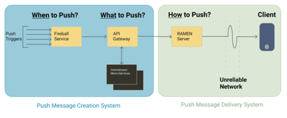
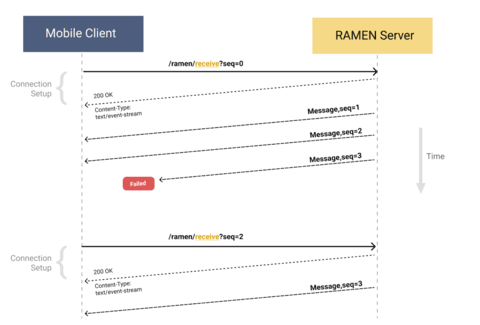
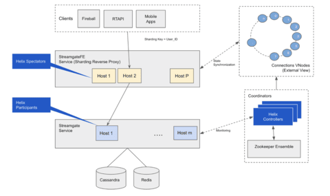

## 들어가며

비즈니스에서 실시간 푸시 기술이 점점 중요해지고 있어, Uber가 어떻게 푸시 플랫폼을 구축하고 진화시켰는지를 다룬 [Uber's Real-Time Push Platform](https://eng.uber.com/real-time-push-platform/) 글을 번역해 정리했습니다.

Uber는 매일 전 세계에서 수백만 건의 여행 데이터를 처리하며 다방면의 마켓플레이스를 구축하고 있습니다. 픽업 시간, 도착 시간, 경로 등 여행에 참여하는 모든 주체(라이더, 드라이버)의 앱을 실시간으로 동기화해야 하고, 앱이 활성화됐을 때 근처 드라이버 정보도 즉시 제공되어야 합니다.

이 글은 앱의 새로고침 방식을 폴링에서 gRPC 기반 양방향 스트리밍으로 어떻게 전환했는지를 설명합니다.

## 폴링 방식의 한계

### 폴링 방식의 동작

Uber 트립은 라이더와 드라이버가 실세계에서 이동하는 사이의 조율입니다. 두 엔티티는 여행이 진행되는 동안 백엔드 시스템과 서로 최신 상태를 유지해야 합니다.

탑승자가 승차 요청을 하고 드라이버가 온라인 상태인 시나리오를 생각해봅시다. 백엔드 매칭 시스템이 매칭을 식별하고 드라이버에게 여행 정보를 전달하면, 라이더·드라이버·백엔드 모두가 동기화되어야 합니다.

드라이버 앱은 몇 초마다 서버에 폴링하여 새로운 오퍼가 있는지 확인하고, 라이더 앱도 몇 초마다 폴링하여 드라이버가 할당됐는지 확인합니다. 폴링 빈도는 데이터 변경률에 따라 달라지는데, Uber 앱에서는 몇 초에서 몇 시간까지 매우 다양합니다.

### 폴링의 문제점

어느 시점에 백엔드 API 게이트웨이 요청의 80%가 폴링 호출이었습니다.

적극적인 폴링은 앱의 응답성을 유지하지만 서버 리소스 이용률이 높아집니다. 폴링 빈도에 버그가 있으면 백엔드 부하가 급증하고 성능이 크게 저하됩니다. 실시간 동적 데이터가 필요한 기능 수가 증가할수록 부하도 지속적으로 증가해 이 접근 방식은 한계에 달했습니다.

폴링은 배터리 소모 증가, 앱 속도 저하, 네트워크 혼잡을 유발합니다. 특히 2G/3G 네트워크나 불안정한 지역에서는 폴링을 여러 번 시도하게 됩니다.

기능 수가 증가하면서 개발자들은 기존 폴링 API를 오버로드하거나 새로운 폴링 API를 계속 만들었습니다. 피크 시에는 수십 개의 API를 동시에 폴링했고, 각 API는 여러 기능으로 오버로드되어 API 수준의 관심 분리가 무너졌습니다.

앱 초기 구동 시 문제가 가장 극명했습니다. 앱을 열 때마다 모든 기능이 백엔드에서 최신 상태를 가져와 UI를 렌더링하려다 여러 API를 동시에 호출하는 경쟁이 발생했습니다. 우선순위 없이 모든 API에 중요 정보가 분산되어 있어 앱 로드 시간이 계속 증가했고, 열악한 네트워크 조건은 이를 더욱 악화시켰습니다.

마켓플레이스 참여자들 사이의 상태 동기화 방식에 대한 근본적인 혁신이 필요했습니다. 서버가 온디맨드 방식으로 앱에 데이터를 전송할 수 있는 푸시 메시징 플랫폼 구축에 착수했습니다.

## RAMEN 도입과 설계 원칙

폴링을 없애기 위해 푸시 메시지를 사용하는 것은 당연한 선택이었지만, 설계에 대한 많은 고려가 필요했습니다. 네 가지 주요 설계 원칙은 다음과 같습니다.

**폴링에서 푸시로의 간단한 마이그레이션**

비즈니스를 지원하는 많은 기존 폴링 엔드포인트가 있었습니다. 새로운 시스템은 기존 폴링 API의 페이로드 빌드 비즈니스 로직을 다시 작성하지 않고 활용할 수 있어야 했습니다.

**개발 용이성**

개발자가 폴링 API를 개발하는 노력에 비례하여, 데이터를 푸시하기 위해 크게 다른 노력을 들여서는 안 됩니다.

**신뢰성**

모든 메시지는 네트워크를 통해 안정적으로 전송되어야 하며, 전달에 실패할 경우 재시도해야 합니다.

**전송 효율성**

Uber가 개발도상국에서 빠르게 성장하면서 데이터 사용 비용은, 특히 하루에 여러 시간 동안 플랫폼에 연결된 드라이버들에게 민감한 문제였습니다. 서버와 모바일 앱 간의 데이터 전송량을 최소화해야 했습니다.

새로운 시스템을 **RAMEN(Real-time Asynchronous MEssage Network, 실시간 비동기식 메시지 네트워크)** 이라고 명명했습니다.

_Figure 1: High-level architecture of the overall system._

## 메시지 생성과 페이로드 구성

### 메시지 생성 결정(Fireball)

실시간으로 수백 명의 라이더, 드라이버, 식당, 고객에 걸쳐 정보가 변화합니다. 메시지 라이프사이클은 사용자에 대한 메시지 페이로드를 언제 생성할지 결정하는 것으로 시작됩니다.

**Fireball** 은 "메시지를 언제 푸시할 것인가?"라는 문제를 해결하는 마이크로서비스입니다. 시스템 전체에서 발생하는 다양한 이벤트를 파악하고, 관련 사용자에게 푸시가 필요한지 판단합니다.

예를 들어 드라이버가 제안을 수락하면 드라이버와 트립 엔티티 상태가 변경됩니다. 이 변경이 Fireball을 트리거하면, Fireball은 설정에 따라 관련 마켓플레이스 참가자에게 어떤 유형의 푸시 메시지를 보낼지 결정합니다. 하나의 트리거가 여러 사용자에게 여러 메시지 페이로드를 보내야 하는 경우도 있습니다.

트리거의 종류로는 승차 요청, 앱 열기, 주기적 타이머, 메시지 버스의 백엔드 비즈니스 이벤트, 지리적 입출력 이벤트 등이 있습니다. 이러한 트리거는 필터링되어 API 게이트웨이 엔드포인트 호출로 변환됩니다. Fireball은 API 게이트웨이 호출 시 RAMEN 서버로부터 디바이스 컨텍스트를 가져와 헤더에 추가합니다.

### 메시지 페이로드 생성(API 게이트웨이)

Uber 앱의 모든 서버 호출은 API 게이트웨이에서 처리됩니다([게이트웨이 진화 참고](https://eng.uber.com/gatewayuberapi/)). 푸시 페이로드도 동일한 방식으로 생성됩니다.

API 게이트웨이는 Fireball이 "누구에게 언제" 푸시할지를 결정하면 "무엇을" 푸시할지를 결정합니다. 게이트웨이의 API는 Pull API와 Push API로 분류됩니다.

- **Pull API**: 모바일 디바이스에서 HTTP 요청으로 직접 호출하는 엔드포인트
- **Push API**: Fireball에서 호출하는 엔드포인트. Pull API 응답을 가로채 푸시 메시지 전달 시스템으로 전달하는 미들웨어가 추가됨

API 게이트웨이를 중간에 두는 이점은 다음과 같습니다.

- Pull API와 Push API가 엔드포인트의 비즈니스 로직 대부분을 공유합니다. 동일한 "사용자" 객체를 Pull로 가져오든 Fireball이 Push로 보내든 같은 로직이 사용됩니다.
- 게이트웨이가 트래픽 제한, 라우팅, 스키마 유효성 검사 등 공통 문제를 처리합니다.

### 푸시 메시지 페이로드 메타데이터

각 푸시 메시지는 최적화를 위한 다양한 메타데이터를 가집니다.

**우선순위**

수백 개의 페이로드가 생성되므로 전송 우선순위가 필요합니다. 메시지는 세 가지 우선순위 버킷으로 분류됩니다.

- **높음**: 핵심 사용자 경험에 직결되는 메시지
- **중간**: 점진적으로 사용자 경험을 개선하는 기능 메시지
- **낮음**: 페이로드 크기가 크고 중요도가 낮으며 빈도가 적은 메시지

높은 우선순위 메시지는 소켓에 먼저 진입하고, RPC 실패 시 서버 측 재시도 메커니즘으로 도달 확률을 높이며, 지역 간 복제도 지원합니다.

**TTL(메시지 지속 시간)**

각 메시지에는 몇 초에서 최대 30분의 TTL 값이 정의됩니다. 전달 시스템은 TTL이 만료될 때까지 재시도합니다.

**중복 제거**

다양한 트리거나 재시도로 동일한 메시지 유형이 여러 번 생성되는 경우, 가장 최근의 메시지만 전송합니다. 이를 통해 전체 데이터 전송량을 줄일 수 있습니다.

## 푸시 메시지 전달

전 세계 수백만 개의 모바일 앱에 대한 연결을 유지하고, 메시지 페이로드를 도착하는 즉시 전달하는 서비스입니다. 전 세계 모바일 네트워크의 신뢰성이 다양하기 때문에 전달 시스템은 장애에 강건해야 합니다. **at-least-once(최소 한 번)** 보증 메커니즘(QoS)을 제공합니다.

### RAMEN 전달 프로토콜

신뢰할 수 있는 전송 채널을 위해 TCP 기반 영구 연결이 필요했습니다. 2015년 당시 옵션은 Long Polling, 웹 소켓, Server-Sent Events(SSE)였습니다.

> **SSE(Server-Sent Events)**: HTTP 프로토콜 위에서 서버가 클라이언트로 단방향으로 이벤트를 스트리밍하는 표준 방식입니다.

보안, 모바일 SDK 지원, 바이너리 크기 등을 고려해 SSE를 선택했습니다. 이미 Uber에서 지원하는 HTTP + JSON API 스택의 단순성과 운용성이 주된 이유였습니다.

SSE는 단방향 프로토콜이기 때문에, at-least-once 보증을 위해 확인(ACK)과 재시도를 애플리케이션 프로토콜 위에 구현해야 했습니다.

_Figure 2: Server-client interaction for the SSE protocol._

클라이언트는 `/ramen/receive?seq=0`으로 첫 번째 요청을 보내고, 서버는 HTTP 200과 `Content-Type: text/event-stream`으로 응답해 SSE 연결을 유지합니다.

서버는 보류 중인 메시지를 우선순위 내림차순으로 발송하며 시퀀스 번호를 증가시킵니다. `seq#3` 메시지가 전달되지 않으면 연결이 끊어진 것으로 간주합니다. 클라이언트는 마지막으로 수신된 시퀀스 번호(예: `seq=2`)로 재연결하고, 서버는 `seq=3`부터 다시 발송합니다.

연결 활성 여부 확인을 위해 서버는 4초마다 1바이트 크기의 heartbeat 메시지를 보냅니다. 클라이언트가 heartbeat 또는 메시지를 최대 7초 동안 받지 못하면 연결이 끊긴 것으로 간주하고 재연결합니다.

클라이언트가 더 높은 시퀀스 번호로 재연결할 때마다 서버의 오래된 메시지를 플러시하는 확인 메커니즘이 작동합니다. 연결이 수 분 이상 유지될 경우를 대비해, 앱은 연결 품질에 관계없이 30초마다 `/ramen/ack?seq=N`을 호출합니다.

이 프로토콜의 단순성 덕분에 다양한 언어와 플랫폼에서 클라이언트를 빠르게 구현할 수 있었습니다.

### 디바이스 컨텍스트 저장소

RAMEN 서버는 연결이 설정될 때마다 디바이스 컨텍스트를 저장합니다. 각 디바이스 컨텍스트 ID는 사용자 및 디바이스 매개변수로 고유한 해시를 생성합니다. 이를 통해 사용자가 설정이 다른 여러 기기나 앱을 동시에 사용하는 경우에도 푸시 메시지를 격리할 수 있습니다.

### 메시지 저장소

RAMEN 서버는 모든 메시지를 메모리에 저장하고 데이터베이스에 백업합니다. 연결이 불안정할 경우 TTL이 만료될 때까지 전송을 재시도합니다.

## 구현 및 글로벌 확장

### 1세대 구현

1세대 RAMEN 서버는 Uber의 일관된 해싱/샤딩 프레임워크인 "[Ringpop](https://eng.uber.com/ringpop-open-source-nodejs-library/)"을 사용하여 Node.js로 작성됐습니다. Ringpop은 분산 샤딩 시스템으로, 모든 연결은 사용자 UUID로 샤딩되었으며 Redis를 데이터스토어로 사용했습니다.

### 글로벌 확장의 필요성

1년 반 동안 푸시 플랫폼은 회사 전체에서 광범위하게 사용됐습니다. 피크 시 최대 60만 개의 동시 스트리밍 연결을 유지하며 초당 7만 개 이상의 QPS 푸시 메시지를 세 가지 앱 유형으로 전달하는 수준이 됐습니다.

트래픽과 연결 수가 증가하면서 기술 스택의 확장도 필요했습니다. Ringpop 기반 분산 샤딩은 단순한 아키텍처지만 링의 노드 수가 증가하면서 확장에 한계가 드러났습니다. Ringpop은 가십 프로토콜로 멤버십을 평가하는데, 링 크기가 커질수록 수렴 시간이 증가했습니다. Node.js workers는 단일 스레드라 높은 이벤트 루프 지연이 멤버십 수렴을 더 지연시켰고, 이로 인해 메시지 손실과 타임아웃이 발생했습니다.

### 2세대 아키텍처

2017년 초, RAMEN 서버 구현을 확장 가능한 구조로 재작성했습니다. 사용한 기술 스택은 다음과 같습니다.

_Netty_: 네트워크 서버와 클라이언트 구축에 널리 사용되는 고성능 라이브러리. 제로 카피 버퍼(bytebuf)로 시스템 효율성을 높입니다.

_Apache ZooKeeper_: 분산 동기화 및 구성 관리를 위한 강력한 시스템. 중앙 집중식 토폴로지 관리를 담당하며 연결된 노드의 장애를 빠르게 감지합니다.

_Apache Helix_: ZooKeeper 위에서 작동하는 클러스터 관리 프레임워크. 사용자 지정 토폴로지 정의와 재조정 알고리즘을 지원하며, 비즈니스 로직에서 토폴로지 로직을 추상화합니다.

_Redis & Apache Cassandra_: 멀티 리전 아키텍처에서 메시지의 올바른 복제와 저장을 담당합니다. Cassandra는 내구성이 뛰어나고 여러 리전에 걸쳐 복제되는 스토리지이며, Redis는 Cassandra 위에서 캐시로 사용됩니다.

_Figure 3: Architecture for the new RAMEN backend server._

주요 구성 요소는 세 가지입니다.

_Streamgate_: Netty로 RAMEN 프로토콜을 구현하며 연결·메시지·저장 관련 모든 처리 로직을 담당합니다. ZooKeeper와 연결을 설정하고 하트비트를 관리하는 Apache Helix 참가자도 구현합니다.

_StreamgateFE(Streamgate Front End)_: Apache Helix 스펙테이터 역할로 ZooKeeper의 토폴로지 변경을 모니터링하는 역방향 프록시. 클라이언트(Fireball, 게이트웨이, 모바일 앱)의 모든 요청을 토폴로지 정보를 사용해 올바른 Streamgate 워커로 라우팅합니다.

_Helix Controller_: Apache Helix Controller 프로세스를 전담하는 5노드 스탠드얼론 서비스. 토폴로지 관리의 핵심으로, Streamgate 노드가 시작·중지될 때마다 변경을 감지하고 샤딩 파티션을 재할당합니다.

이 아키텍처로 99.99%의 서버 사이드 인프라 안정성을 달성했습니다. iOS, Android, 웹 플랫폼의 10가지 이상 애플리케이션을 지원하며, 150만 개 이상의 동시 연결과 초당 25만 개 이상의 메시지를 처리하고 있습니다.

## gRPC 기반 차세대 RAMEN

서버 사이드 인프라의 안정성은 유지됐지만, 모바일 디바이스 푸시 메시지 전달의 신뢰성을 더 높이기 위한 과제가 남아 있었습니다. 신뢰성 저하에 기여하는 주요 영역은 다음과 같습니다.

**ACK 유실(Loss of Acknowledgements)**

RAMEN 프로토콜은 데이터 전송 최소화를 위해 ACK를 30초마다 또는 클라이언트 재연결 시에만 확인했습니다. 이로 인해 진정한 메시지 손실과 ACK 요청 실패를 구별하기 어려웠습니다.

**연결 안정성 문제(Poor Connection Stability)**

플랫폼별 클라이언트 구현에서 오류 처리, 타임아웃, 백오프, 앱 생명주기 이벤트, 네트워크 상태 변경 처리 방식이 미묘하게 달랐습니다. 버전에 따라 성능 차이가 발생했습니다.

**전송 제한(Transport Limitations)**

SSE는 단방향 프로토콜이어서 양방향 메시지 전송을 지원할 수 없었습니다. 또한 텍스트 기반 프로토콜로 base64 인코딩 없이 바이너리 페이로드 전송이 불가능해 페이로드 크기가 커지는 문제가 있었습니다.

2019년 말, 이러한 단점을 해결하기 위해 차세대 RAMEN 프로토콜을 gRPC 기반으로 개발하기 시작했습니다.

> **gRPC**: 다양한 언어에 걸쳐 표준화된 클라이언트·서버 구현을 제공하는 고성능 RPC 프레임워크. HTTP/2 기반의 양방향 스트리밍을 지원합니다.

새로운 gRPC 기반 RAMEN 프로토콜의 주요 변경점은 다음과 같습니다.

- ACK 메시지가 역스트림으로 즉시 전송됩니다. 데이터 전송량은 소폭 증가했지만 응답 신뢰성이 크게 향상됐습니다.
- 실시간 ACK로 RTT를 측정하고 네트워크 상태를 실시간으로 파악할 수 있습니다. 진짜 메시지 손실과 네트워크 손실을 구별할 수 있게 됐습니다.
- 스트림 다중화, 애플리케이션 레벨 네트워크 우선순위 지정, 흐름 제어 알고리즘 실험이 가능해졌습니다.
- 메시지 페이로드를 추상화해 다양한 직렬화 방식을 지원합니다. gRPC 전송 계층은 유지하면서 직렬화 방식만 교체할 수 있습니다.
- 다양한 언어의 강력한 클라이언트 구현으로 다양한 앱과 디바이스를 신속하게 지원할 수 있습니다.

이 작업은 베타 릴리스 중이며, 새로 시작한다면 처음부터 gRPC로 시작하는 것을 권장합니다.

### 성공의 세 가지 원칙

**관심 분리**

메시지 트리거링(Fireball), 생성(API 게이트웨이), 전달(RAMEN) 시스템의 명확한 책임 분리가 플랫폼 발전을 가능하게 했습니다. 전달 컴포넌트를 Apache Helix, 토폴로지 로직, 스트리밍 비즈니스 로직으로 분리한 덕분에 SSE에서 gRPC로의 전환을 동일한 아키텍처 구조로 지원할 수 있었습니다.

**업계 표준 기술**

업계 표준 기술 기반으로 구축하면 구현이 더 강력하고 장기적이며 비용 효율적입니다. 유지보수 오버헤드가 매우 적었고, 효율적인 팀 규모로도 플랫폼 가치를 제공할 수 있었습니다. Helix와 ZooKeeper는 매우 안정적이었습니다.

**단순한 프로토콜 설계**

다양한 네트워크 조건, 수백 개의 기능, 수십 개의 앱을 통해 수백만 명의 사용자로 확장할 수 있었던 것은 프로토콜의 단순성 덕분이었습니다. 단순한 설계가 빠른 확장과 빠른 이동을 가능하게 했습니다.

## 마치며

Uber의 RAMEN 사례에서 얻을 수 있는 핵심 교훈은 세 가지입니다.

1. **진화 가능한 설계**: 처음부터 완벽한 기술을 선택하려 하기보다, 관심 분리와 단순한 프로토콜로 설계하면 나중에 기술을 교체하거나 진화시키기 훨씬 쉽습니다.
2. **비즈니스 제약을 설계 원칙으로**: 개발도상국 사용자의 데이터 비용 문제가 전송 효율성이라는 설계 원칙을 낳았습니다. 비즈니스 현실이 기술 결정을 이끌어야 합니다.
3. **표준 기술의 힘**: 자체 구현보다 업계 표준(gRPC, ZooKeeper, Helix)을 활용하면 작은 팀으로도 높은 신뢰성과 확장성을 달성할 수 있습니다.
