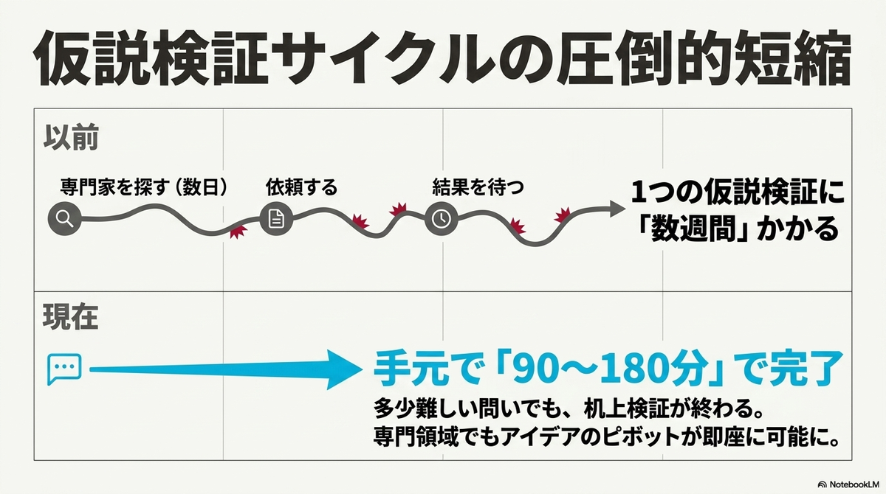
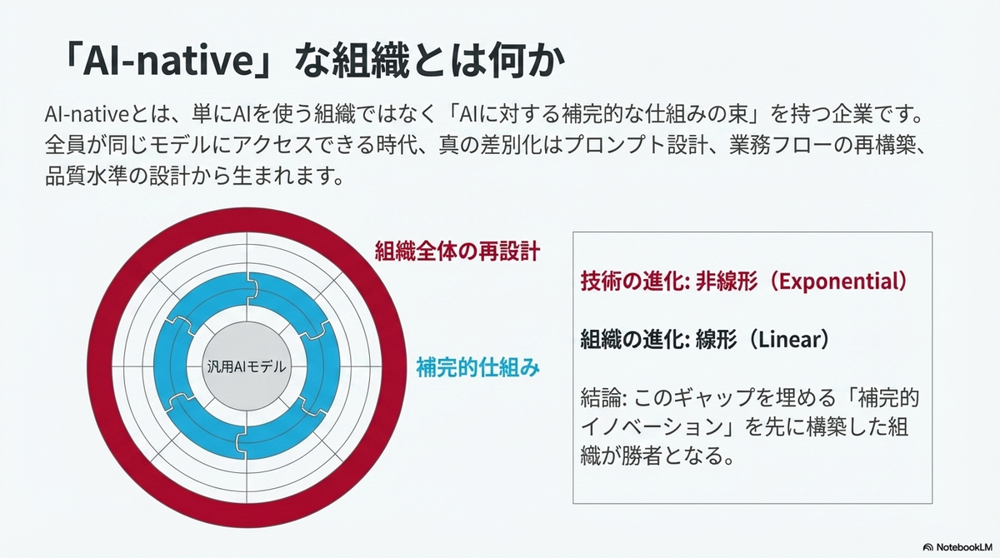
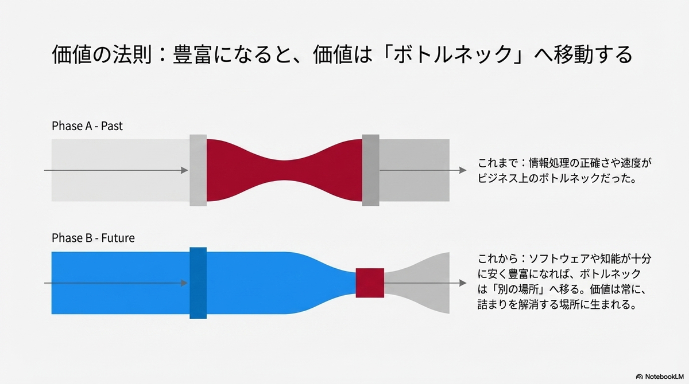
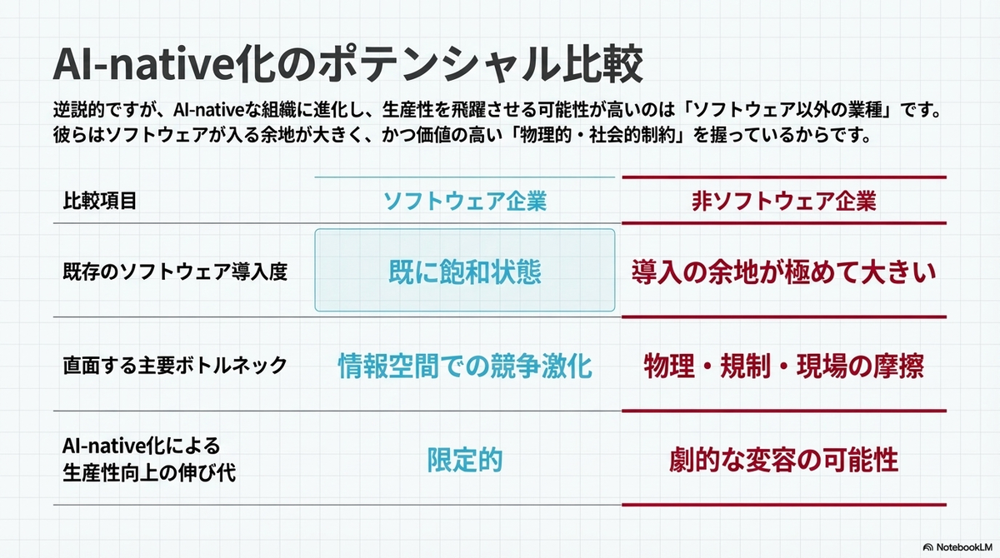
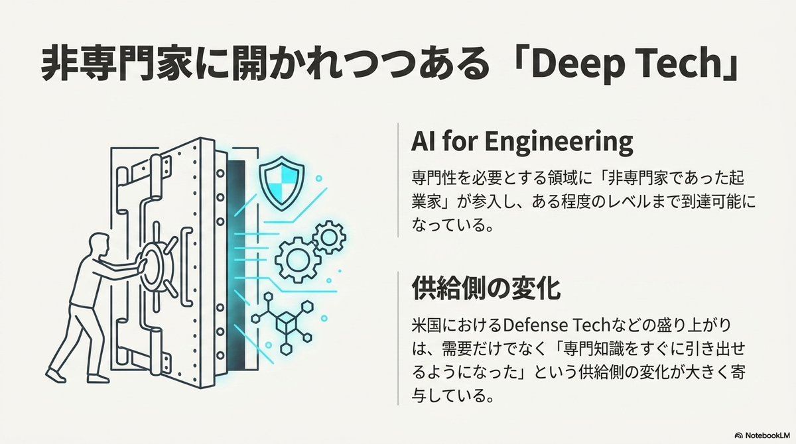
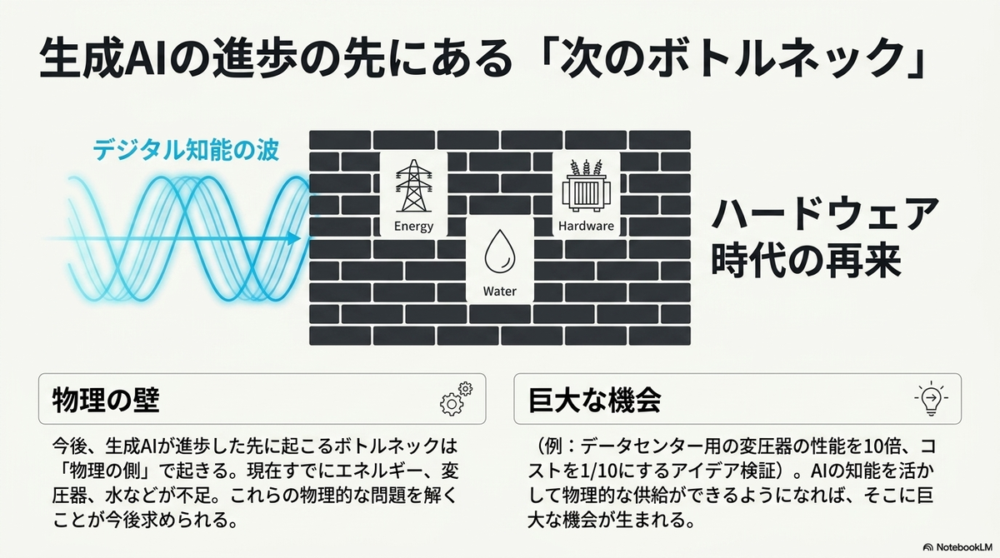

AI 모델에 사업 아이디어를 설명하면 몇 분 안에 기술적 타당성에 대한 1차 판단이 돌아온다. 몇 해 전이라면 엔지니어나 컨설턴트를 붙잡고 며칠을 기다려야 했던 일이다. 이런 변화를 접한 반응은 대체로 두 갈래로 갈린다. 특정 직군의 일이 곧 사라진다는 불안, 그리고 생산성이 몇 배로 뛸 것이라는 낙관이다. 두 반응 모두 저렴해진 기술 하나가 산업 전체를 어떻게 재편하는지에 대한 질문은 건너뛴다.

이 글은 소프트웨어 엔지니어와 딥테크 창업가, 그리고 이 변화가 자신이 속한 산업과 커리어에 어떤 의미인지 판단하려는 독자를 대상으로 한다. 이 글을 읽고 나면 기술이 저렴해질 때 산업이 왜 곧바로 좋아지지 않는지, 경쟁 우위(흔히 해자라고 부르는 것)가 실제로 어디로 옮겨가는지, 그리고 그 이동이 개인의 대응 방향에 어떤 의미를 갖는지 판단할 수 있다.

## 조명과 표계산으로 보는 저렴해진 기술의 확산 방식

조명의 역사가 좋은 출발점이다. 1830년 무렵에는 촛불로 밤에 아주 적은 빛을 얻으려 해도 노동 약 3시간에 해당하는 비용이 들었다. 1992년에는 같은 양의 빛을 얻는 데 드는 노동 시간이 1초에도 미치지 못했다. 사람들이 이 변화에 대응한 방식은 예전과 똑같은 양의 촛불을 훨씬 싸게 사는 것이 아니었다. 거리와 공장과 상점 진열창까지 빛을 확산시켜, 낮에만 존재하던 경제활동을 밤 시간대로 통째로 옮겨왔다. 조명이 저렴해지자 늘어난 것은 조명 소비량이 아니라 조명이 가능하게 만드는 새로운 활동이었다.

VisiCalc의 등장도 같은 패턴을 따른다. 1970년대까지 복잡한 재무 시나리오를 손으로 재계산하는 일은 소수 전문가의 영역이었다. 계산 하나를 바꿀 때마다 관련된 모든 수치를 다시 손으로 고쳐야 했기 때문이다. 이 반복 작업의 고통에서 출발한 표계산 소프트웨어는 개발에 채 2개월이 걸리지 않았고, 1979년 출시 이후 재무 계산의 비용을 극적으로 낮췄다. 결과는 계산 작업의 단순한 자동화에 그치지 않았다. 계산 비용이 낮아지자 그 계산을 전제로 성립하는 컨설팅과 투자 산업 자체의 진입장벽이 낮아졌고, 이전에는 대형 기업의 재무팀만 감당할 수 있던 시나리오 분석을 소규모 조직도 수행할 수 있게 됐다.

두 사례가 가리키는 결론은 같다. 어떤 기술이 저렴해질 때 나타나는 1차 효과는 기존 활동을 싸게 반복하는 것이지만, 진짜 변화는 그 기술이 이전에는 비용 때문에 아예 존재하지 않았던 영역으로 퍼져나갈 때 일어난다. 그렇다면 지금 저렴해지고 있는 것은 정확히 무엇인가.

## 지금 저렴해지고 있는 것은 무엇인가

표계산이 저렴하게 만든 대상은 계산이라는 좁고 명확한 영역이었다. 지금 AI가 저렴하게 만들고 있는 대상은 그보다 훨씬 넓다. 스탠퍼드 HAI가 발표한 2025 AI Index 보고서는 GPT-3.5급 성능을 내는 추론 비용이 18개월 만에 280배 넘게 하락했다고 밝혔다. 같은 수준의 판단을 얻는 데 드는 비용이 1년 반 사이에 1퍼센트 미만으로 줄어든 셈이다. OpenAI의 샘 올트먼은 이런 추세를 두고 지능이 "미터로 잴 필요가 없을 만큼 저렴해진다"고 표현했는데, 매년 단가가 10배 이상씩 떨어져온 실제 흐름을 보면 과장된 수사만은 아니다. 이 글에서는 이렇게 AI 판단의 단가가 구조적으로 떨어지는 흐름을 AI 저가화라고 부른다.

이 하락이 만드는 변화는 계산기의 성능이 좋아지는 것과는 다르다. 최신 모델은 기술경제성 분석이나 제조 공정에 대한 1차 원리 추론처럼, 과거에는 해당 분야 전문가를 고용해야만 얻을 수 있던 판단을 상당한 정확도로 내놓는다. 딥테크 창업 초기에 아이디어의 기술적 타당성을 탁상에서 검증하는 데 걸리던 기간이 실행당 90분에서 180분 수준으로 줄었다는 관찰도 있다. 전문가의 며칠짜리 검토가 한나절 안에 끝나는 작업으로 바뀐 것이다.

표계산이 계산이라는 닫힌 영역 하나를 저렴하게 만들었다면, AI는 여러 전문 영역에 동시에 같은 일을 하고 있다. 그렇다고 해서 모든 전문 판단이 같은 속도로 저렴해지는 것은 아니다.

## AI가 잘하는 영역과 못하는 영역

앞서 말한 검증 속도는 모든 종류의 판단에 똑같이 적용되지 않는다. AI는 물리 법칙처럼 닫힌 공급측 영역, 이를테면 특정 소재가 특정 온도에서 어떻게 반응하는지, 어떤 제조 공정이 이론적으로 성립하는지를 판단하는 데는 강하다. 반면 그 제품을 실제로 시장이 사줄 것인지, 규제가 앞으로 어떻게 바뀔 것인지처럼 인간의 선택이 개입하는 수요측 영역에서는 상대적으로 약하다.

이 차이는 우연이 아니라 구조적인 이유에서 나온다. 공급측 문제는 고정된 물리 법칙이라는 근거가 있어 계산과 시뮬레이션으로 답이 수렴한다. 반면 수요는 다수의 행위자가 서로의 선택에 반응하며 만들어내는 결과라서, 아무리 많은 데이터를 넣어도 계산 하나로 환원되지 않는다. 그래서 AI 저가화가 지금 여는 기회는 "이 아이디어가 시장에서 통할 것인가"보다 "이 아이디어가 기술적으로 성립하는가"라는 질문에 먼저 집중된다.

그런데 기술적으로 성립한다는 판단이 빨리 나온다고 해서 그 판단이 곧바로 사업의 가치로 이어지는 것은 아니다.

## 기술이 저렴해지는 속도와 조직이 바뀌는 속도는 같은가

기술이 저렴해지는 속도와 그 기술을 실제로 활용하는 조직이 바뀌는 속도 사이에는 간극이 있다. 추론 비용은 지수적으로, 즉 비선형적으로 떨어진다. 반면 사람을 채용하고 훈련하고 새로운 판단 도구를 업무 프로세스에 편입시키는 데 걸리는 시간은 선형적으로만 줄어든다. 이 비대칭이 기술의 하락 속도만큼 산업 전체의 생산성이 곧바로 오르지 않는 이유다.

이 간극 속에서 가치는 기술 자체가 아니라 기술을 둘러싼 나머지 요소로 옮겨간다. 판단 결과를 실제 현장에 적용하는 일, 그 판단이 틀렸을 때 책임을 지는 일, 결과물의 품질을 보증하는 일, 규제 기관을 상대로 그 판단의 근거를 설명하는 일이다. 이런 요소는 AI가 판단 하나를 내놓는 속도와 무관하게, 조직이 그 판단을 실제로 소화할 수 있는 속도에 묶여 있다. 그렇다면 이 간극을 메우는 일은 구체적으로 어떤 모습을 띠는가.

## 전기 모터가 알려주는 것

전기 모터의 역사가 이 질문에 답을 준다. 경제사학자 폴 데이비드가 정리한 전기화 시기의 기록을 보면, 1880년대에 전기 모터가 상용화된 뒤에도 공장의 생산성은 40년 가까이 뚜렷하게 오르지 않았다. 증기기관 시절의 공장은 동력원 하나에서 긴 축과 벨트로 동력을 전달해야 했기 때문에, 기계 배치가 동력원의 위치를 중심으로 짜여 있었다. 전기 모터는 기계마다 따로 붙일 수 있는데도 공장은 한동안 옛 배치를 그대로 두고 증기기관 자리에 모터만 바꿔 끼웠다. 실질적인 생산성 향상은 공장이 동력원의 위치가 아니라 작업의 흐름을 중심으로 기계 배치를 다시 설계한 뒤에야 나타났다.

AI도 같은 구조를 반복할 가능성이 크다. 기존 워크플로우 위에 AI를 얹기만 하는 조직은 전기 모터를 증기기관 자리에 바꿔 끼운 공장과 다르지 않다. 실질적인 가치는 워크플로우 자체를 다시 설계하고, 새로운 운영 기준을 세우고, AI가 낸 결과를 검증하는 절차까지 갖췄을 때 나온다. 이렇게 AI에 대한 보완적인 체계를 함께 갖춘 조직을 AI 저가화 논의는 AI 네이티브 기업이라고 부른다. 도구 하나를 잘 쓰는 조직이 아니라, 그 도구를 둘러싼 여러 장치를 함께 설계한 조직이라는 뜻이다.

## 새로운 해자는 어디에 남는가

앞선 두 절의 결론은 한 지점에서 만난다. AI가 잘하는 공급측 판단은 누구나 비슷한 비용으로 손에 넣을 수 있으므로 그 자체는 경쟁 우위가 되지 못한다. 반면 조직이 그 판단을 실제로 소화하는 데 필요한 보완적 요소, 즉 현장 적용과 규제 대응과 물리적 구현은 조직마다 속도가 다르고 쉽게 복제되지 않는다.

그래서 코드나 판단 결과 자체를 파는 사업의 방어력은 낮아진다. 기능을 재현하는 비용이 함께 낮아졌기 때문이다. 소프트웨어 업계 안에서는 데이터 축적이나 제품 출시 속도를 새로운 해자로 꼽는 논의도 있다. 그러나 데이터도 결국 그것을 모으는 파이프라인을 설계하고 운영하는 조직 역량에 달려 있고, 속도 우위도 경쟁자가 같은 도구를 손에 넣는 순간 좁혀진다는 점에서 물리적 구현만큼 오래가는 방어선은 아니다. 실험 설비를 갖추고, 제조 공정을 실제로 운영하고, 규제 기관의 승인을 받고, 안전성을 실측으로 입증하는 일은 여전히 시간과 자본이 필요하다. 딥테크 스타트업이 새로운 경쟁 우위로 주목받는 이유가 여기에 있다. 물리적 구현의 어려움 자체가, AI가 아무리 저렴해져도 쉽게 사라지지 않는 해자이기 때문이다.

## 검증 비용이 낮아지면서 누가 새로 진입하는가

검증 비용의 하락은 해자의 위치만 바꾸는 것이 아니라 누가 그 게임에 참여할 수 있는지도 바꾼다. 앞서 본 것처럼 기술 타당성 검토가 한나절 안에 끝나는 지금, 해당 분야를 전공하지 않은 창업가도 자신의 아이디어가 물리적으로 성립하는지를 스스로 1차 검증할 수 있다. 과거에는 전문가를 설득해 시간을 얻어야만 넘을 수 있던 문턱이 낮아진 것이다.

이 변화는 이미 방위산업처럼 전문성 장벽이 특히 높던 분야에서 신규 진입자가 늘어나는 모습으로 나타나고 있다. 딥테크 초기 검증에 쓸 수 있는 프롬프트를 정리해 공개한 프롬프트 라이브러리는 이 흐름을 실질적인 도구로 만든 사례다. 데이터센터용 변압기 부족처럼 오랫동안 물리적 병목으로만 여겨지던 문제가 이제는 비전문가 창업가에게도 열린 기회로 재분류되는 이유도 같다. 문제를 풀 수 있는지 판단하는 비용이 낮아졌을 뿐, 문제 자체를 실제로 푸는 데 필요한 물리적 구현의 난이도는 그대로이기 때문이다.

## 전문가는 이 흐름에서 무엇을 준비해야 하는가

앞서 정리한 논리, 즉 해자가 판단 결과 자체에서 그 판단을 소화하는 보완적 역량으로 옮겨간다는 논리는 조직뿐 아니라 개인의 커리어에도 그대로 적용된다. 계산이나 1차 검증처럼 AI가 저렴하게 대체할 수 있는 전문성의 시장가는 낮아지기 쉽다. 반대로 AI가 낸 결과를 검증하고 그 결과에 책임을 지는 판단력, 그리고 그 결과를 실제 운영 환경에 통합하는 역량의 가치는 상대적으로 올라간다.

소프트웨어 엔지니어에게 이 구분은 구체적인 방향을 준다. 코드를 처음부터 작성하는 능력만으로 방어할 수 있는 영역은 줄어드는 경우가 많다. 반면 AI가 생성한 결과물이 실제 시스템 요구사항과 운영 제약을 충족하는지 판단하는 능력, 오류가 났을 때 원인을 추적하고 책임 소재를 가리는 능력, 여러 도구와 팀을 엮어 하나의 시스템으로 통합하는 능력은 AI 저가화의 영향을 상대적으로 덜 받는다. 실제로 개발자가 순수하게 코드를 작성하는 데 쓰는 시간은 원래도 전체 업무의 9~24퍼센트 수준에 지나지 않았다는 조사도 있다. 나머지는 설계, 테스트, 디버깅, 이해관계자와의 조율처럼 애초에 판단력이 필요한 일이었다. 이런 역량은 전기 모터 시대의 공장이 필요로 했던 재설계 능력과 본질적으로 다르지 않다. 도구를 다루는 능력이 아니라 도구를 둘러싼 체계를 설계하는 능력이라는 점에서 그렇다.

소프트웨어 엔지니어링을 평생 안정적인 직업으로 당연시할 수 없다는 우려가 나오는 것도 이 때문이다. 코드 작성 자체의 가치가 낮아지는 흐름을 되돌릴 수는 없으니, 그럴수록 코드 자체가 아니라 코드를 둘러싼 판단력 쪽을 키우는 편이 방어적이다.

## 저가화 다음에 오는 것

지금까지의 논리를 하나로 모으면 이렇다. 저렴해진 기술은 기존 활동을 싸게 반복하는 데서 그치지 않고 이전에는 존재하지 않던 영역으로 퍼진다. 다만 그 확산의 속도는 조직이 새로운 판단을 소화하는 속도, 그리고 물리적으로 구현하는 속도에 묶여 있다. 그래서 경쟁 우위는 저렴해진 판단 자체가 아니라 그 판단을 현장에 적용하고 책임지고 물리적으로 구현하는 능력으로 옮겨간다.

단기적으로는 AI 자체에 대한 수요가 가장 크게 보인다. 그러나 이 논리를 따라가면 더 큰 가치는 다른 곳에 남는다. 실험 설비, 제조, 규제, 안전성처럼 계산만으로는 넘을 수 없는 물리적 병목을 실제로 해결하는 영역이다. 지능이 계속 저렴해질수록, 남은 병목이 물리적 구현이라는 사실만 더 선명해질 것이다.

## 참조 사이트

- [Intelligence Too Cheap to Meter: Sam Altman's Vision for the AI-Powered Future](https://www.seriousinsights.net/sam-altmans-vision/)
- ["Intelligence Too Cheap To Meter" - Geoffrey Angus](https://geoffreyangus.beehiiv.com/p/intelligence-cheap-meter)
- [The Dynamo, the Computer, and ChatGPT: Explaining Today's Productivity Paradox](https://www.aei.org/articles/the-dynamo-the-computer-and-chatgpt-explaining-todays-productivity-paradox/)
- [The Dynamo and the Computer: An Historical Perspective on the Modern Productivity Paradox](https://gwern.net/doc/economics/automation/1989-david.pdf)
- [AI시대 경제적 해자(Moat)에 대해서](https://medium.com/pgd-ai/ai%EC%8B%9C%EB%8C%80-%EA%B2%BD%EC%A0%9C%EC%A0%81-%ED%95%B4%EC%9E%90-moat-%EC%97%90-%EB%8C%80%ED%95%B4%EC%84%9C-2f48c2bced90)
- [경쟁 해자: AI가 복제 비용을 0으로 만들 때, 방어 가능한 비즈니스를 만드는 법](https://indiefounders.net/insight/moat/)
- [What Software Engineers Will do When AI Writes All the Code](https://time.com/charter/7383276/what-software-engineers-will-do-when-ai-writes-all-the-code/)
- [Software engineering may no longer be a lifetime career](https://www.seangoedecke.com/software-engineering-may-no-longer-be-a-lifetime-career/)
