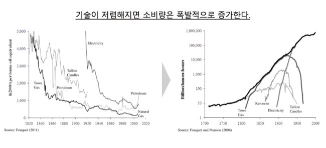
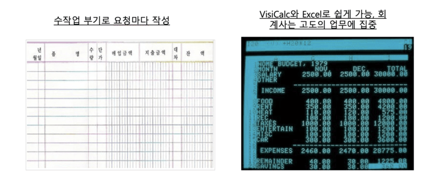
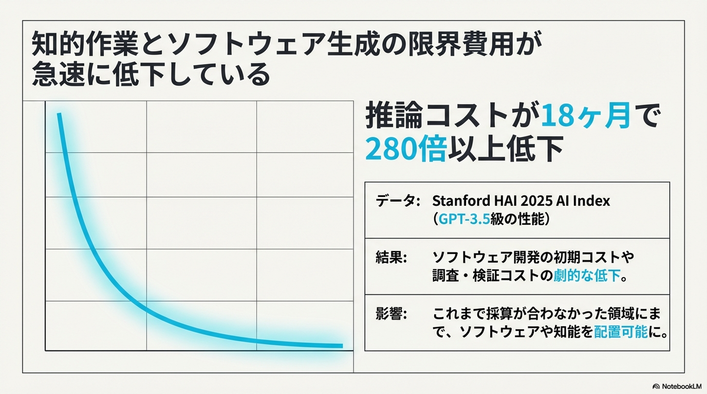
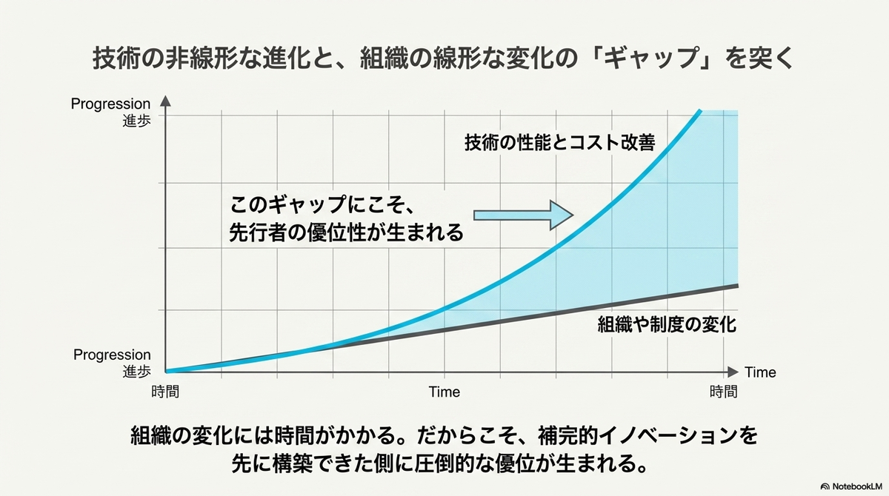
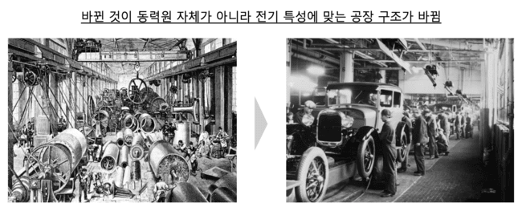
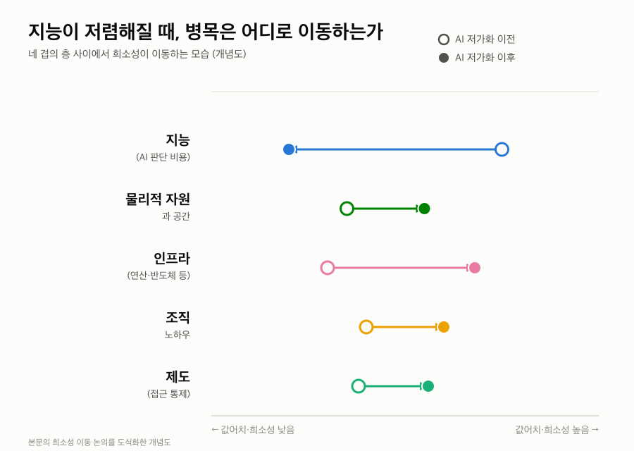

AI 모델에 사업 아이디어를 설명하면 몇 분 안에 기술적 타당성에 대한 1차 판단이 돌아온다. 몇 해 전이라면 엔지니어나 컨설턴트를 붙잡고 며칠을 기다려야 했던 일이다. 이런 변화를 접한 반응은 대체로 두 갈래로 갈린다. 특정 직군의 일이 곧 사라진다는 불안, 그리고 생산성이 몇 배로 뛸 것이라는 낙관이다. 두 반응 모두 저렴해진 기술 하나가 산업 전체를 어떻게 재편하는지에 대한 질문은 건너뛴다.

이 글은 소프트웨어 엔지니어와 딥테크 창업가, 그리고 이 변화가 자신이 속한 산업과 커리어에 어떤 의미인지 판단하려는 독자를 대상으로 한다. 이 글을 읽고 나면 기술이 저렴해질 때 산업이 왜 곧바로 좋아지지 않는지, 경쟁 우위(흔히 해자라고 부르는 것)가 실제로 어디로 옮겨가는지, 그리고 그 이동이 개인의 대응 방향과 공적 영역의 논쟁에 각각 어떤 의미를 갖는지 판단할 수 있다.

## 조명과 표계산으로 보는 저렴해진 기술의 확산 방식

조명의 역사가 좋은 출발점이다. 1830년 무렵에는 촛불로 밤에 아주 적은 빛을 얻으려 해도 노동 약 3시간에 해당하는 비용이 들었다. 1992년에는 같은 양의 빛을 얻는 데 드는 노동 시간이 1초에도 미치지 못했다. 사람들이 이 변화에 대응한 방식은 예전과 똑같은 양의 촛불을 훨씬 싸게 사는 것이 아니었다. 거리와 공장과 상점 진열창까지 빛을 확산시켜, 낮에만 존재하던 경제활동을 밤 시간대로 통째로 옮겨왔다. 조명이 저렴해지자 늘어난 것은 조명 소비량이 아니라 조명이 가능하게 만드는 새로운 활동이었다.

VisiCalc의 등장도 같은 패턴을 따른다. 1970년대까지 복잡한 재무 시나리오를 손으로 재계산하는 일은 소수 전문가의 영역이었다. 계산 하나를 바꿀 때마다 관련된 모든 수치를 다시 손으로 고쳐야 했기 때문이다. 이 반복 작업의 고통에서 출발한 표계산 소프트웨어는 개발에 채 2개월이 걸리지 않았고, 1979년 출시 이후 재무 계산의 비용을 극적으로 낮췄다. 결과는 계산 작업의 단순한 자동화에 그치지 않았다. 계산 비용이 낮아지자 그 계산을 전제로 성립하는 컨설팅과 투자 산업 자체의 진입장벽이 낮아졌고, 이전에는 대형 기업의 재무팀만 감당할 수 있던 시나리오 분석을 소규모 조직도 수행할 수 있게 됐다.

두 사례가 가리키는 결론은 같다. 어떤 기술이 저렴해질 때 나타나는 1차 효과는 기존 활동을 싸게 반복하는 것이지만, 진짜 변화는 그 기술이 이전에는 비용 때문에 아예 존재하지 않았던 영역으로 퍼져나갈 때 일어난다. 경제학에서는 이렇게 효율이 좋아져 단가가 내려갈 때 총 소비량이 오히려 늘어나는 현상을 제본스의 역설(Jevons paradox)이라고 부른다. 1865년 윌리엄 스탠리 제본스가 “증기기관이 연료를 더 효율적으로 쓰게 될수록, 오히려 석탄 총소비량이 늘어난다”는 것을 관찰하며 정리한 개념이다. 효율이 좋아져 단가가 내려가면, 총 사용량이 오히려 늘어나는 현상을 말한다.

## 지금 저렴해지고 있는 것은 무엇인가

표계산이 저렴하게 만든 대상은 계산이라는 좁고 명확한 영역이었다. 지금 AI가 저렴하게 만들고 있는 대상은 그보다 훨씬 넓다. 스탠퍼드 HAI가 발표한 2025 AI Index 보고서는 GPT-3.5급 성능을 내는 추론 비용이 18개월 만에 280배 넘게 하락했다고 밝혔다. 같은 수준의 판단을 얻는 데 드는 비용이 1년 반 사이에 1퍼센트 미만으로 줄어든 셈이다. OpenAI의 샘 올트먼은 2025년 7월 [미국 연방준비제도 콘퍼런스](https://www.federalreserve.gov/mediacenter/files/capital-framework-conference-fireside-chat-transcript.pdf)에서 이런 추세를 두고 지능이 "미터로 잴 필요가 없을 만큼 저렴해진다(전기나 수돗물처럼, 옛날에는 아까워서 계량기로 재고 아껴 쓰던 자원이, 지금은 너무 싸서 쓸 때마다 비용을 따지지 않는 상태가 된다는 뜻)"고 말했다. 지난 5년간 지능 한 단위의 비용을 매년 10배 넘게 낮춰왔고 앞으로 5년도 같은 속도가 이어질 것으로 본다는 근거를 그는 함께 들었다. 이 글에서는 이렇게 AI 판단의 단가가 구조적으로 떨어지는 흐름을 AI 저가화라고 부른다.

이 하락이 만드는 변화는 계산기의 성능이 좋아지는 것과는 다르다. 최신 모델은 기술경제성 분석이나 제조 공정에 대한 1차 원리 추론처럼, 과거에는 해당 분야 전문가를 고용해야만 얻을 수 있던 판단을 상당한 정확도로 내놓는다. 딥테크 창업 초기에 아이디어의 기술적 타당성을 탁상에서 검증하는 데 걸리던 기간이 실행당 90분에서 180분 수준으로 줄었다는 관찰도 있다. 전문가의 며칠짜리 검토가 한나절 안에 끝나는 작업으로 바뀌었다.

표계산이 계산이라는 닫힌 영역 하나를 저렴하게 만들었다면, AI는 여러 전문 영역에 동시에 같은 일을 하고 있다. 지능을 상품화하고, 지능을 사용하는 비용을 거의 0에 가깝게 낮추고 있다. 그 결과 소프트웨어 제작, 시장 검증, 전문 지식 접근, 콘텐츠 생산, 기업 운영의 비용이 급격히 감소하고 있다. 그렇다고 해서 모든 전문 판단이 같은 속도로 저렴해지지는 않는다.

## AI가 잘하는 영역과 못하는 영역

앞서 말한 검증 속도는 모든 종류의 판단에 똑같이 적용되지 않는다. AI는 물리 법칙처럼 닫힌 공급측 영역, 이를테면 특정 소재가 특정 온도에서 어떻게 반응하는지, 어떤 제조 공정이 이론적으로 성립하는지를 판단하는 데는 강하다. 반면 그 제품을 실제로 시장이 사줄 것인지, 규제가 앞으로 어떻게 바뀔 것인지처럼 인간의 선택이 개입하는 수요측 영역에서는 상대적으로 약하다.

| 구분 | AI의 강약 | 근거 | 예시 |
|---|---|---|---|
| 공급측 판단 (물리 법칙 기반) | 강함 | 고정된 법칙이 있어 계산·시뮬레이션으로 답이 수렴 | 소재의 온도별 반응, 제조 공정의 이론적 성립 여부 |
| 수요측 판단 (행위자 기반) | 약함 | 다수 행위자의 선택이 상호작용해 결과를 만듦 | 시장이 실제로 살 것인가, 규제가 앞으로 어떻게 바뀔 것인가 |

이 차이는 우연이 아니라 구조적인 이유에서 나온다. 공급측 문제는 고정된 물리 법칙이라는 근거가 있어 계산과 시뮬레이션으로 답이 수렴한다. 반면 수요는 다수의 행위자가 서로의 선택에 반응하며 만들어내는 결과라서, 아무리 많은 데이터를 넣어도 계산 하나로 환원되지 않는다. 그래서 AI 저가화가 지금 여는 기회는 "이 아이디어가 시장에서 통할 것인가"보다 "이 아이디어가 기술적으로 성립하는가"라는 질문에 먼저 집중된다. 이 구도는 실제 딥테크 현장에서 이미 뚜렷하게 나타난다. Insilico Medicine은 생성형 AI로 타깃 발굴부터 분자 설계까지 수행해, 폐섬유증 치료제 후보 렌토세르티브(rentosertib)를 표적 발굴에서 전임상 후보물질 지정까지 18개월 만에 도달시켰고, 이후 임상 2상까지 진행시켰다. 전통적인 방식 대비 시간과 비용을 크게 줄인 사례다. Recursion Pharmaceuticals도 세포 이미지를 대규모로 생성·분석하는 AI 플랫폼을 통해 약물 발굴 속도를 끌어올리고 있다. 두 회사 모두 AI가 잘하는 "닫힌 공급측 판단"을 극단적으로 활용한 경우다. 반면 그 약이 실제로 시장에서 팔릴지, 규제 당국이 어떻게 반응할지는 여전히 인간 판단과 현장 데이터의 영역으로 남아 있다. 그런데 기술적으로 성립한다는 판단이 빨리 나온다고 해서 그 판단이 곧바로 사업의 가치로 이어지지는 않는다.

## 기술이 저렴해지는 속도와 조직이 바뀌는 속도는 같은가

기술이 저렴해지는 속도와 그 기술을 실제로 활용하는 조직이 바뀌는 속도 사이에는 간극이 있다. 추론 비용은 지수적으로, 즉 비선형적으로 떨어진다. 반면 사람을 채용하고 훈련하고 새로운 판단 도구를 업무 프로세스에 편입시키는 데 걸리는 시간은 선형적으로만 줄어든다. 이 비대칭 때문에 기술의 하락 속도만큼 산업 전체의 생산성은 곧바로 오르지 않는다.

이 간극 속에서 가치는 기술 자체가 아니라 기술을 둘러싼 나머지 요소로 옮겨간다. 판단 결과를 실제 현장에 적용하는 일, 그 판단이 틀렸을 때 책임을 지는 일, 결과물의 품질을 보증하는 일, 규제 기관을 상대로 그 판단의 근거를 설명하는 일이다. 이런 요소는 AI가 판단 하나를 내놓는 속도와 무관하게, 조직이 그 판단을 실제로 소화할 수 있는 속도에 묶여 있다. 그렇다면 이 간극을 메우는 일은 구체적으로 어떤 모습을 띠는가.

## 전기 모터가 알려주는 것

전기 모터의 역사가 이 질문에 답을 준다. 이 간극은 낯선 현상이 아니다. 1980년대 컴퓨터가 사무실 곳곳에 퍼졌을 때도 생산성 통계는 꿈쩍하지 않아, 경제학자 로버트 솔로는 "컴퓨터 시대는 어디서나 보이는데 생산성 통계에서만 보이지 않는다"고 꼬집었다. 전기 모터의 역사는 이 패턴이 컴퓨터보다 훨씬 오래됐다는 것을 보여준다.

경제사학자 폴 데이비드가 정리한 기록을 보면, 1881년 에디슨이 뉴욕과 런던에 발전소를 세우고 전기를 상품으로 팔기 시작한 뒤에도 1900년까지 미국 공장 동력의 5%도 안 되는 부분만 전기 모터에서 나왔다. 공장의 생산성도 40년 가까이 뚜렷하게 오르지 않았다. 증기기관 시절의 공장은 동력원 하나에서 긴 축과 벨트로 동력을 전달해야 했기 때문에, 기계 배치가 동력원의 위치를 중심으로 짜여 있었다. 전기 모터는 기계마다 따로 붙일 수 있는데도 공장은 한동안 옛 배치를 그대로 두고 증기기관 자리에 모터만 바꿔 끼웠다.

실질적인 생산성 향상은 공장이 동력원의 위치가 아니라 작업의 흐름을 중심으로 기계 배치를 다시 설계한 뒤에야 나타났다. 이 재설계를 떠민 것은 기술이 아니라 노동 시장이었다. 전쟁으로 피폐해진 유럽에서 오는 이민을 제한하는 법이 잇달아 만들어지면서 미국 내 노동력이 귀해졌고, 임금이 오르자 공장주들은 값싼 인력을 많이 쓰는 대신 숙련된 소수에게 자율성을 주는 쪽으로 계산을 바꿨다. 이 계산이 바뀌고 나서야 전기 모터가 가능하게 한 유연한 배치가 실제로 채택됐고, 1920년대 미국 제조업 생산성은 이전에도 이후에도 보지 못한 수준으로 뛰어올랐다.

AI도 같은 구조를 반복할 가능성이 크다. 기존 워크플로우 위에 AI를 얹기만 하는 조직은 전기 모터를 증기기관 자리에 바꿔 끼운 공장과 다르지 않다. 실질적인 가치는 워크플로우 자체를 다시 설계하고, 새로운 운영 기준을 세우고, AI가 낸 결과를 검증하는 절차까지 갖췄을 때 나온다. AI 저가화 논의에서는 이렇게 AI에 대한 보완적인 체계를 함께 갖춘 조직을 AI 네이티브 기업이라 부른다. 도구 하나를 잘 쓰는 조직이 아니라, 그 도구를 둘러싼 여러 장치를 함께 설계한 조직이다.

## AI로 인해 검증 비용이 낮아지면서 일어나는 변화

검증 비용의 하락은 해자의 위치만 바꾸는 것이 아니라 누가 그 게임에 참여할 수 있는지도 바꾼다. AI로 인해 기술 타당성 검토가 한나절 안에 끝나는 지금, 해당 분야를 전공하지 않은 창업가도 자신의 아이디어가 물리적으로 성립하는지를 스스로 1차 검증할 수 있다. 과거에는 전문가를 설득해 시간을 얻어야만 넘을 수 있던 문턱이 낮아졌다. 이 변화는 두 갈래로 갈린다. 기존 산업 안에서는 AI가 잘하는 판단 자체보다 그 판단을 소화하는 능력이 새로운 방어선이 되고, 산업 밖에서는 낮아진 문턱을 타고 새로운 참가자와 새로운 사업 영역이 생겨난다.

### 기존 산업의 변화, 가치가 이동하는 곳

같은 검증 비용의 하락이 기존 산업 안에서는 상반된 두 얼굴로 나타난다. 어떤 활동은 폭발적으로 늘어나고, 어떤 자원은 오히려 귀해진다.

#### 풍요 쪽

지적 작업 자체가 거의 공짜에 가까워지면 먼저 눈에 들어오는 쪽은 폭발적으로 늘어나는 활동이다. 과학적 발견, 소프트웨어, 콘텐츠, 개인화된 교육과 의료처럼 전문가의 시간이라는 희소자원에 묶여 있던 활동들이, 그 자원의 값이 떨어지자 한꺼번에 늘어날 수 있다. 이런 흐름을 논자들은 "풍요의 경제학(economics of abundance)"이라 부른다.

코드나 판단 결과 자체를 파는 사업의 방어력이 낮아지는 것도 같은 흐름 위에 있다. AI가 잘하는 공급측 판단은 누구나 비슷한 비용으로 손에 넣을 수 있기 때문이다. Microsoft의 케빈 스콧은 5년 안에 코드의 95%가 AI로 생성될 것이라 내다봤다. 다만 그는 개발자가 사라지는 게 아니라 역할이 바뀐다고 본다. 코드를 직접 작성하는 대신 AI를 지시하고 그 결과를 검증하는 쪽으로 무게중심이 옮겨간다. 생성이 쉬워질수록 검증과 판단이 상대적으로 더 값어치를 갖는다.

#### 희소성 이동

그런데 지능 자체가 풍부해진다고 병목이 사라지지는 않는다. 병목은 사라지지 않고 다른 자리로 옮겨간다는 관측이 많다. 최근 한 경제학 논문은 이 이동을 네 겹의 층으로 정리한다. 물리적 자원과 공간, 에너지·연산·반도체·데이터센터 같은 인프라, 신뢰할 수 있는 조직의 노하우, 그리고 접근을 통제하는 제도다. 지능이라는 층 하나가 저렴해질수록, 나머지 층의 값어치는 오히려 올라간다.

조직이 그 판단을 실제로 소화하는 데 필요한 보완적 요소, 즉 현장 적용과 규제 대응과 물리적 구현은 조직마다 속도가 다르고 쉽게 복제되지 않는다. 실험 설비를 갖추고, 제조 공정을 실제로 운영하고, 규제 기관의 승인을 받고, 안전성을 실측으로 입증하는 일은 여전히 시간과 자본이 필요하다. 그래서 딥테크 스타트업이 새로운 경쟁 우위로 주목받는다.

다만 물리적 구현만이 유일한 답은 아니다. 물리적 구현이 필요 없는 소프트웨어 사업에서는 유통과 채널 접근성이 비슷한 역할을 한다는 시각도 있다. 제품을 만드는 일 자체가 쉬워질수록, 그 제품을 실제 사용자에게 닿게 하는 경로를 이미 쥔 쪽이 유리해지기 때문이다. 소프트웨어 기업은 이미 소프트웨어 도입이 포화 상태라 AI-네이티브화의 여지가 제한적인 반면, 비소프트웨어 기업은 물리·규제·현장의 마찰을 쥐고 있어 AI-네이티브화가 만드는 생산성 향상의 여지가 훨씬 크다.

앞서 본 제본스의 역설을 따르면 이렇게 갈라진 방어선은 오히려 더 조여든다. 검증 비용이 낮아질수록 검증을 시도하는 사람과 그 뒤에 실제로 돌아가는 추론 연산량이 함께 늘어나므로, 인프라 층에 걸리는 수요 압력은 줄지 않고 커진다. 한 층의 희소성이 사라지면 자본은 다음 희소성으로 옮겨간다.

경제학자 에릭 브린욜프슨과 앤드루 맥아피는 기술 혁신이 언제나 풍요와 격차를 함께 늘린다고 짚었다. 상품과 서비스는 더 많아지고 저렴해지지만, 그 혜택을 자본화할 수 있는 쪽과 그렇지 못한 쪽의 격차도 함께 벌어진다. 결국 AI가 풍부하게 만드는 것은 아이디어와 검증 능력이고, 상대적으로 희소해지는 것은 전력과 반도체 같은 인프라, 신뢰할 수 있는 조직 역량, 그리고 접근을 통제하는 규제다. **가치는 검증 자체에서 사라지는 것이 아니라, 검증 이후 현실 세계를 움직일 수 있는 역량으로 이동한다.**

### 신규로 부상하는 산업·역할

낮아진 문턱을 타고 들어오는 신규 진입자를 얕볼 수 없는 이유는 경영학자 클레이튼 크리스텐슨이 파괴적 혁신 이론으로 정리한 패턴에서 찾을 수 있다. 시장에 처음 들어오는 쪽은 대개 기존 강자보다 성능도 완성도도 떨어진다. 하지만 기존 강자가 이미 확보한 우량 고객의 요구에 맞춰 제품을 다듬는 동안, 신규 진입자는 낮아진 검증 비용을 발판으로 빠르게 반복하며 격차를 좁힌다. 방위산업처럼 전문성 장벽이 특히 높던 분야에서 신규 진입자가 늘어나는 지금의 흐름도 이 패턴과 다르지 않다.

소프트웨어 업계는 이미 한 번 비슷한 패턴을 겪었다. 서버 인프라 비용이 거의 0에 가깝게 떨어지자, 웹사이트 하나를 배포하는 데 필요했던 큰 초기 자본이 사라졌고 수십 명 규모의 팀이 기존 통신 산업을 뒤흔드는 메신저 서비스를 만들어냈다. 지금 AI가 지식노동 검증의 초기 문턱을 없애는 것도 같은 구조다. 다만 이번엔 서버 비용이 아니라 판단력 자체가 저렴해진다는 점이 다르다.

데이터센터용 변압기 부족처럼 오랫동안 물리적 병목으로만 여겨지던 문제가 이제는 비전문가 창업가에게도 열린 기회로 재분류되는 이유도 같다. 문제를 풀 수 있는지 판단하는 비용이 낮아졌을 뿐, 문제 자체를 실제로 푸는 데 필요한 물리적 구현의 난이도는 그대로이기 때문이다.

이 과정에서 AI는 새로운 사업 영역을 만드는 동시에 기존 산업의 가치사슬을 재편한다. 대표적인 신규 영역은 AI 검증 플랫폼, AI 기반 연구개발, 로보틱스, 데이터센터 인프라, 추론용 반도체, 전력·냉각 설비처럼 AI 확산 자체를 가능하게 하는 산업이다. 경제학자 W. 브라이언 아서가 기술의 진화를 설명하며 든 조합적 진화 개념을 빌리면, 이런 신규 영역은 허공에서 생기지 않는다. 기존 기술에 AI라는 새 부품을 결합해 만든 조합 기술이고, 이 조합 기술은 다시 다음 조합의 재료가 되어 또 다른 카테고리를 낳는다.

## 전문가는 이 흐름에서 무엇을 준비해야 하는가

앞서 정리한 논리, 즉 해자가 판단 결과 자체에서 그 판단을 소화하는 보완적 역량으로 옮겨간다는 논리는 조직뿐 아니라 개인의 커리어에도 그대로 적용된다. 계산이나 1차 검증처럼 AI가 저렴하게 대체할 수 있는 전문성의 시장가는 낮아지기 쉽다. 반대로 AI가 낸 결과를 검증하고 그 결과에 책임을 지는 판단력, 그리고 그 결과를 실제 운영 환경에 통합하는 역량의 가치는 상대적으로 올라간다.

소프트웨어 엔지니어에게 이 구분은 구체적인 방향을 준다. 코드를 처음부터 작성하는 능력만으로 방어할 수 있는 영역은 줄어드는 경우가 많다. 반면 AI가 생성한 결과물이 실제 시스템 요구사항과 운영 제약을 충족하는지 판단하는 능력, 오류가 났을 때 원인을 추적하고 책임 소재를 가리는 능력, 여러 도구와 팀을 엮어 하나의 시스템으로 통합하는 능력은 AI 저가화의 영향을 상대적으로 덜 받는다. 실제로 개발자가 순수하게 코드를 작성하는 데 쓰는 시간은 원래도 전체 업무의 9~24퍼센트 수준에 지나지 않았다는 조사가 있다. 코드 작성이 이미 업무의 일부일 뿐이라면, AI가 그 일부를 대신 써준다고 해서 판단력의 몫까지 줄어들지는 않는다. GitHub이 Copilot 사용자 93만여 명을 조사한 연구는 이 점을 다른 각도에서 보여준다. AI가 제안한 코드 중 그대로 받아들여진 것은 30%가량에 그쳤고, 나머지는 개발자가 다시 판단해 고치거나 버린 몫이다. 코드 작성 이외의 업무, 즉 설계, 테스트, 디버깅, 이해관계자와의 조율은 애초에 판단력이 필요한 일이었다. 이런 역량은 전기 모터 시대의 공장이 필요로 했던 재설계 능력과 본질적으로 다르지 않다. 도구를 다루는 능력이 아니라 도구를 둘러싼 체계를 설계하는 능력이라는 점에서 그렇다.

다만 이 흐름이 모두에게 같은 방향으로 작동하지는 않는다. 같은 조사에서 AI 코딩 도구의 이점을 가장 크게 누린 쪽은 경력이 적은 개발자들이었는데, 이 결과를 코드 생태계 전체의 품질 문제와 함께 놓고 보면 다른 그림이 드러난다. AI가 만들어내는 코드와 콘텐츠가 늘어날수록 그 결과를 걸러내는 검토 부담은 생성 비용과 달리 줄어들지 않는다는 경고가 있다. 검토되지 않은 저품질 코드가 쌓이면 코드베이스 전체의 신뢰도가 낮아지고, 이 문제는 개인의 절제만으로는 막을 수 없다. 특히 신입 개발자가 AI의 제안을 그대로 받아들이는 데 익숙해진 채로 성장한다면, 스스로 판단하는 근력을 기를 기회 자체가 줄어들 위험이 있다. 코드 생산량은 늘어도 그 코드를 검증할 줄 아는 사람은 오히려 줄어들 수 있다.

결과물이 쏟아질수록, 그 가운데 무엇을 신뢰하고 실행에 옮길지 고르는 일 자체가 새로운 병목이 된다. 결과물을 만들어내는 일이 쉬워질수록, 그 결과가 왜 맞는지 근거를 추적하고 누가 책임질지를 정하고 실제 실행과 결과 측정까지 이어지는 루프를 갖추는 일이 상대적으로 더 큰 값어치를 갖는다.

소프트웨어 엔지니어링을 평생 안정적인 직업으로 당연시할 수 없다는 우려가 나오는 것도 이 때문이다. 다만 이 흐름이 소프트웨어를 만드는 일 자체의 종말을 뜻하지는 않는다. 소프트웨어 개발의 진입장벽이 낮아질 때마다 만들어지는 소프트웨어의 총량은 오히려 늘었다는 관찰처럼, 수요는 공급을 계속 앞지를 가능성이 크다. 관건은 그 수요를 채우는 노동의 성격이 바뀐다는 점이다. 코드 작성 자체의 가치가 낮아지는 흐름을 되돌릴 수는 없으니, 그럴수록 코드 자체가 아니라 코드를 둘러싼 판단력 쪽을 키우는 편이 방어적이다.

## 이 흐름은 공적 영역에 무엇을 요구하는가

앞선 두 절은 조직과 개인이 각자 어떻게 대응해야 하는지를 다뤘다. 같은 질문을 사회 전체로 넓히면, 개인의 선택만으로는 풀리지 않는 문제가 남는다.

### 노동과 불평등

앞서 희소성 이동 절에서 짚은 풍요와 격차의 동시 확대는 조직 간 경쟁 우위 문제였다. 같은 논리를 노동시장으로 옮기면 층위가 다른 격차가 드러난다. AI 저가화로 인지노동의 가치가 구조적으로 낮아지면, 그 영향은 저숙련 일자리에만 머물지 않는다. 계산이나 1차 검증처럼 AI가 대체하기 쉬운 업무를 주로 하던 중숙련 직군, 그리고 일부 고숙련 직군까지 영향권에 들어간다. 반면 그 결과로 만들어지는 소득은 모델과 인프라를 소유한 자본 쪽으로 더 쏠릴 위험이 있다.

OpenAI의 샘 올트먼은 이 이동을 2021년에 쓴 에세이 ["Moore's Law for Everything"](https://moores.samaltman.com/)에서 이미 짚었다. AI가 노동 가격을 밀어내릴수록 힘은 노동에서 자본으로 더 옮겨간다고 썼고, 이를 자본주의가 진보의 대가로 치르는 불평등이라 불렀다. 다만 그가 문제 삼은 것은 불평등의 존재 자체가 아니라 기회의 불균등이었다. 누구나 앞으로 나아갈 공정한 기회를 갖지 못하는 사회는 오래 지속될 수 없다고 그는 본다.

경제학자 에릭 브린욜프슨과 앤드루 맥아피는 이런 국면을 "두 번째 기계 시대"라 부르며, 기계와 경쟁하는 대신 기계와 함께 달리라고 권한다. 경제학자 타일러 코웬은 이 조언을 더 구체적인 그림으로 보여준다. 자유형 체스(freestyle chess) 대회에서는 인간 혼자보다, 기계 혼자보다, 컴퓨터의 판단을 신뢰하고 빠르게 취합하는 인간과 기계의 팀이 가장 좋은 성적을 낸다. 코웬은 이 사례를 근거로, 앞으로의 소득은 평균적인 숙련도로는 방어되지 않고 기계와 얼마나 잘 협업하는지에 달려 있다고 본다. 평균적인 실력이 더 이상 안전판이 되지 못한다는 뜻에서, 그는 이 시대를 "평균은 끝났다"고 요약한다.

### 제도와 정치

샘 올트먼은 부를 두 가지 방식으로 정의할 수 있다고 말한다. 한 사람이 더 많은 돈을 버는 것, 또는 가격이 떨어져 같은 돈으로 더 많이 살 수 있게 되는 것이다. 그는 부를 구매력으로 정의하면 후자가 핵심이라고 본다. 이 정의를 최근 수십 년의 가격 추이에 대입하면 어긋난 지점이 드러난다. TV와 컴퓨터, 통신처럼 기술이 주도한 영역의 가격은 꾸준히 떨어졌지만, 주택과 의료, 교육처럼 사람의 노동과 규제가 짙게 얽힌 영역의 가격은 오히려 올랐다. 올트먼은 이 어긋남의 원인을 노동 비용에서 찾는다. 집을 짓고 환자를 돌보고 학생을 가르치는 일은 여전히 사람의 시간에 크게 의존하고, 다른 산업재의 가격이 떨어지는 동안에도 이 영역의 가격은 노동 비용을 따라 함께 올랐다.

이 글 앞머리에서 본 패턴, 즉 어떤 활동의 비용이 구조적으로 낮아지면 그 활동이 이전에는 비용 때문에 닿지 못했던 영역까지 번진다는 패턴을 올트먼은 이 어긋남에 그대로 대입한다. 로봇이 태양광으로 움직이며 현장에서 채굴하고 가공한 자재로 집을 짓는다면, 그 집을 짓는 비용은 로봇을 빌리는 비용에 가까워진다. 지금 AI가 소프트웨어 개발과 딥테크 검증에서 밀어내리고 있는 판단의 비용이, 로보틱스를 거쳐 물리적 노동에도 같은 방식으로 번질 수 있다. 로보틱스가 소프트웨어만큼 빠르게 저렴해질지는 아직 검증되지 않았지만, 이 전망이 맞다면 AI가 만드는 부의 규모는 소프트웨어 산업 하나에 그치지 않는다. 이만큼의 부가 만들어진다면, 그것을 누가 갖는지는 기술이 아니라 제도의 몫이다.

생산성이 폭증해도 그 생산물을 살 수 있는 소득이 함께 늘지 않으면 문제가 생긴다. 저널리스트 존 캐시디는 이 어긋남을 "AI 풍요의 위험한 역설"이라 짚었다. AI가 만드는 이익이 소수의 빅테크 기업에 집중되는 동안, 일자리와 임금은 오히려 줄어들 수 있다. 생산은 늘지만 그 생산물을 사줄 소득이 줄어드는 구조라면, 풍요 자체가 지속되기 어렵다.

이 어긋남을 소득 재분배가 아니라 자본 재분배로 메워야 한다고 본 사람이 올트먼이다. 노동에서 나오는 소득세만으로는 힘이 자본으로 옮겨가는 흐름을 따라잡을 수 없다고 보고, 소득이 아니라 자본 자체를 과세하자고 제안한다. 그가 구상한 아메리칸 에쿼티 펀드(American Equity Fund)는 두 갈래로 재원을 모은다. 일정 시가총액을 넘는 기업에게 매년 시가총액의 2.5%를 신주 발행으로 걷고, 민간 소유 토지에는 그 가치의 2.5%를 현금으로 매년 걷는다. 이렇게 모은 지분과 현금을 18세 이상 모든 시민에게 매년 배당하는 구조다.

토지에 세금을 매기는 근거는 헨리 조지의 토지가치세 논리를 그대로 따른다. 토지 가치가 오르는 것은 그 땅을 소유한 개인의 노력이 아니라 주변에 도로를 놓고 학교를 세우고 산업을 일군 사회 전체의 작업 때문이므로, 그 가치도 사회와 나누는 것이 공정하다는 논리다. 올트먼은 이 두 세원의 규모도 대략 계산해 뒀다. 현재 미국 기업의 시가총액은 약 50조 달러, 민간 소유 토지 가치는 약 30조 달러다. 이 두 값이 앞으로 10년 안에 각각 두 배로 늘고 세율 인상에 따른 가치 하락을 15%로 잡아도, 올트먼의 추산으로 10년 뒤 미국 성인 2억 5000만 명은 한 사람당 매년 약 1만 3500달러를 받는다. AI가 성장을 실제로 가속하면 이 배당액은 훨씬 커질 수 있다고 그는 덧붙인다. 이 설계에는 스스로를 견제하는 장치도 딸려 있다. 세율의 상한과 하한을 헌법에 못박아 유권자가 투표로 배당액을 끝없이 늘리지 못하게 막고, 미래에 받을 배당을 담보로 잡거나 미리 팔아넘기는 것도 금지한다. 정치적으로 한 번에 도입하기 어려운 세율이므로, 그는 경제 규모가 지금의 1.5배가 될 때까지 단계적으로 목표 세율에 도달하는 방안을 제안한다.

미국 상원의원 버니 샌더스의 제안도 같은 문제의식에서 나왔지만 설계는 다르다. 그는 매출 2억 달러가 넘는 AI 기업의 지분 절반을 공공이 소유하고 이사회에도 공공 대표를 절반 앉히는 국부펀드를 제안했다. AI가 인류가 쌓아온 지식과 노동을 학습 재료로 삼는다면 그 이익도 사회 전체가 나눠 가져야 한다는 논리다. 두 제안은 자본이 가져가는 몫을 사후에 세금으로 걷는 대신 공공이 지분 자체를 쥐어야 한다는 전제를 공유하지만, 과세 대상과 배분 방식은 갈린다.

| 항목 | American Equity Fund (올트먼) | 국부펀드 (샌더스) |
|---|---|---|
| 과세·개입 대상 | 일정 시가총액 이상 기업 전체 + 민간 소유 토지 | 매출 2억 달러 이상 AI 기업 |
| 세율·지분 규모 | 매년 시가총액 2.5% + 토지가치 2.5% | 지분 50% |
| 배분 방식 | 18세 이상 모든 시민에게 현금과 주식 배당 | 정부가 지분 보유, 이사회 절반에 공공 대표 참여 |
| 목표 | 자본 소유를 통한 보편적 배당 | 의사결정권까지 포함한 공공 통제 |

기본소득, 세금 체계 개편, 교육 재설계 같은 논의도 같은 문제의식에서 나온다. 어느 안이 맞는지는 아직 합의되지 않았지만, 생산성과 소득이 갈라지는 흐름을 그대로 두면 안 된다는 인식만은 여러 논의에서 공통적으로 나타난다.

이 글은 조명과 표계산에서 시작해 AI 저가화가 조직, 개인, 사회라는 세 층위에 각기 다른 압력을 가하는 과정을 따라왔다. 세 층위에서 반복되는 것은 저렴해진 판단력 자체가 아니라, 그 판단력을 누가 소화하고 그 대가를 누가 가져가느냐는 질문이다. 조직은 검증 이후의 역량을 갖췄는지에 따라 해자가 갈리고, 개인은 판단력을 키웠는지에 따라 소득이 갈리며, 사회는 그 이익을 재분배할 제도를 갖췄는지에 따라 풍요가 소수에게만 머물지 여부가 갈린다.

## 참조 사이트

- [Artificial Intelligence Index Report 2025](https://hai.stanford.edu/assets/files/hai_ai_index_report_2025.pdf)
- [제본스의 역설](https://ko.wikipedia.org/wiki/%EC%A0%9C%EB%B3%B8%EC%8A%A4%EC%9D%98_%EC%97%AD%EC%84%A4)
- [Transcript of Integrated Review of the Capital Framework for Large Banks Conference: Fireside Chat with Sam Altman (2025.7.22, 연방준비제도 공식 트랜스크립트)](https://www.federalreserve.gov/mediacenter/files/capital-framework-conference-fireside-chat-transcript.pdf)
- ['Intelligence too cheap to meter' is AI's next frontier, Sam Altman says](https://finance.yahoo.com/news/intelligence-too-cheap-meter-ai-175951065.html)
- [The Dynamo, the Computer, and ChatGPT: Explaining Today's Productivity Paradox](https://www.aei.org/articles/the-dynamo-the-computer-and-chatgpt-explaining-todays-productivity-paradox/)
- [The Dynamo and the Computer: An Historical Perspective on the Modern Productivity Paradox](https://gwern.net/doc/economics/automation/1989-david.pdf)
- [Why didn't electricity immediately change manufacturing?](https://www.bbc.com/news/business-40673694)
- [Case Study: Insilico's Transformation](https://insilico.com/casestudy)
- [INS018_055 Phase IIa Results: First AI-Designed Drug](https://intuitionlabs.ai/articles/ins018-055-phase-2a-results-ai-designed-drug)
- [Recursion OS: The AI platform to industrialize drug discovery](https://www.recursion.com/platform)
- [AI시대 경제적 해자(Moat)에 대해서](https://medium.com/pgd-ai/ai%EC%8B%9C%EB%8C%80-%EA%B2%BD%EC%A0%9C%EC%A0%81-%ED%95%B4%EC%9E%90-moat-%EC%97%90-%EB%8C%80%ED%95%B4%EC%84%9C-2f48c2bced90)
- [경쟁 해자: AI가 복제 비용을 0으로 만들 때, 방어 가능한 비즈니스를 만드는 법](https://indiefounders.net/insight/moat/)
- [When Intelligence Gets Cheap, Distribution Becomes the Moat](https://glasp.co/hatch/85adO3bPP8hXyTFhVRsrhw7MWPF3/p/PtUwESOQhH8Ta55PQ5mH)
- [The Abundance Shock](https://marketview.vmfresearch.com/p/the-abundance-shock)
- [Artificial Intelligence and the Economics of Abundance](https://medium.com/intuitionmachine/artificial-intelligence-and-the-economics-of-abundance-92bd1626ee94)
- [Scarcity in an Age of AI Abundance](https://papers.ssrn.com/sol3/papers.cfm?abstract_id=6639022)
- [95% of Code Will Be AI-Generated Within Five Years, Microsoft CTO Says](https://developers.slashdot.org/story/25/04/02/1611229/95-of-code-will-be-ai-generated-within-five-years-microsoft-cto-says)
- [Software Eats Software Development](https://cdixon.org/2014/04/13/software-eats-software-development/)
- [The Innovator's Dilemma](https://en.wikipedia.org/wiki/The_Innovator%27s_Dilemma)
- [The Nature of Technology: What It Is and How It Evolves](https://www.simonandschuster.com/books/The-Nature-of-Technology/W-Brian-Arthur/9781416544067)
- [The Second Machine Age: Work, Progress, and Prosperity in a Time of Brilliant Technologies](https://www.goodreads.com/book/show/23316526-the-second-machine-age)
- [What Software Engineers Will do When AI Writes All the Code](https://time.com/charter/7383276/what-software-engineers-will-do-when-ai-writes-all-the-code/)
- [Software engineering may no longer be a lifetime career](https://www.seangoedecke.com/software-engineering-may-no-longer-be-a-lifetime-career/)
- [Sea Change in Software Development: Economic and Productivity Analysis of the AI-Powered Developer Lifecycle](https://arxiv.org/abs/2306.15033)
- [The Cheap Insight Paradox](https://www.enterprisemartech.com/articles/the-cheap-insight-paradox)
- [AI Slop and the Software Commons](https://arxiv.org/abs/2604.16754)
- [Average Is Over: Power, Poverty, and the Coming Middle-Class Squeeze](https://en.wikipedia.org/wiki/Average_Is_Over)
- [AI가 만드는 부와 권력을 누구에게 돌려줄 것인가, 버니 샌더스의 제안](https://www.mimul.com/blog/tech-digest-july-2026/)
- [The Dangerous Paradox of A.I. Abundance](https://www.newyorker.com/news/the-financial-page/the-dangerous-paradox-of-ai-abundance)
- [Moore's Law for Everything](https://moores.samaltman.com/)
- [Georgism (헨리 조지의 토지가치세)](https://en.wikipedia.org/wiki/Georgism)
