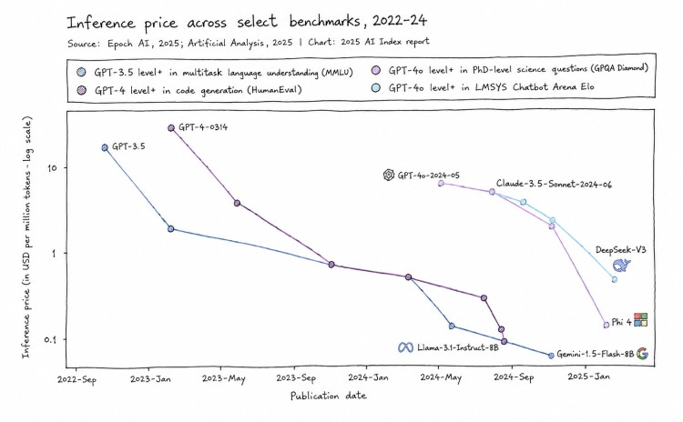
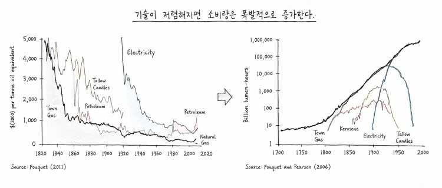
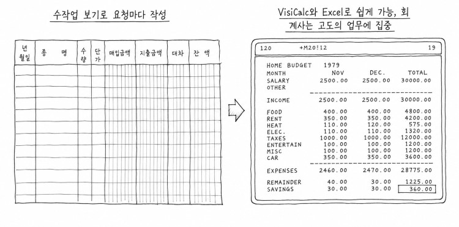
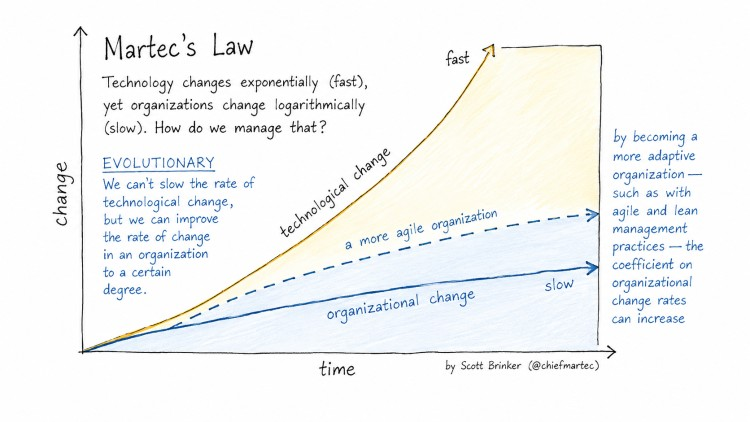
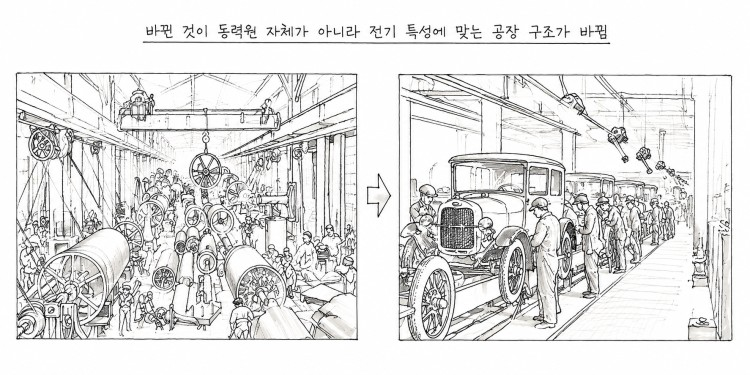
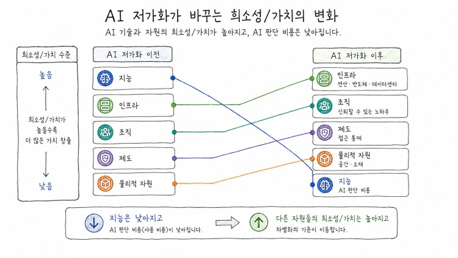

AI가 지능의 비용을 빠르게 낮추고 있습니다. 지능이 풍부해지는 시대에는 무엇이 희소해지고, 산업의 경쟁 우위는 어디로 이동할까요? 이 글에서는 AI 저가화가 산업과 조직, 개인에게 가져올 변화와 그 과정에서 새롭게 만들어지는 기회를 살펴보겠습니다.

## 서론, 지능이 저렴해지면 무엇이 바뀌는가

AI 모델에 사업 아이디어를 설명하면 몇 분 안에 기술적 타당성에 대한 1차 판단이 돌아온다. 몇 해 전이라면 엔지니어나 컨설턴트를 붙잡고 며칠을 기다려야 했던 일이다. 전문가의 시간을 사는 데 들던 비용이 며칠에서 몇 분으로 줄어든 셈이다. 이런 변화를 접한 반응은 대체로 두 갈래로 갈린다. 특정 직군의 일이 곧 사라진다는 불안, 그리고 생산성이 몇 배로 뛸 것이라는 낙관이다.

이 변화의 속도를 보여주는 지표가 있다. 스탠퍼드 HAI의 [2025 AI Index](https://hai.stanford.edu/assets/files/hai_ai_index_report_2025.pdf)는 MMLU에서 GPT-3.5와 비슷한 성능을 내는 시스템의 추론 비용이 2022년 11월부터 2024년 10월까지 약 18개월 동안 280배 이상 하락한 것이다. 이는 AI가 단순히 더 똑똑해지고 있다는 것을 넘어, 일정 수준의 AI 능력을 사용하는 비용 자체가 빠르게 낮아지고 있음을 보여준다.

OpenAI의 샘 올트먼은 2025년 7월 [미국 연방준비제도 콘퍼런스](https://www.federalreserve.gov/mediacenter/files/capital-framework-conference-fireside-chat-transcript.pdf)에서 이런 추세를 두고 지능이 "미터로 잴 필요가 없을 만큼 저렴해진다(전기나 수돗물처럼, 옛날에는 아까워서 계량기로 재고 아껴 쓰던 자원이, 지금은 너무 싸서 쓸 때마다 비용을 따지지 않는 상태가 된다는 뜻)"고 말했다.

## 제1부 지능이 저렴해지는 세상

### 조명과 Apple II용 스프레드시트 프로그램(VisiCalc)이 보여주는 확산 패턴

조명의 역사는 가격이 급락할 때 사람들이 기존 활동을 더 싸게 반복하는 데 그치지 않고, 비용 때문에 억눌려 있던 활동의 범위 자체를 넓히는 방향으로 반응한다는 것을 보여주는 사례다. 조명의 가격을 노동시간으로 환산하면 변화의 크기가 더 선명해진다. Nordhaus의 계산에서는 1830년 1,000루멘·시간의 빛을 얻는 데 약 3시간의 노동이 필요했지만, 1992년에는 형광등 기준으로 1초보다 훨씬 짧은 노동시간이면 같은 양의 빛을 살 수 있었다. 사람들이 이 변화에 대응한 방식은 예전과 똑같은 양의 촛불을 훨씬 싸게 사는 것이 아니었다. 값싼 인공조명은 거리와 공장, 상점 같은 공간에서 밤에도 활동할 수 있는 조건을 만들었다. 조명이 단순히 기존의 빛을 싸게 공급한 것이 아니라, 이전에는 비용 때문에 제한됐던 활동의 범위를 넓힌 것이다. 조명이 저렴해지자 늘어난 것은 조명 소비량이 아니라 조명이 가능하게 만드는 새로운 활동이었다.

Apple II용 스프레드시트 프로그램 VisiCalc의 등장도 같은 패턴을 따른다. 1970년대까지 복잡한 재무 처리를 손으로 재계산하는 일은 소수 전문가의 영역이었다. 계산 하나를 바꿀 때마다 관련된 모든 수치를 다시 손으로 고쳐야 했기 때문이다. 이 반복 작업의 고통에서 출발한 VisiCalc는 Dan Bricklin과 Bob Frankston이 1978~79년 겨울 약 두 달 동안 개발했다. 1979년 공개된 이 전자표계산(스프레드시트)은 셀 하나를 바꾸면 연관된 계산 결과가 다시 계산되는 방식을 개인용 컴퓨터에서 구현하면서, what-if 분석(만약 특정 조건이 바뀐다면 결과가 어떻게 달라지는가?)의 비용을 크게 낮췄다. 계산 비용이 낮아지자 이전에는 전문 재무팀이나 대형 컴퓨터 시스템에 의존하던 시나리오 분석을 더 작은 조직과 개인도 시도할 수 있게 됐다. 중요한 변화는 계산 자체가 빨라진 것이 아니라, 계산을 전제로 하던 의사결정의 참여 비용까지 낮아졌다는 점이다.

두 사례가 가리키는 공통점은 비용 하락이 기존 활동의 단가만 낮추는 데 그치지 않고 수요와 활용 범위를 넓힐 수 있다는 점이다. 에너지 효율 향상으로 사용량이 폭발적으로 늘어날 수 있다는 현상을 [제본스의 역설](https://ko.wikipedia.org/wiki/%EC%A0%9C%EB%B3%B8%EC%8A%A4%EC%9D%98_%EC%97%AD%EC%84%A4)이라고 부르는데, 조명 사례는 이보다 넓은 '가격 하락에 따른 수요 확장'의 사례로 볼 수 있다. AI에서도 같은 일이 일어날지는 분야별 수요 탄력성과 새로운 사용처의 등장에 달려 있다.

### AI 저가화의 규모와 속도

전자표계산(스프레드시트)이 저렴하게 만든 대상은 계산이라는 좁고 명확한 영역이었다. 지금 AI가 저렴하게 만들고 있는 대상은 그보다 훨씬 넓다. 앞서 본 추론 비용 하락은 우연한 숫자가 아니라 구조적인 추세다. 올트먼은 지난 5년간 지능 한 단위의 비용을 매년 10배 넘게 낮춰왔고 앞으로 5년도 같은 속도가 이어질 것으로 보고 있다. 

이 하락이 만드는 변화는 서버의 성능이 좋아지는 것과는 다르다. 최신 모델은 기술 경제성 분석이나 제조 공정에 대한 1차 원리 추론(기존 사례를 참고하는 대신 물리 법칙 같은 근본 원리에서부터 논리적으로 답을 도출하는 방식)처럼, 과거에는 해당 분야 전문가를 고용해야만 얻을 수 있던 판단을 상당한 정확도로 내놓는다. 딥테크 창업 초기에 아이디어의 기술적 타당성을 탁상에서 검증하는 데 걸리던 기간이, 전문가의 며칠짜리 검토에서 시간 단위로 줄었다는 보고도 있다.

AI는 지능을 서비스처럼 사용할 수 있게 만들고, 특정 종류의 판단을 사용하는 비용을 빠르게 낮추고 있다. 그 결과 소프트웨어 제작, 시장 검증, 전문 지식 접근, 콘텐츠 생산, 기업 운영의 비용이 급격히 감소하고 있다. 그렇다고 해서 모든 전문 판단이 같은 속도로 저렴해지지는 않는다.

### AI가 잘하는 영역과 못하는 영역

AI의 강점은 답을 검증할 수 있는 제약이 비교적 명확한 문제, 즉 닫힌 문제에서 특히 잘 드러난다. 반대로 결과가 여러 행위자의 전략적 선택, 제도 변화, 현장 맥락에 따라 달라지는 열린 문제, 즉 정답을 미리 단정할 수 없는 문제에서는 아직 부족한 부분이 있다.

| 구분 | AI가 상대적으로 강한 문제 | AI만으로 결정하기 어려운 문제 |
|---|---|---|
| 특징 | 제약과 평가 기준이 비교적 명확함 | 행위자·제도·맥락의 상호작용이 큼 |
| 예시 | 소재의 물성 추정, 제조 공정의 시뮬레이션, 코드 생성 | 시장 수요, 규제 변화, 조직의 행동 변화 |
| 핵심 병목 | 계산·탐색·검증 비용 | 현장 데이터, 책임, 이해관계 조정 |

이 차이는 우연이 아니라 구조적인 이유다. 닫힌 문제, 즉 아이디어가 물리적으로 성립하는지 판단하는 일은 물리 법칙이라는 고정된 근거가 있어서 계산과 시뮬레이션으로 답을 찾을 수 있다. 반면 열린 문제, 즉 그 아이디어가 시장에서 통할지 판단하는 일은 수많은 사람이 서로의 선택에 반응하며 만들어내는 결과라서, 데이터를 아무리 넣어도 하나의 결과로 도출되지 않는다. 그래서 AI 저가화가 만들 수 있는 기회는 "이 아이디어가 시장에서 통할 것인가"보다 "이 아이디어가 기술적으로 성립하는가"라는 질문에 먼저 집중된다. 이 구도는 실제 딥테크 현장에서 이미 뚜렷하게 나타난다. [Insilico Medicine](https://insilico.com/casestudy)은 생성형 AI로 타깃 발굴부터 분자 설계까지 수행해, 폐섬유증 치료제 후보 렌토세르티브(rentosertib)를 표적 발굴에서 전임상 후보물질 지정까지 18개월 만에 도달시켰고, 이후 [임상 2상까지 진행시켰다](https://intuitionlabs.ai/articles/ins018-055-phase-2a-results-ai-designed-drug). 전통적인 방식 대비 시간과 비용을 크게 줄인 사례다. [Recursion Pharmaceuticals](https://www.recursion.com/platform)도 세포 이미지를 대규모로 생성·분석하는 AI 플랫폼을 통해 약물 발굴 속도를 끌어올리고 있다. 두 회사 모두 AI가 잘하는 "닫힌 판단"(시장 반응과 무관하게 물리 법칙만으로 답이 정해져 계산과 시뮬레이션으로 검증되는 판단, 정답의 범위가 미리 한정되어 있는)을 극단적으로 활용한 경우다. 반면 그 약이 실제로 시장에서 팔릴지, 규제 당국이 어떻게 반응할지는 여전히 인간 판단과 현장 데이터의 영역으로 남아 있다. 그런데 기술적으로 성립한다는 판단이 빨리 나온다고 해서 그 판단이 곧바로 사업의 가치로 이어지지는 않는다.

### 기술과 조직이 바뀌는 속도는 같은가?

기술이 저렴해지는 속도와 그 기술을 실제로 활용하는 조직이 바뀌는 속도 사이에는 간극이 있다. AI의 추론 비용은 최근 몇 년 사이 매우 빠르게, 일부 지표에서는 지수적(비선형적)으로 하락했다. 반면 사람을 채용·훈련하고 업무 프로세스와 책임 구조를 바꾸는 일은 기술 비용처럼 즉시 줄어들기가 어렵다. 두 변화는 같은 속도로 움직이지 않는다. 이 비대칭 때문에 기술의 하락 속도만큼 산업 전체의 생산성은 곧바로 오르지 않는다.

[전기 모터의 역사](https://www.aei.org/articles/the-dynamo-the-computer-and-chatgpt-explaining-todays-productivity-paradox/)가 이 간극이 어떻게 메워지는지 보여준다. [경제사학자 폴 데이비드가 정리한 기록](https://gwern.net/doc/economics/automation/1989-david.pdf)을 보면, 1882년 에디슨이 뉴욕과 런던에 발전소를 세우고 전기를 상품으로 팔기 시작한 뒤에도 1900년까지 미국 공장 동력의 5%도 안 되는 부분만 전기 모터에서 나왔다. 공장의 생산성도 40년 가까이 뚜렷하게 오르지 않았다. 증기기관 시절의 공장은 동력원 하나에서 긴 축과 벨트로 동력을 전달해야 했기 때문에, 기계 배치가 동력원의 위치를 중심으로 짜여 있었다. 전기 모터는 기계마다 따로 붙일 수 있는데도 공장은 한동안 옛 배치를 그대로 두고 증기기관 자리에 모터만 바꿔 끼웠다.

실질적인 생산성 향상은 공장이 동력원의 위치가 아니라 작업의 흐름을 중심으로 기계 배치를 다시 설계한 뒤에야 나타났다. 이 재설계를 하게끔 만든 것은 기술이 아니라 노동 시장이었다. 전쟁으로 피폐해진 유럽에서 오는 이민을 제한하는 법이 잇달아 만들어지면서 미국 내 노동력이 귀해졌고, 임금이 오르자 공장주들은 값싼 인력을 많이 쓰는 대신 숙련된 소수에게 자율성을 주는 쪽으로 생각을 바꿨다. 이 생각이 바뀌고 나서야 전기 모터가 가능하게 한 유연한 배치가 실제로 채택됐고, [1920년대 미국 제조업 생산성은 이전에도 이후에도 보지 못한 수준으로 향상되었다](https://www.bbc.com/news/business-40673694).

AI도 같은 구조를 반복할 가능성이 크다. 기존 워크플로우 위에 AI를 얹기만 하는 조직은 전기 모터를 증기기관 자리에 바꿔 끼운 공장과 다르지 않다.

## 제2부 가치와 해자는 어디로 이동하는가

### 해자의 이동

이 간극 속에서 가치는 기술 자체가 아니라 기술을 둘러싼 나머지 요소로 옮겨간다. 판단 결과를 실제 현장에 적용하는 일, 그 판단이 틀렸을 때 책임을 지는 일, 결과물의 품질을 보증하는 일, 규제 기관을 상대로 그 판단의 근거를 설명하는 일이다. 이런 요소는 AI가 판단 하나를 내놓는 속도와 무관하게, 조직이 그 판단을 실제로 소화할 수 있는 속도에 묶여 있다.

검증 비용의 하락은 해자의 위치만 바꾸는 것이 아니라 누가 그 게임에 참여할 수 있는지도 바꾼다. AI로 인해 기술 타당성 검토가 한나절 안에 끝나는 지금, 해당 분야를 전공하지 않은 창업가도 자신의 아이디어가 물리적으로 성립하는지를 스스로 1차 검증할 수 있다. 과거에는 전문가를 설득해 시간을 얻어야만 넘을 수 있던 문턱이 낮아졌다. 이 변화는 두 갈래로 갈린다. 기존 산업 안에서는 AI가 잘하는 판단 자체보다 그 판단을 소화하는 능력이 새로운 경쟁 우위가 되고, 산업 밖에서는 낮아진 문턱을 타고 새로운 참가자와 새로운 사업 영역이 생겨난다.

같은 검증 비용의 하락이 기존 산업 안에서는 상반된 두 얼굴로 나타난다. 어떤 활동은 폭발적으로 늘어나고, 어떤 자원은 오히려 귀해진다.

지적 작업 자체가 거의 공짜에 가까워지면 먼저 눈에 들어오는 쪽은 폭발적으로 늘어나는 활동이다. 앞서 조명의 역사에서 본 제본스의 역설이 여기서도 그대로 나타난다. 과학적 발견, 소프트웨어, 콘텐츠, 개인화된 교육과 의료처럼 전문가의 시간이라는 희소자원에 묶여 있던 활동들이, 그 자원(전문가 시간을 사는 비용)의 값이 떨어지자 한꺼번에 늘어날 수 있다.

코드나 판단 결과 자체를 파는 사업의 경쟁 우위가 낮아지는 것도 같은 흐름 위에 있다. AI가 잘하는 닫힌 판단은 누구나 비슷한 비용으로 손에 넣을 수 있기 때문이다. Microsoft의 케빈 스콧은 5년 안에 [코드의 95%가 AI로 생성될 것이라 내다봤다](https://www.moneycontrol.com/technology/95-of-coding-will-be-ai-generated-microsoft-cto-kevin-scott-makes-bold-predictions-about-coding-jobs-article-12982772.html). 다만 그는 개발자가 사라지는 게 아니라 역할이 바뀐다고 본다. 코드를 직접 작성하는 대신 AI를 지시하고 그 결과를 검증하는 쪽으로 무게중심이 옮겨간다. 생성이 쉬워질수록 검증과 판단이 상대적으로 더 값어치를 갖는다.

### 희소성의 이동, 다섯 개의 층(Layer)

그런데 지능 자체가 풍부해진다고 병목이 사라지지는 않는다. 병목은 사라지지 않고 다른 자리로 옮겨간다고 보는 사람들이 많다. [Scarcity in an Age of AI Abundance](https://papers.ssrn.com/sol3/papers.cfm?abstract_id=6639022)에서는 이 이동을 다섯 개의 층(Layer)으로 정리한다. 물리적 자원과 공간, 에너지·연산·반도체·데이터센터 같은 인프라, 신뢰할 수 있는 조직의 노하우, 접근을 통제하는 제도, 그리고 집행 능력과 보안을 제공하는 관할권(사법권)이다. 지능이라는 층 하나가 저렴해질수록, 나머지 층의 값어치는 오히려 올라간다.

실제로 이 다섯 층에서는 최근 대규모 투자를 유치한 기업들이 뚜렷하게 갈린다.

| 층 | 대표 기업 | 무엇을 장악하는가 | 투자 이력 |
|---|---|---|---|
| 1. 물리적 자원·공간 | Axiom Space | 궤도 공간 선점 | [2026년 2월 $350M(누적 $525M+)](https://spacenews.com/axiom-space-raises-additional-350-million/) |
| | Varda Space | 궤도 제조·재진입 인프라 | [2024년 4월 $90M Series B](https://spacenews.com/varda-space-industries-raises-90-million/) |
| | Figure AI | 로봇이라는 물리적 실행 수단 | [2024년 2월 $675M Series B](https://www.prnewswire.com/news-releases/figure-raises-675m-at-2-6b-valuation-and-signs-collaboration-agreement-with-openai-302074897.html) |
| 2. 에너지·연산·반도체·데이터센터 | Crusoe | 전력과 컴퓨트를 결합한 데이터센터 | [2025년 10월 $1.375B Series E](https://www.crusoe.ai/resources/newsroom/crusoe-announces-series-e-funding) |
| | Lambda | GPU 클라우드·AI 팩토리 | [2025년 11월 $1.5B+ Series E](https://lambda.ai/blog/lambda-raises-over-1.5b-from-twg-global-usit-to-build-superintelligence-cloud-infrastructure) |
| | Celestial AI | AI 데이터센터용 광인터커넥트 | [2025년 3~5월 $250M+$255M(Series C1)](https://www.businesswire.com/news/home/20250310333743/en/Celestial-AI-Secures-%24250-Million-Funding-to-Revolutionize-AI-Infrastructure-with-Its-Photonic-Fabric) |
| | Etched | 추론 전용 반도체 | [2026년 7~8월 $300M→$700M 연쇄 라운드](https://www.globenewswire.com/news-release/2026/08/18/3347095/0/en/etched-raises-700m-at-a-21b-valuation-and-completes-first-customer-delivery-to-jane-street.html) |
| 3. 신뢰할 수 있는 조직의 노하우 | Harvey | 법률 전문 지식 | [2026년 3월 $200M($11B 밸류)](https://www.cnbc.com/2026/03/25/legal-ai-startup-harvey-raises-200-million-at-11-billion-valuation.html) → [8월 $500M 추가($15.5B 밸류)](https://siliconangle.com/2026/08/07/legal-ai-startup-harvey-reportedly-raising-500m-15-5b-valuation/) |
| | EvenUp | 상해소송 데이터·노하우 | [2025년 10월 $150M Series E](https://www.businesswire.com/news/home/20251007138957/en/EvenUp-Raises-%24150M-Series-E-at-%242B-Valuation-to-Redefine-Personal-Injury-Law-and-Level-the-Playing-Field-for-Injury-Victims) |
| | Abridge | 임상 문서화 노하우 | [2025년 6월 $300M Series E](https://www.abridge.com/blog/series-e) |
| 4. 접근을 통제하는 제도 | Norm Ai | 규제를 실행 규칙으로 자동 변환 | [2026년 7월 $120M Series C](https://techcrunch.com/2026/07/07/ai-law-startup-norm-raises-120m-hits-unicorn-valuation/) |
| | Alloy | 금융기관 신원·리스크 판단 | [2022년 9월 $52M Series C 연장](https://techcrunch.com/2022/09/01/fintech-alloy-fight-fraud/) |
| 5. 관할권·집행·보안 | Anchorage Digital | 미국 연방은행 인가(charter) | [2021년 12월 $350M Series D](https://www.anchorage.com/insights/anchorage-digital-raises-350-million-series-d-funding-led-by-kkr) |
| | Paxos | 규제된 금융 인프라 | [2021년 4월 $300M Series D](https://www.paxos.com/newsroom/paxos-raises-300-million-in-series-d-funding-at-2-4-billion-valuation) |
| | Circle | 스테이블코인 규제 지위 | [2025년 6월 IPO](https://www.coindesk.com/markets/2025/06/04/circle-debuts-on-nyse-at-31-per-share-valuing-stablecoin-issuer-at-62-billion) + [2026년 7월 NYDFS 신탁 charter](https://www.crowdfundinsider.com/2026/08/294581-circle-secures-limited-purpose-trust-charter-from-new-york-department-of-financial-services-nydfs/) |

층마다 쏠리는 자본의 규모 자체가, 지능이 저렴해질수록 나머지 층이 오히려 값비싸진다는 앞의 주장을 뒷받침한다.

조직이 그 판단을 실제로 소화하는 데 필요한 보완적 요소, 즉 현장 적용과 규제 대응과 물리적 구현은 조직마다 속도가 다르고 쉽게 복제되지 않는다. 실험 설비를 갖추고, 제조 공정을 실제로 운영하고, 규제 기관의 승인을 받고, 안전성을 실측으로 입증하는 일은 여전히 시간과 자본이 필요하다. 그래서 딥테크 스타트업이 새로운 경쟁 우위로 주목받는다.

다만 물리적 구현만이 유일한 답은 아니다. 물리적 구현이 필요 없는 소프트웨어 사업에서는 유통과 채널 접근성이 비슷한 역할을 한다는 시각도 있다. 제품을 만드는 일 자체가 쉬워질수록, 그 제품을 실제 사용자에게 닿게 하는 경로를 이미 쥔 쪽이 유리해지기 때문이다. 소프트웨어 기업은 이미 소프트웨어 도입이 포화 상태라 AI를 새로 들여와 얻을 수 있는 개선 여지가 제한적인 반면, 비소프트웨어 기업은 물리·규제·현장의 마찰이 아직 해소되지 않은 채 많이 남아 있어, 그 마찰을 AI로 풀어낼 때 얻는 생산성 향상의 여지가 훨씬 크다.

AI 무기를 장착한 비소프트웨어 기업(딥테크·제조·의료 등)이나 소프트웨어 기업들은 시간이 지날수록 폭발적으로 늘어날 것이다. 그렇게 되면 지능(판단) 비용이 싸짐으로 인해 그 지능을 검증해 보려는 사람의 수와, 검증 하나 하나를 실제로 돌리는 데 드는 추론 연산량이 함께 늘어난다. 그래서 지능(판단) 자체는 싸졌어도 그 판단을 실행에 옮기는 인프라 층에 걸리는 수요 압력은 줄지 않고 오히려 커진다. 한 층의 희소성이 사라지면 자본은 다음 희소성, 즉 인프라와 물리적 구현 쪽(인프라 포함)으로 옮겨간다.

경제학자 에릭 브린욜프슨과 앤드루 맥아피는 기술 혁신이 언제나 풍요와 격차를 함께 늘린다고 짚었다. 상품과 서비스는 더 많아지고 저렴해지지만, 그 혜택을 자본화할 수 있는 쪽과 그렇지 못한 쪽의 격차도 함께 벌어진다. 결국 AI가 풍부하게 만드는 것은 아이디어와 검증 능력이고, 상대적으로 희소해지는 것은 앞서 본 다섯 개 층이다. **가치는 검증 자체에서 사라지는 것이 아니라, 검증 이후 현실 세계를 움직일 수 있는 역량으로 이동한다.**

### 보완적 혁신

앞서 본 전기 모터 사례가 보여주듯, 전기나 컴퓨터처럼 한 사회의 여러 산업에 두루 쓰이는 기술인 [범용기술](https://www.aei.org/articles/the-dynamo-the-computer-and-chatgpt-explaining-todays-productivity-paradox/)은 발명 그 자체가 아니라 그 발명을 뒷받침하는 보완적 혁신, 즉 조직 재설계와 인력 재배치, 자산 재배치, 거버넌스에서 실제 가치를 만들어낸다. AI도 같은 구조를 따른다. 누구나 같은 모델에 접근할 수 있지만, 프롬프트와 워크플로우를 어떻게 설계하고 어떤 업무에 어떤 품질 기준으로 적용하는지에 따라 실제 성과는 크게 갈린다. 앞서 본 다섯 개 층에 대한 투자 표는 자본이 보완 자산 쪽으로 몰린다는 사실을 보여줄 뿐, 개별 기업이 그 자산을 실제 해자로 바꾸는 과정까지는 보여주지 않는다. 아래 세 기업은 처음부터 AI와 보완 자산을 한 몸으로 설계해 태어나, 그 과정을 구체적으로 보여준다.

Palmer Luckey가 세운 방위산업체 [Anduril](https://www.top1markets.com/news/anduril-industries-2026-valuation-contracts-lattice-ai)이 좋은 사례다. Lattice OS라는 AI 타겟팅·지휘통제 소프트웨어 자체는 다른 방산업체도 뒤쫓을 수 있는 영역이지만, Anduril의 해자는 그 소프트웨어를 실제 무기로 구현하는 물리적 생산력과 정부 조달 관계에 있다. 2026년 3월 미 육군과 최대 20억 달러 규모의 10년 전사 계약을 맺어 기존 120개 넘는 조달 체계를 Lattice 하나로 통합시켰고, 오하이오에는 500만 제곱피트(약 46만 5000㎡) 규모의 무기 제조 시설 Arsenal-1을 짓고 있다. 이런 물리적 생산력과 조달 관계는 투자자 평가에도 그대로 반영됐다. [밸류에이션은 2025년 6월 305억 달러에서 2026년 5월 610억 달러로 일 년 만에 두 배로 뛰었다](https://www.cnbc.com/2026/05/13/anduril-valuation-defense-tech-funding-boom.html). 물리적 자원과 관할권이라는 두 층을 한 회사가 동시에 쥔 사례다.

자율주행 검증 소프트웨어를 만드는 [Applied Intuition](https://siliconangle.com/2025/06/17/vehicle-intelligence-startup-applied-intuition-raises-600m-15b-valuation/)은 조직의 노하우 층을 해자로 삼는다. 이 회사의 시뮬레이션은 AI가 물리 법칙에 따라 가상 주행을 계산하는, 앞서 본 "닫힌 판단"에 가깝다. 하지만 그 결과를 완성차 업체가 실제 양산 결정에 쓸 만큼 신뢰하게 만드는 것은 수년간 쌓은 도메인 데이터와 통합 노하우다. 전 세계 상위 20개 완성차업체 중 18곳과 미 국방부 프로그램을 고객으로 확보했고, 밸류에이션은 2024년 60억 달러에서 2025년 6월 150억 달러로, [ARR은 같은 기간 4억1500만 달러에서 8억3000만 달러로 늘었다](https://sacra.com/c/applied-intuition/). 시뮬레이션 코드는 복제할 수 있어도, 그 코드가 실제 생산 라인에 쓰이기까지 걸리는 신뢰 축적은 복제하기 어렵다.

사내 검색·AI 에이전트를 만드는 [Glean](https://www.glean.com/press/glean-raises-150m-series-f-at-7-2b-valuation-to-accelerate-enterprise-ai-agent-innovation-globally)의 해자는 접근을 통제하는 제도 층을, 국가나 산업 단위가 아니라 개별 기업 내부 단위로 옮겨놓은 데 있다. Glean이 파는 AI 모델 자체는 다른 곳에서도 살 수 있지만, 기업마다 다른 보안·권한 체계에 맞춰 사내 시스템 전체를 색인하고 그 권한 구조를 그대로 반영하는 통합 계층은 고객사마다 다시 쌓아야 한다. 2025년 중반 1억5000만 달러 규모 시리즈 F를 유치해 밸류에이션 72억 달러를 기록했고, [ARR은 2025년 말 2억 달러에서 2026년 5월 3억 달러로 늘었다](https://enterprisedna.co/resources/news/glean-300m-arr-enterprise-ai-search-2026/).

세 회사 모두 AI가 내놓는 판단 자체를 파는 것이 아니라, 그 판단을 물리적으로 구현하거나(Anduril), 검증 가능하게 만들거나(Applied Intuition), 권한 체계 안에서 실제 데이터에 안전하게 닿게 하는(Glean) 보완 자산을 판다. 이 보완 자산이 곧 AI 저가화 시대의 해자이며, 이 해자는 산업 전체가 아니라 그 자산을 처음부터 함께 설계한 개별 기업 안에 있다. 같은 산업의 다른 기업이 뒤늦게 AI를 들여온다고 이 격차가 바로 메워지지 않는 이유다.

### 신뢰와 주의력이라는 새로운 희소 자원

앞의 다섯 층은 주로 생산과 실행의 병목을 설명한다. 여기에 디지털 환경에서 특히 중요해지는 두 가지 병목이 더 있다. 바로 **신뢰와 주의력**이다. 지능이 저렴해지면서 역설적인 문제가 함께 커진다. AI가 만들어내는 콘텐츠와 판단이 늘어날수록, 그 결과를 만든 주체가 사람인지 AI인지, 그 정보가 검증된 것인지 아닌지 가려내는 일이 더 어려워진다. 합성 이미지와 문장, 가짜 신원, 자동 생성된 리뷰와 채용 공고, 오픈소스 패키지에 악성 코드를 심는 공급망 공격처럼 오염된 정보가 공개 웹 곳곳에 섞여 들어가면서, 인터넷에서 마주치는 정보의 출처를 그대로 믿기 어려운 상황이 늘어난다.

글로벌 컨설팅사 [Bain & Company](https://www.bain.com/insights/superai-2016-when-intelligence-is-cheap-what-remains-yours/)는 이 흐름에서 AI가 신뢰를 깎아 먹는 동시에 신뢰에 의존한다는 이중성을 짚는다. 결과를 실행에 옮기려면 결국 그 결과를 신뢰할 수 있어야 하는데, 신뢰의 기반이 되는 공개 정보 자체가 AI로 오염되고 있기 때문이다. 그 결과 검증된 출처, 오래 쌓아온 신뢰 관계, 외부에 공개되지 않은 고품질 데이터를 가진 쪽이 상대적으로 유리해진다. 주변 정보 환경이 신뢰하기 어려워질수록, 신뢰할 수 있는 소수의 값어치는 반대로 올라간다.

이는 앞서 본 다섯 개 층 중 조직의 노하우 층과 겹치면서도 결이 다르다. 노하우가 "무엇을 아는가"의 문제라면, 신뢰는 "그 결과를 믿고 실행에 옮길 수 있는가"의 문제다. 조직 내부에서도 마찬가지다. AI가 낸 판단을 직원들이 검증 없이 그대로 받아들이는 조직과, 검증 절차와 책임 소재를 갖춘 조직은 같은 모델을 쓰고도 실제로 신뢰할 수 있는 결과물의 양이 달라진다.

검증된 정보를 가려내는 문제 옆에는 또 다른 병목이 있다. 그 정보를 사람이 실제로 읽고 판단할 시간과 관심이다. 지능이 저렴해지면 콘텐츠와 보고서, 코드 리뷰 요청, 제안서가 예전보다 훨씬 많이 쏟아진다. 만드는 비용은 낮아졌지만 사람이 하루에 확보할 수 있는 주의력의 총량은 그대로다. 그 결과 산출물의 양이 아니라, 그 산출물 가운데 무엇을 먼저 볼지 정하는 관심 자체가 새로운 병목이 된다.

이 병목은 신뢰와 서로 다른 축에서 움직인다. 신뢰는 "이 결과를 믿을 수 있는가"를 묻고, 주의력은 "애초에 이걸 볼 시간이 있는가"를 묻는다. 두 병목이 겹치는 지점에서 신뢰하는 동료, 오래 구독해온 뉴스레터, 사내 검증을 거친 대시보드처럼 검증된 소수의 채널이 상대적으로 더 큰 값어치를 갖는다. 산출물을 더 많이 만들어내는 능력보다, 한정된 관심을 어디에 먼저 배분할지 판단하는 능력이 중요해진다.

### 신규로 부상하는 산업과 파괴적 혁신

지금까지 본 보완적 혁신과 신뢰·주의력이라는 병목은 모두 개별 기업이나 개인이 쌓는 해자였다. 여기서부터는 그 해자 밖에서 벌어지는 일이다. 산업의 지도 자체가 다시 그려지고, 어제까지 카테고리조차 없던 사업이 새로 생긴다.

Christensen이 [파괴적 혁신](https://en.wikipedia.org/wiki/The_Innovator%27s_Dilemma)에서 설명하는 기존 강자의 실패는 기술을 몰라서 일어나지 않는다. 조직이 자원을 배분하는 방식 자체가 기존 수익 구조와 기존 고객을 지키는 쪽으로 굳어 있어서, 새 기술을 받아들여도 그 기술을 기존 이익 구조 위에 얹기만 할 뿐 이익 구조 자체는 좀처럼 바꾸지 못하기 때문에 일어난다.

이 패턴은 대형 로펌(BigLaw)의 시간당 과금 방식에서 그대로 드러난다. Harvey 같은 AI 도구를 들여온 로펌은 예전에 40시간 걸리던 서류 검토를 4시간 만에 끝낼 수 있게 됐지만, 청구서에 찍히는 시간은 그만큼 줄지 않았다. [파트너 시급을 2500달러 이상으로 올리고, 검토 범위를 넓히고, 별도의 AI 기술료 항목을 신설해 단축된 시간만큼의 매출을 다른 명목으로 메운다](https://www.lawfuel.com/40-hours-to-4-ai-billable-hour-future-biglaw/). 로펌이 AI에 접근하지 못해서 뒤처지는 게 아니다. 파트너의 수익을 시간 단위로 계산해온 오랜 계약 구조가, 그 시간을 줄이는 기술을 받아들이는 순간 스스로의 수익모델을 깎아먹는 딜레마에 놓이기 때문이다. 기존 조직이 새 기술을 자기 수익 구조 안으로 흡수하려는 이 관성이야말로 파괴적 혁신이 실제로 작동하는 방식이고, 방위산업처럼 전문성 장벽이 특히 높던 분야에서 신규 진입자가 늘어나는 지금의 흐름도 다르지 않다.

소프트웨어 업계는 웹과 클라우드의 확산에서도 비슷한 문턱 하락을 겪었다. 서버를 직접 구매하고 운영해야 했던 시기의 초기 자본 부담이 클라우드와 플랫폼으로 이동하면서, 작은 팀도 과거보다 훨씬 적은 자본으로 소프트웨어 서비스를 출시할 수 있게 됐다. AI는 여기에 판단과 제작의 초기 비용까지 낮추는 층을 하나 더 추가한다.

[데이터센터용 변압기 부족](https://build.inc/insights/data-center-transformer-procurement-2026)처럼 오랫동안 물리적 병목으로만 여겨지던 문제가 이제는 비전문가 창업가에게도 열린 기회로 재분류되는 이유도 같다. 문제를 풀 수 있는지 판단하는 비용이 낮아졌을 뿐, 문제 자체를 실제로 푸는 데 필요한 물리적 구현의 난이도는 그대로이기 때문이다.

이 과정에서 AI는 새로운 사업 영역을 만드는 동시에 기존 산업의 가치사슬을 재편한다. 대표적인 신규 영역은 AI 검증 플랫폼, AI 기반 연구개발, 로보틱스, 데이터센터 인프라, 추론용 반도체, 전력·냉각 설비처럼 AI 확산 자체를 가능하게 하는 산업이다. 경제학자 [W. 브라이언 아서](https://www.simonandschuster.com/books/The-Nature-of-Technology/W-Brian-Arthur/9781416544067)가 기술의 진화를 설명하며 든 조합적 진화(새 기술이 무에서 나오지 않고 기존 기술 조각들이 결합해 생겨난다는 개념) 개념을 빌리면, 이런 신규 영역은 허공에서 생기지 않는다. 기존 기술에 AI라는 새 부품을 결합해 만든 조합 기술이고, 이 조합 기술은 다시 다음 조합의 재료가 되어 또 다른 카테고리를 낳는다.

앞서 다섯 층의 투자 표에 이름을 올린 Etched의 추론 전용 반도체 Sohu가 이 조합의 실제 사례다. [Sohu는 트랜스포머 구조에서 반복되는 연산 패턴을 소프트웨어가 아니라 회로 자체에 새겨 넣어, 배치 1 기준으로 H100 대비 최대 89배에 이르는 처리량을 낸다고 주장한다](https://www.spheron.network/blog/etched-ai-sohu-vs-nvidia-transformer-asic-inference/). 반도체 회로 설계라는 오래된 기술과 트랜스포머 아키텍처라는 새 지식이 결합해야만 나올 수 있는 칩이고, 5년 전에는 카테고리 자체가 존재할 이유가 없던 산업이다. 대신 대가도 뚜렷하다. 전문가 혼합(MoE) 구조를 쓰는 모델이나 이미지 생성 모델은 이 칩에서 아예 돌아가지 않는데, 여기에는 2026년 초 허깅페이스에서 가장 많이 다운로드된 오픈소스 모델 중 하나인 DeepSeek V4도 포함된다. 조합으로 얻은 속도는 다음 세대 모델 구조가 바뀌는 순간 처음부터 다시 조합해야 하는 위험과 맞바꾼 결과다.

## 제3부 조직, 개인, 사회는 어떻게 대응해야 하는가

### 조직의 대응, AI 네이티브가 되는 법

앞서 본 Anduril, Applied Intuition, Glean은 태생부터 AI와 보완 자산을 한 몸으로 설계해 태어났다. 하지만 대다수 조직은 이미 존재하는 워크플로우와 인력, 시스템 위에 AI를 나중에 들여와야 한다. 실질적인 가치는 워크플로우 자체를 다시 설계하고, 새로운 운영 기준을 세우고, AI가 낸 결과를 검증하는 절차까지 갖췄을 때 나온다. 이 글에서는 AI를 단순한 도구가 아니라 워크플로우, 검증, 책임 구조까지 함께 다시 설계한 조직을 **AI 네이티브 조직**이라고 부르겠다. 도구 하나를 잘 쓰는 조직이 아니라, 그 도구를 둘러싼 여러 장치를 함께 설계한 조직이다.

이 정의를 구체적인 과제로 풀면 세 가지가 남는다. 기존 워크플로우 위에 AI를 얹는 데서 그치지 않고 업무 흐름 자체를 다시 설계하는 일, AI가 낸 결과를 검증해 현장에 적용하는 루프를 운영에 박아 넣는 일, 그리고 그 결과가 틀렸을 때 누가 책임지고 무엇으로 품질을 보증할지 체계를 세우는 일이다. 앞서 본 전기 모터 시대의 공장이 동력원을 바꾸는 대신 작업 흐름 전체를 다시 짰을 때에야 생산성이 뛰었듯, AI도 이 세 가지 재설계 없이는 도구 하나를 바꿔 끼운 것 이상의 효과를 내지 못한다.

첫 번째 과제인 워크플로우 재설계에서 흔히 빠지는 함정은 속도만 높이는 데 그치는 경우다. 기존 업무 단계마다 AI를 붙여 처리 시간을 줄이는 접근은 눈에 보이는 개선을 만들어내지만, 그 워크플로우가 지금의 형태로 계속 존재해야 하는지는 묻지 않는다. [Bain & Company](https://www.bain.com/insights/superai-2016-when-intelligence-is-cheap-what-remains-yours/)는 이 재설계의 핵심을 어떤 일을 기계가 처음부터 끝까지 담당하고 어떤 일을 사람이 담당할지 다시 긋는 작업으로 정리한다. 조직의 경계와 부서 간 인계, 순차적으로 이어지던 승인 단계를 그대로 둔 채 각 단계의 속도만 높이면 병목은 사라지지 않고 다음 단계로 옮겨간다.

모든 업무 영역이 AI로 같은 크기의 경쟁 우위를 얻지는 않는다. 고객 응대, 마케팅 자동화, 문서 검토처럼 이미 여러 조직이 비슷한 방식으로 AI를 들여온 영역은 업무 처리 속도를 유지하는 데는 필요하지만, 그 자체로 경쟁사와 차별화되는 지점이 되기는 어렵다. 반대로 앞서 본 Insilico Medicine의 신약 후보 발굴처럼, 그 조직만 가진 도메인 데이터와 현장 노하우를 AI와 결합하는 영역에서는 경쟁 우위가 실제로 벌어진다. AI 도입 여부보다 어느 영역에 도입하는지가 경쟁 우위를 가른다.

산업별로 이 구도를 뒷받침하는 사례가 뚜렷하다.

| 산업 | 기업 | 핵심 성과 | 수치 |
|---|---|---|---|
| 제조 | [PepsiCo](https://www.pepsico.com/newsroom/press-releases/2025/pepsico-announces-industry-first-ai-and-digital-twin-collaboration-with-siemens-and-nvidia) | 자사 생산라인 데이터로 디지털 트윈 구축 | 처리량 20%↑, Capex 10~15%↓ |
| 제조 | [Rolls-Royce](https://www.microsoft.com/en/customers/story/23201-rolls-royce-azure-databricks) | 수십 년 축적한 엔진 데이터로 정비 예측 | 연간 약 400건 비계획 정비 예방 |
| 생명과학 | [Bayer](https://www.bayer.com/media/en-us/bayer-pilots-unique-generative-ai-tool-for-agriculture/) | 자체 시험 데이터와 농학자 노하우로 LLM 구축 | 파일럿 단계 |
| 생명과학 | [Syneos Health](https://www.globenewswire.com/news-release/2026/08/18/3346865/33420/en/syneos-health-advances-ai-powered-clinical-ecosystem-to-optimize-trial-performance-and-speed-decision-making.html) | 임상시험 부지 선정 데이터 활용 | 사이트 활성화 시간 약 10% 단축 |
| 법률 | [Harvey](https://www.harvey.ai/blog/harvey-raises-at-dollar11-billion-valuation-to-scale-agents-across-law-firms-and-enterprises) | 법률 특화 데이터·워크플로우 | 밸류에이션 155억 달러, ARR 3.5억 달러+(2026년 8월) |
| 소매 | [Walmart](https://sourcingjournal.com/topics/technology/walmart-artificial-intelligence-trend-to-product-fashion-1234743842/) | 자사 판매 데이터로 리드타임 단축 | 패션 리드타임 최대 18주 단축 |
| 자동차 | [BMW](https://www.microsoft.com/en/customers/story/25683-bmw-ag-azure) | 자체 테스트플릿 텔레메트리 분석 | 인사이트 도출 속도 12배 향상 |
| 에너지 | Horizon Power | 지역 거래 데이터에 AI 기상모델 결합 | 정성적 사례(수치는 파트너사 추정치) |
| 여행 | [Virgin Voyages](https://www.virginvoyages.com/press/latest-releases/virgin-voyages-partners-w-google-cloud-to-launch-ai-agents) | 자사 브랜드 보이스를 학습한 AI 에이전트 | 캠페인 카피 제작 시간 약 40% 절감 |

공통점은 모델 자체가 아니라 그 조직만 오래 쌓아온 데이터와 현장 지식이 성과의 핵심 재료라는 점이다.

반면 노하우 의존도가 낮은 영역은 다르게 흘러간다. Klarna는 2024년 2월 AI 상담 에이전트가 상담원 700명 몫의 업무를 대신하며 전체 상담의 3분의 2 이상을 처리한다고 발표했지만, 2025년 5월 CEO 세바스티안 시에미앗코브스키는 [AI 단독 응대가 품질과 고객 공감을 해쳤다고 인정하고 인간 상담원을 다시 채용했다](https://www.forbes.com/sites/quickerbettertech/2025/05/18/business-tech-news-klarna-reverses-on-ai-says-customers-like-talking-to-people/). 정형화된 응대처럼 조직 고유의 노하우가 크게 필요 없는 영역은 AI 저가화의 수혜를 오래 지키지 못한다는 사례다.

### 개인의 대응, 전문가는 무엇을 준비해야 하는가

앞서 정리한 논리, 즉 해자가 판단 결과 자체에서 그 판단을 소화하는 보완적 역량으로 옮겨간다는 논리는 조직뿐 아니라 개인의 커리어에도 그대로 적용된다. 계산이나 1차 검증처럼 AI가 저렴하게 대체할 수 있는 전문성의 시장가는 낮아지기 쉽다. 반대로 AI가 낸 결과를 검증하고 그 결과에 책임을 지는 판단력, 그리고 그 결과를 실제 운영 환경에 통합하는 역량의 가치는 상대적으로 올라간다.

소프트웨어 엔지니어에게 이 구분은 구체적인 방향을 준다. 코드를 처음부터 작성하는 능력만으로 방어할 수 있는 영역은 줄어드는 경우가 많다. 반면 AI가 생성한 결과물이 실제 시스템 요구사항과 운영 제약을 충족하는지 판단하는 능력, 오류가 났을 때 원인을 추적하고 책임 소재를 가리는 능력, 여러 도구와 팀을 엮어 하나의 시스템으로 통합하는 능력은 AI 저가화의 영향을 상대적으로 덜 받는다. 개발자가 순수하게 코드를 작성하는 데 쓰는 시간은 원래도 업무 전체의 일부에 지나지 않는다는 점이 여러 조사에서 반복해서 나타난다. Software.com의 25만 명 이상 개발자 데이터를 이용한 [Code Time Report](https://antenna.dev/data/code-time)에서는 주당 실제 코드 작성 시간이 약 4시간 21분으로, 40시간 근무 기준 11% 수준이었다. 한편 [IDC의 조사 결과를 Atlassian이 인용한 자료](https://www.infoworld.com/article/3831759/developers-spend-most-of-their-time-not-coding-idc-report.html)에서는 애플리케이션 개발에 쓰는 시간이 16%로 나타난다. 두 조사는 측정 대상이 다르므로 숫자를 직접 비교하기보다, 코드 작성 외의 설계·조율·검증·운영 업무가 상당한 비중을 차지한다는 점을 보여주는 참고 자료로 보는 편이 적절하다.

GitHub이 Copilot 사용자 93만여 명을 조사한 [연구](https://arxiv.org/abs/2306.15033)는 코드 작성이 업무의 일부에 불과하다는 점을 다른 각도에서 보여준다. 이 텔레메트리 연구에서는 개발자가 받은 코드 제안 중 평균 약 30%를 수락하는 것으로 나타났다. 이 수치는 AI가 생성한 코드의 상당 부분이 그대로 채택되지 않는다는 것을 보여주지만, 나머지 70%가 모두 사람이 검토·수정했다는 뜻은 아니다. 따라서 이 결과는 'AI가 작성한 코드도 인간의 선택과 검증 과정에 들어간다'는 정도로 이해하면 된다. 코드 작성 이외의 업무, 즉 설계, 테스트, 디버깅, 이해관계자와의 조율은 애초에 판단력이 필요한 일이었다. 이런 역량은 전기 모터 시대의 공장이 필요로 했던 재설계 능력과 본질적으로 다르지 않다. 도구를 다루는 능력이 아니라 도구를 둘러싼 체계를 설계하는 능력이라는 점에서 그렇다.

다만 이 흐름이 모두에게 같은 방향으로 작동하지는 않는다. 같은 조사에서 AI 코딩 도구의 이점을 가장 크게 누린 쪽은 경력이 적은 개발자들이었는데, 이 결과를 코드 생태계 전체의 품질 문제와 함께 놓고 보면 다른 그림이 드러난다. AI가 만들어내는 코드와 콘텐츠가 늘어날수록 그 결과를 걸러내는 검토 부담은 생성 비용과 달리 [줄어들지 않는다는 경고](https://www.enterprisemartech.com/articles/the-cheap-insight-paradox)가 있다. [검토되지 않은 저품질 코드가 쌓이면 코드베이스 전체의 신뢰도가 낮아지고](https://arxiv.org/abs/2604.16754), 이 문제는 개인의 절제만으로는 막을 수 없다. 특히 신입 개발자가 AI의 제안을 검증하는 과정 없이 그대로 받아들이는 데 익숙해진 채로 성장한다면, 스스로 오류를 발견하고 설계 판단을 내리는 근력을 기를 기회 자체가 줄어들 위험이 있다. 장기적으로 더 큰 위험은 코드 생산량보다 검증 역량의 학습 속도가 느려지는 것이다. 다만 이는 아직 데이터로 확인된 사실이 아니라 논리적으로 추론한 우려일 뿐이다. 실제로 그런 일이 벌어지는지는 AI 시대의 교육과 온보딩 현장에서 앞으로 지켜봐야 한다.

결과물이 쏟아질수록, 그 가운데 무엇을 신뢰하고 실행에 옮길지 고르는 일 자체가 새로운 병목이 된다. 결과물을 만들어내는 일이 쉬워질수록, 그 결과가 왜 맞는지 근거를 추적하고 누가 책임질지를 정하고 실제 실행과 결과 측정까지 이어지는 루프를 갖추는 일이 상대적으로 더 큰 값어치를 갖는다.

이 방향을 조직이 아니라 개인의 업무 단위로 쪼개면 실행 가능한 틀이 나온다. 자신이 맡은 업무를 AI가 처음부터 끝까지 대체하는 일, AI로 속도만 높이고 사람이 주도하는 일, 판단·관계·책임 때문에 사람이 맡아야 하는 일, AI 등장으로 아예 필요 없어진 일로 나눠보면 어디에 시간을 쏟을지가 보인다.

| 구분 | 의미 | 소프트웨어 엔지니어링 예시 |
|---|---|---|
| 자동화 | AI가 처음부터 끝까지 대체 | 보일러플레이트 코드 생성, 정형화된 테스트 케이스 작성 |
| 증강 | AI로 속도를 높이되 사람이 주도 | 설계 초안 작성, 디버깅 가설 탐색 |
| 인간 | 판단·관계·책임 때문에 사람이 맡아야 함 | 아키텍처 결정, 장애 원인과 책임 소재 판단, 이해관계자 조율 |
| 제거 | AI 등장으로 업무 자체가 불필요해짐 | 반복적인 수작업 계산, 정형화된 문서 초안 작성 |

네 갈래 중 자동화와 제거로 분류되는 업무는 그대로 둬도 비중이 줄어든다. 방어적인 선택은 증강과 인간 갈래, 특히 인간 갈래에 해당하는 업무의 비중을 의식적으로 늘리는 쪽이다.

[소프트웨어 엔지니어링을 평생 안정적인 직업으로 당연시할 수 없다는 우려](https://www.seangoedecke.com/software-engineering-may-no-longer-be-a-lifetime-career/)가 나오는 것도 이 때문이다. 다만 이 흐름이 [소프트웨어를 만드는 일 자체의 종말을 뜻하지는 않는다](https://time.com/charter/7383276/what-software-engineers-will-do-when-ai-writes-all-the-code/). 생산 비용이 낮아질수록 새로운 소프트웨어 수요가 만들어질 가능성은 있지만, 이것이 노동 수요를 자동으로 보장하는 것은 아니다. 소프트웨어의 총량보다 어떤 종류의 소프트웨어와 어떤 종류의 노동에 대한 수요가 새롭게 생기는지, 그리고 그 수요를 채우는 노동의 성격이 어떻게 바뀌는지가 관건이다. 코드 작성 자체의 가치가 낮아지는 흐름을 되돌릴 수는 없으니, 그럴수록 코드 자체가 아니라 코드를 둘러싼 판단력 쪽을 키우는 편이 낫다.

### 사회의 대응, 공적 영역의 과제

조직과 개인의 대응만으로는 해결할 수 없는 문제가 있다. AI가 만들어내는 생산성의 과실이 자본과 노동 사이에서 어떻게 배분되는지는 개인의 역량을 넘어 소유권과 조세, 교육, 사회보험의 문제이기 때문이다. 여기서는 특정 정책을 정답으로 제시하기보다, 현재 제안되고 있는 몇 가지 방향을 비교해 본다.

#### 노동과 불평등

앞서 희소성 이동 절에서 짚은 풍요와 격차의 동시 확대는 조직 간 경쟁 우위 문제였다. 같은 논리를 노동시장으로 옮기면 층위가 다른 격차가 드러난다. AI가 인지노동의 일부 업무를 대체하면서 해당 업무의 노동수요와 임금이 낮아지는 시나리오가 현실화된다면, 그 영향은 저숙련 일자리에만 머물지 않는다. 계산이나 1차 검증처럼 AI가 대체하기 쉬운 업무를 주로 하던 중숙련 직군, 그리고 일부 고숙련 직군까지 영향권에 들어간다. 반면 그 결과로 만들어지는 소득은 모델과 인프라를 소유한 자본 쪽으로 더 쏠릴 위험이 있다.

OpenAI의 샘 올트먼은 이 이동을 2021년에 쓴 에세이 ["Moore's Law for Everything"](https://moores.samaltman.com/)에서 이미 짚었다. AI가 노동 가격을 밀어내릴수록 힘은 노동에서 자본으로 더 옮겨간다고 썼고, 이를 자본주의가 진보의 대가로 치르는 불평등이라 불렀다. 다만 그가 문제 삼은 것은 불평등의 존재 자체가 아니라 기회의 불균등이었다. 누구나 앞으로 나아갈 공정한 기회를 갖지 못하는 사회는 오래 지속될 수 없다고 그는 본다.

경제학자 에릭 브린욜프슨과 앤드루 맥아피는 이런 국면을 ["두 번째 기계 시대"](https://www.goodreads.com/book/show/23316526-the-second-machine-age)라 부르며, 기계와 경쟁하는 대신 기계와 함께 달리라고 권한다. 경제학자 타일러 코웬은 이 조언을 더 구체적인 그림으로 보여준다. 자유형 체스(freestyle chess) 대회에서는 인간 혼자보다, 기계 혼자보다, 컴퓨터의 판단을 신뢰하고 빠르게 취합하는 인간과 기계의 팀이 가장 좋은 성적을 낸다. 코웬은 이 사례를 근거로, 앞으로의 소득은 평균적인 숙련도로는 방어되지 않고 기계와 얼마나 잘 협업하는지에 달려 있다고 본다. 평균적인 실력이 더 이상 안전판이 되지 못한다는 뜻에서, 그는 이 시대를 [평균은 끝났다](https://en.wikipedia.org/wiki/Average_Is_Over)고 요약한다.

#### 제도와 정치

샘 올트먼은 부를 두 가지 방식으로 정의할 수 있다고 말한다. 한 사람이 더 많은 돈을 버는 것, 또는 가격이 떨어져 같은 돈으로 더 많이 살 수 있게 되는 것이다. 그는 부를 구매력으로 정의하면 후자가 핵심이라고 본다. 이 정의를 최근 수십 년의 가격 추이에 대입하면 어긋난 지점이 드러난다. TV와 컴퓨터, 통신처럼 기술이 주도한 영역의 가격은 꾸준히 떨어졌지만, 주택과 의료, 교육처럼 사람의 노동과 규제가 짙게 얽힌 영역의 가격은 오히려 올랐다. 올트먼은 이 어긋남의 원인을 노동 비용에서 찾는다. 집을 짓고 환자를 돌보고 학생을 가르치는 일은 여전히 사람의 시간에 크게 의존하고, 다른 산업재의 가격이 떨어지는 동안에도 이 영역의 가격은 노동 비용을 따라 함께 올랐다.

앞서 본 패턴, 즉 어떤 활동의 비용이 구조적으로 낮아지면 그 활동이 이전에는 비용 때문에 닿지 못했던 영역까지 번진다는 패턴을 올트먼은 이 어긋남에 그대로 대입한다. 로봇이 태양광으로 움직이며 현장에서 채굴하고 가공한 자재로 집을 짓는다면, 그 집을 짓는 비용은 로봇을 빌리는 비용에 가까워진다. 지금 AI가 소프트웨어 개발과 딥테크 검증에서 밀어내리고 있는 판단의 비용이, 로보틱스를 거쳐 물리적 노동에도 같은 방식으로 번질 수 있다. 로보틱스가 소프트웨어만큼 빠르게 저렴해질지는 아직 검증되지 않았지만, 이 전망이 맞다면 AI가 만드는 부의 규모는 소프트웨어 산업 하나에 그치지 않는다. 이만큼의 부가 만들어진다면, 그것을 누가 갖는지는 기술이 아니라 제도의 몫이다.

생산성이 폭증해도 그 생산물을 살 수 있는 소득이 함께 늘지 않으면 문제가 생긴다. 저널리스트 존 캐시디는 이 어긋남을 [AI 풍요의 위험한 역설](https://www.newyorker.com/news/the-financial-page/the-dangerous-paradox-of-ai-abundance)이라 짚었다. AI가 만드는 이익이 소수의 빅테크 기업에 집중되는 동안, 일자리와 임금은 오히려 줄어들 수 있다. 생산은 늘지만 그 생산물을 사줄 소득이 줄어드는 구조라면, 풍요 자체가 지속되기 어렵다.

이 어긋남을 소득 재분배가 아니라 자본 재분배로 메워야 한다고 본 사람이 올트먼이다. 노동에서 나오는 소득세만으로는 힘이 자본으로 옮겨가는 흐름을 따라잡을 수 없다고 보고, 소득이 아니라 자본 자체를 과세하자고 제안한다. 그가 구상한 아메리칸 에쿼티 펀드(American Equity Fund)는 두 갈래로 재원을 모은다. 일정 시가총액을 넘는 기업에게 매년 시가총액의 2.5%를 신주 발행으로 걷고, 민간 소유 토지에는 그 가치의 2.5%를 현금으로 매년 걷는다. 이렇게 모은 지분과 현금을 18세 이상 모든 시민에게 매년 배당하는 구조다.

토지에 세금을 매기는 근거는 [헨리 조지의 토지가치세](https://en.wikipedia.org/wiki/Georgism) 논리를 그대로 따른다. 토지 가치가 오르는 것은 그 땅을 소유한 개인의 노력이 아니라 주변에 도로를 놓고 학교를 세우고 산업을 일군 사회 전체의 작업 때문이므로, 그 가치도 사회와 나누는 것이 공정하다는 논리다. 올트먼은 이 두 세원의 규모도 대략 계산해 뒀다. 현재 미국 기업의 시가총액은 약 50조 달러, 민간 소유 토지 가치는 약 30조 달러다. 이 두 값이 앞으로 10년 안에 각각 두 배로 늘고 세율 인상에 따른 가치 하락을 15%로 잡아도, 올트먼의 추산으로 10년 뒤 미국 성인 2억 5000만 명은 한 사람당 매년 약 1만 3500달러를 받는다. AI가 성장을 실제로 가속하면 이 배당액은 훨씬 커질 수 있다고 그는 덧붙인다. 이 설계에는 스스로를 견제하는 장치도 딸려 있다. 세율의 상한과 하한을 헌법에 못박아 유권자가 투표로 배당액을 끝없이 늘리지 못하게 막고, 미래에 받을 배당을 담보로 잡거나 미리 팔아넘기는 것도 금지한다. 정치적으로 한 번에 도입하기 어려운 세율이므로, 그는 경제 규모가 지금의 1.5배가 될 때까지 단계적으로 목표 세율에 도달하는 방안을 제안한다.

미국 상원의원 버니 샌더스는 2026년 6월 실제로 [American A.I. Sovereign Wealth Fund Act](https://www.mimul.com/blog/tech-digest-july-2026/)를 제출했다. 이 법안은 연간 AI 매출 2억 달러 이상인 기업에 주식 형태의 일회성 50% 세금을 부과해 공공이 해당 기업의 지분을 보유하도록 하고, 이를 국부펀드로 운용하는 방안을 제안한다. 이는 법률로 확정된 정책이 아니라 현재 입법 제안 단계다. AI가 인류가 쌓아온 지식과 노동을 학습 재료로 삼는다면 그 이익도 사회 전체가 나눠 가져야 한다는 논리다. 두 제안은 자본이 가져가는 몫을 사후에 세금으로 걷는 대신 공공이 지분 자체를 쥐어야 한다는 전제를 공유하지만, 과세 대상과 배분 방식은 갈린다.

| 항목 | American Equity Fund (올트먼) | 국부펀드 (샌더스) |
|---|---|---|
| 과세·개입 대상 | 일정 시가총액 이상 기업 전체 + 민간 소유 토지 | 매출 2억 달러 이상 AI 기업 |
| 세율·지분 규모 | 매년 시가총액 2.5% + 토지가치 2.5% | 지분 50% |
| 배분 방식 | 18세 이상 모든 시민에게 현금과 주식 배당 | 정부가 지분 보유, 이사회 절반에 공공 대표 참여 |
| 목표 | 자본 소유를 통한 보편적 배당 | 의사결정권까지 포함한 공공 통제 |

기본소득, 세금 체계 개편, 교육 재설계 같은 논의도 같은 문제의식에서 나온다. 어느 안이 맞는지는 아직 합의되지 않았지만, 생산성과 소득이 갈라지는 흐름을 그대로 두면 안 된다는 인식만은 여러 논의에서 공통적으로 나타난다.

## 결론, 판단은 저렴해졌지만 책임은 여전히 비싸다

조명과 표계산이 보여준 것은 하나다. **어떤 능력의 비용이 급격히 낮아지면 사람들은 같은 일을 더 싸게 하는 데서 멈추지 않고, 그 능력을 이전에는 비용 때문에 시도하지 못했던 영역으로 확장한다.** AI에서도 같은 확장이 일어난다면 문제는 'AI가 무엇을 대신하는가'에서 끝나지 않는다. 그 결과로 무엇이 풍부해지고, 무엇이 새로운 병목이 되며, 그 병목을 누가 통제하는지가 경쟁의 핵심이 된다. 조직의 전략, 개인의 커리어, 공적 제도라는 세 영역에서 반복되는 것은 저렴해진 판단력 자체가 아니라, 그 판단력을 누가 소화하고 그 대가를 누가 가져가느냐는 질문이다. 조직은 검증 이후의 역량을 갖췄는지에 따라 해자가 갈리고, 개인은 판단력을 키웠는지에 따라 소득이 갈리며, 사회는 그 이익을 재분배할 제도를 갖췄는지에 따라 풍요가 소수에게만 머물지 여부가 갈린다.

조명이 값싸진 뒤 밤의 경제를 만들어냈듯, AI 저가화도 이전에는 비용 때문에 존재하지 않았던 영역을 새로 연다. 다만 그 풍요의 대가를 어떻게 나눌지는 기술이 아니라 제도와 개인의 선택이 정한다.

## 참조 사이트

- [Artificial Intelligence Index Report 2025](https://hai.stanford.edu/assets/files/hai_ai_index_report_2025.pdf)
- [The Dynamo, the Computer, and ChatGPT: Explaining Today's Productivity Paradox](https://www.aei.org/articles/the-dynamo-the-computer-and-chatgpt-explaining-todays-productivity-paradox/)
- [The Dynamo and the Computer: An Historical Perspective on the Modern Productivity Paradox](https://gwern.net/doc/economics/automation/1989-david.pdf)
- [Why didn't electricity immediately change manufacturing?](https://www.bbc.com/news/business-40673694)
- [When Intelligence Gets Cheap, Distribution Becomes the Moat](https://glasp.co/hatch/85adO3bPP8hXyTFhVRsrhw7MWPF3/p/PtUwESOQhH8Ta55PQ5mH)
- [SuperAI 2026: When Intelligence Is Cheap, What Remains Yours?](https://www.bain.com/insights/superai-2016-when-intelligence-is-cheap-what-remains-yours/)
- [What Happens When Intelligence Becomes Free?](https://lazresearch.substack.com/p/what-happens-when-intelligence-becomes)
- [Artificial Intelligence and the Economics of Abundance](https://medium.com/intuitionmachine/artificial-intelligence-and-the-economics-of-abundance-92bd1626ee94)
- [Scarcity in an Age of AI Abundance](https://papers.ssrn.com/sol3/papers.cfm?abstract_id=6639022)
- [Axiom Space Raises Additional $350 Million](https://spacenews.com/axiom-space-raises-additional-350-million/)
- [Varda Space Industries Raises $90 Million](https://spacenews.com/varda-space-industries-raises-90-million/)
- [Figure Raises $675M at $2.6B Valuation](https://www.prnewswire.com/news-releases/figure-raises-675m-at-2-6b-valuation-and-signs-collaboration-agreement-with-openai-302074897.html)
- [Crusoe Announces Series E Funding](https://www.crusoe.ai/resources/newsroom/crusoe-announces-series-e-funding)
- [Lambda Raises Over $1.5B](https://lambda.ai/blog/lambda-raises-over-1.5b-from-twg-global-usit-to-build-superintelligence-cloud-infrastructure)
- [Celestial AI Secures $250 Million Funding](https://www.businesswire.com/news/home/20250310333743/en/Celestial-AI-Secures-%24250-Million-Funding-to-Revolutionize-AI-Infrastructure-with-Its-Photonic-Fabric)
- [Etched Raises $700M at a $21B Valuation](https://www.globenewswire.com/news-release/2026/08/18/3347095/0/en/etched-raises-700m-at-a-21b-valuation-and-completes-first-customer-delivery-to-jane-street.html)
- [Harvey Raises at $11 Billion Valuation](https://www.harvey.ai/blog/harvey-raises-at-dollar11-billion-valuation-to-scale-agents-across-law-firms-and-enterprises)
- [EvenUp Raises $150M Series E at $2B Valuation](https://www.businesswire.com/news/home/20251007138957/en/EvenUp-Raises-%24150M-Series-E-at-%242B-Valuation-to-Redefine-Personal-Injury-Law-and-Level-the-Playing-Field-for-Injury-Victims)
- [AI Law Startup Norm Raises $120M, Hits Unicorn Valuation](https://techcrunch.com/2026/07/07/ai-law-startup-norm-raises-120m-hits-unicorn-valuation/)
- [Fintech Alloy Raises $52M to Fight Fraud](https://techcrunch.com/2022/09/01/fintech-alloy-fight-fraud/)
- [Anchorage Digital Raises $350 Million Series D Funding Led by KKR](https://www.anchorage.com/insights/anchorage-digital-raises-350-million-series-d-funding-led-by-kkr)
- [Paxos Raises $300 Million in Series D Funding at $2.4 Billion Valuation](https://www.paxos.com/newsroom/paxos-raises-300-million-in-series-d-funding-at-2-4-billion-valuation)
- [Circle Debuts on NYSE, Valuing Stablecoin Issuer at $6.2 Billion](https://www.coindesk.com/markets/2025/06/04/circle-debuts-on-nyse-at-31-per-share-valuing-stablecoin-issuer-at-62-billion)
- [PepsiCo Announces Industry-First AI and Digital Twin Collaboration with Siemens and NVIDIA](https://www.pepsico.com/newsroom/press-releases/2025/pepsico-announces-industry-first-ai-and-digital-twin-collaboration-with-siemens-and-nvidia)
- [Rolls-Royce: Azure Databricks Customer Story](https://www.microsoft.com/en/customers/story/23201-rolls-royce-azure-databricks)
- [Bayer Pilots Unique Generative AI Tool for Agriculture](https://www.bayer.com/media/en-us/bayer-pilots-unique-generative-ai-tool-for-agriculture/)
- [Syneos Health Advances AI-Powered Clinical Ecosystem](https://www.globenewswire.com/news-release/2026/08/18/3346865/33420/en/syneos-health-advances-ai-powered-clinical-ecosystem-to-optimize-trial-performance-and-speed-decision-making.html)
- [Legal AI Startup Harvey Raises $200 Million at $11 Billion Valuation](https://www.cnbc.com/2026/03/25/legal-ai-startup-harvey-raises-200-million-at-11-billion-valuation.html)
- [Legal AI Startup Harvey Reportedly Raising $500M at $15.5B Valuation](https://siliconangle.com/2026/08/07/legal-ai-startup-harvey-reportedly-raising-500m-15-5b-valuation/)
- [From 40 Hours To 4: Is AI Forcing A $200 Billion Rewrite Of The BigLaw Billable Hour?](https://www.lawfuel.com/40-hours-to-4-ai-billable-hour-future-biglaw/)
- [Etched Sohu vs NVIDIA: Transformer ASIC vs GPU](https://www.spheron.network/blog/etched-ai-sohu-vs-nvidia-transformer-asic-inference/)
- [Walmart's AI Trend-to-Product Push Cuts Fashion Lead Times](https://sourcingjournal.com/topics/technology/walmart-artificial-intelligence-trend-to-product-fashion-1234743842/)
- [BMW AG: Azure Customer Story](https://www.microsoft.com/en/customers/story/25683-bmw-ag-azure)
- [From Potential to Performance: How Leading Organizations Are Making AI Work (WEF, 2026)](https://www.weforum.org/press/2026/01/from-potential-to-performance-how-leading-organizations-are-making-ai-work/)
- [Virgin Voyages Partners with Google Cloud to Launch AI Agents](https://www.virginvoyages.com/press/latest-releases/virgin-voyages-partners-w-google-cloud-to-launch-ai-agents)
- [Klarna Reverses AI Push, Says Customers Prefer Human Support](https://www.forbes.com/sites/quickerbettertech/2025/05/18/business-tech-news-klarna-reverses-on-ai-says-customers-like-talking-to-people/)
- [95% of coding will be AI-generated: Microsoft CTO Kevin Scott makes bold predictions about coding jobs](https://www.moneycontrol.com/technology/95-of-coding-will-be-ai-generated-microsoft-cto-kevin-scott-makes-bold-predictions-about-coding-jobs-article-12982772.html)
- [Software Eats Software Development](https://cdixon.org/2014/04/13/software-eats-software-development/)
- [Software engineering may no longer be a lifetime career](https://www.seangoedecke.com/software-engineering-may-no-longer-be-a-lifetime-career/)
- [Sea Change in Software Development: Economic and Productivity Analysis of the AI-Powered Developer Lifecycle](https://arxiv.org/abs/2306.15033)
- [Developers spend most of their time not coding, IDC report](https://www.infoworld.com/article/3831759/developers-spend-most-of-their-time-not-coding-idc-report.html)
- [Average Is Over: Power, Poverty, and the Coming Middle-Class Squeeze](https://en.wikipedia.org/wiki/Average_Is_Over)
- [AI가 만드는 부와 권력을 누구에게 돌려줄 것인가, 버니 샌더스의 제안](https://www.mimul.com/blog/tech-digest-july-2026/)
- [The Dangerous Paradox of A.I. Abundance](https://www.newyorker.com/news/the-financial-page/the-dangerous-paradox-of-ai-abundance)
- [Anduril Doubles Valuation to Over $60 Billion as Defense Tech Funding Boom Continues](https://www.cnbc.com/2026/05/13/anduril-valuation-defense-tech-funding-boom.html)
- [Anduril Industries 2026: $61B Valuation, Arsenal-1 Factory & AI Defense Contracts](https://www.top1markets.com/news/anduril-industries-2026-valuation-contracts-lattice-ai)
- [Vehicle Intelligence Startup Applied Intuition Raises $600M at $15B Valuation](https://siliconangle.com/2025/06/17/vehicle-intelligence-startup-applied-intuition-raises-600m-15b-valuation/)
- [Applied Intuition: Revenue, Valuation & Funding](https://sacra.com/c/applied-intuition/)
- [Glean Hits $300M ARR as Enterprise AI Budgets Tighten](https://enterprisedna.co/resources/news/glean-300m-arr-enterprise-ai-search-2026/)
- [Data Center Transformer Procurement in 2026: Why Electrical Equipment Is Now a Development Constraint](https://build.inc/insights/data-center-transformer-procurement-2026)
